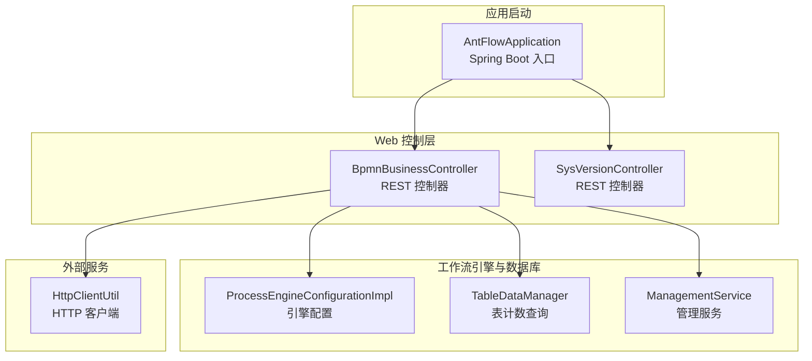
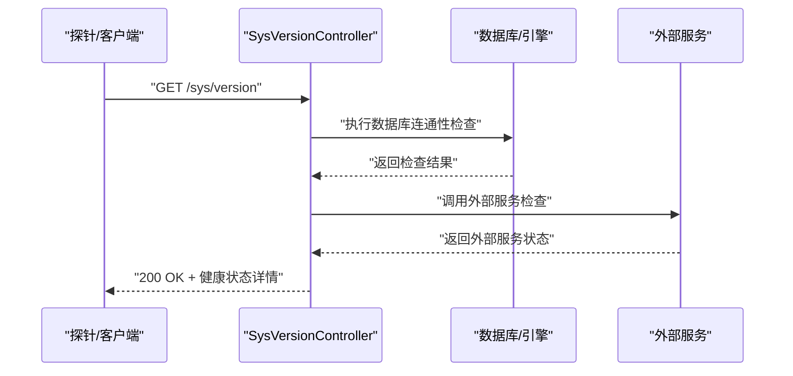
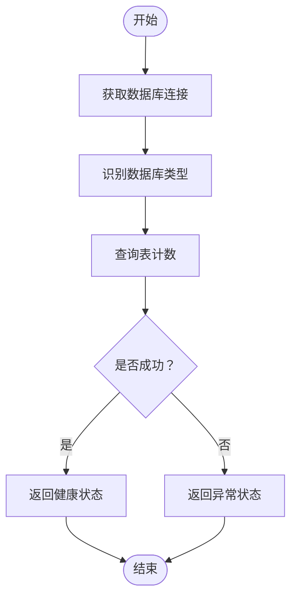
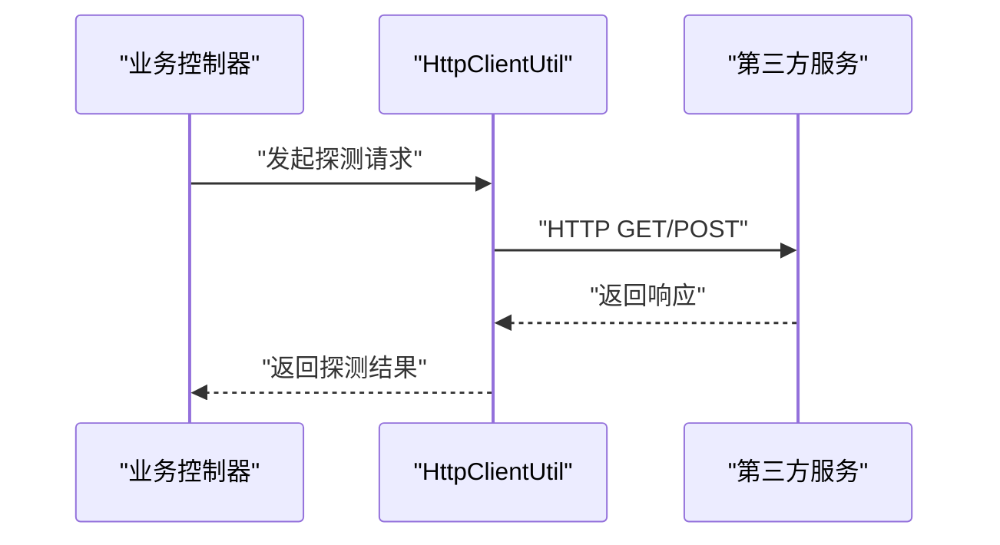
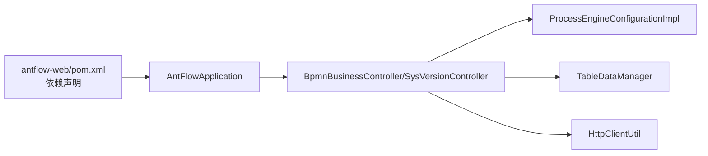

# 健康检查机制

<cite>
**本文档引用的文件**
- [AntFlowApplication.java](file://antflow-web/src/main/java/org/antflow/AntFlowApplication.java)
- [pom.xml](file://antflow-web/pom.xml)
- [SupporttedDatabaseEnum.java](file://antflow-base/src/main/java/org/openoa/base/constant/enums/SupporttedDatabaseEnum.java)
- [ProcessEngineConfigurationImpl.java](file://antflow-base/src/main/java/org/activiti/engine/impl/cfg/ProcessEngineConfigurationImpl.java)
- [TableDataManager.java](file://antflow-base/src/main/java/org/activiti/engine/impl/persistence/entity/TableDataManager.java)
- [ManagementService.java](file://antflow-base/src/main/java/org/activiti/engine/ManagementService.java)
- [HttpClientUtil.java](file://antflow-engine/src/main/java/org/openoa/engine/utils/HttpClientUtil.java)
- [BpmnBusinessController.java](file://antflow-engine/src/main/java/org/openoa/engine/bpmnconf/controller/BpmnBusinessController.java)
- [SysVersionController.java](file://antflow-engine/src/main/java/org/openoa/engine/bpmnconf/controller/SysVersionController.java)
- [12.Rest控制器.md](file://doc/系统介绍篇/12.Rest控制器.md)
- [10.外部系统集成.md](file://doc/系统介绍篇/10.外部系统集成.md)
</cite>

## 目录
1. [简介](#简介)
2. [项目结构](#项目结构)
3. [核心组件](#核心组件)
4. [架构总览](#架构总览)
5. [详细组件分析](#详细组件分析)
6. [依赖分析](#依赖分析)
7. [性能考虑](#性能考虑)
8. [故障排查指南](#故障排查指南)
9. [结论](#结论)
10. [附录](#附录)

## 简介
本文件面向健康检查机制的实现与配置，结合代码库现状，系统阐述应用的健康检查接口设计、数据库连接检查、外部服务可用性检查、系统资源监控等要点；解释健康检查的触发时机与检查频率设置思路；说明检查结果处理逻辑；并给出在容器化部署中对接 Kubernetes readinessProbe/livenessProbe 的建议与最佳实践。

需要特别说明的是：当前代码库未发现内置的 Spring Boot Actuator 健康检查端点或统一的健康检查抽象层。因此本文档基于现有代码结构，提出可落地的健康检查实现方案与配置建议，帮助在不引入额外依赖的前提下，构建可控、可观测、可运维的健康检查体系。

## 项目结构
从健康检查视角，以下模块与组件最为相关：
- 应用入口与启动：AntFlowApplication 启动 Spring Boot 应用
- Web 层控制器：提供 REST 接口，可作为健康检查的“探针”端点
- 工作流引擎与数据库：Activiti 引擎配置、数据库连接初始化、表计数查询
- 外部服务调用工具：HTTP 客户端封装，可用于外部服务可用性检查
- 版本信息控制器：可作为轻量健康“探测”端点

**图表来源**
- [AntFlowApplication.java:1-17](file://antflow-web/src/main/java/org/antflow/AntFlowApplication.java#L1-L17)
- [BpmnBusinessController.java:1-50](file://antflow-engine/src/main/java/org/openoa/engine/bpmnconf/controller/BpmnBusinessController.java#L1-L50)
- [SysVersionController.java:1-50](file://antflow-engine/src/main/java/org/openoa/engine/bpmnconf/controller/SysVersionController.java#L1-L50)
- [ProcessEngineConfigurationImpl.java:820-840](file://antflow-base/src/main/java/org/activiti/engine/impl/cfg/ProcessEngineConfigurationImpl.java#L820-L840)
- [TableDataManager.java:138-158](file://antflow-base/src/main/java/org/activiti/engine/impl/persistence/entity/TableDataManager.java#L138-L158)
- [ManagementService.java:106-141](file://antflow-base/src/main/java/org/activiti/engine/ManagementService.java#L106-L141)
- [HttpClientUtil.java:1-200](file://antflow-engine/src/main/java/org/openoa/engine/utils/HttpClientUtil.java#L1-L200)

**章节来源**
- [AntFlowApplication.java:1-17](file://antflow-web/src/main/java/org/antflow/AntFlowApplication.java#L1-L17)
- [pom.xml:20-48](file://antflow-web/pom.xml#L20-L48)

## 核心组件
- 应用入口与启动
  - 通过 Spring Boot 启动主类加载自动配置，为健康检查提供运行时上下文
- Web 控制器
  - REST 控制器可作为健康检查的“探针”端点，例如版本查询接口可承担轻量健康探测职责
- 工作流引擎与数据库
  - 引擎配置负责数据库连接初始化与类型识别
  - 表计数查询用于数据库连通性与基础可用性验证
  - 管理服务提供属性读取与命令执行能力，可用于更深入的诊断
- 外部服务调用
  - HTTP 客户端工具封装可用于对第三方接口进行可用性检查

**章节来源**
- [BpmnBusinessController.java:1-50](file://antflow-engine/src/main/java/org/openoa/engine/bpmnconf/controller/BpmnBusinessController.java#L1-L50)
- [SysVersionController.java:1-50](file://antflow-engine/src/main/java/org/openoa/engine/bpmnconf/controller/SysVersionController.java#L1-L50)
- [ProcessEngineConfigurationImpl.java:820-840](file://antflow-base/src/main/java/org/activiti/engine/impl/cfg/ProcessEngineConfigurationImpl.java#L820-L840)
- [TableDataManager.java:138-158](file://antflow-base/src/main/java/org/activiti/engine/impl/persistence/entity/TableDataManager.java#L138-L158)
- [ManagementService.java:106-141](file://antflow-base/src/main/java/org/activiti/engine/ManagementService.java#L106-L141)
- [HttpClientUtil.java:1-200](file://antflow-engine/src/main/java/org/openoa/engine/utils/HttpClientUtil.java#L1-L200)

## 架构总览
健康检查的总体思路是：以 Web 控制器作为“探针”，在请求到达时触发一系列“检查动作”，包括但不限于数据库连通性、引擎状态、外部服务可达性等。检查结果以 HTTP 状态码与响应体形式返回，供外部系统（如 Kubernetes）进行判定。

**图表来源**
- [SysVersionController.java:1-50](file://antflow-engine/src/main/java/org/openoa/engine/bpmnconf/controller/SysVersionController.java#L1-L50)
- [ProcessEngineConfigurationImpl.java:820-840](file://antflow-base/src/main/java/org/activiti/engine/impl/cfg/ProcessEngineConfigurationImpl.java#L820-L840)
- [HttpClientUtil.java:1-200](file://antflow-engine/src/main/java/org/openoa/engine/utils/HttpClientUtil.java#L1-L200)

## 详细组件分析

### 数据库连接检查
- 引擎配置初始化会尝试获取数据库连接并识别数据库类型，失败时记录错误日志
- 表计数查询可作为数据库可用性的轻量验证手段
- 管理服务提供属性读取能力，可用于读取引擎配置与运行参数

**图表来源**
- [ProcessEngineConfigurationImpl.java:820-840](file://antflow-base/src/main/java/org/activiti/engine/impl/cfg/ProcessEngineConfigurationImpl.java#L820-L840)
- [TableDataManager.java:138-158](file://antflow-base/src/main/java/org/activiti/engine/impl/persistence/entity/TableDataManager.java#L138-L158)
- [ManagementService.java:106-141](file://antflow-base/src/main/java/org/activiti/engine/ManagementService.java#L106-L141)

**章节来源**
- [ProcessEngineConfigurationImpl.java:820-840](file://antflow-base/src/main/java/org/activiti/engine/impl/cfg/ProcessEngineConfigurationImpl.java#L820-L840)
- [TableDataManager.java:138-158](file://antflow-base/src/main/java/org/activiti/engine/impl/persistence/entity/TableDataManager.java#L138-L158)
- [ManagementService.java:106-141](file://antflow-base/src/main/java/org/activiti/engine/ManagementService.java#L106-L141)

### 外部服务可用性检查
- 使用 HTTP 客户端工具对第三方接口发起轻量请求，验证网络连通与服务可达性
- 可根据业务场景选择特定的探测路径，如鉴权接口、心跳接口等

**图表来源**
- [HttpClientUtil.java:1-200](file://antflow-engine/src/main/java/org/openoa/engine/utils/HttpClientUtil.java#L1-L200)
- [BpmnBusinessController.java:1-50](file://antflow-engine/src/main/java/org/openoa/engine/bpmnconf/controller/BpmnBusinessController.java#L1-L50)

**章节来源**
- [HttpClientUtil.java:1-200](file://antflow-engine/src/main/java/org/openoa/engine/utils/HttpClientUtil.java#L1-L200)
- [BpmnBusinessController.java:1-50](file://antflow-engine/src/main/java/org/openoa/engine/bpmnconf/controller/BpmnBusinessController.java#L1-L50)

### 系统资源监控
- 当前代码库未发现专门的系统资源监控组件
- 建议通过独立的监控探针端点或外部监控系统采集 CPU、内存、线程池等指标，避免与业务接口耦合

**章节来源**
- [BpmnBusinessController.java:1-50](file://antflow-engine/src/main/java/org/openoa/engine/bpmnconf/controller/BpmnBusinessController.java#L1-L50)

### 健康检查触发时机与频率
- 触发时机
  - 外部系统（如 Kubernetes）定期向健康检查端点发起请求
  - 应用启动完成后即可对外提供健康检查
- 检查频率
  - 建议将健康检查实现为轻量级操作，避免频繁高成本检查
  - 对数据库与外部服务的检查应区分粒度与频率，避免对生产环境造成压力

**章节来源**
- [SysVersionController.java:1-50](file://antflow-engine/src/main/java/org/openoa/engine/bpmnconf/controller/SysVersionController.java#L1-L50)

### 检查结果处理逻辑
- 成功：返回 2xx 状态码与健康状态详情
- 失败：返回 5xx 状态码并包含错误原因
- 建议在响应体中包含时间戳、检查项清单、失败原因等信息，便于排障

**章节来源**
- [SysVersionController.java:1-50](file://antflow-engine/src/main/java/org/openoa/engine/bpmnconf/controller/SysVersionController.java#L1-L50)

### 自定义健康检查项
- 业务服务检查
  - 在业务控制器中增加专用的健康检查方法，调用核心业务逻辑进行轻量验证
- 第三方接口检查
  - 使用 HTTP 客户端工具对关键第三方接口进行探测，记录响应时间与状态码

**章节来源**
- [BpmnBusinessController.java:1-50](file://antflow-engine/src/main/java/org/openoa/engine/bpmnconf/controller/BpmnBusinessController.java#L1-L50)
- [HttpClientUtil.java:1-200](file://antflow-engine/src/main/java/org/openoa/engine/utils/HttpClientUtil.java#L1-L200)

### 容器化部署中的健康检查
- Kubernetes 探针配置建议
  - livenessProbe：指向健康检查端点，失败次数超过阈值时重启 Pod
  - readinessProbe：指向健康检查端点，未就绪时不接收流量
- 配置要点
  - 设置合适的 initialDelaySeconds、periodSeconds、timeoutSeconds、failureThreshold
  - 将健康检查端点与业务端点分离，避免相互影响

**章节来源**
- [SysVersionController.java:1-50](file://antflow-engine/src/main/java/org/openoa/engine/bpmnconf/controller/SysVersionController.java#L1-L50)

## 依赖分析
- 应用启动依赖 Spring Boot Web
- 控制器依赖引擎与工具类
- 引擎依赖数据库连接与表元数据查询

**图表来源**
- [pom.xml:20-48](file://antflow-web/pom.xml#L20-L48)
- [AntFlowApplication.java:1-17](file://antflow-web/src/main/java/org/antflow/AntFlowApplication.java#L1-L17)
- [BpmnBusinessController.java:1-50](file://antflow-engine/src/main/java/org/openoa/engine/bpmnconf/controller/BpmnBusinessController.java#L1-L50)
- [SysVersionController.java:1-50](file://antflow-engine/src/main/java/org/openoa/engine/bpmnconf/controller/SysVersionController.java#L1-L50)
- [ProcessEngineConfigurationImpl.java:820-840](file://antflow-base/src/main/java/org/activiti/engine/impl/cfg/ProcessEngineConfigurationImpl.java#L820-L840)
- [TableDataManager.java:138-158](file://antflow-base/src/main/java/org/activiti/engine/impl/persistence/entity/TableDataManager.java#L138-L158)
- [HttpClientUtil.java:1-200](file://antflow-engine/src/main/java/org/openoa/engine/utils/HttpClientUtil.java#L1-L200)

**章节来源**
- [pom.xml:20-48](file://antflow-web/pom.xml#L20-L48)

## 性能考虑
- 将健康检查实现为无锁、无阻塞的轻量操作
- 对数据库与外部服务的检查应避免深度扫描与长耗时操作
- 合理设置检查频率，避免对生产环境造成额外负载

## 故障排查指南
- 数据库连接失败
  - 检查引擎配置与数据库连接参数
  - 查看连接初始化日志与异常栈
- 外部服务不可达
  - 使用 HTTP 客户端工具单独验证第三方接口
  - 检查网络策略与防火墙规则
- 响应异常
  - 确认控制器返回状态码与响应体格式
  - 添加必要的日志记录以便定位问题

**章节来源**
- [ProcessEngineConfigurationImpl.java:820-840](file://antflow-base/src/main/java/org/activiti/engine/impl/cfg/ProcessEngineConfigurationImpl.java#L820-L840)
- [HttpClientUtil.java:1-200](file://antflow-engine/src/main/java/org/openoa/engine/utils/HttpClientUtil.java#L1-L200)

## 结论
当前代码库未内置统一的健康检查框架，但通过 REST 控制器与引擎/工具类的组合，可以构建出满足生产需求的健康检查机制。建议以轻量、可配置的方式实现检查项，并在容器化环境中合理配置探针参数，确保系统在异常情况下能够被及时发现与恢复。

## 附录
- 参考文档
  - REST 控制器与外部集成文档
  - 外部系统集成与安全控制说明

**章节来源**
- [12.Rest控制器.md:329-377](file://doc/系统介绍篇/12.Rest控制器.md#L329-L377)
- [10.外部系统集成.md:65-310](file://doc/系统介绍篇/10.外部系统集成.md#L65-L310)