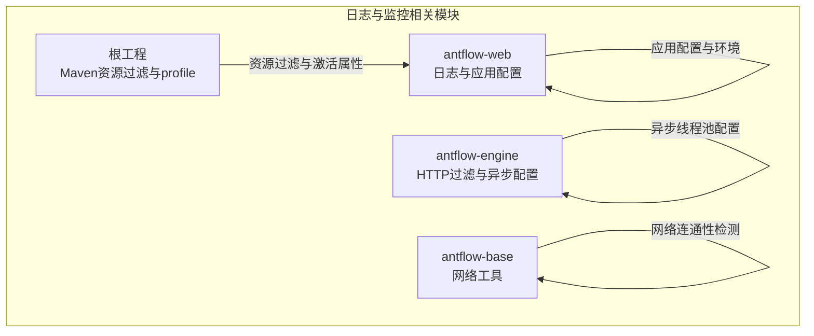
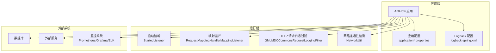
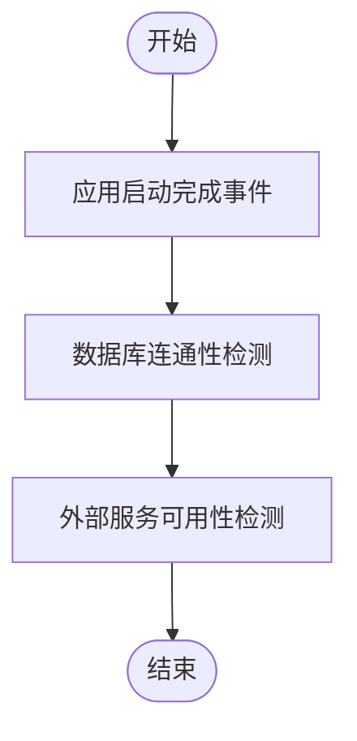
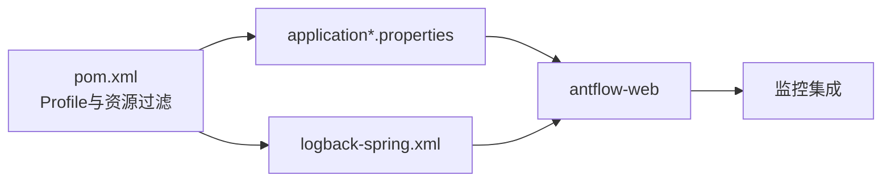

# 日志与监控

<cite>
**本文引用的文件**   
- [logback-spring.xml](file://antflow-web/src/main/resources/logback-spring.xml)
- [application.properties](file://antflow-web/src/main/resources/application.properties)
- [application-dev.properties](file://antflow-web/src/main/resources/application-dev.properties)
- [StartedListener.java](file://antflow-web/src/main/java/org/openoa/common/config/StartedListener.java)
- [RequestMappingHandlerMappingListener.java](file://antflow-web/src/main/java/org/openoa/common/config/RequestMappingHandlerMappingListener.java)
- [JiMuMDCCommonsRequestLoggingFilter.java](file://antflow-engine/src/main/java/org/openoa/engine/conf/mvc/JiMuMDCCommonsRequestLoggingFilter.java)
- [HttpClientProperties.java](file://antflow-engine/src/main/java/org/openoa/engine/vo/HttpClientProperties.java)
- [AsyncProperties.java](file://antflow-engine/src/main/java/org/openoa/engine/conf/confval/AsyncProperties.java)
- [NetworkUtil.java](file://antflow-base/src/main/java/org/openoa/base/util/NetworkUtil.java)
- [pom.xml](file://pom.xml)
</cite>

## 目录
1. [简介](#简介)
2. [项目结构](#项目结构)
3. [核心组件](#核心组件)
4. [架构总览](#架构总览)
5. [详细组件分析](#详细组件分析)
6. [依赖分析](#依赖分析)
7. [性能考虑](#性能考虑)
8. [故障排查指南](#故障排查指南)
9. [结论](#结论)
10. [附录](#附录)

## 简介
本指南聚焦于日志与监控的配置与使用，结合仓库中的实际配置与代码，提供可落地的优化建议与最佳实践。内容涵盖：
- 日志配置：Logback 结构、日志级别、输出格式、文件滚动策略
- 监控指标：系统性能、业务指标、错误率等关键指标的定义与采集思路
- 健康检查：应用自检、数据库连通性、外部服务可用性
- 日志分析：日志聚合、检索过滤、异常追踪、性能分析
- 监控集成：Prometheus、Grafana、ELK Stack 的集成方案与仪表板模板思路

## 项目结构
围绕日志与监控的关键文件与位置如下：
- 日志配置：antflow-web 模块的 Logback 配置文件
- 应用配置：application.properties 与环境配置文件
- 启动与映射监听：应用启动完成事件监听与请求映射监听
- 请求日志过滤：HTTP 请求日志过滤器
- 外部连接参数：HTTP 客户端超时与连接池参数
- 异步线程池配置：线程池容量与队列
- 健康检查工具：网络连通性检测工具
- 构建与资源过滤：Maven 资源过滤与激活属性

**图表来源**
- [logback-spring.xml:1-94](file://antflow-web/src/main/resources/logback-spring.xml#L1-L94)
- [application.properties:1-36](file://antflow-web/src/main/resources/application.properties#L1-L36)
- [application-dev.properties:1-44](file://antflow-web/src/main/resources/application-dev.properties#L1-L44)
- [JiMuMDCCommonsRequestLoggingFilter.java:90-122](file://antflow-engine/src/main/java/org/openoa/engine/conf/mvc/JiMuMDCCommonsRequestLoggingFilter.java#L90-L122)
- [AsyncProperties.java:51-105](file://antflow-engine/src/main/java/org/openoa/engine/conf/confval/AsyncProperties.java#L51-L105)
- [NetworkUtil.java:17-32](file://antflow-base/src/main/java/org/openoa/base/util/NetworkUtil.java#L17-L32)
- [pom.xml:142-172](file://pom.xml#L142-L172)

**章节来源**
- [logback-spring.xml:1-94](file://antflow-web/src/main/resources/logback-spring.xml#L1-L94)
- [application.properties:1-36](file://antflow-web/src/main/resources/application.properties#L1-L36)
- [application-dev.properties:1-44](file://antflow-web/src/main/resources/application-dev.properties#L1-L44)
- [pom.xml:142-172](file://pom.xml#L142-L172)

## 核心组件
- Logback 日志配置：集中定义日志根级别、输出格式、滚动策略，并按模块拆分错误日志、SQL 日志、慢 SQL 日志等
- 应用配置：环境切换、数据源、邮件通知、MyBatis 日志级别等
- 启动监听：应用启动成功后的日志输出与上下文路径提示
- 请求映射监听：启动完成后打印所有映射关系，辅助排障
- HTTP 请求日志过滤：基于 MDC 的请求日志记录，便于链路追踪
- 外部连接参数：HTTP 客户端超时与连接池上限，影响外部服务可用性与稳定性
- 异步线程池：线程池大小、队列容量、存活时间，影响异步任务吞吐与积压
- 健康检查工具：主机连通性检测，辅助外部服务可用性检查

**章节来源**
- [logback-spring.xml:1-94](file://antflow-web/src/main/resources/logback-spring.xml#L1-L94)
- [application.properties:1-36](file://antflow-web/src/main/resources/application.properties#L1-L36)
- [application-dev.properties:1-44](file://antflow-web/src/main/resources/application-dev.properties#L1-L44)
- [StartedListener.java:1-29](file://antflow-web/src/main/java/org/openoa/common/config/StartedListener.java#L1-L29)
- [RequestMappingHandlerMappingListener.java:1-38](file://antflow-web/src/main/java/org/openoa/common/config/RequestMappingHandlerMappingListener.java#L1-L38)
- [JiMuMDCCommonsRequestLoggingFilter.java:90-122](file://antflow-engine/src/main/java/org/openoa/engine/conf/mvc/JiMuMDCCommonsRequestLoggingFilter.java#L90-L122)
- [HttpClientProperties.java:1-46](file://antflow-engine/src/main/java/org/openoa/engine/vo/HttpClientProperties.java#L1-L46)
- [AsyncProperties.java:51-105](file://antflow-engine/src/main/java/org/openoa/engine/conf/confval/AsyncProperties.java#L51-L105)
- [NetworkUtil.java:17-32](file://antflow-base/src/main/java/org/openoa/base/util/NetworkUtil.java#L17-L32)

## 架构总览
下图展示日志与监控在系统中的位置与交互：

**图表来源**
- [StartedListener.java:1-29](file://antflow-web/src/main/java/org/openoa/common/config/StartedListener.java#L1-L29)
- [RequestMappingHandlerMappingListener.java:1-38](file://antflow-web/src/main/java/org/openoa/common/config/RequestMappingHandlerMappingListener.java#L1-L38)
- [JiMuMDCCommonsRequestLoggingFilter.java:90-122](file://antflow-engine/src/main/java/org/openoa/engine/conf/mvc/JiMuMDCCommonsRequestLoggingFilter.java#L90-L122)
- [NetworkUtil.java:17-32](file://antflow-base/src/main/java/org/openoa/base/util/NetworkUtil.java#L17-L32)
- [application-dev.properties:1-44](file://antflow-web/src/main/resources/application-dev.properties#L1-L44)

## 详细组件分析

### 日志配置（Logback）
- 配置文件结构与职责
  - 属性定义：应用名、日志根目录、业务日志目录、埋点日志目录、中间件日志目录
  - 控制台输出：统一 Pattern，包含时间、级别、线程、类名、文件行号、自定义字段
  - 文件输出：按类型拆分，分别处理错误日志、SQL 日志、慢 SQL 日志
  - 滚动策略：基于日期的时间滚动，带压缩与保留天数
  - 日志级别：根级别与特定包级别分离，便于精细化控制
- 输出格式定制
  - 使用 PatternLayoutEncoder 定义控制台与文件输出格式
  - 支持自定义转换器（如自定义消息转换器），便于扩展字段
- 文件滚动策略
  - 错误日志：仅记录 ERROR 级别，按天滚动并压缩
  - SQL 日志：记录除 ERROR 外的所有级别，按天滚动
  - 慢 SQL 日志：仅记录 ERROR 级别，按天滚动
- 最佳实践
  - 将业务日志与系统日志分离，避免互相干扰
  - 在生产环境适当提高日志级别，减少 IO 压力
  - 对敏感字段进行脱敏或屏蔽，确保合规
  - 使用结构化日志（JSON）便于后续 ELK 等系统解析

**章节来源**
- [logback-spring.xml:1-94](file://antflow-web/src/main/resources/logback-spring.xml#L1-L94)

### 应用配置（环境与数据源）
- 环境切换与资源过滤
  - 通过 Maven Profile 激活不同环境配置文件
  - application.properties 中通过占位符引用激活属性
- 数据源与连接池
  - 开发环境配置 MySQL 数据源与 Druid/Hikari 参数
  - 关注最大活跃连接、空闲等待、移除废弃连接等参数
- MyBatis 与日志
  - 设置日志实现为标准输出，便于本地调试
  - 可根据需要调整 Mapper 与实体包的日志级别
- 其他配置
  - 邮件通知与 Spring Mail 配置，便于告警通知

**章节来源**
- [application.properties:1-36](file://antflow-web/src/main/resources/application.properties#L1-L36)
- [application-dev.properties:1-44](file://antflow-web/src/main/resources/application-dev.properties#L1-L44)
- [pom.xml:142-172](file://pom.xml#L142-L172)

### 启动与映射监听
- 启动监听
  - 应用启动完成后输出服务访问地址与上下文路径，便于快速定位
- 映射监听
  - 启动完成后遍历并打印所有请求映射，辅助排查路由问题

**章节来源**
- [StartedListener.java:1-29](file://antflow-web/src/main/java/org/openoa/common/config/StartedListener.java#L1-L29)
- [RequestMappingHandlerMappingListener.java:1-38](file://antflow-web/src/main/java/org/openoa/common/config/RequestMappingHandlerMappingListener.java#L1-L38)

### HTTP 请求日志过滤（MDC）
- 功能概述
  - 基于 MDC 记录请求上下文（如用户 ID），并在请求结束后清理
  - 可选择性包含头、查询串、负载与客户端信息，便于调试
- 实践建议
  - 在开发环境开启更详细的日志记录，在生产环境谨慎开启
  - 与链路追踪系统配合，统一 traceId/parentId 字段

**章节来源**
- [JiMuMDCCommonsRequestLoggingFilter.java:90-122](file://antflow-engine/src/main/java/org/openoa/engine/conf/mvc/JiMuMDCCommonsRequestLoggingFilter.java#L90-L122)

### 外部连接参数（HTTP 客户端）
- 关键参数
  - 连接池大小、每路由最大连接、连接请求超时、建立连接超时、读取超时
- 影响与建议
  - 合理设置连接池上限与超时，避免外部服务抖动导致自身阻塞
  - 结合熔断与重试策略，提升整体可用性

**章节来源**
- [HttpClientProperties.java:1-46](file://antflow-engine/src/main/java/org/openoa/engine/vo/HttpClientProperties.java#L1-L46)

### 异步线程池配置
- 关键参数
  - 核心线程数、最大线程数、队列容量、线程存活时间、线程前缀
- 影响与建议
  - 根据业务并发与任务特性调优，避免队列积压或线程过多导致上下文切换开销
  - 结合监控指标观察拒绝策略触发频率

**章节来源**
- [AsyncProperties.java:51-105](file://antflow-engine/src/main/java/org/openoa/engine/conf/confval/AsyncProperties.java#L51-L105)

### 健康检查实现方案
- 应用健康状态检查
  - 利用启动监听确认应用已就绪
  - 结合映射监听核对路由是否正确加载
- 数据库连接检查
  - 使用网络工具类检测主机与端口连通性
  - 结合连接池参数与健康检查接口，定期探测
- 外部服务可用性检查
  - 对关键外部服务执行连通性测试
  - 结合 HTTP 客户端超时参数，避免长时间阻塞

**图表来源**
- [StartedListener.java:1-29](file://antflow-web/src/main/java/org/openoa/common/config/StartedListener.java#L1-L29)
- [NetworkUtil.java:17-32](file://antflow-base/src/main/java/org/openoa/base/util/NetworkUtil.java#L17-L32)

**章节来源**
- [StartedListener.java:1-29](file://antflow-web/src/main/java/org/openoa/common/config/StartedListener.java#L1-L29)
- [NetworkUtil.java:17-32](file://antflow-base/src/main/java/org/openoa/base/util/NetworkUtil.java#L17-L32)

## 依赖分析
- Maven Profile 与资源过滤
  - 通过 Profile 激活不同环境配置，结合资源过滤实现配置注入
- 日志与监控相关依赖
  - Logback 作为日志实现
  - Spring Boot 提供健康检查与应用事件机制
  - HTTP 客户端与连接池参数由配置驱动

**图表来源**
- [pom.xml:142-172](file://pom.xml#L142-L172)
- [application.properties:1-36](file://antflow-web/src/main/resources/application.properties#L1-L36)
- [logback-spring.xml:1-94](file://antflow-web/src/main/resources/logback-spring.xml#L1-L94)

**章节来源**
- [pom.xml:142-172](file://pom.xml#L142-L172)

## 性能考虑
- 日志性能
  - 控制台输出与文件输出分离，避免频繁 IO
  - 生产环境降低日志级别，必要时启用异步 Appender
  - 合理设置滚动策略与保留周期，避免磁盘压力
- 数据库性能
  - 连接池参数需与数据库承载能力匹配，避免过度连接
  - SQL 日志仅在调试阶段开启，生产环境关闭或降级
- 外部服务性能
  - 合理设置超时与连接池上限，避免级联故障
  - 结合熔断与限流策略，保护系统稳定

## 故障排查指南
- 启动失败
  - 查看启动监听输出的服务地址与上下文路径
  - 检查映射监听输出，确认路由是否正确加载
- 日志问题
  - 检查 Logback 配置是否生效，确认输出目录与权限
  - 核对日志级别与过滤器，确保目标日志被正确写出
- 数据库连通性
  - 使用网络工具类检测主机与端口连通性
  - 结合连接池参数与数据库状态，定位问题
- 外部服务可用性
  - 对关键外部服务执行连通性测试
  - 检查 HTTP 客户端超时与连接池配置

**章节来源**
- [StartedListener.java:1-29](file://antflow-web/src/main/java/org/openoa/common/config/StartedListener.java#L1-L29)
- [RequestMappingHandlerMappingListener.java:1-38](file://antflow-web/src/main/java/org/openoa/common/config/RequestMappingHandlerMappingListener.java#L1-L38)
- [NetworkUtil.java:17-32](file://antflow-base/src/main/java/org/openoa/base/util/NetworkUtil.java#L17-L32)
- [logback-spring.xml:1-94](file://antflow-web/src/main/resources/logback-spring.xml#L1-L94)

## 结论
通过合理的日志配置与监控策略，可以显著提升系统的可观测性与可维护性。建议在生产环境中：
- 分离业务日志与系统日志，采用结构化输出
- 合理设置日志级别与滚动策略，平衡可观测性与性能
- 健全的健康检查与外部服务可用性检测机制
- 结合 Prometheus/Grafana/ELK 等工具构建统一监控平台

## 附录

### 日志配置优化清单
- 日志级别：生产环境默认 INFO，按需临时提升至 DEBUG
- 输出格式：统一使用结构化 JSON，便于 ELK 解析
- 滚动策略：按天滚动并压缩，保留 30~90 天
- 分类输出：错误日志、SQL 日志、慢 SQL 日志分离存储
- 自定义字段：统一 ruid、traceId 等链路标识

**章节来源**
- [logback-spring.xml:1-94](file://antflow-web/src/main/resources/logback-spring.xml#L1-L94)

### 监控指标定义与采集
- 系统性能指标
  - CPU 使用率、内存占用、GC 次数与耗时
  - 线程池活跃线程数、队列长度、拒绝次数
- 业务指标
  - 接口 QPS、成功率、P95/P99 延迟
  - 业务关键流程耗时分布
- 错误率监控
  - 5xx 错误率、超时率、外部服务错误率
- 采集建议
  - 使用 Micrometer + Prometheus 暴露指标
  - Grafana 绘制仪表板，设置阈值告警

[本节为通用指导，无需具体文件引用]

### 健康检查清单
- 应用健康
  - 启动完成事件、路由映射列表
- 数据库
  - 连接池状态、主机端口连通性
- 外部服务
  - 关键服务连通性、响应延迟

**章节来源**
- [StartedListener.java:1-29](file://antflow-web/src/main/java/org/openoa/common/config/StartedListener.java#L1-L29)
- [RequestMappingHandlerMappingListener.java:1-38](file://antflow-web/src/main/java/org/openoa/common/config/RequestMappingHandlerMappingListener.java#L1-L38)
- [NetworkUtil.java:17-32](file://antflow-base/src/main/java/org/openoa/base/util/NetworkUtil.java#L17-L32)

### 监控工具集成方案（Prometheus/Grafana/ELK）
- Prometheus
  - 暴露 JVM 与业务指标，配置抓取任务
- Grafana
  - 导入通用面板模板，自定义业务看板
- ELK
  - Logstash/Fluentd 收集日志，Kibana 可视化
  - 建议使用结构化日志，提升解析效率

[本节为通用指导，无需具体文件引用]