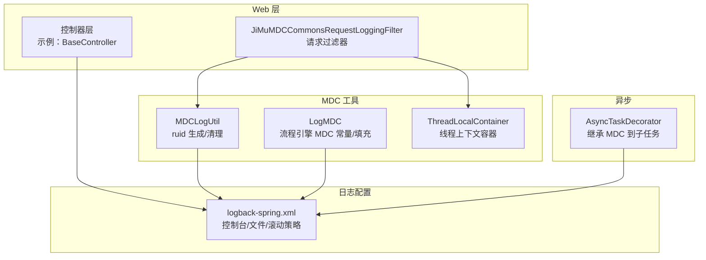
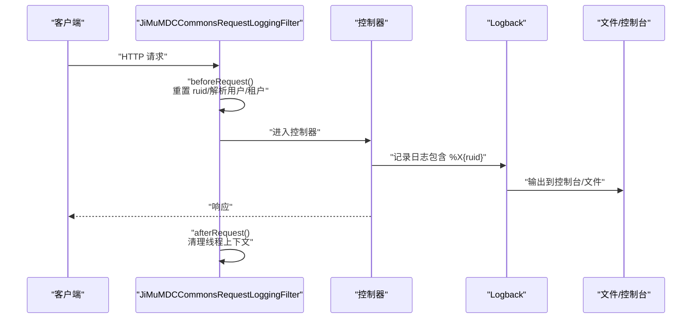
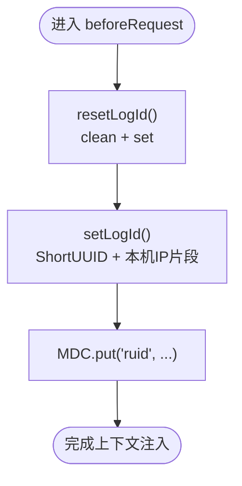
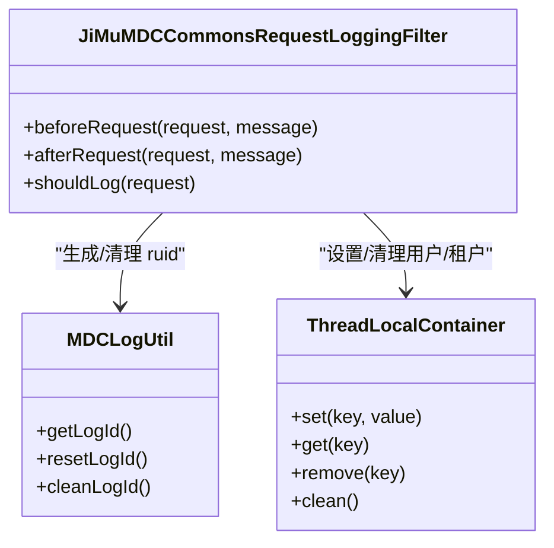
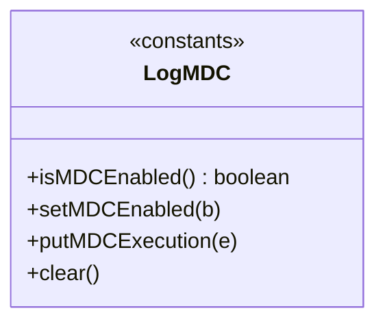
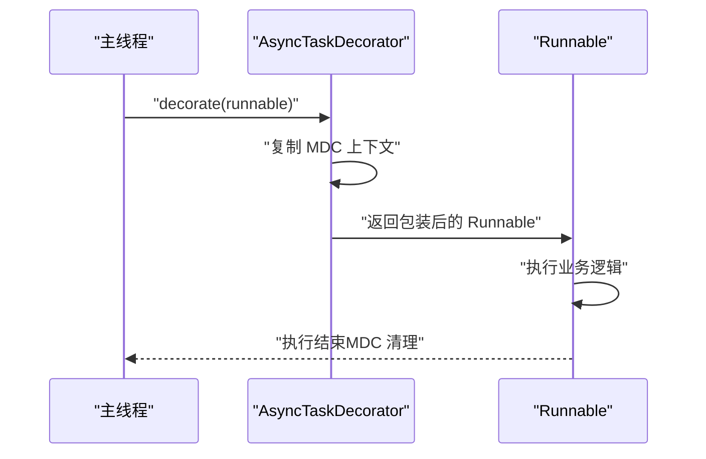
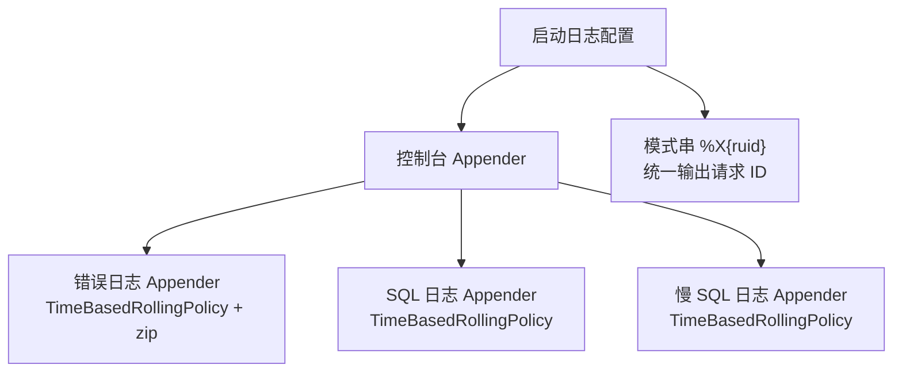
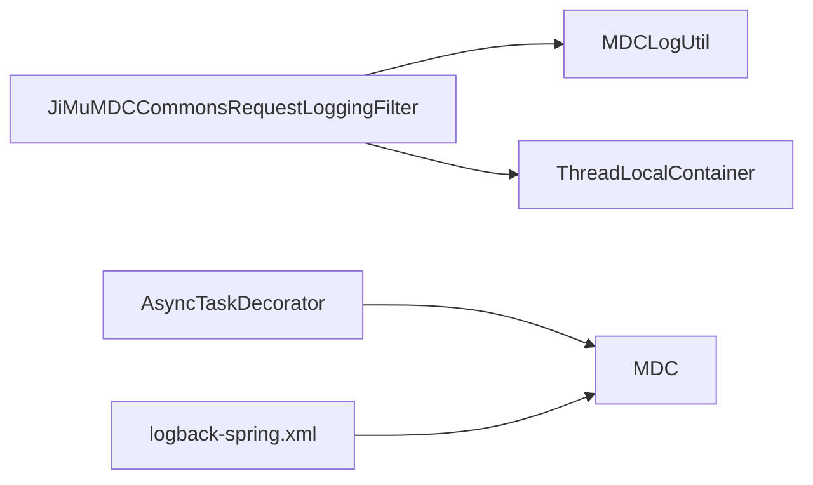

# 日志分析与追踪

<cite>
**本文引用的文件**
- [logback-spring.xml](file://antflow-web/src/main/resources/logback-spring.xml)
- [LogMDC.java](file://antflow-base/src/main/java/org/activiti/engine/logging/LogMDC.java)
- [MDCLogUtil.java](file://antflow-base/src/main/java/org/openoa/base/util/MDCLogUtil.java)
- [JiMuMDCCommonsRequestLoggingFilter.java](file://antflow-engine/src/main/java/org/openoa/engine/conf/mvc/JiMuMDCCommonsRequestLoggingFilter.java)
- [AsyncTaskDecorator.java](file://antflow-engine/src/main/java/org/openoa/engine/conf/async/AsyncTaskDecorator.java)
- [ThreadLocalContainer.java](file://antflow-base/src/main/java/org/openoa/base/util/ThreadLocalContainer.java)
- [NetworkUtil.java](file://antflow-base/src/main/java/org/openoa/base/util/NetworkUtil.java)
- [ShortUUID.java](file://antflow-base/src/main/java/org/openoa/base/util/ShortUUID.java)
- [WebConfig.java](file://antflow-web/src/main/java/org/openoa/common/config/WebConfig.java)
</cite>

## 目录
1. [简介](#简介)
2. [项目结构](#项目结构)
3. [核心组件](#核心组件)
4. [架构总览](#架构总览)
5. [组件详解](#组件详解)
6. [依赖关系分析](#依赖关系分析)
7. [性能考量](#性能考量)
8. [故障排查指南](#故障排查指南)
9. [结论](#结论)
10. [附录](#附录)

## 简介
本指南围绕日志分析与追踪在本项目中的实践展开，重点覆盖以下方面：
- MDC（映射诊断上下文）的使用：请求 ID 的生成与注入、跨线程与跨服务的日志关联。
- 分布式链路追踪：请求上下文传递、日志关联查询思路与最佳实践。
- 日志搜索与过滤：关键词、时间范围、日志级别等常用技巧。
- 日志聚合与分析：结合 ELK Stack 的集成思路、可视化与异常统计。
- 性能优化：日志采样、异步写入、压缩存储等策略。

## 项目结构
本项目采用 Spring Boot + Logback 的日志体系，核心日志配置集中在 antflow-web 模块的 logback-spring.xml；MDC 请求 ID 生成与清理由基础工具类提供；请求过滤器负责在进入控制器前后设置/清理 MDC 与线程上下文；异步任务通过 TaskDecorator 继承 MDC 上下文。

图表来源
- [logback-spring.xml:1-94](file://antflow-web/src/main/resources/logback-spring.xml#L1-L94)
- [JiMuMDCCommonsRequestLoggingFilter.java:1-123](file://antflow-engine/src/main/java/org/openoa/engine/conf/mvc/JiMuMDCCommonsRequestLoggingFilter.java#L1-L123)
- [MDCLogUtil.java:1-61](file://antflow-base/src/main/java/org/openoa/base/util/MDCLogUtil.java#L1-L61)
- [LogMDC.java:1-47](file://antflow-base/src/main/java/org/activiti/engine/logging/LogMDC.java#L1-L47)
- [AsyncTaskDecorator.java:1-30](file://antflow-engine/src/main/java/org/openoa/engine/conf/async/AsyncTaskDecorator.java#L1-L30)
- [ThreadLocalContainer.java:1-37](file://antflow-base/src/main/java/org/openoa/base/util/ThreadLocalContainer.java#L1-L37)

章节来源
- [logback-spring.xml:1-94](file://antflow-web/src/main/resources/logback-spring.xml#L1-L94)
- [JiMuMDCCommonsRequestLoggingFilter.java:1-123](file://antflow-engine/src/main/java/org/openoa/engine/conf/mvc/JiMuMDCCommonsRequestLoggingFilter.java#L1-L123)
- [MDCLogUtil.java:1-61](file://antflow-base/src/main/java/org/openoa/base/util/MDCLogUtil.java#L1-L61)
- [LogMDC.java:1-47](file://antflow-base/src/main/java/org/activiti/engine/logging/LogMDC.java#L1-L47)
- [AsyncTaskDecorator.java:1-30](file://antflow-engine/src/main/java/org/openoa/engine/conf/async/AsyncTaskDecorator.java#L1-L30)
- [ThreadLocalContainer.java:1-37](file://antflow-base/src/main/java/org/openoa/base/util/ThreadLocalContainer.java#L1-L37)

## 核心组件
- MDC 请求 ID 生成与注入：通过 MDCLogUtil 在请求进入时生成 ruid 并放入 MDC，Logback 模式中直接引用 %X{ruid} 输出。
- 请求过滤器：JiMuMDCCommonsRequestLoggingFilter 在 beforeRequest 中重置 ruid、解析用户与租户信息、设置线程上下文；afterRequest 清理线程上下文。
- 流程引擎 MDC：LogMDC 提供流程执行相关的 MDC 字段常量与填充方法，便于流程日志关联。
- 异步任务上下文继承：AsyncTaskDecorator 在子任务运行前复制父线程的 MDC 上下文，避免异步场景丢失请求上下文。
- 日志配置：logback-spring.xml 定义控制台输出、错误/慢 SQL 文件输出、滚动策略与压缩归档。

章节来源
- [MDCLogUtil.java:12-51](file://antflow-base/src/main/java/org/openoa/base/util/MDCLogUtil.java#L12-L51)
- [JiMuMDCCommonsRequestLoggingFilter.java:42-93](file://antflow-engine/src/main/java/org/openoa/engine/conf/mvc/JiMuMDCCommonsRequestLoggingFilter.java#L42-L93)
- [LogMDC.java:14-45](file://antflow-base/src/main/java/org/activiti/engine/logging/LogMDC.java#L14-L45)
- [AsyncTaskDecorator.java:10-29](file://antflow-engine/src/main/java/org/openoa/engine/conf/async/AsyncTaskDecorator.java#L10-L29)
- [logback-spring.xml:15-18](file://antflow-web/src/main/resources/logback-spring.xml#L15-L18)

## 架构总览
下图展示一次请求从进入系统到日志落盘的关键路径，以及 MDC 请求 ID 如何贯穿请求生命周期。

图表来源
- [JiMuMDCCommonsRequestLoggingFilter.java:42-101](file://antflow-engine/src/main/java/org/openoa/engine/conf/mvc/JiMuMDCCommonsRequestLoggingFilter.java#L42-L101)
- [logback-spring.xml:15-18](file://antflow-web/src/main/resources/logback-spring.xml#L15-L18)

## 组件详解

### MDC 请求 ID 生成与传递
- 生成策略：MDCLogUtil 在首次访问 ruid 时生成短 UUID，并拼接本机网卡 IP 片段，写入 MDC.ruid。
- 生命周期：请求开始前重置 ruid，确保每次请求独立；请求结束后清理线程上下文，避免内存泄漏。
- 输出方式：logback 模式字符串中使用 %X{ruid}，可在控制台与文件中统一显示。

图表来源
- [MDCLogUtil.java:30-51](file://antflow-base/src/main/java/org/openoa/base/util/MDCLogUtil.java#L30-L51)
- [ShortUUID.java:82-101](file://antflow-base/src/main/java/org/openoa/base/util/ShortUUID.java#L82-L101)
- [NetworkUtil.java:34-50](file://antflow-base/src/main/java/org/openoa/base/util/NetworkUtil.java#L34-L50)

章节来源
- [MDCLogUtil.java:12-51](file://antflow-base/src/main/java/org/openoa/base/util/MDCLogUtil.java#L12-L51)
- [ShortUUID.java:1-103](file://antflow-base/src/main/java/org/openoa/base/util/ShortUUID.java#L1-L103)
- [NetworkUtil.java:34-50](file://antflow-base/src/main/java/org/openoa/base/util/NetworkUtil.java#L34-L50)

### 请求过滤器与线程上下文
- 过滤器职责：在请求进入前设置 ruid、解析用户与租户头、构建当前用户信息并放入 ThreadLocalContainer；请求结束后清理。
- 线程上下文：ThreadLocalContainer 使用线程本地 Map 存储当前请求的用户、租户等信息，避免参数层层传递。

图表来源
- [JiMuMDCCommonsRequestLoggingFilter.java:29-122](file://antflow-engine/src/main/java/org/openoa/engine/conf/mvc/JiMuMDCCommonsRequestLoggingFilter.java#L29-L122)
- [ThreadLocalContainer.java:7-36](file://antflow-base/src/main/java/org/openoa/base/util/ThreadLocalContainer.java#L7-L36)
- [MDCLogUtil.java:10-60](file://antflow-base/src/main/java/org/openoa/base/util/MDCLogUtil.java#L10-L60)

章节来源
- [JiMuMDCCommonsRequestLoggingFilter.java:42-93](file://antflow-engine/src/main/java/org/openoa/engine/conf/mvc/JiMuMDCCommonsRequestLoggingFilter.java#L42-L93)
- [ThreadLocalContainer.java:11-32](file://antflow-base/src/main/java/org/openoa/base/util/ThreadLocalContainer.java#L11-L32)

### 流程引擎 MDC 关联
- 常量定义：LogMDC 提供流程执行相关的 MDC 键（如流程定义 ID、执行 ID、实例 ID、业务键、任务 ID），用于流程日志的跨节点关联。
- 填充逻辑：putMDCExecution 将 ActivityExecution 的关键信息写入 MDC，便于在流程各节点日志中统一识别。

图表来源
- [LogMDC.java:12-46](file://antflow-base/src/main/java/org/activiti/engine/logging/LogMDC.java#L12-L46)

章节来源
- [LogMDC.java:14-45](file://antflow-base/src/main/java/org/activiti/engine/logging/LogMDC.java#L14-L45)

### 异步任务上下文继承
- 机制：AsyncTaskDecorator 在子任务执行前复制父线程的 MDC 上下文，执行完成后清理，保证异步场景下的日志可追踪性。

图表来源
- [AsyncTaskDecorator.java:10-29](file://antflow-engine/src/main/java/org/openoa/engine/conf/async/AsyncTaskDecorator.java#L10-L29)

章节来源
- [AsyncTaskDecorator.java:12-28](file://antflow-engine/src/main/java/org/openoa/engine/conf/async/AsyncTaskDecorator.java#L12-L28)

### 日志配置与输出
- 控制台与文件：logback-spring.xml 定义控制台输出与多个文件 Appender（错误日志、SQL 日志、慢 SQL 日志）。
- 滚动与压缩：基于时间的滚动策略，按天归档并 zip 压缩，限制保留天数。
- 模式串：统一使用 %X{ruid} 输出请求 ID，便于跨服务串联。

图表来源
- [logback-spring.xml:21-94](file://antflow-web/src/main/resources/logback-spring.xml#L21-L94)
- [logback-spring.xml:15-18](file://antflow-web/src/main/resources/logback-spring.xml#L15-L18)

章节来源
- [logback-spring.xml:28-85](file://antflow-web/src/main/resources/logback-spring.xml#L28-L85)
- [logback-spring.xml:15-18](file://antflow-web/src/main/resources/logback-spring.xml#L15-L18)

## 依赖关系分析
- 组件耦合：
  - 过滤器依赖 MDCLogUtil 与 ThreadLocalContainer，负责请求上下文初始化与清理。
  - 异步装饰器依赖 MDC，确保子任务继承父线程上下文。
  - 日志配置依赖 MDC.ruid，统一输出请求 ID。
- 可能的循环依赖：当前模块间为单向依赖（过滤器→工具类，异步装饰器→MDC，配置→MDC），未见循环。
- 外部依赖：Logback、SLF4J、Spring MVC 过滤器栈。

图表来源
- [JiMuMDCCommonsRequestLoggingFilter.java:29-122](file://antflow-engine/src/main/java/org/openoa/engine/conf/mvc/JiMuMDCCommonsRequestLoggingFilter.java#L29-L122)
- [MDCLogUtil.java:10-60](file://antflow-base/src/main/java/org/openoa/base/util/MDCLogUtil.java#L10-L60)
- [ThreadLocalContainer.java:7-36](file://antflow-base/src/main/java/org/openoa/base/util/ThreadLocalContainer.java#L7-L36)
- [AsyncTaskDecorator.java:10-29](file://antflow-engine/src/main/java/org/openoa/engine/conf/async/AsyncTaskDecorator.java#L10-L29)
- [logback-spring.xml:15-18](file://antflow-web/src/main/resources/logback-spring.xml#L15-L18)

章节来源
- [JiMuMDCCommonsRequestLoggingFilter.java:42-101](file://antflow-engine/src/main/java/org/openoa/engine/conf/mvc/JiMuMDCCommonsRequestLoggingFilter.java#L42-L101)
- [AsyncTaskDecorator.java:12-28](file://antflow-engine/src/main/java/org/openoa/engine/conf/async/AsyncTaskDecorator.java#L12-L28)
- [logback-spring.xml:15-18](file://antflow-web/src/main/resources/logback-spring.xml#L15-L18)

## 性能考量
- 日志采样：对高频接口或非关键路径启用采样，降低日志量与 IO 压力。
- 异步写入：优先使用异步 Appender 或将日志转发至集中式收集器（如 Filebeat → Kafka → ES），减少阻塞。
- 压缩存储：按天滚动并压缩归档，控制磁盘占用与检索成本。
- 模式优化：避免在热点路径中进行复杂格式化与字符串拼接，保持模式串简洁。
- 过滤策略：仅在调试阶段开启详细头/体输出，生产环境关闭 payload 记录，降低开销。
- 异步任务：确保 AsyncTaskDecorator 生效，避免异步任务丢失上下文导致重复初始化 MDC。

## 故障排查指南
- 请求 ID 缺失：
  - 检查过滤器是否生效（beforeRequest 是否执行）、MDCLogUtil 是否成功写入 ruid。
  - 确认 logback 模式串是否包含 %X{ruid}。
- 线程上下文泄露：
  - 确保 afterRequest 被调用且 ThreadLocalContainer.clean() 执行。
- 异步任务日志无上下文：
  - 检查是否使用了 AsyncTaskDecorator，确认 MDC 上下文复制逻辑。
- 日志过大/磁盘爆满：
  - 检查滚动策略与保留天数配置，必要时缩短保留期或增加采样。
- SQL/慢 SQL 日志异常：
  - 核对对应 Appender 的级别与过滤器配置，确保只输出目标级别日志。

章节来源
- [JiMuMDCCommonsRequestLoggingFilter.java:96-101](file://antflow-engine/src/main/java/org/openoa/engine/conf/mvc/JiMuMDCCommonsRequestLoggingFilter.java#L96-L101)
- [AsyncTaskDecorator.java:12-28](file://antflow-engine/src/main/java/org/openoa/engine/conf/async/AsyncTaskDecorator.java#L12-L28)
- [logback-spring.xml:28-85](file://antflow-web/src/main/resources/logback-spring.xml#L28-L85)

## 结论
本项目通过 MDC 请求 ID 与统一日志配置，实现了请求级别的日志追踪；结合请求过滤器与线程上下文容器，确保了请求生命周期内的上下文一致性；异步装饰器进一步保障了异步场景下的可追踪性。配合合理的滚动与压缩策略，可在保证可观测性的同时兼顾性能与成本。

## 附录

### 日志搜索与过滤技巧
- 关键词搜索：在日志平台中按 ruid 进行精确匹配，快速定位单次请求全链路日志。
- 时间范围：限定查询时间窗口，缩小检索范围。
- 日志级别：优先使用 ERROR/ WARN 筛选异常与告警；必要时临时提升 DEBUG 以获取详细链路。
- 用户/租户维度：结合 ThreadLocalContainer 中的用户与租户信息进行二次过滤。

### 分布式链路追踪（实践建议）
- 跨服务传递：在上游服务日志中输出 ruid，在下游服务日志中同样输出 ruid，形成链路串联。
- Header 透传：在服务间调用时将 ruid 作为自定义 Header 传递，下游服务在入口处注入 MDC。
- 统一规范：制定团队内日志字段规范（如 ruid、traceId、spanId），并在所有服务中一致实现。

### ELK 集成与可视化
- 数据采集：使用 Filebeat 或 Logstash 收集日志文件，或通过应用侧直接输出到 Kafka/HTTP。
- 索引策略：按天建立索引，设置合理的字段类型（如 keyword 用于精确匹配，text 用于全文检索）。
- 可视化：在 Kibana 中创建仪表板，按 ruid 聚合请求耗时、错误率、慢请求占比等指标。

### 最佳实践清单
- 默认关闭 payload 记录，仅在调试时开启。
- 对高频接口启用采样，降低日志风暴风险。
- 使用异步写入与滚动压缩，平衡性能与存储。
- 统一日志模式串，确保 ruid 与其他关键字段可见。
- 在异步任务中使用 TaskDecorator，避免上下文丢失。