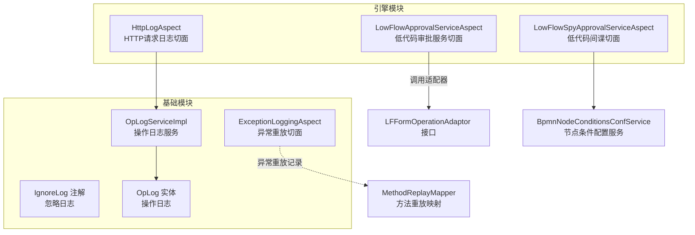
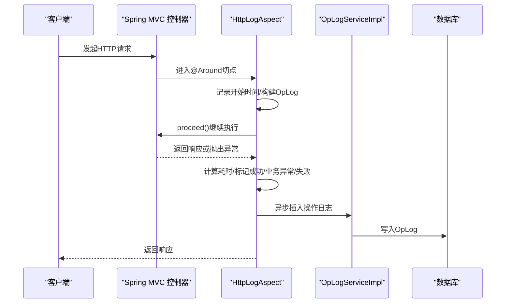
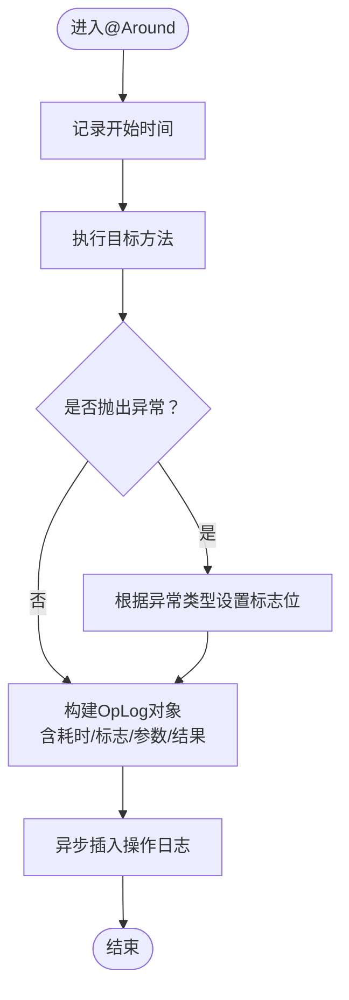
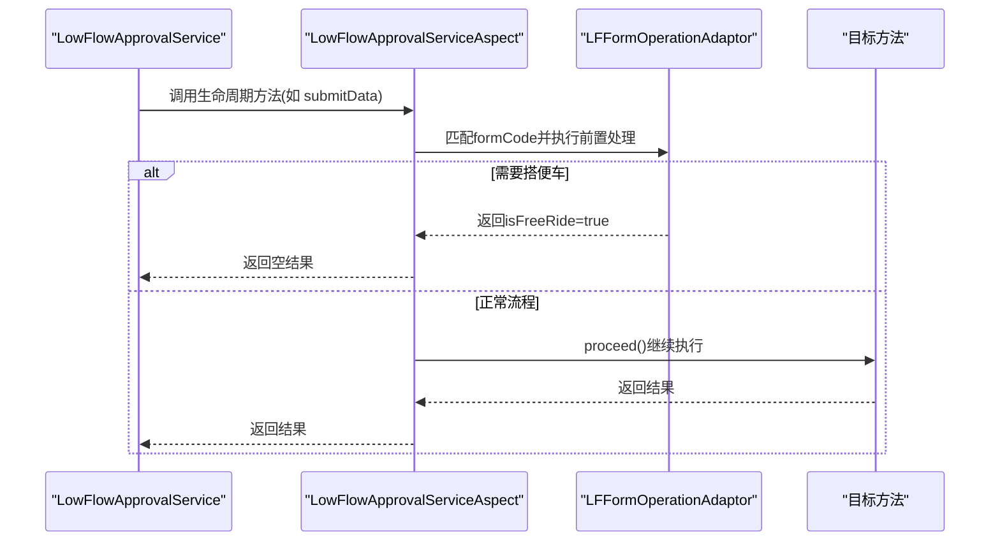
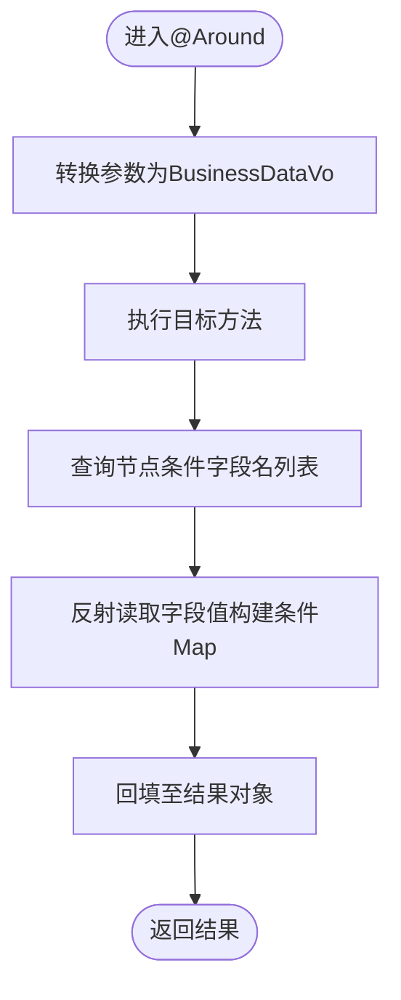
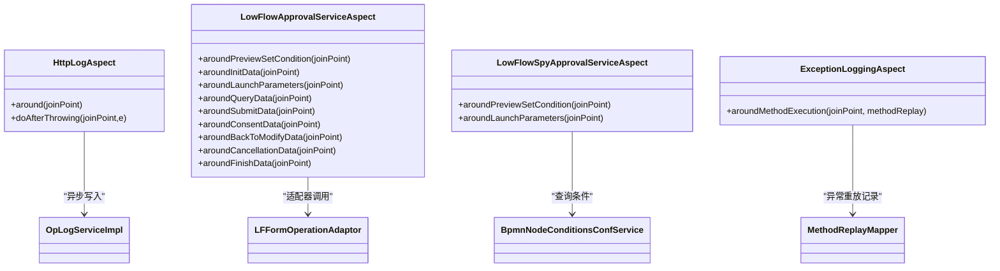

# 监控指标体系

<cite>
**本文引用的文件**
- [HttpLogAspect.java](file://antflow-engine/src/main/java/org/openoa/engine/conf/aspect/HttpLogAspect.java)
- [LowFlowApprovalServiceAspect.java](file://antflow-engine/src/main/java/org/openoa/engine/conf/aspect/LowFlowApprovalServiceAspect.java)
- [LowFlowSpyApprovalServiceAspect.java](file://antflow-engine/src/main/java/org/openoa/engine/conf/aspect/LowFlowSpyApprovalServiceAspect.java)
- [ExceptionLoggingAspect.java](file://antflow-base/src/main/java/org/openoa/base/aspect/ExceptionLoggingAspect.java)
- [IgnoreLog.java](file://antflow-base/src/main/java/org/openoa/base/interf/anno/IgnoreLog.java)
- [OpLogServiceImpl.java](file://antflow-engine/src/main/java/org/openoa/engine/bpmnconf/service/impl/OpLogServiceImpl.java)
- [OpLog.java](file://antflow-base/src/main/java/org/openoa/base/entity/OpLog.java)
- [SecurityUtils.java](file://antflow-base/src/main/java/org/openoa/base/util/SecurityUtils.java)
- [EnvUtil.java](file://antflow-base/src/main/java/org/openoa/base/util/EnvUtil.java)
- [JimuJsonUtil.java](file://antflow-base/src/main/java/org/openoa/base/util/JimuJsonUtil.java)
- [MDCLogUtil.java](file://antflow-base/src/main/java/org/openoa/base/util/MDCLogUtil.java)
- [AFBizException.java](file://antflow-base/src/main/java/org/openoa/base/exception/AFBizException.java)
- [OpLogFlagEnum.java](file://antflow-base/src/main/java/org/openoa/base/constant/enums/OpLogFlagEnum.java)
- [LFFormOperationAdaptor.java](file://antflow-base/src/main/java/org/openoa/base/interf/LFFormOperationAdaptor.java)
- [BpmnNodeConditionsConfService.java](file://antflow-engine/src/main/java/org/openoa/engine/bpmnconf/service/interf/repository/BpmnNodeConditionsConfService.java)
- [BusinessDataVo.java](file://antflow-base/src/main/java/org/openoa/base/vo/BusinessDataVo.java)
- [UDLFApplyVo.java](file://antflow-base/src/main/java/org/openoa/base/vo/UDLFApplyVo.java)
- [CommonConfig.java](file://antflow-base/src/main/java/org/openoa/base/conf/CommonConfig.java)
</cite>

## 目录
1. [简介](#简介)
2. [项目结构](#项目结构)
3. [核心组件](#核心组件)
4. [架构总览](#架构总览)
5. [详细组件分析](#详细组件分析)
6. [依赖关系分析](#依赖关系分析)
7. [性能考量](#性能考量)
8. [故障排查指南](#故障排查指南)
9. [结论](#结论)
10. [附录](#附录)

## 简介
本文件面向AntFlow工作流系统的监控指标体系设计与实现，重点解析已有的AOP监控切面：HttpLogAspect与LowFlowApprovalServiceAspect，并补充LowFlowSpyApprovalServiceAspect用于条件参数注入的监控。文档涵盖以下内容：
- 已有监控切面的实现与职责边界
- 关键业务指标的定义与采集方式（请求响应时间、错误率、业务处理成功率等）
- 数据采集方法（AOP切面、拦截器、自定义注解）
- 监控数据的存储与展示建议（异步落库、时序数据库、可视化图表）
- 指标分类与命名规范、性能基线设定方法

## 项目结构
监控相关代码主要分布在以下模块：
- antflow-engine：包含HTTP请求日志切面、低代码审批服务切面、条件参数切面等
- antflow-base：包含异常重放切面、通用注解（忽略日志）、实体与工具类

**图示来源**
- [HttpLogAspect.java:27-85](file://antflow-engine/src/main/java/org/openoa/engine/conf/aspect/HttpLogAspect.java#L27-L85)
- [LowFlowApprovalServiceAspect.java:24-162](file://antflow-engine/src/main/java/org/openoa/engine/conf/aspect/LowFlowApprovalServiceAspect.java#L24-L162)
- [LowFlowSpyApprovalServiceAspect.java:27-87](file://antflow-engine/src/main/java/org/openoa/engine/conf/aspect/LowFlowSpyApprovalServiceAspect.java#L27-L87)
- [ExceptionLoggingAspect.java:29-92](file://antflow-base/src/main/java/org/openoa/base/aspect/ExceptionLoggingAspect.java#L29-L92)
- [IgnoreLog.java:10-15](file://antflow-base/src/main/java/org/openoa/base/interf/anno/IgnoreLog.java#L10-L15)
- [OpLog.java](file://antflow-base/src/main/java/org/openoa/base/entity/OpLog.java)
- [OpLogServiceImpl.java](file://antflow-engine/src/main/java/org/openoa/engine/bpmnconf/service/impl/OpLogServiceImpl.java)

**章节来源**
- [HttpLogAspect.java:27-85](file://antflow-engine/src/main/java/org/openoa/engine/conf/aspect/HttpLogAspect.java#L27-L85)
- [LowFlowApprovalServiceAspect.java:24-162](file://antflow-engine/src/main/java/org/openoa/engine/conf/aspect/LowFlowApprovalServiceAspect.java#L24-L162)
- [LowFlowSpyApprovalServiceAspect.java:27-87](file://antflow-engine/src/main/java/org/openoa/engine/conf/aspect/LowFlowSpyApprovalServiceAspect.java#L27-L87)
- [ExceptionLoggingAspect.java:29-92](file://antflow-base/src/main/java/org/openoa/base/aspect/ExceptionLoggingAspect.java#L29-L92)
- [IgnoreLog.java:10-15](file://antflow-base/src/main/java/org/openoa/base/interf/anno/IgnoreLog.java#L10-L15)

## 核心组件
- HttpLogAspect：对控制器层进行环绕监控，统计请求耗时、记录请求参数与响应结果、区分业务异常与系统异常，并异步写入操作日志。
- LowFlowApprovalServiceAspect：对低代码审批服务的关键方法进行环绕监控，统一记录方法名、耗时、参数与返回值，同时按表单编码路由到对应的LFFormOperationAdaptor执行前置处理。
- LowFlowSpyApprovalServiceAspect：对低代码“间谍”适配器的条件预览与启动参数方法进行环绕监控，将业务数据转换为流程条件参数并回填至结果对象。
- ExceptionLoggingAspect：基于自定义注解MethodReplay，在方法抛出异常时记录类名、方法名、参数类型、参数值、异常信息等，便于后续重放与定位。

**章节来源**
- [HttpLogAspect.java:27-85](file://antflow-engine/src/main/java/org/openoa/engine/conf/aspect/HttpLogAspect.java#L27-L85)
- [LowFlowApprovalServiceAspect.java:24-162](file://antflow-engine/src/main/java/org/openoa/engine/conf/aspect/LowFlowApprovalServiceAspect.java#L24-L162)
- [LowFlowSpyApprovalServiceAspect.java:27-87](file://antflow-engine/src/main/java/org/openoa/engine/conf/aspect/LowFlowSpyApprovalServiceAspect.java#L27-L87)
- [ExceptionLoggingAspect.java:29-92](file://antflow-base/src/main/java/org/openoa/base/aspect/ExceptionLoggingAspect.java#L29-L92)

## 架构总览
监控体系采用AOP切面+异步落库的方式，形成“请求拦截—指标采集—异步存储—可观测性”的闭环。

**图示来源**
- [HttpLogAspect.java:40-85](file://antflow-engine/src/main/java/org/openoa/engine/conf/aspect/HttpLogAspect.java#L40-L85)
- [OpLogServiceImpl.java](file://antflow-engine/src/main/java/org/openoa/engine/bpmnconf/service/impl/OpLogServiceImpl.java)
- [OpLog.java](file://antflow-base/src/main/java/org/openoa/base/entity/OpLog.java)

## 详细组件分析

### HttpLogAspect 组件分析
- 职责边界
  - 对控制器层进行统一拦截，避免重复日志记录
  - 自动识别业务异常与系统异常，设置标志位
  - 异步落库，避免阻塞主请求链路
- 关键指标采集
  - 请求响应时间：通过开始时间与结束时间差计算
  - 成功/失败标志：根据异常类型区分业务异常与系统异常
  - 请求参数与响应结果：对敏感对象进行屏蔽（ServletRequest/Response/InputStreamSource），其余序列化记录
- 可观测性增强
  - 使用MDC日志ID关联一次请求的全链路日志
  - 支持@IgnoreLog注解忽略特定接口的日志

**图示来源**
- [HttpLogAspect.java:40-85](file://antflow-engine/src/main/java/org/openoa/engine/conf/aspect/HttpLogAspect.java#L40-L85)

**章节来源**
- [HttpLogAspect.java:27-85](file://antflow-engine/src/main/java/org/openoa/engine/conf/aspect/HttpLogAspect.java#L27-L85)
- [IgnoreLog.java:10-15](file://antflow-base/src/main/java/org/openoa/base/interf/anno/IgnoreLog.java#L10-L15)
- [OpLogServiceImpl.java](file://antflow-engine/src/main/java/org/openoa/engine/bpmnconf/service/impl/OpLogServiceImpl.java)
- [OpLog.java](file://antflow-base/src/main/java/org/openoa/base/entity/OpLog.java)
- [SecurityUtils.java](file://antflow-base/src/main/java/org/openoa/base/util/SecurityUtils.java)
- [EnvUtil.java](file://antflow-base/src/main/java/org/openoa/base/util/EnvUtil.java)
- [JimuJsonUtil.java](file://antflow-base/src/main/java/org/openoa/base/util/JimuJsonUtil.java)
- [MDCLogUtil.java](file://antflow-base/src/main/java/org/openoa/base/util/MDCLogUtil.java)
- [AFBizException.java](file://antflow-base/src/main/java/org/openoa/base/exception/AFBizException.java)
- [OpLogFlagEnum.java](file://antflow-base/src/main/java/org/openoa/base/constant/enums/OpLogFlagEnum.java)

### LowFlowApprovalServiceAspect 组件分析
- 职责边界
  - 对低代码审批服务的关键生命周期方法进行环绕监控
  - 按表单编码匹配对应的LFFormOperationAdaptor，执行前置处理（如查询前、提交前、同意前、初始化前、条件预览前、启动参数前、退回前、作废前、完成前）
  - 统一记录方法名、耗时、参数与返回值；支持“搭便车”快速返回
- 关键指标采集
  - 方法级耗时：记录每个生命周期方法的执行耗时
  - 方法级成功率：通过异常捕获与日志输出判断
  - 表单维度：按formCode分组统计各表单的调用次数与平均耗时
- 可观测性增强
  - 日志输出包含方法名与耗时，便于定位慢调用
  - 对异常进行统一记录，便于问题追踪

**图示来源**
- [LowFlowApprovalServiceAspect.java:76-162](file://antflow-engine/src/main/java/org/openoa/engine/conf/aspect/LowFlowApprovalServiceAspect.java#L76-L162)
- [LFFormOperationAdaptor.java](file://antflow-base/src/main/java/org/openoa/base/interf/LFFormOperationAdaptor.java)
- [UDLFApplyVo.java](file://antflow-base/src/main/java/org/openoa/base/vo/UDLFApplyVo.java)

**章节来源**
- [LowFlowApprovalServiceAspect.java:24-162](file://antflow-engine/src/main/java/org/openoa/engine/conf/aspect/LowFlowApprovalServiceAspect.java#L24-L162)
- [LFFormOperationAdaptor.java](file://antflow-base/src/main/java/org/openoa/base/interf/LFFormOperationAdaptor.java)
- [UDLFApplyVo.java](file://antflow-base/src/main/java/org/openoa/base/vo/UDLFApplyVo.java)

### LowFlowSpyApprovalServiceAspect 组件分析
- 职责边界
  - 对低代码“间谍”适配器的条件预览与启动参数方法进行环绕监控
  - 将业务数据对象转换为流程条件参数Map，并回填至结果对象
- 关键指标采集
  - 方法级耗时：记录条件参数转换过程的耗时
  - 条件参数命中率：通过查询节点条件配置服务获取字段名列表，统计有效条件数量
- 可观测性增强
  - 异常时统一抛出业务异常，避免系统异常泄露

**图示来源**
- [LowFlowSpyApprovalServiceAspect.java:32-60](file://antflow-engine/src/main/java/org/openoa/engine/conf/aspect/LowFlowSpyApprovalServiceAspect.java#L32-L60)
- [BpmnNodeConditionsConfService.java](file://antflow-engine/src/main/java/org/openoa/engine/bpmnconf/service/interf/repository/BpmnNodeConditionsConfService.java)
- [BusinessDataVo.java](file://antflow-base/src/main/java/org/openoa/base/vo/BusinessDataVo.java)

**章节来源**
- [LowFlowSpyApprovalServiceAspect.java:27-87](file://antflow-engine/src/main/java/org/openoa/engine/conf/aspect/LowFlowSpyApprovalServiceAspect.java#L27-L87)
- [BpmnNodeConditionsConfService.java](file://antflow-engine/src/main/java/org/openoa/engine/bpmnconf/service/interf/repository/BpmnNodeConditionsConfService.java)
- [BusinessDataVo.java](file://antflow-base/src/main/java/org/openoa/base/vo/BusinessDataVo.java)

### ExceptionLoggingAspect 组件分析
- 职责边界
  - 基于自定义注解MethodReplay，在方法抛出异常时记录类名、方法名、参数类型、参数值、异常信息等
  - 生成唯一ID并去重入库，支持后续重放与定位
- 关键指标采集
  - 异常发生频次：按类名+方法名+参数类型组合统计
  - 异常类型分布：按异常信息摘要统计
- 可观测性增强
  - 提供方法重放能力，辅助问题复现与回归测试

**章节来源**
- [ExceptionLoggingAspect.java:29-92](file://antflow-base/src/main/java/org/openoa/base/aspect/ExceptionLoggingAspect.java#L29-L92)

## 依赖关系分析
- HttpLogAspect
  - 依赖：OpLogServiceImpl（异步写入）、OpLog（数据模型）、SecurityUtils（登录用户）、EnvUtil（系统信息）、JimuJsonUtil（序列化）、MDCLogUtil（日志ID）、AFBizException（异常类型）、OpLogFlagEnum（标志枚举）
- LowFlowApprovalServiceAspect
  - 依赖：LFFormOperationAdaptor（适配器接口）、UDLFApplyVo（参数模型）、AFBizException（异常类型）
- LowFlowSpyApprovalServiceAspect
  - 依赖：BpmnNodeConditionsConfService（条件配置服务）、BusinessDataVo（参数模型）、AFBizException（异常类型）
- ExceptionLoggingAspect
  - 依赖：MethodReplay（注解）、MethodReplayMapper（持久化）、MethodReplayEntity（实体）

**图示来源**
- [HttpLogAspect.java:27-85](file://antflow-engine/src/main/java/org/openoa/engine/conf/aspect/HttpLogAspect.java#L27-L85)
- [LowFlowApprovalServiceAspect.java:24-162](file://antflow-engine/src/main/java/org/openoa/engine/conf/aspect/LowFlowApprovalServiceAspect.java#L24-L162)
- [LowFlowSpyApprovalServiceAspect.java:27-87](file://antflow-engine/src/main/java/org/openoa/engine/conf/aspect/LowFlowSpyApprovalServiceAspect.java#L27-L87)
- [ExceptionLoggingAspect.java:29-92](file://antflow-base/src/main/java/org/openoa/base/aspect/ExceptionLoggingAspect.java#L29-L92)

**章节来源**
- [HttpLogAspect.java:27-85](file://antflow-engine/src/main/java/org/openoa/engine/conf/aspect/HttpLogAspect.java#L27-L85)
- [LowFlowApprovalServiceAspect.java:24-162](file://antflow-engine/src/main/java/org/openoa/engine/conf/aspect/LowFlowApprovalServiceAspect.java#L24-L162)
- [LowFlowSpyApprovalServiceAspect.java:27-87](file://antflow-engine/src/main/java/org/openoa/engine/conf/aspect/LowFlowSpyApprovalServiceAspect.java#L27-L87)
- [ExceptionLoggingAspect.java:29-92](file://antflow-base/src/main/java/org/openoa/base/aspect/ExceptionLoggingAspect.java#L29-L92)

## 性能考量
- 异步落库
  - HttpLogAspect通过异步插入避免阻塞主线程，降低对业务请求的影响
- 参数序列化与脱敏
  - 对敏感对象进行屏蔽，减少日志体积与安全风险
- 切点范围
  - 仅对控制器层生效，避免对内部服务调用造成过度开销
- 适配器前置处理
  - 通过LFFormOperationAdaptor在不侵入核心流程的前提下实现可插拔的业务处理
- 异常重放
  - MethodReplay注解开启时，异常会被记录以便后续重放，提升问题定位效率

[本节为通用性能讨论，无需具体文件分析]

## 故障排查指南
- HTTP请求日志缺失
  - 检查是否被@IgnoreLog注解忽略
  - 确认切点表达式是否覆盖到目标控制器
- 异常未被MethodReplay记录
  - 确认注解开关是否开启
  - 检查MethodReplayMapper是否正确配置
- 低代码审批流程异常
  - 查看LowFlowApprovalServiceAspect日志中的方法名与耗时
  - 确认LFFormOperationAdaptor是否正确注册且formCode匹配
- 条件参数未回填
  - 检查BpmnNodeConditionsConfService是否返回了字段名列表
  - 确认BusinessDataVo中字段存在且可访问

**章节来源**
- [IgnoreLog.java:10-15](file://antflow-base/src/main/java/org/openoa/base/interf/anno/IgnoreLog.java#L10-L15)
- [ExceptionLoggingAspect.java:29-92](file://antflow-base/src/main/java/org/openoa/base/aspect/ExceptionLoggingAspect.java#L29-L92)
- [LowFlowApprovalServiceAspect.java:24-162](file://antflow-engine/src/main/java/org/openoa/engine/conf/aspect/LowFlowApprovalServiceAspect.java#L24-L162)
- [LowFlowSpyApprovalServiceAspect.java:27-87](file://antflow-engine/src/main/java/org/openoa/engine/conf/aspect/LowFlowSpyApprovalServiceAspect.java#L27-L87)

## 结论
当前监控体系以AOP切面为核心，实现了HTTP请求日志、低代码审批流程监控与异常重放功能。通过异步落库与参数脱敏，既保证了可观测性又兼顾了性能与安全。建议在此基础上引入指标埋点与可视化面板，完善关键业务指标的实时监控与告警。

[本节为总结性内容，无需具体文件分析]

## 附录

### 关键业务指标定义与采集
- 请求响应时间
  - 采集位置：HttpLogAspect
  - 指标含义：单次HTTP请求从进入切面到返回的总耗时
  - 计算方式：结束时间减去开始时间
- 错误率
  - 采集位置：HttpLogAspect（标志位）、ExceptionLoggingAspect（异常计数）
  - 指标含义：异常请求占总请求数的比例
  - 计算方式：异常次数/总次数
- 业务处理成功率
  - 采集位置：LowFlowApprovalServiceAspect（异常捕获）
  - 指标含义：低代码审批流程各阶段成功执行的比例
  - 计算方式：成功次数/总次数

**章节来源**
- [HttpLogAspect.java:40-85](file://antflow-engine/src/main/java/org/openoa/engine/conf/aspect/HttpLogAspect.java#L40-L85)
- [ExceptionLoggingAspect.java:29-92](file://antflow-base/src/main/java/org/openoa/base/aspect/ExceptionLoggingAspect.java#L29-L92)
- [LowFlowApprovalServiceAspect.java:76-162](file://antflow-engine/src/main/java/org/openoa/engine/conf/aspect/LowFlowApprovalServiceAspect.java#L76-L162)

### 数据采集方法
- AOP切面
  - HttpLogAspect：环绕控制器层，统计耗时与异常
  - LowFlowApprovalServiceAspect：环绕低代码审批生命周期方法
  - LowFlowSpyApprovalServiceAspect：环绕条件参数处理方法
  - ExceptionLoggingAspect：基于注解MethodReplay，异常时记录
- 拦截器
  - 可在Spring MVC拦截器中补充跨域、鉴权、限流等指标
- 自定义注解
  - @IgnoreLog：忽略特定接口的日志
  - @MethodReplay：开启异常重放记录

**章节来源**
- [HttpLogAspect.java:27-85](file://antflow-engine/src/main/java/org/openoa/engine/conf/aspect/HttpLogAspect.java#L27-L85)
- [LowFlowApprovalServiceAspect.java:24-162](file://antflow-engine/src/main/java/org/openoa/engine/conf/aspect/LowFlowApprovalServiceAspect.java#L24-L162)
- [LowFlowSpyApprovalServiceAspect.java:27-87](file://antflow-engine/src/main/java/org/openoa/engine/conf/aspect/LowFlowSpyApprovalServiceAspect.java#L27-L87)
- [ExceptionLoggingAspect.java:29-92](file://antflow-base/src/main/java/org/openoa/base/aspect/ExceptionLoggingAspect.java#L29-L92)
- [IgnoreLog.java:10-15](file://antflow-base/src/main/java/org/openoa/base/interf/anno/IgnoreLog.java#L10-L15)

### 监控数据存储与展示方案
- 存储
  - 操作日志：异步写入数据库（OpLog）
  - 异常重放：MethodReplayMapper持久化异常上下文
- 展示
  - 可视化图表：基于ECharts等组件展示请求耗时分布、错误率趋势、低代码流程成功率
  - 时序数据库：可选Prometheus+Grafana，采集关键指标并设置告警
- 建议
  - 对高频接口启用@IgnoreLog以降低日志量
  - 对关键业务流程增加埋点，补充成功率与耗时指标

**章节来源**
- [OpLogServiceImpl.java](file://antflow-engine/src/main/java/org/openoa/engine/bpmnconf/service/impl/OpLogServiceImpl.java)
- [ExceptionLoggingAspect.java:29-92](file://antflow-base/src/main/java/org/openoa/base/aspect/ExceptionLoggingAspect.java#L29-L92)

### 指标分类与命名规范
- 分类
  - 业务类：低代码审批成功率、表单维度耗时
  - 技术类：HTTP请求耗时、错误率、异常频次
  - 安全类：鉴权失败次数、异常登录尝试
- 命名规范
  - 指标名称：动词+名词，如“low_flow_submit_duration_ms”
  - 标签：method、form_code、status、env、version
  - 单位：毫秒(ms)、百分比(%)、次数(count)

[本节为通用规范建议，无需具体文件分析]

### 性能基线设定方法
- 基线来源
  - 历史数据：基于近30天的平均耗时与成功率
  - 业务场景：不同表单的平均耗时作为阈值参考
- 设定步骤
  - 统计各方法的P95/P99耗时
  - 设定错误率阈值（如>1%触发告警）
  - 对关键表单建立SLA基线
- 动态调整
  - 结合业务增长与系统扩容，定期更新基线

[本节为通用方法建议，无需具体文件分析]