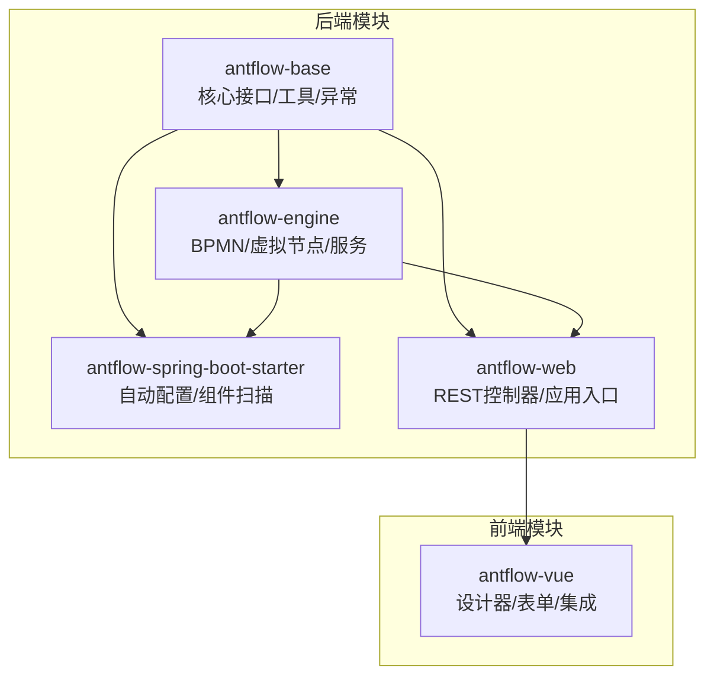
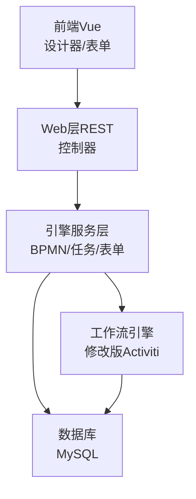
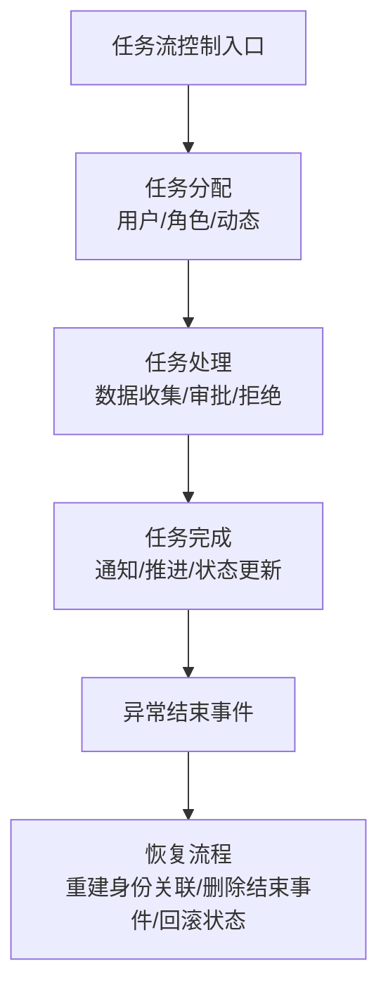
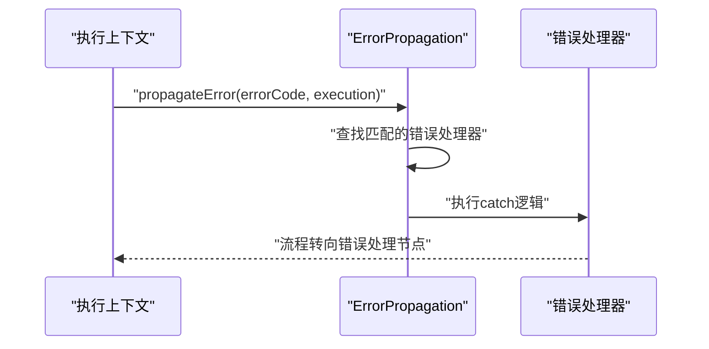
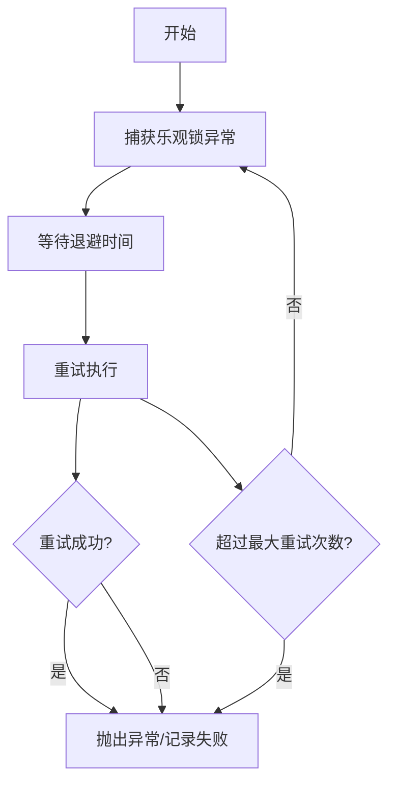
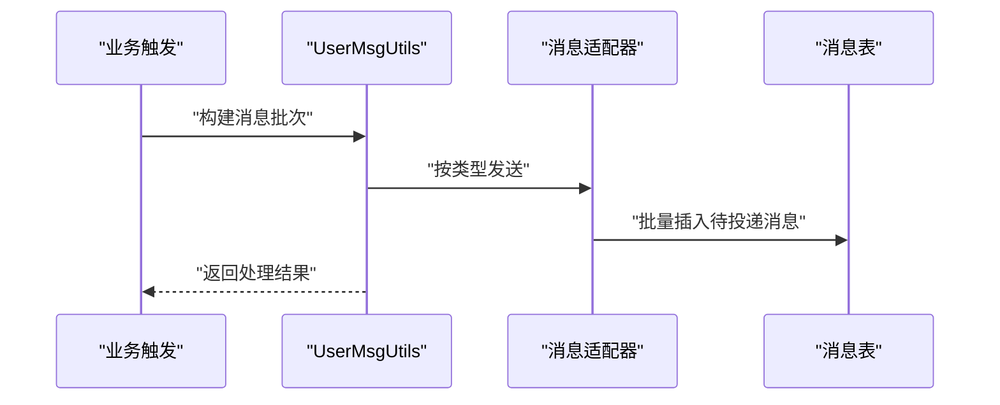
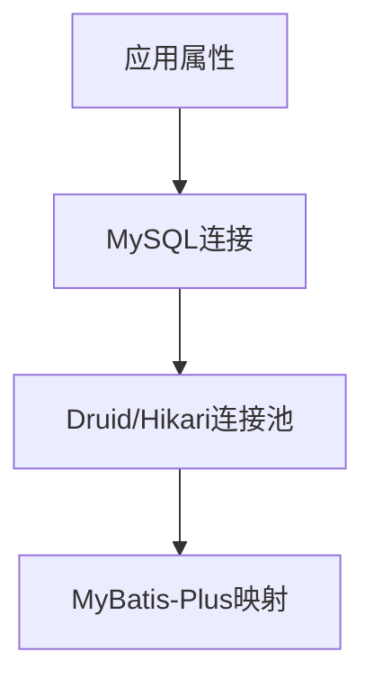
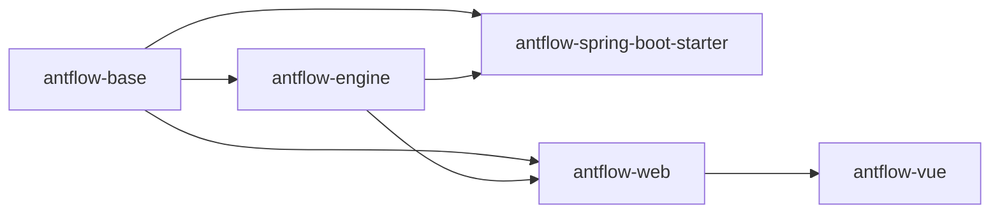

# 紧急处理预案

<cite>
**本文引用的文件**   
- [README.zh_CN.md](file://README.zh_CN.md)
- [1.AntFlow介绍.md](file://doc/系统介绍篇/1.AntFlow介绍.md)
- [4.后端系统.md](file://doc/系统介绍篇/4.后端系统.md)
- [20.开发者指南.md](file://doc/系统介绍篇/20.开发者指南.md)
- [act_init_db.sql](file://script/act_init_db.sql)
- [bpm_init_db.sql](file://script/bpm_init_db.sql)
- [application-dev.properties](file://antflow-web/src/main/resources/application-dev.properties)
- [logback-spring.xml](file://antflow-web/src/main/resources/logback-spring.xml)
- [TaskRecoverProcessImpl.java](file://antflow-engine/src/main/java/org/openoa/engine/bpmnconf/adp/processoperation/TaskRecoverProcessImpl.java)
- [RetryInterceptor.java](file://antflow-base/src/main/java/org/activiti/engine/impl/interceptor/RetryInterceptor.java)
- [Retryer.java](file://antflow-base/src/main/java/org/openoa/base/util/Retryer.java)
- [JobRetryCmd.java](file://antflow-base/src/main/java/org/activiti/engine/impl/cmd/JobRetryCmd.java)
- [ErrorPropagation.java](file://antflow-base/src/main/java/org/activiti/engine/impl/bpmn/helper/ErrorPropagation.java)
- [ErrorThrowingEventListener.java](file://antflow-base/src/main/java/org/activiti/engine/impl/bpmn/helper/ErrorThrowingEventListener.java)
- [ErrorEventDefinition.java](file://antflow-base/src/main/java/org/activiti/engine/impl/bpmn/parser/ErrorEventDefinition.java)
- [UserMsgUtils.java](file://antflow-engine/src/main/java/org/openoa/engine/utils/UserMsgUtils.java)
- [auth.js](file://antflow-vue/src/utils/auth.js)
- [login.json](file://antflow-vue/public/mock/login.json)
</cite>

## 目录
1. [简介](#简介)
2. [项目结构](#项目结构)
3. [核心组件](#核心组件)
4. [架构总览](#架构总览)
5. [详细组件分析](#详细组件分析)
6. [依赖分析](#依赖分析)
7. [性能考量](#性能考量)
8. [故障排查指南](#故障排查指南)
9. [结论](#结论)
10. [附录](#附录)

## 简介
本手册面向AntFlow企业级低代码工作流引擎平台的紧急处理与运维，围绕系统宕机、数据库故障、网络中断、安全漏洞等突发情况制定应急响应流程；明确备份恢复策略（全量/增量）、灾难恢复与恢复测试；阐述故障隔离与快速恢复手段（服务降级、熔断、故障转移、负载均衡调整）；给出安全事件处置（入侵检测、恶意攻击防护、数据泄露应对、权限恢复）方法；并提供运维工具使用指南（远程调试、性能分析、监控告警）与实用模板（应急预案、联系人清单、升级流程、事后总结报告格式）。

## 项目结构
AntFlow采用模块化Maven工程，后端由基础模块、引擎模块、Spring Boot启动器、Web模块与前端Vue模块构成。系统以修改版Activiti为核心，结合虚拟节点（VNode）与低代码表单引擎，支撑DIY与低代码两类流程开发模式。

**图表来源**
- [4.后端系统.md:7-86](file://doc/系统介绍篇/4.后端系统.md#L7-L86)
- [1.AntFlow介绍.md:77-110](file://doc/系统介绍篇/1.AntFlow介绍.md#L77-L110)

**章节来源**
- [4.后端系统.md:3-86](file://doc/系统介绍篇/4.后端系统.md#L3-L86)
- [1.AntFlow介绍.md:10-110](file://doc/系统介绍篇/1.AntFlow介绍.md#L10-L110)

## 核心组件
- 基础模块（antflow-base）：提供通用接口、工具类（如SnowFlake）、异常处理与规则引擎集成。
- 引擎模块（antflow-engine）：实现BPMN配置、流程验证、低代码表单、任务流控制、实体模型与通知适配。
- Spring Boot启动器（antflow-spring-boot-starter）：自动装配组件扫描与MyBatis Mapper扫描。
- Web模块（antflow-web）：REST控制器、应用属性与日志配置。
- 前端模块（antflow-vue）：工作流设计器、表单组件与用户认证工具。

**章节来源**
- [4.后端系统.md:88-151](file://doc/系统介绍篇/4.后端系统.md#L88-L151)
- [20.开发者指南.md:24-58](file://doc/系统介绍篇/20.开发者指南.md#L24-L58)

## 架构总览
系统采用分层架构：前端通过REST API与后端交互；后端以Spring Boot承载，使用MyBatis-Plus访问MySQL；工作流引擎基于修改版Activiti，配合虚拟节点与低代码表单实现业务解耦。

**图表来源**
- [1.AntFlow介绍.md:12-63](file://doc/系统介绍篇/1.AntFlow介绍.md#L12-L63)
- [4.后端系统.md:153-170](file://doc/系统介绍篇/4.后端系统.md#L153-L170)

**章节来源**
- [1.AntFlow介绍.md:65-110](file://doc/系统介绍篇/1.AntFlow介绍.md#L65-L110)
- [4.后端系统.md:153-170](file://doc/系统介绍篇/4.后端系统.md#L153-L170)

## 详细组件分析

### 任务流控制与恢复
任务流控制负责任务分配、处理与完成，支持用户/角色/动态分配，以及完成后的通知与流程推进。当流程异常结束时，可执行恢复流程，重建身份关联、删除历史结束事件并回滚至处理中状态。

**图表来源**
- [4.后端系统.md:252-310](file://doc/系统介绍篇/4.后端系统.md#L252-L310)
- [TaskRecoverProcessImpl.java:90-119](file://antflow-engine/src/main/java/org/openoa/engine/bpmnconf/adp/processoperation/TaskRecoverProcessImpl.java#L90-L119)

**章节来源**
- [4.后端系统.md:252-310](file://doc/系统介绍篇/4.后端系统.md#L252-L310)
- [TaskRecoverProcessImpl.java:90-119](file://antflow-engine/src/main/java/org/openoa/engine/bpmnconf/adp/processoperation/TaskRecoverProcessImpl.java#L90-L119)

### 错误传播与异常处理
系统内置错误传播机制，支持BPMN错误事件捕获与错误码映射，可在流程中定位并执行错误处理器，避免异常扩散。

**图表来源**
- [ErrorPropagation.java:59-252](file://antflow-base/src/main/java/org/activiti/engine/impl/bpmn/helper/ErrorPropagation.java#L59-L252)
- [ErrorThrowingEventListener.java:36-65](file://antflow-base/src/main/java/org/activiti/engine/impl/bpmn/helper/ErrorThrowingEventListener.java#L36-L65)
- [ErrorEventDefinition.java:37-65](file://antflow-base/src/main/java/org/activiti/engine/impl/bpmn/parser/ErrorEventDefinition.java#L37-L65)

**章节来源**
- [ErrorPropagation.java:59-252](file://antflow-base/src/main/java/org/activiti/engine/impl/bpmn/helper/ErrorPropagation.java#L59-L252)
- [ErrorThrowingEventListener.java:36-65](file://antflow-base/src/main/java/org/activiti/engine/impl/bpmn/helper/ErrorThrowingEventListener.java#L36-L65)
- [ErrorEventDefinition.java:37-65](file://antflow-base/src/main/java/org/activiti/engine/impl/bpmn/parser/ErrorEventDefinition.java#L37-L65)

### 重试与失败恢复
系统提供乐观锁冲突重试拦截器与作业重试命令，支持指数退避策略与固定等待时间，降低并发冲突导致的失败概率。

**图表来源**
- [RetryInterceptor.java:35-59](file://antflow-base/src/main/java/org/activiti/engine/impl/interceptor/RetryInterceptor.java#L35-L59)
- [Retryer.java:34-48](file://antflow-base/src/main/java/org/openoa/base/util/Retryer.java#L34-L48)
- [JobRetryCmd.java:57-87](file://antflow-base/src/main/java/org/activiti/engine/impl/cmd/JobRetryCmd.java#L57-L87)

**章节来源**
- [RetryInterceptor.java:35-59](file://antflow-base/src/main/java/org/activiti/engine/impl/interceptor/RetryInterceptor.java#L35-L59)
- [Retryer.java:34-48](file://antflow-base/src/main/java/org/openoa/base/util/Retryer.java#L34-L48)
- [JobRetryCmd.java:57-87](file://antflow-base/src/main/java/org/activiti/engine/impl/cmd/JobRetryCmd.java#L57-L87)

### 通知与消息投递
系统支持多通道消息投递（邮件/短信/站内信），通过适配器模式按发送类型批量写入消息队列或直接投递。

**图表来源**
- [UserMsgUtils.java:237-275](file://antflow-engine/src/main/java/org/openoa/engine/utils/UserMsgUtils.java#L237-L275)

**章节来源**
- [UserMsgUtils.java:237-275](file://antflow-engine/src/main/java/org/openoa/engine/utils/UserMsgUtils.java#L237-L275)

### 数据库与连接池配置
后端通过application-dev.properties配置MySQL连接、Druid/Hikari连接池参数与MyBatis-Plus映射，禁用Activiti自动建表以保证一致性。

**图表来源**
- [application-dev.properties:1-44](file://antflow-web/src/main/resources/application-dev.properties#L1-L44)

**章节来源**
- [application-dev.properties:1-44](file://antflow-web/src/main/resources/application-dev.properties#L1-L44)

### 日志与监控
Web模块使用Logback配置日志输出路径、级别与格式，便于问题定位与审计。

**章节来源**
- [logback-spring.xml:1-22](file://antflow-web/src/main/resources/logback-spring.xml#L1-L22)

## 依赖分析
模块间依赖清晰：引擎依赖基础模块，启动器依赖基础与引擎，Web依赖基础与引擎；前端通过REST API与后端交互。

**图表来源**
- [4.后端系统.md:71-85](file://doc/系统介绍篇/4.后端系统.md#L71-L85)

**章节来源**
- [4.后端系统.md:71-85](file://doc/系统介绍篇/4.后端系统.md#L71-L85)

## 性能考量
- 并发与重试：使用乐观锁重试拦截器与作业重试命令，结合指数退避降低冲突。
- 连接池：合理配置最大活跃数、空闲保持、超时与健康检查。
- 日志：生产环境控制日志级别，避免I/O瓶颈。
- 缓存：对热点数据与流程配置进行缓存，减少数据库压力。

[本节为通用指导，无需引用具体文件]

## 故障排查指南

### 系统宕机
- 快速检查：确认Web进程状态、数据库连通性与日志级别。
- 重启策略：先停后启，确保连接池回收与事务回滚。
- 恢复验证：通过REST API与前端登录验证核心功能。

**章节来源**
- [logback-spring.xml:1-22](file://antflow-web/src/main/resources/logback-spring.xml#L1-L22)
- [application-dev.properties:1-44](file://antflow-web/src/main/resources/application-dev.properties#L1-L44)

### 数据库故障
- 连接池与SQL：核对连接池参数、验证查询与DDL一致性。
- 表结构：使用初始化脚本确保ACT_*与BPM_*表存在且索引完整。
- 失败恢复：利用作业重试命令与失败等待时间策略。

**章节来源**
- [application-dev.properties:1-44](file://antflow-web/src/main/resources/application-dev.properties#L1-L44)
- [act_init_db.sql:1-470](file://script/act_init_db.sql#L1-L470)
- [bpm_init_db.sql:1-800](file://script/bpm_init_db.sql#L1-L800)
- [JobRetryCmd.java:57-87](file://antflow-base/src/main/java/org/activiti/engine/impl/cmd/JobRetryCmd.java#L57-L87)

### 网络中断
- 服务降级：对非关键接口（如通知）临时关闭或延迟处理。
- 熔断：在调用外部系统时增加熔断器，防止级联故障。
- 负载均衡：调整后端实例数量与权重，确保流量分担。

[本节为通用指导，无需引用具体文件]

### 安全事件
- 入侵检测：启用审计日志与访问日志，监控异常登录与高频请求。
- 恶意攻击防护：限制请求频率、启用WAF、校验Token有效性。
- 数据泄露应对：冻结相关账户、撤销权限、重置密钥并通知受影响用户。
- 权限恢复：回溯权限变更记录，恢复至最近安全基线。

**章节来源**
- [auth.js:1-15](file://antflow-vue/src/utils/auth.js#L1-L15)
- [login.json:1-5](file://antflow-vue/public/mock/login.json#L1-L5)

### 备份与恢复
- 策略：全量备份每日执行，增量备份每小时执行；保留至少7天全量与30天增量。
- 恢复测试：定期进行离线演练，验证备份完整性与恢复时间目标（RTO/RPO）。
- 灾难恢复：准备异地灾备站点，自动化切换与回切流程。

[本节为通用指导，无需引用具体文件]

### 故障隔离与快速恢复
- 服务降级：停止非关键通知与统计接口，优先保障审批与任务核心链路。
- 熔断机制：对外部依赖设置超时与失败阈值，快速失败避免雪崩。
- 故障转移：将异常实例摘除，流量切换至健康实例。
- 负载均衡调整：临时降低上游流量或提高后端实例数。

**章节来源**
- [RetryInterceptor.java:35-59](file://antflow-base/src/main/java/org/activiti/engine/impl/interceptor/RetryInterceptor.java#L35-L59)
- [Retryer.java:34-48](file://antflow-base/src/main/java/org/openoa/base/util/Retryer.java#L34-L48)

### 运维工具使用
- 远程调试：通过JVM参数与IDE远程连接进行断点调试。
- 性能分析：使用APM工具采集CPU、内存、线程与慢SQL；结合日志定位热点。
- 监控告警：配置Prometheus/Grafana指标与告警规则，覆盖CPU、内存、连接池、请求耗时与错误率。

[本节为通用指导，无需引用具体文件]

## 结论
通过明确的应急响应流程、完善的备份恢复策略、故障隔离与快速恢复手段，以及严格的安全事件处置规范，AntFlow能够在突发情况下快速稳定运行。建议将本文模板固化为组织级SOP，并定期演练以提升团队应急能力。

[本节为总结性内容，无需引用具体文件]

## 附录

### 应急预案模板
- 事件分类与分级
- 响应组织与职责
- 信息报告与升级流程
- 处置措施与时限要求
- 资源保障与后勤支持
- 恢复验证与复盘

[本节为模板性内容，无需引用具体文件]

### 联系人清单
- 一线值班：姓名、电话、邮箱
- 二线专家：姓名、专长、联系方式
- 三线厂商：联系人、支持热线、SLA

[本节为模板性内容，无需引用具体文件]

### 升级流程
- 变更申请与评审
- 测试验证与灰度发布
- 回滚预案与回退机制
- 上线确认与监控观察

[本节为模板性内容，无需引用具体文件]

### 事后总结报告格式
- 事件概述与影响范围
- 处置过程与关键节点
- 根因分析与改进措施
- 经验教训与制度修订

[本节为模板性内容，无需引用具体文件]