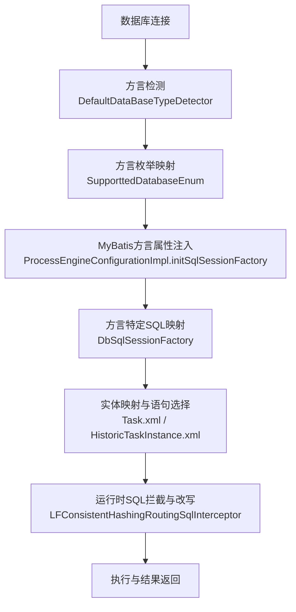
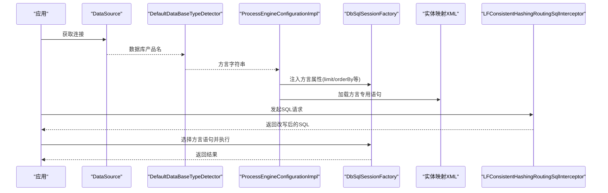
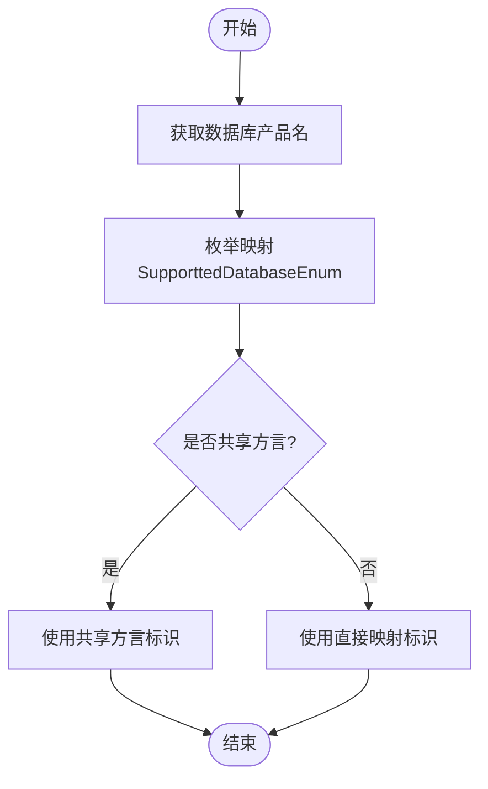
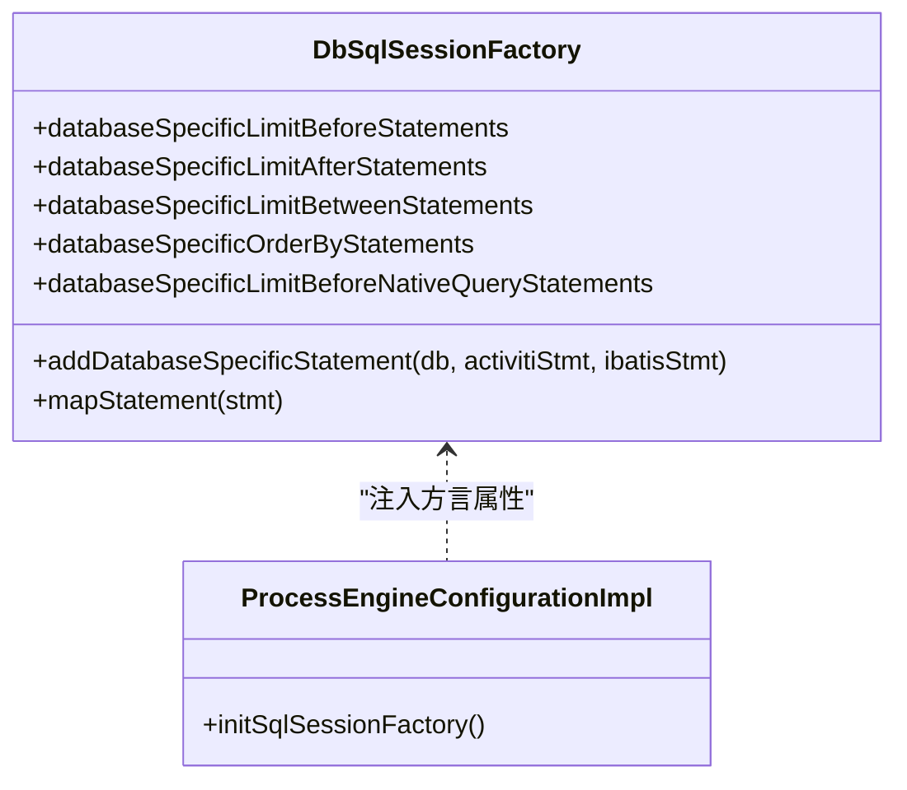
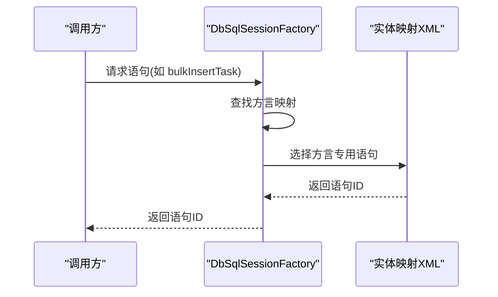
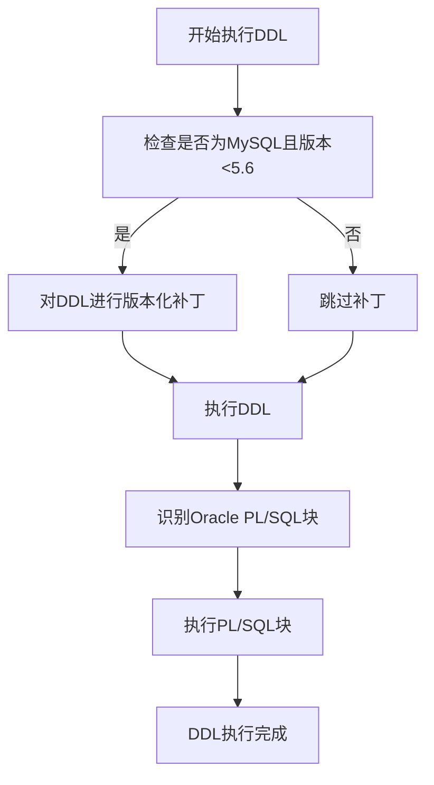
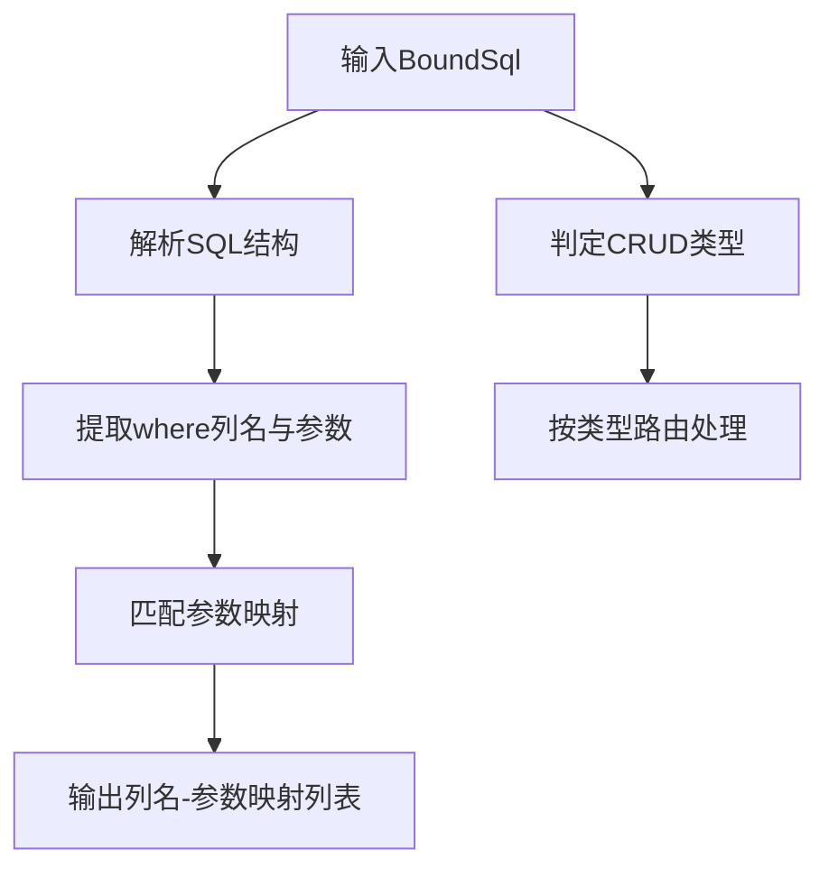
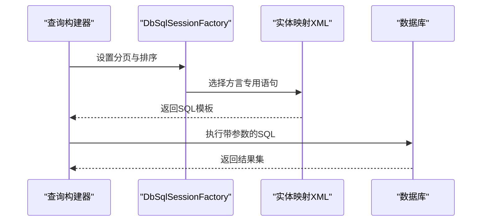
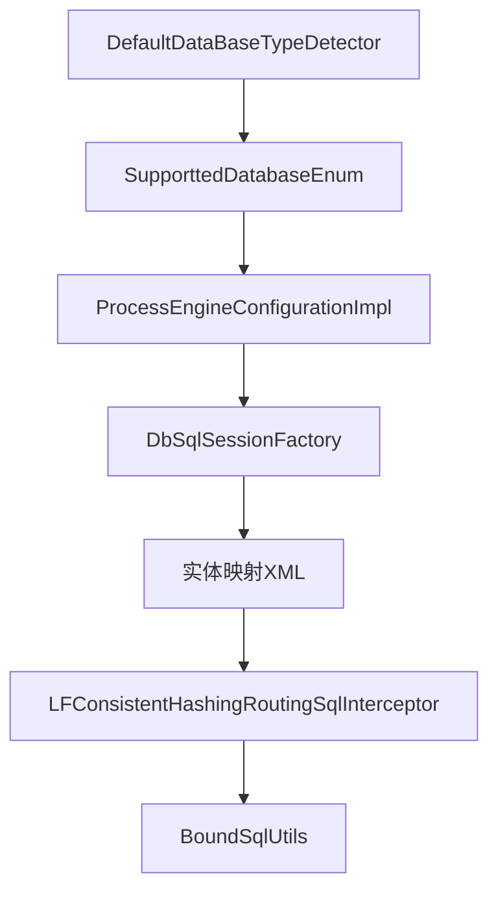

# SQL语句适配策略

<cite>
**本文档引用的文件**
- [ProcessEngineConfigurationImpl.java](file://antflow-base/src/main/java/org/activiti/engine/impl/cfg/ProcessEngineConfigurationImpl.java)
- [DbSqlSessionFactory.java](file://antflow-base/src/main/java/org/activiti/engine/impl/db/DbSqlSessionFactory.java)
- [DefaultDataBaseTypeDetector.java](file://antflow-engine/src/main/java/org/openoa/engine/conf/engineconfig/DefaultDataBaseTypeDetector.java)
- [SupporttedDatabaseEnum.java](file://antflow-base/src/main/java/org/openoa/base/constant/enums/SupporttedDatabaseEnum.java)
- [BoundSqlUtils.java](file://antflow-engine/src/main/java/org/openoa/engine/utils/BoundSqlUtils.java)
- [Task.xml](file://antflow-base/src/main/resources/org/activiti/db/mapping/entity/Task.xml)
- [HistoricTaskInstance.xml](file://antflow-base/src/main/resources/org/activiti/db/mapping/entity/HistoricTaskInstance.xml)
- [BpmBusinessProcessMapper.xml](file://antflow-engine/src/main/resources/mapper/BpmBusinessProcessMapper.xml)
- [LFConsistentHashingRoutingSqlInterceptor.java](file://antflow-engine/src/main/java/org/openoa/engine/conf/mybatis/interceptor/LFConsistentHashingRoutingSqlInterceptor.java)
- [DbSqlSession.java](file://antflow-base/src/main/java/org/activiti/engine/impl/db/DbSqlSession.java)
</cite>

## 目录
1. [简介](#简介)
2. [项目结构](#项目结构)
3. [核心组件](#核心组件)
4. [架构总览](#架构总览)
5. [详细组件分析](#详细组件分析)
6. [依赖关系分析](#依赖关系分析)
7. [性能考量](#性能考量)
8. [故障排查指南](#故障排查指南)
9. [结论](#结论)
10. [附录](#附录)

## 简介
本文件系统性阐述 AntFlow 在多数据库环境下对 SQL 语句的适配策略，覆盖 DDL/DML 语句适配、存储过程适配、数据库方言映射机制、SQL 动态生成与替换策略，以及工作流引擎中关键 SQL（流程实例查询、任务查询、历史数据查询）的适配方案。同时提供最佳实践、跨数据库兼容性测试方法与自定义 SQL 适配器开发指南。

## 项目结构
AntFlow 的 SQL 适配能力由以下层次构成：
- 方言检测与映射：通过数据库产品名识别与枚举映射，确定具体数据库类型。
- MyBatis 适配层：基于方言设置 limit/offset、排序、原生查询包装等。
- SQL 语句映射：针对不同数据库提供专用语句（如 Oracle 批量插入、MySQL 临时表规避更新限制）。
- 运行时拦截与改写：对 SQL 进行解析、改写与路由（如分表场景）。
- 关键实体映射：任务、历史任务等实体在不同数据库下的 DML 语句适配。

**图表来源**
- [DefaultDataBaseTypeDetector.java:14-46](file://antflow-engine/src/main/java/org/openoa/engine/conf/engineconfig/DefaultDataBaseTypeDetector.java#L14-L46)
- [SupporttedDatabaseEnum.java:1-39](file://antflow-base/src/main/java/org/openoa/base/constant/enums/SupporttedDatabaseEnum.java#L1-L39)
- [ProcessEngineConfigurationImpl.java:858-892](file://antflow-base/src/main/java/org/activiti/engine/impl/cfg/ProcessEngineConfigurationImpl.java#L858-L892)
- [DbSqlSessionFactory.java:41-204](file://antflow-base/src/main/java/org/activiti/engine/impl/db/DbSqlSessionFactory.java#L41-L204)
- [Task.xml:78-105](file://antflow-base/src/main/resources/org/activiti/db/mapping/entity/Task.xml#L78-L105)
- [HistoricTaskInstance.xml:541-582](file://antflow-base/src/main/resources/org/activiti/db/mapping/entity/HistoricTaskInstance.xml#L541-L582)
- [LFConsistentHashingRoutingSqlInterceptor.java:350-385](file://antflow-engine/src/main/java/org/openoa/engine/conf/mybatis/interceptor/LFConsistentHashingRoutingSqlInterceptor.java#L350-L385)

**章节来源**
- [DefaultDataBaseTypeDetector.java:1-48](file://antflow-engine/src/main/java/org/openoa/engine/conf/engineconfig/DefaultDataBaseTypeDetector.java#L1-L48)
- [SupporttedDatabaseEnum.java:1-39](file://antflow-base/src/main/java/org/openoa/base/constant/enums/SupporttedDatabaseEnum.java#L1-L39)
- [ProcessEngineConfigurationImpl.java:858-892](file://antflow-base/src/main/java/org/activiti/engine/impl/cfg/ProcessEngineConfigurationImpl.java#L858-L892)
- [DbSqlSessionFactory.java:41-204](file://antflow-base/src/main/java/org/activiti/engine/impl/db/DbSqlSessionFactory.java#L41-L204)

## 核心组件
- 方言检测与映射
  - 通过 JDBC 数据库产品名识别数据库类型，并映射到内部方言常量。
  - 支持 MySQL/MariaDB、PostgreSQL、Oracle、H2、DB2 等主流数据库。
- MyBatis 方言属性注入
  - 将方言相关的 limit/offset、排序、原生查询包装等属性注入到 MyBatis 配置。
- 方言特定 SQL 映射
  - 针对不同数据库注册专用语句（如 Oracle 批量插入、MySQL 临时表规避更新限制）。
- 实体映射与语句选择
  - 在实体映射文件中为不同数据库提供专用语句，自动按方言选择。
- SQL 解析与改写
  - 对 SQL 进行解析，提取 where 条件列与参数，支持 CRUD 判定与注释剥离。
- 运行时拦截与路由
  - 对 SQL 进行拦截，支持表名重写、分组/排序校验、插入/更新语句改写等。

**章节来源**
- [DefaultDataBaseTypeDetector.java:14-46](file://antflow-engine/src/main/java/org/openoa/engine/conf/engineconfig/DefaultDataBaseTypeDetector.java#L14-L46)
- [ProcessEngineConfigurationImpl.java:858-892](file://antflow-base/src/main/java/org/activiti/engine/impl/cfg/ProcessEngineConfigurationImpl.java#L858-L892)
- [DbSqlSessionFactory.java:288-305](file://antflow-base/src/main/java/org/activiti/engine/impl/db/DbSqlSessionFactory.java#L288-L305)
- [Task.xml:78-105](file://antflow-base/src/main/resources/org/activiti/db/mapping/entity/Task.xml#L78-L105)
- [BoundSqlUtils.java:31-79](file://antflow-engine/src/main/java/org/openoa/engine/utils/BoundSqlUtils.java#L31-L79)
- [LFConsistentHashingRoutingSqlInterceptor.java:350-385](file://antflow-engine/src/main/java/org/openoa/engine/conf/mybatis/interceptor/LFConsistentHashingRoutingSqlInterceptor.java#L350-L385)

## 架构总览
下图展示 SQL 适配从连接建立到执行的关键路径，包括方言检测、属性注入、语句映射与执行拦截。

**图表来源**
- [DefaultDataBaseTypeDetector.java:14-46](file://antflow-engine/src/main/java/org/openoa/engine/conf/engineconfig/DefaultDataBaseTypeDetector.java#L14-L46)
- [ProcessEngineConfigurationImpl.java:858-892](file://antflow-base/src/main/java/org/activiti/engine/impl/cfg/ProcessEngineConfigurationImpl.java#L858-L892)
- [DbSqlSessionFactory.java:41-204](file://antflow-base/src/main/java/org/activiti/engine/impl/db/DbSqlSessionFactory.java#L41-L204)
- [Task.xml:78-105](file://antflow-base/src/main/resources/org/activiti/db/mapping/entity/Task.xml#L78-L105)
- [LFConsistentHashingRoutingSqlInterceptor.java:350-385](file://antflow-engine/src/main/java/org/openoa/engine/conf/mybatis/interceptor/LFConsistentHashingRoutingSqlInterceptor.java#L350-L385)

## 详细组件分析

### 组件A：方言检测与映射机制
- 方案概述
  - 通过 JDBC 元数据获取数据库产品名，映射为内部方言标识。
  - 提供自定义枚举支持 OceanBase、openGauss、达梦、金仓、南大通用、PolarDB、MongoDB、TiDB 等。
- 关键点
  - 支持“共享方言”映射（如 OceanBase 映射为 Oracle，Kingbase 映射为 PostgreSQL）。
  - 若无法识别，抛出异常提示无法推断数据库类型。
- 最佳实践
  - 在生产环境明确配置驱动与连接信息，确保能正确识别数据库产品名。
  - 对于兼容性相近的数据库，优先使用共享方言以复用适配逻辑。

**图表来源**
- [DefaultDataBaseTypeDetector.java:14-46](file://antflow-engine/src/main/java/org/openoa/engine/conf/engineconfig/DefaultDataBaseTypeDetector.java#L14-L46)
- [SupporttedDatabaseEnum.java:1-39](file://antflow-base/src/main/java/org/openoa/base/constant/enums/SupporttedDatabaseEnum.java#L1-L39)

**章节来源**
- [DefaultDataBaseTypeDetector.java:14-46](file://antflow-engine/src/main/java/org/openoa/engine/conf/engineconfig/DefaultDataBaseTypeDetector.java#L14-L46)
- [SupporttedDatabaseEnum.java:1-39](file://antflow-base/src/main/java/org/openoa/base/constant/enums/SupporttedDatabaseEnum.java#L1-L39)

### 组件B：MyBatis 方言属性注入与 SQL 生成
- 方案概述
  - 初始化 MyBatis 会话工厂时，根据方言设置 limitBefore/limitAfter/limitBetween、orderBy、原生查询包装等属性。
  - 通过静态映射表为不同数据库注册专用 SQL 片段与语句别名。
- 关键点
  - 不同数据库的分页语法差异（如 Oracle 的 ROWNUM、DB2/SQL Server 的 ROW_NUMBER）通过属性注入解决。
  - 原生查询（native query）在不同数据库下采用不同的包装前缀。
- 最佳实践
  - 在新增数据库支持时，同步完善 limit/orderBy 与原生查询包装映射。
  - 避免在 SQL 中硬编码分页语法，统一通过属性注入。

**图表来源**
- [DbSqlSessionFactory.java:33-80](file://antflow-base/src/main/java/org/activiti/engine/impl/db/DbSqlSessionFactory.java#L33-L80)
- [ProcessEngineConfigurationImpl.java:858-892](file://antflow-base/src/main/java/org/activiti/engine/impl/cfg/ProcessEngineConfigurationImpl.java#L858-L892)

**章节来源**
- [DbSqlSessionFactory.java:41-204](file://antflow-base/src/main/java/org/activiti/engine/impl/db/DbSqlSessionFactory.java#L41-L204)
- [ProcessEngineConfigurationImpl.java:858-892](file://antflow-base/src/main/java/org/activiti/engine/impl/cfg/ProcessEngineConfigurationImpl.java#L858-L892)

### 组件C：实体映射与 DML 语句适配
- 方案概述
  - 在实体映射 XML 中为不同数据库提供专用语句（如 Oracle 批量插入、MySQL 临时表规避更新限制）。
  - 通过语句别名映射，运行时按方言选择对应语句。
- 关键点
  - Oracle 批量插入使用 INSERT ALL INTO 语法并附加 dual。
  - MySQL 针对“更新子查询目标表”的限制，采用临时表包裹规避。
- 最佳实践
  - 为每种数据库提供专用语句，避免跨库兼容性问题。
  - 对批量插入进行性能评估，必要时启用或禁用批量插入映射。

**图表来源**
- [DbSqlSessionFactory.java:288-305](file://antflow-base/src/main/java/org/activiti/engine/impl/db/DbSqlSessionFactory.java#L288-L305)
- [Task.xml:78-105](file://antflow-base/src/main/resources/org/activiti/db/mapping/entity/Task.xml#L78-L105)

**章节来源**
- [DbSqlSessionFactory.java:288-305](file://antflow-base/src/main/java/org/activiti/engine/impl/db/DbSqlSessionFactory.java#L288-L305)
- [Task.xml:78-105](file://antflow-base/src/main/resources/org/activiti/db/mapping/entity/Task.xml#L78-L105)

### 组件D：DDL 语句适配与存储过程支持
- 方案概述
  - 在执行 DDL 资源脚本时，针对 MySQL 版本低于 5.6 的场景进行特殊处理。
  - 对 Oracle PL/SQL 块进行识别与执行，支持 begin/end 与斜杠结尾的块。
- 关键点
  - DDL 执行前根据数据库类型进行条件化处理。
  - Oracle PL/SQL 块通过状态机识别，避免错误拆分 SQL。
- 最佳实践
  - 在部署前确认目标数据库版本，必要时预处理 DDL。
  - 存储过程与 PL/SQL 块需单独测试，确保语法与权限满足要求。

**图表来源**
- [DbSqlSession.java:1241-1269](file://antflow-base/src/main/java/org/activiti/engine/impl/db/DbSqlSession.java#L1241-L1269)
- [DbSqlSession.java:1295-1328](file://antflow-base/src/main/java/org/activiti/engine/impl/db/DbSqlSession.java#L1295-L1328)

**章节来源**
- [DbSqlSession.java:1241-1269](file://antflow-base/src/main/java/org/activiti/engine/impl/db/DbSqlSession.java#L1241-L1269)
- [DbSqlSession.java:1295-1328](file://antflow-base/src/main/java/org/activiti/engine/impl/db/DbSqlSession.java#L1295-L1328)

### 组件E：SQL 解析与动态生成/替换
- 方案概述
  - 使用 SQL 解析器提取 BoundSql 中 where 条件的列名与参数映射，支持 CRUD 判定与注释剥离。
  - 运行时拦截器可对 SQL 进行改写（如表名重写、分组/排序校验、插入/更新语句改写）。
- 关键点
  - 解析 where 条件表达式树，提取参数绑定列名。
  - 识别 CRUD 类型，便于后续策略处理。
- 最佳实践
  - 在复杂查询中谨慎使用函数与表达式，避免解析失败。
  - 对动态 SQL 的 where 条件进行单元测试，确保参数绑定正确。

**图表来源**
- [BoundSqlUtils.java:31-79](file://antflow-engine/src/main/java/org/openoa/engine/utils/BoundSqlUtils.java#L31-L79)
- [BoundSqlUtils.java:148-158](file://antflow-engine/src/main/java/org/openoa/engine/utils/BoundSqlUtils.java#L148-L158)

**章节来源**
- [BoundSqlUtils.java:31-79](file://antflow-engine/src/main/java/org/openoa/engine/utils/BoundSqlUtils.java#L31-L79)
- [BoundSqlUtils.java:148-158](file://antflow-engine/src/main/java/org/openoa/engine/utils/BoundSqlUtils.java#L148-L158)

### 组件F：工作流引擎关键 SQL 适配
- 流程实例查询
  - 通过方言属性注入 limit/orderBy，保证分页与排序一致性。
- 任务查询
  - 使用方言专用语句与 where 条件拼接，支持 LIKE 与通配符转义。
- 历史数据查询
  - 历史任务查询同样遵循方言属性注入与通配符转义规则。
- 最佳实践
  - 对 LIKE 查询统一使用通配符转义变量，避免数据库差异导致的匹配问题。
  - 分页查询必须配合方言属性注入，确保性能与一致性。

**图表来源**
- [DbSqlSessionFactory.java:41-80](file://antflow-base/src/main/java/org/activiti/engine/impl/db/DbSqlSessionFactory.java#L41-L80)
- [HistoricTaskInstance.xml:541-582](file://antflow-base/src/main/resources/org/activiti/db/mapping/entity/HistoricTaskInstance.xml#L541-L582)
- [HistoricTaskInstance.xml:677-707](file://antflow-base/src/main/resources/org/activiti/db/mapping/entity/HistoricTaskInstance.xml#L677-L707)

**章节来源**
- [DbSqlSessionFactory.java:41-80](file://antflow-base/src/main/java/org/activiti/engine/impl/db/DbSqlSessionFactory.java#L41-L80)
- [HistoricTaskInstance.xml:541-582](file://antflow-base/src/main/resources/org/activiti/db/mapping/entity/HistoricTaskInstance.xml#L541-L582)
- [HistoricTaskInstance.xml:677-707](file://antflow-base/src/main/resources/org/activiti/db/mapping/entity/HistoricTaskInstance.xml#L677-L707)

## 依赖关系分析
- 方言检测依赖 JDBC 元数据，映射依赖枚举与配置。
- MyBatis 方言属性注入依赖方言映射表与配置加载。
- 实体映射依赖方言语句别名映射。
- 运行时拦截器依赖 SQL 解析器与语句改写规则。

**图表来源**
- [DefaultDataBaseTypeDetector.java:14-46](file://antflow-engine/src/main/java/org/openoa/engine/conf/engineconfig/DefaultDataBaseTypeDetector.java#L14-L46)
- [SupporttedDatabaseEnum.java:1-39](file://antflow-base/src/main/java/org/openoa/base/constant/enums/SupporttedDatabaseEnum.java#L1-L39)
- [ProcessEngineConfigurationImpl.java:858-892](file://antflow-base/src/main/java/org/activiti/engine/impl/cfg/ProcessEngineConfigurationImpl.java#L858-L892)
- [DbSqlSessionFactory.java:41-204](file://antflow-base/src/main/java/org/activiti/engine/impl/db/DbSqlSessionFactory.java#L41-L204)
- [LFConsistentHashingRoutingSqlInterceptor.java:350-385](file://antflow-engine/src/main/java/org/openoa/engine/conf/mybatis/interceptor/LFConsistentHashingRoutingSqlInterceptor.java#L350-L385)
- [BoundSqlUtils.java:31-79](file://antflow-engine/src/main/java/org/openoa/engine/utils/BoundSqlUtils.java#L31-L79)

**章节来源**
- [DefaultDataBaseTypeDetector.java:14-46](file://antflow-engine/src/main/java/org/openoa/engine/conf/engineconfig/DefaultDataBaseTypeDetector.java#L14-L46)
- [SupporttedDatabaseEnum.java:1-39](file://antflow-base/src/main/java/org/openoa/base/constant/enums/SupporttedDatabaseEnum.java#L1-L39)
- [ProcessEngineConfigurationImpl.java:858-892](file://antflow-base/src/main/java/org/activiti/engine/impl/cfg/ProcessEngineConfigurationImpl.java#L858-L892)
- [DbSqlSessionFactory.java:41-204](file://antflow-base/src/main/java/org/activiti/engine/impl/db/DbSqlSessionFactory.java#L41-L204)
- [LFConsistentHashingRoutingSqlInterceptor.java:350-385](file://antflow-engine/src/main/java/org/openoa/engine/conf/mybatis/interceptor/LFConsistentHashingRoutingSqlInterceptor.java#L350-L385)
- [BoundSqlUtils.java:31-79](file://antflow-engine/src/main/java/org/openoa/engine/utils/BoundSqlUtils.java#L31-L79)

## 性能考量
- 批量插入
  - 针对 Oracle 的事件日志实体禁用批量插入，避免特定场景下的性能或兼容性问题。
- 分页与排序
  - 通过方言属性注入统一分页语法，避免在 SQL 中硬编码，提升可维护性与性能。
- SQL 解析
  - BoundSql 解析仅用于参数绑定与 where 列名提取，避免对复杂表达式过度解析。

**章节来源**
- [DbSqlSessionFactory.java:321-336](file://antflow-base/src/main/java/org/activiti/engine/impl/db/DbSqlSessionFactory.java#L321-L336)

## 故障排查指南
- 无法识别数据库类型
  - 检查 JDBC 驱动与连接信息，确认数据库产品名可被正确获取。
  - 参考异常提示，定位方言映射失败原因。
- 分页/排序不生效
  - 确认方言属性注入是否正确，检查 limitBefore/limitAfter/orderBy 是否按预期设置。
- LIKE 查询匹配异常
  - 检查通配符转义变量是否正确传入，避免数据库差异导致的模糊匹配问题。
- Oracle PL/SQL 块执行失败
  - 确认 PL/SQL 块语法与分隔符（begin/end 与斜杠），避免错误拆分。
- SQL 改写异常
  - 检查拦截器对 SQL 的改写逻辑，确保表名重写、分组/排序校验正确。

**章节来源**
- [ProcessEngineConfigurationImpl.java:820-844](file://antflow-base/src/main/java/org/activiti/engine/impl/cfg/ProcessEngineConfigurationImpl.java#L820-L844)
- [HistoricTaskInstance.xml:643-674](file://antflow-base/src/main/resources/org/activiti/db/mapping/entity/HistoricTaskInstance.xml#L643-L674)
- [HistoricTaskInstance.xml:677-707](file://antflow-base/src/main/resources/org/activiti/db/mapping/entity/HistoricTaskInstance.xml#L677-L707)
- [DbSqlSession.java:1295-1328](file://antflow-base/src/main/java/org/activiti/engine/impl/db/DbSqlSession.java#L1295-L1328)
- [LFConsistentHashingRoutingSqlInterceptor.java:350-385](file://antflow-engine/src/main/java/org/openoa/engine/conf/mybatis/interceptor/LFConsistentHashingRoutingSqlInterceptor.java#L350-L385)

## 结论
AntFlow 通过“方言检测 → 属性注入 → 语句映射 → 运行时拦截”的完整链路实现了对多数据库的 SQL 适配。该策略在保证功能一致性的同时兼顾了性能与可维护性。建议在新数据库接入时严格遵循现有映射与拦截机制，并结合实际业务场景进行针对性优化。

## 附录

### 最佳实践清单
- 在新增数据库支持时，完善方言映射表与实体专用语句。
- 使用方言属性注入替代硬编码分页与排序语法。
- 对 LIKE 查询统一使用通配符转义变量。
- 对批量插入进行性能评估，必要时禁用或调整。
- 对复杂 SQL 进行单元测试，确保参数绑定与解析正确。

### 跨数据库兼容性测试方法
- 准备多数据库实例（MySQL、PostgreSQL、Oracle、SQL Server、DB2 等）。
- 针对关键查询（流程实例、任务、历史数据）编写测试用例。
- 验证分页、排序、LIKE、通配符转义等功能在各数据库下的一致性。
- 对 DDL/存储过程进行版本化测试，确保兼容性。

### 自定义 SQL 适配器开发指南
- 扩展方言映射表，添加新的 limit/orderBy/原生查询包装。
- 在实体映射 XML 中新增方言专用语句，并通过语句别名映射关联。
- 如需运行时改写，实现拦截器逻辑，确保对 SQL 的解析与改写正确。
- 编写单元测试与集成测试，覆盖关键业务场景。