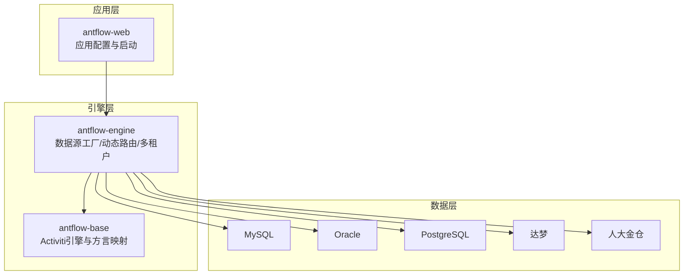
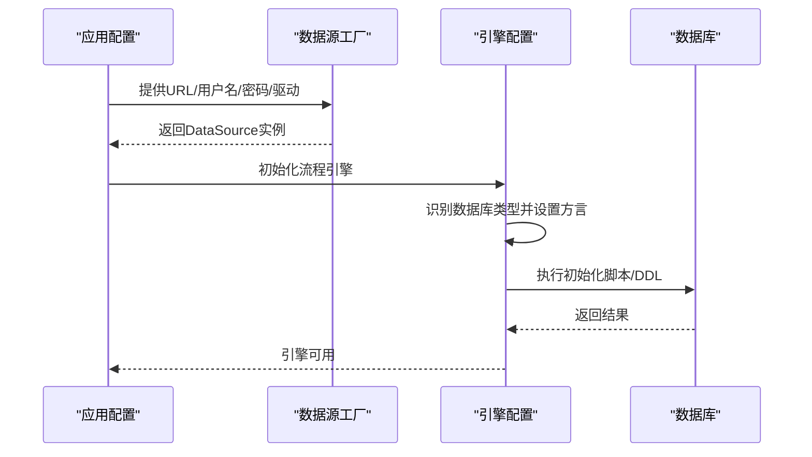
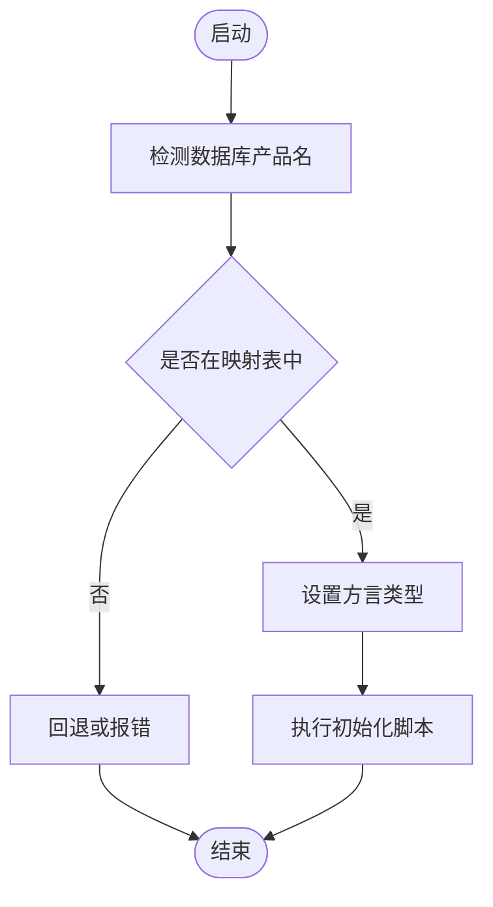
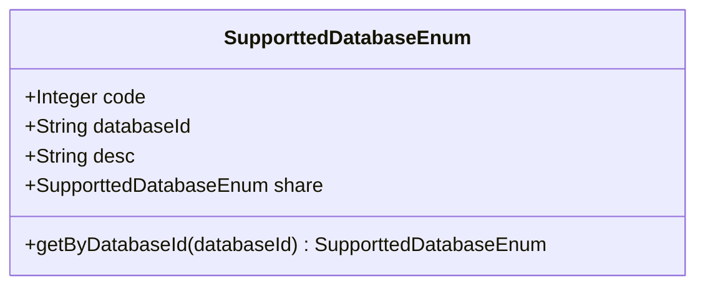
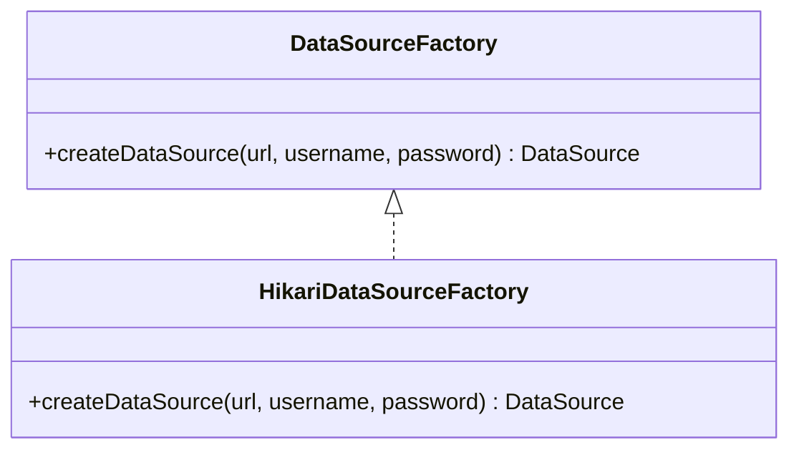
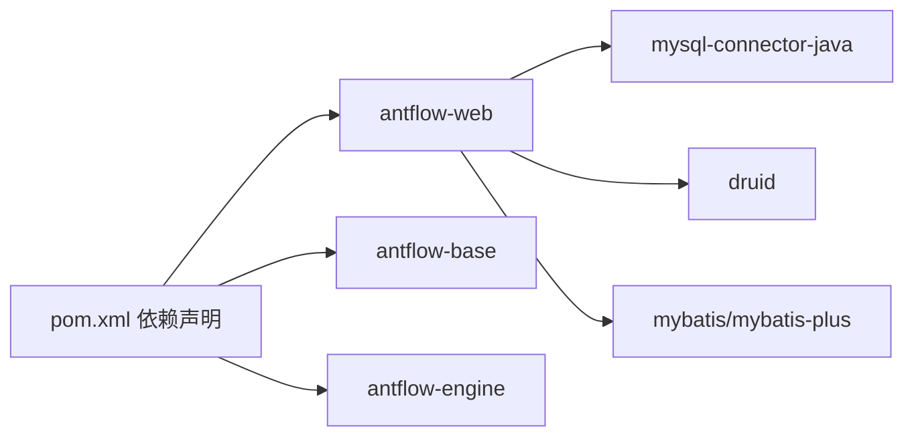

# 多数据库支持与适配

<cite>
**本文档引用的文件**
- [pom.xml](file://pom.xml)
- [application.properties](file://antflow-web/src/main/resources/application.properties)
- [application-dev.properties](file://antflow-web/src/main/resources/application-dev.properties)
- [DataSourceFactory.java](file://antflow-engine/src/main/java/org/openoa/engine/conf/engineconfig/DataSourceFactory.java)
- [HikariDataSourceFactory.java](file://antflow-engine/src/main/java/org/openoa/engine/conf/engineconfig/HikariDataSourceFactory.java)
- [ProcessEngineConfigurationImpl.java](file://antflow-base/src/main/java/org/activiti/engine/impl/cfg/ProcessEngineConfigurationImpl.java)
- [SupporttedDatabaseEnum.java](file://antflow-base/src/main/java/org/openoa/base/constant/enums/SupporttedDatabaseEnum.java)
- [act_init_db.sql](file://script/act_init_db.sql)
- [bpm_init_db.sql](file://script/bpm_init_db.sql)
- [bpm_init_db_data.sql](file://script/bpm_init_db_data.sql)
</cite>

## 目录
1. [简介](#简介)
2. [项目结构](#项目结构)
3. [核心组件](#核心组件)
4. [架构总览](#架构总览)
5. [详细组件分析](#详细组件分析)
6. [依赖关系分析](#依赖关系分析)
7. [性能考虑](#性能考虑)
8. [故障排除指南](#故障排除指南)
9. [结论](#结论)
10. [附录](#附录)

## 简介
本文件面向AntFlow工作流引擎在多数据库环境下的适配与部署，系统梳理其对MySQL、Oracle、PostgreSQL、达梦、人大金仓等数据库的支持现状与适配策略，重点说明数据库方言识别机制、SQL适配要点、连接池配置差异，以及数据库特性对工作流引擎（如事务隔离、锁机制、序列生成）的影响。同时提供数据库切换步骤、兼容性测试方法、性能对比分析建议及各数据库的部署配置示例与最佳实践。

## 项目结构
AntFlow采用多模块结构，核心与数据库适配相关的模块包括：
- antflow-base：Activiti引擎实现与数据库方言映射
- antflow-engine：连接池工厂、动态数据源与多租户适配
- antflow-web：Spring Boot应用配置与数据库连接参数
- script：初始化脚本（含Activiti与业务表）

**图表来源**
- [pom.xml](file://pom.xml)
- [application-dev.properties](file://antflow-web/src/main/resources/application-dev.properties)

**章节来源**
- [pom.xml](file://pom.xml)
- [application.properties](file://antflow-web/src/main/resources/application.properties)
- [application-dev.properties](file://antflow-web/src/main/resources/application-dev.properties)

## 核心组件
- 数据库方言识别与映射：通过Activiti的ProcessEngineConfiguration实现数据库类型映射，覆盖Oracle、PostgreSQL、SQL Server等主流数据库。
- 支持的数据库枚举：统一管理支持的数据库类型，包含MySQL、Oracle、PostgreSQL、SQL Server、OceanBase、openGauss、达梦、Polardb、人大金仓、南大通用、MongoDB、TiDB等。
- 数据源工厂与连接池：提供DataSourceFactory接口与HikariDataSourceFactory默认实现；当前示例使用Druid连接池配置，Hikari作为可选替代。
- 初始化脚本：提供Activiti与业务表的初始化SQL，确保不同数据库下表结构一致。

**章节来源**
- [ProcessEngineConfigurationImpl.java](file://antflow-base/src/main/java/org/activiti/engine/impl/cfg/ProcessEngineConfigurationImpl.java)
- [SupporttedDatabaseEnum.java](file://antflow-base/src/main/java/org/openoa/base/constant/enums/SupporttedDatabaseEnum.java)
- [DataSourceFactory.java](file://antflow-engine/src/main/java/org/openoa/engine/conf/engineconfig/DataSourceFactory.java)
- [HikariDataSourceFactory.java](file://antflow-engine/src/main/java/org/openoa/engine/conf/engineconfig/HikariDataSourceFactory.java)
- [act_init_db.sql](file://script/act_init_db.sql)
- [bpm_init_db.sql](file://script/bpm_init_db.sql)
- [bpm_init_db_data.sql](file://script/bpm_init_db_data.sql)

## 架构总览
AntFlow在运行时通过以下路径完成数据库适配：
- 应用配置层：读取spring.datasource.*与连接池参数，选择对应驱动与URL
- 引擎适配层：根据数据库类型映射与方言识别，选择合适的SQL方言
- 初始化层：执行初始化脚本，创建工作流引擎所需的表结构

**图表来源**
- [application-dev.properties](file://antflow-web/src/main/resources/application-dev.properties)
- [HikariDataSourceFactory.java](file://antflow-engine/src/main/java/org/openoa/engine/conf/engineconfig/HikariDataSourceFactory.java)
- [ProcessEngineConfigurationImpl.java](file://antflow-base/src/main/java/org/activiti/engine/impl/cfg/ProcessEngineConfigurationImpl.java)

## 详细组件分析

### 数据库方言识别与适配
- 方言映射：引擎内部维护数据库类型到方言类型的映射，覆盖Oracle、PostgreSQL、SQL Server、DB2等。
- 类型识别：通过数据库产品名称进行匹配，确保在不同数据库环境下使用正确的SQL方言。
- 兼容性影响：不同数据库的SQL语法、函数、序列/自增差异会影响工作流引擎的DDL/DML执行。

**图表来源**
- [ProcessEngineConfigurationImpl.java](file://antflow-base/src/main/java/org/activiti/engine/impl/cfg/ProcessEngineConfigurationImpl.java)

**章节来源**
- [ProcessEngineConfigurationImpl.java](file://antflow-base/src/main/java/org/activiti/engine/impl/cfg/ProcessEngineConfigurationImpl.java)

### 支持的数据库类型与共享关系
- 支持列表：MySQL、Oracle、PostgreSQL、SQL Server、OceanBase、openGauss、达梦、Polardb、人大金仓、南大通用、MongoDB、TiDB。
- 共享关系：某些数据库通过“共享”关系指向其兼容的上游数据库（如OceanBase共享SQL Server方言，openGauss共享PostgreSQL方言），便于复用SQL适配逻辑。

**图表来源**
- [SupporttedDatabaseEnum.java](file://antflow-base/src/main/java/org/openoa/base/constant/enums/SupporttedDatabaseEnum.java)

**章节来源**
- [SupporttedDatabaseEnum.java](file://antflow-base/src/main/java/org/openoa/base/constant/enums/SupporttedDatabaseEnum.java)

### 数据源工厂与连接池配置
- DataSourceFactory接口：抽象出创建DataSource的工厂方法，便于替换不同连接池实现。
- HikariDataSourceFactory：默认实现，设置JDBC URL、用户名、密码，并配置连接池大小。
- 当前示例：使用Druid连接池（spring.datasource.druid.*），包含空闲、活跃、超时、验证查询等参数；Hikari可通过spring.datasource.hikari.*配置。

**图表来源**
- [DataSourceFactory.java](file://antflow-engine/src/main/java/org/openoa/engine/conf/engineconfig/DataSourceFactory.java)
- [HikariDataSourceFactory.java](file://antflow-engine/src/main/java/org/openoa/engine/conf/engineconfig/HikariDataSourceFactory.java)

**章节来源**
- [DataSourceFactory.java](file://antflow-engine/src/main/java/org/openoa/engine/conf/engineconfig/DataSourceFactory.java)
- [HikariDataSourceFactory.java](file://antflow-engine/src/main/java/org/openoa/engine/conf/engineconfig/HikariDataSourceFactory.java)
- [application-dev.properties](file://antflow-web/src/main/resources/application-dev.properties)

### 初始化脚本与表结构
- 初始化脚本：包含Activiti引擎表与业务表的DDL，确保在目标数据库上创建一致的表结构。
- 使用建议：在切换数据库前先执行初始化脚本，避免因表结构不一致导致的运行时错误。

**章节来源**
- [act_init_db.sql](file://script/act_init_db.sql)
- [bpm_init_db.sql](file://script/bpm_init_db.sql)
- [bpm_init_db_data.sql](file://script/bpm_init_db_data.sql)

## 依赖关系分析
- 依赖关系：antflow-web依赖antflow-base与antflow-engine；数据库驱动与连接池由antflow-web配置；引擎通过方言映射与初始化脚本适配不同数据库。
- 外部依赖：MySQL Connector/J、Druid、MyBatis/MyBatis-Plus等。

**图表来源**
- [pom.xml](file://pom.xml)

**章节来源**
- [pom.xml](file://pom.xml)

## 性能考虑
- 连接池参数：根据并发量调整最大连接数、最小空闲、最大存活时间等；Druid与Hikari的参数差异较大，需按场景调优。
- SQL方言：不同数据库的函数与语法差异可能影响执行计划，建议在目标数据库上进行SQL层面的优化与压测。
- 事务隔离：不同数据库默认隔离级别不同，需结合业务需求在应用层或数据库层进行配置。
- 锁机制：Oracle的行级锁、MySQL的InnoDB锁、PostgreSQL的MVCC等特性对并发与死锁处理有直接影响，需在流程设计与异常处理中考虑。

## 故障排除指南
- 驱动与URL不匹配：确认spring.datasource.driver-class-name与spring.datasource.url与目标数据库一致。
- 连接池参数异常：检查Druid/Hikari的关键参数（最大连接、空闲、超时、验证查询）是否合理。
- 方言识别失败：若数据库产品名未被映射，需在引擎配置中补充映射或降级处理。
- 初始化失败：核对初始化脚本是否已针对目标数据库执行，确保表结构与权限满足要求。

**章节来源**
- [application-dev.properties](file://antflow-web/src/main/resources/application-dev.properties)
- [ProcessEngineConfigurationImpl.java](file://antflow-base/src/main/java/org/activiti/engine/impl/cfg/ProcessEngineConfigurationImpl.java)

## 结论
AntFlow通过数据库方言映射、统一的数据库枚举与灵活的数据源工厂，实现了对MySQL、Oracle、PostgreSQL、达梦、人大金仓等数据库的适配。结合初始化脚本与连接池配置，可在不同数据库间平滑切换。实际部署中应重点关注SQL方言差异、连接池参数调优与事务/锁机制的适配，并通过兼容性测试与性能压测保障稳定性。

## 附录

### 各数据库部署配置示例与最佳实践
- MySQL
  - 驱动与URL：使用MySQL Connector/J与标准JDBC URL
  - 连接池：参考application-dev.properties中的Druid/Hikari参数
  - 最佳实践：启用连接池健康检查与超时监控，合理设置最大连接数
- Oracle
  - 驱动与URL：使用Oracle JDBC驱动与tns/url格式
  - 方言：确保方言映射正确，注意序列/自增差异
  - 最佳实践：关注长事务与行级锁，避免长时间持有锁
- PostgreSQL
  - 驱动与URL：使用PostgreSQL JDBC驱动
  - 方言：注意函数与类型差异，确保初始化脚本兼容
  - 最佳实践：利用MVCC特性，合理设计索引与查询
- 达梦（DM）
  - 驱动与URL：使用达梦驱动与JDBC URL
  - 方言：可参考Oracle模式或PostgreSQL模式的共享关系
  - 最佳实践：遵循达梦的SQL语法与字符集设置
- 人大金仓（Kingbase）
  - 驱动与URL：使用金智驱动与JDBC URL
  - 方言：可参考Oracle或PostgreSQL模式的共享关系
  - 最佳实践：注意兼容模式与SQL语法差异
- Polardb/OceanBase/openGauss/南大通用/MongoDB/TiDB
  - 驱动与URL：使用对应数据库的JDBC驱动
  - 方言：依据共享关系映射至兼容的上游数据库
  - 最佳实践：结合各自生态工具链进行性能与稳定性优化

### 数据库切换步骤
1. 准备目标数据库：确保网络连通、账号权限与字符集满足要求
2. 修改应用配置：更新spring.datasource.*与连接池参数
3. 执行初始化脚本：确保表结构与索引完整
4. 启动应用并验证：检查引擎初始化日志与基础功能
5. 兼容性测试：覆盖关键流程与并发场景
6. 性能压测：评估连接池与SQL执行效率，必要时调参

### 兼容性测试方法
- 表结构一致性：核对初始化脚本在目标数据库上的执行结果
- 功能回归：覆盖流程发起、审批、回退、加签等关键路径
- 并发与锁：模拟高并发场景，观察锁等待与死锁情况
- 事务隔离：验证不同隔离级别的行为与数据一致性
- SQL适配：针对方言差异进行SQL优化与验证

### 性能对比分析建议
- 连接池对比：在同一硬件条件下对比Druid与Hikari的吞吐与延迟
- SQL执行对比：在目标数据库上执行相同工作负载，比较慢查询与执行计划
- 事务开销：对比不同数据库的事务提交成本与并发表现
- 监控指标：记录QPS、P95/P99延迟、连接池命中率、锁等待时间等