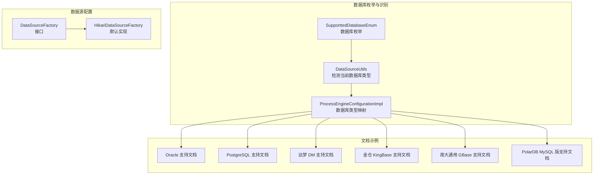
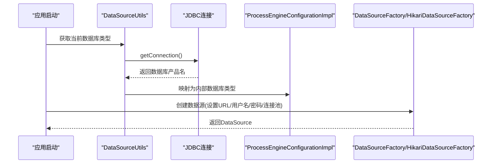
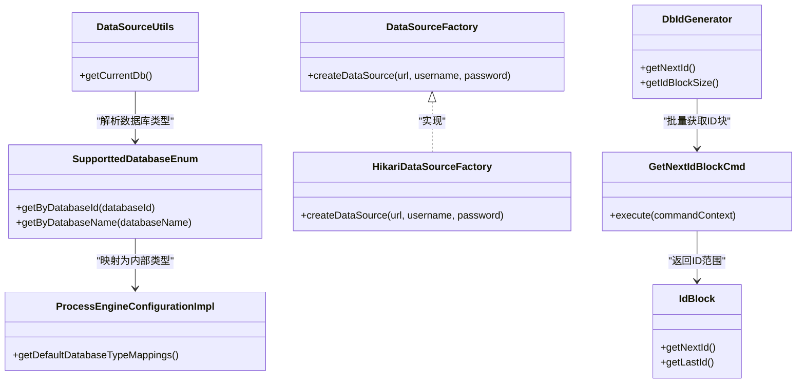

# 支持的数据库类型

<cite>
**本文档引用的文件**
- [SupporttedDatabaseEnum.java](file://antflow-base/src/main/java/org/openoa/base/constant/enums/SupporttedDatabaseEnum.java)
- [DataSourceUtils.java](file://antflow-base/src/main/java/org/openoa/base/util/DataSourceUtils.java)
- [ProcessEngineConfigurationImpl.java](file://antflow-base/src/main/java/org/activiti/engine/impl/cfg/ProcessEngineConfigurationImpl.java)
- [HikariDataSourceFactory.java](file://antflow-engine/src/main/java/org/openoa/engine/conf/engineconfig/HikariDataSourceFactory.java)
- [DataSourceFactory.java](file://antflow-engine/src/main/java/org/openoa/engine/conf/engineconfig/DataSourceFactory.java)
- [1.antflow oracle支持.md](file://doc/多数据库支持/1.antflow oracle支持.md)
- [2.antflow postgresql支持.md](file://doc/多数据库支持/2.antflow postgresql支持.md)
- [4.antflow 达梦dm8 oracle支持.md](file://doc/多数据库支持/4.antflow 达梦dm8 oracle支持.md)
- [8.antflow 电科金仓（原人大金仓）kingbase oracle模式支持.md](file://doc/多数据库支持/8.antflow 电科金仓（原人大金仓）kingbase oracle模式支持.md)
- [11.antflow 南大通用gbase支持.md](file://doc/多数据库支持/11.antflow 南大通用gbase支持.md)
- [15.antflow支持polardb mysql版.md](file://doc/多数据库支持/15.antflow支持polardb mysql版.md)
- [GetNextIdBlockCmd.java](file://antflow-base/src/main/java/org/activiti/engine/impl/cmd/GetNextIdBlockCmd.java)
- [DbIdGenerator.java](file://antflow-base/src/main/java/org/activiti/engine/impl/db/DbIdGenerator.java)
- [IdBlock.java](file://antflow-base/src/main/java/org/activiti/engine/impl/db/IdBlock.java)
</cite>

## 目录
1. [简介](#简介)
2. [项目结构](#项目结构)
3. [核心组件](#核心组件)
4. [架构总览](#架构总览)
5. [详细组件分析](#详细组件分析)
6. [依赖分析](#依赖分析)
7. [性能考虑](#性能考虑)
8. [故障排查指南](#故障排查指南)
9. [结论](#结论)

## 简介
本文件系统性梳理 AntFlow 当前支持的数据库类型，覆盖 MySQL、Oracle、PostgreSQL、达梦数据库（DM）、人大金仓（KingbaseES）、南大通用（GBase）、华为 GaussDB（openGauss）、阿里 PolarDB（MySQL 兼容版）等。文档从版本兼容性、驱动配置、连接参数、方言映射、序列生成、事务隔离与锁机制等维度，解释不同数据库对工作流引擎的影响，并提供部署配置示例、性能优化建议与常见问题排查方法。

## 项目结构
围绕数据库支持的关键代码与文档分布如下：
- 枚举与方言识别：SupporttedDatabaseEnum、DataSourceUtils、ProcessEngineConfigurationImpl
- 数据源工厂：DataSourceFactory、HikariDataSourceFactory
- 文档示例：各数据库的安装、驱动与连接配置说明
- 工作流引擎 ID 生成：DbIdGenerator、GetNextIdBlockCmd、IdBlock

图表来源
- [SupporttedDatabaseEnum.java:1-62](file://antflow-base/src/main/java/org/openoa/base/constant/enums/SupporttedDatabaseEnum.java#L1-L62)
- [DataSourceUtils.java:1-28](file://antflow-base/src/main/java/org/openoa/base/util/DataSourceUtils.java#L1-L28)
- [ProcessEngineConfigurationImpl.java:777-811](file://antflow-base/src/main/java/org/activiti/engine/impl/cfg/ProcessEngineConfigurationImpl.java#L777-L811)
- [DataSourceFactory.java:1-8](file://antflow-engine/src/main/java/org/openoa/engine/conf/engineconfig/DataSourceFactory.java#L1-L8)
- [HikariDataSourceFactory.java:1-27](file://antflow-engine/src/main/java/org/openoa/engine/conf/engineconfig/HikariDataSourceFactory.java#L1-L27)

章节来源
- [SupporttedDatabaseEnum.java:1-62](file://antflow-base/src/main/java/org/openoa/base/constant/enums/SupporttedDatabaseEnum.java#L1-L62)
- [DataSourceUtils.java:1-28](file://antflow-base/src/main/java/org/openoa/base/util/DataSourceUtils.java#L1-L28)
- [ProcessEngineConfigurationImpl.java:777-811](file://antflow-base/src/main/java/org/activiti/engine/impl/cfg/ProcessEngineConfigurationImpl.java#L777-L811)
- [DataSourceFactory.java:1-8](file://antflow-engine/src/main/java/org/openoa/engine/conf/engineconfig/DataSourceFactory.java#L1-L8)
- [HikariDataSourceFactory.java:1-27](file://antflow-engine/src/main/java/org/openoa/engine/conf/engineconfig/HikariDataSourceFactory.java#L1-L27)

## 核心组件
- 数据库枚举与方言识别
  - SupporttedDatabaseEnum：统一管理支持的数据库类型，包含 MySQL、Oracle、PostgreSQL、SQL Server、OceanBase、openGauss、达梦 DM、PolarDB、金仓 KingBase、GBase、MongoDB、TiDB 等，并提供按数据库 ID/名称查询的方法。
  - DataSourceUtils：通过 JDBC 获取数据库产品名，缓存当前数据库类型，用于后续方言适配。
  - ProcessEngineConfigurationImpl：内置数据库类型映射，将数据库产品名映射为内部数据库类型常量（如 mysql、oracle、postgres、mssql、db2 等）。

- 数据源工厂
  - DataSourceFactory：数据源创建接口，便于替换默认实现。
  - HikariDataSourceFactory：默认实现，设置 JDBC URL、用户名、密码与连接池参数（最大连接数、最小空闲等）。

章节来源
- [SupporttedDatabaseEnum.java:1-62](file://antflow-base/src/main/java/org/openoa/base/constant/enums/SupporttedDatabaseEnum.java#L1-L62)
- [DataSourceUtils.java:1-28](file://antflow-base/src/main/java/org/openoa/base/util/DataSourceUtils.java#L1-L28)
- [ProcessEngineConfigurationImpl.java:777-811](file://antflow-base/src/main/java/org/activiti/engine/impl/cfg/ProcessEngineConfigurationImpl.java#L777-L811)
- [DataSourceFactory.java:1-8](file://antflow-engine/src/main/java/org/openoa/engine/conf/engineconfig/DataSourceFactory.java#L1-L8)
- [HikariDataSourceFactory.java:1-27](file://antflow-engine/src/main/java/org/openoa/engine/conf/engineconfig/HikariDataSourceFactory.java#L1-L27)

## 架构总览
AntFlow 对数据库的支持通过“枚举识别 + 方言映射 + 数据源工厂”的组合实现：
- 启动时通过 DataSourceUtils 识别当前数据库类型；
- ProcessEngineConfigurationImpl 将数据库产品名映射为内部类型；
- 工作流引擎根据数据库类型选择合适的方言与 SQL 生成策略；
- 数据源工厂负责创建与配置连接池。

图表来源
- [DataSourceUtils.java:1-28](file://antflow-base/src/main/java/org/openoa/base/util/DataSourceUtils.java#L1-L28)
- [ProcessEngineConfigurationImpl.java:777-811](file://antflow-base/src/main/java/org/activiti/engine/impl/cfg/ProcessEngineConfigurationImpl.java#L777-L811)
- [HikariDataSourceFactory.java:1-27](file://antflow-engine/src/main/java/org/openoa/engine/conf/engineconfig/HikariDataSourceFactory.java#L1-L27)

## 详细组件分析

### MySQL
- 版本兼容性
  - 内置数据库类型映射包含 MySQL，适用于大多数 MySQL 5.7+ 与 MySQL 8.0+。
- 驱动与连接
  - 使用标准 MySQL 驱动与 JDBC URL；无需特殊方言配置。
- 特性影响
  - 序列生成：MySQL 通常使用自增列；工作流引擎通过属性表块批量分配 ID。
  - 事务隔离：默认隔离级别可按需配置；锁机制遵循 InnoDB。
- 配置示例与脚本
  - 参考 PolarDB MySQL 版文档中的初始化脚本与驱动引入方式。
- 性能优化
  - 合理设置连接池大小、超时参数；启用连接健康检查；避免长事务。
- 故障排查
  - 检查驱动版本与 JDBC URL；确认字符集与时区设置；排查慢查询与锁等待。

章节来源
- [ProcessEngineConfigurationImpl.java:787-793](file://antflow-base/src/main/java/org/activiti/engine/impl/cfg/ProcessEngineConfigurationImpl.java#L787-L793)
- [15.antflow支持polardb mysql版.md:1-19](file://doc/多数据库支持/15.antflow支持polardb mysql版.md#L1-L19)

### Oracle
- 版本兼容性
  - 支持 Oracle 19c/21c/23c 等常见版本；使用 thin 驱动。
- 驱动与连接
  - 驱动类名：oracle.jdbc.OracleDriver；JDBC URL 使用 thin 模式。
- 特性影响
  - 序列生成：Oracle 使用序列（SEQUENCE）；工作流引擎通过属性表块批量分配 ID。
  - 事务隔离：支持 READ COMMITTED、REPEATABLE READ、READ WRITE 等；锁机制基于行级锁。
  - 兼容性：可通过达梦 DM 的 Oracle 兼容模式或金仓 KingBase 的 Oracle 模式降低迁移成本。
- 配置示例与脚本
  - 参考 Oracle 支持文档中的 Docker 安装、用户授权、初始化脚本与连接配置。
- 性能优化
  - 合理设置共享池与游标；开启自动统计；避免全表扫描；使用合适的索引。
- 故障排查
  - 检查监听器状态、服务名与 SID；确认用户权限与配额；排查长时间事务与锁竞争。

章节来源
- [ProcessEngineConfigurationImpl.java:792-793](file://antflow-base/src/main/java/org/activiti/engine/impl/cfg/ProcessEngineConfigurationImpl.java#L792-L793)
- [1.antflow oracle支持.md:1-332](file://doc/多数据库支持/1.antflow oracle支持.md#L1-L332)

### PostgreSQL
- 版本兼容性
  - 支持 PostgreSQL 12+；使用官方驱动。
- 驱动与连接
  - 驱动类名：org.postgresql.Driver；JDBC URL 支持 currentSchema 参数。
- 特性影响
  - 序列生成：PostgreSQL 使用 SERIAL 或自定义序列；工作流引擎通过属性表块批量分配 ID。
  - 事务隔离：支持 READ COMMITTED、REPEATABLE READ、SERIALIZABLE；MVCC 控制可见性。
  - 兼容性：openGauss 作为 PostgreSQL 兼容层，可复用 PG 方案。
- 配置示例与脚本
  - 参考 PostgreSQL 支持文档中的 Docker 安装、初始化脚本与连接配置。
- 性能优化
  - 合理设置共享缓冲区与 WAL；使用分区表；定期更新统计信息。
- 故障排查
  - 检查连接数上限、WAL 写入性能；排查热点表与锁冲突。

章节来源
- [ProcessEngineConfigurationImpl.java:792-793](file://antflow-base/src/main/java/org/activiti/engine/impl/cfg/ProcessEngineConfigurationImpl.java#L792-L793)
- [2.antflow postgresql支持.md:1-94](file://doc/多数据库支持/2.antflow postgresql支持.md#L1-L94)

### 达梦数据库（DM）
- 兼容模式
  - 默认无兼容模式（原生 DM），可通过配置切换至 Oracle/MySQL/PG 等模式。
- 驱动与连接
  - 驱动类名：dm.jdbc.driver.DmDriver；JDBC URL 支持 compatibleMode 参数。
- 特性影响
  - 标识符大小写、数据类型、系统视图等随兼容模式变化；序列与触发器模拟自增能力因模式而异。
- 配置示例与脚本
  - 参考达梦支持文档中的 Docker 安装、兼容模式设置、驱动引入与初始化脚本。
- 性能优化
  - 合理设置页大小与字符集；优化查询计划；避免隐式转换。
- 故障排查
  - 检查兼容模式配置是否生效；确认驱动版本与连接参数；排查授权与服务状态。

章节来源
- [4.antflow 达梦dm8 oracle支持.md:1-368](file://doc/多数据库支持/4.antflow 达梦dm8 oracle支持.md#L1-L368)

### 人大金仓（KingBase ES）
- 兼容模式
  - 支持 Oracle 模式，提供 DUAL 表、ROWNUM、NVL、TO_CHAR 等兼容特性。
- 驱动与连接
  - 使用官方驱动坐标；JDBC URL 支持 currentSchema 参数。
- 特性影响
  - 与 Oracle 高度兼容，序列与触发器模拟自增可复用 Oracle 方案。
- 配置示例与脚本
  - 参考金仓支持文档中的 Docker 安装、Oracle 模式启动、驱动引入与初始化脚本。
- 性能优化
  - 合理设置共享内存与并发度；优化索引与查询计划。
- 故障排查
  - 检查 Oracle 模式是否正确启用；确认驱动版本与连接参数。

章节来源
- [8.antflow 电科金仓（原人大金仓）kingbase oracle模式支持.md:1-231](file://doc/多数据库支持/8.antflow 电科金仓（原人大金仓）kingbase oracle模式支持.md#L1-L231)

### 南大通用（GBase）
- 兼容性
  - 基于 Informix 开发，语法与 Oracle 更接近；需自定义驱动。
- 驱动与连接
  - 驱动类名：com.gbasedbt.jdbc.Driver；JDBC URL 使用 gbasedbt-sqli 协议。
- 特性影响
  - 语法与 Oracle 接近，序列与函数兼容性较好；但整体支持难度较高。
- 配置示例与脚本
  - 参考 GBase 支持文档中的 Docker 安装、驱动引入与初始化脚本。
- 性能优化
  - 合理设置网络与协议参数；优化查询与索引。
- 故障排查
  - 检查驱动版本与连接参数；确认服务端口与认证配置。

章节来源
- [11.antflow 南大通用gbase支持.md:1-100](file://doc/多数据库支持/11.antflow 南大通用gbase支持.md#L1-L100)

### 华为 GaussDB（openGauss）
- 兼容性
  - 作为 PostgreSQL 兼容数据库，可直接复用 PG 的驱动与配置。
- 驱动与连接
  - 驱动类名：org.postgresql.Driver；JDBC URL 支持 currentSchema 参数。
- 特性影响
  - 事务隔离与 MVCC 行为与 PostgreSQL 类似；序列生成沿用 PG 方案。
- 配置示例与脚本
  - 参考 PostgreSQL 支持文档中的初始化脚本与连接配置。
- 性能优化
  - 合理设置共享内存与 WAL；优化分区与并行查询。
- 故障排查
  - 检查连接参数与权限；排查 WAL 写入与同步延迟。

章节来源
- [SupporttedDatabaseEnum.java:13-14](file://antflow-base/src/main/java/org/openoa/base/constant/enums/SupporttedDatabaseEnum.java#L13-L14)
- [2.antflow postgresql支持.md:1-94](file://doc/多数据库支持/2.antflow postgresql支持.md#L1-L94)

### 阿里 PolarDB（MySQL 兼容版）
- 兼容性
  - 与 MySQL 高度兼容，可直接使用 MySQL 驱动与初始化脚本。
- 驱动与连接
  - 驱动类名：com.mysql.cj.jdbc.Driver；JDBC URL 使用 MySQL 协议。
- 特性影响
  - 云原生架构具备高可用与弹性扩展能力；序列与自增列行为与 MySQL 一致。
- 配置示例与脚本
  - 参考 PolarDB MySQL 版支持文档中的初始化脚本与连接配置。
- 性能优化
  - 合理设置连接池与读写分离；利用集群特性优化查询。
- 故障排查
  - 检查连接参数与白名单；排查集群状态与副本延迟。

章节来源
- [15.antflow支持polardb mysql版.md:1-19](file://doc/多数据库支持/15.antflow支持polardb mysql版.md#L1-L19)

## 依赖分析
- 数据库类型识别链路
  - DataSourceUtils 通过 JDBC 获取数据库产品名，调用 SupporttedDatabaseEnum.getByDatabaseName 进行解析。
  - ProcessEngineConfigurationImpl 将数据库产品名映射为内部类型，用于方言选择与 SQL 生成。
- 数据源工厂链路
  - HikariDataSourceFactory 实现 DataSourceFactory 接口，负责创建 HikariDataSource 并设置连接池参数。
- 工作流引擎 ID 分配
  - DbIdGenerator 通过命令执行器批量获取 ID 块，GetNextIdBlockCmd 更新属性表中的下一个 ID 值，IdBlock 描述本次分配的范围。

图表来源
- [SupporttedDatabaseEnum.java:1-62](file://antflow-base/src/main/java/org/openoa/base/constant/enums/SupporttedDatabaseEnum.java#L1-L62)
- [DataSourceUtils.java:1-28](file://antflow-base/src/main/java/org/openoa/base/util/DataSourceUtils.java#L1-L28)
- [ProcessEngineConfigurationImpl.java:777-811](file://antflow-base/src/main/java/org/activiti/engine/impl/cfg/ProcessEngineConfigurationImpl.java#L777-L811)
- [DataSourceFactory.java:1-8](file://antflow-engine/src/main/java/org/openoa/engine/conf/engineconfig/DataSourceFactory.java#L1-L8)
- [HikariDataSourceFactory.java:1-27](file://antflow-engine/src/main/java/org/openoa/engine/conf/engineconfig/HikariDataSourceFactory.java#L1-L27)
- [DbIdGenerator.java:1-71](file://antflow-base/src/main/java/org/activiti/engine/impl/db/DbIdGenerator.java#L1-L71)
- [GetNextIdBlockCmd.java:1-42](file://antflow-base/src/main/java/org/activiti/engine/impl/cmd/GetNextIdBlockCmd.java#L1-L42)
- [IdBlock.java:1-34](file://antflow-base/src/main/java/org/activiti/engine/impl/db/IdBlock.java#L1-L34)

章节来源
- [SupporttedDatabaseEnum.java:1-62](file://antflow-base/src/main/java/org/openoa/base/constant/enums/SupporttedDatabaseEnum.java#L1-L62)
- [DataSourceUtils.java:1-28](file://antflow-base/src/main/java/org/openoa/base/util/DataSourceUtils.java#L1-L28)
- [ProcessEngineConfigurationImpl.java:777-811](file://antflow-base/src/main/java/org/activiti/engine/impl/cfg/ProcessEngineConfigurationImpl.java#L777-L811)
- [DataSourceFactory.java:1-8](file://antflow-engine/src/main/java/org/openoa/engine/conf/engineconfig/DataSourceFactory.java#L1-L8)
- [HikariDataSourceFactory.java:1-27](file://antflow-engine/src/main/java/org/openoa/engine/conf/engineconfig/HikariDataSourceFactory.java#L1-L27)
- [DbIdGenerator.java:1-71](file://antflow-base/src/main/java/org/activiti/engine/impl/db/DbIdGenerator.java#L1-L71)
- [GetNextIdBlockCmd.java:1-42](file://antflow-base/src/main/java/org/activiti/engine/impl/cmd/GetNextIdBlockCmd.java#L1-L42)
- [IdBlock.java:1-34](file://antflow-base/src/main/java/org/activiti/engine/impl/db/IdBlock.java#L1-L34)

## 性能考虑
- 连接池配置
  - 合理设置最大连接数、最小空闲、最大等待时间与连接健康检查周期，避免连接争用与泄漏。
- 事务与锁
  - 控制事务粒度与持续时间，减少长事务与锁等待；针对热点表建立合适索引。
- 序列与 ID 分配
  - 使用批量 ID 块分配策略降低数据库往返次数；确保属性表写入的原子性与一致性。
- 数据库特性
  - 根据数据库的 MVCC、WAL、共享内存等特性调整参数；定期维护统计信息与索引。

## 故障排查指南
- 连接失败
  - 检查 JDBC URL、驱动类名、用户名与密码；确认防火墙与网络连通性。
- 权限不足
  - 确认用户具备连接、建表、序列等权限；必要时授予 DBA 或相应角色。
- 兼容模式问题
  - 达梦/金仓/南大通用等需确认兼容模式已正确设置并生效。
- 性能瓶颈
  - 分析慢查询与锁等待；优化索引与 SQL；调整连接池与数据库参数。
- ID 分配异常
  - 检查属性表写入是否成功；确认批量 ID 块分配逻辑未被并发破坏。

## 结论
AntFlow 通过统一的数据库枚举与方言映射、灵活的数据源工厂以及完善的文档示例，实现了对 MySQL、Oracle、PostgreSQL、达梦、金仓、GBase、openGauss、PolarDB 等数据库的广泛支持。在实际部署中，应结合目标数据库的特性进行驱动与连接参数配置，并关注序列生成、事务隔离与锁机制对工作流引擎的影响，以获得稳定与高性能的运行效果。