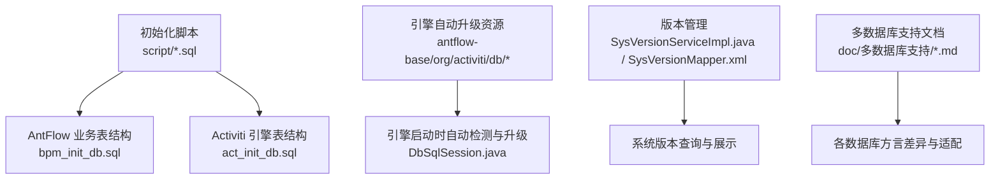
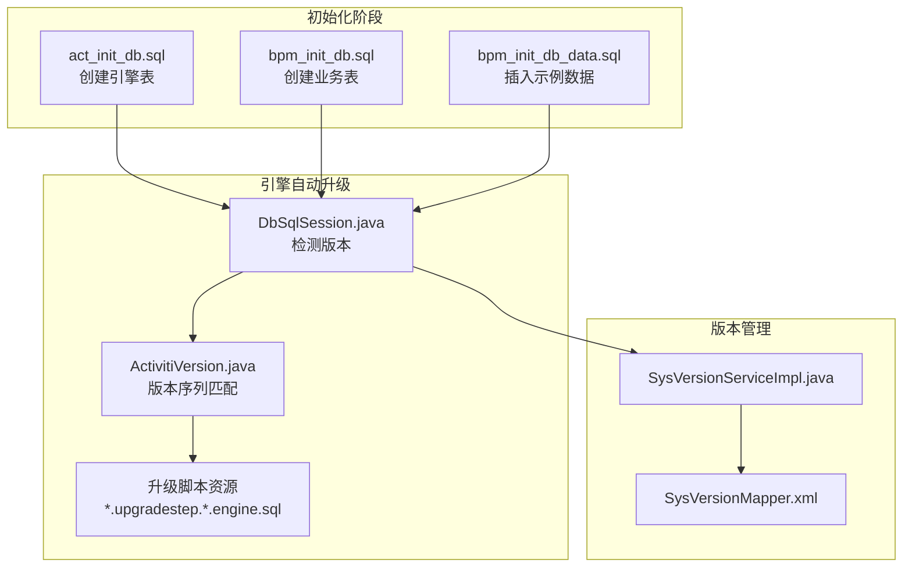
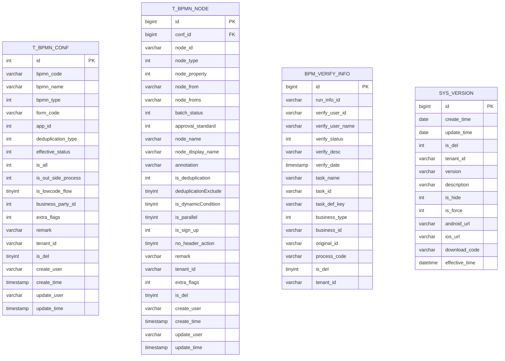
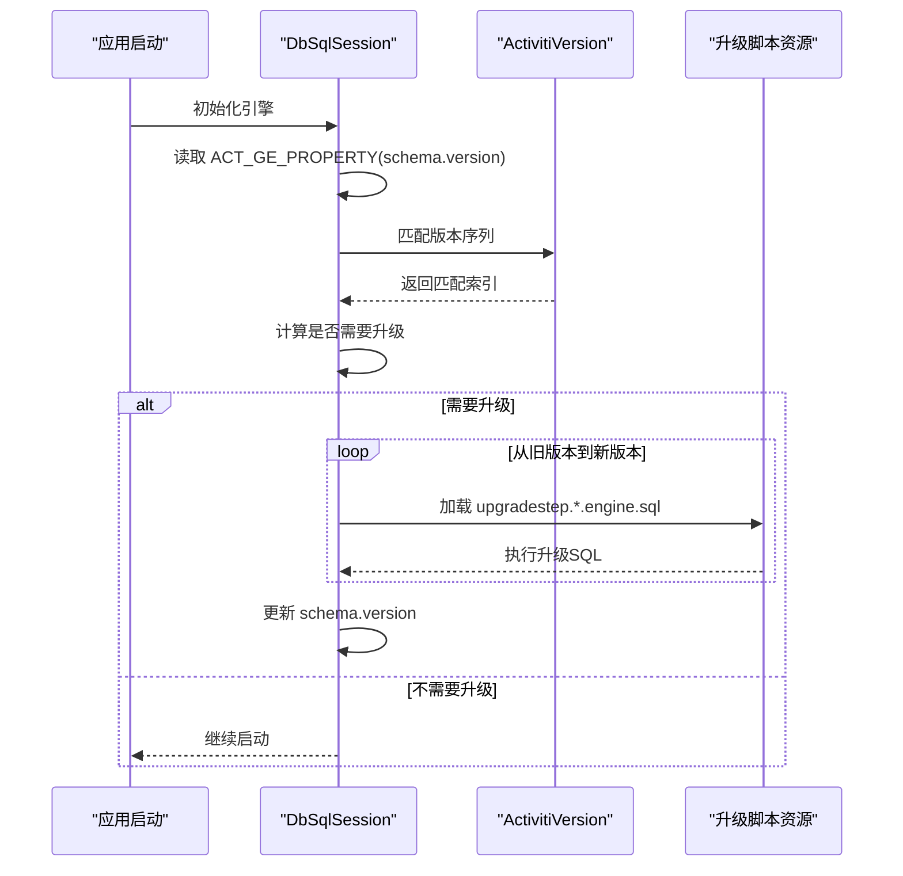
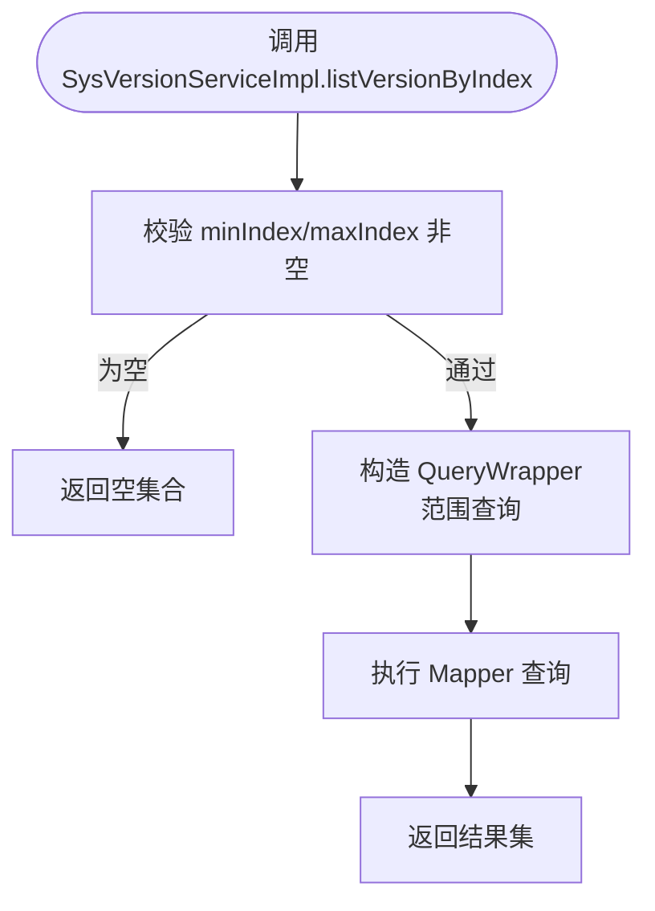
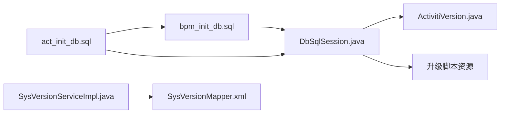

# 数据库迁移与升级

<cite>
**本文引用的文件**
- [script/act_init_db.sql](file://script/act_init_db.sql)
- [script/bpm_init_db.sql](file://script/bpm_init_db.sql)
- [script/bpm_init_db_data.sql](file://script/bpm_init_db_data.sql)
- [antflow-base/src/main/resources/org/activiti/db/create/activiti.mysql.create.engine.sql](file://antflow-base/src/main/resources/org/activiti/db/create/activiti.mysql.create.engine.sql)
- [antflow-base/src/main/resources/org/activiti/db/create/activiti.mysql.create.history.sql](file://antflow-base/src/main/resources/org/activiti/db/create/activiti.mysql.create.history.sql)
- [antflow-base/src/main/resources/org/activiti/db/create/activiti.mysql.create.identity.sql](file://antflow-base/src/main/resources/org/activiti/db/create/activiti.mysql.create.identity.sql)
- [antflow-base/src/main/resources/org/activiti/db/upgrade/activiti.mysql.upgradestep.51701.to.51702.engine.sql](file://antflow-base/src/main/resources/org/activiti/db/upgrade/activiti.mysql.upgradestep.51701.to.51702.engine.sql)
- [antflow-base/src/main/resources/org/activiti/db/upgrade/activiti.mysql.upgradestep.51702.to.51800.engine.sql](file://antflow-base/src/main/resources/org/activiti/db/upgrade/activiti.mysql.upgradestep.51702.to.51800.engine.sql)
- [antflow-base/src/main/java/org/activiti/engine/impl/db/DbSqlSession.java](file://antflow-base/src/main/java/org/activiti/engine/impl/db/DbSqlSession.java)
- [antflow-base/src/main/java/org/activiti/engine/impl/db/ActivitiVersion.java](file://antflow-base/src/main/java/org/activiti/engine/impl/db/ActivitiVersion.java)
- [antflow-engine/src/main/java/org/openoa/engine/bpmnconf/service/impl/SysVersionServiceImpl.java](file://antflow-engine/src/main/java/org/openoa/engine/bpmnconf/service/impl/SysVersionServiceImpl.java)
- [antflow-engine/src/main/resources/mapper/SysVersionMapper.xml](file://antflow-engine/src/main/resources/mapper/SysVersionMapper.xml)
- [antflow-base/src/main/java/org/activiti/engine/impl/db/upgrade/DbUpgradeStep.java](file://antflow-base/src/main/java/org/activiti/engine/impl/db/upgrade/DbUpgradeStep.java)
- [doc/多数据库支持/1.antflow oracle支持.md](file://doc/多数据库支持/1.antflow oracle支持.md)
- [doc/多数据库支持/2.antflow postgresql支持.md](file://doc/多数据库支持/2.antflow postgresql支持.md)
- [doc/多数据库支持/4.antflow 达梦dm8 oracle支持.md](file://doc/多数据库支持/4.antflow 达梦dm8 oracle支持.md)
- [doc/多数据库支持/6.antflow 达梦postgresql模式支持.md](file://doc/多数据库支持/6.antflow 达梦postgresql模式支持.md)
- [doc/多数据库支持/7.antflow 达梦sql server模式支持.md](file://doc/多数据库支持/7.antflow 达梦sql server模式支持.md)
- [doc/多数据库支持/8.antflow 电科金仓（原人大金仓）kingbase oracle模式支持.md](file://doc/多数据库支持/8.antflow 电科金仓（原人大金仓）kingbase oracle模式支持.md)
- [doc/多数据库支持/10.antflow 电金金仓（原人大金仓）pg模式支持.md](file://doc/多数据库支持/10.antflow 电金金仓（原人大金仓）pg模式支持.md)
- [doc/多数据库支持/11.antflow 南大通用gbase支持.md](file://doc/多数据库支持/11.antflow 南大通用gbase支持.md)
- [doc/多数据库支持/12.antflow oceanbase oracle模式支持.md](file://doc/多数据库支持/12.antflow oceanbase oracle模式支持.md)
- [doc/多数据库支持/15.antflow支持polardb mysql版.md](file://doc/多数据库支持/15.antflow支持polardb mysql版.md)
- [doc/多数据库支持/16.antflow mongodb支持.md](file://doc/多数据库支持/16.antflow mongodb支持.md)
</cite>

## 目录
1. [简介](#简介)
2. [项目结构](#项目结构)
3. [核心组件](#核心组件)
4. [架构总览](#架构总览)
5. [详细组件分析](#详细组件分析)
6. [依赖关系分析](#依赖关系分析)
7. [性能考虑](#性能考虑)
8. [故障排查指南](#故障排查指南)
9. [结论](#结论)
10. [附录](#附录)

## 简介
本文件面向 AntFlow 的数据库迁移与升级场景，系统性梳理初始化脚本与升级脚本的结构与执行流程，覆盖工作流引擎表结构、业务流程表结构、低代码流程表结构的创建与变更；明确版本升级流程、跨数据库差异、迁移前检查、迁移监控与回滚、迁移后验证等关键环节，帮助运维与开发团队安全高效地完成数据库版本演进。

## 项目结构
AntFlow 的数据库相关脚本与引擎自动升级能力主要分布在以下位置：
- 初始化脚本：位于 script 目录，包含 Activiti 引擎表与 AntFlow 自定义业务表的初始化 SQL。
- 引擎自动升级资源：位于 antflow-base 中的 org/activiti/db/create 与 org/activiti/db/upgrade，按数据库类型组织。
- 版本管理与查询：位于 antflow-engine 的 SysVersion 实体与 Mapper，用于系统版本信息管理。
- 多数据库支持文档：位于 doc/多数据库支持，涵盖 Oracle、PostgreSQL、达梦、金仓、OceanBase、PolarDB、GBase、MongoDB 等。

**图表来源**
- [script/act_init_db.sql:1-470](file://script/act_init_db.sql#L1-L470)
- [script/bpm_init_db.sql:1-800](file://script/bpm_init_db.sql#L1-L800)
- [antflow-base/src/main/resources/org/activiti/db/create/activiti.mysql.create.engine.sql:1-324](file://antflow-base/src/main/resources/org/activiti/db/create/activiti.mysql.create.engine.sql#L1-L324)
- [antflow-base/src/main/resources/org/activiti/db/create/activiti.mysql.create.history.sql:1-156](file://antflow-base/src/main/resources/org/activiti/db/create/activiti.mysql.create.history.sql#L1-L156)
- [antflow-base/src/main/resources/org/activiti/db/create/activiti.mysql.create.identity.sql:1-47](file://antflow-base/src/main/resources/org/activiti/db/create/activiti.mysql.create.identity.sql#L1-L47)
- [antflow-base/src/main/java/org/activiti/engine/impl/db/DbSqlSession.java:1023-1241](file://antflow-base/src/main/java/org/activiti/engine/impl/db/DbSqlSession.java#L1023-L1241)
- [antflow-engine/src/main/java/org/openoa/engine/bpmnconf/service/impl/SysVersionServiceImpl.java:179-224](file://antflow-engine/src/main/java/org/openoa/engine/bpmnconf/service/impl/SysVersionServiceImpl.java#L179-L224)
- [antflow-engine/src/main/resources/mapper/SysVersionMapper.xml:25-50](file://antflow-engine/src/main/resources/mapper/SysVersionMapper.xml#L25-L50)

**章节来源**
- [script/act_init_db.sql:1-470](file://script/act_init_db.sql#L1-L470)
- [script/bpm_init_db.sql:1-800](file://script/bpm_init_db.sql#L1-L800)
- [antflow-base/src/main/resources/org/activiti/db/create/activiti.mysql.create.engine.sql:1-324](file://antflow-base/src/main/resources/org/activiti/db/create/activiti.mysql.create.engine.sql#L1-L324)
- [antflow-base/src/main/resources/org/activiti/db/create/activiti.mysql.create.history.sql:1-156](file://antflow-base/src/main/resources/org/activiti/db/create/activiti.mysql.create.history.sql#L1-L156)
- [antflow-base/src/main/resources/org/activiti/db/create/activiti.mysql.create.identity.sql:1-47](file://antflow-base/src/main/resources/org/activiti/db/create/activiti.mysql.create.identity.sql#L1-L47)
- [antflow-base/src/main/java/org/activiti/engine/impl/db/DbSqlSession.java:1023-1241](file://antflow-base/src/main/java/org/activiti/engine/impl/db/DbSqlSession.java#L1023-L1241)
- [antflow-engine/src/main/java/org/openoa/engine/bpmnconf/service/impl/SysVersionServiceImpl.java:179-224](file://antflow-engine/src/main/java/org/openoa/engine/bpmnconf/service/impl/SysVersionServiceImpl.java#L179-L224)
- [antflow-engine/src/main/resources/mapper/SysVersionMapper.xml:25-50](file://antflow-engine/src/main/resources/mapper/SysVersionMapper.xml#L25-L50)

## 核心组件
- 初始化脚本
  - 工作流引擎表：通过 act_init_db.sql 创建 Activiti 引擎运行所需的表（如执行、任务、变量、历史实例、身份表等），并初始化引擎属性表。
  - 业务流程表：通过 bpm_init_db.sql 创建 AntFlow 流程配置、节点、变量、通知、草稿、委托、节点记录等业务表。
  - 示例数据：通过 bpm_init_db_data.sql 插入字典、用户、角色、部门等演示数据，便于快速验证。
- 引擎自动升级
  - 引擎在启动时检测数据库版本，若需要则按版本序列逐级执行升级脚本，最终将版本属性更新为当前引擎版本。
- 版本管理
  - SysVersion 实体与 Mapper 提供系统版本信息的查询与分页展示，辅助运维进行版本发布与回滚决策。

**章节来源**
- [script/act_init_db.sql:1-470](file://script/act_init_db.sql#L1-L470)
- [script/bpm_init_db.sql:1-800](file://script/bpm_init_db.sql#L1-L800)
- [script/bpm_init_db_data.sql:1-104](file://script/bpm_init_db_data.sql#L1-L104)
- [antflow-base/src/main/resources/org/activiti/db/create/activiti.mysql.create.engine.sql:1-324](file://antflow-base/src/main/resources/org/activiti/db/create/activiti.mysql.create.engine.sql#L1-L324)
- [antflow-base/src/main/resources/org/activiti/db/create/activiti.mysql.create.history.sql:1-156](file://antflow-base/src/main/resources/org/activiti/db/create/activiti.mysql.create.history.sql#L1-L156)
- [antflow-base/src/main/resources/org/activiti/db/create/activiti.mysql.create.identity.sql:1-47](file://antflow-base/src/main/resources/org/activiti/db/create/activiti.mysql.create.identity.sql#L1-L47)
- [antflow-base/src/main/java/org/activiti/engine/impl/db/DbSqlSession.java:1023-1241](file://antflow-base/src/main/java/org/activiti/engine/impl/db/DbSqlSession.java#L1023-L1241)
- [antflow-engine/src/main/java/org/openoa/engine/bpmnconf/service/impl/SysVersionServiceImpl.java:179-224](file://antflow-engine/src/main/java/org/openoa/engine/bpmnconf/service/impl/SysVersionServiceImpl.java#L179-L224)
- [antflow-engine/src/main/resources/mapper/SysVersionMapper.xml:25-50](file://antflow-engine/src/main/resources/mapper/SysVersionMapper.xml#L25-L50)

## 架构总览
下图展示了数据库初始化与升级的整体架构：初始化脚本负责首次部署，引擎自动升级负责后续版本演进，版本管理组件提供查询能力。

**图表来源**
- [script/act_init_db.sql:1-470](file://script/act_init_db.sql#L1-L470)
- [script/bpm_init_db.sql:1-800](file://script/bpm_init_db.sql#L1-L800)
- [script/bpm_init_db_data.sql:1-104](file://script/bpm_init_db_data.sql#L1-L104)
- [antflow-base/src/main/java/org/activiti/engine/impl/db/DbSqlSession.java:1023-1241](file://antflow-base/src/main/java/org/activiti/engine/impl/db/DbSqlSession.java#L1023-L1241)
- [antflow-base/src/main/java/org/activiti/engine/impl/db/ActivitiVersion.java:1-49](file://antflow-base/src/main/java/org/activiti/engine/impl/db/ActivitiVersion.java#L1-L49)
- [antflow-base/src/main/resources/org/activiti/db/upgrade/activiti.mysql.upgradestep.51701.to.51702.engine.sql:1-2](file://antflow-base/src/main/resources/org/activiti/db/upgrade/activiti.mysql.upgradestep.51701.to.51702.engine.sql#L1-L2)
- [antflow-engine/src/main/java/org/openoa/engine/bpmnconf/service/impl/SysVersionServiceImpl.java:179-224](file://antflow-engine/src/main/java/org/openoa/engine/bpmnconf/service/impl/SysVersionServiceImpl.java#L179-L224)
- [antflow-engine/src/main/resources/mapper/SysVersionMapper.xml:25-50](file://antflow-engine/src/main/resources/mapper/SysVersionMapper.xml#L25-L50)

## 详细组件分析

### 初始化脚本分析
- 工作流引擎表（Activiti）
  - 引擎核心表：执行、任务、变量、作业、事件订阅、历史实例、身份组与用户等。
  - 属性表：初始化 schema.version、schema.history、next.dbid 等关键属性。
  - 索引与外键：为常用查询字段建立索引，并设置必要的外键约束以保证数据一致性。
- 业务流程表（AntFlow）
  - 流程配置表：主流程配置、节点配置、节点走向、节点业务表配置、通知模板等。
  - 运行期表：草稿、委托、运行信息、手动提醒、超时通知、节点提交记录等。
  - 变量与按钮：流程变量、消息、多人会签、顺序流、签收等细粒度配置表。
  - 示例数据：字典、用户、角色、部门等演示数据，便于快速验证。
- 低代码流程
  - 在流程配置表中通过标志位区分低代码流程，配合前端设计器生成流程定义与运行数据。

**图表来源**
- [script/bpm_init_db.sql:1-800](file://script/bpm_init_db.sql#L1-L800)
- [antflow-base/src/main/resources/org/activiti/db/create/activiti.mysql.create.engine.sql:1-324](file://antflow-base/src/main/resources/org/activiti/db/create/activiti.mysql.create.engine.sql#L1-L324)
- [antflow-base/src/main/resources/org/activiti/db/create/activiti.mysql.create.history.sql:1-156](file://antflow-base/src/main/resources/org/activiti/db/create/activiti.mysql.create.history.sql#L1-L156)
- [antflow-base/src/main/resources/org/activiti/db/create/activiti.mysql.create.identity.sql:1-47](file://antflow-base/src/main/resources/org/activiti/db/create/activiti.mysql.create.identity.sql#L1-L47)
- [antflow-engine/src/main/java/org/openoa/base/entity/SysVersion.java:1-53](file://antflow-engine/src/main/java/org/openoa/base/entity/SysVersion.java#L1-L53)

**章节来源**
- [script/act_init_db.sql:1-470](file://script/act_init_db.sql#L1-L470)
- [script/bpm_init_db.sql:1-800](file://script/bpm_init_db.sql#L1-L800)
- [script/bpm_init_db_data.sql:1-104](file://script/bpm_init_db_data.sql#L1-L104)
- [antflow-base/src/main/resources/org/activiti/db/create/activiti.mysql.create.engine.sql:1-324](file://antflow-base/src/main/resources/org/activiti/db/create/activiti.mysql.create.engine.sql#L1-L324)
- [antflow-base/src/main/resources/org/activiti/db/create/activiti.mysql.create.history.sql:1-156](file://antflow-base/src/main/resources/org/activiti/db/create/activiti.mysql.create.history.sql#L1-L156)
- [antflow-base/src/main/resources/org/activiti/db/create/activiti.mysql.create.identity.sql:1-47](file://antflow-base/src/main/resources/org/activiti/db/create/activiti.mysql.create.identity.sql#L1-L47)
- [antflow-engine/src/main/java/org/openoa/base/entity/SysVersion.java:1-53](file://antflow-engine/src/main/java/org/openoa/base/entity/SysVersion.java#L1-L53)

### 引擎自动升级流程
- 版本检测
  - 启动时读取 ACT_GE_PROPERTY 中的 schema.version，与当前引擎版本对比，判断是否需要升级。
- 版本序列匹配
  - 使用 ActivitiVersion 序列匹配数据库版本，确保兼容不同变体（如 5.12、5.12.1、5.12T）。
- 逐级升级
  - 按版本序列从旧版本到新版本依次执行对应升级脚本资源，最后更新 schema.version。
- 资源定位
  - 根据数据库类型与版本范围动态拼装 SQL 资源路径，确保不同数据库方言正确加载。

**图表来源**
- [antflow-base/src/main/java/org/activiti/engine/impl/db/DbSqlSession.java:1023-1241](file://antflow-base/src/main/java/org/activiti/engine/impl/db/DbSqlSession.java#L1023-L1241)
- [antflow-base/src/main/java/org/activiti/engine/impl/db/ActivitiVersion.java:1-49](file://antflow-base/src/main/java/org/activiti/engine/impl/db/ActivitiVersion.java#L1-L49)
- [antflow-base/src/main/resources/org/activiti/db/upgrade/activiti.mysql.upgradestep.51701.to.51702.engine.sql:1-2](file://antflow-base/src/main/resources/org/activiti/db/upgrade/activiti.mysql.upgradestep.51701.to.51702.engine.sql#L1-L2)
- [antflow-base/src/main/resources/org/activiti/db/upgrade/activiti.mysql.upgradestep.51702.to.51800.engine.sql:1-2](file://antflow-base/src/main/resources/org/activiti/db/upgrade/activiti.mysql.upgradestep.51702.to.51800.engine.sql#L1-L2)

**章节来源**
- [antflow-base/src/main/java/org/activiti/engine/impl/db/DbSqlSession.java:1023-1241](file://antflow-base/src/main/java/org/activiti/engine/impl/db/DbSqlSession.java#L1023-L1241)
- [antflow-base/src/main/java/org/activiti/engine/impl/db/ActivitiVersion.java:1-49](file://antflow-base/src/main/java/org/activiti/engine/impl/db/ActivitiVersion.java#L1-L49)
- [antflow-base/src/main/resources/org/activiti/db/upgrade/activiti.mysql.upgradestep.51701.to.51702.engine.sql:1-2](file://antflow-base/src/main/resources/org/activiti/db/upgrade/activiti.mysql.upgradestep.51701.to.51702.engine.sql#L1-L2)
- [antflow-base/src/main/resources/org/activiti/db/upgrade/activiti.mysql.upgradestep.51702.to.51800.engine.sql:1-2](file://antflow-base/src/main/resources/org/activiti/db/upgrade/activiti.mysql.upgradestep.51702.to.51800.engine.sql#L1-L2)

### 版本管理与查询
- 查询接口
  - 支持按 id、version、index 精确或区间查询，隐藏与删除状态过滤。
- 分页与统计
  - 提供分页列表与总数统计，便于前端展示与管理。
- 业务用途
  - 用于系统版本发布、强制升级提示、下载链接与生效时间等信息维护。

**图表来源**
- [antflow-engine/src/main/java/org/openoa/engine/bpmnconf/service/impl/SysVersionServiceImpl.java:198-213](file://antflow-engine/src/main/java/org/openoa/engine/bpmnconf/service/impl/SysVersionServiceImpl.java#L198-L213)
- [antflow-engine/src/main/resources/mapper/SysVersionMapper.xml:25-50](file://antflow-engine/src/main/resources/mapper/SysVersionMapper.xml#L25-L50)

**章节来源**
- [antflow-engine/src/main/java/org/openoa/engine/bpmnconf/service/impl/SysVersionServiceImpl.java:179-224](file://antflow-engine/src/main/java/org/openoa/engine/bpmnconf/service/impl/SysVersionServiceImpl.java#L179-L224)
- [antflow-engine/src/main/resources/mapper/SysVersionMapper.xml:25-50](file://antflow-engine/src/main/resources/mapper/SysVersionMapper.xml#L25-L50)

## 依赖关系分析
- 初始化脚本依赖关系
  - 引擎表依赖属性表初始化（如 schema.version、schema.history、next.dbid）。
  - 业务表依赖引擎表的存在（如历史表索引与外键依赖运行时表）。
- 引擎升级依赖关系
  - 升级脚本按版本序列执行，每个升级步骤仅处理相邻版本差异。
  - 资源加载依赖数据库类型与版本字符串格式化。
- 版本管理依赖关系
  - SysVersionServiceImpl 依赖 SysVersionMapper 进行数据访问。

**图表来源**
- [script/act_init_db.sql:1-470](file://script/act_init_db.sql#L1-L470)
- [script/bpm_init_db.sql:1-800](file://script/bpm_init_db.sql#L1-L800)
- [antflow-base/src/main/java/org/activiti/engine/impl/db/DbSqlSession.java:1023-1241](file://antflow-base/src/main/java/org/activiti/engine/impl/db/DbSqlSession.java#L1023-L1241)
- [antflow-base/src/main/java/org/activiti/engine/impl/db/ActivitiVersion.java:1-49](file://antflow-base/src/main/java/org/activiti/engine/impl/db/ActivitiVersion.java#L1-L49)
- [antflow-engine/src/main/java/org/openoa/engine/bpmnconf/service/impl/SysVersionServiceImpl.java:179-224](file://antflow-engine/src/main/java/org/openoa/engine/bpmnconf/service/impl/SysVersionServiceImpl.java#L179-L224)
- [antflow-engine/src/main/resources/mapper/SysVersionMapper.xml:25-50](file://antflow-engine/src/main/resources/mapper/SysVersionMapper.xml#L25-L50)

**章节来源**
- [script/act_init_db.sql:1-470](file://script/act_init_db.sql#L1-L470)
- [script/bpm_init_db.sql:1-800](file://script/bpm_init_db.sql#L1-L800)
- [antflow-base/src/main/java/org/activiti/engine/impl/db/DbSqlSession.java:1023-1241](file://antflow-base/src/main/java/org/activiti/engine/impl/db/DbSqlSession.java#L1023-L1241)
- [antflow-base/src/main/java/org/activiti/engine/impl/db/ActivitiVersion.java:1-49](file://antflow-base/src/main/java/org/activiti/engine/impl/db/ActivitiVersion.java#L1-L49)
- [antflow-engine/src/main/java/org/openoa/engine/bpmnconf/service/impl/SysVersionServiceImpl.java:179-224](file://antflow-engine/src/main/java/org/openoa/engine/bpmnconf/service/impl/SysVersionServiceImpl.java#L179-L224)
- [antflow-engine/src/main/resources/mapper/SysVersionMapper.xml:25-50](file://antflow-engine/src/main/resources/mapper/SysVersionMapper.xml#L25-L50)

## 性能考虑
- 初始化阶段
  - 建议在批量导入示例数据前关闭自动提交与索引重建，完成后统一开启并重建必要索引。
  - 对大表（如历史表）建议评估分区策略与归档策略，减少全量扫描。
- 升级阶段
  - 升级脚本应避免长事务与热点表写放大，可拆分为多个小事务并行执行非冲突段。
  - 升级前对关键表进行统计信息更新，确保执行计划稳定。
- 版本管理
  - 查询接口使用分页与精确过滤，避免全表扫描；对高频字段建立合适索引。

[本节为通用指导，无需特定文件来源]

## 故障排查指南
- 版本不匹配
  - 现象：启动时报错提示数据库版本高于引擎版本或未知版本。
  - 排查：确认 ACT_GE_PROPERTY 中 schema.version 是否合法；检查引擎版本与数据库版本映射。
- 升级失败
  - 现象：升级过程中断，schema.version 未更新。
  - 排查：检查对应 upgradestep 资源是否存在；核对数据库类型与方言；查看日志异常堆栈。
- 数据不一致
  - 现象：历史表与运行表索引缺失或外键约束失败。
  - 排查：确认初始化顺序与依赖关系；检查外键约束与索引创建顺序。
- 回滚策略
  - 建议在升级前对关键表进行快照备份；若升级失败，回滚至备份并修复问题后重试。
  - 引擎层面可通过降级到兼容版本的引擎镜像进行回滚。

**章节来源**
- [antflow-base/src/main/java/org/activiti/engine/impl/db/DbSqlSession.java:1150-1190](file://antflow-base/src/main/java/org/activiti/engine/impl/db/DbSqlSession.java#L1150-L1190)
- [antflow-base/src/main/resources/org/activiti/db/upgrade/activiti.mysql.upgradestep.51701.to.51702.engine.sql:1-2](file://antflow-base/src/main/resources/org/activiti/db/upgrade/activiti.mysql.upgradestep.51701.to.51702.engine.sql#L1-L2)
- [antflow-base/src/main/resources/org/activiti/db/upgrade/activiti.mysql.upgradestep.51702.to.51800.engine.sql:1-2](file://antflow-base/src/main/resources/org/activiti/db/upgrade/activiti.mysql.upgradestep.51702.to.51800.engine.sql#L1-L2)

## 结论
AntFlow 的数据库迁移与升级体系由“初始化脚本 + 引擎自动升级 + 版本管理”构成。通过规范化的初始化流程与严格的版本序列升级，可有效保障数据库结构的稳定性与可演进性。结合多数据库支持文档与回滚策略，可在不同数据库环境下安全推进版本升级。

[本节为总结性内容，无需特定文件来源]

## 附录

### 数据库版本升级流程（从旧到新）
- 准备阶段
  - 备份生产数据库关键表（尤其是引擎表与业务表）。
  - 校验当前 schema.version 与引擎版本映射关系。
- 执行阶段
  - 启动应用触发引擎自动升级，按版本序列执行 upgradestep 脚本。
  - 监控升级进度与日志，确保每一步成功。
- 验证阶段
  - 校验 ACT_GE_PROPERTY 中 schema.version 已更新。
  - 验证业务流程运行正常，历史数据可查询。
- 发布阶段
  - 通过版本管理接口发布新版本信息，通知前端与移动端生效。

**章节来源**
- [antflow-base/src/main/java/org/activiti/engine/impl/db/DbSqlSession.java:1023-1241](file://antflow-base/src/main/java/org/activiti/engine/impl/db/DbSqlSession.java#L1023-L1241)
- [antflow-base/src/main/resources/org/activiti/db/upgrade/activiti.mysql.upgradestep.51701.to.51702.engine.sql:1-2](file://antflow-base/src/main/resources/org/activiti/db/upgrade/activiti.mysql.upgradestep.51701.to.51702.engine.sql#L1-L2)
- [antflow-base/src/main/resources/org/activiti/db/upgrade/activiti.mysql.upgradestep.51702.to.51800.engine.sql:1-2](file://antflow-base/src/main/resources/org/activiti/db/upgrade/activiti.mysql.upgradestep.51702.to.51800.engine.sql#L1-L2)

### 不同数据库的迁移脚本差异
- 方言差异
  - MySQL：使用 utf8_bin 字符集与 InnoDB 引擎，索引与外键语法遵循 MySQL 规范。
  - PostgreSQL：表名大小写处理与索引命名存在差异，需注意 lowercased 表名处理。
  - 其他数据库（Oracle、达梦、金仓、OceanBase、PolarDB、GBase、MongoDB）：详见多数据库支持文档。
- 资源加载
  - 引擎按数据库类型动态加载对应 SQL 资源，确保方言兼容。

**章节来源**
- [antflow-base/src/main/resources/org/activiti/db/create/activiti.mysql.create.engine.sql:1-324](file://antflow-base/src/main/resources/org/activiti/db/create/activiti.mysql.create.engine.sql#L1-L324)
- [antflow-base/src/main/resources/org/activiti/db/create/activiti.mysql.create.history.sql:1-156](file://antflow-base/src/main/resources/org/activiti/db/create/activiti.mysql.create.history.sql#L1-L156)
- [antflow-base/src/main/resources/org/activiti/db/create/activiti.mysql.create.identity.sql:1-47](file://antflow-base/src/main/resources/org/activiti/db/create/activiti.mysql.create.identity.sql#L1-L47)
- [antflow-base/src/main/java/org/activiti/engine/impl/db/DbSqlSession.java:1128-1133](file://antflow-base/src/main/java/org/activiti/engine/impl/db/DbSqlSession.java#L1128-L1133)
- [doc/多数据库支持/1.antflow oracle支持.md](file://doc/多数据库支持/1.antflow oracle支持.md)
- [doc/多数据库支持/2.antflow postgresql支持.md](file://doc/多数据库支持/2.antflow postgresql支持.md)
- [doc/多数据库支持/4.antflow 达梦dm8 oracle支持.md](file://doc/多数据库支持/4.antflow 达梦dm8 oracle支持.md)
- [doc/多数据库支持/6.antflow 达梦postgresql模式支持.md](file://doc/多数据库支持/6.antflow 达梦postgresql模式支持.md)
- [doc/多数据库支持/7.antflow 达梦sql server模式支持.md](file://doc/多数据库支持/7.antflow 达梦sql server模式支持.md)
- [doc/多数据库支持/8.antflow 电科金仓（原人大金仓）kingbase oracle模式支持.md](file://doc/多数据库支持/8.antflow 电科金仓（原人大金仓）kingbase oracle模式支持.md)
- [doc/多数据库支持/10.antflow 电金金仓（原人大金仓）pg模式支持.md](file://doc/多数据库支持/10.antflow 电金金仓（原人大金仓）pg模式支持.md)
- [doc/多数据库支持/11.antflow 南大通用gbase支持.md](file://doc/多数据库支持/11.antflow 南大通用gbase支持.md)
- [doc/多数据库支持/12.antflow oceanbase oracle模式支持.md](file://doc/多数据库支持/12.antflow oceanbase oracle模式支持.md)
- [doc/多数据库支持/15.antflow支持polardb mysql版.md](file://doc/多数据库支持/15.antflow支持polardb mysql版.md)
- [doc/多数据库支持/16.antflow mongodb支持.md](file://doc/多数据库支持/16.antflow mongodb支持.md)

### 迁移前检查清单
- 环境准备
  - 数据库版本与驱动兼容性验证。
  - 磁盘空间与连接数上限评估。
- 数据一致性
  - 校验 ACT_GE_PROPERTY 与关键表完整性。
  - 确认业务表索引与外键状态。
- 备份策略
  - 对引擎表与业务表进行逻辑备份与物理快照。
  - 验证备份可恢复性。

**章节来源**
- [antflow-base/src/main/java/org/activiti/engine/impl/db/DbSqlSession.java:1023-1148](file://antflow-base/src/main/java/org/activiti/engine/impl/db/DbSqlSession.java#L1023-L1148)

### 迁移过程中的监控与回滚
- 监控要点
  - 升级进度与耗时统计；关键表锁等待与慢查询。
  - 日志异常告警与重试机制。
- 回滚策略
  - 采用“快照回滚 + 版本降级”的双保险策略。
  - 若升级失败，回滚到备份并修复问题后重试。

**章节来源**
- [antflow-base/src/main/java/org/activiti/engine/impl/db/DbSqlSession.java:1150-1190](file://antflow-base/src/main/java/org/activiti/engine/impl/db/DbSqlSession.java#L1150-L1190)

### 迁移后的验证方法
- 功能验证
  - 启动流程、审批任务、历史查询等核心功能。
- 数据验证
  - 校验 ACT_GE_PROPERTY 版本号、业务表数据完整性与一致性。
- 性能验证
  - 关键查询与写入延迟、并发吞吐指标。

**章节来源**
- [antflow-engine/src/main/java/org/openoa/engine/bpmnconf/service/impl/SysVersionServiceImpl.java:179-224](file://antflow-engine/src/main/java/org/openoa/engine/bpmnconf/service/impl/SysVersionServiceImpl.java#L179-L224)
- [antflow-engine/src/main/resources/mapper/SysVersionMapper.xml:25-50](file://antflow-engine/src/main/resources/mapper/SysVersionMapper.xml#L25-L50)