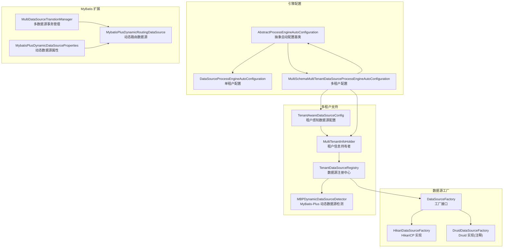
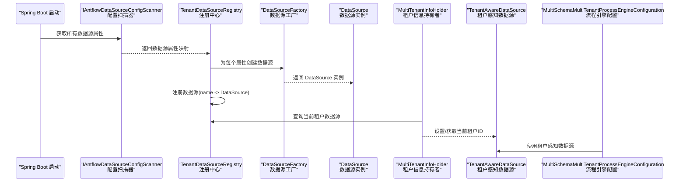
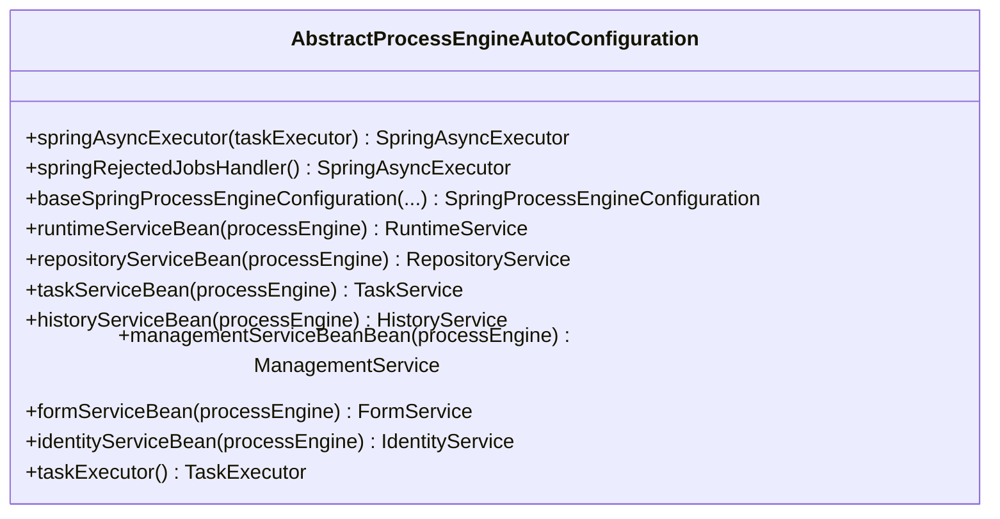
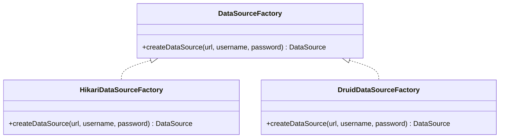
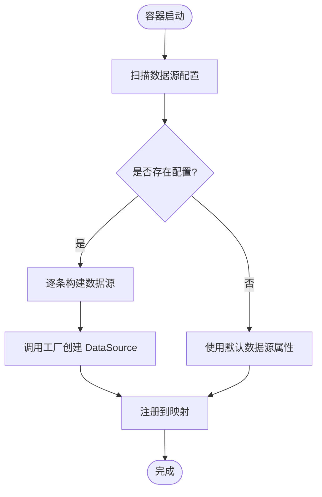
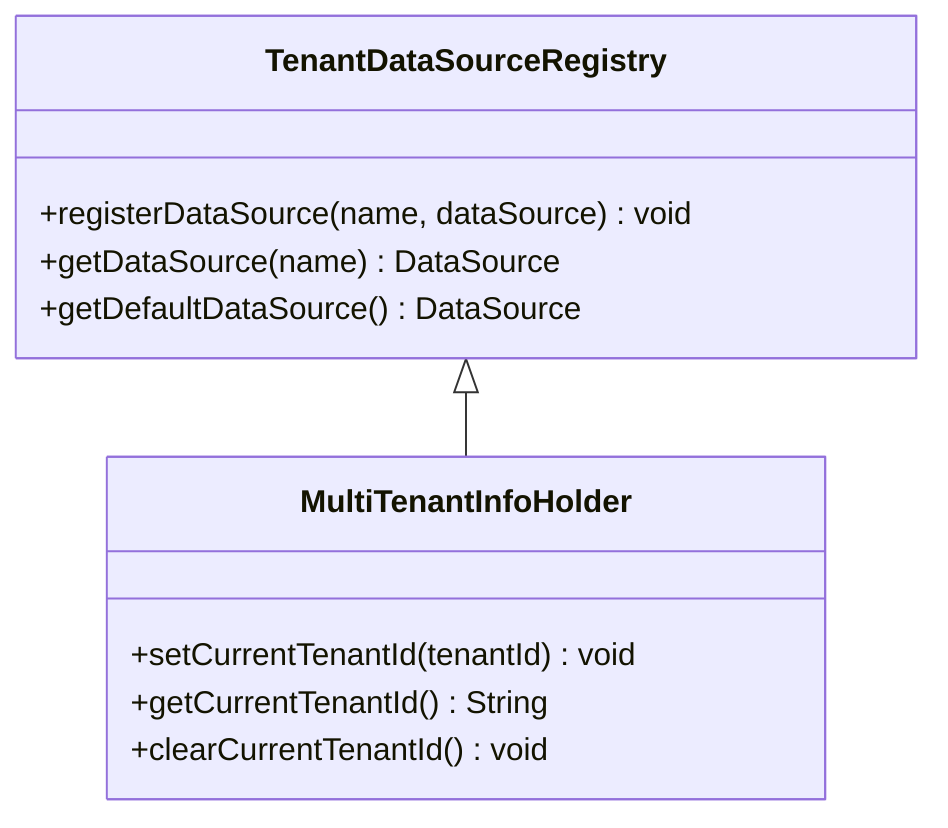
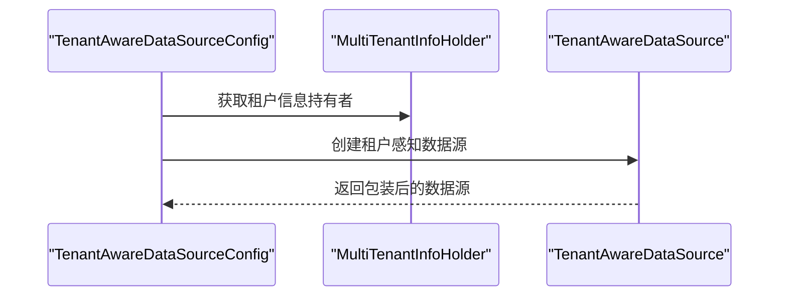
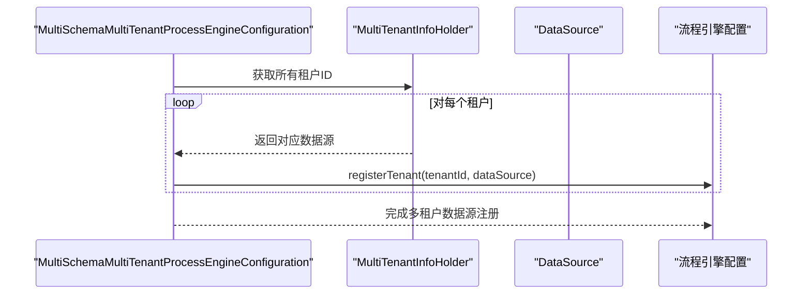
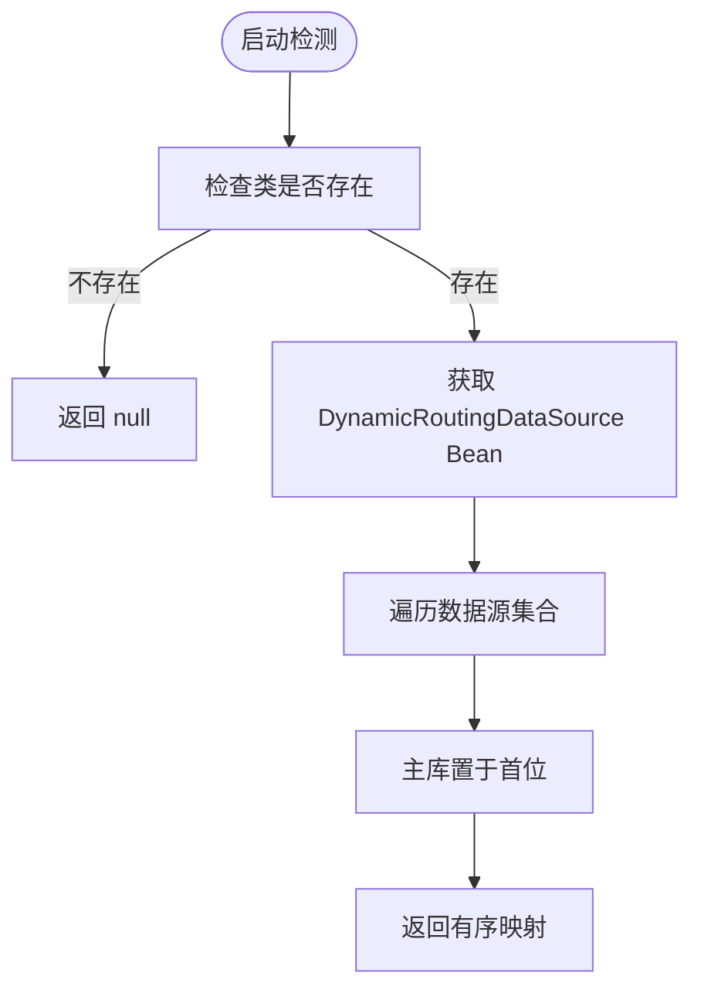
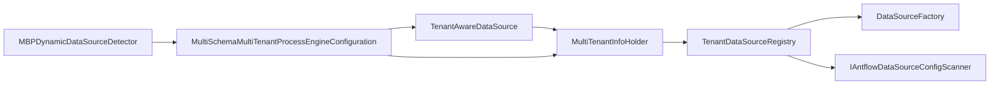

# 数据库适配器机制

<cite>
**本文档引用的文件**
- [AbstractProcessEngineAutoConfiguration.java](file://antflow-engine/src/main/java/org/openoa/engine/conf/engineconfig/AbstractProcessEngineAutoConfiguration.java)
- [DataSourceProcessEngineAutoConfiguration.java](file://antflow-engine/src/main/java/org/openoa/engine/conf/engineconfig/DataSourceProcessEngineAutoConfiguration.java)
- [MultiSchemaMultiTenantDataSourceProcessEngineAutoConfiguration.java](file://antflow-engine/src/main/java/org/openoa/engine/conf/engineconfig/MultiSchemaMultiTenantDataSourceProcessEngineAutoConfiguration.java)
- [DataSourceFactory.java](file://antflow-engine/src/main/java/org/openoa/engine/conf/engineconfig/DataSourceFactory.java)
- [HikariDataSourceFactory.java](file://antflow-engine/src/main/java/org/openoa/engine/conf/engineconfig/HikariDataSourceFactory.java)
- [DruidDataSourceFactory.java](file://antflow-engine/src/main/java/org/openoa/engine/conf/engineconfig/DruidDataSourceFactory.java)
- [TenantDataSourceRegistry.java](file://antflow-engine/src/main/java/org/openoa/engine/conf/engineconfig/TenantDataSourceRegistry.java)
- [MultiTenantInfoHolder.java](file://antflow-engine/src/main/java/org/openoa/engine/conf/engineconfig/MultiTenantInfoHolder.java)
- [TenantAwareDataSourceConfig.java](file://antflow-engine/src/main/java/org/openoa/engine/conf/engineconfig/TenantAwareDataSourceConfig.java)
- [MBPDynamicDataSourceDetector.java](file://antflow-engine/src/main/java/org/openoa/engine/conf/engineconfig/MBPDynamicDataSourceDetector.java)
- [GenericDruidDataSourceConfig.java](file://antflow-engine/src/main/java/org/openoa/engine/conf/engineconfig/GenericDruidDataSourceConfig.java)
- [MultiDataSourceTranstionManager.java](file://antflow-engine/src/main/java/org/openoa/engine/conf/mybatis/MultiDataSourceTranstionManager.java)
- [MybatisPlusDynamicDataSourceProperties.java](file://antflow-engine/src/main/java/org/openoa/engine/conf/mybatis/MybatisPlusDynamicDataSourceProperties.java)
- [MybatisPlusDynamicRoutingDataSource.java](file://antflow-engine/src/main/java/org/openoa/engine/conf/mybatis/MybatisPlusDynamicRoutingDataSource.java)
- [MultiTenantUtil.java](file://antflow-base/src/main/java/org/openoa/base/util/MultiTenantUtil.java)
- [TenantAwareDataSource.java](file://antflow-base/src/main/java/org/activiti/engine/impl/cfg/multitenant/TenantAwareDataSource.java)
- [MultiSchemaMultiTenantProcessEngineConfiguration.java](file://antflow-base/src/main/java/org/activiti/engine/impl/cfg/multitenant/MultiSchemaMultiTenantProcessEngineConfiguration.java)
- [MultiSchemaMultiTenantProcessDefinitionCache.java](file://antflow-base/src/main/java/org/activiti/engine/impl/persistence/deploy/MultiSchemaMultiTenantProcessDefinitionCache.java)
</cite>

## 目录
1. [简介](#简介)
2. [项目结构](#项目结构)
3. [核心组件](#核心组件)
4. [架构总览](#架构总览)
5. [详细组件分析](#详细组件分析)
6. [依赖关系分析](#依赖关系分析)
7. [性能考虑](#性能考虑)
8. [故障排除指南](#故障排除指南)
9. [结论](#结论)
10. [附录：扩展开发指南](#附录扩展开发指南)

## 简介
本文件系统性阐述 AntFlow 的数据库适配器机制，重点解析以下方面：
- 自动配置机制：AbstractProcessEngineAutoConfiguration 如何统一生成 Activiti 的 ProcessEngine 配置与 Bean。
- 工厂模式：DataSourceFactory 及其具体实现（如 HikariDataSourceFactory、DruidDataSourceFactory）如何屏蔽底层连接池差异，实现数据库适配器的可插拔。
- 多租户数据源：MultiSchemaMultiTenantDataSourceProcessEngineAutoConfiguration、TenantDataSourceRegistry、MultiTenantInfoHolder、TenantAwareDataSourceConfig 的协作，实现多租户数据源的注册与动态切换。
- 适配器模式在数据库切换中的作用：通过接口抽象与工厂方法，实现不同数据库/连接池的无缝替换。
- 数据源注册流程与连接池配置差异：从配置扫描到实例化，再到注册与使用。
- 多租户环境下的动态切换机制与租户信息持有者的作用。

## 项目结构
AntFlow 的数据库适配器相关代码主要集中在 antflow-engine 的 conf/engineconfig 与 conf/mybatis 包中，并与 antflow-base 的多租户基础能力协同工作。

**图表来源**
- [AbstractProcessEngineAutoConfiguration.java:41-202](file://antflow-engine/src/main/java/org/openoa/engine/conf/engineconfig/AbstractProcessEngineAutoConfiguration.java#L41-L202)
- [DataSourceProcessEngineAutoConfiguration.java:41-71](file://antflow-engine/src/main/java/org/openoa/engine/conf/engineconfig/DataSourceProcessEngineAutoConfiguration.java#L41-L71)
- [MultiSchemaMultiTenantDataSourceProcessEngineAutoConfiguration.java:31-113](file://antflow-engine/src/main/java/org/openoa/engine/conf/engineconfig/MultiSchemaMultiTenantDataSourceProcessEngineAutoConfiguration.java#L31-L113)
- [DataSourceFactory.java:5-8](file://antflow-engine/src/main/java/org/openoa/engine/conf/engineconfig/DataSourceFactory.java#L5-L8)
- [HikariDataSourceFactory.java:14-27](file://antflow-engine/src/main/java/org/openoa/engine/conf/engineconfig/HikariDataSourceFactory.java#L14-L27)
- [DruidDataSourceFactory.java:14-28](file://antflow-engine/src/main/java/org/openoa/engine/conf/engineconfig/DruidDataSourceFactory.java#L14-L28)
- [TenantDataSourceRegistry.java:13-64](file://antflow-engine/src/main/java/org/openoa/engine/conf/engineconfig/TenantDataSourceRegistry.java#L13-L64)
- [MultiTenantInfoHolder.java:12-42](file://antflow-engine/src/main/java/org/openoa/engine/conf/engineconfig/MultiTenantInfoHolder.java#L12-L42)
- [TenantAwareDataSourceConfig.java:9-17](file://antflow-engine/src/main/java/org/openoa/engine/conf/engineconfig/TenantAwareDataSourceConfig.java#L9-L17)
- [MBPDynamicDataSourceDetector.java:17-58](file://antflow-engine/src/main/java/org/openoa/engine/conf/engineconfig/MBPDynamicDataSourceDetector.java#L17-L58)
- [MultiDataSourceTranstionManager.java](file://antflow-engine/src/main/java/org/openoa/engine/conf/mybatis/MultiDataSourceTranstionManager.java)
- [MybatisPlusDynamicDataSourceProperties.java](file://antflow-engine/src/main/java/org/openoa/engine/conf/mybatis/MybatisPlusDynamicDataSourceProperties.java)
- [MybatisPlusDynamicRoutingDataSource.java](file://antflow-engine/src/main/java/org/openoa/engine/conf/mybatis/MybatisPlusDynamicRoutingDataSource.java)

**章节来源**
- [AbstractProcessEngineAutoConfiguration.java:41-202](file://antflow-engine/src/main/java/org/openoa/engine/conf/engineconfig/AbstractProcessEngineAutoConfiguration.java#L41-L202)
- [DataSourceProcessEngineAutoConfiguration.java:41-71](file://antflow-engine/src/main/java/org/openoa/engine/conf/engineconfig/DataSourceProcessEngineAutoConfiguration.java#L41-L71)
- [MultiSchemaMultiTenantDataSourceProcessEngineAutoConfiguration.java:31-113](file://antflow-engine/src/main/java/org/openoa/engine/conf/engineconfig/MultiSchemaMultiTenantDataSourceProcessEngineAutoConfiguration.java#L31-L113)

## 核心组件
- 抽象自动配置基类：统一生成 SpringProcessEngineConfiguration、PlatformTransactionManager、ProcessEngineFactoryBean 等核心 Bean，并处理 Activiti 属性注入与 MyBatis Mapper 注册。
- 数据源工厂接口与实现：通过 DataSourceFactory 抽象数据源创建过程，HikariDataSourceFactory 提供默认实现，DruidDataSourceFactory 保留扩展空间。
- 多租户数据源注册中心：TenantDataSourceRegistry 负责从配置扫描器获取数据源属性，调用工厂创建数据源并注册；同时提供默认数据源回退逻辑。
- 租户信息持有者：MultiTenantInfoHolder 继承 TenantDataSourceRegistry 并实现 TenantInfoHolder，负责当前租户 ID 的设置、获取与清理，并通过 ThreadLocal 容器存储。
- 租户感知数据源：TenantAwareDataSourceConfig 创建基于租户信息的数据源包装器，使流程引擎在执行时能根据租户选择对应数据源。
- MyBatis-Plus 动态数据源检测：MBPDynamicDataSourceDetector 在存在 MyBatis-Plus 动态数据源时，优先采用其作为多租户数据源来源。

**章节来源**
- [DataSourceFactory.java:5-8](file://antflow-engine/src/main/java/org/openoa/engine/conf/engineconfig/DataSourceFactory.java#L5-L8)
- [HikariDataSourceFactory.java:14-27](file://antflow-engine/src/main/java/org/openoa/engine/conf/engineconfig/HikariDataSourceFactory.java#L14-L27)
- [DruidDataSourceFactory.java:14-28](file://antflow-engine/src/main/java/org/openoa/engine/conf/engineconfig/DruidDataSourceFactory.java#L14-L28)
- [TenantDataSourceRegistry.java:13-64](file://antflow-engine/src/main/java/org/openoa/engine/conf/engineconfig/TenantDataSourceRegistry.java#L13-L64)
- [MultiTenantInfoHolder.java:12-42](file://antflow-engine/src/main/java/org/openoa/engine/conf/engineconfig/MultiTenantInfoHolder.java#L12-L42)
- [TenantAwareDataSourceConfig.java:9-17](file://antflow-engine/src/main/java/org/openoa/engine/conf/engineconfig/TenantAwareDataSourceConfig.java#L9-L17)
- [MBPDynamicDataSourceDetector.java:17-58](file://antflow-engine/src/main/java/org/openoa/engine/conf/engineconfig/MBPDynamicDataSourceDetector.java#L17-L58)

## 架构总览
下图展示了从配置扫描到数据源注册、租户切换以及流程引擎使用的整体流程。

**图表来源**
- [TenantDataSourceRegistry.java:40-64](file://antflow-engine/src/main/java/org/openoa/engine/conf/engineconfig/TenantDataSourceRegistry.java#L40-L64)
- [DataSourceFactory.java:5-8](file://antflow-engine/src/main/java/org/openoa/engine/conf/engineconfig/DataSourceFactory.java#L5-L8)
- [MultiTenantInfoHolder.java:26-34](file://antflow-engine/src/main/java/org/openoa/engine/conf/engineconfig/MultiTenantInfoHolder.java#L26-L34)
- [TenantAwareDataSource.java](file://antflow-base/src/main/java/org/activiti/engine/impl/cfg/multitenant/TenantAwareDataSource.java)
- [MultiSchemaMultiTenantProcessEngineConfiguration.java](file://antflow-base/src/main/java/org/activiti/engine/impl/cfg/multitenant/MultiSchemaMultiTenantProcessEngineConfiguration.java)

## 详细组件分析

### 抽象自动配置基类：AbstractProcessEngineAutoConfiguration
- 职责：提供统一的 SpringProcessEngineConfiguration 构建流程，注入 Activiti 属性（部署名、数据库 Schema、Schema 更新策略、历史级别等），并注册自定义 MyBatis Mapper。
- 关键点：
  - 通过 discoverProcessDefinitionResources 发现流程定义资源。
  - baseSpringProcessEngineConfiguration 统一组装配置对象。
  - 提供多个 @Bean 方法以声明 RuntimeService、RepositoryService、TaskService 等服务 Bean。
  - 提供异步执行器与拒绝策略的默认实现。

**图表来源**
- [AbstractProcessEngineAutoConfiguration.java:53-201](file://antflow-engine/src/main/java/org/openoa/engine/conf/engineconfig/AbstractProcessEngineAutoConfiguration.java#L53-L201)

**章节来源**
- [AbstractProcessEngineAutoConfiguration.java:41-202](file://antflow-engine/src/main/java/org/openoa/engine/conf/engineconfig/AbstractProcessEngineAutoConfiguration.java#L41-L202)

### 数据源工厂模式：DataSourceFactory 与实现
- DataSourceFactory 接口定义统一的数据源创建方法 createDataSource(url, username, password)。
- HikariDataSourceFactory 默认实现：直接构建 HikariDataSource，设置 JDBC URL、用户名、密码及连接池参数。
- DruidDataSourceFactory（注释示例）：演示如何基于 DruidDataSource 克隆基础实例并按需覆写属性，便于在多租户场景下复用模板配置。

**图表来源**
- [DataSourceFactory.java:5-8](file://antflow-engine/src/main/java/org/openoa/engine/conf/engineconfig/DataSourceFactory.java#L5-L8)
- [HikariDataSourceFactory.java:14-27](file://antflow-engine/src/main/java/org/openoa/engine/conf/engineconfig/HikariDataSourceFactory.java#L14-L27)
- [DruidDataSourceFactory.java:14-28](file://antflow-engine/src/main/java/org/openoa/engine/conf/engineconfig/DruidDataSourceFactory.java#L14-L28)

**章节来源**
- [HikariDataSourceFactory.java:14-27](file://antflow-engine/src/main/java/org/openoa/engine/conf/engineconfig/HikariDataSourceFactory.java#L14-L27)
- [DruidDataSourceFactory.java:14-28](file://antflow-engine/src/main/java/org/openoa/engine/conf/engineconfig/DruidDataSourceFactory.java#L14-L28)

### 多租户数据源注册中心：TenantDataSourceRegistry
- 职责：在容器启动时扫描配置，调用 DataSourceFactory 创建数据源实例，注册到内存映射中；若无配置，则回退到默认数据源属性。
- 关键流程：
  - afterPropertiesSet 中读取 IAntflowDataSourceConfigScanner 返回的属性映射。
  - 遍历属性，调用 dataSourceFactory.createDataSource(url, username, password) 创建 DataSource。
  - registerDataSource(name, dataSource) 将数据源加入 dataSources 映射。
  - 提供 getDefaultDataSource() 优先返回空 key（默认）或 "default" 键的数据源。

**图表来源**
- [TenantDataSourceRegistry.java:40-64](file://antflow-engine/src/main/java/org/openoa/engine/conf/engineconfig/TenantDataSourceRegistry.java#L40-L64)

**章节来源**
- [TenantDataSourceRegistry.java:13-64](file://antflow-engine/src/main/java/org/openoa/engine/conf/engineconfig/TenantDataSourceRegistry.java#L13-L64)

### 租户信息持有者：MultiTenantInfoHolder
- 职责：继承 TenantDataSourceRegistry 并实现 TenantInfoHolder，提供当前租户 ID 的设置、获取与清理；通过 ThreadLocalContainer 存储租户标识。
- 关键点：
  - setCurrentTenantId(String) 与 getCurrentTenantId() 提供线程级租户上下文。
  - clearCurrentTenantId() 清理上下文，避免线程复用导致的脏数据。

**图表来源**
- [MultiTenantInfoHolder.java:12-42](file://antflow-engine/src/main/java/org/openoa/engine/conf/engineconfig/MultiTenantInfoHolder.java#L12-L42)
- [TenantDataSourceRegistry.java:13-64](file://antflow-engine/src/main/java/org/openoa/engine/conf/engineconfig/TenantDataSourceRegistry.java#L13-L64)

**章节来源**
- [MultiTenantInfoHolder.java:12-42](file://antflow-engine/src/main/java/org/openoa/engine/conf/engineconfig/MultiTenantInfoHolder.java#L12-L42)

### 租户感知数据源配置：TenantAwareDataSourceConfig
- 职责：基于 MultiTenantInfoHolder 创建 TenantAwareDataSource，使流程引擎在执行时能根据当前租户选择对应数据源。
- 关联组件：MultiTenantInfoHolder、TenantAwareDataSource（来自 antflow-base）。

**图表来源**
- [TenantAwareDataSourceConfig.java:9-17](file://antflow-engine/src/main/java/org/openoa/engine/conf/engineconfig/TenantAwareDataSourceConfig.java#L9-L17)
- [MultiTenantInfoHolder.java:12-42](file://antflow-engine/src/main/java/org/openoa/engine/conf/engineconfig/MultiTenantInfoHolder.java#L12-L42)
- [TenantAwareDataSource.java](file://antflow-base/src/main/java/org/activiti/engine/impl/cfg/multitenant/TenantAwareDataSource.java)

**章节来源**
- [TenantAwareDataSourceConfig.java:9-17](file://antflow-engine/src/main/java/org/openoa/engine/conf/engineconfig/TenantAwareDataSourceConfig.java#L9-L17)

### 多租户流程引擎配置：MultiSchemaMultiTenantDataSourceProcessEngineAutoConfiguration
- 职责：在多租户场景下，基于 TenantAwareDataSource 与 MultiTenantInfoHolder 构建 MultiSchemaMultiTenantProcessEngineConfiguration，注册各租户数据源，并启用外部事务管理。
- 关键点：
  - transactionManager 使用 DataSourceTransactionManager。
  - 配置 setTransactionsExternallyManaged(true)，交由 Spring 管理事务。
  - 遍历 MultiTenantInfoHolder 中的所有租户，调用 configuration.registerTenant(tenantId, dataSource) 完成注册。

**图表来源**
- [MultiSchemaMultiTenantDataSourceProcessEngineAutoConfiguration.java:31-113](file://antflow-engine/src/main/java/org/openoa/engine/conf/engineconfig/MultiSchemaMultiTenantDataSourceProcessEngineAutoConfiguration.java#L31-L113)
- [MultiTenantInfoHolder.java:21-23](file://antflow-engine/src/main/java/org/openoa/engine/conf/engineconfig/MultiTenantInfoHolder.java#L21-L23)
- [MultiSchemaMultiTenantProcessEngineConfiguration.java](file://antflow-base/src/main/java/org/activiti/engine/impl/cfg/multitenant/MultiSchemaMultiTenantProcessEngineConfiguration.java)

**章节来源**
- [MultiSchemaMultiTenantDataSourceProcessEngineAutoConfiguration.java:31-113](file://antflow-engine/src/main/java/org/openoa/engine/conf/engineconfig/MultiSchemaMultiTenantDataSourceProcessEngineAutoConfiguration.java#L31-L113)

### MyBatis-Plus 动态数据源检测：MBPDynamicDataSourceDetector
- 职责：检测项目是否引入 MyBatis-Plus 的 DynamicRoutingDataSource，若是，则将其作为多租户数据源来源；主库优先放置于结果首位。
- 关键点：
  - 通过 Class.forName 判断是否存在 DynamicRoutingDataSource。
  - 从 ApplicationContext 获取该 Bean，遍历其内部数据源集合，构造有序的 DataSource -> 名称映射。

**图表来源**
- [MBPDynamicDataSourceDetector.java:17-58](file://antflow-engine/src/main/java/org/openoa/engine/conf/engineconfig/MBPDynamicDataSourceDetector.java#L17-L58)

**章节来源**
- [MBPDynamicDataSourceDetector.java:17-58](file://antflow-engine/src/main/java/org/openoa/engine/conf/engineconfig/MBPDynamicDataSourceDetector.java#L17-L58)

### 单租户配置：DataSourceProcessEngineAutoConfiguration
- 职责：在单租户场景下，基于默认数据源创建 SpringProcessEngineConfiguration 与 ProcessEngineFactoryBean，提供标准的事务管理器与异步执行器。
- 关联：与 AbstractProcessEngineAutoConfiguration 协作，复用统一的配置构建流程。

**章节来源**
- [DataSourceProcessEngineAutoConfiguration.java:41-71](file://antflow-engine/src/main/java/org/openoa/engine/conf/engineconfig/DataSourceProcessEngineAutoConfiguration.java#L41-L71)

## 依赖关系分析
- 组件耦合与内聚：
  - TenantDataSourceRegistry 与 DataSourceFactory 强耦合，通过工厂模式解耦具体连接池实现。
  - MultiTenantInfoHolder 与 TenantDataSourceRegistry 弱耦合，仅继承注册能力并扩展租户上下文。
  - MultiSchemaMultiTenantDataSourceProcessEngineAutoConfiguration 依赖 MultiTenantInfoHolder 与 TenantAwareDataSource，形成“配置-持有者-感知数据源”的闭环。
- 外部依赖：
  - MyBatis-Plus 动态数据源（可选）：通过 MBPDynamicDataSourceDetector 检测并优先使用。
  - Spring Transaction 管理：通过 DataSourceTransactionManager 与 SpringManagedTransactionFactory 集成。

**图表来源**
- [TenantDataSourceRegistry.java:13-64](file://antflow-engine/src/main/java/org/openoa/engine/conf/engineconfig/TenantDataSourceRegistry.java#L13-L64)
- [MultiTenantInfoHolder.java:12-42](file://antflow-engine/src/main/java/org/openoa/engine/conf/engineconfig/MultiTenantInfoHolder.java#L12-L42)
- [MultiSchemaMultiTenantDataSourceProcessEngineAutoConfiguration.java:31-113](file://antflow-engine/src/main/java/org/openoa/engine/conf/engineconfig/MultiSchemaMultiTenantDataSourceProcessEngineAutoConfiguration.java#L31-L113)
- [MBPDynamicDataSourceDetector.java:17-58](file://antflow-engine/src/main/java/org/openoa/engine/conf/engineconfig/MBPDynamicDataSourceDetector.java#L17-L58)

**章节来源**
- [TenantDataSourceRegistry.java:13-64](file://antflow-engine/src/main/java/org/openoa/engine/conf/engineconfig/TenantDataSourceRegistry.java#L13-L64)
- [MultiTenantInfoHolder.java:12-42](file://antflow-engine/src/main/java/org/openoa/engine/conf/engineconfig/MultiTenantInfoHolder.java#L12-L42)
- [MultiSchemaMultiTenantDataSourceProcessEngineAutoConfiguration.java:31-113](file://antflow-engine/src/main/java/org/openoa/engine/conf/engineconfig/MultiSchemaMultiTenantDataSourceProcessEngineAutoConfiguration.java#L31-L113)
- [MBPDynamicDataSourceDetector.java:17-58](file://antflow-engine/src/main/java/org/openoa/engine/conf/engineconfig/MBPDynamicDataSourceDetector.java#L17-L58)

## 性能考虑
- 连接池参数：HikariDataSourceFactory 示例设置了最大池大小与最小空闲数，建议结合业务并发与数据库承载能力进行调优。
- 数据源缓存：TenantDataSourceRegistry 将数据源缓存在内存映射中，避免重复创建带来的开销。
- 事务管理：启用外部事务管理（setTransactionsExternallyManaged(true)）有助于减少额外的事务上下文切换成本。
- 多租户切换：通过 ThreadLocal 存储租户 ID，避免频繁传递参数；但需确保在请求结束时清理上下文，防止线程复用导致的内存泄漏。

## 故障排除指南
- 数据源未注册：
  - 检查 IAntflowDataSourceConfigScanner 是否正确返回数据源属性映射。
  - 若无配置，确认默认数据源属性是否可用。
- 多租户切换异常：
  - 确认 MultiTenantInfoHolder.setCurrentTenantId 已在请求入口设置。
  - 检查租户 ID 是否与注册的数据源键一致。
- MyBatis-Plus 动态数据源冲突：
  - 若项目已使用 MyBatis-Plus 动态数据源，确认其主库优先顺序是否符合预期。
  - 若未使用，可忽略 MBPDynamicDataSourceDetector 的检测结果，按常规配置注册。

**章节来源**
- [TenantDataSourceRegistry.java:40-64](file://antflow-engine/src/main/java/org/openoa/engine/conf/engineconfig/TenantDataSourceRegistry.java#L40-L64)
- [MultiTenantInfoHolder.java:26-34](file://antflow-engine/src/main/java/org/openoa/engine/conf/engineconfig/MultiTenantInfoHolder.java#L26-L34)
- [MBPDynamicDataSourceDetector.java:17-58](file://antflow-engine/src/main/java/org/openoa/engine/conf/engineconfig/MBPDynamicDataSourceDetector.java#L17-L58)

## 结论
AntFlow 的数据库适配器机制通过“抽象自动配置 + 工厂模式 + 多租户注册中心 + 租户感知数据源”的组合，实现了对不同数据库与连接池的无缝适配与多租户动态切换。该设计具备良好的扩展性与可维护性，既满足单租户场景的快速集成，又为多租户复杂业务提供了灵活的数据源管理能力。

## 附录：扩展开发指南

### 适配器模式在数据库切换中的作用
- 通过 DataSourceFactory 抽象数据源创建过程，屏蔽底层连接池差异，实现数据库适配器的可插拔。
- 在多租户场景下，TenantAwareDataSource 基于当前租户 ID 选择对应数据源，实现透明切换。

### 数据源注册流程
- 配置扫描：IAntflowDataSourceConfigScanner 返回数据源属性映射。
- 工厂创建：DataSourceFactory.createDataSource 为每条属性创建 DataSource 实例。
- 注册入库：TenantDataSourceRegistry.registerDataSource 将数据源加入映射。
- 回退策略：若无配置，使用默认数据源属性创建并注册。

### 连接池配置差异
- HikariDataSourceFactory：直接设置 JDBC URL、用户名、密码与连接池参数，适合大多数场景。
- DruidDataSourceFactory（示例）：可基于模板 DruidDataSource 克隆并覆写属性，便于统一模板与差异化配置。

### 多租户环境下的动态切换机制
- 租户信息持有者：MultiTenantInfoHolder 通过 ThreadLocal 存储当前租户 ID。
- 数据源选择：TenantAwareDataSource 根据租户 ID 从 TenantDataSourceRegistry 获取对应数据源。
- 流程引擎集成：MultiSchemaMultiTenantProcessEngineConfiguration 注册各租户数据源并启用外部事务管理。

### 自定义数据库适配器实现步骤
- 实现 DataSourceFactory 接口，提供 createDataSource(url, username, password) 的自定义实现。
- 在 Spring 容器中注册你的工厂 Bean，并确保其优先级高于默认实现（可通过 @Primary 或命名区分）。
- 若需要模板复用（如 Druid），可参考 DruidDataSourceFactory 的克隆思路，先克隆基础模板再覆写属性。
- 验证：
  - 启动应用，确认数据源被正确注册。
  - 在多租户场景下，设置当前租户 ID 并执行流程，验证数据写入目标库正确。

**章节来源**
- [DataSourceFactory.java:5-8](file://antflow-engine/src/main/java/org/openoa/engine/conf/engineconfig/DataSourceFactory.java#L5-L8)
- [HikariDataSourceFactory.java:14-27](file://antflow-engine/src/main/java/org/openoa/engine/conf/engineconfig/HikariDataSourceFactory.java#L14-L27)
- [DruidDataSourceFactory.java:14-28](file://antflow-engine/src/main/java/org/openoa/engine/conf/engineconfig/DruidDataSourceFactory.java#L14-L28)
- [MultiTenantInfoHolder.java:26-34](file://antflow-engine/src/main/java/org/openoa/engine/conf/engineconfig/MultiTenantInfoHolder.java#L26-L34)
- [TenantAwareDataSource.java](file://antflow-base/src/main/java/org/activiti/engine/impl/cfg/multitenant/TenantAwareDataSource.java)
- [MultiSchemaMultiTenantProcessEngineConfiguration.java](file://antflow-base/src/main/java/org/activiti/engine/impl/cfg/multitenant/MultiSchemaMultiTenantProcessEngineConfiguration.java)