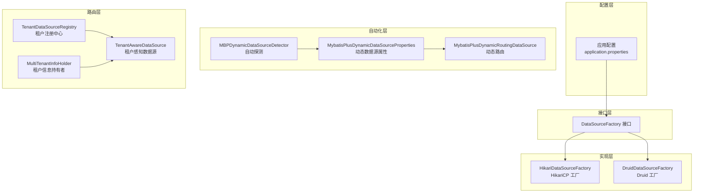
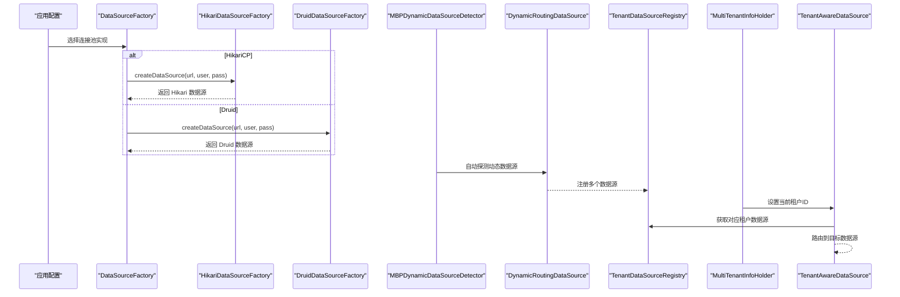
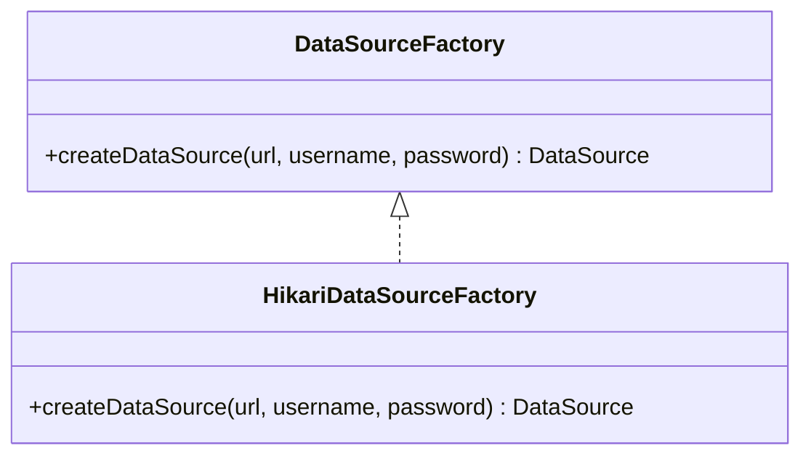
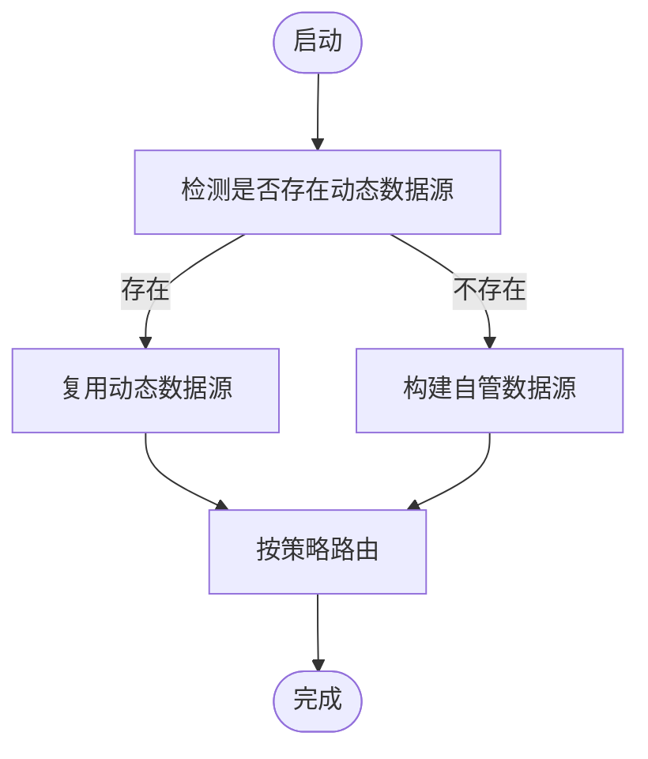
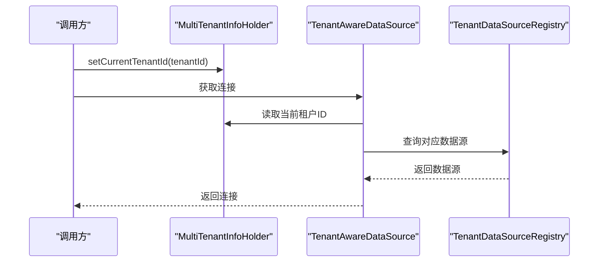
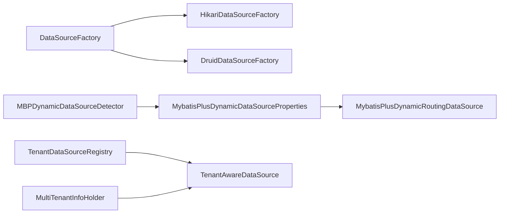

# 连接池配置与优化

<cite>
**本文引用的文件**
- [HikariDataSourceFactory.java](file://antflow-engine/src/main/java/org/openoa/engine/conf/engineconfig/HikariDataSourceFactory.java)
- [DataSourceFactory.java](file://antflow-engine/src/main/java/org/openoa/engine/conf/engineconfig/DataSourceFactory.java)
- [DruidDataSourceFactory.java](file://antflow-engine/src/main/java/org/openoa/engine/conf/engineconfig/DruidDataSourceFactory.java)
- [GenericDruidDataSourceConfig.java](file://antflow-engine/src/main/java/org/openoa/engine/conf/engineconfig/GenericDruidDataSourceConfig.java)
- [DataSourceConfVal.java](file://antflow-engine/src/main/java/org/openoa/engine/conf/confval/DataSourceConfVal.java)
- [BizDataSourceConfVal.java](file://antflow-engine/src/main/java/org/openoa/engine/conf/confval/BizDataSourceConfVal.java)
- [MybatisPlusDynamicRoutingDataSource.java](file://antflow-engine/src/main/java/org/openoa/engine/conf/mybatis/MybatisPlusDynamicRoutingDataSource.java)
- [MybatisPlusDynamicDataSourceProperties.java](file://antflow-engine/src/main/java/org/openoa/engine/conf/mybatis/MybatisPlusDynamicDataSourceProperties.java)
- [MBPDynamicDataSourceDetector.java](file://antflow-engine/src/main/java/org/openoa/engine/conf/engineconfig/MBPDynamicDataSourceDetector.java)
- [TenantAwareDataSource.java](file://antflow-base/src/main/java/org/activiti/engine/impl/cfg/multitenant/TenantAwareDataSource.java)
- [TenantDataSourceRegistry.java](file://antflow-engine/src/main/java/org/openoa/engine/conf/engineconfig/TenantDataSourceRegistry.java)
- [MultiTenantInfoHolder.java](file://antflow-engine/src/main/java/org/openoa/engine/conf/engineconfig/MultiTenantInfoHolder.java)
- [MultiSchemaMultiTenantDataSourceProcessEngineAutoConfiguration.java](file://antflow-engine/src/main/java/org/openoa/engine/conf/engineconfig/MultiSchemaMultiTenantDataSourceProcessEngineAutoConfiguration.java)
- [DataSourceProcessEngineAutoConfiguration.java](file://antflow-engine/src/main/java/org/openoa/engine/conf/engineconfig/DataSourceProcessEngineAutoConfiguration.java)
- [DataSourceUtils.java](file://antflow-base/src/main/java/org/openoa/base/util/DataSourceUtils.java)
- [application.properties](file://antflow-web/src/main/resources/application.properties)
- [application-dev.properties](file://antflow-web/src/main/resources/application-dev.properties)
</cite>

## 目录
1. [简介](#简介)
2. [项目结构](#项目结构)
3. [核心组件](#核心组件)
4. [架构总览](#架构总览)
5. [详细组件分析](#详细组件分析)
6. [依赖关系分析](#依赖关系分析)
7. [性能考虑](#性能考虑)
8. [故障排查指南](#故障排查指南)
9. [结论](#结论)
10. [附录](#附录)

## 简介
本文件面向 AntFlow 的连接池配置与优化，系统性梳理项目中对连接池的支持与实现，重点覆盖以下方面：
- Druid 与 HikariCP 的配置差异、性能特点与适用场景
- 不同数据库的连接池参数优化策略（最大连接数、超时、连接验证）
- 动态数据源路由与多数据源环境下的连接池管理
- 连接池监控指标、性能调优建议、连接泄漏检测与解决方案
- 生产环境最佳实践配置示例

## 项目结构
AntFlow 在连接池与多数据源方面采用“接口抽象 + 工厂选择 + 自动探测 + 租户路由”的分层设计：
- 接口层：统一的 DataSourceFactory 抽象，屏蔽具体实现细节
- 实现层：HikariCP 与 Druid 的工厂实现，便于按需切换
- 自动化层：基于 MyBatis-Plus Dynamic-DS 的自动探测与复用
- 路由层：多租户场景下的数据源路由与注册中心
- 配置层：通过 Spring 环境变量与属性绑定加载配置

图表来源
- [HikariDataSourceFactory.java:1-26](file://antflow-engine/src/main/java/org/openoa/engine/conf/engineconfig/HikariDataSourceFactory.java#L1-L26)
- [DruidDataSourceFactory.java:1-28](file://antflow-engine/src/main/java/org/openoa/engine/conf/engineconfig/DruidDataSourceFactory.java#L1-L28)
- [MBPDynamicDataSourceDetector.java:1-58](file://antflow-engine/src/main/java/org/openoa/engine/conf/engineconfig/MBPDynamicDataSourceDetector.java#L1-L58)
- [MybatisPlusDynamicDataSourceProperties.java:1-61](file://antflow-engine/src/main/java/org/openoa/engine/conf/mybatis/MybatisPlusDynamicDataSourceProperties.java#L1-L61)
- [MybatisPlusDynamicRoutingDataSource.java:1-29](file://antflow-engine/src/main/java/org/openoa/engine/conf/mybatis/MybatisPlusDynamicRoutingDataSource.java#L1-L29)
- [TenantDataSourceRegistry.java:1-40](file://antflow-engine/src/main/java/org/openoa/engine/conf/engineconfig/TenantDataSourceRegistry.java#L1-L40)
- [MultiTenantInfoHolder.java:1-41](file://antflow-engine/src/main/java/org/openoa/engine/conf/engineconfig/MultiTenantInfoHolder.java#L1-L41)
- [TenantAwareDataSource.java:1-70](file://antflow-base/src/main/java/org/activiti/engine/impl/cfg/multitenant/TenantAwareDataSource.java#L1-L70)

章节来源
- [HikariDataSourceFactory.java:1-26](file://antflow-engine/src/main/java/org/openoa/engine/conf/engineconfig/HikariDataSourceFactory.java#L1-L26)
- [DataSourceFactory.java:1-8](file://antflow-engine/src/main/java/org/openoa/engine/conf/engineconfig/DataSourceFactory.java#L1-L8)
- [DruidDataSourceFactory.java:1-28](file://antflow-engine/src/main/java/org/openoa/engine/conf/engineconfig/DruidDataSourceFactory.java#L1-L28)
- [GenericDruidDataSourceConfig.java:1-18](file://antflow-engine/src/main/java/org/openoa/engine/conf/engineconfig/GenericDruidDataSourceConfig.java#L1-L18)
- [MBPDynamicDataSourceDetector.java:1-58](file://antflow-engine/src/main/java/org/openoa/engine/conf/engineconfig/MBPDynamicDataSourceDetector.java#L1-L58)
- [MybatisPlusDynamicDataSourceProperties.java:1-61](file://antflow-engine/src/main/java/org/openoa/engine/conf/mybatis/MybatisPlusDynamicDataSourceProperties.java#L1-L61)
- [MybatisPlusDynamicRoutingDataSource.java:1-29](file://antflow-engine/src/main/java/org/openoa/engine/conf/mybatis/MybatisPlusDynamicRoutingDataSource.java#L1-L29)
- [TenantDataSourceRegistry.java:1-40](file://antflow-engine/src/main/java/org/openoa/engine/conf/engineconfig/TenantDataSourceRegistry.java#L1-L40)
- [MultiTenantInfoHolder.java:1-41](file://antflow-engine/src/main/java/org/openoa/engine/conf/engineconfig/MultiTenantInfoHolder.java#L1-L41)
- [TenantAwareDataSource.java:1-70](file://antflow-base/src/main/java/org/activiti/engine/impl/cfg/multitenant/TenantAwareDataSource.java#L1-L70)

## 核心组件
- DataSourceFactory 接口：定义统一的数据源创建能力，便于替换底层实现
- HikariDataSourceFactory：默认工厂，直接创建 HikariCP 数据源并设置基础参数
- DruidDataSourceFactory/GenericDruidDataSourceConfig：预留 Druid 工厂与基础 Druid 数据源配置（注释状态，可启用）
- MBPDynamicDataSourceDetector：自动探测 MyBatis-Plus 动态数据源，优先复用
- MybatisPlusDynamicDataSourceProperties/MybatisPlusDynamicRoutingDataSource：构建与装配动态数据源
- TenantAwareDataSource/TenantDataSourceRegistry/MultiTenantInfoHolder：多租户场景下的数据源路由与注册
- DataSourceProcessEngineAutoConfiguration/MultiSchemaMultiTenantDataSourceProcessEngineAutoConfiguration：流程引擎与事务管理装配

章节来源
- [DataSourceFactory.java:1-8](file://antflow-engine/src/main/java/org/openoa/engine/conf/engineconfig/DataSourceFactory.java#L1-L8)
- [HikariDataSourceFactory.java:1-26](file://antflow-engine/src/main/java/org/openoa/engine/conf/engineconfig/HikariDataSourceFactory.java#L1-L26)
- [DruidDataSourceFactory.java:1-28](file://antflow-engine/src/main/java/org/openoa/engine/conf/engineconfig/DruidDataSourceFactory.java#L1-L28)
- [GenericDruidDataSourceConfig.java:1-18](file://antflow-engine/src/main/java/org/openoa/engine/conf/engineconfig/GenericDruidDataSourceConfig.java#L1-L18)
- [MBPDynamicDataSourceDetector.java:1-58](file://antflow-engine/src/main/java/org/openoa/engine/conf/engineconfig/MBPDynamicDataSourceDetector.java#L1-L58)
- [MybatisPlusDynamicDataSourceProperties.java:1-61](file://antflow-engine/src/main/java/org/openoa/engine/conf/mybatis/MybatisPlusDynamicDataSourceProperties.java#L1-L61)
- [MybatisPlusDynamicRoutingDataSource.java:1-29](file://antflow-engine/src/main/java/org/openoa/engine/conf/mybatis/MybatisPlusDynamicRoutingDataSource.java#L1-L29)
- [TenantAwareDataSource.java:1-70](file://antflow-base/src/main/java/org/activiti/engine/impl/cfg/multitenant/TenantAwareDataSource.java#L1-L70)
- [TenantDataSourceRegistry.java:1-40](file://antflow-engine/src/main/java/org/openoa/engine/conf/engineconfig/TenantDataSourceRegistry.java#L1-L40)
- [MultiTenantInfoHolder.java:1-41](file://antflow-engine/src/main/java/org/openoa/engine/conf/engineconfig/MultiTenantInfoHolder.java#L1-L41)
- [DataSourceProcessEngineAutoConfiguration.java:1-71](file://antflow-engine/src/main/java/org/openoa/engine/conf/engineconfig/DataSourceProcessEngineAutoConfiguration.java#L1-L71)
- [MultiSchemaMultiTenantDataSourceProcessEngineAutoConfiguration.java:23-51](file://antflow-engine/src/main/java/org/openoa/engine/conf/engineconfig/MultiSchemaMultiTenantDataSourceProcessEngineAutoConfiguration.java#L23-L51)

## 架构总览
下图展示连接池与多数据源在 AntFlow 中的整体交互路径：从配置加载到工厂创建，再到动态路由与租户切换。

图表来源
- [HikariDataSourceFactory.java:15-26](file://antflow-engine/src/main/java/org/openoa/engine/conf/engineconfig/HikariDataSourceFactory.java#L15-L26)
- [DruidDataSourceFactory.java:14-27](file://antflow-engine/src/main/java/org/openoa/engine/conf/engineconfig/DruidDataSourceFactory.java#L14-L27)
- [MBPDynamicDataSourceDetector.java:24-51](file://antflow-engine/src/main/java/org/openoa/engine/conf/engineconfig/MBPDynamicDataSourceDetector.java#L24-L51)
- [MybatisPlusDynamicRoutingDataSource.java:17-28](file://antflow-engine/src/main/java/org/openoa/engine/conf/mybatis/MybatisPlusDynamicRoutingDataSource.java#L17-L28)
- [TenantDataSourceRegistry.java:22-38](file://antflow-engine/src/main/java/org/openoa/engine/conf/engineconfig/TenantDataSourceRegistry.java#L22-L38)
- [MultiTenantInfoHolder.java:26-34](file://antflow-engine/src/main/java/org/openoa/engine/conf/engineconfig/MultiTenantInfoHolder.java#L26-L34)
- [TenantAwareDataSource.java:64-67](file://antflow-base/src/main/java/org/activiti/engine/impl/cfg/multitenant/TenantAwareDataSource.java#L64-L67)

## 详细组件分析

### HikariCP 工厂实现
- 设计要点
  - 通过接口抽象屏蔽具体实现，便于替换
  - 默认设置最大池大小与最小空闲数，满足一般并发需求
  - 可通过自定义实现覆盖默认行为
- 参数说明
  - 最大连接数：由工厂设置，可根据业务峰值调整
  - 最小空闲：维持一定空闲连接以降低新建连接开销
- 适用场景
  - 对延迟敏感、吞吐量要求高的场景
  - 默认配置即可满足大多数生产环境

图表来源
- [DataSourceFactory.java:5-7](file://antflow-engine/src/main/java/org/openoa/engine/conf/engineconfig/DataSourceFactory.java#L5-L7)
- [HikariDataSourceFactory.java:15-25](file://antflow-engine/src/main/java/org/openoa/engine/conf/engineconfig/HikariDataSourceFactory.java#L15-L25)

章节来源
- [HikariDataSourceFactory.java:1-26](file://antflow-engine/src/main/java/org/openoa/engine/conf/engineconfig/HikariDataSourceFactory.java#L1-L26)
- [DataSourceFactory.java:1-8](file://antflow-engine/src/main/java/org/openoa/engine/conf/engineconfig/DataSourceFactory.java#L1-L8)

### Druid 工厂与通用配置（预留）
- 设计要点
  - 提供 Druid 基础数据源与工厂实现（当前为注释状态，可启用）
  - 支持通过属性前缀绑定 Druid 特有配置
- 参数说明
  - 初始连接数、最大活跃数、移除长时间未使用连接等
  - 适用于需要精细连接池控制与统计的场景
- 适用场景
  - 需要连接池监控与复杂参数调优的生产环境

章节来源
- [DruidDataSourceFactory.java:1-28](file://antflow-engine/src/main/java/org/openoa/engine/conf/engineconfig/DruidDataSourceFactory.java#L1-L28)
- [GenericDruidDataSourceConfig.java:1-18](file://antflow-engine/src/main/java/org/openoa/engine/conf/engineconfig/GenericDruidDataSourceConfig.java#L1-L18)
- [DataSourceConfVal.java:1-51](file://antflow-engine/src/main/java/org/openoa/engine/conf/confval/DataSourceConfVal.java#L1-L51)
- [BizDataSourceConfVal.java:1-24](file://antflow-engine/src/main/java/org/openoa/engine/conf/confval/BizDataSourceConfVal.java#L1-L24)

### 动态数据源与自动探测
- 设计要点
  - 通过 MBPDynamicDataSourceDetector 自动发现 MyBatis-Plus 动态数据源
  - 若存在动态数据源，则优先复用；否则回退到 AntFlow 自管数据源
  - 动态数据源属性与路由组件负责装配与策略控制
- 参数说明
  - 主库标识、严格模式、策略与 P6Spy/Seata 等扩展开关
  - 可结合 Druid/HikariCP 配置实现差异化参数
- 适用场景
  - 多业务库分离、主从/读写分离、按库路由的复杂数据模型

图表来源
- [MBPDynamicDataSourceDetector.java:24-51](file://antflow-engine/src/main/java/org/openoa/engine/conf/engineconfig/MBPDynamicDataSourceDetector.java#L24-L51)
- [MybatisPlusDynamicDataSourceProperties.java:30-39](file://antflow-engine/src/main/java/org/openoa/engine/conf/mybatis/MybatisPlusDynamicDataSourceProperties.java#L30-L39)
- [MybatisPlusDynamicRoutingDataSource.java:17-28](file://antflow-engine/src/main/java/org/openoa/engine/conf/mybatis/MybatisPlusDynamicRoutingDataSource.java#L17-L28)

章节来源
- [MBPDynamicDataSourceDetector.java:1-58](file://antflow-engine/src/main/java/org/openoa/engine/conf/engineconfig/MBPDynamicDataSourceDetector.java#L1-L58)
- [MybatisPlusDynamicDataSourceProperties.java:1-61](file://antflow-engine/src/main/java/org/openoa/engine/conf/mybatis/MybatisPlusDynamicDataSourceProperties.java#L1-L61)
- [MybatisPlusDynamicRoutingDataSource.java:1-29](file://antflow-engine/src/main/java/org/openoa/engine/conf/mybatis/MybatisPlusDynamicRoutingDataSource.java#L1-L29)

### 多租户数据源路由
- 设计要点
  - TenantAwareDataSource 根据当前租户 ID 选择对应数据源
  - TenantDataSourceRegistry 维护租户到数据源的映射
  - MultiTenantInfoHolder 通过线程上下文持有当前租户标识
- 参数说明
  - 路由键（租户 ID）、默认租户回退策略
  - 结合动态数据源可实现“每租户一库”或“多租户共享库”
- 适用场景
  - SaaS 场景下的多租户隔离与资源控制

图表来源
- [MultiTenantInfoHolder.java:26-34](file://antflow-engine/src/main/java/org/openoa/engine/conf/engineconfig/MultiTenantInfoHolder.java#L26-L34)
- [TenantAwareDataSource.java:64-67](file://antflow-base/src/main/java/org/activiti/engine/impl/cfg/multitenant/TenantAwareDataSource.java#L64-L67)
- [TenantDataSourceRegistry.java:22-38](file://antflow-engine/src/main/java/org/openoa/engine/conf/engineconfig/TenantDataSourceRegistry.java#L22-L38)

章节来源
- [TenantAwareDataSource.java:1-70](file://antflow-base/src/main/java/org/activiti/engine/impl/cfg/multitenant/TenantAwareDataSource.java#L1-L70)
- [TenantDataSourceRegistry.java:1-40](file://antflow-engine/src/main/java/org/openoa/engine/conf/engineconfig/TenantDataSourceRegistry.java#L1-L40)
- [MultiTenantInfoHolder.java:1-41](file://antflow-engine/src/main/java/org/openoa/engine/conf/engineconfig/MultiTenantInfoHolder.java#L1-L41)

### 流程引擎与事务管理装配
- 设计要点
  - 自动装配 DataSourceTransactionManager 与 SpringProcessEngineConfiguration
  - 支持多租户场景下的事务与数据源绑定
- 适用场景
  - 与 Activiti 流程引擎集成时的统一事务管理

章节来源
- [DataSourceProcessEngineAutoConfiguration.java:1-71](file://antflow-engine/src/main/java/org/openoa/engine/conf/engineconfig/DataSourceProcessEngineAutoConfiguration.java#L1-L71)
- [MultiSchemaMultiTenantDataSourceProcessEngineAutoConfiguration.java:23-51](file://antflow-engine/src/main/java/org/openoa/engine/conf/engineconfig/MultiSchemaMultiTenantDataSourceProcessEngineAutoConfiguration.java#L23-L51)

## 依赖关系分析
- 组件耦合
  - DataSourceFactory 与具体实现解耦，便于替换
  - MBPDynamicDataSourceDetector 与 MyBatis-Plus 动态数据源强耦合，但通过反射避免强制依赖
  - 多租户路由依赖线程上下文与注册中心，保持无侵入式
- 外部依赖
  - HikariCP 与 Druid 均为常用连接池实现
  - MyBatis-Plus Dynamic-DS 提供动态数据源能力
  - Spring Transaction 管理事务

图表来源
- [DataSourceFactory.java:5-7](file://antflow-engine/src/main/java/org/openoa/engine/conf/engineconfig/DataSourceFactory.java#L5-L7)
- [HikariDataSourceFactory.java:15-25](file://antflow-engine/src/main/java/org/openoa/engine/conf/engineconfig/HikariDataSourceFactory.java#L15-L25)
- [DruidDataSourceFactory.java:14-27](file://antflow-engine/src/main/java/org/openoa/engine/conf/engineconfig/DruidDataSourceFactory.java#L14-L27)
- [MBPDynamicDataSourceDetector.java:24-51](file://antflow-engine/src/main/java/org/openoa/engine/conf/engineconfig/MBPDynamicDataSourceDetector.java#L24-L51)
- [MybatisPlusDynamicDataSourceProperties.java:30-39](file://antflow-engine/src/main/java/org/openoa/engine/conf/mybatis/MybatisPlusDynamicDataSourceProperties.java#L30-L39)
- [MybatisPlusDynamicRoutingDataSource.java:17-28](file://antflow-engine/src/main/java/org/openoa/engine/conf/mybatis/MybatisPlusDynamicRoutingDataSource.java#L17-L28)
- [TenantDataSourceRegistry.java:22-38](file://antflow-engine/src/main/java/org/openoa/engine/conf/engineconfig/TenantDataSourceRegistry.java#L22-L38)
- [TenantAwareDataSource.java:64-67](file://antflow-base/src/main/java/org/activiti/engine/impl/cfg/multitenant/TenantAwareDataSource.java#L64-L67)

章节来源
- [DataSourceFactory.java:1-8](file://antflow-engine/src/main/java/org/openoa/engine/conf/engineconfig/DataSourceFactory.java#L1-L8)
- [HikariDataSourceFactory.java:1-26](file://antflow-engine/src/main/java/org/openoa/engine/conf/engineconfig/HikariDataSourceFactory.java#L1-L26)
- [DruidDataSourceFactory.java:1-28](file://antflow-engine/src/main/java/org/openoa/engine/conf/engineconfig/DruidDataSourceFactory.java#L1-L28)
- [MBPDynamicDataSourceDetector.java:1-58](file://antflow-engine/src/main/java/org/openoa/engine/conf/engineconfig/MBPDynamicDataSourceDetector.java#L1-L58)
- [MybatisPlusDynamicDataSourceProperties.java:1-61](file://antflow-engine/src/main/java/org/openoa/engine/conf/mybatis/MybatisPlusDynamicDataSourceProperties.java#L1-L61)
- [MybatisPlusDynamicRoutingDataSource.java:1-29](file://antflow-engine/src/main/java/org/openoa/engine/conf/mybatis/MybatisPlusDynamicRoutingDataSource.java#L1-L29)
- [TenantDataSourceRegistry.java:1-40](file://antflow-engine/src/main/java/org/openoa/engine/conf/engineconfig/TenantDataSourceRegistry.java#L1-L40)
- [TenantAwareDataSource.java:1-70](file://antflow-base/src/main/java/org/activiti/engine/impl/cfg/multitenant/TenantAwareDataSource.java#L1-L70)

## 性能考虑
- 连接池选择
  - HikariCP：默认高性能，适合大多数场景；可通过最大连接数与空闲连接策略平衡延迟与资源占用
  - Druid：功能丰富，适合需要精细化监控与参数调优的场景；注意避免过度配置导致资源浪费
- 参数优化建议
  - 最大连接数：根据并发峰值与数据库最大连接限制综合评估，留出安全余量
  - 超时设置：连接获取超时、空闲回收周期、连接生命周期需与业务请求特性匹配
  - 连接验证：启用合理的验证查询与测试策略，避免返回失效连接
- 动态数据源与多租户
  - 合理设置主库优先与路由策略，避免跨库事务与热点集中
  - 多租户隔离时，建议为高并发租户单独配置连接池参数
- 监控与告警
  - 关注连接池活跃数、等待时间、拒绝次数、泄漏检测等指标
  - 结合数据库侧指标（连接数、锁等待、慢查询）进行关联分析

## 故障排查指南
- 连接泄漏
  - 现象：连接池活跃数持续上升、数据库连接数接近上限
  - 排查：检查业务代码是否正确关闭 Statement/ResultSet/Connection；启用 Druid/HikariCP 的泄漏检测
  - 解决：确保资源在 finally 块或 try-with-resources 中释放；优化长事务与批量处理
- 连接抖动
  - 现象：频繁创建/销毁连接，延迟升高
  - 排查：确认初始连接数与最大连接数设置是否合理；检查连接池回收策略
  - 解决：适当提高初始连接数与最小空闲；延长连接生命周期
- 路由错误
  - 现象：租户间数据混淆
  - 排查：确认 MultiTenantInfoHolder 是否正确设置当前租户；TenantAwareDataSource 是否命中正确数据源
  - 解决：在请求入口统一设置租户上下文；核对注册中心映射
- 动态数据源冲突
  - 现象：与自管数据源同时生效导致路由混乱
  - 排查：确认 MBPDynamicDataSourceDetector 是否正确识别动态数据源
  - 解决：优先使用动态数据源；若禁用动态数据源，确保自管数据源配置完整

章节来源
- [DataSourceUtils.java:12-27](file://antflow-base/src/main/java/org/openoa/base/util/DataSourceUtils.java#L12-L27)
- [MBPDynamicDataSourceDetector.java:24-51](file://antflow-engine/src/main/java/org/openoa/engine/conf/engineconfig/MBPDynamicDataSourceDetector.java#L24-L51)
- [TenantAwareDataSource.java:64-67](file://antflow-base/src/main/java/org/activiti/engine/impl/cfg/multitenant/TenantAwareDataSource.java#L64-L67)

## 结论
AntFlow 在连接池与多数据源方面提供了灵活且可扩展的实现方案：
- 通过 DataSourceFactory 抽象实现连接池可插拔
- 优先复用 MyBatis-Plus 动态数据源，简化多库管理
- 多租户路由与注册中心保障了租户隔离与一致性
- 建议在生产环境中结合业务特征与数据库能力，针对性优化连接池参数，并建立完善的监控与告警体系

## 附录
- 生产环境最佳实践配置示例（基于仓库中可用的配置文件）
  - 应用配置
    - 开发环境示例：参考 [application-dev.properties](file://antflow-web/src/main/resources/application-dev.properties)
    - 全量配置示例：参考 [application.properties](file://antflow-web/src/main/resources/application.properties)
  - 连接池参数建议
    - HikariCP：最大连接数、最小空闲、连接生命周期、超时与验证策略
    - Druid：初始连接数、最大活跃数、移除长时间未使用连接、监控与统计
  - 多数据源与多租户
    - 动态数据源：启用 MyBatis-Plus Dynamic-DS 并配置主库与从库
    - 多租户：通过线程上下文设置租户 ID，TenantAwareDataSource 自动路由

章节来源
- [application-dev.properties](file://antflow-web/src/main/resources/application-dev.properties)
- [application.properties](file://antflow-web/src/main/resources/application.properties)
- [HikariDataSourceFactory.java:22-23](file://antflow-engine/src/main/java/org/openoa/engine/conf/engineconfig/HikariDataSourceFactory.java#L22-L23)
- [DataSourceConfVal.java:22-49](file://antflow-engine/src/main/java/org/openoa/engine/conf/confval/DataSourceConfVal.java#L22-L49)
- [MybatisPlusDynamicDataSourceProperties.java:30-39](file://antflow-engine/src/main/java/org/openoa/engine/conf/mybatis/MybatisPlusDynamicDataSourceProperties.java#L30-L39)
- [MultiTenantInfoHolder.java:26-34](file://antflow-engine/src/main/java/org/openoa/engine/conf/engineconfig/MultiTenantInfoHolder.java#L26-L34)
- [TenantAwareDataSource.java:64-67](file://antflow-base/src/main/java/org/activiti/engine/impl/cfg/multitenant/TenantAwareDataSource.java#L64-L67)