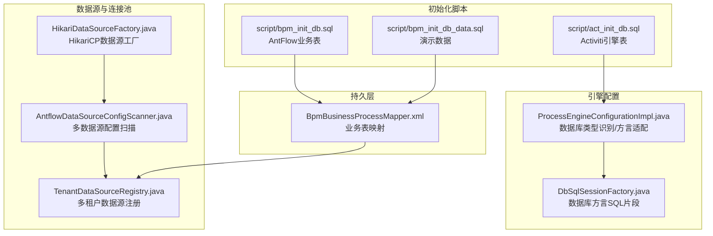
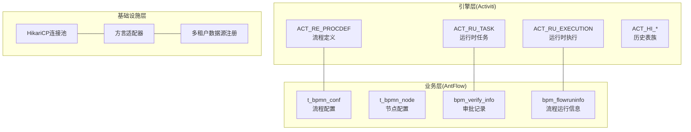
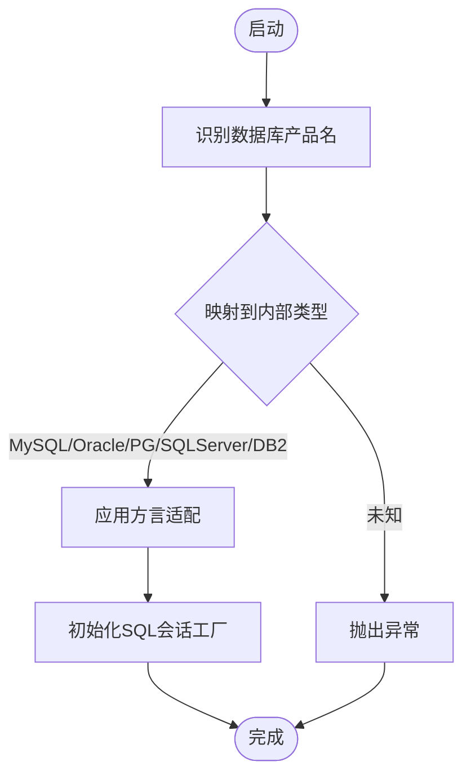
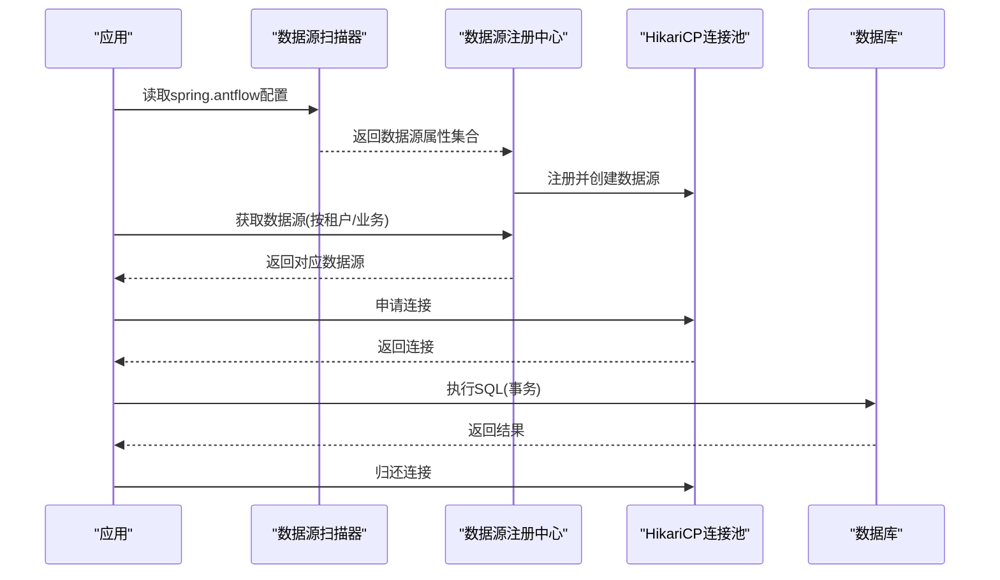
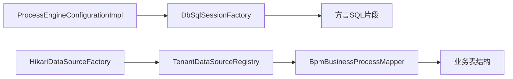

# 数据库架构概览

<cite>
**本文档引用的文件**
- [act_init_db.sql](file://script/act_init_db.sql)
- [bpm_init_db.sql](file://script/bpm_init_db.sql)
- [bpm_init_db_data.sql](file://script/bpm_init_db_data.sql)
- [ProcessEngineConfigurationImpl.java](file://antflow-base/src/main/java/org/activiti/engine/impl/cfg/ProcessEngineConfigurationImpl.java)
- [DbSqlSessionFactory.java](file://antflow-base/src/main/java/org/activiti/engine/impl/db/DbSqlSessionFactory.java)
- [HikariDataSourceFactory.java](file://antflow-engine/src/main/java/org/openoa/engine/conf/engineconfig/HikariDataSourceFactory.java)
- [AntflowDataSourceConfigScanner.java](file://antflow-engine/src/main/java/org/openoa/engine/conf/engineconfig/AntflowDataSourceConfigScanner.java)
- [TenantDataSourceRegistry.java](file://antflow-engine/src/main/java/org/openoa/engine/conf/engineconfig/TenantDataSourceRegistry.java)
- [BpmBusinessProcessMapper.xml](file://antflow-engine/src/main/resources/mapper/BpmBusinessProcessMapper.xml)
</cite>

## 目录
1. [简介](#简介)
2. [项目结构](#项目结构)
3. [核心组件](#核心组件)
4. [架构总览](#架构总览)
5. [详细组件分析](#详细组件分析)
6. [依赖关系分析](#依赖关系分析)
7. [性能考量](#性能考量)
8. [故障排查指南](#故障排查指南)
9. [结论](#结论)
10. [附录](#附录)

## 简介
本文件面向 AntFlow 工作流引擎的数据库架构，系统性梳理以下内容：
- 基于 Activiti 的工作流引擎表结构与职责边界
- AntFlow 自定义业务表结构与关键字段设计
- 多数据库支持策略与方言适配
- 表空间与分区策略建议
- 连接池与事务管理机制
- 并发控制与锁策略
- 数据库初始化脚本与版本升级策略
- 备份恢复方案
- 数据库架构图与部署拓扑说明

## 项目结构
AntFlow 的数据库相关实现主要分布在以下位置：
- 初始化脚本：位于 script 目录，包含 Activiti 引擎表与 AntFlow 自定义业务表的建表与基础数据
- Activiti 引擎配置：位于 antflow-base，负责数据库类型识别、方言适配与 SQL 会话工厂初始化
- 数据源与连接池：位于 antflow-engine，提供 HikariCP 数据源工厂与多租户数据源注册
- MyBatis 映射：位于 antflow-engine/resources/mapper，承载业务表的查询与更新逻辑

**图表来源**
- [act_init_db.sql:1-470](file://script/act_init_db.sql#L1-L470)
- [bpm_init_db.sql:1-2020](file://script/bpm_init_db.sql#L1-L2020)
- [ProcessEngineConfigurationImpl.java:730-929](file://antflow-base/src/main/java/org/activiti/engine/impl/cfg/ProcessEngineConfigurationImpl.java#L730-L929)
- [DbSqlSessionFactory.java:33-56](file://antflow-base/src/main/java/org/activiti/engine/impl/db/DbSqlSessionFactory.java#L33-L56)
- [HikariDataSourceFactory.java:1-27](file://antflow-engine/src/main/java/org/openoa/engine/conf/engineconfig/HikariDataSourceFactory.java#L1-L27)
- [AntflowDataSourceConfigScanner.java:1-30](file://antflow-engine/src/main/java/org/openoa/engine/conf/engineconfig/AntflowDataSourceConfigScanner.java#L1-L30)
- [TenantDataSourceRegistry.java:1-40](file://antflow-engine/src/main/java/org/openoa/engine/conf/engineconfig/TenantDataSourceRegistry.java#L1-L40)
- [BpmBusinessProcessMapper.xml:1-67](file://antflow-engine/src/main/resources/mapper/BpmBusinessProcessMapper.xml#L1-L67)

**章节来源**
- [act_init_db.sql:1-470](file://script/act_init_db.sql#L1-L470)
- [bpm_init_db.sql:1-2020](file://script/bpm_init_db.sql#L1-L2020)
- [ProcessEngineConfigurationImpl.java:730-929](file://antflow-base/src/main/java/org/activiti/engine/impl/cfg/ProcessEngineConfigurationImpl.java#L730-L929)
- [DbSqlSessionFactory.java:33-56](file://antflow-base/src/main/java/org/activiti/engine/impl/db/DbSqlSessionFactory.java#L33-L56)
- [HikariDataSourceFactory.java:1-27](file://antflow-engine/src/main/java/org/openoa/engine/conf/engineconfig/HikariDataSourceFactory.java#L1-L27)
- [AntflowDataSourceConfigScanner.java:1-30](file://antflow-engine/src/main/java/org/openoa/engine/conf/engineconfig/AntflowDataSourceConfigScanner.java#L1-L30)
- [TenantDataSourceRegistry.java:1-40](file://antflow-engine/src/main/java/org/openoa/engine/conf/engineconfig/TenantDataSourceRegistry.java#L1-L40)
- [BpmBusinessProcessMapper.xml:1-67](file://antflow-engine/src/main/resources/mapper/BpmBusinessProcessMapper.xml#L1-L67)

## 核心组件
- Activiti 引擎表：用于保存流程部署、执行、任务、变量、历史等运行期数据，支撑工作流生命周期管理
- AntFlow 业务表：围绕审批流配置、节点规则、通知模板、流程实例与审批记录等业务域构建
- 数据库方言与连接池：通过 HikariCP 提供高性能连接池，结合多数据源与多租户注册实现灵活扩展
- MyBatis 映射：以 XML 方式定义业务表查询与更新，确保与数据库结构的强耦合与可维护性

**章节来源**
- [act_init_db.sql:1-470](file://script/act_init_db.sql#L1-L470)
- [bpm_init_db.sql:1-2020](file://script/bpm_init_db.sql#L1-L2020)
- [HikariDataSourceFactory.java:1-27](file://antflow-engine/src/main/java/org/openoa/engine/conf/engineconfig/HikariDataSourceFactory.java#L1-L27)
- [BpmBusinessProcessMapper.xml:1-67](file://antflow-engine/src/main/resources/mapper/BpmBusinessProcessMapper.xml#L1-L67)

## 架构总览
AntFlow 数据库架构由三层组成：
- 引擎层：基于 Activiti 的工作流引擎表，负责流程定义、执行与历史数据管理
- 业务层：AntFlow 自定义业务表，承载流程配置、节点规则、通知模板与审批记录
- 基础设施层：数据源与连接池、方言适配与多租户支持

**图表来源**
- [act_init_db.sql:260-390](file://script/act_init_db.sql#L260-L390)
- [bpm_init_db.sql:1-200](file://script/bpm_init_db.sql#L1-L200)
- [ProcessEngineConfigurationImpl.java:777-844](file://antflow-base/src/main/java/org/activiti/engine/impl/cfg/ProcessEngineConfigurationImpl.java#L777-L844)
- [HikariDataSourceFactory.java:1-27](file://antflow-engine/src/main/java/org/openoa/engine/conf/engineconfig/HikariDataSourceFactory.java#L1-L27)
- [TenantDataSourceRegistry.java:1-40](file://antflow-engine/src/main/java/org/openoa/engine/conf/engineconfig/TenantDataSourceRegistry.java#L1-L40)

## 详细组件分析

### Activiti 引擎表结构分析
- 流程定义与部署：ACT_RE_PROCDEF、ACT_RE_DEPLOYMENT 等，保存流程定义元数据与部署信息
- 运行时状态：ACT_RU_EXECUTION、ACT_RU_TASK、ACT_RU_VARIABLE 等，记录当前执行实例、任务与变量
- 历史归档：ACT_HI_PROCINST、ACT_HI_TASKINST、ACT_HI_DETAIL 等，沉淀流程历史与审计数据
- 身份与组：ACT_ID_GROUP、ACT_ID_USER、ACT_ID_MEMBERSHIP 等，支撑用户与组织管理
- 作业与事件：ACT_RU_JOB、ACT_EVT_LOG 等，处理定时任务与事件日志

```mermaid
erDiagram
ACT_RE_PROCDEF {
string ID_
int REV_
string KEY_
int VERSION_
string NAME_
string DESCRIPTION_
string TENANT_ID_
}
ACT_RU_EXECUTION {
string ID_
string PROC_INST_ID_
string PROC_DEF_ID_
string BUSINESS_KEY_
int SUSPENSION_STATE_
string TENANT_ID_
}
ACT_RU_TASK {
string ID_
string PROC_INST_ID_
string PROC_DEF_ID_
string NAME_
string ASSIGNEE_
int PRIORITY_
timestamp CREATE_TIME_
string FORM_KEY_
string TENANT_ID_
}
ACT_HI_PROCINST {
string ID_
string PROC_INST_ID_
string PROC_DEF_ID_
timestamp START_TIME_
timestamp END_TIME_
string BUSINESS_KEY_
string DELETE_REASON_
string TENANT_ID_
}
ACT_HI_TASKINST {
string ID_
string PROC_INST_ID_
string PROC_DEF_ID_
string NAME_
string ASSIGNEE_
timestamp START_TIME_
timestamp END_TIME_
int PRIORITY_
string CATEGORY_
string TENANT_ID_
}
ACT_HI_DETAIL {
string ID_
string PROC_INST_ID_
string EXECUTION_ID_
string TASK_ID_
string NAME_
string VAR_TYPE_
timestamp TIME_
string BYTEARRAY_ID_
}
ACT_ID_USER {
string ID_
int REV_
string FIRST_
string LAST_
string EMAIL_
}
ACT_ID_GROUP {
string ID_
int REV_
string NAME_
string TYPE_
}
ACT_ID_MEMBERSHIP {
string USER_ID_
string GROUP_ID_
}
ACT_RU_JOB {
string ID_
string TYPE_
string PROCESS_INSTANCE_ID_
string EXECUTION_ID_
int RETRIES_
timestamp DUEDATE_
string HANDLER_TYPE_
string TENANT_ID_
}
ACT_EVT_LOG {
bigint LOG_NR_
string TYPE_
string PROC_DEF_ID_
string PROC_INST_ID_
string EXECUTION_ID_
string TASK_ID_
timestamp TIME_STAMP_
string USER_ID_
tinyint IS_PROCESSED_
}
```

**图表来源**
- [act_init_db.sql:260-470](file://script/act_init_db.sql#L260-L470)

**章节来源**
- [act_init_db.sql:1-470](file://script/act_init_db.sql#L1-L470)

### AntFlow 业务表结构分析
- 流程配置与节点：t_bpmn_conf、t_bpmn_node、t_bpmn_node_to 等，定义流程结构与流转规则
- 通知与模板：t_bpmn_conf_notice_template、t_bpmn_conf_notice_template_detail、t_information_template 等，支撑消息通知
- 流程运行与审批：bpm_flowruninfo、bpm_verify_info、bpm_process_node_record 等，记录流程实例与审批轨迹
- 变量与按钮：t_bpm_variable、t_bpm_variable_button、t_bpm_variable_message 等，支撑低代码与动态表单
- 草稿与委托：bpm_business_draft、bpm_flowrun_entrust 等，支持草稿保存与代理委托

```mermaid
erDiagram
t_bpmn_conf {
int id PK
string bpmn_code
string bpmn_name
int bpmn_type
string form_code
int app_id
int effective_status
int is_all
int is_out_side_process
int is_lowcode_flow
int business_party_id
string tenant_id
int is_del
timestamp create_time
timestamp update_time
}
t_bpmn_node {
bigint id PK
bigint conf_id FK
string node_id
int node_type
int node_property
string node_from
string node_froms
int batch_status
int approval_standard
int is_deduplication
int is_sign_up
int is_parallel
int is_dynamicCondition
string tenant_id
int is_del
timestamp create_time
timestamp update_time
}
t_bpmn_node_to {
bigint id PK
bigint bpmn_node_id FK
string node_to
string tenant_id
timestamp create_time
timestamp update_time
}
t_bpmn_conf_notice_template {
int id PK
string bpmn_code
int is_del
string tenant_id
timestamp create_time
timestamp update_time
}
t_bpmn_conf_notice_template_detail {
int id PK
string bpmn_code
int notice_template_type
string notice_template_detail
int is_del
string tenant_id
timestamp create_time
timestamp update_time
}
t_information_template {
bigint id PK
string name
string num
string system_title
string system_content
string mail_title
string mail_content
string note_content
int jump_url
int status
int event
string event_name
string tenant_id
int is_del
timestamp create_time
timestamp update_time
}
bpm_flowruninfo {
bigint id PK
string runinfoid
string create_UserId
string entitykey
string entityclass
string entitykeytype
string createactor
string createdepart
timestamp createdate
int is_del
string tenant_id
}
bpm_verify_info {
bigint id PK
string run_info_id
string verify_user_id
string verify_user_name
int verify_status
string verify_desc
timestamp verify_date
string task_name
string task_id
string task_def_key
int business_type
string business_id
string original_id
string process_code
int is_del
string tenant_id
}
bpm_process_node_record {
bigint id PK
string processInstance_id
string task_id
timestamp create_time
int is_del
string tenant_id
}
t_bpm_variable {
bigint id PK
string process_num
string process_name
string process_desc
text process_start_conditions
string bpmn_code
int is_new_data
string remark
int is_del
string tenant_id
timestamp create_time
timestamp update_time
}
t_bpm_variable_button {
bigint id PK
bigint variable_id FK
string element_id
int button_page_type
int button_type
string button_name
int is_del
string tenant_id
timestamp create_time
timestamp update_time
}
t_bpm_variable_message {
bigint id PK
bigint variable_id FK
string element_id
int message_type
int event_type
text content
int is_del
string tenant_id
timestamp create_time
timestamp update_time
}
bpm_business_draft {
bigint id PK
string bpmn_code
timestamp create_time
string process_code
string create_user_name
string create_user
string process_key
text draft_json
int is_del
string tenant_id
}
bpm_flowrun_entrust {
int id PK
string runinfoid
string runtaskid
string original
string original_name
string actual
string actual_name
int type
int is_read
string proc_def_id
int is_view
int is_del
string node_id
int action_type
string tenant_id
}
```

**图表来源**
- [bpm_init_db.sql:1-2020](file://script/bpm_init_db.sql#L1-L2020)

**章节来源**
- [bpm_init_db.sql:1-2020](file://script/bpm_init_db.sql#L1-L2020)

### 多数据库支持策略
- 数据库类型识别：通过数据库产品名映射到内部类型常量，支持 MySQL、Oracle、PostgreSQL、SQL Server、DB2 等
- 方言适配：针对不同数据库设置分页、排序与 LIMIT 子句的方言片段，保证跨数据库一致性
- 连接池与驱动：HikariCP 作为默认连接池，可通过自定义工厂替换为 Druid 或其他实现

**图表来源**
- [ProcessEngineConfigurationImpl.java:777-844](file://antflow-base/src/main/java/org/activiti/engine/impl/cfg/ProcessEngineConfigurationImpl.java#L777-L844)
- [DbSqlSessionFactory.java:33-56](file://antflow-base/src/main/java/org/activiti/engine/impl/db/DbSqlSessionFactory.java#L33-L56)

**章节来源**
- [ProcessEngineConfigurationImpl.java:777-844](file://antflow-base/src/main/java/org/activiti/engine/impl/cfg/ProcessEngineConfigurationImpl.java#L777-L844)
- [DbSqlSessionFactory.java:33-56](file://antflow-base/src/main/java/org/activiti/engine/impl/db/DbSqlSessionFactory.java#L33-L56)

### 数据库初始化脚本与版本升级
- 初始化脚本：包含 Activiti 引擎表与 AntFlow 业务表的建表语句，以及演示数据插入
- 版本升级：建议采用数据库迁移工具（如 Flyway/liquibase），以版本化方式管理表结构变更与数据迁移
- 备份恢复：生产环境应制定定期全量备份与增量备份策略，并定期演练恢复流程

**章节来源**
- [act_init_db.sql:1-470](file://script/act_init_db.sql#L1-L470)
- [bpm_init_db.sql:1-2020](file://script/bpm_init_db.sql#L1-L2020)
- [bpm_init_db_data.sql:1-104](file://script/bpm_init_db_data.sql#L1-L104)

### 连接池与事务管理
- 连接池：默认使用 HikariCP，支持最大连接数、最小空闲连接、连接超时等参数调优
- 事务管理：基于 JdbcTransactionFactory，默认启用本地事务；支持外部事务托管
- 多数据源与多租户：通过 AntflowDataSourceConfigScanner 扫描配置，TenantDataSourceRegistry 统一注册与路由

**图表来源**
- [AntflowDataSourceConfigScanner.java:1-30](file://antflow-engine/src/main/java/org/openoa/engine/conf/engineconfig/AntflowDataSourceConfigScanner.java#L1-L30)
- [TenantDataSourceRegistry.java:1-40](file://antflow-engine/src/main/java/org/openoa/engine/conf/engineconfig/TenantDataSourceRegistry.java#L1-L40)
- [HikariDataSourceFactory.java:1-27](file://antflow-engine/src/main/java/org/openoa/engine/conf/engineconfig/HikariDataSourceFactory.java#L1-L27)

**章节来源**
- [HikariDataSourceFactory.java:1-27](file://antflow-engine/src/main/java/org/openoa/engine/conf/engineconfig/HikariDataSourceFactory.java#L1-L27)
- [AntflowDataSourceConfigScanner.java:1-30](file://antflow-engine/src/main/java/org/openoa/engine/conf/engineconfig/AntflowDataSourceConfigScanner.java#L1-L30)
- [TenantDataSourceRegistry.java:1-40](file://antflow-engine/src/main/java/org/openoa/engine/conf/engineconfig/TenantDataSourceRegistry.java#L1-L40)

### 并发控制与锁策略
- 工作流并发：通过 ACT_RU_EXECUTION 与 ACT_RU_TASK 的状态字段（如 SUSPENSION_STATE、IS_CONCURRENT）控制并发执行
- 乐观锁：MyBatis Plus 提供乐观锁插件，适用于业务表的并发更新场景
- 事务隔离：根据业务需求设置合理的事务隔离级别，避免脏读与幻读

**章节来源**
- [MybatisPlusConfig.java:86-95](file://antflow-engine/src/main/java/org/openoa/engine/conf/mybatis/MybatisPlusConfig.java#L86-L95)
- [act_init_db.sql:316-390](file://script/act_init_db.sql#L316-L390)

### 表空间与分区策略建议
- 表空间划分：将历史表（ACT_HI_*）与运行表（ACT_RU_*）分离至不同表空间，降低运行期写入对历史查询的影响
- 分区策略：对历史表按时间分区（如按月/季度），并建立合适的分区裁剪键（如 START_TIME_、END_TIME_）
- 索引优化：为高频过滤字段（如 BPMN_CODE、RUNINFON_ID、ASSIGNEE_NAME）建立复合索引，减少全表扫描

**章节来源**
- [act_init_db.sql:53-215](file://script/act_init_db.sql#L53-L215)
- [bpm_init_db.sql:1-2020](file://script/bpm_init_db.sql#L1-L2020)

## 依赖关系分析
- 引擎配置依赖数据库类型识别与方言适配，确保 SQL 在不同数据库上正确生成
- 数据源工厂与注册中心共同构成多租户数据源体系，支撑业务按租户隔离
- MyBatis 映射依赖业务表结构，查询条件与更新语句与表字段保持一致

**图表来源**
- [ProcessEngineConfigurationImpl.java:846-929](file://antflow-base/src/main/java/org/activiti/engine/impl/cfg/ProcessEngineConfigurationImpl.java#L846-L929)
- [DbSqlSessionFactory.java:33-56](file://antflow-base/src/main/java/org/activiti/engine/impl/db/DbSqlSessionFactory.java#L33-L56)
- [HikariDataSourceFactory.java:1-27](file://antflow-engine/src/main/java/org/openoa/engine/conf/engineconfig/HikariDataSourceFactory.java#L1-L27)
- [TenantDataSourceRegistry.java:1-40](file://antflow-engine/src/main/java/org/openoa/engine/conf/engineconfig/TenantDataSourceRegistry.java#L1-L40)
- [BpmBusinessProcessMapper.xml:1-67](file://antflow-engine/src/main/resources/mapper/BpmBusinessProcessMapper.xml#L1-L67)

**章节来源**
- [ProcessEngineConfigurationImpl.java:846-929](file://antflow-base/src/main/java/org/activiti/engine/impl/cfg/ProcessEngineConfigurationImpl.java#L846-L929)
- [DbSqlSessionFactory.java:33-56](file://antflow-base/src/main/java/org/activiti/engine/impl/db/DbSqlSessionFactory.java#L33-L56)
- [HikariDataSourceFactory.java:1-27](file://antflow-engine/src/main/java/org/openoa/engine/conf/engineconfig/HikariDataSourceFactory.java#L1-L27)
- [TenantDataSourceRegistry.java:1-40](file://antflow-engine/src/main/java/org/openoa/engine/conf/engineconfig/TenantDataSourceRegistry.java#L1-L40)
- [BpmBusinessProcessMapper.xml:1-67](file://antflow-engine/src/main/resources/mapper/BpmBusinessProcessMapper.xml#L1-L67)

## 性能考量
- 连接池参数：根据 QPS 与并发度调整最大连接数、最小空闲连接与连接超时
- SQL 优化：为历史查询添加时间范围过滤，避免全表扫描；对大字段（如 TEXT/BLOB）谨慎使用
- 缓存策略：MyBatis 二级缓存与查询结果缓存结合使用，减少重复查询
- 监控与告警：开启慢查询日志与连接池监控，及时发现性能瓶颈

[本节为通用指导，无需特定文件来源]

## 故障排查指南
- 数据库类型识别失败：检查数据库产品名映射，确认驱动与连接字符串正确
- 方言生成错误：核对 DbSqlSessionFactory 中的方言片段与目标数据库版本
- 连接池问题：检查 HikariCP 参数配置，关注连接泄漏与超时
- 事务异常：确认事务传播行为与隔离级别设置，排查长事务与死锁

**章节来源**
- [ProcessEngineConfigurationImpl.java:820-844](file://antflow-base/src/main/java/org/activiti/engine/impl/cfg/ProcessEngineConfigurationImpl.java#L820-L844)
- [DbSqlSessionFactory.java:33-56](file://antflow-base/src/main/java/org/activiti/engine/impl/db/DbSqlSessionFactory.java#L33-L56)
- [HikariDataSourceFactory.java:1-27](file://antflow-engine/src/main/java/org/openoa/engine/conf/engineconfig/HikariDataSourceFactory.java#L1-L27)

## 结论
AntFlow 的数据库架构以 Activiti 引擎表为核心，结合 AntFlow 自定义业务表，形成“引擎+业务”的双层结构。通过多数据库支持与方言适配，配合 HikariCP 连接池与多租户数据源注册，实现了跨数据库与多租户的灵活部署。建议在生产环境中完善迁移、备份与监控体系，并持续优化索引与 SQL，保障高并发下的稳定性与性能。

[本节为总结性内容，无需特定文件来源]

## 附录
- 初始化脚本清单
  - [act_init_db.sql](file://script/act_init_db.sql)
  - [bpm_init_db.sql](file://script/bpm_init_db.sql)
  - [bpm_init_db_data.sql](file://script/bpm_init_db_data.sql)
- 关键配置类
  - [ProcessEngineConfigurationImpl.java](file://antflow-base/src/main/java/org/activiti/engine/impl/cfg/ProcessEngineConfigurationImpl.java)
  - [DbSqlSessionFactory.java](file://antflow-base/src/main/java/org/activiti/engine/impl/db/DbSqlSessionFactory.java)
  - [HikariDataSourceFactory.java](file://antflow-engine/src/main/java/org/openoa/engine/conf/engineconfig/HikariDataSourceFactory.java)
  - [AntflowDataSourceConfigScanner.java](file://antflow-engine/src/main/java/org/openoa/engine/conf/engineconfig/AntflowDataSourceConfigScanner.java)
  - [TenantDataSourceRegistry.java](file://antflow-engine/src/main/java/org/openoa/engine/conf/engineconfig/TenantDataSourceRegistry.java)
- MyBatis 映射
  - [BpmBusinessProcessMapper.xml](file://antflow-engine/src/main/resources/mapper/BpmBusinessProcessMapper.xml)