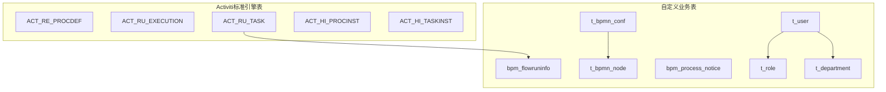
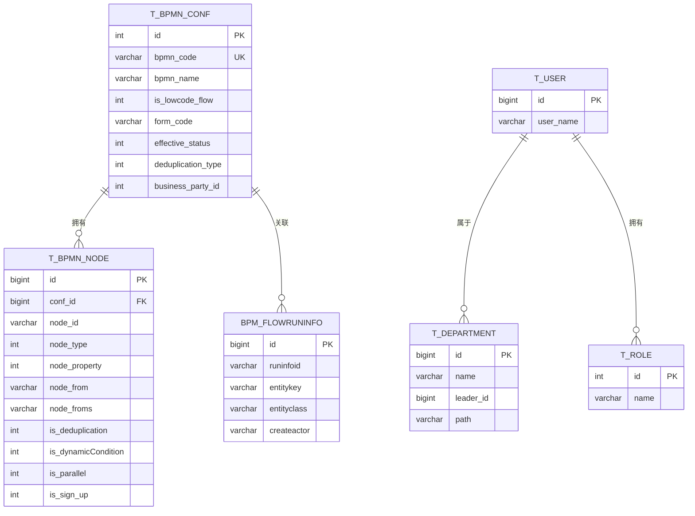
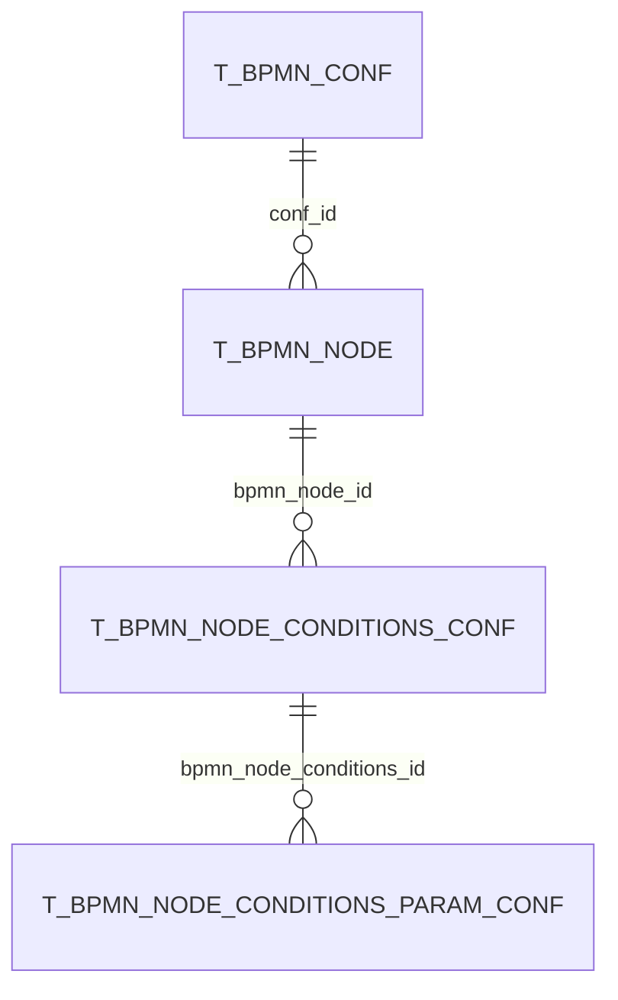
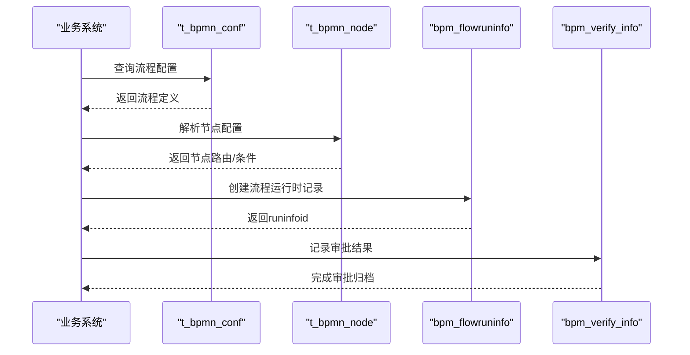
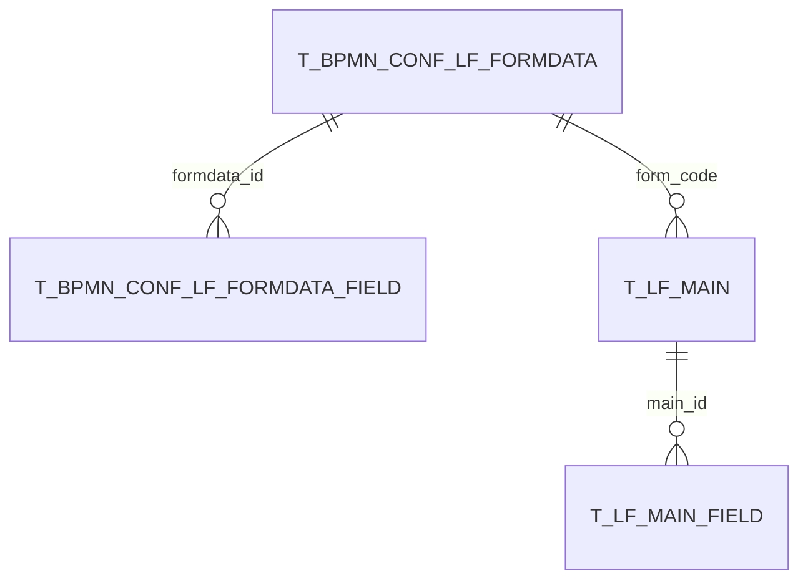
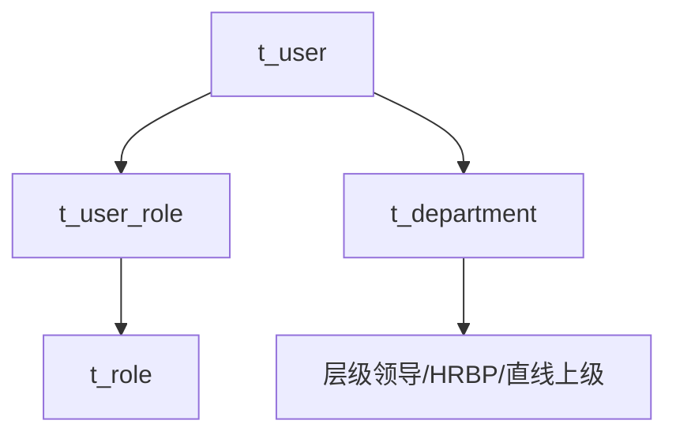
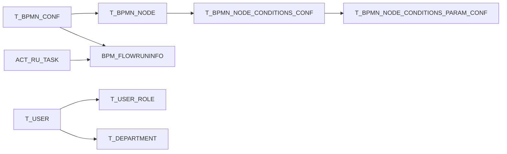

# 数据库设计

<cite>
**本文引用的文件**
- [script/act_init_db.sql](file://script/act_init_db.sql)
- [script/bpm_init_db.sql](file://script/bpm_init_db.sql)
- [script/bpm_init_db_data.sql](file://script/bpm_init_db_data.sql)
- [antflow-base/src/main/resources/org/activiti/db/create/activiti.mysql.create.engine.sql](file://antflow-base/src/main/resources/org/activiti/db/create/activiti.mysql.create.engine.sql)
- [antflow-base/src/main/resources/org/activiti/db/create/activiti.oracle.create.engine.sql](file://antflow-base/src/main/resources/org/activiti/db/create/activiti.oracle.create.engine.sql)
- [antflow-engine/src/main/resources/mapper/BpmnConfMapper.xml](file://antflow-engine/src/main/resources/mapper/BpmnConfMapper.xml)
- [antflow-engine/src/main/resources/mapper/UserMapper.xml](file://antflow-engine/src/main/resources/mapper/UserMapper.xml)
- [antflow-base/src/main/java/org/openoa/base/entity/BpmnConf.java](file://antflow-base/src/main/java/org/openoa/base/entity/BpmnConf.java)
- [antflow-base/src/main/java/org/openoa/base/entity/User.java](file://antflow-base/src/main/java/org/openoa/base/entity/User.java)
- [doc/系统介绍篇/22.流程核心关键表说明.md](file://doc/系统介绍篇/22.流程核心关键表说明.md)
- [doc/系统介绍篇/24.流程模板关键字段说明.md](file://doc/系统介绍篇/24.流程模板关键字段说明.md)
</cite>

## 目录
1. [简介](#简介)
2. [项目结构](#项目结构)
3. [核心组件](#核心组件)
4. [架构总览](#架构总览)
5. [详细组件分析](#详细组件分析)
6. [依赖分析](#依赖分析)
7. [性能考虑](#性能考虑)
8. [故障排查指南](#故障排查指南)
9. [结论](#结论)
10. [附录](#附录)

## 简介
本文件面向AntFlow工作流系统，提供数据库设计的系统化技术文档。重点覆盖以下方面：
- 核心表结构设计、字段定义规范与索引策略
- BPMN配置表、流程运行时表、低代码流程表、用户管理表的设计原理
- 实体关系图、数据约束规则、事务处理机制
- 多数据库支持的表结构适配（MySQL/Oracle）
- 性能优化策略、数据迁移方案
- 数据库初始化脚本说明、数据字典与最佳实践建议

## 项目结构
AntFlow数据库层由三大块构成：
- Activiti标准引擎表：用于BPMN流程引擎的运行时与历史数据
- 自定义业务表：支撑流程配置、运行时、低代码表单与用户权限
- MyBatis映射层：将Java实体与数据库表进行ORM映射

图表来源
- [script/act_init_db.sql:260-278](file://script/act_init_db.sql#L260-L278)
- [script/bpm_init_db.sql:1-31](file://script/bpm_init_db.sql#L1-L31)
- [antflow-base/src/main/resources/org/activiti/db/create/activiti.mysql.create.engine.sql:95-111](file://antflow-base/src/main/resources/org/activiti/db/create/activiti.mysql.create.engine.sql#L95-L111)

章节来源
- [script/act_init_db.sql:1-470](file://script/act_init_db.sql#L1-L470)
- [script/bpm_init_db.sql:1-800](file://script/bpm_init_db.sql#L1-L800)
- [doc/系统介绍篇/22.流程核心关键表说明.md:1-253](file://doc/系统介绍篇/22.流程核心关键表说明.md#L1-L253)

## 核心组件
本节聚焦四大类核心表及其职责与字段要点。

- BPMN配置表
  - t_bpmn_conf：流程定义主表，含流程编码、名称、低代码标识、表单编码、生效状态、去重策略、业务方等
  - t_bpmn_node：节点配置，含节点类型、属性、去重、动态条件、并行、加签等
  - t_bpmn_node_conditions_conf / t_bpmn_node_conditions_param_conf：条件路由与参数
- 流程运行时表
  - bpm_flowruninfo：流程运行时信息，连接业务键与流程实例
  - bpm_process_forward / bpm_flowrun_entrust：任务转发与委托
  - bpm_verify_info / bpm_verify_attachment：审批记录与附件
- 低代码流程表
  - t_bpmn_conf_lf_formdata / t_bpmn_conf_lf_formdata_field：表单定义与字段配置
  - t_lf_main / t_lf_main_field：表单实例与字段值
- 用户管理表（Demo）
  - t_user / t_role / t_user_role / t_department：用户、角色、部门及关联关系

章节来源
- [script/bpm_init_db.sql:1-800](file://script/bpm_init_db.sql#L1-L800)
- [doc/系统介绍篇/22.流程核心关键表说明.md:200-253](file://doc/系统介绍篇/22.流程核心关键表说明.md#L200-L253)

## 架构总览
下图展示核心表之间的关系与数据流向：

图表来源
- [script/bpm_init_db.sql:1-800](file://script/bpm_init_db.sql#L1-L800)
- [script/act_init_db.sql:260-278](file://script/act_init_db.sql#L260-L278)

## 详细组件分析

### BPMN配置表设计
- t_bpmn_conf
  - 主键自增，bpmn_code唯一，支持低代码流程标识、生效状态、去重策略、业务方等
  - 常用索引：bpmn_code、form_code、business_party_id
- t_bpmn_node
  - 节点维度配置，含节点类型、属性、去重、动态条件、并行、加签等
  - 常用索引：conf_id、node_id
- t_bpmn_node_conditions_conf / t_bpmn_node_conditions_param_conf
  - 条件路由与参数，支持分组、关系、排序与扩展JSON

图表来源
- [script/bpm_init_db.sql:1-800](file://script/bpm_init_db.sql#L1-L800)

章节来源
- [script/bpm_init_db.sql:1-800](file://script/bpm_init_db.sql#L1-L800)
- [antflow-engine/src/main/resources/mapper/BpmnConfMapper.xml:1-139](file://antflow-engine/src/main/resources/mapper/BpmnConfMapper.xml#L1-L139)
- [antflow-base/src/main/java/org/openoa/base/entity/BpmnConf.java:1-158](file://antflow-base/src/main/java/org/openoa/base/entity/BpmnConf.java#L1-L158)

### 流程运行时表设计
- bpm_flowruninfo
  - 记录流程实例与业务键的映射，便于业务侧检索与审计
  - 常用索引：runinfoid
- bpm_process_forward / bpm_flowrun_entrust
  - 任务转发与委托，支持阅读状态、节点标识与租户隔离
- bpm_verify_info / bpm_verify_attachment
  - 审批记录与附件，支持业务类型、业务ID、任务信息与流程实例关联

图表来源
- [script/bpm_init_db.sql:261-790](file://script/bpm_init_db.sql#L261-L790)

章节来源
- [script/bpm_init_db.sql:217-790](file://script/bpm_init_db.sql#L217-L790)

### 低代码流程表设计
- t_bpmn_conf_lf_formdata / t_bpmn_conf_lf_formdata_field
  - 表单定义与字段配置，支持字段类型、校验与显示逻辑
- t_lf_main / t_lf_main_field
  - 表单实例与字段值，统一存储字符串、数值、日期时间与长文本

图表来源
- [script/bpm_init_db.sql:1-800](file://script/bpm_init_db.sql#L1-L800)

章节来源
- [script/bpm_init_db.sql:1-800](file://script/bpm_init_db.sql#L1-L800)
- [doc/系统介绍篇/22.流程核心关键表说明.md:219-231](file://doc/系统介绍篇/22.流程核心关键表说明.md#L219-L231)

### 用户管理表设计（Demo）
- t_user / t_role / t_user_role / t_department
  - Demo用户体系，支持模糊查询、层级领导查找、HRBP与汇报线等规则
- MyBatis映射
  - UserMapper提供按名模糊、按ID集合批量查询、层级领导、HRBP、直线上级等SQL

图表来源
- [antflow-engine/src/main/resources/mapper/UserMapper.xml:1-217](file://antflow-engine/src/main/resources/mapper/UserMapper.xml#L1-L217)

章节来源
- [antflow-engine/src/main/resources/mapper/UserMapper.xml:1-217](file://antflow-engine/src/main/resources/mapper/UserMapper.xml#L1-L217)
- [antflow-base/src/main/java/org/openoa/base/entity/User.java:1-17](file://antflow-base/src/main/java/org/openoa/base/entity/User.java#L1-L17)

## 依赖分析
- 表间依赖
  - t_bpmn_conf → t_bpmn_node：一对多
  - t_bpmn_node → t_bpmn_node_conditions_conf：一对多
  - t_bpmn_node_conditions_conf → t_bpmn_node_conditions_param_conf：一对多
  - t_bpmn_conf → bpm_flowruninfo：一对多
  - t_user → t_user_role：一对多
  - t_user → t_department：多对一
- Activiti引擎表
  - ACT_RU_TASK 与 bpm_flowruninfo 存在运行时关联
  - ACT_RU_EXECUTION、ACT_RE_PROCDEF 支撑流程定义与实例

图表来源
- [script/bpm_init_db.sql:1-800](file://script/bpm_init_db.sql#L1-L800)
- [script/act_init_db.sql:316-458](file://script/act_init_db.sql#L316-L458)

章节来源
- [script/bpm_init_db.sql:1-800](file://script/bpm_init_db.sql#L1-L800)
- [script/act_init_db.sql:1-470](file://script/act_init_db.sql#L1-L470)

## 性能考虑
- 索引策略
  - 唯一索引：t_bpmn_conf.bpmn_code、ACT_RE_PROCDEF.KEY_VERSION_TENANT
  - 常用过滤字段建立普通索引：bpm_flowruninfo.runinfoid、t_bpmn_node.conf_id、t_bpmn_node.node_id
  - 复合索引：bpm_verify_info.business_type/business_id、bpm_process_notice.process_key/type
- 查询优化
  - 使用Mapper XML进行条件拼接与分页，避免全表扫描
  - 对层级领导、HRBP等复杂SQL采用子查询与LIMIT限制结果集
- 并发与锁
  - 使用乐观锁字段（如REV_）与唯一约束降低并发冲突
  - 对高频更新表（如ACT_RU_TASK、ACT_RU_VARIABLE）合理拆分热点字段
- 存储与归档
  - 历史表（ACT_HI_*）与运行时表分离，定期归档历史数据

[本节为通用指导，无需列出具体文件来源]

## 故障排查指南
- 常见问题定位
  - 流程启动失败：检查ACT_RE_PROCDEF是否存在对应部署ID与版本
  - 任务无法派发：核对ACT_RU_TASK与ACT_RU_EXECUTION外键关系
  - 审批记录缺失：确认bpm_verify_info与ACT_HI_TASKINST的关联字段是否正确
- 日志与事件
  - ACT_EVT_LOG可用于追踪事件日志，辅助定位异常
- 数据一致性
  - 使用唯一约束与外键约束保证数据完整性
  - 对软删除字段（如is_del）进行统一处理

章节来源
- [script/act_init_db.sql:1-470](file://script/act_init_db.sql#L1-L470)
- [antflow-base/src/main/resources/org/activiti/db/create/activiti.mysql.create.engine.sql:217-220](file://antflow-base/src/main/resources/org/activiti/db/create/activiti.mysql.create.engine.sql#L217-L220)

## 结论
AntFlow数据库设计围绕“BPMN流程+低代码表单+运行时+用户权限”四大域构建，既复用Activiti标准表保障流程引擎能力，又通过自定义表实现业务扩展与灵活配置。通过合理的索引策略、约束规则与映射层设计，系统在可维护性与性能之间取得平衡。建议在生产环境中结合业务规模持续优化索引与归档策略，并完善监控与回滚预案。

[本节为总结性内容，无需列出具体文件来源]

## 附录

### 数据库初始化脚本说明
- 初始化步骤
  - 第一阶段：创建架构（表、索引、约束）
  - 第二阶段：填充演示数据（用户、角色、部门）
- 脚本位置
  - 主架构：script/bpm_init_db.sql
  - Activiti标准表：script/act_init_db.sql
  - 演示数据：script/bpm_init_db_data.sql
  - 多数据库适配：antflow-base/src/main/resources/org/activiti/db/create/*.sql

章节来源
- [script/bpm_init_db.sql:1-800](file://script/bpm_init_db.sql#L1-L800)
- [script/act_init_db.sql:1-470](file://script/act_init_db.sql#L1-L470)
- [script/bpm_init_db_data.sql:1-104](file://script/bpm_init_db_data.sql#L1-L104)
- [antflow-base/src/main/resources/org/activiti/db/create/activiti.mysql.create.engine.sql:1-324](file://antflow-base/src/main/resources/org/activiti/db/create/activiti.mysql.create.engine.sql#L1-L324)
- [antflow-base/src/main/resources/org/activiti/db/create/activiti.oracle.create.engine.sql:1-345](file://antflow-base/src/main/resources/org/activiti/db/create/activiti.oracle.create.engine.sql#L1-L345)

### 数据字典（关键字段）
- t_bpmn_conf
  - bpmn_code：流程编码（唯一）
  - is_lowcode_flow：是否低代码流程
  - effective_status：生效状态
  - deduplication_type：去重策略
  - business_party_id：业务方标识
- t_bpmn_node
  - node_id：节点唯一标识
  - node_type / node_property：节点类型与属性
  - is_deduplication / is_dynamicCondition / is_parallel / is_sign_up：节点行为开关
- bpm_flowruninfo
  - runinfoid：流程实例ID
  - entitykey / entityclass：业务键与处理类
- t_user / t_role / t_department
  - 支持层级领导、HRBP、直线上级等规则查询

章节来源
- [doc/系统介绍篇/24.流程模板关键字段说明.md:1-79](file://doc/系统介绍篇/24.流程模板关键字段说明.md#L1-L79)
- [script/bpm_init_db.sql:1-800](file://script/bpm_init_db.sql#L1-L800)

### 最佳实践建议
- 设计原则
  - 明确唯一标识与业务键，避免冗余字段
  - 为高频查询字段建立索引，注意写多读少场景的权衡
  - 使用软删除字段统一处理逻辑删除
- 运维建议
  - 定期清理历史表与无用附件
  - 对大字段（text/blob）进行冷热分离
  - 在多租户场景下确保tenant_id贯穿所有表
- 扩展建议
  - 低代码表单字段建议预留扩展JSON字段
  - 流程变量与消息模板建议按业务域拆分存储

[本节为通用指导，无需列出具体文件来源]