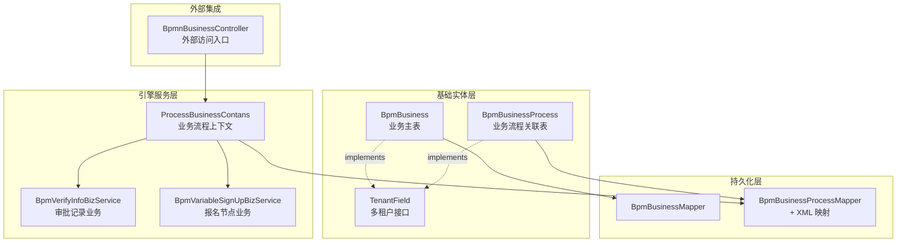
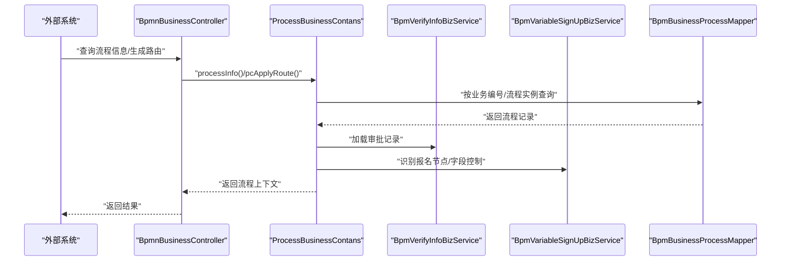
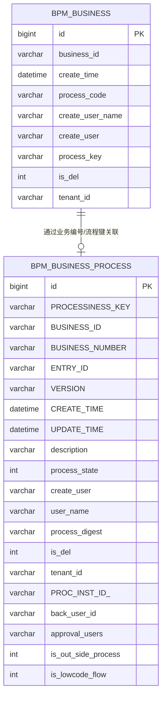
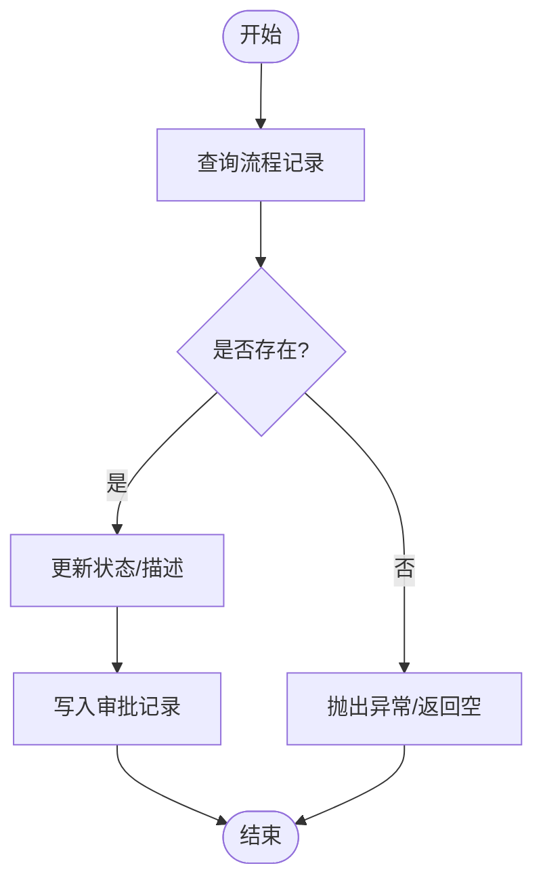
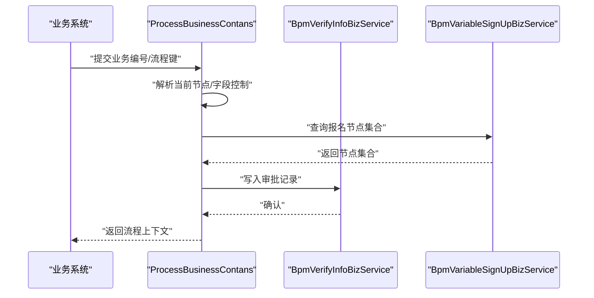
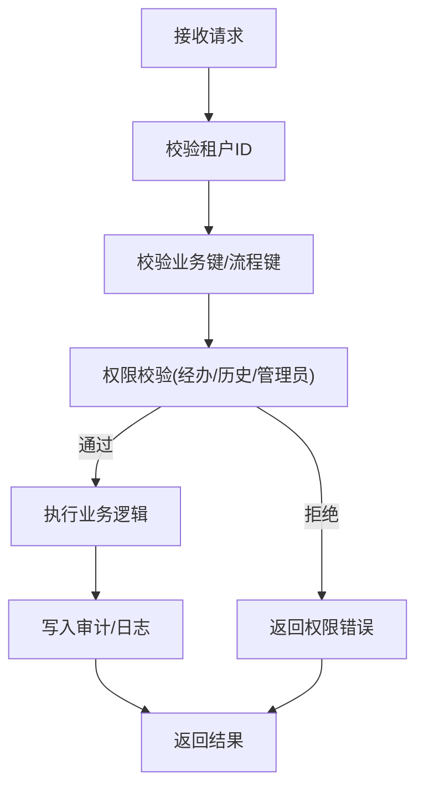
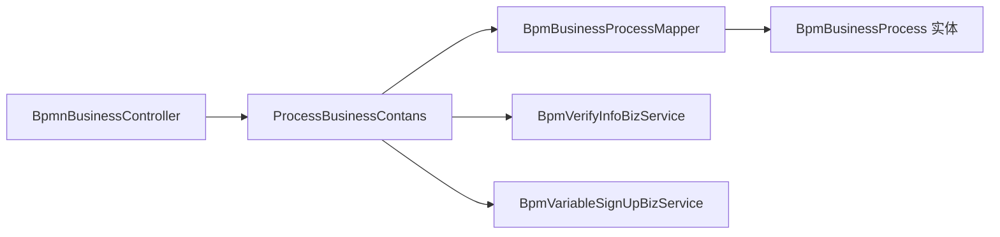

# 数据模型与业务集成

<cite>
**本文引用的文件**
- [ProcessBusinessContans.java](file://antflow-engine/src/main/java/org/openoa/engine/bpmnconf/common/ProcessBusinessContans.java)
- [BpmBusiness.java](file://antflow-base/src/main/java/org/openoa/base/entity/BpmBusiness.java)
- [BpmBusinessProcess.java](file://antflow-base/src/main/java/org/openoa/base/entity/BpmBusinessProcess.java)
- [BpmBusinessMapper.java](file://antflow-engine/src/main/java/org/openoa/engine/bpmnconf/mapper/BpmBusinessMapper.java)
- [BpmBusinessProcessMapper.java](file://antflow-engine/src/main/java/org/openoa/engine/bpmnconf/mapper/BpmBusinessProcessMapper.java)
- [BpmBusinessProcessMapper.xml](file://antflow-engine/src/main/resources/mapper/BpmBusinessProcessMapper.xml)
- [TenantField.java](file://antflow-base/src/main/java/org/openoa/base/interf/TenantField.java)
- [BpmVariableSignUpBizService.java](file://antflow-engine/src/main/java/org/openoa/engine/bpmnconf/service/interf/biz/BpmVariableSignUpBizService.java)
- [BpmVerifyInfoBizService.java](file://antflow-engine/src/main/java/org/openoa/engine/bpmnconf/service/interf/biz/BpmVerifyInfoBizService.java)
- [BpmnBusinessController.java](file://antflow-engine/src/main/java/org/openoa/engine/bpmnconf/controller/BpmnBusinessController.java)
</cite>

## 目录
1. [简介](#简介)
2. [项目结构](#项目结构)
3. [核心组件](#核心组件)
4. [架构总览](#架构总览)
5. [详细组件分析](#详细组件分析)
6. [依赖分析](#依赖分析)
7. [性能考虑](#性能考虑)
8. [故障排查指南](#故障排查指南)
9. [结论](#结论)
10. [附录](#附录)

## 简介
本文件聚焦于 AntFlow 的“数据模型与业务集成”，系统性阐述如何将业务系统数据与工作流数据进行一体化整合，覆盖以下主题：
- 业务关联表设计与实体映射
- 数据同步机制与一致性保障
- 业务键设计、数据传递与回调处理
- 多租户数据隔离与权限控制
- 数据安全与审计
- 架构图、接口设计规范与集成案例

## 项目结构
AntFlow 将“业务数据”与“流程数据”的桥接主要落在基础实体层与引擎层的服务/控制器之间，通过 MyBatis 映射器完成持久化交互，并以统一的业务键贯穿业务系统与 Activiti 流程引擎。

图表来源
- [BpmBusiness.java:25-65](file://antflow-base/src/main/java/org/openoa/base/entity/BpmBusiness.java#L25-L65)
- [BpmBusinessProcess.java:26-133](file://antflow-base/src/main/java/org/openoa/base/entity/BpmBusinessProcess.java#L26-L133)
- [ProcessBusinessContans.java:49-201](file://antflow-engine/src/main/java/org/openoa/engine/bpmnconf/common/ProcessBusinessContans.java#L49-L201)
- [BpmBusinessMapper.java:1-11](file://antflow-engine/src/main/java/org/openoa/engine/bpmnconf/mapper/BpmBusinessMapper.java#L1-L11)
- [BpmBusinessProcessMapper.java:1-26](file://antflow-engine/src/main/java/org/openoa/engine/bpmnconf/mapper/BpmBusinessProcessMapper.java#L1-L26)
- [BpmBusinessProcessMapper.xml:1-67](file://antflow-engine/src/main/resources/mapper/BpmBusinessProcessMapper.xml#L1-L67)
- [BpmnBusinessController.java:1-114](file://antflow-engine/src/main/java/org/openoa/engine/bpmnconf/controller/BpmnBusinessController.java#L1-L114)

章节来源
- [BpmBusiness.java:1-65](file://antflow-base/src/main/java/org/openoa/base/entity/BpmBusiness.java#L1-L65)
- [BpmBusinessProcess.java:1-133](file://antflow-base/src/main/java/org/openoa/base/entity/BpmBusinessProcess.java#L1-L133)
- [ProcessBusinessContans.java:1-357](file://antflow-engine/src/main/java/org/openoa/engine/bpmnconf/common/ProcessBusinessContans.java#L1-L357)
- [BpmBusinessMapper.java:1-11](file://antflow-engine/src/main/java/org/openoa/engine/bpmnconf/mapper/BpmBusinessMapper.java#L1-L11)
- [BpmBusinessProcessMapper.java:1-26](file://antflow-engine/src/main/java/org/openoa/engine/bpmnconf/mapper/BpmBusinessProcessMapper.java#L1-L26)
- [BpmBusinessProcessMapper.xml:1-67](file://antflow-engine/src/main/resources/mapper/BpmBusinessProcessMapper.xml#L1-L67)
- [BpmnBusinessController.java:1-114](file://antflow-engine/src/main/java/org/openoa/engine/bpmnconf/controller/BpmnBusinessController.java#L1-L114)

## 核心组件
- 业务主表实体：承载业务唯一标识、创建者、创建时间等元数据，用于与流程实例建立关联。
- 业务流程关联表：作为业务系统与 Activiti 流程引擎之间的桥梁，存储流程实例 ID、业务编号、状态、描述等关键字段。
- 业务流程上下文：封装流程信息查询、路由生成、权限校验、低代码表单字段控制等能力。
- 审批记录业务：提供审批节点、意见、状态等信息的读取与写入。
- 报名节点业务：支持“自选审批人/报名节点”的识别与联动。
- 控制器：对外暴露业务相关接口，承接外部系统调用。

章节来源
- [BpmBusiness.java:25-65](file://antflow-base/src/main/java/org/openoa/base/entity/BpmBusiness.java#L25-L65)
- [BpmBusinessProcess.java:26-133](file://antflow-base/src/main/java/org/openoa/base/entity/BpmBusinessProcess.java#L26-L133)
- [ProcessBusinessContans.java:49-201](file://antflow-engine/src/main/java/org/openoa/engine/bpmnconf/common/ProcessBusinessContans.java#L49-L201)
- [BpmVerifyInfoBizService.java:1-34](file://antflow-engine/src/main/java/org/openoa/engine/bpmnconf/service/interf/biz/BpmVerifyInfoBizService.java#L1-L34)
- [BpmVariableSignUpBizService.java:1-14](file://antflow-engine/src/main/java/org/openoa/engine/bpmnconf/service/interf/biz/BpmVariableSignUpBizService.java#L1-L14)
- [BpmnBusinessController.java:1-114](file://antflow-engine/src/main/java/org/openoa/engine/bpmnconf/controller/BpmnBusinessController.java#L1-L114)

## 架构总览
AntFlow 的数据模型与业务集成采用“实体驱动 + 服务编排 + 映射器持久化”的分层架构：
- 实体层：定义业务与流程的核心数据结构，并通过多租户接口统一注入租户维度。
- 服务层：封装业务流程上下文、审批记录、报名节点等业务逻辑。
- 控制器层：提供外部系统对接的 REST 接口。
- 持久化层：MyBatis 映射器负责 SQL 与实体的映射，确保数据一致性与可维护性。

图表来源
- [BpmnBusinessController.java:1-114](file://antflow-engine/src/main/java/org/openoa/engine/bpmnconf/controller/BpmnBusinessController.java#L1-L114)
- [ProcessBusinessContans.java:77-201](file://antflow-engine/src/main/java/org/openoa/engine/bpmnconf/common/ProcessBusinessContans.java#L77-L201)
- [BpmVerifyInfoBizService.java:27-33](file://antflow-engine/src/main/java/org/openoa/engine/bpmnconf/service/interf/biz/BpmVerifyInfoBizService.java#L27-L33)
- [BpmVariableSignUpBizService.java:10-13](file://antflow-engine/src/main/java/org/openoa/engine/bpmnconf/service/interf/biz/BpmVariableSignUpBizService.java#L10-L13)
- [BpmBusinessProcessMapper.java:12-17](file://antflow-engine/src/main/java/org/openoa/engine/bpmnconf/mapper/BpmBusinessProcessMapper.java#L12-L17)

## 详细组件分析

### 业务关联表设计与实体映射
- BpmBusiness：业务主表，包含业务唯一标识、创建者、创建时间、流程键等字段；实现多租户接口，支持按租户隔离。
- BpmBusinessProcess：业务流程关联表，作为业务系统与 Activiti 的纽带，关键字段包括流程实例 ID、业务编号、状态、描述、是否外部流程、是否低代码流程等。
- 多租户字段：所有实现 TenantField 的实体均包含 tenant_id 字段，用于跨租户数据隔离。

图表来源
- [BpmBusiness.java:25-65](file://antflow-base/src/main/java/org/openoa/base/entity/BpmBusiness.java#L25-L65)
- [BpmBusinessProcess.java:26-133](file://antflow-base/src/main/java/org/openoa/base/entity/BpmBusinessProcess.java#L26-L133)
- [TenantField.java:1-7](file://antflow-base/src/main/java/org/openoa/base/interf/TenantField.java#L1-L7)

章节来源
- [BpmBusiness.java:1-65](file://antflow-base/src/main/java/org/openoa/base/entity/BpmBusiness.java#L1-L65)
- [BpmBusinessProcess.java:1-133](file://antflow-base/src/main/java/org/openoa/base/entity/BpmBusinessProcess.java#L1-L133)
- [TenantField.java:1-7](file://antflow-base/src/main/java/org/openoa/base/interf/TenantField.java#L1-L7)

### 数据同步机制与一致性保障
- 查询与更新：通过 BpmBusinessProcessMapper 提供的 find/update/delete 方法，结合 XML 中的条件拼装，实现对流程记录的查询与状态更新。
- 事务与锁：流程状态变更建议在服务层以事务包裹，避免并发场景下的状态不一致。
- 历史与实时：对于已结束流程，可通过历史任务表回溯审批记录，确保审批链路完整性。

图表来源
- [BpmBusinessProcessMapper.java:12-22](file://antflow-engine/src/main/java/org/openoa/engine/bpmnconf/mapper/BpmBusinessProcessMapper.java#L12-L22)
- [BpmBusinessProcessMapper.xml:28-65](file://antflow-engine/src/main/resources/mapper/BpmBusinessProcessMapper.xml#L28-L65)
- [BpmVerifyInfoBizService.java:19-23](file://antflow-engine/src/main/java/org/openoa/engine/bpmnconf/service/interf/biz/BpmVerifyInfoBizService.java#L19-L23)

章节来源
- [BpmBusinessProcessMapper.java:1-26](file://antflow-engine/src/main/java/org/openoa/engine/bpmnconf/mapper/BpmBusinessProcessMapper.java#L1-L26)
- [BpmBusinessProcessMapper.xml:1-67](file://antflow-engine/src/main/resources/mapper/BpmBusinessProcessMapper.xml#L1-L67)
- [BpmVerifyInfoBizService.java:1-34](file://antflow-engine/src/main/java/org/openoa/engine/bpmnconf/service/interf/biz/BpmVerifyInfoBizService.java#L1-L34)

### 业务键设计、数据传递与回调处理
- 业务键：业务编号（businessNumber）、流程实例 ID（procInstId）、流程键（processinessKey）共同构成跨系统识别与关联的主键组合。
- 数据传递：流程上下文构建时，根据当前节点与变量配置，动态下发字段控制与报名节点信息，确保前端渲染与后端校验一致。
- 回调处理：通过审批记录业务接口，将审批意见、节点状态、处理人等信息写入审批记录，形成闭环。

图表来源
- [ProcessBusinessContans.java:144-201](file://antflow-engine/src/main/java/org/openoa/engine/bpmnconf/common/ProcessBusinessContans.java#L144-L201)
- [BpmVariableSignUpBizService.java:10-13](file://antflow-engine/src/main/java/org/openoa/engine/bpmnconf/service/interf/biz/BpmVariableSignUpBizService.java#L10-L13)
- [BpmVerifyInfoBizService.java:19-23](file://antflow-engine/src/main/java/org/openoa/engine/bpmnconf/service/interf/biz/BpmVerifyInfoBizService.java#L19-L23)

章节来源
- [ProcessBusinessContans.java:77-201](file://antflow-engine/src/main/java/org/openoa/engine/bpmnconf/common/ProcessBusinessContans.java#L77-L201)
- [BpmVariableSignUpBizService.java:1-14](file://antflow-engine/src/main/java/org/openoa/engine/bpmnconf/service/interf/biz/BpmVariableSignUpBizService.java#L1-L14)
- [BpmVerifyInfoBizService.java:1-34](file://antflow-engine/src/main/java/org/openoa/engine/bpmnconf/service/interf/biz/BpmVerifyInfoBizService.java#L1-L34)

### 多租户数据隔离策略与权限控制
- 多租户：实体实现 TenantField 接口，统一携带 tenant_id 字段，查询与写入时应基于该字段进行过滤。
- 权限控制：流程上下文在查询时进行访问校验，仅允许流程经办人、历史经办人、管理员等角色查看或操作。
- 外部访问：控制器提供外部系统对接的接口，同时保留路由生成与版本兼容逻辑，便于第三方系统集成。

图表来源
- [TenantField.java:1-7](file://antflow-base/src/main/java/org/openoa/base/interf/TenantField.java#L1-L7)
- [ProcessBusinessContans.java:219-233](file://antflow-engine/src/main/java/org/openoa/engine/bpmnconf/common/ProcessBusinessContans.java#L219-L233)
- [BpmnBusinessController.java:1-114](file://antflow-engine/src/main/java/org/openoa/engine/bpmnconf/controller/BpmnBusinessController.java#L1-L114)

章节来源
- [TenantField.java:1-7](file://antflow-base/src/main/java/org/openoa/base/interf/TenantField.java#L1-L7)
- [ProcessBusinessContans.java:219-233](file://antflow-engine/src/main/java/org/openoa/engine/bpmnconf/common/ProcessBusinessContans.java#L219-L233)
- [BpmnBusinessController.java:1-114](file://antflow-engine/src/main/java/org/openoa/engine/bpmnconf/controller/BpmnBusinessController.java#L1-L114)

### 数据安全与审计
- 审计字段：实体包含创建时间、更新时间、删除标记等字段，便于审计追踪。
- 访问控制：流程详情与路由生成均需进行权限校验，防止越权访问。
- 日志与通知：流程状态变更与审批动作建议配套日志与消息通知，确保可追溯。

章节来源
- [BpmBusiness.java:37-65](file://antflow-base/src/main/java/org/openoa/base/entity/BpmBusiness.java#L37-L65)
- [BpmBusinessProcess.java:64-103](file://antflow-base/src/main/java/org/openoa/base/entity/BpmBusinessProcess.java#L64-L103)
- [ProcessBusinessContans.java:77-108](file://antflow-engine/src/main/java/org/openoa/engine/bpmnconf/common/ProcessBusinessContans.java#L77-L108)

## 依赖分析
- 组件内聚：业务流程上下文聚合了审批记录、报名节点、字段控制等能力，内聚度高。
- 组件耦合：控制器依赖上下文，上下文依赖映射器与业务服务，整体呈现清晰的分层依赖。
- 外部依赖：与 Activiti 引擎交互通过运行时服务与历史任务服务，确保流程生命周期管理。

图表来源
- [BpmnBusinessController.java:1-114](file://antflow-engine/src/main/java/org/openoa/engine/bpmnconf/controller/BpmnBusinessController.java#L1-L114)
- [ProcessBusinessContans.java:49-201](file://antflow-engine/src/main/java/org/openoa/engine/bpmnconf/common/ProcessBusinessContans.java#L49-L201)
- [BpmBusinessProcessMapper.java:1-26](file://antflow-engine/src/main/java/org/openoa/engine/bpmnconf/mapper/BpmBusinessProcessMapper.java#L1-L26)
- [BpmVerifyInfoBizService.java:1-34](file://antflow-engine/src/main/java/org/openoa/engine/bpmnconf/service/interf/biz/BpmVerifyInfoBizService.java#L1-L34)
- [BpmVariableSignUpBizService.java:1-14](file://antflow-engine/src/main/java/org/openoa/engine/bpmnconf/service/interf/biz/BpmVariableSignUpBizService.java#L1-L14)

章节来源
- [BpmnBusinessController.java:1-114](file://antflow-engine/src/main/java/org/openoa/engine/bpmnconf/controller/BpmnBusinessController.java#L1-L114)
- [ProcessBusinessContans.java:49-201](file://antflow-engine/src/main/java/org/openoa/engine/bpmnconf/common/ProcessBusinessContans.java#L49-L201)
- [BpmBusinessProcessMapper.java:1-26](file://antflow-engine/src/main/java/org/openoa/engine/bpmnconf/mapper/BpmBusinessProcessMapper.java#L1-L26)

## 性能考虑
- 查询优化：针对流程记录的查询建议在 ENTRY_ID、BUSINESS_NUMBER、PROC_INST_ID_ 等字段建立索引，减少模糊匹配。
- 批量写入：审批记录批量写入时建议使用批处理或事务合并，降低数据库往返次数。
- 缓存策略：对常用流程配置、字段控制、报名节点集合可引入缓存，提升响应速度。
- 分页与分页：对外接口建议提供分页参数，避免一次性返回大量数据。

## 故障排查指南
- 权限异常：若出现“当前用户无访问权限”，检查登录用户与流程经办人、历史经办人的匹配关系。
- 流程未找到：核对业务编号与流程实例 ID 是否正确，确认查询条件与 XML 映射是否一致。
- 审批记录缺失：确认审批记录写入逻辑是否触发，检查状态与节点标识是否正确。
- 多租户隔离问题：确保请求中携带正确的租户 ID，并在查询与写入时强制带上该条件。

章节来源
- [ProcessBusinessContans.java:83-85](file://antflow-engine/src/main/java/org/openoa/engine/bpmnconf/common/ProcessBusinessContans.java#L83-L85)
- [BpmBusinessProcessMapper.xml:40-49](file://antflow-engine/src/main/resources/mapper/BpmBusinessProcessMapper.xml#L40-L49)
- [BpmVerifyInfoBizService.java:19-23](file://antflow-engine/src/main/java/org/openoa/engine/bpmnconf/service/interf/biz/BpmVerifyInfoBizService.java#L19-L23)

## 结论
AntFlow 通过标准化的业务实体与流程关联表，结合服务层的上下文编排与映射器的持久化能力，实现了业务系统与工作流引擎的深度集成。依托多租户字段与权限校验，系统在保证数据隔离的同时提供了灵活的业务扩展能力。建议在生产环境中进一步完善索引、缓存与审计机制，以获得更优的性能与可观测性。

## 附录
- 接口设计规范（示例）
  - 查询流程信息：GET /bpmnBusiness/getDIYFormCodeList?desc={流程描述}
  - 获取委托列表：POST /bpmnBusiness/entrustlist/{type}
  - 获取委托详情：GET /bpmnBusiness/entrustDetail/{id}
  - 编辑委托：POST /bpmnBusiness/editEntrust
  - 获取自选审批人节点：GET /bpmnBusiness/getStartUserChooseModules?formCode={表单编码}
- 集成案例
  - 外部系统发起审批：携带业务编号与流程键，调用流程上下文接口获取路由与字段控制，提交审批意见后由审批记录业务写入历史。
  - 多租户隔离：在请求头或参数中传入 tenant_id，所有查询与写入均基于该租户维度过滤。

章节来源
- [BpmnBusinessController.java:46-111](file://antflow-engine/src/main/java/org/openoa/engine/bpmnconf/controller/BpmnBusinessController.java#L46-L111)
- [ProcessBusinessContans.java:243-347](file://antflow-engine/src/main/java/org/openoa/engine/bpmnconf/common/ProcessBusinessContans.java#L243-L347)