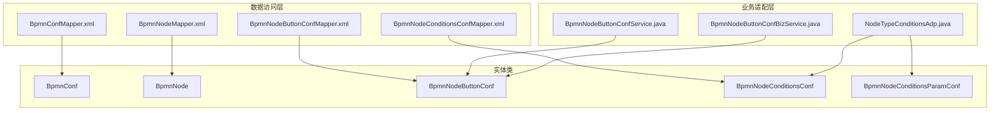
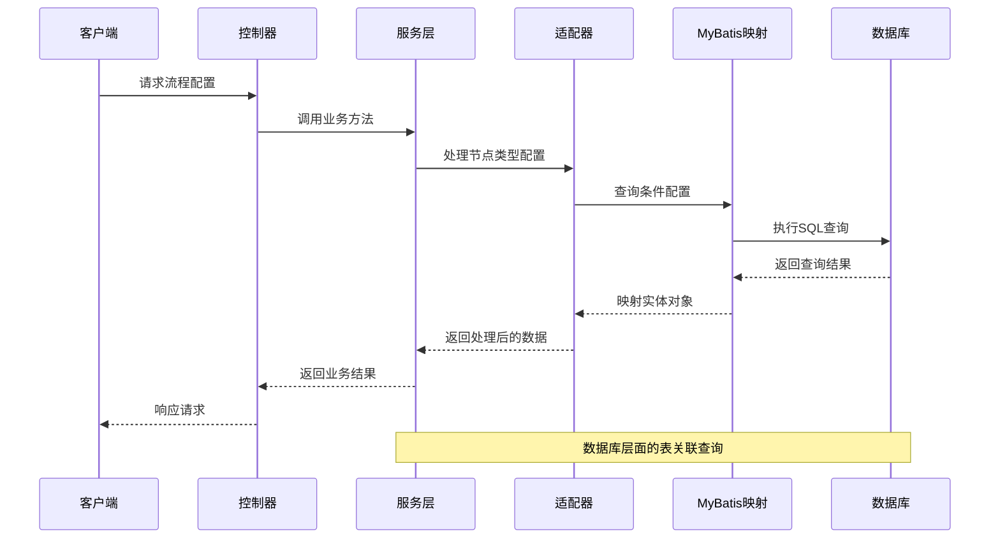
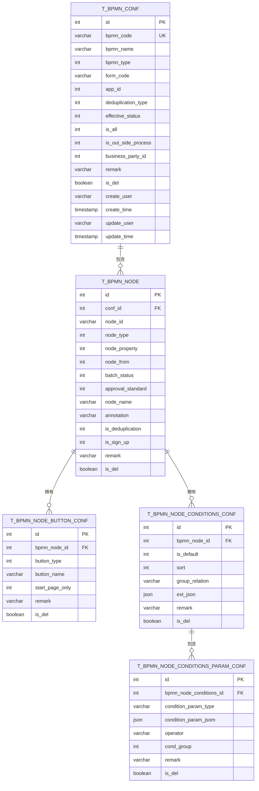
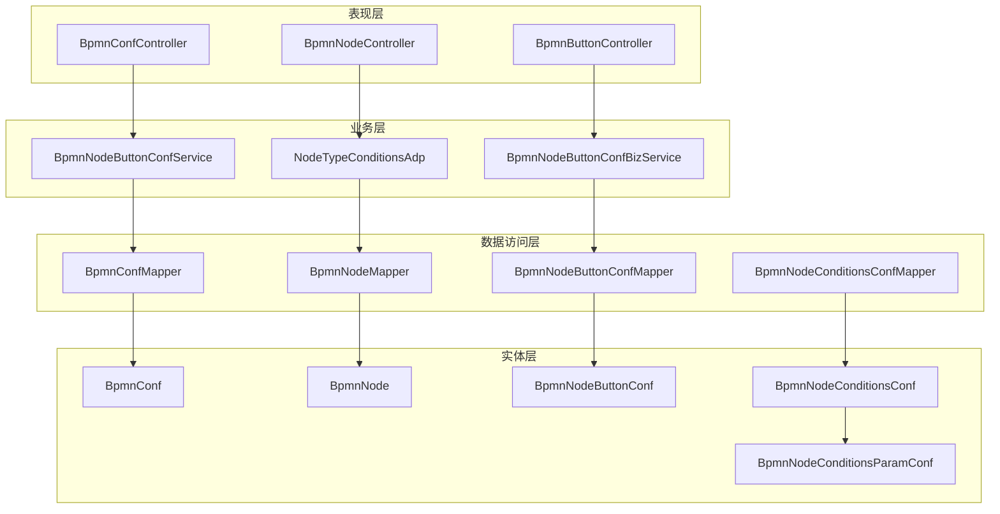

# BPMN配置表结构

<cite>
**本文档引用的文件**
- [BpmnConfMapper.xml](file://antflow-engine/src/main/resources/mapper/BpmnConfMapper.xml)
- [BpmnNodeMapper.xml](file://antflow-engine/src/main/resources/mapper/BpmnNodeMapper.xml)
- [BpmnNodeButtonConfMapper.xml](file://antflow-engine/src/main/resources/mapper/BpmnNodeButtonConfMapper.xml)
- [BpmnNodeConditionsConfMapper.xml](file://antflow-engine/src/main/resources/mapper/BpmnNodeConditionsConfMapper.xml)
- [BpmnConfCommonButtonPropertyVo.java](file://antflow-base/src/main/java/org/openoa/base/vo/BpmnConfCommonButtonPropertyVo.java)
- [NodeTypeConditionsAdp.java](file://antflow-engine/src/main/java/org/openoa/engine/bpmnconf/adp/bpmnnodeadp/NodeTypeConditionsAdp.java)
- [BpmnNodeButtonConfService.java](file://antflow-engine/src/main/java/org/openoa/engine/bpmnconf/service/interf/repository/BpmnNodeButtonConfService.java)
- [BpmnNodeButtonConfBizService.java](file://antflow-engine/src/main/java/org/openoa/engine/bpmnconf/service/interf/biz/BpmnNodeButtonConfBizService.java)
- [6.流程配置系统.md](file://doc/系统介绍篇/6.流程配置系统.md)
- [act_init_db.sql](file://script/act_init_db.sql)
- [bpm_init_db.sql](file://script/bpm_init_db.sql)
- [bpm_init_db_data.sql](file://script/bpm_init_db_data.sql)
</cite>

## 目录
1. [简介](#简介)
2. [项目结构](#项目结构)
3. [核心组件](#核心组件)
4. [架构概览](#架构概览)
5. [详细组件分析](#详细组件分析)
6. [依赖分析](#依赖分析)
7. [性能考虑](#性能考虑)
8. [故障排除指南](#故障排除指南)
9. [结论](#结论)
10. [附录](#附录)

## 简介
本文件详细解析AntFlow BPMN配置系统的数据库表结构设计，涵盖流程配置表、节点配置表、按钮配置表、条件配置表等核心表的设计原理、字段定义、主外键关系、索引策略以及AntFlow自定义扩展字段的作用机制。文档基于实际的MyBatis映射文件和实体类进行分析，提供表关系图、数据字典和最佳实践建议。

## 项目结构
BPMN配置系统主要由以下层次组成：
- 数据访问层：通过MyBatis映射文件定义SQL查询和结果映射
- 业务适配层：处理节点类型、条件配置、按钮配置等业务逻辑
- 控制器层：提供REST接口供前端调用
- 实体类：定义数据库表结构与Java对象的映射关系

**图表来源**
- [BpmnConfMapper.xml:1-139](file://antflow-engine/src/main/resources/mapper/BpmnConfMapper.xml#L1-L139)
- [BpmnNodeMapper.xml:1-65](file://antflow-engine/src/main/resources/mapper/BpmnNodeMapper.xml#L1-L65)
- [BpmnNodeButtonConfMapper.xml:1-15](file://antflow-engine/src/main/resources/mapper/BpmnNodeButtonConfMapper.xml#L1-L15)
- [BpmnNodeConditionsConfMapper.xml:1-22](file://antflow-engine/src/main/resources/mapper/BpmnNodeConditionsConfMapper.xml#L1-L22)

**章节来源**
- [BpmnConfMapper.xml:1-139](file://antflow-engine/src/main/resources/mapper/BpmnConfMapper.xml#L1-L139)
- [BpmnNodeMapper.xml:1-65](file://antflow-engine/src/main/resources/mapper/BpmnNodeMapper.xml#L1-L65)
- [BpmnNodeButtonConfMapper.xml:1-15](file://antflow-engine/src/main/resources/mapper/BpmnNodeButtonConfMapper.xml#L1-L15)
- [BpmnNodeConditionsConfMapper.xml:1-22](file://antflow-engine/src/main/resources/mapper/BpmnNodeConditionsConfMapper.xml#L1-L22)

## 核心组件
本节深入分析BPMN配置系统的核心表结构，包括主键设计、外键关系、索引策略、字段约束以及AntFlow自定义扩展字段的作用。

### 流程配置表 (t_bpmn_conf)
流程配置表是整个BPMN配置系统的核心，存储流程的基本信息和配置状态。

**主键设计**：使用自增整数型主键 `id`
**外键关系**：无直接外键关联，通过业务标识符进行关联
**索引策略**：
- 主键索引：自动创建
- 唯一索引：`bpmn_code`（流程编码）
- 普通索引：`form_code`（表单编码）、`effective_status`（生效状态）

**字段定义**：
- `bpmn_code`：流程编码，唯一标识符，用于关联业务数据
- `bpmn_name`：流程名称，显示用名称
- `bpmn_type`：流程类型，区分不同业务场景
- `form_code`：表单编码，关联动态表单系统
- `app_id`：应用ID，标识所属应用
- `deduplication_type`：去重类型，控制重复提交策略
- `effective_status`：生效状态，1=生效，0=失效
- `is_all`：是否全员参与，1=是，0=否
- `is_out_side_process`：是否外部流程，1=是，0=否
- `business_party_id`：业务方ID，关联外部业务方
- `remark`：备注信息
- `is_del`：删除标记，布尔值
- `create_user/update_user`：创建/更新用户
- `create_time/update_time`：创建/更新时间

**AntFlow扩展字段作用**：
- `is_lowcode_flow`：低代码流程标识，影响表单显示逻辑
- `business_party_mark`：业务方标记，用于外部流程识别

### 节点配置表 (t_bpmn_node)
节点配置表存储流程中各个节点的详细配置信息。

**主键设计**：使用自增整数型主键 `id`
**外键关系**：`conf_id` → `t_bpmn_conf(id)`
**索引策略**：
- 主键索引：自动创建
- 外键索引：`conf_id`
- 组合索引：`(node_id, conf_id)`（用于快速定位节点）

**字段定义**：
- `conf_id`：流程配置ID，关联父流程
- `node_id`：节点ID，BPMN标准节点标识
- `node_type`：节点类型，区分开始节点、用户任务、排他网关等
- `node_property`：节点属性，自定义扩展属性
- `node_from`：节点来源，标识节点创建方式
- `batch_status`：批量状态，控制批量处理
- `approval_standard`：审批标准，定义审批规则
- `node_name`：节点名称，显示用名称
- `annotation`：注释信息
- `is_deduplication`：是否去重，1=是，0=否
- `is_sign_up`：是否报名，1=是，0=否
- `remark`：备注信息
- `is_del`：删除标记，布尔值

**AntFlow扩展字段作用**：
- `node_property`：支持多种自定义属性组合
- `approval_standard`：定义复杂的审批标准和规则
- `is_deduplication/is_sign_up`：控制节点特殊行为

### 按钮配置表 (t_bpmn_node_button_conf)
按钮配置表存储节点上的各种操作按钮配置。

**主键设计**：使用自增整数型主键 `id`
**外键关系**：`bpmn_node_id` → `t_bpmn_node(id)`
**索引策略**：
- 主键索引：自动创建
- 外键索引：`bpmn_node_id`
- 复合索引：`(bpmn_node_id, start_page_only)`

**字段定义**：
- `bpmn_node_id`：节点ID，关联所属节点
- `button_type`：按钮类型，区分同意、驳回、转办等
- `button_name`：按钮名称，显示用名称
- `start_page_only`：仅启动页显示，1=是，0=否
- `remark`：备注信息
- `is_del`：删除标记，布尔值

**AntFlow扩展字段作用**：
- `button_type/button_name`：定义按钮的业务含义和显示文本
- `start_page_only`：控制按钮在不同页面的显示范围

### 条件配置表 (t_bpmn_node_conditions_conf)
条件配置表存储节点的条件判断配置。

**主键设计**：使用自增整数型主键 `id`
**外键关系**：`bpmn_node_id` → `t_bpmn_node(id)`
**索引策略**：
- 主键索引：自动创建
- 外键索引：`bpmn_node_id`
- 普通索引：`is_default`（默认条件标识）

**字段定义**：
- `bpmn_node_id`：节点ID，关联所属节点
- `is_default`：是否默认条件，1=是，0=否
- `sort`：排序字段，控制条件执行顺序
- `group_relation`：组内关系，AND/OR等逻辑关系
- `ext_json`：扩展JSON，存储复杂配置信息
- `remark`：备注信息
- `is_del`：删除标记，布尔值

### 条件参数配置表 (t_bpmn_node_conditions_param_conf)
条件参数配置表存储具体条件的参数信息。

**主键设计**：使用自增整数型主键 `id`
**外键关系**：`bpmn_node_conditions_id` → `t_bpmn_node_conditions_conf(id)`
**索引策略**：
- 主键索引：自动创建
- 外键索引：`bpmn_node_conditions_id`
- 普通索引：`cond_group`（条件组）

**字段定义**：
- `bpmn_node_conditions_id`：条件配置ID
- `condition_param_type`：条件参数类型
- `condition_param_jsom`：条件参数JSON
- `operator`：运算符，如等于、大于、小于等
- `cond_group`：条件组，用于分组条件
- `remark`：备注信息
- `is_del`：删除标记，布尔值

**章节来源**
- [BpmnConfMapper.xml:7-25](file://antflow-engine/src/main/resources/mapper/BpmnConfMapper.xml#L7-L25)
- [BpmnNodeMapper.xml:6-25](file://antflow-engine/src/main/resources/mapper/BpmnNodeMapper.xml#L6-L25)
- [BpmnNodeButtonConfMapper.xml:7-13](file://antflow-engine/src/main/resources/mapper/BpmnNodeButtonConfMapper.xml#L7-L13)
- [BpmnNodeConditionsConfMapper.xml:6-22](file://antflow-engine/src/main/resources/mapper/BpmnNodeConditionsConfMapper.xml#L6-L22)

## 架构概览
BPMN配置系统采用分层架构设计，通过MyBatis实现数据持久化，业务逻辑通过适配器和服务层处理。

**图表来源**
- [NodeTypeConditionsAdp.java:82-105](file://antflow-engine/src/main/java/org/openoa/engine/bpmnconf/adp/bpmnnodeadp/NodeTypeConditionsAdp.java#L82-L105)
- [BpmnNodeButtonConfMapper.xml:7-13](file://antflow-engine/src/main/resources/mapper/BpmnNodeButtonConfMapper.xml#L7-L13)
- [BpmnNodeConditionsConfMapper.xml:6-22](file://antflow-engine/src/main/resources/mapper/BpmnNodeConditionsConfMapper.xml#L6-L22)

## 详细组件分析

### 表关系分析
BPMN配置系统各表之间存在清晰的层次关系：

**图表来源**
- [BpmnConfMapper.xml:7-25](file://antflow-engine/src/main/resources/mapper/BpmnConfMapper.xml#L7-L25)
- [BpmnNodeMapper.xml:6-25](file://antflow-engine/src/main/resources/mapper/BpmnNodeMapper.xml#L6-L25)
- [BpmnNodeButtonConfMapper.xml:7-13](file://antflow-engine/src/main/resources/mapper/BpmnNodeButtonConfMapper.xml#L7-L13)
- [BpmnNodeConditionsConfMapper.xml:6-22](file://antflow-engine/src/main/resources/mapper/BpmnNodeConditionsConfMapper.xml#L6-L22)

### 字段类型说明与约束
系统采用统一的字段命名规范和数据类型定义：

**基础字段类型**：
- 整数型：`int`、`integer`（主键、外键、状态字段）
- 字符串型：`varchar`、`char`（标识符、名称、描述）
- JSON类型：`json`（扩展配置信息）
- 时间戳：`timestamp`（创建/更新时间）
- 布尔型：`boolean`（删除标记）

**约束定义**：
- 主键约束：所有表的主键字段自动设置为主键
- 唯一约束：`bpmn_code`设置为唯一
- 非空约束：关键业务字段设置为NOT NULL
- 默认值：时间字段设置当前时间，默认删除标记为0

### AntFlow自定义扩展字段详解
AntFlow系统在标准BPMN基础上增加了丰富的扩展字段：

**节点类型扩展**：
- `node_type`：支持开始节点、用户任务、排他网关、并行网关等
- `node_property`：支持自定义属性组合，如审批、抄送、会签等
- `approval_standard`：定义复杂的审批标准和规则

**路由条件扩展**：
- `is_default`：默认条件标识，用于条件分支的默认路径
- `group_relation`：组内逻辑关系，支持AND/OR等组合
- `ext_json`：扩展JSON配置，存储复杂条件表达式

**权限控制扩展**：
- `is_all`：全员参与标识，控制节点可见性
- `is_deduplication/is_sign_up`：去重和报名功能
- `start_page_only`：按钮显示范围控制

**章节来源**
- [NodeTypeConditionsAdp.java:82-105](file://antflow-engine/src/main/java/org/openoa/engine/bpmnconf/adp/bpmnnodeadp/NodeTypeConditionsAdp.java#L82-L105)
- [BpmnConfCommonButtonPropertyVo.java:16-28](file://antflow-base/src/main/java/org/openoa/base/vo/BpmnConfCommonButtonPropertyVo.java#L16-L28)

## 依赖分析
系统各组件之间的依赖关系呈现清晰的分层结构：

**图表来源**
- [BpmnNodeButtonConfService.java:10-13](file://antflow-engine/src/main/java/org/openoa/engine/bpmnconf/service/interf/repository/BpmnNodeButtonConfService.java#L10-L13)
- [BpmnNodeButtonConfBizService.java:7-8](file://antflow-engine/src/main/java/org/openoa/engine/bpmnconf/service/interf/biz/BpmnNodeButtonConfBizService.java#L7-L8)

**章节来源**
- [BpmnNodeButtonConfService.java:1-13](file://antflow-engine/src/main/java/org/openoa/engine/bpmnconf/service/interf/repository/BpmnNodeButtonConfService.java#L1-L13)
- [BpmnNodeButtonConfBizService.java:1-8](file://antflow-engine/src/main/java/org/openoa/engine/bpmnconf/service/interf/biz/BpmnNodeButtonConfBizService.java#L1-L8)

## 性能考虑
针对BPMN配置系统的性能优化建议：

**索引优化策略**：
- 在高频查询字段上建立适当索引，如 `bpmn_code`、`form_code`、`effective_status`
- 对外键字段建立索引以提高关联查询性能
- 合理使用复合索引减少查询成本

**查询优化**：
- 使用MyBatis的延迟加载机制减少不必要的数据加载
- 对大数据量的查询使用分页机制
- 缓存热点数据，如常用的流程配置信息

**数据一致性**：
- 使用事务保证数据操作的一致性
- 合理设置外键约束确保数据完整性
- 定期清理无效数据和历史记录

## 故障排除指南
常见问题及解决方案：

**数据查询异常**：
- 检查表结构是否正确，特别是外键关系
- 验证索引是否存在且有效
- 确认查询条件是否正确

**数据同步问题**：
- 检查事务处理是否正确提交
- 验证并发访问时的数据一致性
- 确认缓存更新机制是否正常

**性能问题诊断**：
- 分析慢查询日志，识别性能瓶颈
- 检查索引使用情况和优化空间
- 监控数据库连接池使用情况

**章节来源**
- [BpmnConfMapper.xml:35-138](file://antflow-engine/src/main/resources/mapper/BpmnConfMapper.xml#L35-L138)
- [BpmnNodeMapper.xml:33-63](file://antflow-engine/src/main/resources/mapper/BpmnNodeMapper.xml#L33-L63)

## 结论
AntFlow BPMN配置系统通过精心设计的表结构和丰富的扩展字段，实现了灵活的流程配置能力。系统采用分层架构，各表之间关系清晰，索引策略合理，能够满足复杂业务场景下的流程管理需求。通过合理的性能优化和故障排除机制，系统能够在高并发环境下稳定运行。

## 附录

### 数据字典
| 表名 | 描述 | 主要字段 |
|------|------|----------|
| t_bpmn_conf | 流程配置表 | bpmn_code, bpmn_name, effective_status, form_code |
| t_bpmn_node | 节点配置表 | node_id, node_type, node_property, conf_id |
| t_bpmn_node_button_conf | 节点按钮配置表 | bpmn_node_id, button_type, start_page_only |
| t_bpmn_node_conditions_conf | 节点条件配置表 | bpmn_node_id, is_default, sort, group_relation |
| t_bpmn_node_conditions_param_conf | 条件参数配置表 | bpmn_node_conditions_id, condition_param_type, operator |

### SQL脚本参考
系统初始化时使用的SQL脚本包括流程配置表、节点配置表、按钮配置表等的创建语句，以及初始数据的插入语句。

**章节来源**
- [act_init_db.sql](file://script/act_init_db.sql)
- [bpm_init_db.sql](file://script/bpm_init_db.sql)
- [bpm_init_db_data.sql](file://script/bpm_init_db_data.sql)