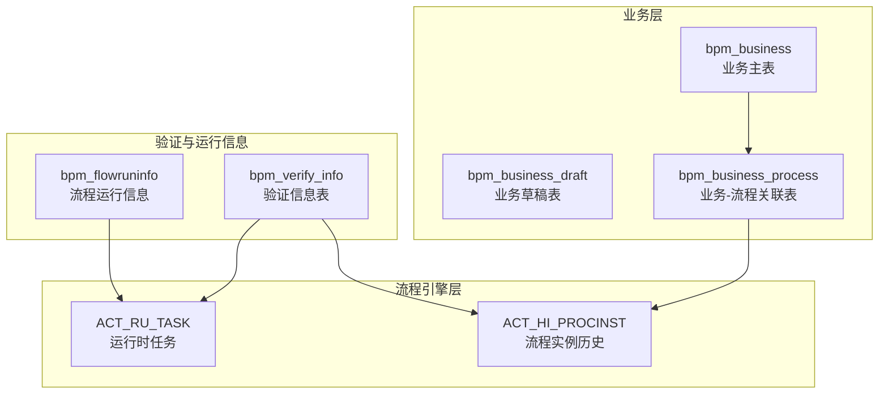
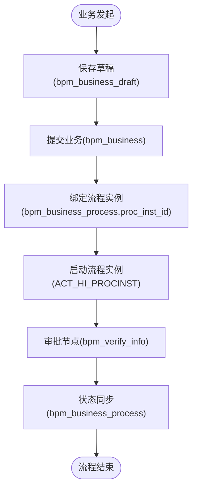
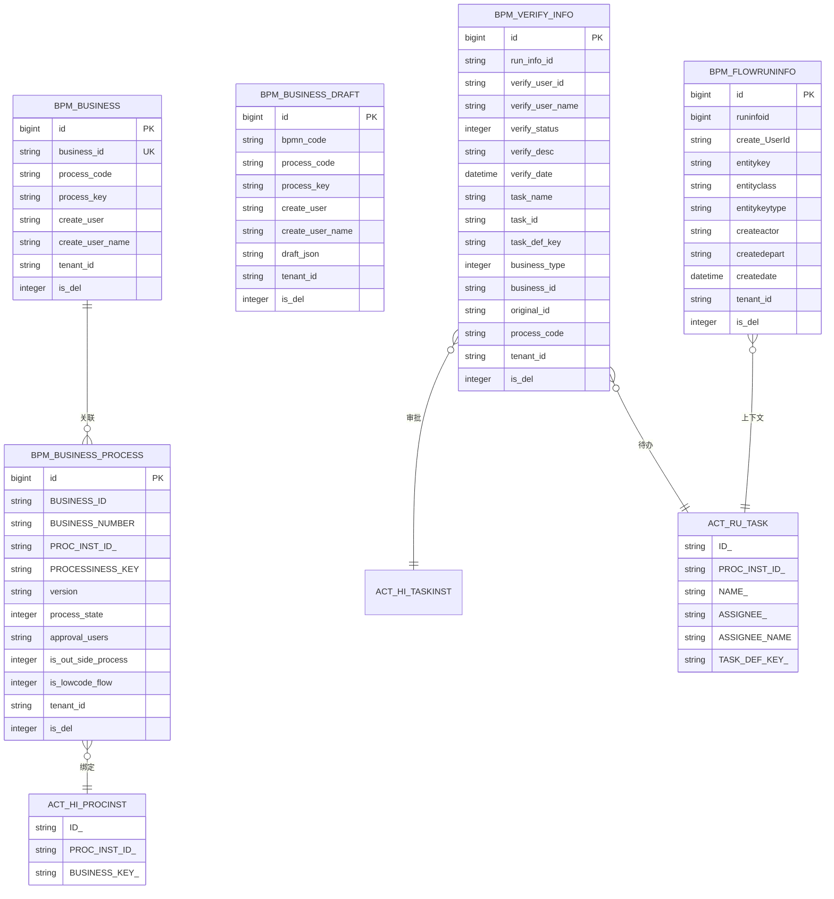

# 业务数据表结构

<cite>
**本文引用的文件**
- [BpmBusiness.java](file://antflow-base/src/main/java/org/openoa/base/entity/BpmBusiness.java)
- [BpmBusinessDraft.java](file://antflow-base/src/main/java/org/openoa/base/entity/BpmBusinessDraft.java)
- [BpmBusinessProcess.java](file://antflow-base/src/main/java/org/openoa/base/entity/BpmBusinessProcess.java)
- [BpmFlowruninfo.java](file://antflow-base/src/main/java/org/openoa/base/entity/BpmFlowruninfo.java)
- [BpmVerifyInfo.java](file://antflow-base/src/main/java/org/openoa/base/entity/BpmVerifyInfo.java)
- [BpmVerifyInfoMapper.xml](file://antflow-engine/src/main/resources/mapper/BpmVerifyInfoMapper.xml)
- [22.流程核心关键表说明.md](file://doc/系统介绍篇/22.流程核心关键表说明.md)
- [act_init_db.sql](file://script/act_init_db.sql)
- [ExecutionEntity.java](file://antflow-base/src/main/java/org/activiti/engine/impl/persistence/entity/ExecutionEntity.java)
- [ProcessInstanceBuilderImpl.java](file://antflow-base/src/main/java/org/activiti/engine/impl/runtime/ProcessInstanceBuilderImpl.java)
- [BpmVerifyInfoBizServiceImpl.java](file://antflow-engine/src/main/java/org/openoa/engine/bpmnconf/service/biz/BpmVerifyInfoBizServiceImpl.java)
</cite>

## 目录
1. [简介](#简介)
2. [项目结构](#项目结构)
3. [核心组件](#核心组件)
4. [架构总览](#架构总览)
5. [详细组件分析](#详细组件分析)
6. [依赖分析](#依赖分析)
7. [性能考虑](#性能考虑)
8. [故障排查指南](#故障排查指南)
9. [结论](#结论)
10. [附录](#附录)

## 简介
本文件聚焦于AntFlow工作流系统中的业务数据表结构，深入解析业务主表、草稿表、申请记录表、验证信息表等核心表的设计原理与字段定义；阐明业务数据与流程实例的关联机制（业务键绑定、数据持久化、状态同步）；总结不同业务数据的存储策略与查询优化方案，并给出业务数据与流程集成的数据模型图与使用示例。

## 项目结构
围绕业务数据与流程运行时的关键表，系统采用“业务主表 + 流程运行时 + 验证信息 + 草稿表”的分层设计，配合Activiti历史与运行时表完成完整的生命周期管理。



图表来源
- [BpmBusiness.java:24-65](file://antflow-base/src/main/java/org/openoa/base/entity/BpmBusiness.java#L24-L65)
- [BpmBusinessDraft.java:24-67](file://antflow-base/src/main/java/org/openoa/base/entity/BpmBusinessDraft.java#L24-L67)
- [BpmBusinessProcess.java:25-133](file://antflow-base/src/main/java/org/openoa/base/entity/BpmBusinessProcess.java#L25-L133)
- [BpmFlowruninfo.java:24-72](file://antflow-base/src/main/java/org/openoa/base/entity/BpmFlowruninfo.java#L24-L72)
- [BpmVerifyInfo.java:25-97](file://antflow-base/src/main/java/org/openoa/base/entity/BpmVerifyInfo.java#L25-L97)
- [act_init_db.sql:146-193](file://script/act_init_db.sql#L146-L193)

章节来源
- [22.流程核心关键表说明.md:5-73](file://doc/系统介绍篇/22.流程核心关键表说明.md#L5-L73)

## 核心组件
- 业务主表：承载业务唯一标识、创建信息、流程编码与租户隔离字段，用于业务与流程的初次绑定。
- 业务草稿表：保存业务在发起前的临时草稿，便于断点续传与离线编辑。
- 业务-流程关联表：建立业务与流程实例的强关联，包含流程实例ID、业务状态、审批人等关键字段。
- 流程运行信息表：记录流程运行期的实体键、类名、类型、创建者与部门等上下文信息。
- 验证信息表：记录审批节点的处理人、状态、描述、时间、任务名称与业务关联，支撑审批轨迹与状态同步。

章节来源
- [BpmBusiness.java:24-65](file://antflow-base/src/main/java/org/openoa/base/entity/BpmBusiness.java#L24-L65)
- [BpmBusinessDraft.java:24-67](file://antflow-base/src/main/java/org/openoa/base/entity/BpmBusinessDraft.java#L24-L67)
- [BpmBusinessProcess.java:25-133](file://antflow-base/src/main/java/org/openoa/base/entity/BpmBusinessProcess.java#L25-L133)
- [BpmFlowruninfo.java:24-72](file://antflow-base/src/main/java/org/openoa/base/entity/BpmFlowruninfo.java#L24-L72)
- [BpmVerifyInfo.java:25-97](file://antflow-base/src/main/java/org/openoa/base/entity/BpmVerifyInfo.java#L25-L97)

## 架构总览
业务数据与流程实例通过“业务键”与“流程实例ID”进行双向绑定，形成稳定的数据关联链路。业务主表负责业务唯一性与上下文，草稿表负责临时状态，关联表负责生命周期与状态流转，验证表负责审批轨迹与状态同步，运行信息表负责运行期上下文。

```mermaid
sequenceDiagram
participant Client as "客户端"
participant Biz as "业务主表(bpm_business)"
participant Draft as "草稿表(bpm_business_draft)"
participant Link as "关联表(bpm_business_process)"
participant Engine as "流程引擎(ACT_HI_PROCINST/ACT_RU_TASK)"
participant Verify as "验证表(bpm_verify_info)"
Client->>Biz : 创建业务记录
Client->>Draft : 保存草稿
Client->>Link : 绑定流程实例ID(proc_inst_id)
Link->>Engine : 启动流程实例
Engine-->>Verify : 记录审批节点
Verify-->>Link : 更新业务状态
Link-->>Biz : 同步业务状态
```

图表来源
- [BpmBusiness.java:24-65](file://antflow-base/src/main/java/org/openoa/base/entity/BpmBusiness.java#L24-L65)
- [BpmBusinessDraft.java:24-67](file://antflow-base/src/main/java/org/openoa/base/entity/BpmBusinessDraft.java#L24-L67)
- [BpmBusinessProcess.java:112-114](file://antflow-base/src/main/java/org/openoa/base/entity/BpmBusinessProcess.java#L112-L114)
- [act_init_db.sql:146-193](file://script/act_init_db.sql#L146-L193)
- [BpmVerifyInfo.java:25-97](file://antflow-base/src/main/java/org/openoa/base/entity/BpmVerifyInfo.java#L25-L97)

## 详细组件分析

### 业务主表（bpm_business）
- 设计要点
  - 主键自增，业务唯一标识business_id用于跨系统识别。
  - 关联字段process_code/process_key指向流程模板与编号。
  - 租户隔离tenant_id与逻辑删除is_del字段统一治理。
- 字段要点
  - business_id：业务唯一键
  - process_code/process_key：流程模板与编号
  - create_user/create_user_name：创建人信息
  - tenant_id/is_del：租户与软删
- 使用场景
  - 业务发起前的元数据登记
  - 与流程实例的初次绑定

章节来源
- [BpmBusiness.java:24-65](file://antflow-base/src/main/java/org/openoa/base/entity/BpmBusiness.java#L24-L65)

### 业务草稿表（bpm_business_draft）
- 设计要点
  - 存放草稿JSON，便于离线编辑与断点续传。
  - bpmn_code/process_code/process_key与业务主表保持一致。
- 字段要点
  - draft_json：草稿内容
  - 其余字段与业务主表对应，便于草稿转正
- 使用场景
  - 表单草稿保存与恢复
  - 发起前的预审或预填

章节来源
- [BpmBusinessDraft.java:24-67](file://antflow-base/src/main/java/org/openoa/base/entity/BpmBusinessDraft.java#L24-L67)

### 业务-流程关联表（bpm_business_process）
- 设计要点
  - 强关联业务与流程实例，包含流程实例ID(proc_inst_id)、业务状态(process_state)、审批人(approval_users)等。
  - 支持新旧版本标识(version)，便于灰度与兼容。
  - is_out_side_process/is_lowcode_flow标记流程来源与类型。
- 字段要点
  - BUSINESS_ID/BUSINESS_NUMBER：业务标识与编号
  - PROC_INST_ID_：流程实例ID
  - process_state：流程状态（审批中/已批准/已取消等）
  - approval_users：审批人信息(JSON)
- 使用场景
  - 业务与流程实例的强绑定
  - 状态同步与审批人追踪

章节来源
- [BpmBusinessProcess.java:25-133](file://antflow-base/src/main/java/org/openoa/base/entity/BpmBusinessProcess.java#L25-L133)

### 流程运行信息表（bpm_flowruninfo）
- 设计要点
  - 记录流程运行期上下文，如实体键(entitykey)、实体类(entityclass)、实体类型(entitykeytype)、创建者(createactor)、创建部门(createdepart)等。
  - 与运行时任务表ACT_RU_TASK联动，支撑待办任务展示与处理。
- 字段要点
  - entitykey/entityclass/entitykeytype：实体上下文
  - createactor/createdepart：创建者与部门
  - createUserId：创建人ID
- 使用场景
  - 运行期上下文查询与展示
  - 任务归属与权限判断

章节来源
- [BpmFlowruninfo.java:24-72](file://antflow-base/src/main/java/org/openoa/base/entity/BpmFlowruninfo.java#L24-L72)

### 验证信息表（bpm_verify_info）
- 设计要点
  - 记录审批节点的处理人、状态、描述、时间、任务名称与业务关联。
  - 支持按business_id/process_code过滤，支撑审批轨迹查询。
  - 与历史任务表ACT_HI_TASKINST联动，确保审批状态一致性。
- 字段要点
  - run_info_id：流程运行信息ID
  - verify_user_id/verify_user_name：审批人
  - verify_status：审批状态（提交/同意/不同意/撤回/作废/终止/退回修改/加批等）
  - verify_desc/verify_date：审批意见与时间
  - task_name/task_id/task_def_key：任务信息
  - business_id/business_type/process_code：业务关联
- 查询优化
  - 提供按business_id/process_code/process_code列表的条件查询
  - 排序按verify_date降序，便于展示最新审批

章节来源
- [BpmVerifyInfo.java:25-97](file://antflow-base/src/main/java/org/openoa/base/entity/BpmVerifyInfo.java#L25-L97)
- [BpmVerifyInfoMapper.xml:25-66](file://antflow-engine/src/main/resources/mapper/BpmVerifyInfoMapper.xml#L25-L66)

### 业务键绑定与流程实例关联机制
- 业务键绑定
  - 业务主表通过business_id与流程模板process_key/process_code建立业务域内的唯一性与可检索性。
  - 流程实例启动时，通过流程引擎的业务键设置与历史表ACT_HI_PROCINST的BUSINESS_KEY_字段保持一致。
- 数据持久化
  - 业务主表与草稿表分别承担“正式数据”与“临时数据”的持久化职责。
  - 关联表在流程启动后写入流程实例ID，完成业务与流程的绑定。
- 状态同步
  - 验证信息表记录审批状态变更，bizServiceImpl根据历史任务表ACT_HI_TASKINST更新最终状态，实现业务状态与流程状态的同步。



图表来源
- [BpmBusiness.java:24-65](file://antflow-base/src/main/java/org/openoa/base/entity/BpmBusiness.java#L24-L65)
- [BpmBusinessDraft.java:24-67](file://antflow-base/src/main/java/org/openoa/base/entity/BpmBusinessDraft.java#L24-L67)
- [BpmBusinessProcess.java:112-114](file://antflow-base/src/main/java/org/openoa/base/entity/BpmBusinessProcess.java#L112-L114)
- [BpmVerifyInfo.java:25-97](file://antflow-base/src/main/java/org/openoa/base/entity/BpmVerifyInfo.java#L25-L97)
- [act_init_db.sql:146-193](file://script/act_init_db.sql#L146-L193)

章节来源
- [ExecutionEntity.java:745-756](file://antflow-base/src/main/java/org/activiti/engine/impl/persistence/entity/ExecutionEntity.java#L745-L756)
- [ProcessInstanceBuilderImpl.java:91-93](file://antflow-base/src/main/java/org/activiti/engine/impl/runtime/ProcessInstanceBuilderImpl.java#L91-L93)
- [BpmVerifyInfoBizServiceImpl.java:145-170](file://antflow-engine/src/main/java/org/openoa/engine/bpmnconf/service/biz/BpmVerifyInfoBizServiceImpl.java#L145-L170)

## 依赖分析
- 表间依赖
  - bpm_business → bpm_business_process：业务主表驱动流程关联
  - bpm_business_process → ACT_HI_PROCINST：流程实例ID绑定
  - bpm_verify_info → ACT_HI_TASKINST/ACT_RU_TASK：审批状态与任务联动
  - bpm_flowruninfo → ACT_RU_TASK：运行期上下文与任务联动
- 外部依赖
  - Activiti历史与运行时表提供流程状态与任务信息的权威来源
  - MyBatis XML映射提供验证信息的查询与排序能力



图表来源
- [BpmBusiness.java:24-65](file://antflow-base/src/main/java/org/openoa/base/entity/BpmBusiness.java#L24-L65)
- [BpmBusinessDraft.java:24-67](file://antflow-base/src/main/java/org/openoa/base/entity/BpmBusinessDraft.java#L24-L67)
- [BpmBusinessProcess.java:25-133](file://antflow-base/src/main/java/org/openoa/base/entity/BpmBusinessProcess.java#L25-L133)
- [BpmFlowruninfo.java:24-72](file://antflow-base/src/main/java/org/openoa/base/entity/BpmFlowruninfo.java#L24-L72)
- [BpmVerifyInfo.java:25-97](file://antflow-base/src/main/java/org/openoa/base/entity/BpmVerifyInfo.java#L25-L97)
- [act_init_db.sql:146-193](file://script/act_init_db.sql#L146-L193)

章节来源
- [22.流程核心关键表说明.md:5-73](file://doc/系统介绍篇/22.流程核心关键表说明.md#L5-L73)

## 性能考虑
- 索引建议
  - bpm_verify_info：按business_id、process_code、verify_date建立复合索引，支撑审批轨迹查询与排序。
  - bpm_business_process：按proc_inst_id、business_id建立索引，支撑流程实例与业务查询。
  - ACT_HI_PROCINST：利用BUSINESS_KEY_与PROC_INST_ID_索引，加速业务键与实例查询。
- 查询优化
  - 验证信息查询优先使用business_id或process_code过滤，避免全表扫描。
  - 分页查询verify_date降序结果，减少内存压力。
- 写入优化
  - 审批状态批量写入时，尽量合并事务，减少锁竞争。
  - 草稿表与业务主表分离，降低并发冲突。

## 故障排查指南
- 业务键不匹配
  - 现象：流程实例无法定位到业务记录
  - 排查：确认bpm_business.process_code/process_key与流程模板一致；确认ACT_HI_PROCINST.BUSINESS_KEY_与业务键一致
- 审批状态异常
  - 现象：审批轨迹缺失或状态不一致
  - 排查：检查bpm_verify_info是否按verify_date正确排序；核对ACT_HI_TASKINST与ACT_RU_TASK的任务状态
- 草稿丢失
  - 现象：草稿无法恢复
  - 排查：确认bpm_business_draft.draft_json未被清理；核对bpmn_code/process_code是否一致

章节来源
- [BpmVerifyInfoBizServiceImpl.java:145-170](file://antflow-engine/src/main/java/org/openoa/engine/bpmnconf/service/biz/BpmVerifyInfoBizServiceImpl.java#L145-L170)
- [BpmVerifyInfoMapper.xml:25-66](file://antflow-engine/src/main/resources/mapper/BpmVerifyInfoMapper.xml#L25-L66)

## 结论
该业务数据表结构以“业务主表 + 草稿表 + 关联表 + 运行信息 + 验证表”为核心，结合Activiti的历史与运行时表，实现了业务数据与流程实例的强绑定、状态同步与审批轨迹可视化。通过合理的索引与查询策略，可在保证数据一致性的同时满足高并发场景下的性能需求。

## 附录
- 使用示例（路径参考）
  - 业务发起：[BpmBusiness.java:24-65](file://antflow-base/src/main/java/org/openoa/base/entity/BpmBusiness.java#L24-L65)
  - 草稿保存：[BpmBusinessDraft.java:24-67](file://antflow-base/src/main/java/org/openoa/base/entity/BpmBusinessDraft.java#L24-L67)
  - 流程绑定：[BpmBusinessProcess.java:112-114](file://antflow-base/src/main/java/org/openoa/base/entity/BpmBusinessProcess.java#L112-L114)
  - 审批查询：[BpmVerifyInfoMapper.xml:25-66](file://antflow-engine/src/main/resources/mapper/BpmVerifyInfoMapper.xml#L25-L66)
  - 流程实例与业务键：[ExecutionEntity.java:745-756](file://antflow-base/src/main/java/org/activiti/engine/impl/persistence/entity/ExecutionEntity.java#L745-L756)、[ProcessInstanceBuilderImpl.java:91-93](file://antflow-base/src/main/java/org/activiti/engine/impl/runtime/ProcessInstanceBuilderImpl.java#L91-L93)