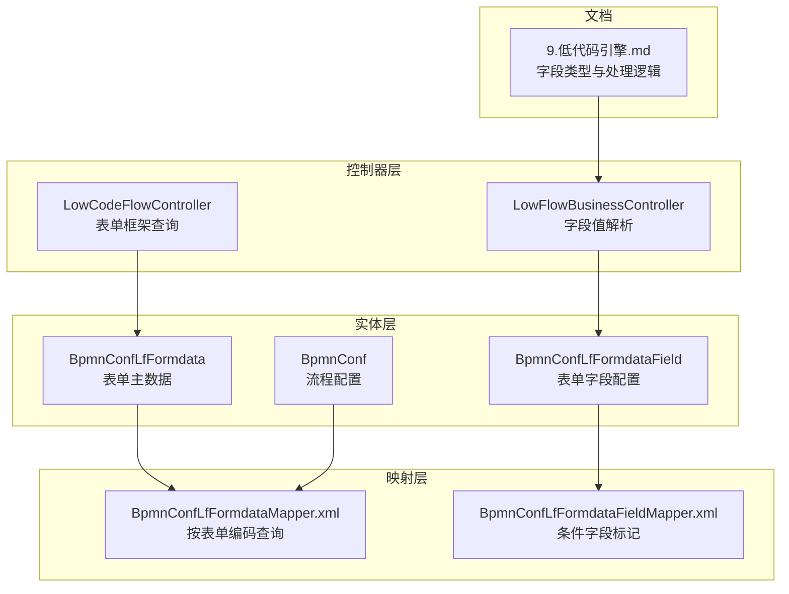
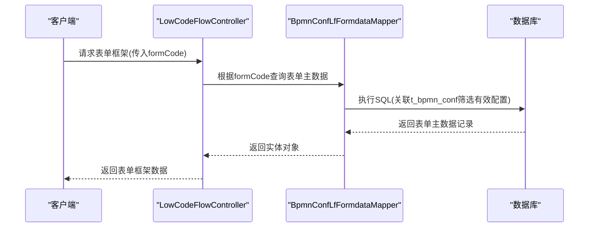
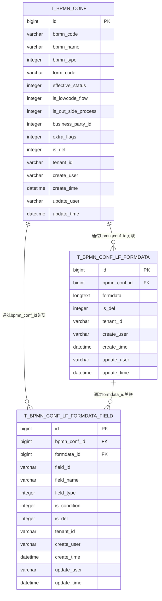
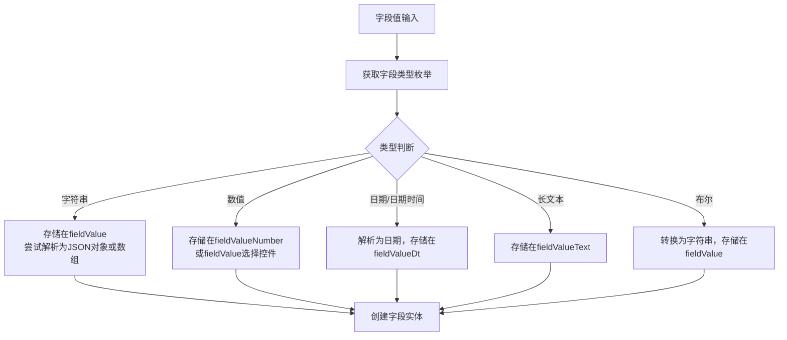
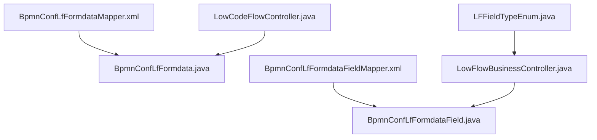

# 低代码表单表结构

<cite>
**本文档引用的文件**
- [BpmnConfLfFormdata.java](file://antflow-base/src/main/java/org/openoa/base/entity/BpmnConfLfFormdata.java)
- [BpmnConfLfFormdataField.java](file://antflow-base/src/main/java/org/openoa/base/entity/BpmnConfLfFormdataField.java)
- [BpmnConf.java](file://antflow-base/src/main/java/org/openoa/base/entity/BpmnConf.java)
- [LFFieldTypeEnum.java](file://antflow-base/src/main/java/org/openoa/base/constant/enums/LFFieldTypeEnum.java)
- [BpmnConfLfFormdataMapper.xml](file://antflow-engine/src/main/resources/mapper/BpmnConfLfFormdataMapper.xml)
- [BpmnConfLfFormdataFieldMapper.xml](file://antflow-engine/src/main/resources/mapper/BpmnConfLfFormdataFieldMapper.xml)
- [LowFlowBusinessController.java](file://antflow-engine/src/main/java/org/openoa/engine/bpmnconf/controller/LowFlowBusinessController.java)
- [LowCodeFlowController.java](file://antflow-engine/src/main/java/org/openoa/engine/bpmnconf/controller/LowCodeFlowController.java)
- [9.低代码引擎.md](file://doc/系统介绍篇/9.低代码引擎.md)
</cite>

## 目录
1. [简介](#简介)
2. [项目结构](#项目结构)
3. [核心组件](#核心组件)
4. [架构概览](#架构概览)
5. [详细组件分析](#详细组件分析)
6. [依赖分析](#依赖分析)
7. [性能考虑](#性能考虑)
8. [故障排除指南](#故障排除指南)
9. [结论](#结论)
10. [附录](#附录)

## 简介
本文件深入解析低代码表单引擎的核心数据结构与设计原理，涵盖表单主表、表单字段表、表单配置表等关键表的设计思路、字段定义、关联关系及数据持久化策略。文档同时阐述低代码表单与传统数据库表的关系、动态表单字段的存储与查询机制、字段类型映射、验证规则与数据转换逻辑，并提供数据模型图与使用示例。

## 项目结构
低代码表单相关的核心代码分布在以下模块中：
- 实体层：表单主数据实体、字段配置实体、流程配置实体
- 映射层：MyBatis XML 映射文件，定义查询与更新逻辑
- 控制器层：业务控制器，负责表单数据的解析与转换
- 文档说明：系统介绍篇中的低代码引擎章节，提供字段类型与处理逻辑说明

**图表来源**
- [BpmnConfLfFormdata.java:16-72](file://antflow-base/src/main/java/org/openoa/base/entity/BpmnConfLfFormdata.java#L16-L72)
- [BpmnConfLfFormdataField.java:17-89](file://antflow-base/src/main/java/org/openoa/base/entity/BpmnConfLfFormdataField.java#L17-L89)
- [BpmnConf.java:30-126](file://antflow-base/src/main/java/org/openoa/base/entity/BpmnConf.java#L30-L126)
- [BpmnConfLfFormdataMapper.xml:5-10](file://antflow-engine/src/main/resources/mapper/BpmnConfLfFormdataMapper.xml#L5-L10)
- [BpmnConfLfFormdataFieldMapper.xml:7-10](file://antflow-engine/src/main/resources/mapper/BpmnConfLfFormdataFieldMapper.xml#L7-L10)
- [LowFlowBusinessController.java:159-194](file://antflow-engine/src/main/java/org/openoa/engine/bpmnconf/controller/LowFlowBusinessController.java#L159-L194)
- [LowCodeFlowController.java:64-74](file://antflow-engine/src/main/java/org/openoa/engine/bpmnconf/controller/LowCodeFlowController.java#L64-L74)
- [9.低代码引擎.md:84-132](file://doc/系统介绍篇/9.低代码引擎.md#L84-L132)

**章节来源**
- [BpmnConfLfFormdata.java:16-72](file://antflow-base/src/main/java/org/openoa/base/entity/BpmnConfLfFormdata.java#L16-L72)
- [BpmnConfLfFormdataField.java:17-89](file://antflow-base/src/main/java/org/openoa/base/entity/BpmnConfLfFormdataField.java#L17-L89)
- [BpmnConf.java:30-126](file://antflow-base/src/main/java/org/openoa/base/entity/BpmnConf.java#L30-L126)
- [BpmnConfLfFormdataMapper.xml:5-10](file://antflow-engine/src/main/resources/mapper/BpmnConfLfFormdataMapper.xml#L5-L10)
- [BpmnConfLfFormdataFieldMapper.xml:7-10](file://antflow-engine/src/main/resources/mapper/BpmnConfLfFormdataFieldMapper.xml#L7-L10)
- [LowFlowBusinessController.java:159-194](file://antflow-engine/src/main/java/org/openoa/engine/bpmnconf/controller/LowFlowBusinessController.java#L159-L194)
- [LowCodeFlowController.java:64-74](file://antflow-engine/src/main/java/org/openoa/engine/bpmnconf/controller/LowCodeFlowController.java#L64-L74)
- [9.低代码引擎.md:84-132](file://doc/系统介绍篇/9.低代码引擎.md#L84-L132)

## 核心组件
本节聚焦于低代码表单引擎的关键数据模型与字段定义，包括表单主数据、字段配置与流程配置三张核心表。

- 表单主数据表（t_bpmn_conf_lf_formdata）
  - 关键字段：主键ID、流程配置ID、表单数据（JSON格式）、逻辑删除标记、租户标识、创建/更新信息
  - 设计要点：采用逻辑删除标记，支持多租户；表单数据以JSON格式存储，便于动态表单结构的灵活扩展
  - 参考路径：[BpmnConfLfFormdata.java:24-70](file://antflow-base/src/main/java/org/openoa/base/entity/BpmnConfLfFormdata.java#L24-L70)

- 表单字段配置表（t_bpmn_conf_lf_formdata_field）
  - 关键字段：主键ID、流程配置ID、表单数据ID、字段ID、字段名、字段类型、是否条件字段、逻辑删除标记、租户标识、创建/更新信息
  - 设计要点：支持字段类型枚举映射、条件字段标记、逻辑删除与多租户；提供按配置ID与字段名的更新能力
  - 参考路径：[BpmnConfLfFormdataField.java:25-87](file://antflow-base/src/main/java/org/openoa/base/entity/BpmnConfLfFormdataField.java#L25-L87)

- 流程配置表（t_bpmn_conf）
  - 关键字段：主键ID、流程编码、流程名称、流程类型、表单编码、生效状态、是否低代码流程、是否外部流程、业务方标识、额外标志位、逻辑删除标记、租户标识、创建/更新信息
  - 设计要点：通过表单编码关联低代码表单；生效状态控制表单有效性；低代码流程标志区分传统流程与低代码流程
  - 参考路径：[BpmnConf.java:37-126](file://antflow-base/src/main/java/org/openoa/base/entity/BpmnConf.java#L37-L126)

**章节来源**
- [BpmnConfLfFormdata.java:24-70](file://antflow-base/src/main/java/org/openoa/base/entity/BpmnConfLfFormdata.java#L24-L70)
- [BpmnConfLfFormdataField.java:25-87](file://antflow-base/src/main/java/org/openoa/base/entity/BpmnConfLfFormdataField.java#L25-L87)
- [BpmnConf.java:37-126](file://antflow-base/src/main/java/org/openoa/base/entity/BpmnConf.java#L37-L126)

## 架构概览
低代码表单引擎通过“流程配置 → 表单主数据 → 字段配置”的层级关系实现动态表单的定义与运行时解析。查询流程通常从流程配置表开始，通过表单编码关联到表单主数据，再结合字段配置表完成字段类型与权限等属性的加载。

**图表来源**
- [LowCodeFlowController.java:64-74](file://antflow-engine/src/main/java/org/openoa/engine/bpmnconf/controller/LowCodeFlowController.java#L64-L74)
- [BpmnConfLfFormdataMapper.xml:5-10](file://antflow-engine/src/main/resources/mapper/BpmnConfLfFormdataMapper.xml#L5-L10)

**章节来源**
- [LowCodeFlowController.java:64-74](file://antflow-engine/src/main/java/org/openoa/engine/bpmnconf/controller/LowCodeFlowController.java#L64-L74)
- [BpmnConfLfFormdataMapper.xml:5-10](file://antflow-engine/src/main/resources/mapper/BpmnConfLfFormdataMapper.xml#L5-L10)

## 详细组件分析

### 数据模型图
下图展示低代码表单相关表之间的关联关系与字段要点：

**图表来源**
- [BpmnConf.java:30-126](file://antflow-base/src/main/java/org/openoa/base/entity/BpmnConf.java#L30-L126)
- [BpmnConfLfFormdata.java:16-72](file://antflow-base/src/main/java/org/openoa/base/entity/BpmnConfLfFormdata.java#L16-L72)
- [BpmnConfLfFormdataField.java:17-89](file://antflow-base/src/main/java/org/openoa/base/entity/BpmnConfLfFormdataField.java#L17-L89)

**章节来源**
- [BpmnConf.java:30-126](file://antflow-base/src/main/java/org/openoa/base/entity/BpmnConf.java#L30-L126)
- [BpmnConfLfFormdata.java:16-72](file://antflow-base/src/main/java/org/openoa/base/entity/BpmnConfLfFormdata.java#L16-L72)
- [BpmnConfLfFormdataField.java:17-89](file://antflow-base/src/main/java/org/openoa/base/entity/BpmnConfLfFormdataField.java#L17-L89)

### 字段类型映射与数据转换
低代码引擎通过字段类型枚举对不同类型的字段进行统一管理，并在运行时进行相应的数据转换与存储决策。字段类型与处理逻辑由文档明确说明，控制器在解析字段值时依据类型执行不同的转换分支。

- 字段类型枚举（LFFieldTypeEnum）
  - 支持类型：字符串、数值、日期、日期时间、长文本、布尔、二进制
  - 参考路径：[LFFieldTypeEnum.java:10-47](file://antflow-base/src/main/java/org/openoa/base/constant/enums/LFFieldTypeEnum.java#L10-L47)

- 字段值处理流程（基于文档说明）
  - 输入字段值 → 判断字段类型 → 根据类型选择存储位置（如fieldValue、fieldValueNumber、fieldValueDt、fieldValueText等）→ 特殊类型（如选择控件）进行JSON或数值解析 → 输出最终值
  - 参考路径：[9.低代码引擎.md:84-132](file://doc/系统介绍篇/9.低代码引擎.md#L84-L132)

- 运行时解析（控制器）
  - 控制器根据字段类型枚举执行分支处理，对字符串类型尝试解析为JSON对象或数组，对数值类型在特定控件场景下进行JSON解析与数值转换
  - 参考路径：[LowFlowBusinessController.java:159-194](file://antflow-engine/src/main/java/org/openoa/engine/bpmnconf/controller/LowFlowBusinessController.java#L159-L194)

**图表来源**
- [9.低代码引擎.md:84-132](file://doc/系统介绍篇/9.低代码引擎.md#L84-L132)
- [LowFlowBusinessController.java:159-194](file://antflow-engine/src/main/java/org/openoa/engine/bpmnconf/controller/LowFlowBusinessController.java#L159-L194)

**章节来源**
- [LFFieldTypeEnum.java:10-47](file://antflow-base/src/main/java/org/openoa/base/constant/enums/LFFieldTypeEnum.java#L10-L47)
- [9.低代码引擎.md:84-132](file://doc/系统介绍篇/9.低代码引擎.md#L84-L132)
- [LowFlowBusinessController.java:159-194](file://antflow-engine/src/main/java/org/openoa/engine/bpmnconf/controller/LowFlowBusinessController.java#L159-L194)

### 查询与更新机制
- 按表单编码查询表单主数据
  - 通过BpmnConfLfFormdataMapper的命名空间与SQL实现，关联t_bpmn_conf表筛选生效状态为有效的配置，确保只返回可用的表单框架
  - 参考路径：[BpmnConfLfFormdataMapper.xml:5-10](file://antflow-engine/src/main/resources/mapper/BpmnConfLfFormdataMapper.xml#L5-L10)

- 条件字段标记更新
  - 提供按配置ID与字段名更新条件字段标记的SQL，便于在流程节点中启用/禁用条件字段
  - 参考路径：[BpmnConfLfFormdataFieldMapper.xml:7-10](file://antflow-engine/src/main/resources/mapper/BpmnConfLfFormdataFieldMapper.xml#L7-L10)

**章节来源**
- [BpmnConfLfFormdataMapper.xml:5-10](file://antflow-engine/src/main/resources/mapper/BpmnConfLfFormdataMapper.xml#L5-L10)
- [BpmnConfLfFormdataFieldMapper.xml:7-10](file://antflow-engine/src/main/resources/mapper/BpmnConfLfFormdataFieldMapper.xml#L7-L10)

### 使用示例
- 获取表单框架
  - 调用LowCodeFlowController接口，传入formCode参数，系统将根据表单编码查询t_bpmn_conf并关联t_bpmn_conf_lf_formdata，返回表单框架数据
  - 参考路径：[LowCodeFlowController.java:64-74](file://antflow-engine/src/main/java/org/openoa/engine/bpmnconf/controller/LowCodeFlowController.java#L64-L74)

- 字段值解析
  - 在业务流程中，通过LowFlowBusinessController对字段值进行类型化解析，依据LFFieldTypeEnum的类型分支执行相应的转换逻辑
  - 参考路径：[LowFlowBusinessController.java:159-194](file://antflow-engine/src/main/java/org/openoa/engine/bpmnconf/controller/LowFlowBusinessController.java#L159-L194)

**章节来源**
- [LowCodeFlowController.java:64-74](file://antflow-engine/src/main/java/org/openoa/engine/bpmnconf/controller/LowCodeFlowController.java#L64-L74)
- [LowFlowBusinessController.java:159-194](file://antflow-engine/src/main/java/org/openoa/engine/bpmnconf/controller/LowFlowBusinessController.java#L159-L194)

## 依赖分析
低代码表单引擎的依赖关系主要体现在实体类、映射文件与控制器之间的协作上。实体类定义表结构与字段约束，映射文件提供查询与更新SQL，控制器负责业务逻辑与数据转换。

**图表来源**
- [BpmnConfLfFormdataMapper.xml:5-10](file://antflow-engine/src/main/resources/mapper/BpmnConfLfFormdataMapper.xml#L5-L10)
- [BpmnConfLfFormdataFieldMapper.xml:7-10](file://antflow-engine/src/main/resources/mapper/BpmnConfLfFormdataFieldMapper.xml#L7-L10)
- [BpmnConfLfFormdata.java:16-72](file://antflow-base/src/main/java/org/openoa/base/entity/BpmnConfLfFormdata.java#L16-L72)
- [BpmnConfLfFormdataField.java:17-89](file://antflow-base/src/main/java/org/openoa/base/entity/BpmnConfLfFormdataField.java#L17-L89)
- [LowFlowBusinessController.java:159-194](file://antflow-engine/src/main/java/org/openoa/engine/bpmnconf/controller/LowFlowBusinessController.java#L159-L194)
- [LowCodeFlowController.java:64-74](file://antflow-engine/src/main/java/org/openoa/engine/bpmnconf/controller/LowCodeFlowController.java#L64-L74)
- [LFFieldTypeEnum.java:10-47](file://antflow-base/src/main/java/org/openoa/base/constant/enums/LFFieldTypeEnum.java#L10-L47)

**章节来源**
- [BpmnConfLfFormdataMapper.xml:5-10](file://antflow-engine/src/main/resources/mapper/BpmnConfLfFormdataMapper.xml#L5-L10)
- [BpmnConfLfFormdataFieldMapper.xml:7-10](file://antflow-engine/src/main/resources/mapper/BpmnConfLfFormdataFieldMapper.xml#L7-L10)
- [BpmnConfLfFormdata.java:16-72](file://antflow-base/src/main/java/org/openoa/base/entity/BpmnConfLfFormdata.java#L16-L72)
- [BpmnConfLfFormdataField.java:17-89](file://antflow-base/src/main/java/org/openoa/base/entity/BpmnConfLfFormdataField.java#L17-L89)
- [LowFlowBusinessController.java:159-194](file://antflow-engine/src/main/java/org/openoa/engine/bpmnconf/controller/LowFlowBusinessController.java#L159-L194)
- [LowCodeFlowController.java:64-74](file://antflow-engine/src/main/java/org/openoa/engine/bpmnconf/controller/LowCodeFlowController.java#L64-L74)
- [LFFieldTypeEnum.java:10-47](file://antflow-base/src/main/java/org/openoa/base/constant/enums/LFFieldTypeEnum.java#L10-L47)

## 性能考虑
- 索引与查询优化
  - 建议在t_bpmn_conf的form_code字段建立索引，以提升按表单编码查询的性能
  - 对t_bpmn_conf_lf_formdata的bpmn_conf_id字段建立索引，加速表单主数据的关联查询
  - 对t_bpmn_conf_lf_formdata_field的bpmn_conf_id与field_id字段建立复合索引，优化字段配置的查询与更新
- 逻辑删除与数据清理
  - 使用逻辑删除标记避免物理删除带来的性能损耗，定期清理长期未使用的表单数据
- JSON存储的权衡
  - 表单数据以JSON格式存储提供了灵活性，但可能影响传统关系型查询的性能；建议在高频查询场景下引入物化视图或缓存策略

## 故障排除指南
- 表单编码无效
  - 现象：按表单编码查询不到有效配置
  - 排查：确认t_bpmn_conf中form_code是否存在且effective_status为有效状态
  - 参考路径：[BpmnConfLfFormdataMapper.xml:5-10](file://antflow-engine/src/main/resources/mapper/BpmnConfLfFormdataMapper.xml#L5-L10)

- 字段类型未识别
  - 现象：运行时抛出未识别的字段类型异常
  - 排查：检查字段配置表中的field_type是否在LFFieldTypeEnum范围内
  - 参考路径：[LowFlowBusinessController.java:159-164](file://antflow-engine/src/main/java/org/openoa/engine/bpmnconf/controller/LowFlowBusinessController.java#L159-L164)

- 条件字段标记失败
  - 现象：无法将字段标记为条件字段
  - 排查：确认bpmn_conf_id与field_id的组合是否唯一，SQL更新语句是否正确执行
  - 参考路径：[BpmnConfLfFormdataFieldMapper.xml:7-10](file://antflow-engine/src/main/resources/mapper/BpmnConfLfFormdataFieldMapper.xml#L7-L10)

**章节来源**
- [BpmnConfLfFormdataMapper.xml:5-10](file://antflow-engine/src/main/resources/mapper/BpmnConfLfFormdataMapper.xml#L5-L10)
- [LowFlowBusinessController.java:159-164](file://antflow-engine/src/main/java/org/openoa/engine/bpmnconf/controller/LowFlowBusinessController.java#L159-L164)
- [BpmnConfLfFormdataFieldMapper.xml:7-10](file://antflow-engine/src/main/resources/mapper/BpmnConfLfFormdataFieldMapper.xml#L7-L10)

## 结论
低代码表单引擎通过清晰的三层结构（流程配置、表单主数据、字段配置）与标准化的字段类型体系，实现了动态表单的灵活定义与高效运行。借助逻辑删除、多租户支持与JSON存储策略，系统在保证扩展性的同时兼顾了性能与可维护性。通过本文档提供的数据模型图、字段类型映射与使用示例，开发者可以快速理解并应用该引擎进行低代码表单的构建与集成。

## 附录
- 字段类型与存储映射参考：[9.低代码引擎.md:84-132](file://doc/系统介绍篇/9.低代码引擎.md#L84-L132)
- 字段类型枚举定义：[LFFieldTypeEnum.java:10-47](file://antflow-base/src/main/java/org/openoa/base/constant/enums/LFFieldTypeEnum.java#L10-L47)