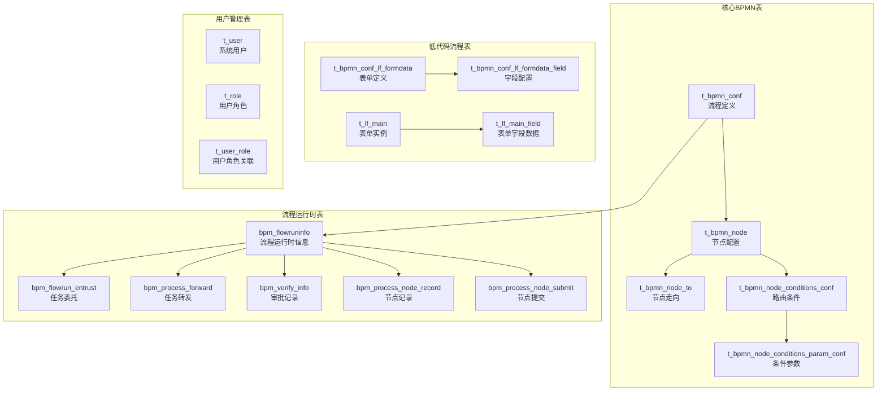
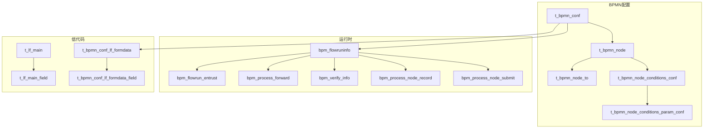
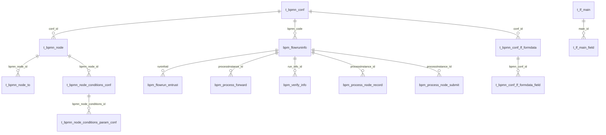

# 核心表结构详解

<cite>
**本文档引用的文件**
- [bpm_init_db.sql](file://script/bpm_init_db.sql)
- [act_init_db.sql](file://script/act_init_db.sql)
- [BpmnConf.java](file://antflow-base/src/main/java/org/openoa/base/entity/BpmnConf.java)
- [BpmnNode.java](file://antflow-base/src/main/java/org/openoa/base/entity/BpmnNode.java)
- [BpmnNodeTo.java](file://antflow-base/src/main/java/org/openoa/base/entity/BpmnNodeTo.java)
- [LFMain.java](file://antflow-engine/src/main/java/org/antflow/engine/lowflow/entity/LFMain.java)
- [LFMainField.java](file://antflow-engine/src/main/java/org/antflow/engine/lowflow/entity/LFMainField.java)
- [22.流程核心关键表说明.md](file://doc/系统介绍篇/22.流程核心关键表说明.md)
- [9.低代码引擎.md](file://doc/系统介绍篇/9.低代码引擎.md)
</cite>

## 目录
1. [简介](#简介)
2. [项目结构](#项目结构)
3. [核心组件](#核心组件)
4. [架构总览](#架构总览)
5. [详细组件分析](#详细组件分析)
6. [依赖分析](#依赖分析)
7. [性能考虑](#性能考虑)
8. [故障排除指南](#故障排除指南)
9. [结论](#结论)
10. [附录](#附录)

## 简介
本文件面向AntFlow工作流平台的核心表结构，系统性解析以下关键表的设计原理与字段定义：
- BPMN配置表：t_bpmn_conf、t_bpmn_node、t_bpmn_node_to、t_bpmn_node_conditions_conf、t_bpmn_node_conditions_param_conf
- 流程运行时表：bpm_flowruninfo、bpm_flowrun_entrust、bpm_process_forward、bpm_verify_info、bpm_process_node_record、bpm_process_node_submit
- 低代码流程表：t_lf_main、t_lf_main_field、t_bpmn_conf_lf_formdata、t_bpmn_conf_lf_formdata_field
- 用户管理表：t_user、t_role、t_user_role（示例表，可替换）

重点说明各表的主键设计、外键关系、索引策略、字段约束；解释表结构与Activiti引擎标准表的对应关系；阐述AntFlow自定义扩展字段的作用；并提供表关系图与数据字典。

## 项目结构
AntFlow采用分层架构，数据库层通过初始化SQL脚本创建核心表，并通过MyBatis-Plus实体类映射到Java对象。核心表分为三大类：
- 核心BPMN表：流程定义与节点配置
- 流程运行时表：流程实例、任务、委托、转发、审批记录
- 低代码流程表：表单定义与运行时数据

图表来源
- [22.流程核心关键表说明.md:9-73](file://doc/系统介绍篇/22.流程核心关键表说明.md#L9-L73)

章节来源
- [22.流程核心关键表说明.md:5-73](file://doc/系统介绍篇/22.流程核心关键表说明.md#L5-L73)

## 核心组件
本节从表结构、字段约束、索引策略、扩展字段等方面，对核心表进行深入解析。

### BPMN配置表
- t_bpmn_conf（流程定义）
  - 主键：id（自增）
  - 关键字段：bpmn_code（唯一）、bpmn_name、bpmn_type、form_code、is_lowcode_flow、effective_status、is_all、is_out_side_process、business_party_id、tenant_id、is_del
  - 约束：唯一索引 bpmn_code；默认值 create_time、update_time 使用当前时间戳
  - 扩展字段：is_lowcode_flow 标识是否为低代码审批流；effective_status 控制流程生效状态
  - 对应实体：BpmnConf.java

- t_bpmn_node（节点配置）
  - 主键：id（自增）
  - 外键：conf_id → t_bpmn_conf(id)
  - 关键字段：node_id、node_type、node_property、node_from、node_froms、batch_status、approval_standard、node_name、node_display_name、is_deduplication、is_sign_up、is_dynamicCondition、is_parallel、tenant_id、is_del
  - 索引：index_conf_id、t_bpmn_node_dx2(node_id)
  - 扩展字段：is_dynamicCondition、is_parallel 支持动态条件与并行节点
  - 对应实体：BpmnNode.java

- t_bpmn_node_to（节点走向）
  - 主键：id（自增）
  - 外键：bpmn_node_id → t_bpmn_node(id)
  - 关键字段：node_to、tenant_id、is_del
  - 索引：t_bpmn_node_to_idx1、t_bpmn_node_to_idx2
  - 对应实体：BpmnNodeTo.java

- t_bpmn_node_conditions_conf（节点条件配置）
  - 主键：id（自增）
  - 外键：bpmn_node_id → t_bpmn_node(id)
  - 关键字段：is_default、sort、group_relation、ext_json、tenant_id、is_del
  - 索引：t_bpmn_node_conditions_conf_idx1
  - 扩展字段：ext_json 存储前端Vue3条件列表参数模型

- t_bpmn_node_conditions_param_conf（条件参数配置）
  - 主键：id（自增）
  - 外键：bpmn_node_conditions_id → t_bpmn_node_conditions_conf(id)
  - 关键字段：condition_param_type、condition_param_name、condition_param_jsom、operator、cond_relation、cond_group、tenant_id、is_del
  - 索引：t_bpmn_node_conditions_param_conf_idx1

章节来源
- [bpm_init_db.sql:1-315](file://script/bpm_init_db.sql#L1-L315)
- [BpmnConf.java:30-126](file://antflow-base/src/main/java/org/openoa/base/entity/BpmnConf.java#L30-L126)
- [BpmnNode.java:27-132](file://antflow-base/src/main/java/org/openoa/base/entity/BpmnNode.java#L27-L132)
- [BpmnNodeTo.java:27-75](file://antflow-base/src/main/java/org/openoa/base/entity/BpmnNodeTo.java#L27-L75)

### 流程运行时表
- bpm_flowruninfo（流程运行时信息）
  - 主键：id（自增）
  - 关键字段：runinfoid（流程实例ID）、create_UserId、entitykey、entityclass、entitykeytype、createactor、createdepart、createdate、tenant_id、is_del
  - 索引：bpm_flowruninfo_idx1(runinfoid)

- bpm_flowrun_entrust（任务委托）
  - 主键：id（自增）
  - 关键字段：runinfoid、runtaskid、original、actual、type、is_read、proc_def_id、is_view、node_id、action_type、tenant_id
  - 索引：BPM_IDX_ID(runinfoid, original, actual)

- bpm_process_forward（任务转发）
  - 主键：id（自增）
  - 关键字段：forward_user_id、Forward_user_name、processInstance_Id、node_id、create_time、create_user_id、task_id、is_read、is_del、process_number、tenant_id
  - 索引：forward_user_id、index_forward_user_id_is_read

- bpm_verify_info（审批记录）
  - 主键：id（自增）
  - 关键字段：run_info_id、verify_user_id、verify_user_name、verify_status、verify_desc、verify_date、task_name、task_id、task_def_key、business_type、business_id、original_id、process_code、tenant_id、is_del
  - 索引：BPM_IDX__INFOR、process_code_index、bpm_verify_info_idx3

- bpm_process_node_record（节点记录）
  - 主键：id（自增）
  - 关键字段：processInstance_id、task_id、create_time、tenant_id、is_del
  - 索引：bpm_process_node_record_idx1、bpm_process_node_record_idx2

- bpm_process_node_submit（节点提交）
  - 主键：id（自增）
  - 关键字段：processInstance_Id、back_type、node_key、create_time、create_user、state、tenant_id、is_del
  - 索引：idx_processInstance_Id

章节来源
- [bpm_init_db.sql:261-790](file://script/bpm_init_db.sql#L261-L790)

### 低代码流程表
- t_lf_main（表单实例）
  - 主键：id（雪花ID）
  - 关键字段：conf_id、form_code、is_del、tenant_id、create_user、create_time、update_user、update_time
  - 索引：无（主键即索引）
  - 对应实体：LFMain.java

- t_lf_main_field（表单字段数据）
  - 主键：id（雪花ID）
  - 关键字段：main_id、form_code、field_id、field_name、parent_field_id、parent_field_name、field_value、field_value_number、field_value_dt、field_value_text、tenant_id、is_del
  - 索引：无（主键即索引）
  - 对应实体：LFMainField.java

- t_bpmn_conf_lf_formdata（表单定义）
  - 主键：id（自增）
  - 关键字段：conf_id、form_code、form_name、form_desc、form_schema、tenant_id、is_del
  - 索引：无（主键即索引）

- t_bpmn_conf_lf_formdata_field（字段配置）
  - 主键：id（自增）
  - 关键字段：bpmn_conf_id、field_id、field_name、field_type、is_condition_field、tenant_id、is_del
  - 索引：无（主键即索引）

章节来源
- [bpm_init_db.sql:165-790](file://script/bpm_init_db.sql#L165-L790)
- [LFMain.java:10-62](file://antflow-engine/src/main/java/org/antflow/engine/lowflow/entity/LFMain.java#L10-L62)
- [LFMainField.java:19-43](file://antflow-engine/src/main/java/org/antflow/engine/lowflow/entity/LFMainField.java#L19-L43)
- [9.低代码引擎.md:70-81](file://doc/系统介绍篇/9.低代码引擎.md#L70-L81)

### 用户管理表（示例表）
- t_user（系统用户）
- t_role（用户角色）
- t_user_role（用户角色关联）

说明：以上为示例表，可替换为现有系统的用户体系，需在UserService中调整SQL。

章节来源
- [22.流程核心关键表说明.md:236-243](file://doc/系统介绍篇/22.流程核心关键表说明.md#L236-L243)

## 架构总览
下图展示AntFlow核心表之间的关系，涵盖BPMN配置、流程运行时、低代码表单与用户管理：

图表来源
- [bpm_init_db.sql:1-790](file://script/bpm_init_db.sql#L1-L790)
- [22.流程核心关键表说明.md:9-73](file://doc/系统介绍篇/22.流程核心关键表说明.md#L9-L73)

## 详细组件分析

### BPMN配置表详细分析
- t_bpmn_conf
  - 设计要点：以bpmn_code作为唯一标识，便于外部系统识别；is_lowcode_flow区分流程类型；effective_status控制启用状态；tenant_id支持多租户
  - 索引策略：唯一索引 bpmn_code；普通索引 index_business_party_id、index_form_code
  - 字段约束：所有时间字段默认值使用当前时间戳；is_del逻辑删除
  - 与Activiti对应：无直接对应，为AntFlow自定义扩展表

- t_bpmn_node
  - 设计要点：conf_id关联流程定义；node_from/node_froms支持单/多前置节点；is_deduplication/deduplicationExclude支持去重策略；is_dynamicCondition/is_parallel支持动态条件与并行节点
  - 索引策略：index_conf_id、t_bpmn_node_dx2(node_id)
  - 字段约束：is_del逻辑删除；tenant_id多租户

- t_bpmn_node_to
  - 设计要点：记录节点间的流向关系；bpmn_node_id → t_bpmn_node(id)
  - 索引策略：bpmn_node_id、node_to

- t_bpmn_node_conditions_conf
  - 设计要点：支持多组条件配置；is_default标识默认分支；group_relation支持与/或组合；ext_json存储前端参数模型
  - 索引策略：bpmn_node_id

- t_bpmn_node_conditions_param_conf
  - 设计要点：条件参数化存储；支持运算符与分组；支持条件关系与分组
  - 索引策略：bpmn_node_conditions_id

章节来源
- [bpm_init_db.sql:1-315](file://script/bpm_init_db.sql#L1-L315)
- [BpmnConf.java:30-126](file://antflow-base/src/main/java/org/openoa/base/entity/BpmnConf.java#L30-L126)
- [BpmnNode.java:27-132](file://antflow-base/src/main/java/org/openoa/base/entity/BpmnNode.java#L27-L132)
- [BpmnNodeTo.java:27-75](file://antflow-base/src/main/java/org/openoa/base/entity/BpmnNodeTo.java#L27-L75)

### 流程运行时表详细分析
- bpm_flowruninfo
  - 设计要点：记录流程实例的运行时信息；runinfoid为主键；entitykey/entitykeytype支持业务关联
  - 索引策略：runinfoid

- bpm_flowrun_entrust
  - 设计要点：委托与查看配置；runinfoid、original、actual联合索引；action_type区分委托类型
  - 索引策略：runinfoid+original+actual

- bpm_process_forward
  - 设计要点：任务转发记录；forward_user_id、is_read支持消息提醒；process_number关联业务编号
  - 索引策略：forward_user_id、forward_user_id+is_read

- bpm_verify_info
  - 设计要点：审批记录明细；run_info_id、business_type/business_id支持多业务类型；process_code便于查询
  - 索引策略：run_info_id、business_type+business_id、process_code_index

- bpm_process_node_record / bpm_process_node_submit
  - 设计要点：节点级别的记录与提交状态；processInstance_Id索引加速查询

章节来源
- [bpm_init_db.sql:261-790](file://script/bpm_init_db.sql#L261-L790)

### 低代码流程表详细分析
- t_lf_main
  - 设计要点：主表单记录容器；雪花ID保证全局唯一；conf_id、form_code关联流程与表单
  - 索引策略：无（主键即索引）

- t_lf_main_field
  - 设计要点：字段值存储；支持字符串、数值、日期时间、长文本；field_value_number、field_value_dt、field_value_text满足多类型存储
  - 索引策略：无（主键即索引）

- t_bpmn_conf_lf_formdata / t_bpmn_conf_lf_formdata_field
  - 设计要点：表单定义与字段配置；form_schema存储表单结构；field_type定义字段类型；is_condition_field标识条件字段
  - 索引策略：无（主键即索引）

章节来源
- [bpm_init_db.sql:165-790](file://script/bpm_init_db.sql#L165-L790)
- [LFMain.java:10-62](file://antflow-engine/src/main/java/org/antflow/engine/lowflow/entity/LFMain.java#L10-L62)
- [LFMainField.java:19-43](file://antflow-engine/src/main/java/org/antflow/engine/lowflow/entity/LFMainField.java#L19-L43)
- [9.低代码引擎.md:70-81](file://doc/系统介绍篇/9.低代码引擎.md#L70-L81)

### 与Activiti引擎的对应关系
- AntFlow在保留Activiti标准表的基础上，增加了大量自定义扩展表，用于支撑BPMN配置、低代码表单与运行时管理。
- 标准Activiti表（如 ACT_RE_PROCDEF、ACT_RU_EXECUTION、ACT_HI_PROCINST 等）用于流程部署、运行时执行与历史归档；AntFlow自定义表则聚焦于配置管理、低代码表单与运行时监控。

章节来源
- [act_init_db.sql:1-470](file://script/act_init_db.sql#L1-L470)
- [22.流程核心关键表说明.md:250-253](file://doc/系统介绍篇/22.流程核心关键表说明.md#L250-L253)

## 依赖分析
- 组件耦合
  - BPMN配置表之间强依赖：t_bpmn_conf → t_bpmn_node → t_bpmn_node_to；条件配置与参数配置逐级依赖
  - 运行时表依赖流程定义：bpm_flowruninfo 依赖 t_bpmn_conf 的流程定义
  - 低代码表依赖流程配置：t_bpmn_conf_lf_formdata 依赖 t_bpmn_conf；t_lf_main → t_lf_main_field

- 外部依赖
  - MyBatis-Plus注解映射：@TableName、@TableId、@TableField、@TableLogic
  - Java实体类：BpmnConf、BpmnNode、BpmnNodeTo、LFMain、LFMainField

图表来源
- [bpm_init_db.sql:1-790](file://script/bpm_init_db.sql#L1-L790)

章节来源
- [bpm_init_db.sql:1-790](file://script/bpm_init_db.sql#L1-L790)

## 性能考虑
- 索引策略
  - 高频查询字段建立索引：bpm_flowruninfo.runinfoid、bpm_verify_info.business_type+business_id、bpm_process_forward.forward_user_id、t_bpmn_node.node_id
  - 联合索引优化：bpm_flowrun_entrust.runinfoid+original+actual、bpm_process_forward.forward_user_id+is_read
- 主键设计
  - 低代码表采用雪花ID（ASSIGN_ID），避免分布式主键冲突；其他表使用自增主键，保证写入效率
- 字段类型与默认值
  - 时间字段统一使用timestamp，默认值 CURRENT_TIMESTAMP；逻辑删除使用tinyint字段，减少物理删除成本
- 分区与归档
  - 历史表（如 ACT_HI_*）建议按时间分区；运行时表可通过定期归档清理历史数据

## 故障排除指南
- 常见问题
  - 流程无法启动：检查 t_bpmn_conf.effective_status 是否启用；确认 t_bpmn_node.node_id 是否唯一且正确
  - 低代码表单字段为空：检查 t_lf_main_field.field_id 与 t_bpmn_conf_lf_formdata_field.field_id 是否一致
  - 委托/转发无效：核对 bpm_flowrun_entrust.action_type 与 bpm_process_forward.is_read 状态
- 排查步骤
  - 核对主键与外键约束：确保 conf_id、bpmn_node_id、variable_id 等外键指向有效记录
  - 检查索引是否存在：对高频查询字段确认索引创建成功
  - 查看逻辑删除字段：确认 is_del=0 的记录才参与业务逻辑

章节来源
- [bpm_init_db.sql:1-790](file://script/bpm_init_db.sql#L1-L790)

## 结论
AntFlow通过自定义扩展表实现了对BPMN流程配置、低代码表单与运行时管理的全面覆盖。核心表结构遵循清晰的主外键关系与索引策略，配合多租户与逻辑删除机制，既满足复杂业务场景，又兼顾性能与可维护性。与Activiti标准表协同工作，形成“配置+执行+归档”的完整生命周期管理。

## 附录

### 表关系图（核心）

图表来源
- [bpm_init_db.sql:1-790](file://script/bpm_init_db.sql#L1-L790)

### 数据字典（核心表）
- t_bpmn_conf
  - 字段：id（主键）、bpmn_code（唯一）、bpmn_name、bpmn_type、form_code、is_lowcode_flow、effective_status、is_all、is_out_side_process、business_party_id、tenant_id、is_del、create_user、create_time、update_user、update_time
  - 索引：唯一索引 bpmn_code；普通索引 index_business_party_id、index_form_code

- t_bpmn_node
  - 字段：id（主键）、conf_id（外键）、node_id、node_type、node_property、node_from、node_froms、batch_status、approval_standard、node_name、node_display_name、annotation、is_deduplication、deduplicationExclude、is_dynamicCondition、is_parallel、is_sign_up、no_header_action、extra_flags、remark、tenant_id、is_del、create_user、create_time、update_user、update_time
  - 索引：index_conf_id、t_bpmn_node_dx2(node_id)

- t_bpmn_node_to
  - 字段：id（主键）、bpmn_node_id（外键）、node_to、remark、is_del、tenant_id、create_user、create_time、update_user、update_time
  - 索引：t_bpmn_node_to_idx1、t_bpmn_node_to_idx2

- t_bpmn_node_conditions_conf
  - 字段：id（主键）、bpmn_node_id（外键）、is_default、sort、group_relation、ext_json、remark、tenant_id、is_del、create_user、create_time、update_user、update_time
  - 索引：t_bpmn_node_conditions_conf_idx1

- t_bpmn_node_conditions_param_conf
  - 字段：id（主键）、bpmn_node_conditions_id（外键）、condition_param_type、condition_param_name、condition_param_jsom、operator、cond_relation、cond_group、remark、tenant_id、is_del、create_user、create_time、update_user、update_time
  - 索引：t_bpmn_node_conditions_param_conf_idx1

- bpm_flowruninfo
  - 字段：id（主键）、runinfoid（主键）、create_UserId、entitykey、entityclass、entitykeytype、createactor、createdepart、createdate、is_del、tenant_id
  - 索引：bpm_flowruninfo_idx1(runinfoid)

- bpm_flowrun_entrust
  - 字段：id（主键）、runinfoid、runtaskid、original、original_name、actual、actual_name、type、is_read、proc_def_id、is_view、is_del、node_id、action_type、tenant_id
  - 索引：BPM_IDX_ID(runinfoid, original, actual)

- bpm_process_forward
  - 字段：id（主键）、forward_user_id、Forward_user_name、processInstance_Id、node_id、create_time、create_user_id、task_id、is_read、is_del、process_number、tenant_id
  - 索引：forward_user_id、index_forward_user_id_is_read(forward_user_id, is_read)

- bpm_verify_info
  - 字段：id（主键）、run_info_id、verify_user_id、verify_user_name、verify_status、verify_desc、verify_date、task_name、task_id、task_def_key、business_type、business_id、original_id、process_code、is_del、tenant_id
  - 索引：BPM_IDX__INFOR(business_type, business_id)、process_code_index(process_code)、bpm_verify_info_idx3(run_info_id)

- bpm_process_node_record
  - 字段：id（主键）、processInstance_id、task_id、create_time、is_del、tenant_id
  - 索引：bpm_process_node_record_idx1(processInstance_id)、bpm_process_node_record_idx2(task_id)

- bpm_process_node_submit
  - 字段：id（主键）、processInstance_Id、back_type、node_key、create_time、create_user、state、is_del、tenant_id
  - 索引：idx_processInstance_Id(processInstance_Id)

- t_lf_main
  - 字段：id（主键，雪花ID）、conf_id、form_code、is_del、tenant_id、create_user、create_time、update_user、update_time

- t_lf_main_field
  - 字段：id（主键，雪花ID）、main_id、form_code、field_id、field_name、parent_field_id、parent_field_name、field_value、field_value_number、field_value_dt、field_value_text、tenant_id、is_del

- t_bpmn_conf_lf_formdata
  - 字段：id（主键）、conf_id、form_code、form_name、form_desc、form_schema、tenant_id、is_del

- t_bpmn_conf_lf_formdata_field
  - 字段：id（主键）、bpmn_conf_id、field_id、field_name、field_type、is_condition_field、tenant_id、is_del

章节来源
- [bpm_init_db.sql:1-790](file://script/bpm_init_db.sql#L1-L790)
- [LFMain.java:10-62](file://antflow-engine/src/main/java/org/antflow/engine/lowflow/entity/LFMain.java#L10-L62)
- [LFMainField.java:19-43](file://antflow-engine/src/main/java/org/antflow/engine/lowflow/entity/LFMainField.java#L19-L43)