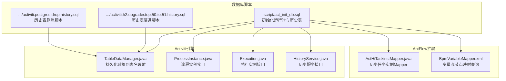
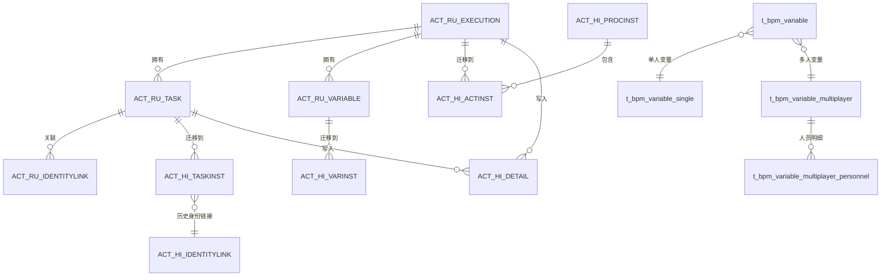
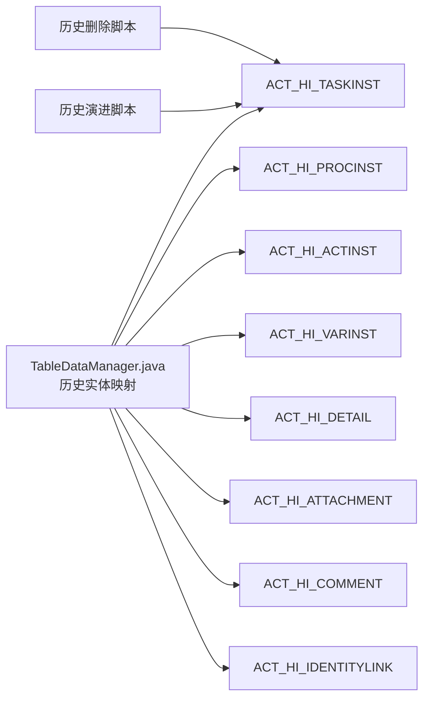
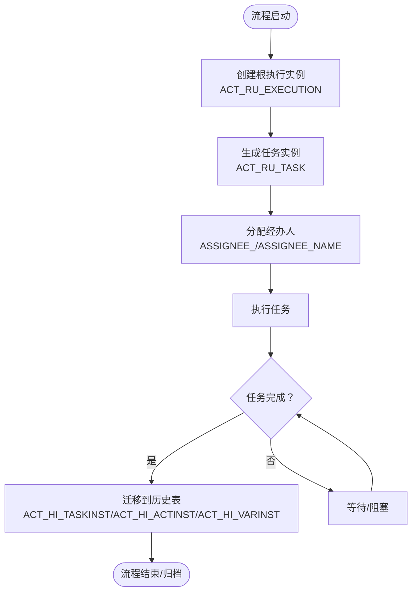

# 流程运行时表结构

<cite>
**本文引用的文件**
- [act_init_db.sql](file://script/act_init_db.sql)
- [activiti.h2.upgradestep.50.to.51.history.sql](file://antflow-base/src/main/resources/org/activiti/db/upgrade/activiti.h2.upgradestep.50.to.51.history.sql)
- [activiti.postgres.drop.history.sql](file://antflow-base/src/main/resources/org/activiti/db/drop/activiti.postgres.drop.history.sql)
- [TableDataManager.java](file://antflow-base/src/main/java/org/activiti/engine/impl/persistence/entity/TableDataManager.java)
- [ProcessInstance.java](file://antflow-base/src/main/java/org/activiti/engine/runtime/ProcessInstance.java)
- [Execution.java](file://antflow-base/src/main/java/org/activiti/engine/runtime/Execution.java)
- [HistoryService.java](file://antflow-base/src/main/java/org/activiti/engine/HistoryService.java)
- [ActHiTaskinstMapper.java](file://antflow-engine/src/main/java/org/openoa/engine/bpmnconf/mapper/ActHiTaskinstMapper.java)
- [BpmVariableMapper.xml](file://antflow-engine/src/main/resources/mapper/BpmVariableMapper.xml)
- [23.系统扩展.md](file://doc/系统介绍篇/23.系统扩展.md)
</cite>

## 目录
1. [简介](#简介)
2. [项目结构](#项目结构)
3. [核心组件](#核心组件)
4. [架构总览](#架构总览)
5. [详细组件分析](#详细组件分析)
6. [依赖分析](#依赖分析)
7. [性能考虑](#性能考虑)
8. [故障排查指南](#故障排查指南)
9. [结论](#结论)
10. [附录](#附录)

## 简介
本技术文档聚焦于AntFlow流程引擎的运行时表结构与历史表结构，系统性解析Activiti引擎运行时表与AntFlow扩展表的设计原理、字段定义、生命周期管理与性能优化策略。内容涵盖执行实例表、任务实例表、变量表、历史表等，解释运行时数据从创建、执行、完成到终止的状态流转，并给出运行时表之间的关联关系、索引优化策略、数据流向图与状态转换示例。

## 项目结构
本仓库包含AntFlow引擎核心模块与脚本资源，运行时表结构主要由初始化SQL脚本定义，同时通过Activiti引擎的实体映射与MyBatis映射文件支撑运行时查询与扩展表操作。

图表来源
- [act_init_db.sql:1-470](file://script/act_init_db.sql#L1-L470)
- [TableDataManager.java:83-104](file://antflow-base/src/main/java/org/activiti/engine/impl/persistence/entity/TableDataManager.java#L83-L104)
- [ProcessInstance.java:1-47](file://antflow-base/src/main/java/org/activiti/engine/runtime/ProcessInstance.java#L1-L47)
- [Execution.java:1-47](file://antflow-base/src/main/java/org/activiti/engine/runtime/Execution.java#L1-L47)
- [HistoryService.java:29-55](file://antflow-base/src/main/java/org/activiti/engine/HistoryService.java#L29-L55)
- [ActHiTaskinstMapper.java:1-10](file://antflow-engine/src/main/java/org/openoa/engine/bpmnconf/mapper/ActHiTaskinstMapper.java#L1-L10)
- [BpmVariableMapper.xml:1-114](file://antflow-engine/src/main/resources/mapper/BpmVariableMapper.xml#L1-L114)

章节来源
- [act_init_db.sql:1-470](file://script/act_init_db.sql#L1-L470)
- [TableDataManager.java:83-104](file://antflow-base/src/main/java/org/activiti/engine/impl/persistence/entity/TableDataManager.java#L83-L104)

## 核心组件
- 运行时表（Runtime Tables）
  - 执行实例表：ACT_RU_EXECUTION，存储当前正在执行的执行路径信息，包含父子执行关系、活动标识、挂起状态、租户等。
  - 任务实例表：ACT_RU_TASK，存储当前待办任务，包含执行/流程实例关联、任务定义键、经办人、优先级、创建时间、到期时间等。
  - 变量表：ACT_RU_VARIABLE，存储运行时变量，支持多种类型（数值、字符串、字节数组），并可关联到执行、流程实例或任务。
  - 作业表：ACT_RU_JOB，存储定时/异步任务，包含处理器类型、处理器配置、重试次数、到期时间等。
  - 身份链接表：ACT_RU_IDENTITYLINK，存储任务与用户/组的关联关系。
  - 事件订阅表：ACT_RU_EVENT_SUBSCR，存储事件订阅信息。
- 历史表（History Tables）
  - 历史流程实例表：ACT_HI_PROCINST，存储已完成或结束的历史流程实例，包含开始/结束时间、持续时间、删除原因、业务键等。
  - 历史活动实例表：ACT_HI_ACTINST，存储已完成的活动实例，包含活动类型、活动名称、开始/结束时间、持续时间、执行/流程实例关联等。
  - 历史任务实例表：ACT_HI_TASKINST，存储已完成的任务实例，包含任务定义键、经办人、分配时间、结束时间、持续时间、优先级、到期时间等。
  - 历史变量实例表：ACT_HI_VARINST，存储变量变更历史，包含变量类型、值、创建/更新时间等。
  - 历史详情表：ACT_HI_DETAIL，存储表单提交、变量更新等细节，支持按任务/执行/流程实例查询。
  - 历史附件表：ACT_HI_ATTACHMENT，存储任务/流程实例附件。
  - 历史身份链接表：ACT_HI_IDENTITYLINK，存储历史任务/流程实例的用户/组关联。
  - 历史评论表：ACT_HI_COMMENT，存储任务/流程实例评论。
  - 事件日志表：ACT_EVT_LOG，记录流程引擎事件日志，支持并发处理标记与处理状态。
- AntFlow扩展表
  - t_bpm_variable：流程变量主表，关联流程编号与变量定义。
  - t_bpm_variable_single：单人变量节点配置，记录节点元素与经办人参数名、经办人信息。
  - t_bpm_variable_multiplayer：多人变量节点配置，记录集合变量名与节点元素。
  - t_bpm_variable_multiplayer_personnel：多人变量人员明细，记录参与人员及承接状态。
  - MyBatis映射：BpmVariableMapper.xml，提供节点/元素ID与变量名的双向查询、经办人替换、多人变量人员状态重置等操作。

章节来源
- [act_init_db.sql:146-215](file://script/act_init_db.sql#L146-L215)
- [act_init_db.sql:316-458](file://script/act_init_db.sql#L316-L458)
- [BpmVariableMapper.xml:1-114](file://antflow-engine/src/main/resources/mapper/BpmVariableMapper.xml#L1-L114)

## 架构总览
下图展示运行时表与历史表在Activiti引擎中的映射关系与扩展表的交互位置。

图表来源
- [act_init_db.sql:146-215](file://script/act_init_db.sql#L146-L215)
- [act_init_db.sql:316-458](file://script/act_init_db.sql#L316-L458)
- [BpmVariableMapper.xml:77-112](file://antflow-engine/src/main/resources/mapper/BpmVariableMapper.xml#L77-L112)

## 详细组件分析

### 运行时执行实例表（ACT_RU_EXECUTION）
- 设计要点
  - 主键ID_唯一标识执行实例；PROC_INST_ID_指向流程实例根执行；PARENT_ID_与SUPER_EXEC_形成树形结构。
  - ACT_ID_标识当前活动；IS_ACTIVE_/IS_CONCURRENT_/IS_SCOPE_等布尔字段描述执行状态与作用域。
  - SUSPENSION_STATE_表示挂起状态；TENANT_ID_支持多租户；LOCK_TIME_用于并发锁定。
  - 外键约束：PROC_INST_ID_关联ACT_RU_EXECUTION(ID_)，PARENT_ID_与SUPER_EXEC_自引用。
- 索引策略
  - KEY ACT_IDX_EXEC_BUSKEY(BUSINESS_KEY_)：加速业务键查询。
  - KEY ACT_FK_EXE_PROCINST(PROC_INST_ID_)：加速流程实例根执行定位。
  - KEY ACT_FK_EXE_PARENT(PARENT_ID_)：加速父子关系遍历。
  - KEY ACT_FK_EXE_SUPER(SUPER_EXEC_)：加速子执行树定位。
  - KEY ACT_FK_EXE_PROCDEF(PROC_DEF_ID_)：加速流程定义关联。
- 生命周期
  - 创建：流程启动时生成根执行实例；并发分支时创建子执行。
  - 执行：随活动变迁更新ACT_ID_与状态字段。
  - 结束：活动完成后，执行实例可能结束或进入等待（网关/事件边界）。
  - 终止：流程取消或异常终止时清理执行树。

章节来源
- [act_init_db.sql:316-341](file://script/act_init_db.sql#L316-L341)

### 运行时任务实例表（ACT_RU_TASK）
- 设计要点
  - 主键ID_唯一标识任务；EXECUTION_ID_与PROC_INST_ID_关联执行与流程实例；PROC_DEF_ID_关联流程定义。
  - NAME_/DESCRIPTION_描述任务；TASK_DEF_KEY_对应BPMN任务定义键；ASSIGNEE_/ASSIGNEE_NAME_记录经办人。
  - PRIORITY_优先级；CREATE_TIME_创建时间；DUE_DATE_到期时间；CATEGORY_分类；FORM_KEY_表单键。
  - SUSPENSION_STATE_挂起状态；TENANT_ID_多租户；FORM_KEY_表单键。
- 索引策略
  - KEY ACT_IDX_TASK_CREATE(CREATE_TIME_)：按创建时间排序与查询。
  - KEY ACT_FK_TASK_EXE(EXECUTION_ID_)：加速执行实例关联。
  - KEY ACT_FK_TASK_PROCINST(PROC_INST_ID_)：加速流程实例关联。
  - KEY ACT_FK_TASK_PROCDEF(PROC_DEF_ID_)：加速流程定义关联。
- 生命周期
  - 创建：任务生成（用户任务/服务任务等）。
  - 分配：ASSIGNEE_赋值或委托（DELEGATION_）。
  - 办结：完成或删除，迁移到历史表ACT_HI_TASKINST。
  - 终止：流程终止或任务撤销。

章节来源
- [act_init_db.sql:363-390](file://script/act_init_db.sql#L363-L390)

### 运行时变量表（ACT_RU_VARIABLE）
- 设计要点
  - 主键ID_；TYPE_指定变量类型；NAME_变量名；EXECUTION_ID_/PROC_INST_ID_/TASK_ID_三者择一关联。
  - BYTEARRAY_ID_关联字节数组；DOUBLE_/LONG_数值型；TEXT_/TEXT2_文本型。
- 索引策略
  - KEY ACT_IDX_VARIABLE_TASK_ID(TASK_ID_)：按任务查询变量。
  - KEY ACT_FK_VAR_EXE(EXECUTION_ID_)：按执行查询变量。
  - KEY ACT_FK_VAR_PROCINST(PROC_INST_ID_)：按流程实例查询变量。
  - KEY ACT_FK_VAR_BYTEARRAY(BYTEARRAY_ID_)：按字节数组查询变量。
- 生命周期
  - 创建：变量初始化；更新：随流程推进更新值。
  - 结束：任务/流程实例结束后迁移到历史表ACT_HI_VARINST。

章节来源
- [act_init_db.sql:439-458](file://script/act_init_db.sql#L439-L458)

### 历史任务实例表（ACT_HI_TASKINST）
- 设计要点
  - 主键ID_；PROC_DEF_ID_流程定义；TASK_DEF_KEY_任务定义键；PROC_INST_ID_流程实例；EXECUTION_ID_执行。
  - NAME_/DESCRIPTION_任务描述；ASSIGNEE_/ASSIGNEE_NAME_经办人；CLAIM_TIME_认领时间；END_TIME_结束时间；DURATION_持续时间。
  - DELETE_REASON_删除原因；PRIORITY_优先级；DUE_DATE_到期时间；FORM_KEY_表单键；CATEGORY_分类；TENANT_ID_租户。
  - 索引：KEY ACT_IDX_HI_TASK_INST_PROCINST(PROC_INST_ID_)加速按流程实例查询。
- 生命周期
  - 生成：运行时任务结束或删除后写入历史。
  - 查询：HistoryService提供查询能力，支持按流程实例、任务定义键、经办人等维度检索。

章节来源
- [act_init_db.sql:168-193](file://script/act_init_db.sql#L168-L193)
- [HistoryService.java:29-55](file://antflow-base/src/main/java/org/activiti/engine/HistoryService.java#L29-L55)
- [ActHiTaskinstMapper.java:1-10](file://antflow-engine/src/main/java/org/openoa/engine/bpmnconf/mapper/ActHiTaskinstMapper.java#L1-L10)

### 历史流程实例表（ACT_HI_PROCINST）
- 设计要点
  - 主键ID_与UNIQUE KEY PROC_INST_ID_(PROC_INST_ID_)保证流程实例唯一；BUSINESS_KEY_业务键；START_TIME_/END_TIME_开始/结束时间；DURATION_持续时间。
  - START_USER_ID_开始用户；START_ACT_ID_/END_ACT_ID_开始/结束活动；SUPER_PROCESS_INSTANCE_ID_父流程实例；DELETE_REASON_删除原因；TENANT_ID_租户；NAME_名称。
  - 索引：KEY ACT_IDX_HI_PRO_INST_END(END_TIME_)、KEY ACT_IDX_HI_PRO_I_BUSKEY(BUSINESS_KEY_)。
- 生命周期
  - 生成：流程实例结束时写入历史；删除：根据删除原因区分正常结束与异常终止。

章节来源
- [act_init_db.sql:146-166](file://script/act_init_db.sql#L146-L166)

### 历史活动实例表（ACT_HI_ACTINST）
- 设计要点
  - 主键ID_；PROC_DEF_ID_流程定义；PROC_INST_ID_流程实例；EXECUTION_ID_执行；ACT_ID_活动ID；TASK_ID_任务；CALL_PROC_INST_ID_调用流程实例。
  - ACT_NAME_活动名称；ACT_TYPE_活动类型；ASSIGNEE_经办人；START_TIME_/END_TIME_开始/结束时间；DURATION_持续时间；TENANT_ID_租户。
  - 索引：KEY ACT_IDX_HI_ACT_INST_START(START_TIME_)、KEY ACT_IDX_HI_ACT_INST_END(END_TIME_)、KEY ACT_IDX_HI_ACT_INST_PROCINST(PROC_INST_ID_, ACT_ID_)、KEY ACT_IDX_HI_ACT_INST_EXEC(EXECUTION_ID_, ACT_ID_)。
- 生命周期
  - 生成：活动开始与结束事件触发写入；用于审计与报表统计。

章节来源
- [act_init_db.sql:53-74](file://script/act_init_db.sql#L53-L74)

### 历史变量实例表（ACT_HI_VARINST）
- 设计要点
  - 主键ID_；PROC_INST_ID_/EXECUTION_ID_/TASK_ID_三者择一关联；NAME_变量名；VAR_TYPE_变量类型；REV_版本；BYTEARRAY_ID_字节数组；DOUBLE_/LONG_数值；TEXT_/TEXT2_文本。
  - CREATE_TIME_/LAST_UPDATED_TIME_创建与最后更新时间。
  - 索引：KEY ACT_IDX_HI_PROCVAR_PROC_INST(PROC_INST_ID_)、KEY ACT_IDX_HI_PROCVAR_NAME_TYPE(NAME_, VAR_TYPE_)、KEY ACT_IDX_HI_PROCVAR_TASK_ID(TASK_ID_)。
- 生命周期
  - 生成：变量创建/更新时写入历史；用于审计与回溯。

章节来源
- [act_init_db.sql:195-215](file://script/act_init_db.sql#L195-L215)

### 历史详情表（ACT_HI_DETAIL）
- 设计要点
  - 主键ID_；TYPE_类型（表单属性/变量更新/任务变更等）；PROC_INST_ID_/EXECUTION_ID_/TASK_ID_/ACT_INST_ID_关联；NAME_名称；VAR_TYPE_变量类型；REV_版本；TIME_时间戳；BYTEARRAY_ID_字节数组；DOUBLE_/LONG_数值；TEXT_/TEXT2_文本。
  - 索引：KEY ACT_IDX_HI_DETAIL_PROC_INST(PROC_INST_ID_)、KEY ACT_IDX_HI_DETAIL_ACT_INST(ACT_INST_ID_)、KEY ACT_IDX_HI_DETAIL_TIME(TIME_)、KEY ACT_IDX_HI_DETAIL_NAME(NAME_)、KEY ACT_IDX_HI_DETAIL_TASK_ID(TASK_ID_)。
- 生命周期
  - 生成：表单提交、变量更新、任务变更等事件写入；用于审计追踪。

章节来源
- [act_init_db.sql:106-129](file://script/act_init_db.sql#L106-L129)

### AntFlow扩展表与映射
- 表结构
  - t_bpm_variable：流程变量主表，关联流程编号与变量定义。
  - t_bpm_variable_single：单人变量节点配置，记录节点元素与经办人参数名、经办人信息。
  - t_bpm_variable_multiplayer：多人变量节点配置，记录集合变量名与节点元素。
  - t_bpm_variable_multiplayer_personnel：多人变量人员明细，记录参与人员及承接状态。
- 映射与查询
  - BpmVariableMapper.xml提供：
    - 节点/元素ID与变量名的双向查询。
    - 经办人替换（单人/多人）。
    - 多人变量人员状态重置与无效化。
    - 节点/元素维度的变量详情聚合查询。
- 生命周期
  - 创建：流程配置与变量定义；执行：随流程推进更新经办人与状态；结束：迁移到历史表或归档。

章节来源
- [BpmVariableMapper.xml:1-114](file://antflow-engine/src/main/resources/mapper/BpmVariableMapper.xml#L1-L114)

## 依赖分析
- Activiti实体到表名映射
  - TableDataManager.java中定义了历史持久化对象与表名的映射关系，包括历史流程实例、活动实例、变量实例、任务实例、附件、评论、身份链接等，确保历史数据落库的准确性。
- 历史表演进与删除
  - 历史表演进脚本定义了历史表的结构演进（如新增字段、表结构调整）。
  - 历史表删除脚本定义了PostgreSQL下的删除顺序，避免外键约束导致的删除失败。
- 运行时与历史表的耦合
  - 运行时表（ACT_RU_*）与历史表（ACT_HI_*）通过事件驱动的方式进行数据迁移，确保运行时性能与历史查询能力的分离。

图表来源
- [TableDataManager.java:83-104](file://antflow-base/src/main/java/org/activiti/engine/impl/persistence/entity/TableDataManager.java#L83-L104)
- [activiti.h2.upgradestep.50.to.51.history.sql:1-18](file://antflow-base/src/main/resources/org/activiti/db/upgrade/activiti.h2.upgradestep.50.to.51.history.sql#L1-L18)
- [activiti.postgres.drop.history.sql:1-8](file://antflow-base/src/main/resources/org/activiti/db/drop/activiti.postgres.drop.history.sql#L1-L8)

章节来源
- [TableDataManager.java:83-104](file://antflow-base/src/main/java/org/activiti/engine/impl/persistence/entity/TableDataManager.java#L83-L104)
- [activiti.h2.upgradestep.50.to.51.history.sql:1-18](file://antflow-base/src/main/resources/org/activiti/db/upgrade/activiti.h2.upgradestep.50.to.51.history.sql#L1-L18)
- [activiti.postgres.drop.history.sql:1-8](file://antflow-base/src/main/resources/org/activiti/db/drop/activiti.postgres.drop.history.sql#L1-L8)

## 性能考虑
- 索引优化
  - 历史表广泛使用复合索引与单列索引，如ACT_HI_ACTINST的开始/结束时间索引、ACT_HI_TASKINST的流程实例索引、ACT_HI_VARINST的流程实例+变量名索引等，显著提升查询效率。
  - 运行时表的关键索引（如ACT_RU_TASK的创建时间、ACT_RU_VARIABLE的任务ID）有助于实时任务与变量查询。
- 数据分区与归档
  - 建议对历史表按时间分区或定期归档，减少查询扫描范围。
- 并发与锁
  - ACT_EVT_LOG提供LOCK_OWNER_/LOCK_TIME_/IS_PROCESSED_字段，支持事件日志的并发处理与去重。
- 查询优化
  - 使用HistoryService提供的查询接口与BpmVariableMapper的聚合查询，避免全表扫描。
- 扩展点与插件
  - 参考扩展文档，通过适配器与工厂模式扩展流程行为，减少对核心表结构的侵入式改动。

章节来源
- [act_init_db.sql:53-74](file://script/act_init_db.sql#L53-L74)
- [act_init_db.sql:106-129](file://script/act_init_db.sql#L106-L129)
- [act_init_db.sql:146-166](file://script/act_init_db.sql#L146-L166)
- [act_init_db.sql:168-193](file://script/act_init_db.sql#L168-L193)
- [act_init_db.sql:195-215](file://script/act_init_db.sql#L195-L215)
- [23.系统扩展.md:17-66](file://doc/系统介绍篇/23.系统扩展.md#L17-L66)

## 故障排查指南
- 历史表缺失或结构不一致
  - 检查历史表演进脚本是否执行，确认目标数据库方言与脚本匹配。
  - 使用历史表删除脚本清理后再重建，避免外键约束冲突。
- 任务/变量查询慢
  - 确认相关索引是否存在且未被破坏；必要时重建索引。
  - 对高频查询字段（如流程实例ID、任务ID、变量名）进行查询计划分析。
- 事件日志堆积
  - 检查ACT_EVT_LOG的LOCK_TIME_/IS_PROCESSED_状态，清理长时间未处理的日志条目。
- 经办人替换失败
  - 检查BpmVariableMapper的经办人替换SQL是否正确传参；核对t_bpm_variable_*表的数据完整性。

章节来源
- [activiti.postgres.drop.history.sql:1-8](file://antflow-base/src/main/resources/org/activiti/db/drop/activiti.postgres.drop.history.sql#L1-L8)
- [BpmVariableMapper.xml:27-75](file://antflow-engine/src/main/resources/mapper/BpmVariableMapper.xml#L27-L75)

## 结论
本文系统梳理了AntFlow运行时表与历史表的结构设计、字段定义与生命周期管理，明确了运行时表与历史表之间的映射关系与迁移机制，并提供了索引优化与性能建议。结合AntFlow扩展表与MyBatis映射，可实现灵活的变量与节点配置管理。建议在生产环境中配合分区/归档策略与监控告警，保障历史数据的可查询性与系统整体性能。

## 附录
- 运行时数据流向图（概念示意）

- 状态转换示例（流程实例）
  - 创建：流程部署后，根执行实例生成。
  - 执行：随活动变迁，执行实例ACT_ID_更新。
  - 结束：所有活动完成，流程实例写入ACT_HI_PROCINST。
  - 终止：异常或取消，删除原因写入ACT_HI_PROCINST.DELETE_REASON_。

章节来源
- [ProcessInstance.java:21-47](file://antflow-base/src/main/java/org/activiti/engine/runtime/ProcessInstance.java#L21-L47)
- [Execution.java:17-47](file://antflow-base/src/main/java/org/activiti/engine/runtime/Execution.java#L17-L47)
- [act_init_db.sql:146-166](file://script/act_init_db.sql#L146-L166)