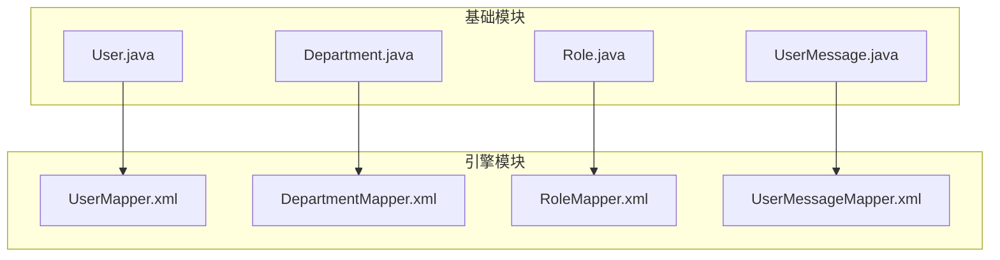
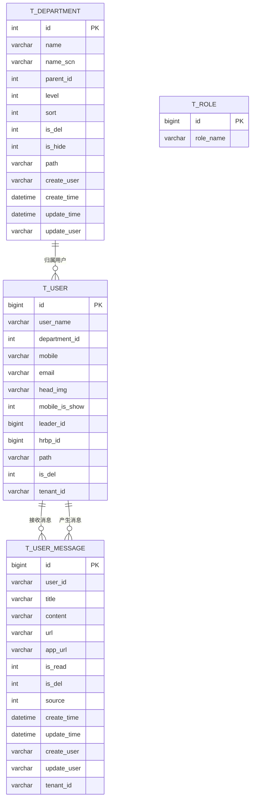
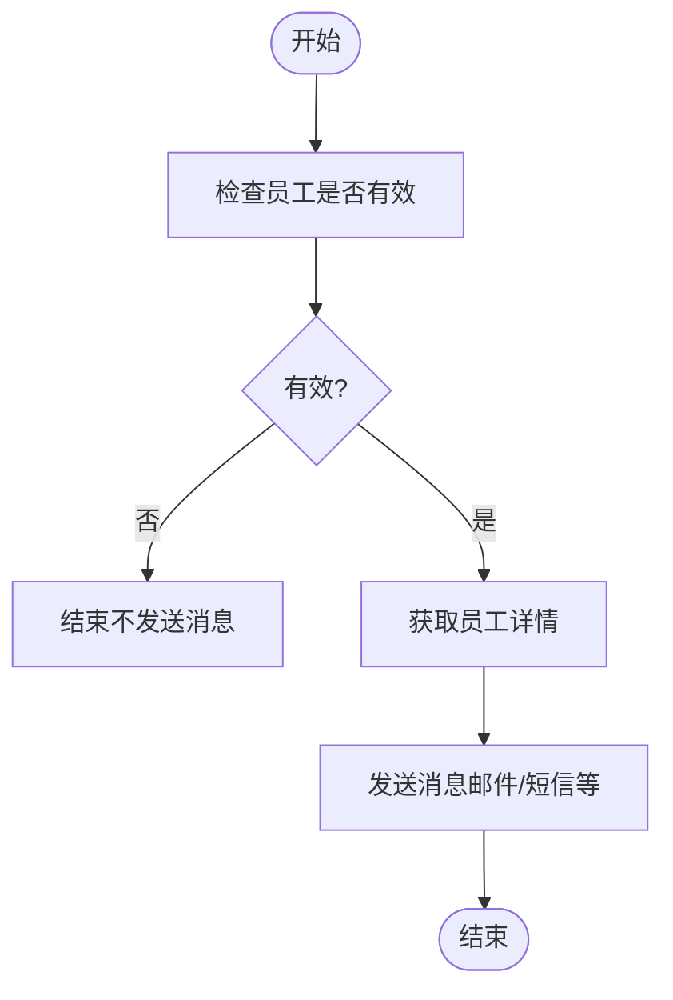
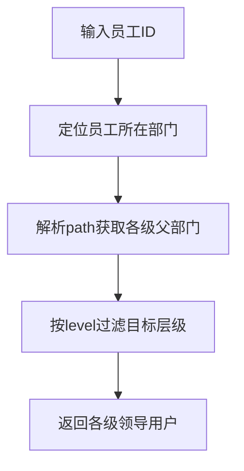
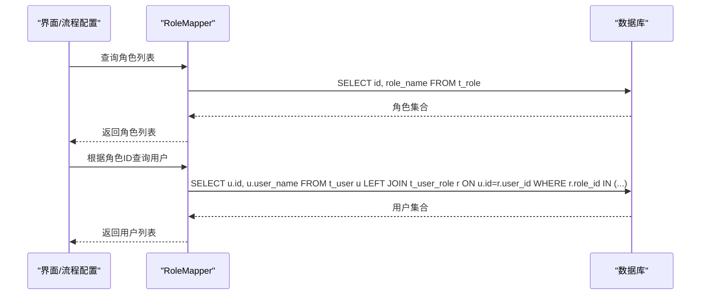
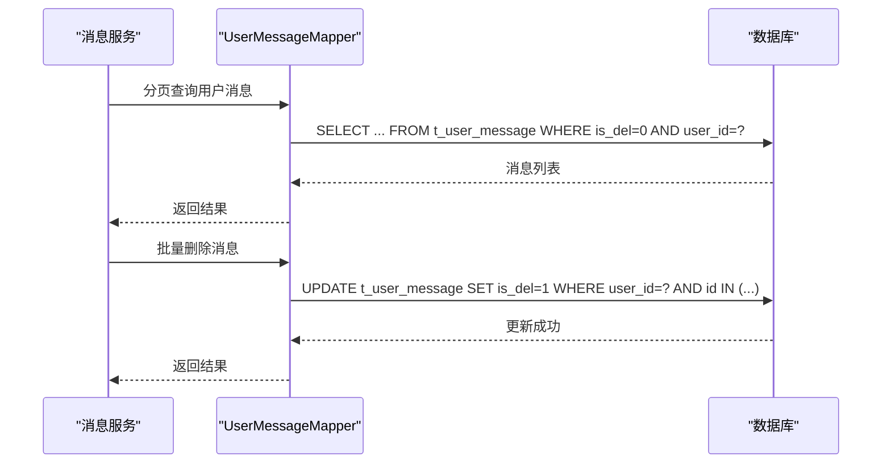

# 用户管理表结构

<cite>
**本文引用的文件**
- [User.java](file://antflow-base/src/main/java/org/openoa/base/entity/User.java)
- [Department.java](file://antflow-base/src/main/java/org/openoa/base/entity/Department.java)
- [Role.java](file://antflow-base/src/main/java/org/openoa/base/entity/Role.java)
- [UserMessage.java](file://antflow-base/src/main/java/org/openoa/base/entity/UserMessage.java)
- [UserMapper.xml](file://antflow-engine/src/main/resources/mapper/UserMapper.xml)
- [DepartmentMapper.xml](file://antflow-engine/src/main/resources/mapper/DepartmentMapper.xml)
- [RoleMapper.xml](file://antflow-engine/src/main/resources/mapper/RoleMapper.xml)
- [UserMessageMapper.xml](file://antflow-engine/src/main/resources/mapper/UserMessageMapper.xml)
</cite>

## 目录
1. [简介](#简介)
2. [项目结构](#项目结构)
3. [核心组件](#核心组件)
4. [架构总览](#架构总览)
5. [详细组件分析](#详细组件分析)
6. [依赖分析](#依赖分析)
7. [性能考虑](#性能考虑)
8. [故障排除指南](#故障排除指南)
9. [结论](#结论)
10. [附录](#附录)

## 简介
本文件聚焦于用户管理相关的数据模型与表结构，涵盖用户表、部门表、角色表、用户消息表等核心实体，以及它们之间的关联关系、权限控制机制、组织架构关系、身份认证信息承载方式、与流程任务的关联（审批人分配、委托处理、消息通知）等。文档以仓库中的实体类与MyBatis映射文件为依据，提供数据模型图与权限控制示例，帮助读者快速理解并正确扩展或集成。

## 项目结构
用户管理相关的核心代码分布在以下位置：
- 实体类：位于基础模块的实体包中，定义了用户、部门、角色、用户消息等核心表的Java对象模型
- 映射文件：位于引擎模块的resources/mapper目录下，定义了用户、部门、角色、用户消息等表的SQL查询与更新逻辑



**图表来源**
- [User.java:1-17](file://antflow-base/src/main/java/org/openoa/base/entity/User.java#L1-L17)
- [Department.java:1-72](file://antflow-base/src/main/java/org/openoa/base/entity/Department.java#L1-L72)
- [Role.java:1-21](file://antflow-base/src/main/java/org/openoa/base/entity/Role.java#L1-L21)
- [UserMessage.java:1-90](file://antflow-base/src/main/java/org/openoa/base/entity/UserMessage.java#L1-L90)
- [UserMapper.xml:1-217](file://antflow-engine/src/main/resources/mapper/UserMapper.xml#L1-L217)
- [DepartmentMapper.xml:1-21](file://antflow-engine/src/main/resources/mapper/DepartmentMapper.xml#L1-L21)
- [RoleMapper.xml:1-34](file://antflow-engine/src/main/resources/mapper/RoleMapper.xml#L1-L34)
- [UserMessageMapper.xml:1-66](file://antflow-engine/src/main/resources/mapper/UserMessageMapper.xml#L1-L66)

**章节来源**
- [User.java:1-17](file://antflow-base/src/main/java/org/openoa/base/entity/User.java#L1-L17)
- [Department.java:1-72](file://antflow-base/src/main/java/org/openoa/base/entity/Department.java#L1-L72)
- [Role.java:1-21](file://antflow-base/src/main/java/org/openoa/base/entity/Role.java#L1-L21)
- [UserMessage.java:1-90](file://antflow-base/src/main/java/org/openoa/base/entity/UserMessage.java#L1-L90)
- [UserMapper.xml:1-217](file://antflow-engine/src/main/resources/mapper/UserMapper.xml#L1-L217)
- [DepartmentMapper.xml:1-21](file://antflow-engine/src/main/resources/mapper/DepartmentMapper.xml#L1-L21)
- [RoleMapper.xml:1-34](file://antflow-engine/src/main/resources/mapper/RoleMapper.xml#L1-L34)
- [UserMessageMapper.xml:1-66](file://antflow-engine/src/main/resources/mapper/UserMessageMapper.xml#L1-L66)

## 核心组件
本节对用户管理涉及的核心表进行逐项解析，包括表名、主键、核心字段、约束与用途，并说明其在权限与流程中的作用。

- 用户表（t_user）
  - 主要字段：id、user_name（用户名）、department_id（所属部门）、mobile（手机号）、email（邮箱）、head_img（头像）、mobile_is_show（手机号可见性）、leader_id（直属领导）、hrbp_id（HRBP）、path（部门路径）、is_del（删除标记）、tenant_id（租户标识，多租户场景）
  - 关联关系：与部门表通过department_id建立组织架构关系；与用户角色表通过中间表关联实现角色授权；与用户消息表通过user_id关联实现消息通知
  - 用途：承载用户身份信息与组织关系，支撑审批人查找、消息通知、权限继承等

- 部门表（t_department）
  - 主要字段：id、name（部门全称）、name_scn（简称）、parent_id（父部门ID）、level（层级）、sort（排序）、is_del（删除标记）、is_hide（隐藏标记）、path（部门路径，用于层级查询与审批链生成）、create_user/update_user/create_time/update_time
  - 关联关系：自关联（parent_id指向自身），形成树形组织架构；与用户表通过department_id关联
  - 用途：维护组织架构，支持按层级查找领导、生成多级审批链

- 角色表（t_role）
  - 主要字段：id、role_name（角色名称）
  - 关联关系：与用户表通过中间表（t_user_role）关联，实现用户-角色多对多关系
  - 用途：权限控制的基础单元，配合流程节点配置实现审批人与经办人角色化

- 用户消息表（t_user_message）
  - 主要字段：id、user_id（接收用户）、title（标题）、content（内容）、url（跳转链接）、app_url（应用链接）、is_read（是否已读）、is_del（删除标记）、source（消息来源）、create_time/update_time/create_user/update_user、tenant_id
  - 关联关系：与用户表通过user_id关联
  - 用途：流程任务状态变更、待办提醒、抄送通知等消息推送

**章节来源**
- [User.java:1-17](file://antflow-base/src/main/java/org/openoa/base/entity/User.java#L1-L17)
- [Department.java:1-72](file://antflow-base/src/main/java/org/openoa/base/entity/Department.java#L1-L72)
- [Role.java:1-21](file://antflow-base/src/main/java/org/openoa/base/entity/Role.java#L1-L21)
- [UserMessage.java:1-90](file://antflow-base/src/main/java/org/openoa/base/entity/UserMessage.java#L1-L90)

## 架构总览
用户管理数据模型围绕“用户-部门-角色-消息”四张核心表展开，通过MyBatis映射文件提供查询与更新能力，支撑流程引擎中的审批人分配、委托处理、消息通知等功能。



**图表来源**
- [User.java:1-17](file://antflow-base/src/main/java/org/openoa/base/entity/User.java#L1-L17)
- [Department.java:1-72](file://antflow-base/src/main/java/org/openoa/base/entity/Department.java#L1-L72)
- [Role.java:1-21](file://antflow-base/src/main/java/org/openoa/base/entity/Role.java#L1-L21)
- [UserMessage.java:1-90](file://antflow-base/src/main/java/org/openoa/base/entity/UserMessage.java#L1-L90)

## 详细组件分析

### 用户表（t_user）分析
- 设计要点
  - 使用自增主键id，便于快速定位用户
  - department_id与leader_id分别指向部门与上级领导，支撑组织架构与汇报关系
  - hrbp_id用于HRBP关联，便于HR相关流程审批
  - path字段用于快速计算层级与审批链，避免递归查询
  - is_del用于软删除，tenant_id支持多租户隔离
- 查询与更新能力
  - 支持按用户名模糊查询、按ID集合批量查询
  - 支持获取员工详情（含手机号、邮箱、头像等），用于消息通知
  - 提供检查员工有效性接口，防止向离职人员发送消息
  - 支持按层级查找领导、按HRBP查找审批人、按直属领导查找等
  - 支持分页查询与按角色筛选用户列表



**图表来源**
- [UserMapper.xml:76-83](file://antflow-engine/src/main/resources/mapper/UserMapper.xml#L76-L83)
- [UserMapper.xml:55-74](file://antflow-engine/src/main/resources/mapper/UserMapper.xml#L55-L74)

**章节来源**
- [User.java:1-17](file://antflow-base/src/main/java/org/openoa/base/entity/User.java#L1-L17)
- [UserMapper.xml:1-217](file://antflow-engine/src/main/resources/mapper/UserMapper.xml#L1-L217)

### 部门表（t_department）分析
- 设计要点
  - 自关联结构（parent_id），形成树形组织架构
  - path字段存储部门路径，便于按层级快速检索
  - level与sort用于层级与排序控制
  - is_hide用于隐藏部门，不影响数据完整性
- 查询与更新能力
  - 支持按员工ID获取部门信息
  - 支持按员工ID获取下属部门列表
  - 与用户表配合，支撑多级审批链生成



**图表来源**
- [DepartmentMapper.xml:1-21](file://antflow-engine/src/main/resources/mapper/DepartmentMapper.xml#L1-L21)
- [UserMapper.xml:87-107](file://antflow-engine/src/main/resources/mapper/UserMapper.xml#L87-L107)

**章节来源**
- [Department.java:1-72](file://antflow-base/src/main/java/org/openoa/base/entity/Department.java#L1-L72)
- [DepartmentMapper.xml:1-21](file://antflow-engine/src/main/resources/mapper/DepartmentMapper.xml#L1-L21)
- [UserMapper.xml:87-107](file://antflow-engine/src/main/resources/mapper/UserMapper.xml#L87-L107)

### 角色表（t_role）分析
- 设计要点
  - 角色名称唯一性由业务保障，便于流程节点角色化配置
- 查询与更新能力
  - 支持按ID集合批量查询角色
  - 支持按角色ID查询拥有该角色的用户列表
  - 支持查询全部角色，用于界面选择



**图表来源**
- [RoleMapper.xml:1-34](file://antflow-engine/src/main/resources/mapper/RoleMapper.xml#L1-L34)

**章节来源**
- [Role.java:1-21](file://antflow-base/src/main/java/org/openoa/base/entity/Role.java#L1-L21)
- [RoleMapper.xml:1-34](file://antflow-engine/src/main/resources/mapper/RoleMapper.xml#L1-L34)

### 用户消息表（t_user_message）分析
- 设计要点
  - user_id关联接收用户，is_read与is_del用于消息状态管理
  - app_url与url用于不同入口跳转
  - source用于区分消息来源（如流程、公告、系统通知等）
  - tenant_id支持多租户隔离
- 查询与更新能力
  - 分页查询用户消息列表
  - 批量删除消息（软删除）
  - 清理已读消息
  - 按时间清理历史消息



**图表来源**
- [UserMessageMapper.xml:28-50](file://antflow-engine/src/main/resources/mapper/UserMessageMapper.xml#L28-L50)

**章节来源**
- [UserMessage.java:1-90](file://antflow-base/src/main/java/org/openoa/base/entity/UserMessage.java#L1-L90)
- [UserMessageMapper.xml:1-66](file://antflow-engine/src/main/resources/mapper/UserMessageMapper.xml#L1-L66)

## 依赖分析
用户管理相关表之间的依赖关系如下：
- 用户表依赖部门表（组织架构）、角色表（权限）、消息表（通知）
- 部门表自关联（树形结构），与用户表存在一对多关系
- 角色表通过中间表与用户表建立多对多关系
- 消息表依赖用户表（接收者）

```mermaid
graph LR
DEPT["t_department"] --> |department_id| USER["t_user"]
LEAD["t_user(上级)"] -.->|leader_id| USER
HRBP["t_user(HRBP)"] -.->|hrbp_id| USER
ROLE["t_role"] <- --> |t_user_role| USER
USER --> |user_id| MSG["t_user_message"]
```

**图表来源**
- [UserMapper.xml:133-144](file://antflow-engine/src/main/resources/mapper/UserMapper.xml#L133-L144)
- [RoleMapper.xml:16-28](file://antflow-engine/src/main/resources/mapper/RoleMapper.xml#L16-L28)
- [UserMessageMapper.xml:28-34](file://antflow-engine/src/main/resources/mapper/UserMessageMapper.xml#L28-L34)

**章节来源**
- [UserMapper.xml:133-144](file://antflow-engine/src/main/resources/mapper/UserMapper.xml#L133-L144)
- [RoleMapper.xml:16-28](file://antflow-engine/src/main/resources/mapper/RoleMapper.xml#L16-L28)
- [UserMessageMapper.xml:28-34](file://antflow-engine/src/main/resources/mapper/UserMessageMapper.xml#L28-L34)

## 性能考虑
- 索引建议
  - 用户表：id、user_name、department_id、leader_id、hrbp_id、tenant_id
  - 部门表：id、parent_id、level、path
  - 角色表：id、role_name
  - 用户消息表：user_id、is_del、is_read、create_time
- 查询优化
  - 使用path字段进行层级查询，避免深度递归
  - 批量查询时使用IN子句，减少网络往返
  - 分页查询时限制返回列，仅选择必要字段
- 写入优化
  - 批量删除采用软删除（is_del），避免物理删除带来的锁竞争
  - 定期清理历史消息，控制表规模

## 故障排除指南
- 常见问题
  - 消息发送给无效用户：通过检查员工有效性接口确认用户状态
  - 审批人为空：检查用户是否正确归属部门、是否存在HRBP或直属领导
  - 多级审批链异常：核对部门path与level字段是否正确维护
- 排查步骤
  - 确认用户表中department_id与leader_id是否正确
  - 检查部门表path与level是否与组织架构一致
  - 验证角色与用户的关系是否符合预期
  - 查看消息表的is_del与is_read状态，确保未误删或误标

**章节来源**
- [UserMapper.xml:76-83](file://antflow-engine/src/main/resources/mapper/UserMapper.xml#L76-L83)
- [UserMapper.xml:87-107](file://antflow-engine/src/main/resources/mapper/UserMapper.xml#L87-L107)
- [UserMessageMapper.xml:36-50](file://antflow-engine/src/main/resources/mapper/UserMessageMapper.xml#L36-L50)

## 结论
本文基于仓库中的实体与映射文件，系统梳理了用户管理的核心表结构与关联关系，明确了组织架构、角色权限、消息通知与流程任务之间的衔接机制。通过合理设计索引、优化查询与定期清理历史数据，可有效提升系统性能与稳定性。建议在生产环境中结合业务需求对表结构进行适配与扩展，确保满足多租户、合规审计与高并发场景下的要求。

## 附录
- 字段命名规范
  - 表名统一使用小写下划线风格（如t_user、t_department）
  - 字段名遵循小写下划线风格，布尔型使用is_xxx或has_xxx
  - 时间戳字段统一使用create_time、update_time
- 安全控制措施
  - 多租户隔离：通过tenant_id字段区分租户数据
  - 软删除：通过is_del字段实现逻辑删除，保留审计轨迹
  - 消息有效性校验：发送前检查员工有效性，避免向离职人员发送消息