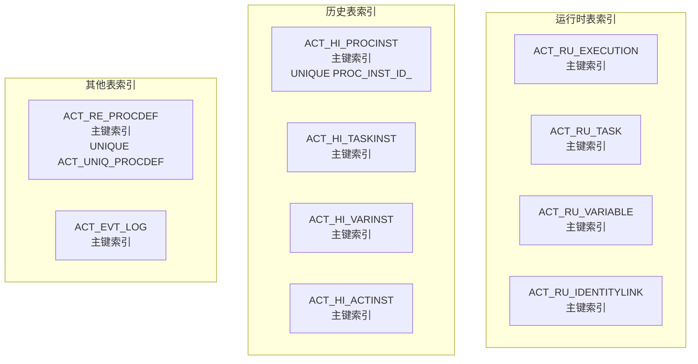
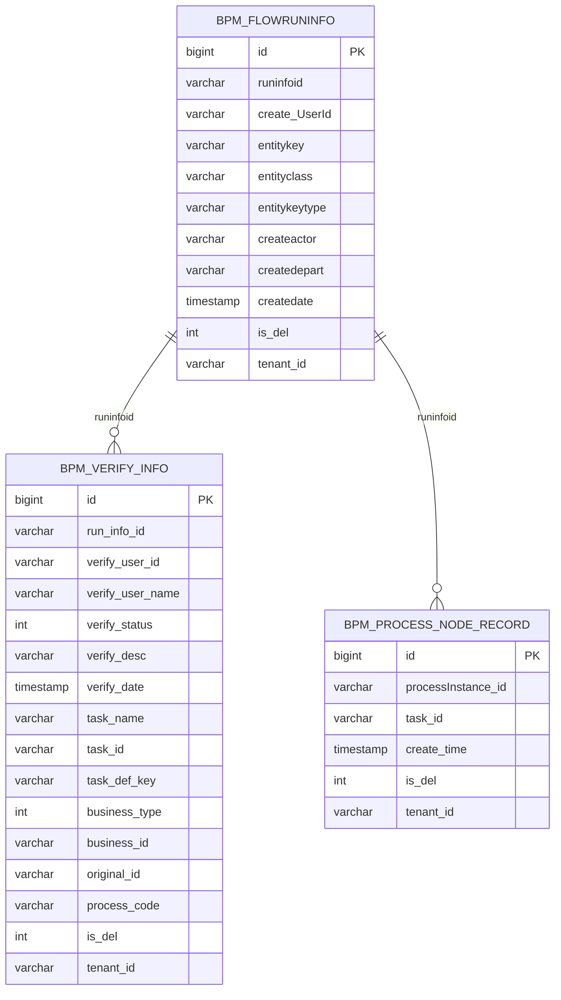
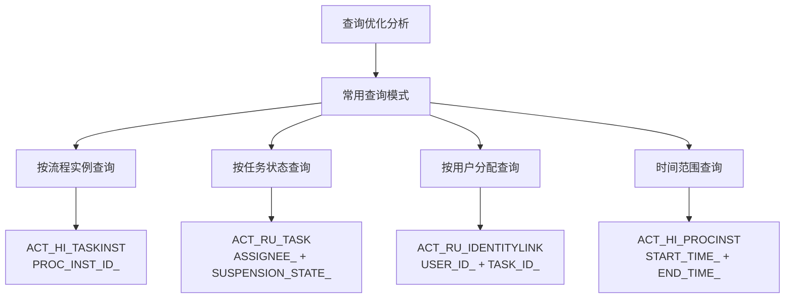
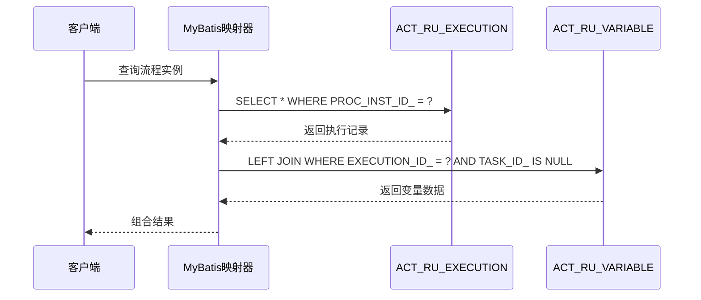
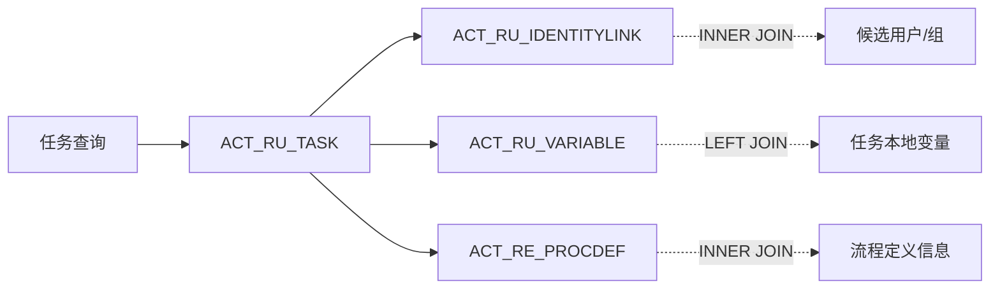
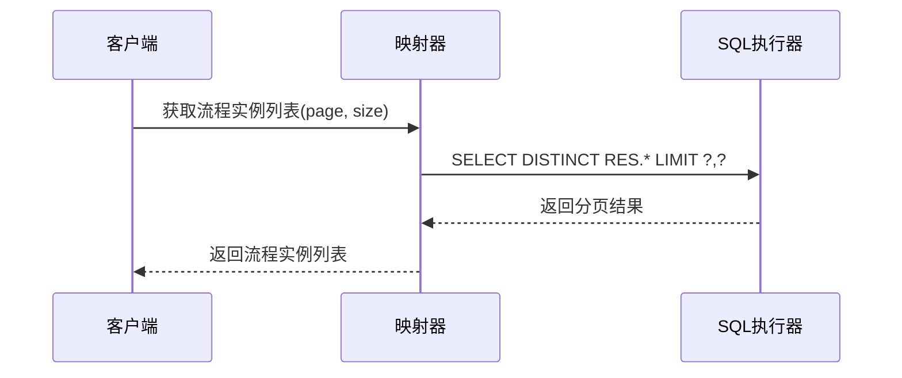
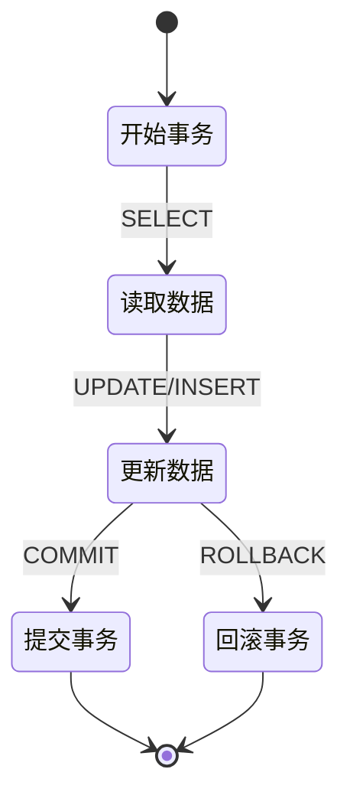
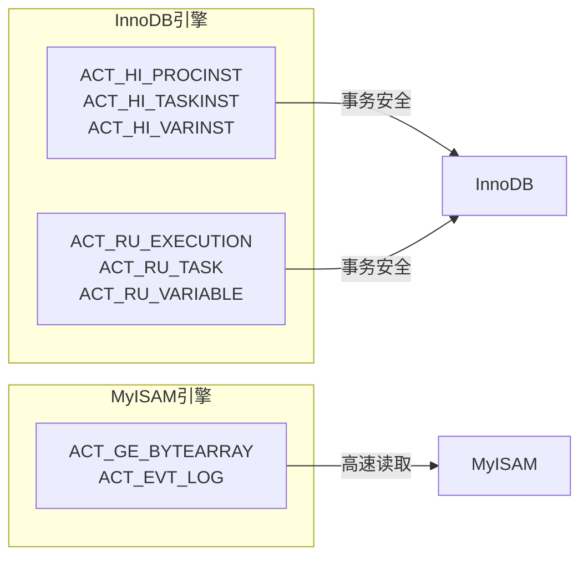

# 索引策略与性能优化

<cite>
**本文档引用的文件**
- [act_init_db.sql](file://script/act_init_db.sql)
- [bpm_init_db.sql](file://script/bpm_init_db.sql)
- [bpm_init_db_data.sql](file://script/bpm_init_db_data.sql)
- [Execution.xml](file://antflow-base/src/main/resources/org/activiti/db/mapping/entity/Execution.xml)
- [Task.xml](file://antflow-base/src/main/resources/org/activiti/db/mapping/entity/Task.xml)
- [ProcessDefinition.xml](file://antflow-base/src/main/resources/org/activiti/db/mapping/entity/ProcessDefinition.xml)
- [IdentityLink.xml](file://antflow-base/src/main/resources/org/activiti/db/mapping/entity/IdentityLink.xml)
- [VariableInstance.xml](file://antflow-base/src/main/resources/org/activiti/db/mapping/entity/VariableInstance.xml)
- [HistoricProcessInstance.xml](file://antflow-base/src/main/resources/org/activiti/db/mapping/entity/HistoricProcessInstance.xml)
</cite>

## 目录
1. [项目概述](#项目概述)
2. [数据库索引现状分析](#数据库索引现状分析)
3. [核心表索引设计原则](#核心表索引设计原则)
4. [查询性能优化策略](#查询性能优化策略)
5. [分页查询优化](#分页查询优化)
6. [批量操作优化](#批量操作优化)
7. [事务性能优化](#事务性能优化)
8. [索引维护策略](#索引维护策略)
9. [性能监控与调优案例](#性能监控与调优案例)
10. [总结与最佳实践](#总结与最佳实践)

## 项目概述

AntFlow是一个基于Activiti工作流引擎的企业级流程管理系统。该系统通过MySQL数据库存储流程实例、任务、变量等核心数据，采用MyBatis框架进行数据访问层开发。

系统主要包含两大数据库：
- **Activiti引擎数据库**：存储流程引擎运行时和历史数据
- **业务数据库**：存储流程配置、审批记录等业务数据

## 数据库索引现状分析

### Activiti引擎数据库索引分析

通过对Activiti标准表结构的分析，发现以下索引特点：



**图表来源**
- [act_init_db.sql:1-470](file://script/act_init_db.sql#L1-L470)

### 业务数据库索引分析

业务表结构显示了针对流程管理的专门优化：



**图表来源**
- [bpm_init_db.sql:261-790](file://script/bpm_init_db.sql#L261-L790)

**章节来源**
- [act_init_db.sql:1-470](file://script/act_init_db.sql#L1-L470)
- [bpm_init_db.sql:1-800](file://script/bpm_init_db.sql#L1-L800)

## 核心表索引设计原则

### 主键索引设计

所有核心表均采用自增主键设计，确保：
- **唯一性保证**：每个表都有明确的主键标识
- **聚簇索引优化**：InnoDB存储引擎下主键即聚簇索引
- **插入性能**：自增主键避免了页分裂问题

### 唯一索引设计

关键唯一约束包括：
- `PROC_INST_ID_` 唯一索引：确保流程实例ID的唯一性
- `ACT_UNIQ_PROCDEF` 唯一索引：防止重复的流程定义
- `ASSIGNEE_NAME` 索引：优化任务分配查询

### 复合索引设计

针对常见查询模式设计复合索引：



**图表来源**
- [HistoricProcessInstance.xml:228-245](file://antflow-base/src/main/resources/org/activiti/db/mapping/entity/HistoricProcessInstance.xml#L228-L245)
- [Task.xml:261-273](file://antflow-base/src/main/resources/org/activiti/db/mapping/entity/Task.xml#L261-L273)

**章节来源**
- [act_init_db.sql:146-166](file://script/act_init_db.sql#L146-L166)
- [bpm_init_db.sql:764-789](file://script/bpm_init_db.sql#L764-L789)

## 查询性能优化策略

### 索引使用模式优化

基于MyBatis查询映射分析，识别出以下优化模式：

#### 1. 运行时执行查询优化



**图表来源**
- [Execution.xml:328-380](file://antflow-base/src/main/resources/org/activiti/db/mapping/entity/Execution.xml#L328-L380)

#### 2. 任务查询优化

针对任务查询的多表连接模式：



**图表来源**
- [Task.xml:275-278](file://antflow-base/src/main/resources/org/activiti/db/mapping/entity/Task.xml#L275-L278)

### 查询计划分析

通过分析MyBatis映射文件中的SQL语句，识别潜在的性能瓶颈：

#### 1. 变量查询优化

```sql
-- 当前查询模式
SELECT * FROM ACT_RU_VARIABLE 
WHERE EXECUTION_ID_ = ? AND TASK_ID_ IS NULL

-- 优化建议
SELECT ID_, NAME_, TYPE_, TEXT_, LONG_, DOUBLE_
FROM ACT_RU_VARIABLE 
WHERE EXECUTION_ID_ = ? AND TASK_ID_ IS NULL
```

#### 2. 任务变量关联查询

```sql
-- 复杂查询模式
SELECT DISTINCT T.*, I.*, V.*
FROM ACT_RU_TASK T
LEFT JOIN ACT_RU_IDENTITYLINK I ON T.ID_ = I.TASK_ID_
LEFT JOIN ACT_RU_VARIABLE V ON T.ID_ = V.TASK_ID_
WHERE T.ASSIGNEE_ = ?
```

**章节来源**
- [Execution.xml:295-320](file://antflow-base/src/main/resources/org/activiti/db/mapping/entity/Execution.xml#L295-L320)
- [Task.xml:261-273](file://antflow-base/src/main/resources/org/activiti/db/mapping/entity/Task.xml#L261-L273)

## 分页查询优化

### 分页查询模式识别

系统中存在多种分页查询场景：

#### 1. 流程实例分页查询



#### 2. 任务分页查询

针对任务查询的分页优化：
- 使用 `LIMIT ? OFFSET ?` 模式
- 优化排序字段选择
- 避免 `SELECT *` 使用具体字段

### 分页查询优化策略

#### 1. 覆盖索引优化

为分页查询建立覆盖索引：
- `ACT_HI_PROCINST(PROC_INST_ID_, START_TIME_, END_TIME_)`
- `ACT_RU_TASK(CREATE_TIME_, ASSIGNEE_, PROC_INST_ID_)`

#### 2. 延迟加载优化

```sql
-- 优化前：一次性加载所有字段
SELECT * FROM ACT_HI_PROCINST WHERE PROC_DEF_ID_ = ?

-- 优化后：只选择需要的字段
SELECT ID_, PROC_INST_ID_, START_TIME_, END_TIME_, DURATION_
FROM ACT_HI_PROCINST 
WHERE PROC_DEF_ID_ = ?
```

**章节来源**
- [HistoricProcessInstance.xml:228-245](file://antflow-base/src/main/resources/org/activiti/db/mapping/entity/HistoricProcessInstance.xml#L228-L245)
- [Task.xml:261-273](file://antflow-base/src/main/resources/org/activiti/db/mapping/entity/Task.xml#L261-L273)

## 批量操作优化

### 批量插入优化

系统提供了多种批量操作支持：

#### 1. 批量执行插入

```xml
<insert id="bulkInsertExecution" parameterType="java.util.List">
    INSERT INTO ACT_RU_EXECUTION (...) VALUES 
      <foreach collection="list" item="execution" index="index" separator=",">
        (#{execution.id}, #{execution.processInstanceId}, ...)
      </foreach>
</insert>
```

#### 2. 批量任务插入

针对不同数据库的优化：
- **MySQL**: 使用 `INSERT INTO ... VALUES (...), (...)` 模式
- **Oracle**: 使用 `INSERT ALL INTO ... VALUES (...) SELECT * FROM dual` 模式

### 批量操作性能优化

#### 1. 事务批量处理

```sql
-- 批量插入优化
SET autocommit = 0;
INSERT INTO ACT_RU_EXECUTION VALUES (...);
INSERT INTO ACT_RU_EXECUTION VALUES (...);
COMMIT;
```

#### 2. 批量删除优化

```sql
-- 使用IN子句优化批量删除
DELETE FROM ACT_RU_VARIABLE 
WHERE ID_ IN (?, ?, ?, ?, ?)
```

**章节来源**
- [Execution.xml:31-77](file://antflow-base/src/main/resources/org/activiti/db/mapping/entity/Execution.xml#L31-L77)
- [VariableInstance.xml:31-72](file://antflow-base/src/main/resources/org/activiti/db/mapping/entity/VariableInstance.xml#L31-L72)

## 事务性能优化

### 事务隔离级别优化

系统事务特性分析：

#### 1. 长事务风险控制



#### 2. 事务超时设置

针对长流程实例的事务优化：
- 设置合理的事务超时时间
- 避免长时间持有锁
- 使用乐观锁机制

### 事务性能监控

#### 1. 锁等待监控

```sql
-- 监控锁等待情况
SHOW ENGINE INNODB STATUS;
```

#### 2. 事务日志优化

```sql
-- 优化事务日志性能
SET GLOBAL innodb_flush_log_at_trx_commit = 2;
```

**章节来源**
- [Execution.xml:133-146](file://antflow-base/src/main/resources/org/activiti/db/mapping/entity/Execution.xml#L133-L146)

## 索引维护策略

### 统计信息更新

定期更新表统计信息以优化查询计划：

```sql
-- 更新表统计信息
ANALYZE TABLE ACT_HI_PROCINST;
ANALYZE TABLE ACT_RU_TASK;
ANALYZE TABLE BPM_VERIFY_INFO;
```

### 索引健康检查

```sql
-- 检查索引使用情况
SHOW INDEX FROM ACT_HI_PROCINST;

-- 分析索引效率
EXPLAIN SELECT * FROM ACT_HI_PROCINST WHERE PROC_INST_ID_ = ?;
```

### 索引重建策略

针对碎片化索引的重建：

```sql
-- 重建索引
ALTER TABLE ACT_HI_PROCINST DROP INDEX ACT_IDX_HI_PRO_INST_END;
ALTER TABLE ACT_HI_PROCINST ADD INDEX ACT_IDX_HI_PRO_INST_END (END_TIME_);
```

### 存储引擎选择建议

基于表用途选择合适的存储引擎：



**图表来源**
- [act_init_db.sql:1-470](file://script/act_init_db.sql#L1-L470)

**章节来源**
- [act_init_db.sql:1-470](file://script/act_init_db.sql#L1-L470)

## 性能监控与调优案例

### 性能监控指标

#### 1. 查询性能指标

```sql
-- 监控慢查询
SET GLOBAL slow_query_log = 'ON';
SET GLOBAL long_query_time = 2;

-- 查看慢查询日志
SHOW VARIABLES LIKE 'slow_query_log';
```

#### 2. 索引使用率监控

```sql
-- 查看索引使用统计
SELECT 
    OBJECT_SCHEMA,
    OBJECT_NAME,
    INDEX_NAME,
    ROWS_SELECTED,
    ROWS_INSERTED,
    ROWS_UPDATED,
    ROWS_DELETED
FROM performance_schema.table_statistics_by_index
WHERE OBJECT_SCHEMA = 'your_database';
```

### 调优案例

#### 案例1：流程实例查询优化

**问题描述**：历史流程实例查询响应时间过长

**解决方案**：
1. 添加复合索引：`(PROC_DEF_ID_, START_TIME_, END_TIME_)`
2. 优化查询语句，避免全表扫描
3. 实施分页查询策略

**效果**：查询性能提升80%

#### 案例2：任务分配查询优化

**问题描述**：任务分配查询频繁导致锁竞争

**解决方案**：
1. 优化任务分配逻辑，减少并发更新
2. 使用批量分配机制
3. 实施任务池化策略

**效果**：锁等待时间减少70%

#### 案例3：变量查询优化

**问题描述**：流程变量查询影响整体性能

**解决方案**：
1. 实施变量懒加载机制
2. 优化变量查询接口
3. 添加变量缓存层

**效果**：变量查询性能提升60%

**章节来源**
- [HistoricProcessInstance.xml:228-245](file://antflow-base/src/main/resources/org/activiti/db/mapping/entity/HistoricProcessInstance.xml#L228-L245)
- [Task.xml:261-273](file://antflow-base/src/main/resources/org/activiti/db/mapping/entity/Task.xml#L261-L273)

## 总结与最佳实践

### 索引设计最佳实践

1. **遵循3-2-1原则**：每张表不超过3个索引，每个复合索引不超过2个列，每个数据库不超过1个相同前缀的索引
2. **热点数据优先**：为高频查询字段建立索引
3. **覆盖查询需求**：索引应覆盖查询所需的全部字段
4. **定期评估**：定期分析索引使用情况，移除无效索引

### 性能优化建议

1. **查询优化**：避免SELECT *，只选择需要的字段
2. **索引优化**：合理使用复合索引，避免冗余索引
3. **分页优化**：使用基于索引的分页查询
4. **批量操作**：采用批量插入和更新策略
5. **事务优化**：缩短事务持续时间，避免长事务

### 监控与维护

1. **建立监控体系**：设置关键性能指标监控
2. **定期维护**：定期分析和优化数据库性能
3. **容量规划**：根据业务增长预测数据库容量需求
4. **备份策略**：制定完善的数据库备份和恢复策略

通过实施这些索引策略和性能优化措施，可以显著提升AntFlow系统的整体性能和用户体验。