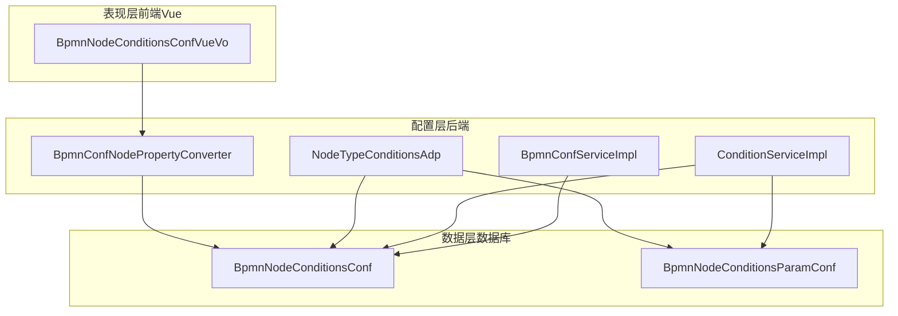
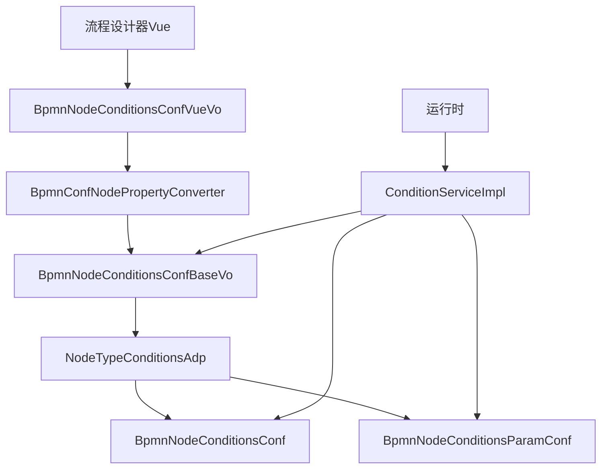
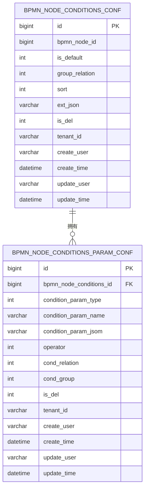
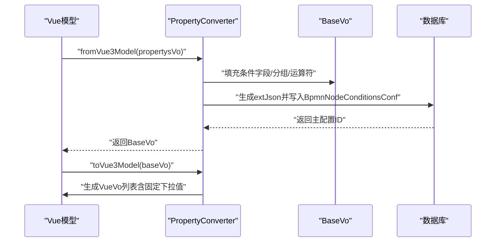
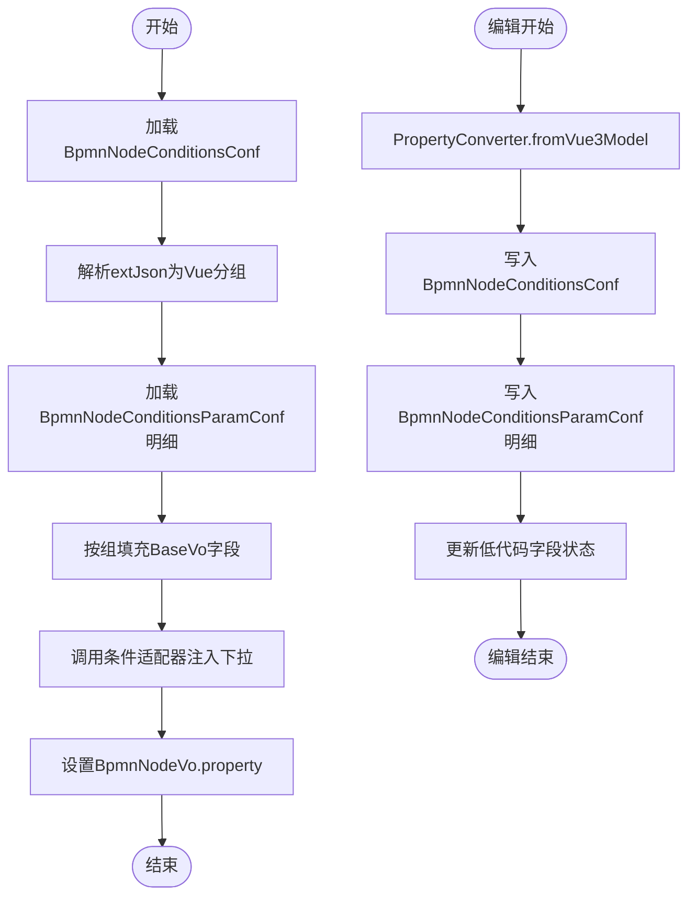
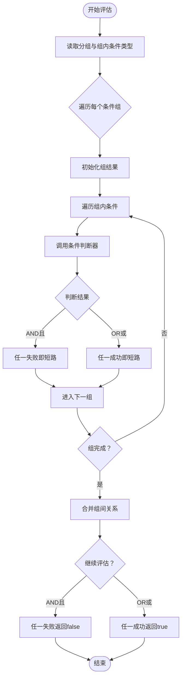
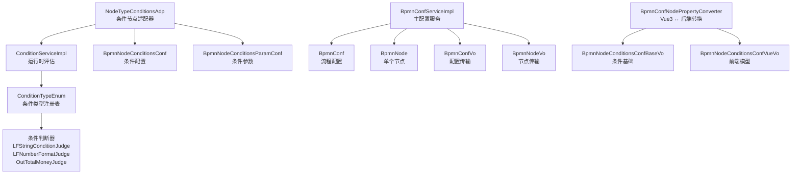
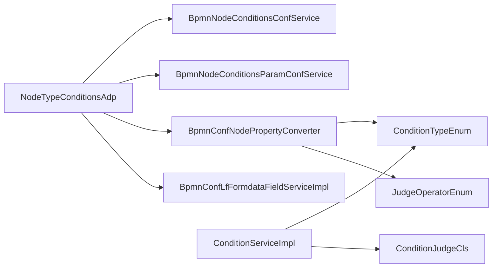

# BPMN配置系统

<cite>
**本文档引用的文件**
- [BpmnNodeConditionsConf.java](file://antflow-base/src/main/java/org/openoa/base/entity/BpmnNodeConditionsConf.java)
- [BpmnNodeConditionsParamConf.java](file://antflow-base/src/main/java/org/openoa/base/entity/BpmnNodeConditionsParamConf.java)
- [BpmnNodeConditionsConfBaseVo.java](file://antflow-base/src/main/java/org/openoa/base/vo/BpmnNodeConditionsConfBaseVo.java)
- [BpmnNodeConditionsConfVueVo.java](file://antflow-base/src/main/java/org/openoa/base/vo/BpmnNodeConditionsConfVueVo.java)
- [BpmnConfNodePropertyConverter.java](file://antflow-engine/src/main/java/org/openoa/engine/utils/BpmnConfNodePropertyConverter.java)
- [NodeTypeConditionsAdp.java](file://antflow-engine/src/main/java/org/openoa/engine/bpmnconf/adp/bpmnnodeadp/NodeTypeConditionsAdp.java)
- [ConditionServiceImpl.java](file://antflow-engine/src/main/java/org/openoa/engine/bpmnconf/adp/conditionfilter/ConditionServiceImpl.java)
- [BpmnNodeAdaptor.java](file://antflow-engine/src/main/java/org/openoa/engine/bpmnconf/adp/bpmnnodeadp/BpmnNodeAdaptor.java)
- [BpmnConfServiceImpl.java](file://antflow-engine/src/main/java/org/openoa/engine/bpmnconf/service/impl/BpmnConfServiceImpl.java)
- [BpmnNodeConditionsPurchaseTypeAdp.java](file://antflow-engine/src/main/java/org/openoa/engine/bpmnconf/adp/conditionfilter/nodetypeconditions/BpmnNodeConditionsPurchaseTypeAdp.java)
- [BpmnNodeConditionsAccountTypeAdp.java](file://antflow-engine/src/main/java/org/openoa/engine/bpmnconf/adp/conditionfilter/nodetypeconditions/BpmnNodeConditionsAccountTypeAdp.java)
- [BpmnNodeConditionsEmptyAdp.java](file://antflow-engine/src/main/java/org/openoa/engine/bpmnconf/adp/conditionfilter/nodetypeconditions/BpmnNodeConditionsEmptyAdp.java)
- [3.核心概念和术语.md](file://doc/系统介绍篇/3.核心概念和术语.md)
- [6.流程配置系统.md](file://doc/系统介绍篇/6.流程配置系统.md)
</cite>

## 目录
1. [简介](#简介)
2. [项目结构](#项目结构)
3. [核心组件](#核心组件)
4. [架构总览](#架构总览)
5. [详细组件分析](#详细组件分析)
6. [依赖分析](#依赖分析)
7. [性能考虑](#性能考虑)
8. [故障排除指南](#故障排除指南)
9. [结论](#结论)
10. [附录](#附录)

## 简介
本文件面向BPMN配置系统，系统性阐述其如何通过结构化配置方法管理流程定义、节点属性与路由逻辑，实现流程流与业务规则的关注点分离。重点解析以下内容：
- 配置实体设计：BpmnNodeConditionsConf、BpmnNodeConditionsParamConf 的职责与关系
- 属性转换机制：PropertyConverter 的双向转换（前端Vue模型与后端配置对象）
- 配置存储与模型映射：从设计器到数据库、再到运行时评估的完整流程
- 条件系统：分组、运算符、适配器与运行时评估

## 项目结构
BPMN配置系统由三层协作构成：
- 配置层：负责节点条件配置的持久化与编辑（适配器、转换器、服务）
- 数据层：以实体类承载配置信息，并通过MyBatis映射到数据库表
- 表现层：前端Vue模型与后端配置对象之间的双向映射

图表来源
- [BpmnNodeConditionsConf.java:1-85](file://antflow-base/src/main/java/org/openoa/base/entity/BpmnNodeConditionsConf.java#L1-L85)
- [BpmnNodeConditionsParamConf.java:1-84](file://antflow-base/src/main/java/org/openoa/base/entity/BpmnNodeConditionsParamConf.java#L1-L84)
- [BpmnConfNodePropertyConverter.java:1-273](file://antflow-engine/src/main/java/org/openoa/engine/utils/BpmnConfNodePropertyConverter.java#L1-L273)
- [NodeTypeConditionsAdp.java:1-407](file://antflow-engine/src/main/java/org/openoa/engine/bpmnconf/adp/bpmnnodeadp/NodeTypeConditionsAdp.java#L1-L407)
- [ConditionServiceImpl.java:1-137](file://antflow-engine/src/main/java/org/openoa/engine/bpmnconf/adp/conditionfilter/ConditionServiceImpl.java#L1-L137)
- [BpmnConfServiceImpl.java:1-21](file://antflow-engine/src/main/java/org/openoa/engine/bpmnconf/service/impl/BpmnConfServiceImpl.java#L1-L21)

章节来源
- [6.流程配置系统.md:1-60](file://doc/系统介绍篇/6.流程配置系统.md#L1-L60)

## 核心组件
- 配置实体
  - BpmnNodeConditionsConf：节点条件配置主表，包含默认标记、分组关系、优先级、扩展JSON等
  - BpmnNodeConditionsParamConf：条件参数明细表，按组存储具体条件字段、运算符、关系等
- 配置值对象
  - BpmnNodeConditionsConfBaseVo：后端统一的条件配置载体，承载所有条件字段、分组关系、运算符列表等
  - BpmnNodeConditionsConfVueVo：前端Vue模型，描述列标识、显示名、运算类型、固定下拉值等
- 转换器
  - BpmnConfNodePropertyConverter：负责Vue模型与BaseVo之间的双向转换，生成extJson并维护分组映射
- 适配器与服务
  - NodeTypeConditionsAdp：节点条件适配器，负责从数据库加载配置到BpmnNodeVo，保存时写回数据库
  - ConditionServiceImpl：运行时条件评估服务，基于分组关系与各条件判断器进行路由决策
  - BpmnConfServiceImpl：流程配置的基础服务（继承MyBatis-Plus）

章节来源
- [BpmnNodeConditionsConf.java:1-85](file://antflow-base/src/main/java/org/openoa/base/entity/BpmnNodeConditionsConf.java#L1-L85)
- [BpmnNodeConditionsParamConf.java:1-84](file://antflow-base/src/main/java/org/openoa/base/entity/BpmnNodeConditionsParamConf.java#L1-L84)
- [BpmnNodeConditionsConfBaseVo.java:1-126](file://antflow-base/src/main/java/org/openoa/base/vo/BpmnNodeConditionsConfBaseVo.java#L1-L126)
- [BpmnNodeConditionsConfVueVo.java:1-35](file://antflow-base/src/main/java/org/openoa/base/vo/BpmnNodeConditionsConfVueVo.java#L1-L35)
- [BpmnConfNodePropertyConverter.java:1-273](file://antflow-engine/src/main/java/org/openoa/engine/utils/BpmnConfNodePropertyConverter.java#L1-L273)
- [NodeTypeConditionsAdp.java:1-407](file://antflow-engine/src/main/java/org/openoa/engine/bpmnconf/adp/bpmnnodeadp/NodeTypeConditionsAdp.java#L1-L407)
- [ConditionServiceImpl.java:1-137](file://antflow-engine/src/main/java/org/openoa/engine/bpmnconf/adp/conditionfilter/ConditionServiceImpl.java#L1-L137)
- [BpmnConfServiceImpl.java:1-21](file://antflow-engine/src/main/java/org/openoa/engine/bpmnconf/service/impl/BpmnConfServiceImpl.java#L1-L21)

## 架构总览
系统围绕“配置持久化 + 条件评估 + 前后端模型转换”三大能力展开，形成清晰的职责边界与数据流。

图表来源
- [BpmnConfNodePropertyConverter.java:29-181](file://antflow-engine/src/main/java/org/openoa/engine/utils/BpmnConfNodePropertyConverter.java#L29-L181)
- [NodeTypeConditionsAdp.java:58-229](file://antflow-engine/src/main/java/org/openoa/engine/bpmnconf/adp/bpmnnodeadp/NodeTypeConditionsAdp.java#L58-L229)
- [ConditionServiceImpl.java:36-135](file://antflow-engine/src/main/java/org/openoa/engine/bpmnconf/adp/conditionfilter/ConditionServiceImpl.java#L36-L135)

章节来源
- [6.流程配置系统.md:1-60](file://doc/系统介绍篇/6.流程配置系统.md#L1-L60)

## 详细组件分析

### 配置实体设计原理
- BpmnNodeConditionsConf
  - 主要字段：节点ID、默认标记、分组关系、排序、扩展JSON、租户与审计字段
  - 设计要点：通过extJson承载复杂、可变的前端模型；默认条件与普通条件共存，便于快速回退
- BpmnNodeConditionsParamConf
  - 主要字段：所属条件配置ID、条件类型、条件名称、条件JSON、运算符、组内关系、组号
  - 设计要点：明细按组组织，支持AND/OR关系；数值运算符独立存储，便于运行时评估

图表来源
- [BpmnNodeConditionsConf.java:24-85](file://antflow-base/src/main/java/org/openoa/base/entity/BpmnNodeConditionsConf.java#L24-L85)
- [BpmnNodeConditionsParamConf.java:24-84](file://antflow-base/src/main/java/org/openoa/base/entity/BpmnNodeConditionsParamConf.java#L24-L84)

章节来源
- [BpmnNodeConditionsConf.java:1-85](file://antflow-base/src/main/java/org/openoa/base/entity/BpmnNodeConditionsConf.java#L1-L85)
- [BpmnNodeConditionsParamConf.java:1-84](file://antflow-base/src/main/java/org/openoa/base/entity/BpmnNodeConditionsParamConf.java#L1-L84)

### PropertyConverter 双向转换机制
- fromVue3Model（Vue → 后端）
  - 输入：BpmnNodePropertysVo（包含条件分组、列标识、运算类型、自定义值等）
  - 输出：BpmnNodeConditionsConfBaseVo（统一条件载体），同时生成extJson与分组映射
  - 关键逻辑：根据列标识解析条件类型枚举，按字段类型（列表/对象）进行序列化；低代码条件采用容器包装；运算符与组关系写入BaseVo
- toVue3Model（后端 → Vue）
  - 输入：BpmnNodeConditionsConfBaseVo
  - 输出：BpmnNodeConditionsConfVueVo列表（用于设计器渲染）
  - 关键逻辑：从extJson重建分组映射；根据条件类型反射读取字段值；低代码条件从容器中提取；固定下拉值通过适配器注入

图表来源
- [BpmnConfNodePropertyConverter.java:29-181](file://antflow-engine/src/main/java/org/openoa/engine/utils/BpmnConfNodePropertyConverter.java#L29-L181)
- [BpmnConfNodePropertyConverter.java:183-271](file://antflow-engine/src/main/java/org/openoa/engine/utils/BpmnConfNodePropertyConverter.java#L183-L271)

章节来源
- [BpmnConfNodePropertyConverter.java:1-273](file://antflow-engine/src/main/java/org/openoa/engine/utils/BpmnConfNodePropertyConverter.java#L1-L273)

### 适配器与配置存储映射
- NodeTypeConditionsAdp
  - 加载阶段：从BpmnNodeConditionsConf读取extJson，解析为Vue模型分组；从BpmnNodeConditionsParamConf读取明细，按组填充BaseVo；调用条件适配器注入下拉选项；最终设置到BpmnNodeVo.property
  - 编辑阶段：调用PropertyConverter.fromVue3Model生成BaseVo；写入BpmnNodeConditionsConf；非默认条件逐条写入BpmnNodeConditionsParamConf；低代码字段更新表单字段状态
- 适配器扩展
  - BpmnNodeConditionsPurchaseTypeAdp、BpmnNodeConditionsAccountTypeAdp、BpmnNodeConditionsEmptyAdp：演示如何为不同节点类型注入下拉选项

图表来源
- [NodeTypeConditionsAdp.java:58-229](file://antflow-engine/src/main/java/org/openoa/engine/bpmnconf/adp/bpmnnodeadp/NodeTypeConditionsAdp.java#L58-L229)
- [NodeTypeConditionsAdp.java:250-400](file://antflow-engine/src/main/java/org/openoa/engine/bpmnconf/adp/bpmnnodeadp/NodeTypeConditionsAdp.java#L250-L400)

章节来源
- [NodeTypeConditionsAdp.java:1-407](file://antflow-engine/src/main/java/org/openoa/engine/bpmnconf/adp/bpmnnodeadp/NodeTypeConditionsAdp.java#L1-L407)
- [BpmnNodeConditionsPurchaseTypeAdp.java:1-40](file://antflow-engine/src/main/java/org/openoa/engine/bpmnconf/adp/conditionfilter/nodetypeconditions/BpmnNodeConditionsPurchaseTypeAdp.java#L1-L40)
- [BpmnNodeConditionsAccountTypeAdp.java:1-40](file://antflow-engine/src/main/java/org/openoa/engine/bpmnconf/adp/conditionfilter/nodetypeconditions/BpmnNodeConditionsAccountTypeAdp.java#L1-L40)
- [BpmnNodeConditionsEmptyAdp.java:1-23](file://antflow-engine/src/main/java/org/openoa/engine/bpmnconf/adp/conditionfilter/nodetypeconditions/BpmnNodeConditionsEmptyAdp.java#L1-L23)

### 运行时条件评估
- ConditionServiceImpl
  - 输入：节点视图、条件配置BaseVo、启动条件、是否动态条件网关
  - 评估流程：遍历分组与组内条件，依据组间关系（AND/OR）与组内关系（AND/OR）决定结果；通过条件类型枚举获取判断器实例执行具体评估
  - 动态条件记录：在非预览场景下记录节点命中情况，用于迁移预校验对比

图表来源
- [ConditionServiceImpl.java:36-135](file://antflow-engine/src/main/java/org/openoa/engine/bpmnconf/adp/conditionfilter/ConditionServiceImpl.java#L36-L135)

章节来源
- [ConditionServiceImpl.java:1-137](file://antflow-engine/src/main/java/org/openoa/engine/bpmnconf/adp/conditionfilter/ConditionServiceImpl.java#L1-L137)

### 概念架构图（来自文档）
该图为概念层面的系统架构示意，展示配置层、数据实体与值对象、条件系统的关系。

图表来源
- [6.流程配置系统.md:9-60](file://doc/系统介绍篇/6.流程配置系统.md#L9-L60)

章节来源
- [6.流程配置系统.md:1-60](file://doc/系统介绍篇/6.流程配置系统.md#L1-L60)

## 依赖分析
- 组件耦合
  - NodeTypeConditionsAdp 依赖 BpmnNodeConditionsConfService、BpmnNodeConditionsParamConfService、BpmnConfNodePropertyConverter
  - ConditionServiceImpl 依赖条件类型枚举与各条件判断器实例
  - PropertyConverter 依赖条件类型枚举、运算符枚举与工具类
- 外部依赖
  - MyBatis-Plus：实体映射与查询
  - Fastjson2：JSON序列化/反序列化
  - Guava：集合工具
  - Apache Commons：字符串与反射工具

图表来源
- [NodeTypeConditionsAdp.java:47-55](file://antflow-engine/src/main/java/org/openoa/engine/bpmnconf/adp/bpmnnodeadp/NodeTypeConditionsAdp.java#L47-L55)
- [ConditionServiceImpl.java:6-18](file://antflow-engine/src/main/java/org/openoa/engine/bpmnconf/adp/conditionfilter/ConditionServiceImpl.java#L6-L18)
- [BpmnConfNodePropertyConverter.java:3-21](file://antflow-engine/src/main/java/org/openoa/engine/utils/BpmnConfNodePropertyConverter.java#L3-L21)

章节来源
- [NodeTypeConditionsAdp.java:1-407](file://antflow-engine/src/main/java/org/openoa/engine/bpmnconf/adp/bpmnnodeadp/NodeTypeConditionsAdp.java#L1-L407)
- [ConditionServiceImpl.java:1-137](file://antflow-engine/src/main/java/org/openoa/engine/bpmnconf/adp/conditionfilter/ConditionServiceImpl.java#L1-L137)
- [BpmnConfNodePropertyConverter.java:1-273](file://antflow-engine/src/main/java/org/openoa/engine/utils/BpmnConfNodePropertyConverter.java#L1-L273)

## 性能考虑
- JSON序列化/反序列化
  - extJson与条件参数JSON频繁序列化，建议在批量写入时复用对象池或避免重复解析
- 反射与字段访问
  - 大量使用反射读写字段，建议在高频路径缓存Field与BeanUtils
- 分组与映射
  - 分组关系与映射需保持一致性，避免重复计算；可在适配器中缓存映射表
- 条件评估
  - 条件判断器应尽量无副作用，避免重复IO；必要时引入本地缓存

## 故障排除指南
- 常见错误与定位
  - “节点无属性/输入为空”：检查Vue模型是否正确传入PropertyConverter
  - “列标识无效/字段名不匹配”：确认列标识与条件类型枚举一致，低代码条件字段名需符合约定
  - “逻辑错误/缺少关系”：检查组内关系与组间关系是否正确设置
  - “动态条件变更检测”：迁移预校验时若条件发生变化会抛出异常，需重新发布流程
- 关键异常来源
  - PropertyConverter：输入校验、列标识解析、运算符解析
  - NodeTypeConditionsAdp：数据库查询为空、条件类型解析失败
  - ConditionServiceImpl：条件类型为空、判断器实例化失败

章节来源
- [BpmnConfNodePropertyConverter.java:31-75](file://antflow-engine/src/main/java/org/openoa/engine/utils/BpmnConfNodePropertyConverter.java#L31-L75)
- [NodeTypeConditionsAdp.java:124-128](file://antflow-engine/src/main/java/org/openoa/engine/bpmnconf/adp/bpmnnodeadp/NodeTypeConditionsAdp.java#L124-L128)
- [ConditionServiceImpl.java:50-52](file://antflow-engine/src/main/java/org/openoa/engine/bpmnconf/adp/conditionfilter/ConditionServiceImpl.java#L50-L52)

## 结论
BPMN配置系统通过结构化的配置实体、统一的值对象、双向转换器与适配器，实现了流程设计器与执行引擎之间的无缝衔接。默认条件与普通条件并存的设计简化了回退与迁移；分组与运算符的抽象使得路由逻辑具备良好的可扩展性；运行时评估服务确保了条件判断的可插拔与可维护性。整体架构在关注点分离的基础上，兼顾了灵活性与稳定性。

## 附录
- 概念与术语图（来自文档）
  - 展示了Vue前端模型、后端基础模型、属性转换器与配置存储之间的关系，强调了双向转换与分组映射的重要性

章节来源
- [3.核心概念和术语.md:55-107](file://doc/系统介绍篇/3.核心概念和术语.md#L55-L107)