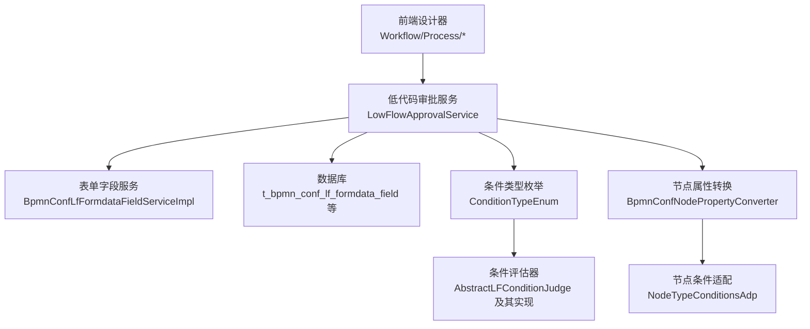
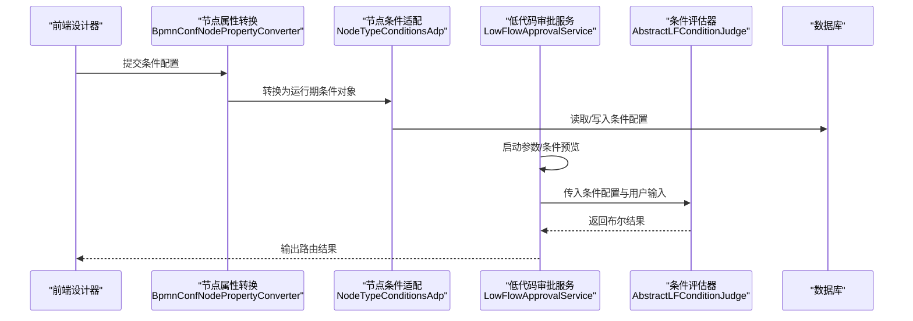
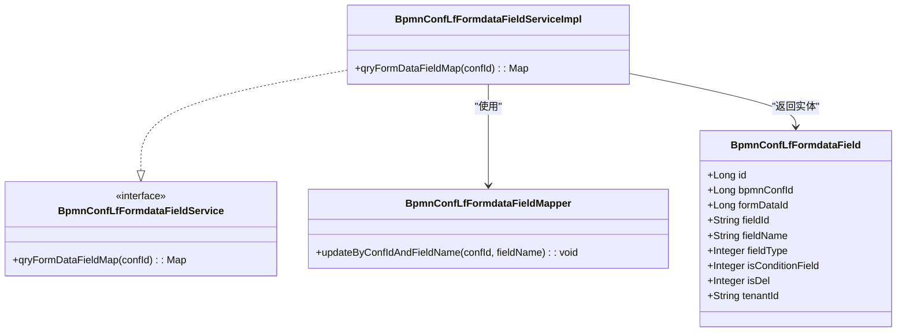
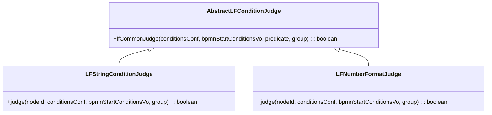
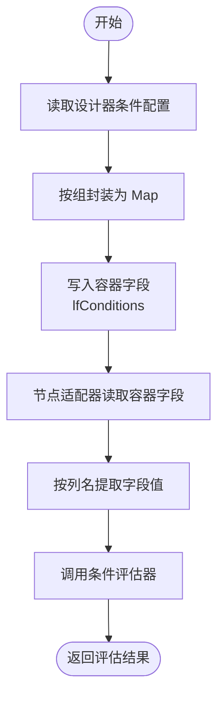
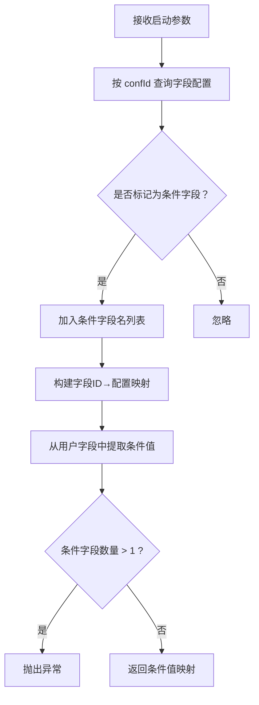
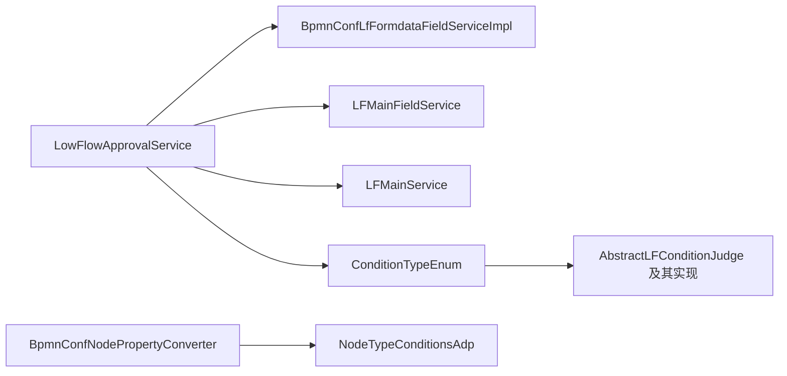

# 低代码流程系统

<cite>
**本文引用的文件**
- [LowFlowApprovalService.java](file://antflow-engine/src/main/java/org/openoa/engine/lowflow/service/LowFlowApprovalService.java)
- [BpmnConfLfFormdataFieldServiceImpl.java](file://antflow-engine/src/main/java/org/ope/nflow/engine/bpmnconf/service/impl/BpmnConfLfFormdataFieldServiceImpl.java)
- [BpmnConfLfFormdataFieldService.java](file://antflow-engine/src/main/java/org/openoa/engine/bpmnconf/service/interf/repository/BpmnConfLfFormdataFieldService.java)
- [BpmnConfLfFormdataFieldMapper.java](file://antflow-engine/src/main/java/org/openoa/engine/bpmnconf/mapper/BpmnConfLfFormdataFieldMapper.java)
- [BpmnConfLfFormdataFieldMapper.xml](file://antflow-engine/src/main/resources/mapper/BpmnConfLfFormdataFieldMapper.xml)
- [BpmnConfLfFormdataField.java](file://antflow-base/src/main/java/org/openoa/base/entity/BpmnConfLfFormdataField.java)
- [StringConstants.java](file://antflow-base/src/main/java/org/openoa/base/constant/StringConstants.java)
- [ConditionTypeEnum.java](file://antflow-engine/src/main/java/org/openoa/engine/bpmnconf/constant/enus/ConditionTypeEnum.java)
- [AbstractLFConditionJudge.java](file://antflow-engine/src/main/java/org/openoa/engine/bpmnconf/adp/conditionfilter/conditionjudge/AbstractLFConditionJudge.java)
- [LFStringConditionJudge.java](file://antflow-engine/src/main/java/org/openoa/engine/bpmnconf/adp/conditionfilter/conditionjudge/LFStringConditionJudge.java)
- [LFNumberFormatJudge.java](file://antflow-engine/src/main/java/org/openoa/engine/bpmnconf/adp/conditionfilter/conditionjudge/LFNumberFormatJudge.java)
- [NodeTypeConditionsAdp.java](file://antflow-engine/src/main/java/org/openoa/engine/bpmnconf/adp/bpmnnodeadp/NodeTypeConditionsAdp.java)
- [BpmnConfNodePropertyConverter.java](file://antflow-engine/src/main/java/org/openoa/engine/utils/BpmnConfNodePropertyConverter.java)
- [3.核心概念和术语.md](file://doc/系统介绍篇/3.核心概念和术语.md)
- [9.低代码引擎.md](file://doc/系统介绍篇/9.低代码引擎.md)
- [14.流程设计器和流程节点配置.md](file://doc/系统介绍篇/14.流程设计器和流程节点配置.md)
</cite>

## 目录
1. [简介](#简介)
2. [项目结构](#项目结构)
3. [核心组件](#核心组件)
4. [架构总览](#架构总览)
5. [详细组件分析](#详细组件分析)
6. [依赖关系分析](#依赖关系分析)
7. [性能考量](#性能考量)
8. [故障排查指南](#故障排查指南)
9. [结论](#结论)
10. [附录](#附录)

## 简介
本文件面向低代码流程系统，系统性阐述如何通过可视化配置创建工作流而无需编写代码。重点覆盖以下方面：
- 表单构建器与字段管理：通过配置表单字段、标记条件字段，支撑流程路由与条件评估。
- 动态条件评估：以“低代码条件”为核心，结合条件类型枚举、条件评估器与容器字段，实现灵活的路由决策。
- 数据转换与映射：通过常量与适配器，将前端提交的字段值转换为后端可识别的条件结构。

## 项目结构
低代码流程系统由“前端设计器 + 后端引擎 + 数据库模型”协同组成。后端引擎包含：
- 低代码审批服务：负责流程启动参数、条件预览与数据查询。
- 表单字段服务：提供字段配置查询与条件字段标记能力。
- 条件类型与评估器：定义低代码条件类型及对应的评估策略。
- 节点属性转换与适配：将流程设计器配置转换为运行期可用的条件结构。

图表来源
- [LowFlowApprovalService.java:1-200](file://antflow-engine/src/main/java/org/openoa/engine/lowflow/service/LowFlowApprovalService.java#L1-L200)
- [BpmnConfLfFormdataFieldServiceImpl.java:1-32](file://antflow-engine/src/main/java/org/openoa/engine/bpmnconf/service/impl/BpmnConfLfFormdataFieldServiceImpl.java#L1-L32)
- [ConditionTypeEnum.java:50-65](file://antflow-engine/src/main/java/org/openoa/engine/bpmnconf/constant/enus/ConditionTypeEnum.java#L50-L65)
- [AbstractLFConditionJudge.java:1-59](file://antflow-engine/src/main/java/org/openoa/engine/bpmnconf/adp/conditionfilter/conditionjudge/AbstractLFConditionJudge.java#L1-L59)
- [BpmnConfNodePropertyConverter.java:35-60](file://antflow-engine/src/main/java/org/openoa/engine/utils/BpmnConfNodePropertyConverter.java#L35-L60)
- [NodeTypeConditionsAdp.java:82-308](file://antflow-engine/src/main/java/org/openoa/engine/bpmnconf/adp/bpmnnodeadp/NodeTypeConditionsAdp.java#L82-L308)

章节来源
- [LowFlowApprovalService.java:1-200](file://antflow-engine/src/main/java/org/openoa/engine/lowflow/service/LowFlowApprovalService.java#L1-L200)
- [BpmnConfLfFormdataFieldServiceImpl.java:1-32](file://antflow-engine/src/main/java/org/openoa/engine/bpmnconf/service/impl/BpmnConfLfFormdataFieldServiceImpl.java#L1-L32)
- [ConditionTypeEnum.java:50-65](file://antflow-engine/src/main/java/org/openoa/engine/bpmnconf/constant/enus/ConditionTypeEnum.java#L50-L65)
- [BpmnConfNodePropertyConverter.java:35-60](file://antflow-engine/src/main/java/org/openoa/engine/utils/BpmnConfNodePropertyConverter.java#L35-L60)
- [NodeTypeConditionsAdp.java:82-308](file://antflow-engine/src/main/java/org/openoa/engine/bpmnconf/adp/bpmnnodeadp/NodeTypeConditionsAdp.java#L82-L308)

## 核心组件
- 表单管理服务：负责按配置ID查询表单字段并构建字段映射，同时支持标记某个字段为“条件字段”，用于后续流程路由。
- 字段存储机制：低代码条件统一存储在容器字段中，容器字段名为常量定义，便于跨多种条件类型复用。
- 条件评估器：针对不同低代码条件类型（字符串、数字、日期、集合等）提供统一的评估框架与具体实现。
- 数据转换机制：通过节点属性转换与适配器，将设计器配置映射到运行期条件对象，并按组与运算符进行组合评估。

章节来源
- [BpmnConfLfFormdataFieldService.java:1-11](file://antflow-engine/src/main/java/org/openoa/engine/bpmnconf/service/interf/repository/BpmnConfLfFormdataFieldService.java#L1-L11)
- [BpmnConfLfFormdataFieldServiceImpl.java:1-32](file://antflow-engine/src/main/java/org/openoa/engine/bpmnconf/service/impl/BpmnConfLfFormdataFieldServiceImpl.java#L1-L32)
- [StringConstants.java:30-35](file://antflow-base/src/main/java/org/openoa/base/constant/StringConstants.java#L30-L35)
- [ConditionTypeEnum.java:50-65](file://antflow-engine/src/main/java/org/openoa/engine/bpmnconf/constant/enus/ConditionTypeEnum.java#L50-L65)
- [AbstractLFConditionJudge.java:1-59](file://antflow-engine/src/main/java/org/openoa/engine/bpmnconf/adp/conditionfilter/conditionjudge/AbstractLFConditionJudge.java#L1-L59)
- [LFStringConditionJudge.java:1-15](file://antflow-engine/src/main/java/org/openoa/engine/bpmnconf/adp/conditionfilter/conditionjudge/LFStringConditionJudge.java#L1-L15)
- [LFNumberFormatJudge.java:1-32](file://antflow-engine/src/main/java/org/openoa/engine/bpmnconf/adp/conditionfilter/conditionjudge/LFNumberFormatJudge.java#L1-L32)
- [BpmnConfNodePropertyConverter.java:35-60](file://antflow-engine/src/main/java/org/openoa/engine/utils/BpmnConfNodePropertyConverter.java#L35-L60)
- [NodeTypeConditionsAdp.java:82-308](file://antflow-engine/src/main/java/org/openoa/engine/bpmnconf/adp/bpmnnodeadp/NodeTypeConditionsAdp.java#L82-L308)

## 架构总览
低代码流程系统的关键交互路径如下：
- 设计器生成条件配置 → 转换为运行期对象 → 评估器按组与运算符组合判断 → 决策流程路由。
- 表单字段服务提供字段元数据与条件字段标记 → 低代码审批服务在启动时提取条件字段值 → 与条件配置进行匹配。

图表来源
- [BpmnConfNodePropertyConverter.java:35-60](file://antflow-engine/src/main/java/org/openoa/engine/utils/BpmnConfNodePropertyConverter.java#L35-L60)
- [NodeTypeConditionsAdp.java:82-308](file://antflow-engine/src/main/java/org/openoa/engine/bpmnconf/adp/bpmnnodeadp/NodeTypeConditionsAdp.java#L82-L308)
- [LowFlowApprovalService.java:62-95](file://antflow-engine/src/main/java/org/openoa/engine/lowflow/service/LowFlowApprovalService.java#L62-L95)
- [AbstractLFConditionJudge.java:18-57](file://antflow-engine/src/main/java/org/openoa/engine/bpmnconf/adp/conditionfilter/conditionjudge/AbstractLFConditionJudge.java#L18-L57)

## 详细组件分析

### 表单管理服务（BpmnConfLfFormdataFieldServiceImpl）
职责
- 按配置ID查询表单字段集合，并构建“字段ID → 字段配置”的映射。
- 支持将指定字段标记为“条件字段”，供流程启动时筛选参与路由评估的字段。

实现要点
- 查询逻辑基于配置ID过滤字段集合。
- 将字段ID作为键，字段配置作为值，形成快速查找映射。
- 提供更新接口，将某字段标记为条件字段。

图表来源
- [BpmnConfLfFormdataFieldServiceImpl.java:1-32](file://antflow-engine/src/main/java/org/openoa/engine/bpmnconf/service/impl/BpmnConfLfFormdataFieldServiceImpl.java#L1-L32)
- [BpmnConfLfFormdataFieldService.java:1-11](file://antflow-engine/src/main/java/org/openoa/engine/bpmnconf/service/interf/repository/BpmnConfLfFormdataFieldService.java#L1-L11)
- [BpmnConfLfFormdataFieldMapper.java:1-11](file://antflow-engine/src/main/java/org/openoa/engine/bpmnconf/mapper/BpmnConfLfFormdataFieldMapper.java#L1-L11)
- [BpmnConfLfFormdataField.java:1-89](file://antflow-base/src/main/java/org/openoa/base/entity/BpmnConfLfFormdataField.java#L1-L89)

章节来源
- [BpmnConfLfFormdataFieldServiceImpl.java:1-32](file://antflow-engine/src/main/java/org/openoa/engine/bpmnconf/service/impl/BpmnConfLfFormdataFieldServiceImpl.java#L1-L32)
- [BpmnConfLfFormdataFieldMapper.xml:7-9](file://antflow-engine/src/main/resources/mapper/BpmnConfLfFormdataFieldMapper.xml#L7-L9)
- [BpmnConfLfFormdataField.java:51-55](file://antflow-base/src/main/java/org/openoa/base/entity/BpmnConfLfFormdataField.java#L51-L55)

### 字段存储机制（lfConditions 容器）
- 常量定义：LOWFLOW_CONDITION_CONTAINER_FIELD_NAME 指定容器字段名为“lfConditions”。
- 存储结构：Map<String, Object>，键为字段ID，值为该字段在当前条件组下的配置值。
- 作用：所有低代码条件均存放于该容器字段内，避免为每种条件类型单独建列，提升灵活性。

章节来源
- [StringConstants.java:30-35](file://antflow-base/src/main/java/org/openoa/base/constant/StringConstants.java#L30-L35)
- [ConditionTypeEnum.java:50-65](file://antflow-engine/src/main/java/org/openoa/engine/bpmnconf/constant/enus/ConditionTypeEnum.java#L50-L65)
- [AbstractLFConditionJudge.java:18-26](file://antflow-engine/src/main/java/org/openoa/engine/bpmnconf/adp/conditionfilter/conditionjudge/AbstractLFConditionJudge.java#L18-L26)

### 条件评估器（LFStringConditionJudge、LFNumberFormatJudge）
- 抽象基类：AbstractLFConditionJudge 提供通用评估流程，包括分组、运算符、逐项匹配与短路逻辑。
- 字符串条件：LFStringConditionJudge 对比大小写不敏感的字符串相等。
- 数字条件：LFNumberFormatJudge 支持数字、布尔与逗号分隔的范围值解析，统一转换为BigDecimal进行比较。

图表来源
- [AbstractLFConditionJudge.java:1-59](file://antflow-engine/src/main/java/org/openoa/engine/bpmnconf/adp/conditionfilter/conditionjudge/AbstractLFConditionJudge.java#L1-L59)
- [LFStringConditionJudge.java:1-15](file://antflow-engine/src/main/java/org/openoa/engine/bpmnconf/adp/conditionfilter/conditionjudge/LFStringConditionJudge.java#L1-L15)
- [LFNumberFormatJudge.java:1-32](file://antflow-engine/src/main/java/org/openoa/engine/bpmnconf/adp/conditionfilter/conditionjudge/LFNumberFormatJudge.java#L1-L32)

章节来源
- [AbstractLFConditionJudge.java:18-57](file://antflow-engine/src/main/java/org/openoa/engine/bpmnconf/adp/conditionfilter/conditionjudge/AbstractLFConditionJudge.java#L18-L57)
- [LFStringConditionJudge.java:10-14](file://antflow-engine/src/main/java/org/openoa/engine/bpmnconf/adp/conditionfilter/conditionjudge/LFStringConditionJudge.java#L10-L14)
- [LFNumberFormatJudge.java:14-32](file://antflow-engine/src/main/java/org/openoa/engine/bpmnconf/adp/conditionfilter/conditionjudge/LFNumberFormatJudge.java#L14-L32)

### 数据转换机制（LOWFLOW_CONDITION_CONTAINER_FIELD_NAME）
- 常量作用：LOWFLOW_CONDITION_CONTAINER_FIELD_NAME 作为容器字段名，在条件类型枚举与节点适配器中被广泛引用，确保前后端一致的数据承载方式。
- 节点适配：NodeTypeConditionsAdp 在读取低代码条件时，先按组提取容器字段内容，再根据列名（columnDbname）定位具体字段值。
- 属性转换：BpmnConfNodePropertyConverter 将设计器配置按组封装为 Map<String, Object>，并写入容器字段，供运行期评估使用。

图表来源
- [BpmnConfNodePropertyConverter.java:35-60](file://antflow-engine/src/main/java/org/openoa/engine/utils/BpmnConfNodePropertyConverter.java#L35-L60)
- [NodeTypeConditionsAdp.java:297-308](file://antflow-engine/src/main/java/org/openoa/engine/bpmnconf/adp/bpmnnodeadp/NodeTypeConditionsAdp.java#L297-L308)
- [StringConstants.java:30-35](file://antflow-base/src/main/java/org/openoa/base/constant/StringConstants.java#L30-L35)

章节来源
- [StringConstants.java:30-35](file://antflow-base/src/main/java/org/openoa/base/constant/StringConstants.java#L30-L35)
- [ConditionTypeEnum.java:50-65](file://antflow-engine/src/main/java/org/openoa/engine/bpmnconf/constant/enus/ConditionTypeEnum.java#L50-L65)
- [NodeTypeConditionsAdp.java:297-308](file://antflow-engine/src/main/java/org/openoa/engine/bpmnconf/adp/bpmnnodeadp/NodeTypeConditionsAdp.java#L297-L308)
- [BpmnConfNodePropertyConverter.java:35-60](file://antflow-engine/src/main/java/org/openoa/engine/utils/BpmnConfNodePropertyConverter.java#L35-L60)

### 低代码条件存储的Map结构示例
- 结构说明：Map<Integer, Map<String, Object>> groupedLfConditionsMap
  - 外层键：组编号（group）
  - 内层键：字段ID（fieldId）
  - 内层值：该字段在当前组的配置值（如字符串、数字、日期或集合）
- 适用场景：同一流程节点下可能有多组条件，每组内部按字段ID匹配用户输入值，最终按组间关系（AND/OR）组合结果。

章节来源
- [AbstractLFConditionJudge.java:18-26](file://antflow-engine/src/main/java/org/openoa/engine/bpmnconf/adp/conditionfilter/conditionjudge/AbstractLFConditionJudge.java#L18-L26)

### 字段映射的实际代码实现
- 低代码审批服务在启动时，会根据配置ID查询字段配置，并筛选标记为“条件字段”的字段集合，然后从用户提交的字段中提取参与路由的条件值。
- 若条件字段数量超过1，将抛出异常，限制当前版本仅支持单一条件字段参与路由。

图表来源
- [LowFlowApprovalService.java:384-422](file://antflow-engine/src/main/java/org/openoa/engine/lowflow/service/LowFlowApprovalService.java#L384-L422)

章节来源
- [LowFlowApprovalService.java:384-422](file://antflow-engine/src/main/java/org/openoa/engine/lowflow/service/LowFlowApprovalService.java#L384-L422)

## 依赖关系分析
- 低代码审批服务依赖表单字段服务与主数据服务，用于查询字段配置与渲染表单值。
- 条件类型枚举与评估器共同决定低代码条件的语义与行为。
- 节点属性转换与适配器负责将设计器配置映射到运行期对象，并通过容器字段承载条件数据。

图表来源
- [LowFlowApprovalService.java:42-60](file://antflow-engine/src/main/java/org/openoa/engine/lowflow/service/LowFlowApprovalService.java#L42-L60)
- [ConditionTypeEnum.java:50-65](file://antflow-engine/src/main/java/org/openoa/engine/bpmnconf/constant/enus/ConditionTypeEnum.java#L50-L65)
- [AbstractLFConditionJudge.java:1-59](file://antflow-engine/src/main/java/org/openoa/engine/bpmnconf/adp/conditionfilter/conditionjudge/AbstractLFConditionJudge.java#L1-L59)
- [BpmnConfNodePropertyConverter.java:35-60](file://antflow-engine/src/main/java/org/openoa/engine/utils/BpmnConfNodePropertyConverter.java#L35-L60)
- [NodeTypeConditionsAdp.java:82-308](file://antflow-engine/src/main/java/org/openoa/engine/bpmnconf/adp/bpmnnodeadp/NodeTypeConditionsAdp.java#L82-L308)

章节来源
- [LowFlowApprovalService.java:42-60](file://antflow-engine/src/main/java/org/openoa/engine/lowflow/service/LowFlowApprovalService.java#L42-L60)
- [ConditionTypeEnum.java:50-65](file://antflow-engine/src/main/java/org/openoa/engine/bpmnconf/constant/enus/ConditionTypeEnum.java#L50-L65)
- [AbstractLFConditionJudge.java:1-59](file://antflow-engine/src/main/java/org/openoa/engine/bpmnconf/adp/conditionfilter/conditionjudge/AbstractLFConditionJudge.java#L1-L59)
- [BpmnConfNodePropertyConverter.java:35-60](file://antflow-engine/src/main/java/org/openoa/engine/utils/BpmnConfNodePropertyConverter.java#L35-L60)
- [NodeTypeConditionsAdp.java:82-308](file://antflow-engine/src/main/java/org/openoa/engine/bpmnconf/adp/bpmnnodeadp/NodeTypeConditionsAdp.java#L82-L308)

## 性能考量
- 缓存策略：低代码审批服务在内存中缓存“配置ID → 条件字段名列表”和“配置ID → 字段ID→字段配置”的映射，减少重复查询。
- 评估效率：条件评估器采用短路逻辑，一旦某一项不满足即终止当前组评估，降低整体开销。
- 数据转换：在表单值渲染阶段，按字段类型进行必要的解析与格式化，避免重复计算。

章节来源
- [LowFlowApprovalService.java:45-48](file://antflow-engine/src/main/java/org/openoa/engine/lowflow/service/LowFlowApprovalService.java#L45-L48)
- [AbstractLFConditionJudge.java:33-56](file://antflow-engine/src/main/java/org/openoa/engine/bpmnconf/adp/conditionfilter/conditionjudge/AbstractLFConditionJudge.java#L33-L56)

## 故障排查指南
- 条件字段缺失：若流程配置未标记任何条件字段，评估时将提示需添加条件配置。
- 用户输入为空：当用户提交的条件值为空时，评估直接返回不匹配。
- 条件字段过多：当前版本限制条件字段数量不超过1，超限将抛出异常。
- 字段类型不匹配：表单值渲染阶段对字段类型进行解析，若无法解析将回退为原始值并记录告警。

章节来源
- [AbstractLFConditionJudge.java:26-32](file://antflow-engine/src/main/java/org/openoa/engine/bpmnconf/adp/conditionfilter/conditionjudge/AbstractLFConditionJudge.java#L26-L32)
- [LowFlowApprovalService.java:417-421](file://antflow-engine/src/main/java/org/openoa/engine/lowflow/service/LowFlowApprovalService.java#L417-L421)
- [LowFlowApprovalService.java:146-190](file://antflow-engine/src/main/java/org/openoa/engine/lowflow/service/LowFlowApprovalService.java#L146-L190)

## 结论
低代码流程系统通过“容器字段 + 条件类型 + 评估器 + 节点适配”的组合，实现了灵活且可扩展的条件路由能力。表单字段服务与低代码审批服务配合，保证了从配置到运行期的顺畅衔接；常量与适配器确保了跨模块的一致性与可维护性。未来可在条件字段数量限制、复杂表达式支持与评估性能优化等方面持续演进。

## 附录
- 相关文档与图示可参考：
  - [3.核心概念和术语.md](file://doc/系统介绍篇/3.核心概念和术语.md)
  - [9.低代码引擎.md](file://doc/系统介绍篇/9.低代码引擎.md)
  - [14.流程设计器和流程节点配置.md](file://doc/系统介绍篇/14.流程设计器和流程节点配置.md)