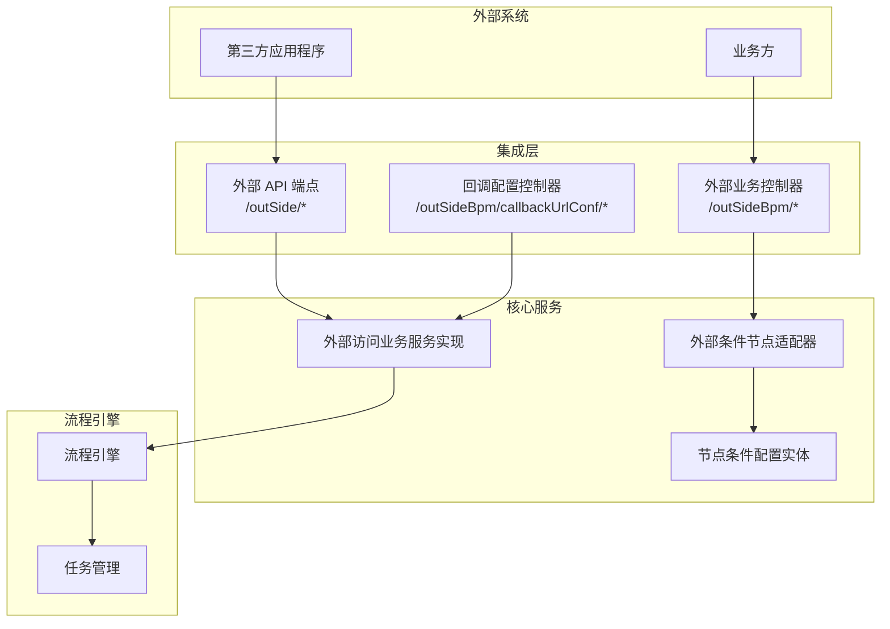
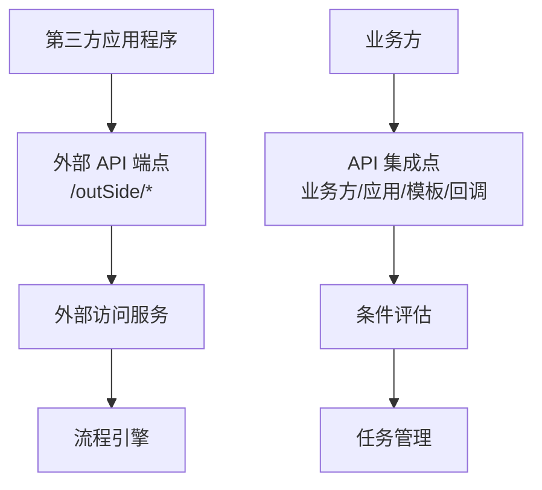
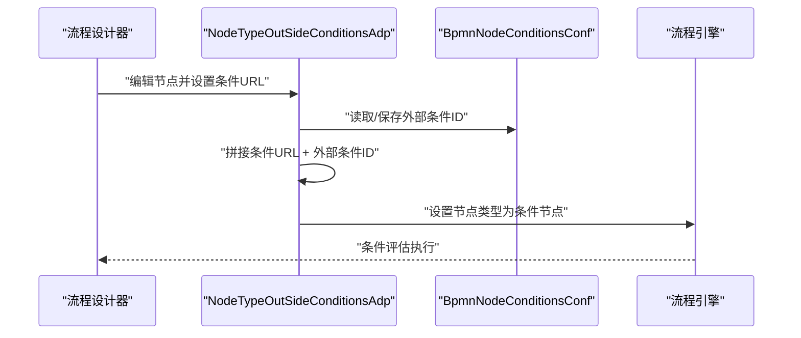
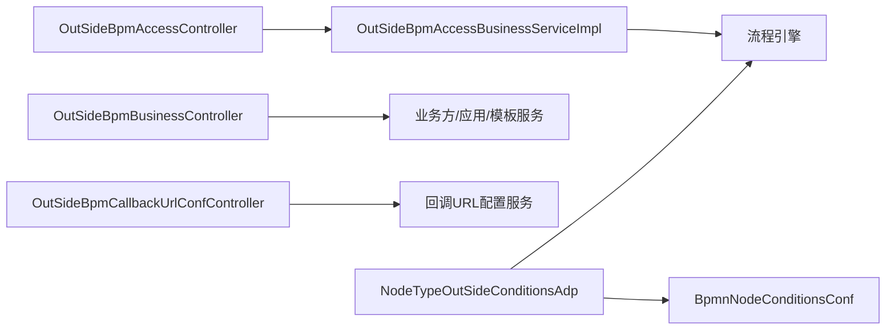

# 外部集成系统

<cite>
**本文引用的文件**
- [OutSideBpmAccessController.java](file://antflow-engine/src/main/java/org/openoa/engine/bpmnconf/controller/OutSideBpmAccessController.java)
- [OutSideBpmBusinessController.java](file://antflow-engine/src/main/java/org/openoa/engine/bpmnconf/controller/OutSideBpmBusinessController.java)
- [OutSideBpmCallbackUrlConfController.java](file://antflow-engine/src/main/java/org/openoa/engine/bpmnconf/controller/OutSideBpmCallbackUrlConfController.java)
- [OutSideBpmAccessBusinessVo.java](file://antflow-engine/src/main/java/org/openoa/engine/vo/OutSideBpmAccessBusinessVo.java)
- [OutSideBpmAccessBusinessServiceImpl.java](file://antflow-engine/src/main/java/org/openoa/engine/bpmnconf/service/impl/OutSideBpmAccessBusinessServiceImpl.java)
- [NodeTypeOutSideConditionsAdp.java](file://antflow-engine/src/main/java/org/openoa/engine/bpmnconf/adp/bpmnnodeadp/NodeTypeOutSideConditionsAdp.java)
- [BpmnNodeConditionsConf.java](file://antflow-base/src/main/java/org/openoa/base/entity/BpmnNodeConditionsConf.java)
- [3.核心概念和术语.md](file://doc/系统介绍篇/3.核心概念和术语.md)
- [10.外部系统集成.md](file://doc/系统介绍篇/10.外部系统集成.md)
- [AntFlow业务集成之三API接入(SAAS模式)流程实战.md](file://doc/系统集成与扩展开发篇/AntFlow业务集成之三API接入(SAAS模式)流程实战.md)
- [ServiceTask.java](file://antflow-base/src/main/java/org/activiti/bpmn/model/ServiceTask.java)
</cite>

## 目录
1. [简介](#简介)
2. [项目结构](#项目结构)
3. [核心组件](#核心组件)
4. [架构总览](#架构总览)
5. [详细组件分析](#详细组件分析)
6. [依赖分析](#依赖分析)
7. [性能考虑](#性能考虑)
8. [故障排查指南](#故障排查指南)
9. [结论](#结论)
10. [附录](#附录)

## 简介
本文件面向外部集成系统（亦称SaaS流程）的概念解释与架构设计，目标是帮助第三方应用程序通过标准化的API与可配置的集成点，与AntFlow工作流进行交互。文档将系统性阐述：
- SaaS流程的概念与应用场景
- 外部API端点、外部访问服务、API集成点、流程引擎、条件评估、任务管理等关键模块的协作关系
- outSideConditionsJson、outSideConditionsUrl、outSideMatched等配置字段的作用机制
- 外部系统集成的完整流程图与实际API调用示例路径

## 项目结构
外部集成相关的核心代码集中在后端工程的控制器、服务与适配器层，配合前端的预览与管理界面，形成“外部系统—API—服务—引擎”的闭环。

图表来源
- [OutSideBpmAccessController.java:22-90](file://antflow-engine/src/main/java/org/openoa/engine/bpmnconf/controller/OutSideBpmAccessController.java#L22-L90)
- [OutSideBpmBusinessController.java:20-195](file://antflow-engine/src/main/java/org/openoa/engine/bpmnconf/controller/OutSideBpmBusinessController.java#L20-L195)
- [OutSideBpmCallbackUrlConfController.java:16-68](file://antflow-engine/src/main/java/org/openoa/engine/bpmnconf/controller/OutSideBpmCallbackUrlConfController.java#L16-L68)
- [OutSideBpmAccessBusinessServiceImpl.java:14-17](file://antflow-engine/src/main/java/org/openoa/engine/bpmnconf/service/impl/OutSideBpmAccessBusinessServiceImpl.java#L14-L17)
- [NodeTypeOutSideConditionsAdp.java:23-75](file://antflow-engine/src/main/java/org/openoa/engine/bpmnconf/adp/bpmnnodeadp/NodeTypeOutSideConditionsAdp.java#L23-L75)
- [BpmnNodeConditionsConf.java:25-85](file://antflow-base/src/main/java/org/openoa/base/entity/BpmnNodeConditionsConf.java#L25-L85)

章节来源
- [OutSideBpmAccessController.java:22-90](file://antflow-engine/src/main/java/org/openoa/engine/bpmnconf/controller/OutSideBpmAccessController.java#L22-L90)
- [OutSideBpmBusinessController.java:20-195](file://antflow-engine/src/main/java/org/openoa/engine/bpmnconf/controller/OutSideBpmBusinessController.java#L20-L195)
- [OutSideBpmCallbackUrlConfController.java:16-68](file://antflow-engine/src/main/java/org/openoa/engine/bpmnconf/controller/OutSideBpmCallbackUrlConfController.java#L16-L68)

## 核心组件
- 外部API端点
  - 提供REST接口，供第三方系统发起流程、预览、中断、查询流程记录等。
  - 关键接口：/outSide/processSubmit、/outSide/processPreview、/outSide/processBreak、/outSide/outSideProcessRecord。
- 外部访问服务
  - 承载业务发起、预览、中断、记录查询等核心逻辑。
  - 通过控制器暴露接口，调用业务服务实现。
- API集成点
  - 业务方注册、应用配置、条件模板与审批人模板管理。
  - 回调URL配置用于流程事件通知。
- 流程引擎
  - 执行流程、任务管理、节点条件评估。
- 条件评估
  - 将外部条件URL与节点配置拼接，形成最终的外部条件评估地址。
- 任务管理
  - 负责流程任务的创建、推进、结束与状态更新。

章节来源
- [OutSideBpmAccessController.java:38-88](file://antflow-engine/src/main/java/org/openoa/engine/bpmnconf/controller/OutSideBpmAccessController.java#L38-L88)
- [OutSideBpmBusinessController.java:38-194](file://antflow-engine/src/main/java/org/openoa/engine/bpmnconf/controller/OutSideBpmBusinessController.java#L38-L194)
- [OutSideBpmCallbackUrlConfController.java:29-66](file://antflow-engine/src/main/java/org/openoa/engine/bpmnconf/controller/OutSideBpmCallbackUrlConfController.java#L29-L66)
- [NodeTypeOutSideConditionsAdp.java:28-50](file://antflow-engine/src/main/java/org/openoa/engine/bpmnconf/adp/bpmnnodeadp/NodeTypeOutSideConditionsAdp.java#L28-L50)

## 架构总览
外部集成系统采用“外部系统—API—服务—引擎”的分层架构，通过标准化REST接口与可配置的集成点，实现SaaS化的流程服务能力。

图表来源
- [3.核心概念和术语.md:248-292](file://doc/系统介绍篇/3.核心概念和术语.md#L248-L292)
- [OutSideBpmAccessController.java:22-90](file://antflow-engine/src/main/java/org/openoa/engine/bpmnconf/controller/OutSideBpmAccessController.java#L22-L90)
- [OutSideBpmBusinessController.java:20-195](file://antflow-engine/src/main/java/org/openoa/engine/bpmnconf/controller/OutSideBpmBusinessController.java#L20-L195)
- [OutSideBpmCallbackUrlConfController.java:16-68](file://antflow-engine/src/main/java/org/openoa/engine/bpmnconf/controller/OutSideBpmCallbackUrlConfController.java#L16-L68)

## 详细组件分析

### 外部API端点与控制器
- 控制器职责
  - 对外提供流程发起、预览、中断、记录查询等REST接口。
  - 与业务服务交互，封装返回结果。
- 接口清单
  - POST /outSide/processSubmit：业务方流程发起
  - POST /outSide/processPreview：流程预览
  - POST /outSide/processBreak：流程中断
  - GET /outSide/outSideProcessRecord：查询流程记录
- 设计要点
  - 使用统一的结果包装类返回成功/失败信息。
  - 参数对象包含业务方标识、表单编码、流程号、表单数据、模板标记等。

章节来源
- [OutSideBpmAccessController.java:38-88](file://antflow-engine/src/main/java/org/openoa/engine/bpmnconf/controller/OutSideBpmAccessController.java#L38-L88)

### 外部访问服务与业务VO
- 服务实现
  - 基于MyBatis-Plus的仓储服务，提供外部访问业务的CRUD与查询能力。
- VO对象
  - OutSideBpmAccessBusinessVo：承载外部流程请求的核心数据结构，包括业务方ID、表单编码、流程号、表单数据、模板标记、发起人信息、嵌入式节点配置、低代码流程字段等。

章节来源
- [OutSideBpmAccessBusinessServiceImpl.java:14-17](file://antflow-engine/src/main/java/org/openoa/engine/bpmnconf/service/impl/OutSideBpmAccessBusinessServiceImpl.java#L14-L17)
- [OutSideBpmAccessBusinessVo.java:29-138](file://antflow-engine/src/main/java/org/openoa/engine/vo/OutSideBpmAccessBusinessVo.java#L29-L138)

### API集成点：业务方、应用、模板与回调
- 业务方管理
  - 提供业务方注册、编辑、详情、分页列表等接口。
  - 支持按关键字检索业务方与应用。
- 条件模板管理
  - 条件模板的分页查询、按应用查询、编辑与删除。
  - 与流程节点条件配置联动。
- 审批人模板管理
  - 审批人模板的分页查询、按应用查询、编辑与详情。
- 回调URL配置
  - 通过表单编码查询回调列表，分页查询与编辑。
  - 用于流程事件通知（同意、拒绝、完成、终止等）。

章节来源
- [OutSideBpmBusinessController.java:38-194](file://antflow-engine/src/main/java/org/openoa/engine/bpmnconf/controller/OutSideBpmBusinessController.java#L38-L194)
- [OutSideBpmCallbackUrlConfController.java:29-66](file://antflow-engine/src/main/java/org/openoa/engine/bpmnconf/controller/OutSideBpmCallbackUrlConfController.java#L29-L66)

### 条件评估与外部条件URL拼接
- 适配器职责
  - 在节点编辑或格式化时，将节点的条件URL与外部条件ID拼接，生成最终的外部条件评估URL。
  - 设置节点类型为条件节点，确保流程引擎按条件评估执行。
- 配置实体
  - BpmnNodeConditionsConf：节点条件配置实体，包含节点ID、默认标记、分组关系、排序、扩展JSON等。

图表来源
- [NodeTypeOutSideConditionsAdp.java:28-50](file://antflow-engine/src/main/java/org/openoa/engine/bpmnconf/adp/bpmnnodeadp/NodeTypeOutSideConditionsAdp.java#L28-L50)
- [BpmnNodeConditionsConf.java:25-85](file://antflow-base/src/main/java/org/openoa/base/entity/BpmnNodeConditionsConf.java#L25-L85)

章节来源
- [NodeTypeOutSideConditionsAdp.java:28-75](file://antflow-engine/src/main/java/org/openoa/engine/bpmnconf/adp/bpmnnodeadp/NodeTypeOutSideConditionsAdp.java#L28-L75)
- [BpmnNodeConditionsConf.java:25-85](file://antflow-base/src/main/java/org/openoa/base/entity/BpmnNodeConditionsConf.java#L25-L85)

### SaaS流程与ServiceTask的关系
- ServiceTask在BPMN模型中用于定义服务任务的实现类型、结果变量名、类型、自定义属性等。
- 在外部集成场景下，ServiceTask可作为外部系统调用的桥接点，通过实现类型与结果变量名与外部系统对接，实现流程与外部系统的数据交换。

章节来源
- [ServiceTask.java:38-87](file://antflow-base/src/main/java/org/activiti/bpmn/model/ServiceTask.java#L38-L87)

### 外部系统集成流程（含API调用示例）
- 创建租户与应用
  - 通过管理界面创建SaaS租户与应用（一个应用即一个流程）。
- 设置回调与审批人接口
  - 配置回调URL用于接收流程事件；设置审批人接口用于获取审批人信息。
- 发起流程
  - 调用POST /outSide/processSubmit，携带formCode、operationType、isLowCodeFlow、lfFields、userId等参数。
- 流程预览与中断
  - 预览：POST /outSide/processPreview
  - 中断：POST /outSide/processBreak
- 查询流程记录
  - GET /outSide/outSideProcessRecord?processNumber={流程号}

章节来源
- [AntFlow业务集成之三API接入(SAAS模式)流程实战.md](file://doc/系统集成与扩展开发篇/AntFlow业务集成之三API接入(SAAS模式)流程实战.md#L83-L121)

## 依赖分析
- 控制器依赖
  - OutSideBpmAccessController 依赖外部访问业务服务与条件模板服务。
  - OutSideBpmBusinessController 依赖业务方、应用、条件模板与审批人模板服务。
  - OutSideBpmCallbackUrlConfController 依赖回调URL配置业务服务。
- 服务与适配器
  - 外部访问业务服务实现继承MyBatis-Plus服务基类，提供CRUD能力。
  - 外部条件节点适配器依赖节点条件配置服务，负责条件URL拼接与节点类型设置。
- 引擎与模型
  - ServiceTask模型用于定义服务任务的实现细节，支撑外部系统与流程引擎的对接。

图表来源
- [OutSideBpmAccessController.java:26-30](file://antflow-engine/src/main/java/org/openoa/engine/bpmnconf/controller/OutSideBpmAccessController.java#L26-L30)
- [OutSideBpmBusinessController.java:24-33](file://antflow-engine/src/main/java/org/openoa/engine/bpmnconf/controller/OutSideBpmBusinessController.java#L24-L33)
- [OutSideBpmCallbackUrlConfController.java:21-22](file://antflow-engine/src/main/java/org/openoa/engine/bpmnconf/controller/OutSideBpmCallbackUrlConfController.java#L21-L22)
- [OutSideBpmAccessBusinessServiceImpl.java:14-17](file://antflow-engine/src/main/java/org/openoa/engine/bpmnconf/service/impl/OutSideBpmAccessBusinessServiceImpl.java#L14-L17)
- [NodeTypeOutSideConditionsAdp.java:25-26](file://antflow-engine/src/main/java/org/openoa/engine/bpmnconf/adp/bpmnnodeadp/NodeTypeOutSideConditionsAdp.java#L25-L26)
- [BpmnNodeConditionsConf.java:25-85](file://antflow-base/src/main/java/org/openoa/base/entity/BpmnNodeConditionsConf.java#L25-L85)

章节来源
- [OutSideBpmAccessController.java:26-30](file://antflow-engine/src/main/java/org/openoa/engine/bpmnconf/controller/OutSideBpmAccessController.java#L26-L30)
- [OutSideBpmBusinessController.java:24-33](file://antflow-engine/src/main/java/org/openoa/engine/bpmnconf/controller/OutSideBpmBusinessController.java#L24-L33)
- [OutSideBpmCallbackUrlConfController.java:21-22](file://antflow-engine/src/main/java/org/openoa/engine/bpmnconf/controller/OutSideBpmCallbackUrlConfController.java#L21-L22)
- [OutSideBpmAccessBusinessServiceImpl.java:14-17](file://antflow-engine/src/main/java/org/openoa/engine/bpmnconf/service/impl/OutSideBpmAccessBusinessServiceImpl.java#L14-L17)
- [NodeTypeOutSideConditionsAdp.java:25-26](file://antflow-engine/src/main/java/org/openoa/engine/bpmnconf/adp/bpmnnodeadp/NodeTypeOutSideConditionsAdp.java#L25-L26)
- [BpmnNodeConditionsConf.java:25-85](file://antflow-base/src/main/java/org/openoa/base/entity/BpmnNodeConditionsConf.java#L25-L85)

## 性能考虑
- 接口幂等与缓存
  - 对频繁查询的流程状态与模板数据建议引入缓存，减少数据库压力。
- 异步回调
  - 回调URL应具备异步处理能力，避免阻塞流程引擎的事件推送。
- 分页与筛选
  - 列表查询接口使用分页DTO，合理设置排序字段与过滤条件，提升查询效率。
- 事务一致性
  - 流程发起与记录写入需在同一事务内完成，保证数据一致性。

## 故障排查指南
- 回调未到达
  - 检查回调URL配置是否正确，确认回调事件类型与参数传递。
- 流程无法启动
  - 核对formCode是否正确，检查应用是否已启动。
- 条件评估异常
  - 确认外部条件URL拼接是否正确，检查节点条件配置是否存在。
- 审批人为空
  - 检查审批人接口是否可用，确认外部系统返回的人员数据格式。

章节来源
- [OutSideBpmCallbackUrlConfController.java:29-66](file://antflow-engine/src/main/java/org/openoa/engine/bpmnconf/controller/OutSideBpmCallbackUrlConfController.java#L29-L66)
- [NodeTypeOutSideConditionsAdp.java:32-50](file://antflow-engine/src/main/java/org/openoa/engine/bpmnconf/adp/bpmnnodeadp/NodeTypeOutSideConditionsAdp.java#L32-L50)

## 结论
外部集成系统通过标准化的API与可配置的集成点，实现了第三方应用与AntFlow工作流的深度协同。借助条件评估、任务管理与回调机制，系统既能满足SaaS化的流程服务能力，又能灵活适配不同业务场景。outSideConditionsJson、outSideConditionsUrl、outSideMatched等配置字段为外部条件评估提供了可扩展的机制，使得流程路由与审批逻辑可由外部系统参与与控制。

## 附录

### 外部条件配置字段说明
- outSideConditionsJson
  - 用于在节点条件配置中注入外部条件的JSON结构，便于流程引擎在运行时读取与评估。
- outSideConditionsUrl
  - 由节点条件URL与外部条件ID拼接而成，指向外部系统提供的条件评估接口。
- outSideMatched
  - 表示外部条件评估结果是否匹配，用于流程节点的分支判断。

章节来源
- [3.核心概念和术语.md:258-260](file://doc/系统介绍篇/3.核心概念和术语.md#L258-L260)
- [NodeTypeOutSideConditionsAdp.java:39-44](file://antflow-engine/src/main/java/org/openoa/engine/bpmnconf/adp/bpmnnodeadp/NodeTypeOutSideConditionsAdp.java#L39-L44)