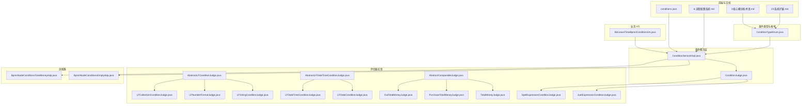
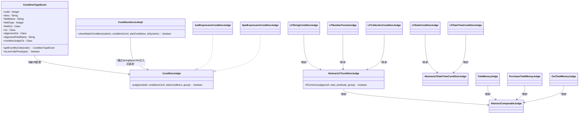
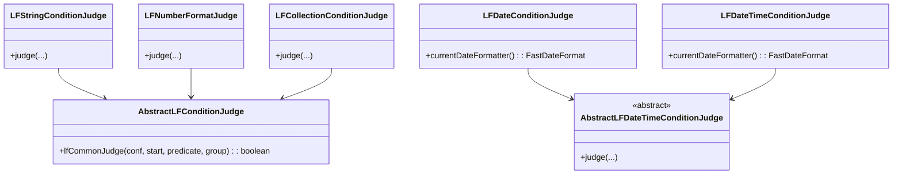
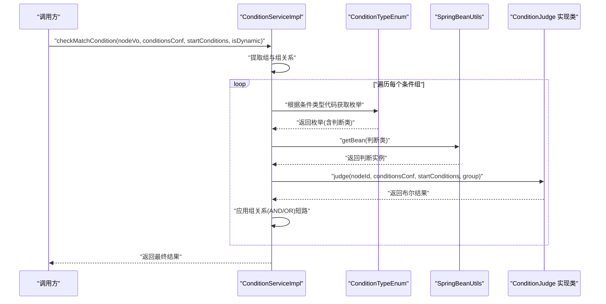
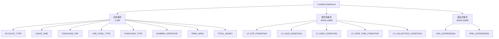
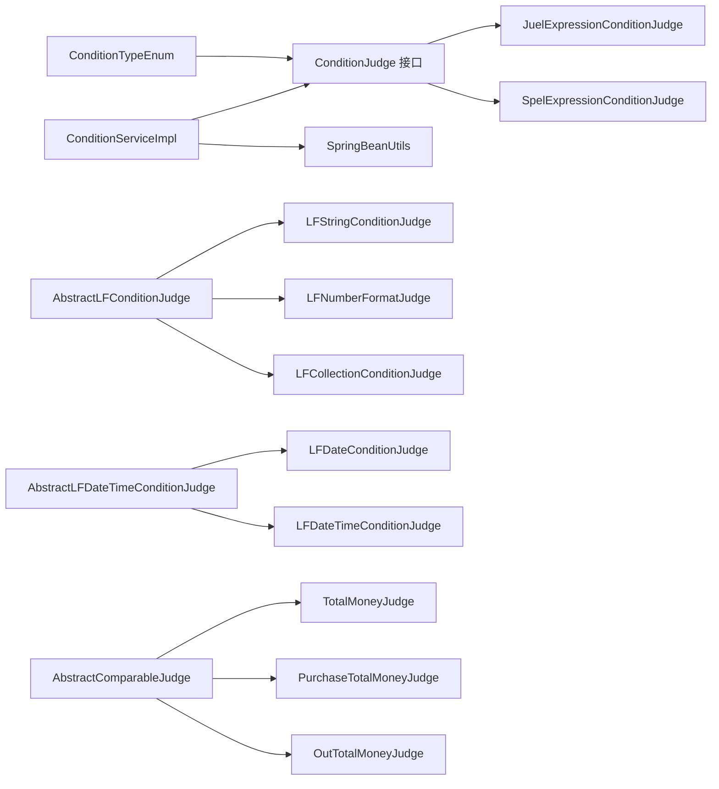

# 条件管理系统

<cite>
**本文引用的文件**
- [ConditionTypeEnum.java](file://antflow-engine/src/main/java/org/openoa/engine/bpmnconf/constant/enus/ConditionTypeEnum.java)
- [ConditionJudge.java](file://antflow-engine/src/main/java/org/openoa/engine/bpmnconf/adp/conditionfilter/ConditionJudge.java)
- [ConditionServiceImpl.java](file://antflow-engine/src/main/java/org/openoa/engine/bpmnconf/adp/conditionfilter/ConditionServiceImpl.java)
- [AbstractLFConditionJudge.java](file://antflow-engine/src/main/java/org/openoa/engine/bpmnconf/adp/conditionfilter/conditionjudge/AbstractLFConditionJudge.java)
- [LFStringConditionJudge.java](file://antflow-engine/src/main/java/org/openoa/engine/bpmnconf/adp/conditionfilter/conditionjudge/LFStringConditionJudge.java)
- [LFNumberFormatJudge.java](file://antflow-engine/src/main/java/org/openoa/engine/bpmnconf/adp/conditionfilter/conditionjudge/LFNumberFormatJudge.java)
- [LFDateConditionJudge.java](file://antflow-engine/src/main/java/org/openoa/engine/bpmnconf/adp/conditionfilter/conditionjudge/LFDateConditionJudge.java)
- [LFDateTimeConditionJudge.java](file://antflow-engine/src/main/java/org/openoa/engine/bpmnconf/adp/conditionfilter/conditionjudge/LFDateTimeConditionJudge.java)
- [LFCollectionConditionJudge.java](file://antflow-engine/src/main/java/org/openoa/engine/bpmnconf/adp/conditionfilter/conditionjudge/LFCollectionConditionJudge.java)
- [AbstractLFDateTimeConditionJudge.java](file://antflow-engine/src/main/java/org/openoa/engine/bpmnconf/adp/conditionfilter/conditionjudge/AbstractLFDateTimeConditionJudge.java)
- [AbstractComparableJudge.java](file://antflow-engine/src/main/java/org/openoa/engine/bpmnconf/adp/conditionfilter/conditionjudge/AbstractComparableJudge.java)
- [TotalMoneyJudge.java](file://antflow-engine/src/main/java/org/openoa/engine/bpmnconf/adp/conditionfilter/conditionjudge/TotalMoneyJudge.java)
- [PurchaseTotalMoneyJudge.java](file://antflow-engine/src/main/java/org/openoa/engine/bpmnconf/adp/conditionfilter/conditionjudge/PurchaseTotalMoneyJudge.java)
- [OutTotalMoneyJudge.java](file://antflow-engine/src/main/java/org/openoa/engine/bpmnconf/adp/conditionfilter/conditionjudge/OutTotalMoneyJudge.java)
- [JuelExpressionConditionJudge.java](file://antflow-engine/src/main/java/org/openoa/engine/bpmnconf/adp/conditionfilter/conditionjudge/JuelExpressionConditionJudge.java)
- [SpelExpressionConditionJudge.java](file://antflow-engine/src/main/java/org/openoa/engine/bpmnconf/adp/conditionfilter/conditionjudge/SpelExpressionConditionJudge.java)
- [BpmnNodeConditionsEmptyAdp.java](file://antflow-engine/src/main/java/org/openoa/engine/bpmnconf/adp/conditionfilter/nodetypeconditions/BpmnNodeConditionsEmptyAdp.java)
- [BpmnNodeConditionsTotalMoneyAdp.java](file://antflow-engine/src/main/java/org/openoa/engine/bpmnconf/adp/conditionfilter/nodetypeconditions/BpmnNodeConditionsTotalMoneyAdp.java)
- [BizLeaveTimeBpmnConditionsVo.java](file://antflow-web/src/main/java/org/vo/BizLeaveTimeBpmnConditionsVo.java)
- [conditions.json](file://antflow-vue/public/mock/conditions.json)
- [6.流程配置系统.md](file://doc/系统介绍篇/6.流程配置系统.md)
- [3.核心概念和术语.md](file://doc/系统介绍篇/3.核心概念和术语.md)
- [23.系统扩展.md](file://doc/系统介绍篇/23.系统扩展.md)
</cite>

## 目录
1. [简介](#简介)
2. [项目结构](#项目结构)
3. [核心组件](#核心组件)
4. [架构总览](#架构总览)
5. [详细组件分析](#详细组件分析)
6. [依赖分析](#依赖分析)
7. [性能考虑](#性能考虑)
8. [故障排查指南](#故障排查指南)
9. [结论](#结论)
10. [附录](#附录)

## 简介
本文件面向“条件管理系统”的概念解释与实现机制，系统性阐述如何通过灵活的规则引擎评估工作流路由决策，覆盖业务条件、低代码条件与表达式条件三大类。文档重点包括：
- ConditionTypeEnum 的分类体系与职责边界
- 业务条件（ACCOUNT_TYPE、LEAVE_TIME、PURCHASE_FEE 等）的设计原理与评估策略
- 低代码条件（LFString、LFNumber、LFDate、LFDateTime、LFCollection）的统一抽象与差异化实现
- 表达式条件（JUEL、SpEL）的解析与求值机制
- ConditionJudge 接口与各类条件评估器的实现机制
- 条件评估的完整流程图与 Spring Bean 注入的实际代码示例路径

## 项目结构
条件管理系统主要分布在以下模块与包中：
- 枚举与常量：org.openoa.engine.bpmnconf.constant.enus
- 条件服务与接口：org.openoa.engine.bpmnconf.adp.conditionfilter
- 条件评估器：org.openoa.engine.bpmnconf.adp.conditionfilter.conditionjudge
- 节点条件适配器：org.openoa.engine.bpmnconf.adp.conditionfilter.nodetypeconditions
- 前端 Mock 数据与文档：antflow-vue/public/mock、doc/系统介绍篇

图表来源
- [ConditionTypeEnum.java:1-171](file://antflow-engine/src/main/java/org/openoa/engine/bpmnconf/constant/enus/ConditionTypeEnum.java#L1-L171)
- [ConditionServiceImpl.java:1-137](file://antflow-engine/src/main/java/org/openoa/engine/bpmnconf/adp/conditionfilter/ConditionServiceImpl.java#L1-L137)
- [ConditionJudge.java:1-15](file://antflow-engine/src/main/java/org/openoa/engine/bpmnconf/adp/conditionfilter/ConditionJudge.java#L1-L15)
- [AbstractLFConditionJudge.java:1-59](file://antflow-engine/src/main/java/org/openoa/engine/bpmnconf/adp/conditionfilter/conditionjudge/AbstractLFConditionJudge.java#L1-L59)
- [LFStringConditionJudge.java:1-16](file://antflow-engine/src/main/java/org/openoa/engine/bpmnconf/adp/conditionfilter/conditionjudge/LFStringConditionJudge.java#L1-L16)
- [LFNumberFormatJudge.java:1-50](file://antflow-engine/src/main/java/org/openoa/engine/bpmnconf/adp/conditionfilter/conditionjudge/LFNumberFormatJudge.java#L1-L50)
- [LFDateConditionJudge.java:1-18](file://antflow-engine/src/main/java/org/openoa/engine/bpmnconf/adp/conditionfilter/conditionjudge/LFDateConditionJudge.java#L1-L18)
- [LFDateTimeConditionJudge.java:1-15](file://antflow-engine/src/main/java/org/openoa/engine/bpmnconf/adp/conditionfilter/conditionjudge/LFDateTimeConditionJudge.java#L1-L15)
- [AbstractLFDateTimeConditionJudge.java:1-40](file://antflow-engine/src/main/java/org/openoa/engine/bpmnconf/adp/conditionfilter/conditionjudge/AbstractLFDateTimeConditionJudge.java#L1-L40)
- [LFCollectionConditionJudge.java:1-47](file://antflow-engine/src/main/java/org/openoa/engine/bpmnconf/adp/conditionfilter/conditionjudge/LFCollectionConditionJudge.java#L1-L47)
- [AbstractComparableJudge.java:1-40](file://antflow-engine/src/main/java/org/openoa/engine/bpmnconf/adp/conditionfilter/conditionjudge/AbstractComparableJudge.java#L1-L40)
- [TotalMoneyJudge.java:1-22](file://antflow-engine/src/main/java/org/openoa/engine/bpmnconf/adp/conditionfilter/conditionjudge/TotalMoneyJudge.java#L1-L22)
- [PurchaseTotalMoneyJudge.java:1-23](file://antflow-engine/src/main/java/org/openoa/engine/bpmnconf/adp/conditionfilter/conditionjudge/PurchaseTotalMoneyJudge.java#L1-L23)
- [OutTotalMoneyJudge.java:1-33](file://antflow-engine/src/main/java/org/openoa/engine/bpmnconf/adp/conditionfilter/conditionjudge/OutTotalMoneyJudge.java#L1-L33)
- [JuelExpressionConditionJudge.java:1-16](file://antflow-engine/src/main/java/org/openoa/engine/bpmnconf/adp/conditionfilter/conditionjudge/JuelExpressionConditionConditionJudge.java#L1-L16)
- [SpelExpressionConditionJudge.java:1-16](file://antflow-engine/src/main/java/org/openoa/engine/bpmnconf/adp/conditionfilter/conditionjudge/SpelExpressionConditionJudge.java#L1-L16)
- [BpmnNodeConditionsEmptyAdp.java:1-24](file://antflow-engine/src/main/java/org/openoa/engine/bpmnconf/adp/conditionfilter/nodetypeconditions/BpmnNodeConditionsEmptyAdp.java#L1-L24)
- [BpmnNodeConditionsTotalMoneyAdp.java:1-19](file://antflow-engine/src/main/java/org/openoa/engine/bpmnconf/adp/conditionfilter/nodetypeconditions/BpmnNodeConditionsTotalMoneyAdp.java#L1-L19)
- [BizLeaveTimeBpmnConditionsVo.java:1-10](file://antflow-web/src/main/java/org/vo/BizLeaveTimeBpmnConditionsVo.java#L1-L10)
- [conditions.json:1-50](file://antflow-vue/public/mock/conditions.json#L1-L50)
- [6.流程配置系统.md:111-164](file://doc/系统介绍篇/6.流程配置系统.md#L111-L164)
- [3.核心概念和术语.md:109-171](file://doc/系统介绍篇/3.核心概念和术语.md#L109-L171)
- [23.系统扩展.md:188-218](file://doc/系统介绍篇/23.系统扩展.md#L188-L218)

章节来源
- [ConditionTypeEnum.java:1-171](file://antflow-engine/src/main/java/org/openoa/engine/bpmnconf/constant/enus/ConditionTypeEnum.java#L1-L171)
- [ConditionServiceImpl.java:1-137](file://antflow-engine/src/main/java/org/openoa/engine/bpmnconf/adp/conditionfilter/ConditionServiceImpl.java#L1-L137)
- [6.流程配置系统.md:111-164](file://doc/系统介绍篇/6.流程配置系统.md#L111-L164)
- [3.核心概念和术语.md:109-171](file://doc/系统介绍篇/3.核心概念和术语.md#L109-L171)
- [23.系统扩展.md:188-218](file://doc/系统介绍篇/23.系统扩展.md#L188-L218)

## 核心组件
- ConditionTypeEnum：定义所有可用条件类型，包含条件代码、字段名、字段类型、适配器类、对齐类、对齐字段及对应的判断类。支持业务条件、低代码条件与表达式条件三类。
- ConditionJudge 接口：统一的条件评估入口，接收节点 ID、条件配置、启动条件与组号，返回布尔结果。
- ConditionServiceImpl：条件评估调度器，负责按组与组间关系（AND/OR）迭代调用具体判断类，支持动态条件记录与迁移校验。

章节来源
- [ConditionTypeEnum.java:20-137](file://antflow-engine/src/main/java/org/openoa/engine/bpmnconf/constant/enus/ConditionTypeEnum.java#L20-L137)
- [ConditionJudge.java:10-14](file://antflow-engine/src/main/java/org/openoa/engine/bpmnconf/adp/conditionfilter/ConditionJudge.java#L10-L14)
- [ConditionServiceImpl.java:31-135](file://antflow-engine/src/main/java/org/openoa/engine/bpmnconf/adp/conditionfilter/ConditionServiceImpl.java#L31-L135)

## 架构总览
条件评估采用“枚举驱动 + 接口统一 + Bean 注入”的架构：
- 枚举层：集中声明条件类型与判断类映射
- 服务层：按组与组关系顺序评估，失败短路
- 适配器层：节点条件配置的前后端适配
- 评估器层：针对不同条件类型的差异化实现

图表来源
- [ConditionTypeEnum.java:20-137](file://antflow-engine/src/main/java/org/openoa/engine/bpmnconf/constant/enus/ConditionTypeEnum.java#L20-L137)
- [ConditionJudge.java:10-14](file://antflow-engine/src/main/java/org/openoa/engine/bpmnconf/adp/conditionfilter/ConditionJudge.java#L10-L14)
- [ConditionServiceImpl.java:31-135](file://antflow-engine/src/main/java/org/openoa/engine/bpmnconf/adp/conditionfilter/ConditionServiceImpl.java#L31-L135)
- [AbstractLFConditionJudge.java:16-58](file://antflow-engine/src/main/java/org/openoa/engine/bpmnconf/adp/conditionfilter/conditionjudge/AbstractLFConditionJudge.java#L16-L58)
- [LFStringConditionJudge.java:10-14](file://antflow-engine/src/main/java/org/openoa/engine/bpmnconf/adp/conditionfilter/conditionjudge/LFStringConditionJudge.java#L10-L14)
- [LFNumberFormatJudge.java:14-46](file://antflow-engine/src/main/java/org/openoa/engine/bpmnconf/adp/conditionfilter/conditionjudge/LFNumberFormatJudge.java#L14-L46)
- [LFDateConditionJudge.java:11-17](file://antflow-engine/src/main/java/org/openoa/engine/bpmnconf/adp/conditionfilter/conditionjudge/LFDateConditionJudge.java#L11-L17)
- [LFDateTimeConditionJudge.java:8-14](file://antflow-engine/src/main/java/org/openoa/engine/bpmnconf/adp/conditionfilter/conditionjudge/LFDateTimeConditionJudge.java#L8-L14)
- [AbstractLFDateTimeConditionJudge.java:14-39](file://antflow-engine/src/main/java/org/openoa/engine/bpmnconf/adp/conditionfilter/conditionjudge/AbstractLFDateTimeConditionJudge.java#L14-L39)
- [LFCollectionConditionJudge.java:14-45](file://antflow-engine/src/main/java/org/openoa/engine/bpmnconf/adp/conditionfilter/conditionjudge/LFCollectionConditionJudge.java#L14-L45)
- [AbstractComparableJudge.java:15-40](file://antflow-engine/src/main/java/org/openoa/engine/bpmnconf/adp/conditionfilter/conditionjudge/AbstractComparableJudge.java#L15-L40)
- [TotalMoneyJudge.java:10-22](file://antflow-engine/src/main/java/org/openoa/engine/bpmnconf/adp/conditionfilter/conditionjudge/TotalMoneyJudge.java#L10-L22)
- [PurchaseTotalMoneyJudge.java:10-23](file://antflow-engine/src/main/java/org/openoa/engine/bpmnconf/adp/conditionfilter/conditionjudge/PurchaseTotalMoneyJudge.java#L10-L23)
- [OutTotalMoneyJudge.java:16-33](file://antflow-engine/src/main/java/org/openoa/engine/bpmnconf/adp/conditionfilter/conditionjudge/OutTotalMoneyJudge.java#L16-L33)
- [JuelExpressionConditionJudge.java:9-16](file://antflow-engine/src/main/java/org/openoa/engine/bpmnconf/adp/conditionfilter/conditionjudge/JuelExpressionConditionJudge.java#L9-L16)
- [SpelExpressionConditionJudge.java:9-16](file://antflow-engine/src/main/java/org/openoa/engine/bpmnconf/adp/conditionfilter/conditionjudge/SpelExpressionConditionJudge.java#L9-L16)

## 详细组件分析

### ConditionTypeEnum 分类体系
- 业务条件（1-999）：如 ACCOUNT_TYPE、LEAVE_TIME、PURCHASE_FEE、JOB_LEVEL_TYPE、PURCHASE_TYPE、NUMBER_OPERATOR、PARK_AREA、TOTAL_MONEY 等，通常与业务实体字段对齐，使用对齐类与对齐字段进行比对。
- 低代码条件（10000-10999）：如 LF_STR_CONDITION、LF_NUM_CONDITION、LF_DATE_CONDITION、LF_DATE_TIME_CONDITION、LF_COLLECTION_CONDITION，统一从低代码容器字段读取条件，通过抽象基类实现一致的比对逻辑。
- 表达式条件（20000-20999）：如 JUEL_EXPRESSION、SPEL_EXPRESSION，直接以表达式字符串参与求值。

章节来源
- [ConditionTypeEnum.java:21-66](file://antflow-engine/src/main/java/org/openoa/engine/bpmnconf/constant/enus/ConditionTypeEnum.java#L21-L66)
- [3.核心概念和术语.md:109-171](file://doc/系统介绍篇/3.核心概念和术语.md#L109-L171)
- [23.系统扩展.md:188-218](file://doc/系统介绍篇/23.系统扩展.md#L188-L218)

### 业务条件设计与评估
- ACCOUNT_TYPE：第三方账户类型条件，使用适配器与对齐类进行字段比对。
- LEAVE_TIME：请假时长条件，使用业务 VO 扩展字段，结合判断器完成比较。
- PURCHASE_FEE：采购费用条件，支持金额字段的比较逻辑。
- JOB_LEVEL_TYPE：职级列表条件，对结构化对象进行匹配。
- NUMBER_OPERATOR：数字运算符条件，作为通用运算符占位。
- PARK_AREA：园区面积条件，演示型实现。
- TOTAL_MONEY：总金额条件，与金额字段对齐。

章节来源
- [ConditionTypeEnum.java:21-43](file://antflow-engine/src/main/java/org/openoa/engine/bpmnconf/constant/enus/ConditionTypeEnum.java#L21-L43)
- [BizLeaveTimeBpmnConditionsVo.java:8-10](file://antflow-web/src/main/java/org/vo/BizLeaveTimeBpmnConditionsVo.java#L8-L10)

### 低代码条件统一抽象与实现
- 抽象基类 AbstractLFConditionJudge：统一从 groupedLfConditionsMap 与 lfConditions 中取值，通过 predicate 对比，支持组内 AND/OR 短路。
- LFStringConditionJudge：字符串忽略大小写相等比较。
- LFNumberFormatJudge：支持单值与区间（逗号分隔）比较，兼容布尔与数值，统一使用 BigDecimal 比较。
- LFDateConditionJudge / LFDateTimeConditionJudge：基于日期格式化器解析字符串为时间戳进行比较。
- LFCollectionConditionJudge：集合成员资格判断，支持用户输入为集合或单值。

图表来源
- [AbstractLFConditionJudge.java:16-58](file://antflow-engine/src/main/java/org/openoa/engine/bpmnconf/adp/conditionfilter/conditionjudge/AbstractLFConditionJudge.java#L16-L58)
- [LFStringConditionJudge.java:10-14](file://antflow-engine/src/main/java/org/openoa/engine/bpmnconf/adp/conditionfilter/conditionjudge/LFStringConditionJudge.java#L10-L14)
- [LFNumberFormatJudge.java:14-46](file://antflow-engine/src/main/java/org/openoa/engine/bpmnconf/adp/conditionfilter/conditionjudge/LFNumberFormatJudge.java#L14-L46)
- [AbstractLFDateTimeConditionJudge.java:14-39](file://antflow-engine/src/main/java/org/openoa/engine/bpmnconf/adp/conditionfilter/conditionjudge/AbstractLFDateTimeConditionJudge.java#L14-L39)
- [LFDateConditionJudge.java:11-17](file://antflow-engine/src/main/java/org/openoa/engine/bpmnconf/adp/conditionfilter/conditionjudge/LFDateConditionJudge.java#L11-L17)
- [LFDateTimeConditionJudge.java:8-14](file://antflow-engine/src/main/java/org/openoa/engine/bpmnconf/adp/conditionfilter/conditionjudge/LFDateTimeConditionJudge.java#L8-L14)
- [LFCollectionConditionJudge.java:14-45](file://antflow-engine/src/main/java/org/openoa/engine/bpmnconf/adp/conditionfilter/conditionjudge/LFCollectionConditionJudge.java#L14-L45)

章节来源
- [AbstractLFConditionJudge.java:16-58](file://antflow-engine/src/main/java/org/openoa/engine/bpmnconf/adp/conditionfilter/conditionjudge/AbstractLFConditionJudge.java#L16-L58)
- [LFNumberFormatJudge.java:14-46](file://antflow-engine/src/main/java/org/openoa/engine/bpmnconf/adp/conditionfilter/conditionjudge/LFNumberFormatJudge.java#L14-L46)
- [LFCollectionConditionJudge.java:14-45](file://antflow-engine/src/main/java/org/openoa/engine/bpmnconf/adp/conditionfilter/conditionjudge/LFCollectionConditionJudge.java#L14-L45)

### 表达式条件设计原理
- JUEL 表达式条件：从条件配置中读取表达式字符串，交由 JuelEvaluator 求值。
- SpEL 表达式条件：从条件配置中读取表达式字符串，交由 SpelEvaluator 求值。
- 两者均实现 ConditionJudge 接口，统一由服务层注入并调用。

章节来源
- [JuelExpressionConditionJudge.java:9-16](file://antflow-engine/src/main/java/org/openoa/engine/bpmnconf/adp/conditionfilter/conditionjudge/JuelExpressionConditionJudge.java#L9-L16)
- [SpelExpressionConditionJudge.java:9-16](file://antflow-engine/src/main/java/org/openoa/engine/bpmnconf/adp/conditionfilter/conditionjudge/SpelExpressionConditionJudge.java#L9-L16)
- [23.系统扩展.md:188-218](file://doc/系统介绍篇/23.系统扩展.md#L188-L218)

### 数值比较与区间判断机制
- AbstractComparableJudge：提供统一的比较逻辑，支持大于等于、大于、小于等于、小于、区间等运算符。
- TotalMoneyJudge / PurchaseTotalMoneyJudge / OutTotalMoneyJudge：分别针对不同金额字段进行比较，其中 OutTotalMoneyJudge 对空值进行显式校验与异常抛出。

章节来源
- [AbstractComparableJudge.java:15-40](file://antflow-engine/src/main/java/org/openoa/engine/bpmnconf/adp/conditionfilter/conditionjudge/AbstractComparableJudge.java#L15-L40)
- [TotalMoneyJudge.java:10-22](file://antflow-engine/src/main/java/org/openoa/engine/bpmnconf/adp/conditionfilter/conditionjudge/TotalMoneyJudge.java#L10-L22)
- [PurchaseTotalMoneyJudge.java:10-23](file://antflow-engine/src/main/java/org/openoa/engine/bpmnconf/adp/conditionfilter/conditionjudge/PurchaseTotalMoneyJudge.java#L10-L23)
- [OutTotalMoneyJudge.java:16-33](file://antflow-engine/src/main/java/org/openoa/engine/bpmnconf/adp/conditionfilter/conditionjudge/OutTotalMoneyJudge.java#L16-L33)

### 条件评估完整流程（含 Spring Bean 注入）

图表来源
- [ConditionServiceImpl.java:35-98](file://antflow-engine/src/main/java/org/openoa/engine/bpmnconf/adp/conditionfilter/ConditionServiceImpl.java#L35-L98)
- [ConditionTypeEnum.java:62-66](file://antflow-engine/src/main/java/org/openoa/engine/bpmnconf/constant/enus/ConditionTypeEnum.java#L62-L66)

章节来源
- [ConditionServiceImpl.java:35-98](file://antflow-engine/src/main/java/org/openoa/engine/bpmnconf/adp/conditionfilter/ConditionServiceImpl.java#L35-L98)
- [6.流程配置系统.md:173-221](file://doc/系统介绍篇/6.流程配置系统.md#L173-L221)

### 条件类型层次结构与关系

图表来源
- [3.核心概念和术语.md:109-171](file://doc/系统介绍篇/3.核心概念和术语.md#L109-L171)
- [ConditionTypeEnum.java:21-66](file://antflow-engine/src/main/java/org/openoa/engine/bpmnconf/constant/enus/ConditionTypeEnum.java#L21-L66)

章节来源
- [3.核心概念和术语.md:109-171](file://doc/系统介绍篇/3.核心概念和术语.md#L109-L171)
- [ConditionTypeEnum.java:21-66](file://antflow-engine/src/main/java/org/openoa/engine/bpmnconf/constant/enus/ConditionTypeEnum.java#L21-L66)

## 依赖分析
- 组件耦合与内聚
  - ConditionTypeEnum 与各 ConditionJudge 实现类通过枚举映射解耦，便于扩展新条件类型。
  - ConditionServiceImpl 仅依赖接口与 Spring Bean 注入，降低对具体实现的耦合。
  - 低代码条件共享 AbstractLFConditionJudge，提升内聚性与复用性。
- 外部依赖
  - JUEL/SpEL 解析器用于表达式条件求值。
  - 日期格式化工具用于日期/时间条件解析。
  - Spring Bean 工具用于运行时获取判断类实例。

图表来源
- [ConditionTypeEnum.java:20-137](file://antflow-engine/src/main/java/org/openoa/engine/bpmnconf/constant/enus/ConditionTypeEnum.java#L20-L137)
- [ConditionServiceImpl.java:31-135](file://antflow-engine/src/main/java/org/openoa/engine/bpmnconf/adp/conditionfilter/ConditionServiceImpl.java#L31-L135)
- [AbstractLFConditionJudge.java:16-58](file://antflow-engine/src/main/java/org/openoa/engine/bpmnconf/adp/conditionfilter/conditionjudge/AbstractLFConditionJudge.java#L16-L58)
- [AbstractLFDateTimeConditionJudge.java:14-39](file://antflow-engine/src/main/java/org/openoa/engine/bpmnconf/adp/conditionfilter/conditionjudge/AbstractLFDateTimeConditionJudge.java#L14-L39)
- [AbstractComparableJudge.java:15-40](file://antflow-engine/src/main/java/org/openoa/engine/bpmnconf/adp/conditionfilter/conditionjudge/AbstractComparableJudge.java#L15-L40)
- [JuelExpressionConditionJudge.java:9-16](file://antflow-engine/src/main/java/org/openoa/engine/bpmnconf/adp/conditionfilter/conditionjudge/JuelExpressionConditionJudge.java#L9-L16)
- [SpelExpressionConditionJudge.java:9-16](file://antflow-engine/src/main/java/org/openoa/engine/bpmnconf/adp/conditionfilter/conditionjudge/SpelExpressionConditionJudge.java#L9-L16)

章节来源
- [ConditionServiceImpl.java:31-135](file://antflow-engine/src/main/java/org/openoa/engine/bpmnconf/adp/conditionfilter/ConditionServiceImpl.java#L31-L135)
- [AbstractLFConditionJudge.java:16-58](file://antflow-engine/src/main/java/org/openoa/engine/bpmnconf/adp/conditionfilter/conditionjudge/AbstractLFConditionJudge.java#L16-L58)

## 性能考虑
- 短路评估：AND 关系下任一条件失败立即返回，OR 关系下任一条件成功立即返回，减少不必要的判断。
- 去重与去空：条件参数列表先去重再迭代，避免重复计算。
- 数值比较：统一使用 BigDecimal，避免浮点误差；数字格式化保留两位小数，确保一致性。
- 日期比较：统一转为时间戳进行比较，减少格式差异带来的开销。
- 动态条件记录：仅在非预览且结果为真时记录，降低持久化压力。

## 故障排查指南
- 条件类型为空：当条件类型代码无法映射到枚举时，抛出业务异常，需检查流程配置。
- 低代码条件缺失：若数据库侧条件为空或用户侧条件为空，将触发异常或返回 false，需确认前端提交与后端存储。
- 金额字段为空：支出费用条件对空值进行显式校验并抛出异常，需确保启动条件中金额字段已填充。
- 表达式解析异常：JUEL/SpEL 表达式语法错误会导致求值失败，需检查表达式字符串与上下文变量。
- 迁移校验异常：动态条件网关在迁移预校验阶段若检测到条件变化，会抛出异常并记录变更。

章节来源
- [ConditionServiceImpl.java:40-57](file://antflow-engine/src/main/java/org/openoa/engine/bpmnconf/adp/conditionfilter/ConditionServiceImpl.java#L40-L57)
- [AbstractLFConditionJudge.java:21-32](file://antflow-engine/src/main/java/org/openoa/engine/bpmnconf/adp/conditionfilter/conditionjudge/AbstractLFConditionJudge.java#L21-L32)
- [OutTotalMoneyJudge.java:21-25](file://antflow-engine/src/main/java/org/openoa/engine/bpmnconf/adp/conditionfilter/conditionjudge/OutTotalMoneyJudge.java#L21-L25)
- [JuelExpressionConditionJudge.java:12-15](file://antflow-engine/src/main/java/org/openoa/engine/bpmnconf/adp/conditionfilter/conditionjudge/JuelExpressionConditionJudge.java#L12-L15)
- [SpelExpressionConditionJudge.java:12-15](file://antflow-engine/src/main/java/org/openoa/engine/bpmnconf/adp/conditionfilter/conditionjudge/SpelExpressionConditionJudge.java#L12-L15)
- [ConditionServiceImpl.java:106-124](file://antflow-engine/src/main/java/org/openoa/engine/bpmnconf/adp/conditionfilter/ConditionServiceImpl.java#L106-L124)

## 结论
条件管理系统通过“枚举 + 接口 + Bean 注入”的设计，实现了业务条件、低代码条件与表达式条件的统一评估框架。低代码条件以抽象基类为核心，既保证了灵活性，又确保了跨字段、跨类型的可比性。服务层以短路与去重策略优化性能，并通过动态条件记录与迁移校验保障流程演进的可控性。该体系易于扩展新的条件类型与评估器，满足复杂工作流路由决策需求。

## 附录
- 前端低代码字段示例（Mock 数据）：展示账户类型、请假时长、采购费用等字段的前端配置形态，便于理解低代码容器字段与后端条件的映射关系。
- 文档参考：流程配置系统与核心概念、系统扩展文档提供了条件类型与评估流程的权威说明。

章节来源
- [conditions.json:1-50](file://antflow-vue/public/mock/conditions.json#L1-L50)
- [6.流程配置系统.md:111-164](file://doc/系统介绍篇/6.流程配置系统.md#L111-L164)
- [3.核心概念和术语.md:109-171](file://doc/系统介绍篇/3.核心概念和术语.md#L109-L171)
- [23.系统扩展.md:188-218](file://doc/系统介绍篇/23.系统扩展.md#L188-L218)