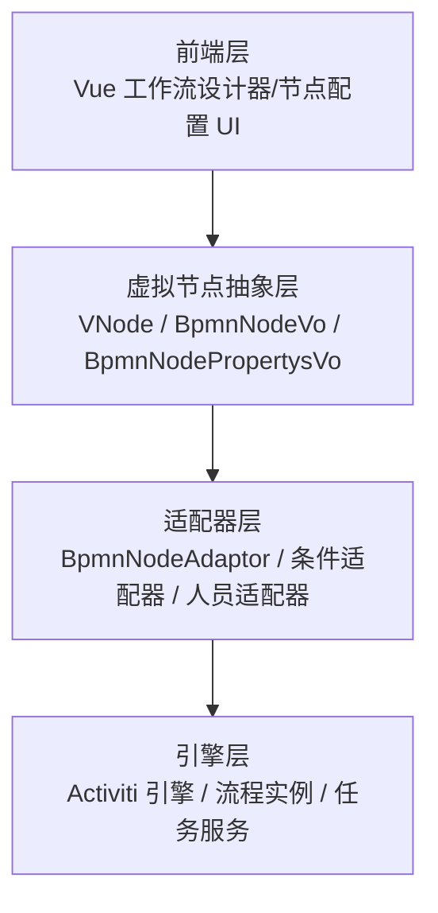
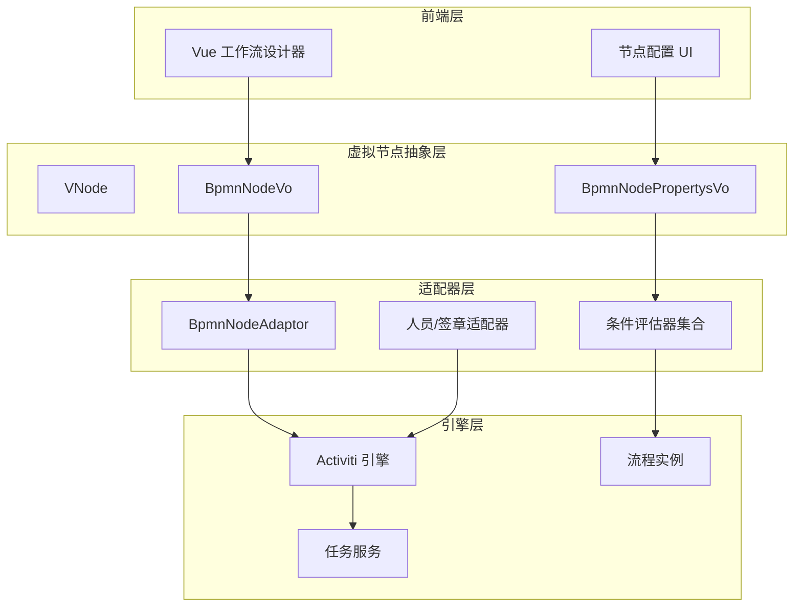
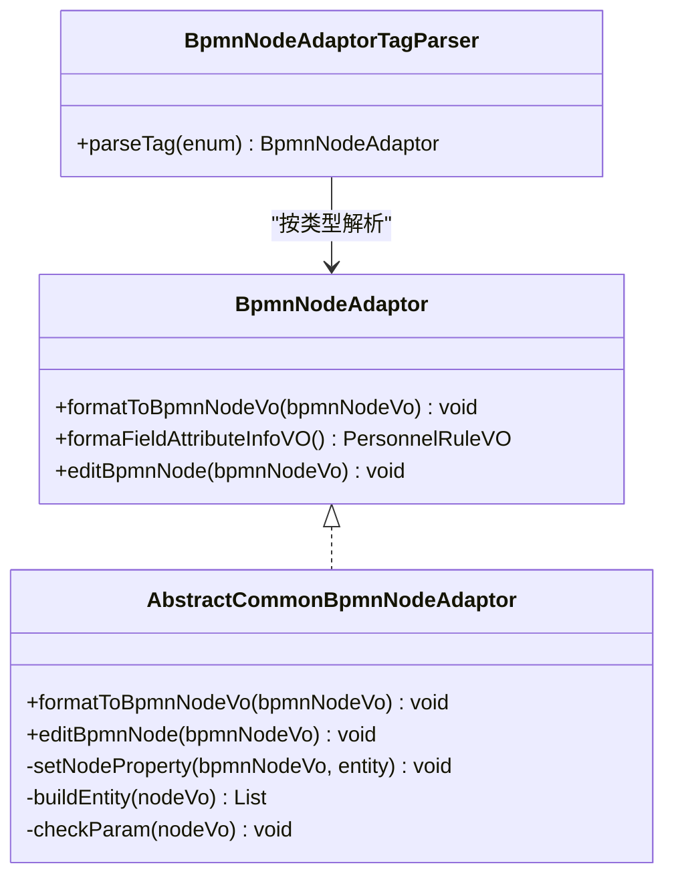
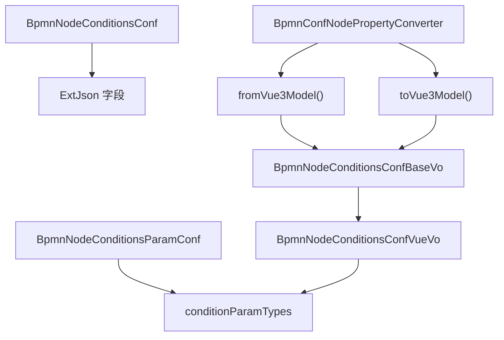
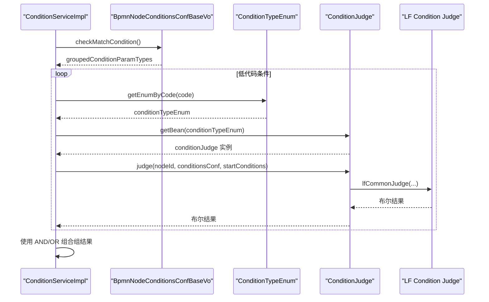
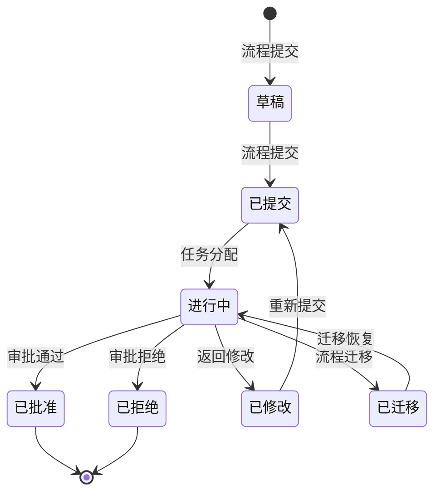
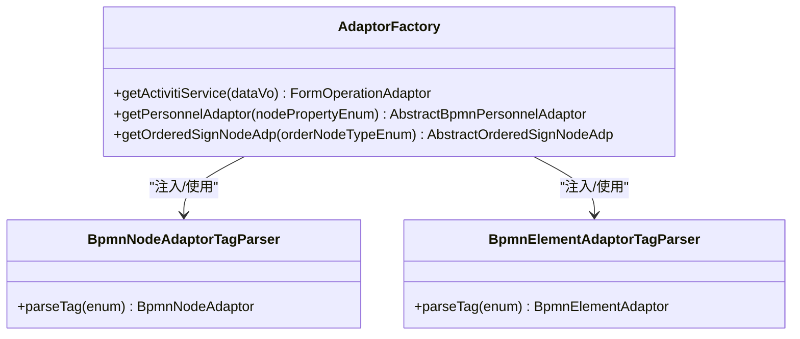
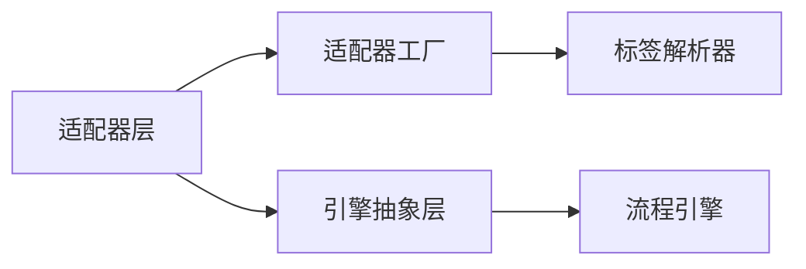

# 核心概念与术语

<cite>
**本文引用的文件**
- [核心概念和术语.md](file://doc/系统介绍篇/3.核心概念和术语.md)
- [FormAdapter.java](file://antflow-engine/src/main/java/org/openoa/engine/bpmnconf/adp/FormAdapter.java)
- [AdaptorFactory.java](file://antflow-engine/src/main/java/org/openoa/engine/factory/AdaptorFactory.java)
- [BpmnNodeAdaptor.java](file://antflow-engine/src/main/java/org/openoa/engine/bpmnconf/adp/bpmnnodeadp/BpmnNodeAdaptor.java)
- [AbstractCommonBpmnNodeAdaptor.java](file://antflow-engine/src/main/java/org/openoa/engine/bpmnconf/adp/bpmnnodeadp/AbstractCommonBpmnNodeAdaptor.java)
- [BpmnNodeAdaptorTagParser.java](file://antflow-engine/src/main/java/org/openoa/engine/bpmnconf/service/tagparser/BpmnNodeAdaptorTagParser.java)
- [BpmnElementAdaptorTagParser.java](file://antflow-engine/src/main/java/org/openoa/engine/bpmnconf/service/tagparser/BpmnElementAdaptorTagParser.java)
- [ProcessOperationAdaptor.java](file://antflow-base/src/main/java/org/openoa/base/interf/ProcessOperationAdaptor.java)
- [ProcessConstants.java](file://antflow-engine/src/main/java/org/openoa/engine/bpmnconf/common/ProcessConstants.java)
</cite>

## 目录
1. [引言](#引言)
2. [项目结构](#项目结构)
3. [核心组件](#核心组件)
4. [架构总览](#架构总览)
5. [详细组件分析](#详细组件分析)
6. [依赖关系分析](#依赖关系分析)
7. [性能考量](#性能考量)
8. [故障排查指南](#故障排查指南)
9. [结论](#结论)
10. [附录](#附录)

## 引言
本文件面向希望深入理解 AntFlow 核心理念与术语的开发者，围绕以下主题展开：
- 虚拟节点（VNode）模式的设计原理与实现机制，以及与传统流程引擎的差异与优势
- 低代码开发与 BPMN 配置系统的工作原理
- 流程引擎抽象层设计
- 关键术语解析：节点适配器、表单适配器、条件评估器、流程操作适配器等
- 概念图与代码路径指引，帮助建立正确的技术认知框架

## 项目结构
AntFlow 将“流程设计器”与“执行引擎”解耦，通过“虚拟节点”与“适配器层”实现跨引擎的可移植性与可扩展性。前端使用 Vue 设计器生成结构化配置，后端通过适配器将配置映射到具体流程引擎（如 Activiti），并以统一的抽象层承载业务规则与流程控制。

**图示来源**
- [核心概念和术语.md:5-49](file://doc/系统介绍篇/3.核心概念和术语.md#L5-L49)

**章节来源**
- [核心概念和术语.md:1-49](file://doc/系统介绍篇/3.核心概念和术语.md#L1-L49)

## 核心组件
- 虚拟节点（VNode）与 BPMN 抽象
  - VNode 将流程节点的“配置”与“执行”解耦，避免直接绑定到某一个具体引擎 API，从而提升可移植性与可演进性。
  - BpmnNodeVo 与 BpmnNodePropertysVo 承载节点配置与属性，作为前后端交互的契约对象。
- 适配器体系
  - 节点适配器：将 VNode 配置格式化为引擎可识别的节点形态，并支持编辑与持久化。
  - 表单适配器：负责流程启动、初始化、提交、审批、回退、终止等生命周期中的数据处理。
  - 条件评估器：对业务条件、低代码条件与表达式条件进行统一评估，支持 AND/OR 组合。
  - 流程操作适配器：封装按钮操作（提交、审批、拒绝、跳转等）的执行入口。
- 引擎抽象层
  - 通过 ProcessConstants 等服务，屏蔽底层引擎细节，向上提供统一的流程查询、任务管理与状态判断能力。

**章节来源**
- [核心概念和术语.md:51-101](file://doc/系统介绍篇/3.核心概念和术语.md#L51-L101)
- [核心概念和术语.md:105-171](file://doc/系统介绍篇/3.核心概念和术语.md#L105-L171)
- [核心概念和术语.md:202-216](file://doc/系统介绍篇/3.核心概念和术语.md#L202-L216)
- [ProcessConstants.java:32-158](file://antflow-engine/src/main/java/org/openoa/engine/bpmnconf/common/ProcessConstants.java#L32-L158)

## 架构总览
下图展示了从“前端设计器”到“引擎执行”的全链路，强调“虚拟节点”与“适配器层”的桥梁作用。

**图示来源**
- [核心概念和术语.md:5-49](file://doc/系统介绍篇/3.核心概念和术语.md#L5-L49)

**章节来源**
- [核心概念和术语.md:51-101](file://doc/系统介绍篇/3.核心概念和术语.md#L51-L101)

## 详细组件分析

### 虚拟节点（VNode）模式与实现机制
- 设计目标
  - 将“流程配置”与“引擎实现”解耦，避免业务对具体引擎 API 的强绑定，便于迁移与替换。
  - 通过 VNode 与 BpmnNodeVo/BpmnNodePropertysVo 的标准化契约，确保前后端一致的数据结构。
- 关键实现要点
  - 节点适配器接口定义了格式化与编辑能力，保证不同节点类型的统一处理入口。
  - 适配器工厂与标签解析器配合，按节点类型动态选择合适的适配器实例。
  - 常规节点适配器基类提供通用的实体查询、参数校验与批量保存能力，降低重复实现成本。

**图示来源**
- [BpmnNodeAdaptor.java:12-30](file://antflow-engine/src/main/java/org/openoa/engine/bpmnconf/adp/bpmnnodeadp/BpmnNodeAdaptor.java#L12-L30)
- [AbstractCommonBpmnNodeAdaptor.java:15-47](file://antflow-engine/src/main/java/org/openoa/engine/bpmnconf/adp/bpmnnodeadp/AbstractCommonBpmnNodeAdaptor.java#L15-L47)
- [BpmnNodeAdaptorTagParser.java:16-30](file://antflow-engine/src/main/java/org/openoa/engine/bpmnconf/service/tagparser/BpmnNodeAdaptorTagParser.java#L16-L30)

**章节来源**
- [BpmnNodeAdaptor.java:12-30](file://antflow-engine/src/main/java/org/openoa/engine/bpmnconf/adp/bpmnnodeadp/BpmnNodeAdaptor.java#L12-L30)
- [AbstractCommonBpmnNodeAdaptor.java:15-47](file://antflow-engine/src/main/java/org/openoa/engine/bpmnconf/adp/bpmnnodeadp/AbstractCommonBpmnNodeAdaptor.java#L15-L47)
- [BpmnNodeAdaptorTagParser.java:16-30](file://antflow-engine/src/main/java/org/openoa/engine/bpmnconf/service/tagparser/BpmnNodeAdaptorTagParser.java#L16-L30)

### BPMN 配置系统与低代码工作流
- 配置系统职责
  - 通过结构化配置管理流程定义、节点属性与路由逻辑，分离“流程流”与“业务规则”，提升可维护性与可演进性。
  - 属性转换器负责前端 Vue 模型与后端配置对象之间的双向转换，确保设计器与执行引擎的无缝衔接。
- 低代码条件存储
  - 低代码条件采用容器字段方式集中存储于 Map 结构，支持灵活的无模式条件定义与动态评估。

**图示来源**
- [核心概念和术语.md:57-101](file://doc/系统介绍篇/3.核心概念和术语.md#L57-L101)

**章节来源**
- [核心概念和术语.md:51-101](file://doc/系统介绍篇/3.核心概念和术语.md#L51-L101)
- [核心概念和术语.md:202-216](file://doc/系统介绍篇/3.核心概念和术语.md#L202-L216)

### 条件评估器与评估流程
- 条件类型分层
  - 业务条件、低代码条件、表达式条件三大类，分别对应不同的评估策略与实现。
  - 低代码条件共享抽象评估器，减少重复实现并统一评估语义。
- 评估流程
  - 服务层按组遍历条件，通过枚举定位评估器，调用 judge 方法执行评估，并使用 AND/OR 组合得到最终结果。

**图示来源**
- [核心概念和术语.md:175-198](file://doc/系统介绍篇/3.核心概念和术语.md#L175-L198)

**章节来源**
- [核心概念和术语.md:105-171](file://doc/系统介绍篇/3.核心概念和术语.md#L105-L171)
- [核心概念和术语.md:175-198](file://doc/系统介绍篇/3.核心概念和术语.md#L175-L198)

### 表单适配器与流程生命周期
- 表单适配器（已废弃）与流程操作适配器
  - 表单适配器接口定义了预览条件设置、初始化数据、启动参数、数据查询、提交、同意、退回、取消、完成等生命周期方法。
  - 流程操作适配器用于封装按钮操作（如提交、审批、拒绝、跳转等）的执行入口。
- 生命周期状态机
  - 提交、审批、拒绝、返回修改、迁移等操作形成清晰的状态流转，配合历史记录与动态条件跟踪，支撑复杂流程治理。

**图示来源**
- [核心概念和术语.md:223-236](file://doc/系统介绍篇/3.核心概念和术语.md#L223-L236)

**章节来源**
- [FormAdapter.java:10-81](file://antflow-engine/src/main/java/org/openoa/engine/bpmnconf/adp/FormAdapter.java#L10-L81)
- [ProcessOperationAdaptor.java:8-12](file://antflow-base/src/main/java/org/openoa/base/interf/ProcessOperationAdaptor.java#L8-L12)
- [核心概念和术语.md:217-239](file://doc/系统介绍篇/3.核心概念和术语.md#L217-L239)

### 适配器工厂与标签解析器
- 适配器工厂
  - 通过注解标记与标签解析器协作，按节点类型或人员类型动态获取对应的适配器实例。
- 标签解析器
  - BpmnNodeAdaptorTagParser 与 BpmnElementAdaptorTagParser 分别负责节点与元素适配器的解析与选择。

**图示来源**
- [AdaptorFactory.java:14-34](file://antflow-engine/src/main/java/org/openoa/engine/factory/AdaptorFactory.java#L14-L34)
- [BpmnNodeAdaptorTagParser.java:16-30](file://antflow-engine/src/main/java/org/openoa/engine/bpmnconf/service/tagparser/BpmnNodeAdaptorTagParser.java#L16-L30)
- [BpmnElementAdaptorTagParser.java:16-31](file://antflow-engine/src/main/java/org/openoa/engine/bpmnconf/service/tagparser/BpmnElementAdaptorTagParser.java#L16-L31)

**章节来源**
- [AdaptorFactory.java:14-34](file://antflow-engine/src/main/java/org/openoa/engine/factory/AdaptorFactory.java#L14-L34)
- [BpmnNodeAdaptorTagParser.java:16-30](file://antflow-engine/src/main/java/org/openoa/engine/bpmnconf/service/tagparser/BpmnNodeAdaptorTagParser.java#L16-L30)
- [BpmnElementAdaptorTagParser.java:16-31](file://antflow-engine/src/main/java/org/openoa/engine/bpmnconf/service/tagparser/BpmnElementAdaptorTagParser.java#L16-L31)

## 依赖关系分析
- 低内聚高耦合风险控制
  - 通过“虚拟节点抽象层”与“适配器层”隔离引擎差异，降低对具体引擎 API 的直接依赖。
- 适配器与工厂的协作
  - 工厂负责实例化与选择，标签解析器负责按类型匹配，二者结合实现运行时的动态适配。
- 引擎抽象层的稳定性
  - ProcessConstants 等服务向上暴露统一接口，向下屏蔽引擎细节，有助于长期演进与替换。

**图示来源**
- [核心概念和术语.md:5-49](file://doc/系统介绍篇/3.核心概念和术语.md#L5-L49)
- [AdaptorFactory.java:14-34](file://antflow-engine/src/main/java/org/openoa/engine/factory/AdaptorFactory.java#L14-L34)
- [ProcessConstants.java:32-158](file://antflow-engine/src/main/java/org/openoa/engine/bpmnconf/common/ProcessConstants.java#L32-L158)

**章节来源**
- [核心概念和术语.md:51-101](file://doc/系统介绍篇/3.核心概念和术语.md#L51-L101)
- [ProcessConstants.java:32-158](file://antflow-engine/src/main/java/org/openoa/engine/bpmnconf/common/ProcessConstants.java#L32-L158)

## 性能考量
- 适配器解析的缓存与复用
  - 标签解析器按类型查找适配器时应避免重复扫描，建议在工厂层引入缓存或懒加载策略。
- 条件评估的短路与分组
  - 对大量条件的评估应优先短路与分组，减少不必要的计算开销。
- 批量持久化优化
  - 常规节点适配器基类提供批量保存能力，建议在编辑节点时合并多次写入，降低数据库压力。

## 故障排查指南
- 无法找到适配器实例
  - 检查标签解析器是否正确注册，确认适配器实现类是否被 Spring 扫描并暴露为 Bean。
  - 参考路径：[BpmnNodeAdaptorTagParser.java:16-30](file://antflow-engine/src/main/java/org/openoa/engine/bpmnconf/service/tagparser/BpmnNodeAdaptorTagParser.java#L16-L30)，[BpmnElementAdaptorTagParser.java:16-31](file://antflow-engine/src/main/java/org/openoa/engine/bpmnconf/service/tagparser/BpmnElementAdaptorTagParser.java#L16-L31)
- 条件评估异常
  - 核对条件类型枚举与评估器映射关系，检查评估器实现是否覆盖所有分支。
  - 参考路径：[核心概念和术语.md:175-198](file://doc/系统介绍篇/3.核心概念和术语.md#L175-L198)
- 生命周期状态不一致
  - 核查状态机转换逻辑与历史记录写入，确保每个操作都有对应的历史轨迹。
  - 参考路径：[核心概念和术语.md:223-236](file://doc/系统介绍篇/3.核心概念和术语.md#L223-L236)

**章节来源**
- [BpmnNodeAdaptorTagParser.java:16-30](file://antflow-engine/src/main/java/org/openoa/engine/bpmnconf/service/tagparser/BpmnNodeAdaptorTagParser.java#L16-L30)
- [BpmnElementAdaptorTagParser.java:16-31](file://antflow-engine/src/main/java/org/openoa/engine/bpmnconf/service/tagparser/BpmnElementAdaptorTagParser.java#L16-L31)
- [核心概念和术语.md:175-198](file://doc/系统介绍篇/3.核心概念和术语.md#L175-L198)
- [核心概念和术语.md:223-236](file://doc/系统介绍篇/3.核心概念和术语.md#L223-L236)

## 结论
AntFlow 通过“虚拟节点”与“适配器层”的设计，实现了流程配置与引擎实现的解耦，显著提升了可移植性与可扩展性。结合低代码配置系统与统一的条件评估机制，AntFlow 在保持与传统流程引擎兼容的同时，提供了更灵活的业务编排能力。对于开发者而言，掌握 VNode 抽象、适配器工厂与标签解析器、条件评估流程以及引擎抽象层的职责边界，是高效使用与扩展 AntFlow 的关键。

## 附录
- 关键术语速查
  - 节点适配器：将 VNode 配置映射为引擎节点形态并支持编辑与持久化的适配器。
  - 表单适配器：负责流程生命周期中数据初始化、提交、审批、退回、终止等处理（已标注废弃，推荐使用流程操作适配器）。
  - 条件评估器：对业务条件、低代码条件与表达式条件进行统一评估的实现。
  - 流程操作适配器：封装按钮操作（提交、审批、拒绝、跳转等）的执行入口。
  - 引擎抽象层：向上提供统一接口、向下屏蔽引擎差异的服务层。