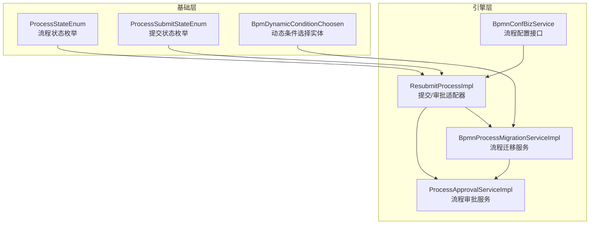
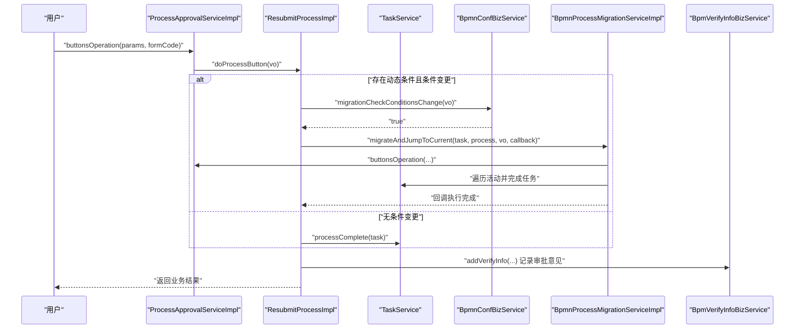
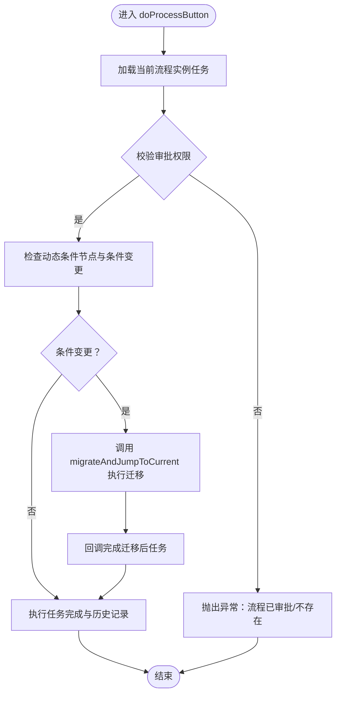
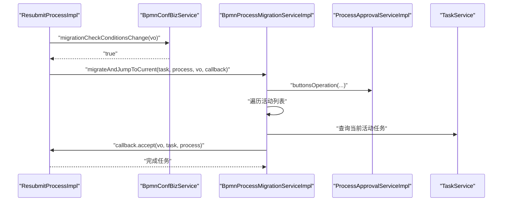
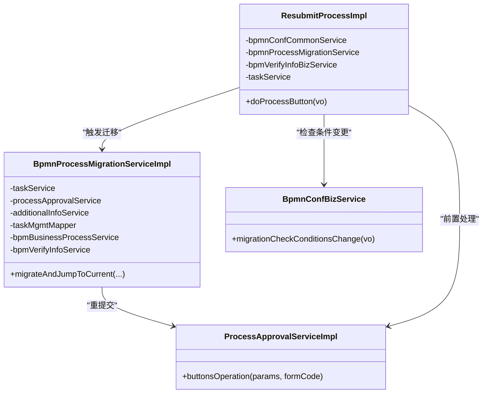
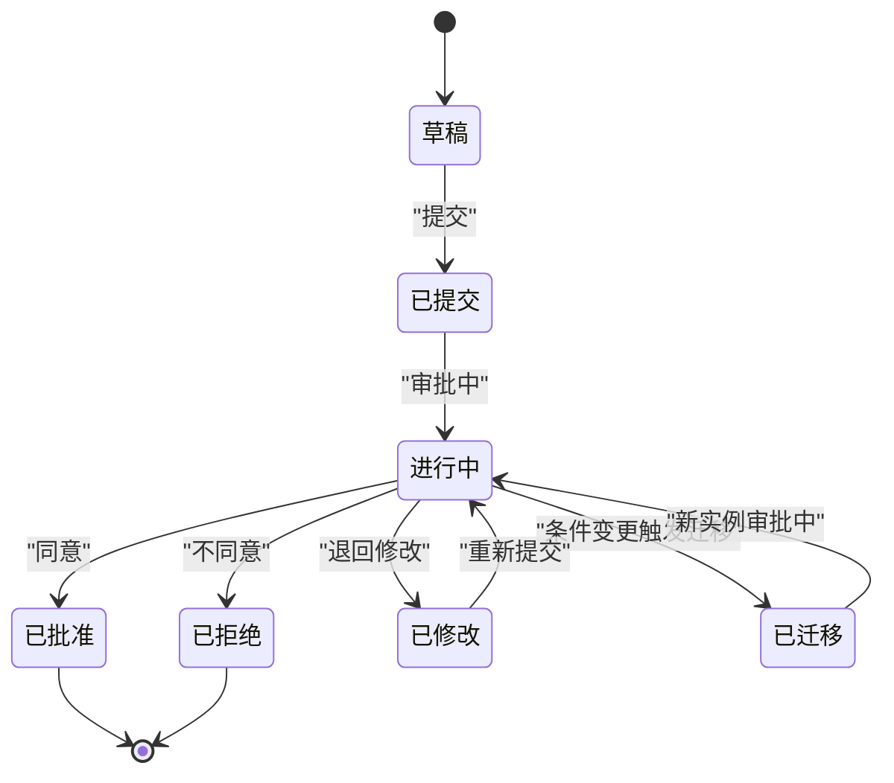
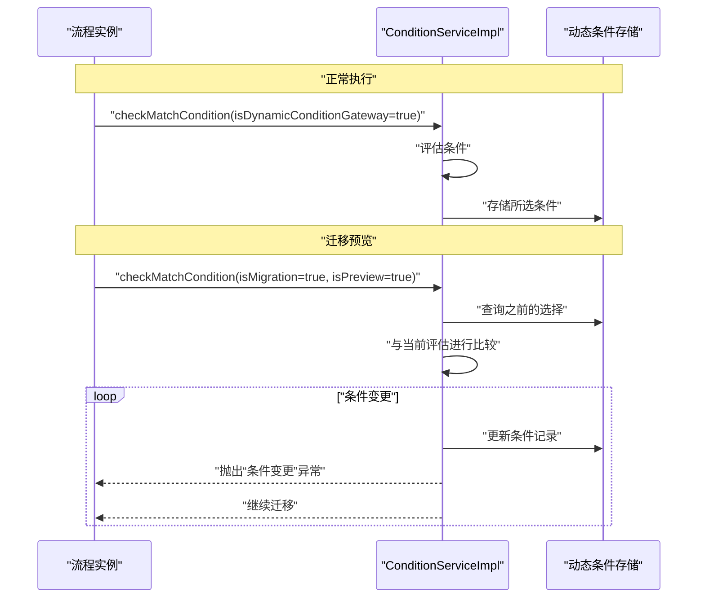

# 流程操作与生命周期

<cite>
**本文引用的文件**
- [BpmDynamicConditionChoosen.java](file://antflow-base/src/main/java/org/openoa/base/entity/BpmDynamicConditionChoosen.java)
- [BpmnProcessMigrationServiceImpl.java](file://antflow-engine/src/main/java/org/openoa/engine/bpmnconf/service/biz/BpmnProcessMigrationServiceImpl.java)
- [ResubmitProcessImpl.java](file://antflow-engine/src/main/java/org/openoa/engine/bpmnconf/adp/processoperation/ResubmitProcessImpl.java)
- [ProcessApprovalServiceImpl.java](file://antflow-engine/src/main/java/org/openoa/engine/bpmnconf/service/biz/ProcessApprovalServiceImpl.java)
- [BpmnConfBizService.java](file://antflow-engine/src/main/java/org/openoa/engine/bpmnconf/service/interf/biz/BpmnConfBizService.java)
- [ProcessStateEnum.java](file://antflow-base/src/main/java/org/openoa/base/constant/enums/ProcessStateEnum.java)
- [ProcessSubmitStateEnum.java](file://antflow-base/src/main/java/org/openoa/base/constant/enums/ProcessSubmitStateEnum.java)
- [6.流程配置系统.md](file://doc/系统介绍篇/6.流程配置系统.md)
- [11.流程操作和任务管理.md](file://doc/系统介绍篇/11.流程操作和任务管理.md)
- [23.系统扩展.md](file://doc/系统介绍篇/23.系统扩展.md)
</cite>

## 目录
1. [简介](#简介)
2. [项目结构](#项目结构)
3. [核心组件](#核心组件)
4. [架构总览](#架构总览)
5. [详细组件分析](#详细组件分析)
6. [依赖关系分析](#依赖关系分析)
7. [性能考量](#性能考量)
8. [故障排查指南](#故障排查指南)
9. [结论](#结论)
10. [附录](#附录)

## 简介
本文件围绕流程操作与生命周期展开，系统性阐述提交、审批、拒绝、退回修改、流程迁移等核心工作流操作，以及这些操作如何通过结构化的服务层进行管理，并维护流程状态与历史记录。重点解析流程状态机的各阶段：草稿、已提交、进行中、已批准、已拒绝、已修改、已迁移等状态转换条件；深入说明 BpmDynamicConditionChoosen 实体在流程迁移场景中如何跟踪条件状态；并提供完整的流程状态转换图与操作序列图，辅以实际代码实现路径。

## 项目结构
本项目采用分层与模块化组织方式：
- 基础层（antflow-base）：提供通用枚举、实体与接口，如流程状态枚举、提交状态枚举、动态条件实体等。
- 引擎层（antflow-engine）：实现流程引擎相关业务逻辑，包括流程审批、按钮操作适配器、流程迁移、配置服务等。
- 文档（doc）：系统介绍与扩展指南，包含流程操作、迁移与动态条件管理的说明与图示。

图表来源
- [ProcessStateEnum.java:1-52](file://antflow-base/src/main/java/org/openoa/base/constant/enums/ProcessStateEnum.java#L1-L52)
- [ProcessSubmitStateEnum.java:1-47](file://antflow-base/src/main/java/org/openoa/base/constant/enums/ProcessSubmitStateEnum.java#L1-L47)
- [BpmDynamicConditionChoosen.java:1-21](file://antflow-base/src/main/java/org/openoa/base/entity/BpmDynamicConditionChoosen.java#L1-L21)
- [ResubmitProcessImpl.java:1-276](file://antflow-engine/src/main/java/org/openoa/engine/bpmnconf/adp/processoperation/ResubmitProcessImpl.java#L1-L276)
- [ProcessApprovalServiceImpl.java:1-342](file://antflow-engine/src/main/java/org/openoa/engine/bpmnconf/service/biz/ProcessApprovalServiceImpl.java#L1-L342)
- [BpmnProcessMigrationServiceImpl.java:1-130](file://antflow-engine/src/main/java/org/openoa/engine/bpmnconf/service/biz/BpmnProcessMigrationServiceImpl.java#L1-L130)
- [BpmnConfBizService.java:1-52](file://antflow-engine/src/main/java/org/openoa/engine/bpmnconf/service/interf/biz/BpmnConfBizService.java#L1-L52)

章节来源
- [ProcessStateEnum.java:1-52](file://antflow-base/src/main/java/org/openoa/base/constant/enums/ProcessStateEnum.java#L1-L52)
- [ProcessSubmitStateEnum.java:1-47](file://antflow-base/src/main/java/org/openoa/base/constant/enums/ProcessSubmitStateEnum.java#L1-L47)
- [BpmDynamicConditionChoosen.java:1-21](file://antflow-base/src/main/java/org/openoa/base/entity/BpmDynamicConditionChoosen.java#L1-L21)
- [ResubmitProcessImpl.java:1-276](file://antflow-engine/src/main/java/org/openoa/engine/bpmnconf/adp/processoperation/ResubmitProcessImpl.java#L1-L276)
- [ProcessApprovalServiceImpl.java:1-342](file://antflow-engine/src/main/java/org/openoa/engine/bpmnconf/service/biz/ProcessApprovalServiceImpl.java#L1-L342)
- [BpmnProcessMigrationServiceImpl.java:1-130](file://antflow-engine/src/main/java/org/openoa/engine/bpmnconf/service/biz/BpmnProcessMigrationServiceImpl.java#L1-L130)
- [BpmnConfBizService.java:1-52](file://antflow-engine/src/main/java/org/openoa/engine/bpmnconf/service/interf/biz/BpmnConfBizService.java#L1-L52)

## 核心组件
- ResubmitProcessImpl：实现提交/审批/加批等按钮操作，负责在审批节点执行任务完成、记录审批意见与附件、必要时触发流程迁移。
- ProcessApprovalServiceImpl：统一入口处理按钮操作，协调前置处理、表单适配器与业务数据准备。
- BpmnProcessMigrationServiceImpl：在动态条件变更时执行流程迁移，创建新实例并按活动顺序完成任务。
- BpmnConfBizService：提供流程配置查询与动态条件变更检查能力。
- ProcessStateEnum / ProcessSubmitStateEnum：定义流程状态与提交状态的枚举值，用于状态转换与历史记录标识。
- BpmDynamicConditionChoosen：持久化记录流程执行期间的动态条件选择，支撑迁移前后条件对比与变更检测。

章节来源
- [ResubmitProcessImpl.java:107-178](file://antflow-engine/src/main/java/org/openoa/engine/bpmnconf/adp/processoperation/ResubmitProcessImpl.java#L107-L178)
- [ProcessApprovalServiceImpl.java:85-89](file://antflow-engine/src/main/java/org/openoa/engine/bpmnconf/service/biz/ProcessApprovalServiceImpl.java#L85-L89)
- [BpmnProcessMigrationServiceImpl.java:50-128](file://antflow-engine/src/main/java/org/openoa/engine/bpmnconf/service/biz/BpmnProcessMigrationServiceImpl.java#L50-L128)
- [BpmnConfBizService.java:30-30](file://antflow-engine/src/main/java/org/openoa/engine/bpmnconf/service/interf/biz/BpmnConfBizService.java#L30-L30)
- [ProcessStateEnum.java:5-14](file://antflow-base/src/main/java/org/openoa/base/constant/enums/ProcessStateEnum.java#L5-L14)
- [ProcessSubmitStateEnum.java:5-18](file://antflow-base/src/main/java/org/openoa/base/constant/enums/ProcessSubmitStateEnum.java#L5-L18)
- [BpmDynamicConditionChoosen.java:11-20](file://antflow-base/src/main/java/org/openoa/base/entity/BpmDynamicConditionChoosen.java#L11-L20)

## 架构总览
下图展示从用户点击按钮到流程状态更新与历史记录生成的整体调用链路，以及在动态条件变更时的迁移处理。

图表来源
- [ProcessApprovalServiceImpl.java:85-89](file://antflow-engine/src/main/java/org/openoa/engine/bpmnconf/service/biz/ProcessApprovalServiceImpl.java#L85-L89)
- [ResubmitProcessImpl.java:107-178](file://antflow-engine/src/main/java/org/openoa/engine/bpmnconf/adp/processoperation/ResubmitProcessImpl.java#L107-L178)
- [BpmnProcessMigrationServiceImpl.java:50-128](file://antflow-engine/src/main/java/org/openoa/engine/bpmnconf/service/biz/BpmnProcessMigrationServiceImpl.java#L50-L128)
- [BpmnConfBizService.java:30-30](file://antflow-engine/src/main/java/org/openoa/engine/bpmnconf/service/interf/biz/BpmnConfBizService.java#L30-L30)

章节来源
- [11.流程操作和任务管理.md:74-98](file://doc/系统介绍篇/11.流程操作和任务管理.md#L74-L98)
- [11.流程操作和任务管理.md:202-219](file://doc/系统介绍篇/11.流程操作和任务管理.md#L202-L219)

## 详细组件分析

### ResubmitProcessImpl：提交/审批/加批与迁移触发
- 角色定位：实现 ProcessOperationAdaptor 接口，承载“提交”“同意”“加批”等按钮操作。
- 关键职责：
  - 校验当前任务与审批权限，获取表单上下文。
  - 在动态条件节点处检查条件变更，若变更则触发迁移。
  - 完成任务并写入审批历史与附件。
- 迁移触发条件：
  - 当前节点标记为动态条件节点，且仅剩最后一个审批人时，检查条件是否变化，变化则迁移。
- 迁移后处理：
  - 通过回调逐个完成迁移后的任务，保留原始审批意见。

图表来源
- [ResubmitProcessImpl.java:107-178](file://antflow-engine/src/main/java/org/openoa/engine/bpmnconf/adp/processoperation/ResubmitProcessImpl.java#L107-L178)
- [ResubmitProcessImpl.java:213-262](file://antflow-engine/src/main/java/org/openoa/engine/bpmnconf/adp/processoperation/ResubmitProcessImpl.java#L213-L262)

章节来源
- [ResubmitProcessImpl.java:107-178](file://antflow-engine/src/main/java/org/openoa/engine/bpmnconf/adp/processoperation/ResubmitProcessImpl.java#L107-L178)
- [ResubmitProcessImpl.java:213-262](file://antflow-engine/src/main/java/org/openoa/engine/bpmnconf/adp/processoperation/ResubmitProcessImpl.java#L213-L262)

### BpmnProcessMigrationServiceImpl：流程迁移与活动迭代
- 角色定位：在条件变更时创建新流程实例并按活动顺序完成任务。
- 关键流程：
  - 设置迁移标志与操作类型，调用审批服务重提交。
  - 获取流程定义活动列表，按序查找当前实例对应任务。
  - 对每个任务设置审批人与意见，执行回调完成任务。
- 回调契约：接收 BusinessDataVo、Task、BpmBusinessProcess 三元组，用于完成任务与写入历史。

图表来源
- [BpmnProcessMigrationServiceImpl.java:50-128](file://antflow-engine/src/main/java/org/openoa/engine/bpmnconf/service/biz/BpmnProcessMigrationServiceImpl.java#L50-L128)
- [ResubmitProcessImpl.java:140-163](file://antflow-engine/src/main/java/org/openoa/engine/bpmnconf/adp/processoperation/ResubmitProcessImpl.java#L140-L163)

章节来源
- [BpmnProcessMigrationServiceImpl.java:50-128](file://antflow-engine/src/main/java/org/openoa/engine/bpmnconf/service/biz/BpmnProcessMigrationServiceImpl.java#L50-L128)
- [11.流程操作和任务管理.md:202-219](file://doc/系统介绍篇/11.流程操作和任务管理.md#L202-L219)

### ProcessApprovalServiceImpl：按钮操作入口与前置处理
- 角色定位：统一入口，委派前置处理与表单适配器，返回业务结果。
- 关键点：前置处理完成后直接返回，后续由具体适配器完成任务完成与历史记录。

章节来源
- [ProcessApprovalServiceImpl.java:85-89](file://antflow-engine/src/main/java/org/openoa/engine/bpmnconf/service/biz/ProcessApprovalServiceImpl.java#L85-L89)

### 状态枚举与历史记录
- ProcessStateEnum：定义流程状态（审批中、审批通过、审批拒绝、作废）。
- ProcessSubmitStateEnum：定义提交状态（提交、同意、不同意、撤回、作废、终止、退回修改、加批）。
- 历史记录：在任务完成时写入审批意见、审批人、任务定义键、流程编号等，形成可追溯的历史。

章节来源
- [ProcessStateEnum.java:5-14](file://antflow-base/src/main/java/org/openoa/base/constant/enums/ProcessStateEnum.java#L5-L14)
- [ProcessSubmitStateEnum.java:5-18](file://antflow-base/src/main/java/org/openoa/base/constant/enums/ProcessSubmitStateEnum.java#L5-L18)
- [ResubmitProcessImpl.java:213-262](file://antflow-engine/src/main/java/org/openoa/engine/bpmnconf/adp/processoperation/ResubmitProcessImpl.java#L213-L262)

### 动态条件与迁移：BpmDynamicConditionChoosen 的作用
- 实体字段：包含流程编号、节点ID、来源节点，用于追踪条件选择。
- 场景：在动态条件网关处，迁移前后对比条件选择，若变更则中断当前流程并创建新实例，确保后续流转符合最新条件。

章节来源
- [BpmDynamicConditionChoosen.java:11-20](file://antflow-base/src/main/java/org/openoa/base/entity/BpmDynamicConditionChoosen.java#L11-L20)
- [6.流程配置系统.md:275-298](file://doc/系统介绍篇/6.流程配置系统.md#L275-L298)

## 依赖关系分析
- ResubmitProcessImpl 依赖 TaskService、BpmBusinessProcessService、BpmVerifyInfoBizService、BpmVariableSignUpPersonnelBizService、BpmnConfBizService、BpmnProcessMigrationServiceImpl。
- BpmnProcessMigrationServiceImpl 依赖 TaskService、ProcessApprovalServiceImpl、ActivitiAdditionalInfoServiceImpl、TaskMgmtMapper、BpmBusinessProcessService、BpmVerifyInfoService、BpmVariableMultiplayerServiceImpl。
- ProcessApprovalServiceImpl 依赖 ButtonPreOperationService、BpmnConfBizService、FormFactory、BpmBusinessProcessService、TaskService 等。
- BpmnConfBizService 提供 migrationCheckConditionsChange 能力，作为迁移触发的判定依据。

图表来源
- [ResubmitProcessImpl.java:55-77](file://antflow-engine/src/main/java/org/openoa/engine/bpmnconf/adp/processoperation/ResubmitProcessImpl.java#L55-L77)
- [BpmnProcessMigrationServiceImpl.java:34-48](file://antflow-engine/src/main/java/org/openoa/engine/bpmnconf/service/biz/BpmnProcessMigrationServiceImpl.java#L34-L48)
- [ProcessApprovalServiceImpl.java:54-76](file://antflow-engine/src/main/java/org/openoa/engine/bpmnconf/service/biz/ProcessApprovalServiceImpl.java#L54-L76)
- [BpmnConfBizService.java:30-30](file://antflow-engine/src/main/java/org/openoa/engine/bpmnconf/service/interf/biz/BpmnConfBizService.java#L30-L30)

章节来源
- [ResubmitProcessImpl.java:55-77](file://antflow-engine/src/main/java/org/openoa/engine/bpmnconf/adp/processoperation/ResubmitProcessImpl.java#L55-L77)
- [BpmnProcessMigrationServiceImpl.java:34-48](file://antflow-engine/src/main/java/org/openoa/engine/bpmnconf/service/biz/BpmnProcessMigrationServiceImpl.java#L34-L48)
- [ProcessApprovalServiceImpl.java:54-76](file://antflow-engine/src/main/java/org/openoa/engine/bpmnconf/service/biz/ProcessApprovalServiceImpl.java#L54-L76)
- [BpmnConfBizService.java:30-30](file://antflow-engine/src/main/java/org/openoa/engine/bpmnconf/service/interf/biz/BpmnConfBizService.java#L30-L30)

## 性能考量
- 缓存优化：ResubmitProcessImpl 中对流程配置详情使用 LoadingCache，减少重复查询开销。
- 批量处理：迁移服务在遍历活动时按任务维度处理，避免全量扫描。
- 条件检查：仅在动态条件节点且满足“仅剩最后一个审批人”时才触发迁移，降低迁移频率。

章节来源
- [ResubmitProcessImpl.java:78-105](file://antflow-engine/src/main/java/org/openoa/engine/bpmnconf/adp/processoperation/ResubmitProcessImpl.java#L78-L105)
- [BpmnProcessMigrationServiceImpl.java:64-127](file://antflow-engine/src/main/java/org/openoa/engine/bpmnconf/service/biz/BpmnProcessMigrationServiceImpl.java#L64-L127)

## 故障排查指南
- “当前流程已审批/不存在”：通常发生在任务已被他人处理或已结束，需确认任务归属与实例状态。
- “条件变更”异常：在迁移预览或条件对比阶段抛出，提示需重新提交或调整条件。
- 迁移后历史缺失：确认回调是否正确执行并写入审批历史，检查审批意见与附件是否为空。

章节来源
- [ResubmitProcessImpl.java:114-131](file://antflow-engine/src/main/java/org/openoa/engine/bpmnconf/adp/processoperation/ResubmitProcessImpl.java#L114-L131)
- [11.流程操作和任务管理.md:289-296](file://doc/系统介绍篇/11.流程操作和任务管理.md#L289-L296)

## 结论
本系统通过清晰的服务分层与明确的职责划分，实现了从按钮操作到流程迁移与历史记录的完整闭环。动态条件机制与 BpmDynamicConditionChoosen 实体共同保障了迁移过程中的条件一致性，配合 ProcessStateEnum 与 ProcessSubmitStateEnum 的状态机设计，使流程生命周期具备良好的可观测性与可追溯性。

## 附录

### 流程状态转换图（草稿/提交/进行中/已批准/已拒绝/已修改/已迁移）

[此图为概念性状态图，无需图表来源]

### 动态条件迁移序列图（基于文档）

图表来源
- [6.流程配置系统.md:279-297](file://doc/系统介绍篇/6.流程配置系统.md#L279-L297)

### 自定义迁移扩展（参考文档）
- 可在自定义处理器中调用迁移服务，实现特定节点的迁移逻辑，并在回调中注入自定义完成行为。

章节来源
- [23.系统扩展.md:518-568](file://doc/系统介绍篇/23.系统扩展.md#L518-L568)