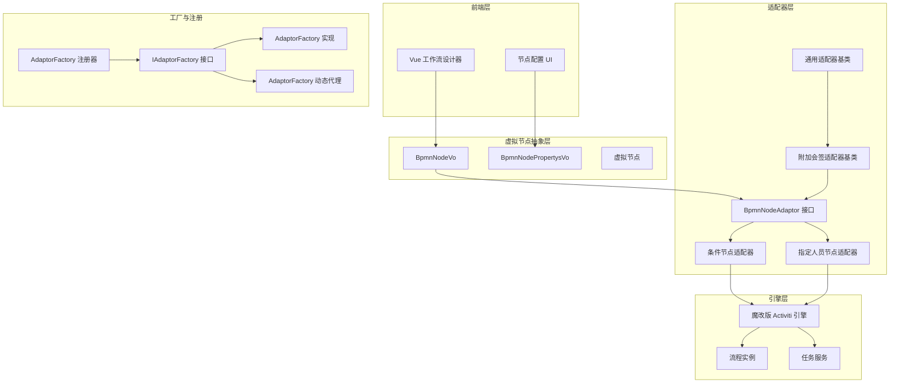
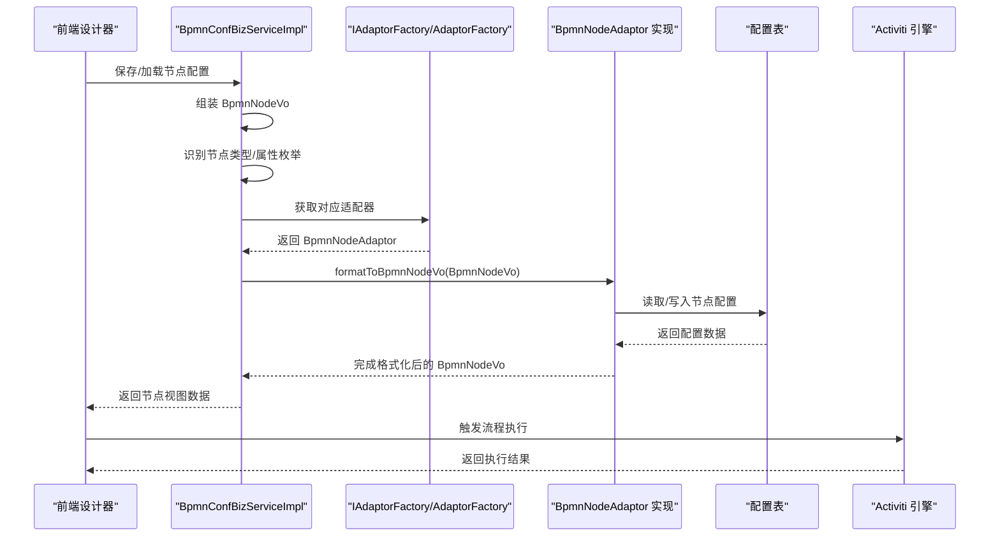
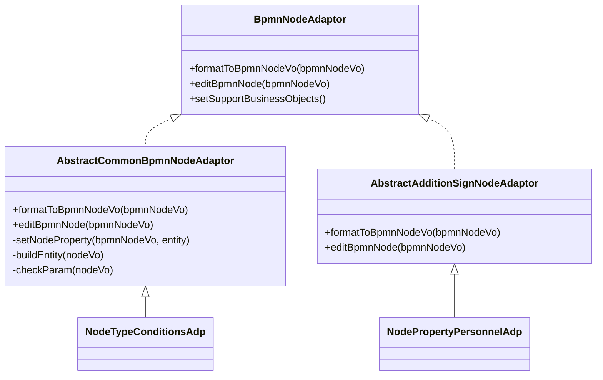
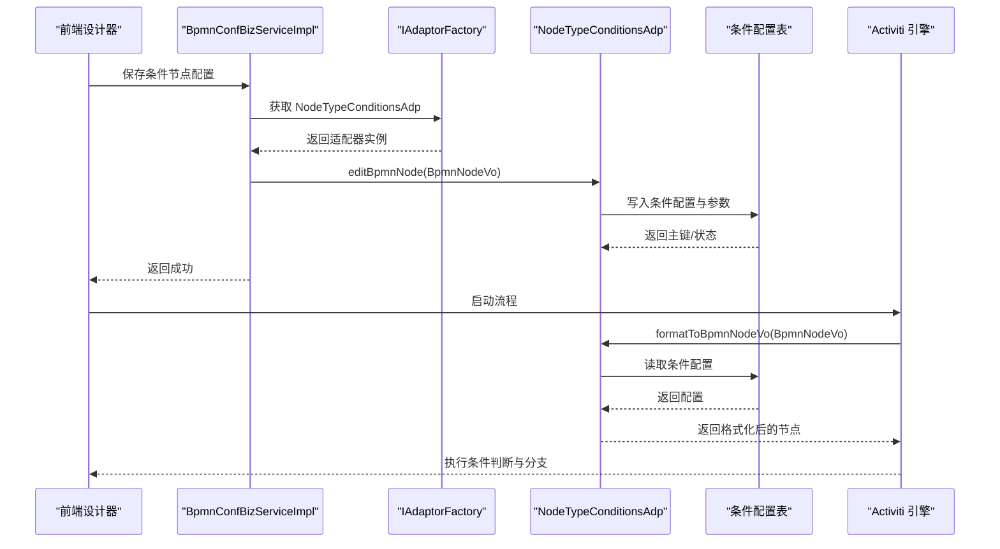
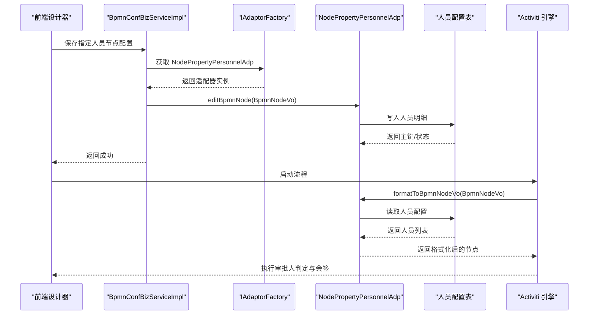
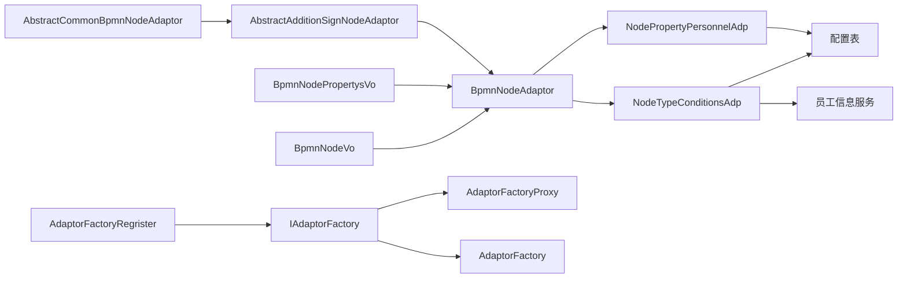

# 虚拟节点系统

<cite>
**本文引用的文件**
- [BpmnNodeVo.java](file://antflow-base/src/main/java/org/openoa/base/vo/BpmnNodeVo.java)
- [BpmnNodePropertysVo.java](file://antflow-base/src/main/java/org/openoa/base/vo/BpmnNodePropertysVo.java)
- [BpmnNodeAdaptor.java](file://antflow-engine/src/main/java/org/openoa/engine/bpmnconf/adp/bpmnnodeadp/BpmnNodeAdaptor.java)
- [AbstractCommonBpmnNodeAdaptor.java](file://antflow-engine/src/main/java/org/openoa/engine/bpmnconf/adp/bpmnnodeadp/AbstractCommonBpmnNodeAdaptor.java)
- [AbstractAdditionSignNodeAdaptor.java](file://antflow-engine/src/main/java/org/openoa/engine/bpmnconf/adp/bpmnnodeadp/AbstractAdditionSignNodeAdaptor.java)
- [NodeTypeConditionsAdp.java](file://antflow-engine/src/main/java/org/openoa/engine/bpmnconf/adp/bpmnnodeadp/NodeTypeConditionsAdp.java)
- [NodePropertyPersonnelAdp.java](file://antflow-engine/src/main/java/org/openoa/engine/bpmnconf/adp/bpmnnodeadp/NodePropertyPersonnelAdp.java)
- [BpmnConfBizServiceImpl.java](file://antflow-engine/src/main/java/org/openoa/engine/bpmnconf/service/biz/BpmnConfBizServiceImpl.java)
- [NodeAdditionalInfoServiceImpl.java](file://antflow-engine/src/main/java/org/openoa/engine/bpmnconf/common/NodeAdditionalInfoServiceImpl.java)
- [AdaptorFactory.java](file://antflow-engine/src/main/java/org/openoa/engine/factory/AdaptorFactory.java)
- [AdaptorFactoryProxy.java](file://antflow-engine/src/main/java/org/openoa/engine/factory/AdaptorFactoryProxy.java)
- [AdaptorFactoryRegrister.java](file://antflow-engine/src/main/java/org/openoa/engine/conf/config/AdaptorFactoryRegrister.java)
- [README.zh_CN.md](file://README.zh_CN.md)
- [3.核心概念和术语.md](file://doc/系统介绍篇/3.核心概念和术语.md)
- [20.开发者指南.md](file://doc/系统介绍篇/20.开发者指南.md)
- [23.系统扩展.md](file://doc/系统介绍篇/23.系统扩展.md)
</cite>

## 目录
1. [引言](#引言)
2. [项目结构](#项目结构)
3. [核心组件](#核心组件)
4. [架构总览](#架构总览)
5. [详细组件分析](#详细组件分析)
6. [依赖分析](#依赖分析)
7. [性能考虑](#性能考虑)
8. [故障排查指南](#故障排查指南)
9. [结论](#结论)
10. [附录](#附录)

## 引言
本文件面向“虚拟节点系统”（VNode）的架构与实现，围绕以下目标展开：  
- 解释虚拟节点模式的设计理念与价值主张，说明其如何将工作流逻辑从特定流程引擎 API 抽象出来，实现引擎无关性与可迁移性。  
- 详解虚拟节点的生命周期、节点类型与节点适配器的作用机制。  
- 深入解析 BpmnNodeVo、BpmnNodePropertysVo 等核心数据模型的设计思路与职责边界。  
- 提供虚拟节点与 Activiti 引擎交互的序列图与代码示例路径，帮助开发者理解架构创新的优势与应用场景。

## 项目结构
AntFlow 采用分层模块化组织，虚拟节点系统位于引擎模块中，通过适配器模式对接 Activiti 引擎，同时以 VO 层隔离业务配置与引擎执行细节。

图表来源
- [3.核心概念和术语.md:1-53](file://doc/系统介绍篇/3.核心概念和术语.md#L1-L53)
- [20.开发者指南.md:60-87](file://doc/系统介绍篇/20.开发者指南.md#L60-L87)
- [AdaptorFactory.java:1-34](file://antflow-engine/src/main/java/org/openoa/engine/factory/AdaptorFactory.java#L1-L34)
- [AdaptorFactoryProxy.java:1-71](file://antflow-engine/src/main/java/org/openoa/engine/factory/AdaptorFactoryProxy.java#L1-L71)
- [AdaptorFactoryRegrister.java:1-27](file://antflow-engine/src/main/java/org/openoa/engine/conf/config/AdaptorFactoryRegrister.java#L1-L27)

章节来源
- [README.zh_CN.md:47-58](file://README.zh_CN.md#L47-L58)
- [3.核心概念和术语.md:1-53](file://doc/系统介绍篇/3.核心概念和术语.md#L1-L53)
- [20.开发者指南.md:24-87](file://doc/系统介绍篇/20.开发者指南.md#L24-L87)

## 核心组件
- 虚拟节点数据模型
  - BpmnNodeVo：承载节点元数据、属性、参数、按钮、通知模板、条件 URL、低代码字段控制等，作为引擎无关的节点视图载体。
  - BpmnNodePropertysVo：承载节点属性配置，如层级/角色/人员/会签/循环/条件等，统一对外暴露属性集合。
- 节点适配器体系
  - BpmnNodeAdaptor：定义格式化与编辑节点的能力，以及支持的业务对象集合。
  - AbstractCommonBpmnNodeAdaptor：通用适配器基类，封装查询与持久化实体的通用逻辑。
  - AbstractAdditionSignNodeAdaptor：附加会签适配器基类，负责加载额外会签配置并回填至属性。
  - NodeTypeConditionsAdp：条件节点适配器，负责从配置表读取条件配置，构建前端可用的 Vue 模型，并写回数据库。
  - NodePropertyPersonnelAdp：指定人员节点适配器，负责加载/保存指定审批人配置。
- 工厂与注册
  - IAdaptorFactory：统一获取适配器与引擎服务的入口。
  - AdaptorFactory/AdaptorFactoryProxy：动态生成适配器工厂实现，注册到 Spring 容器。
  - AdaptorFactoryRegrister：BeanFactory 后置处理器，注册代理工厂为单例。

章节来源
- [BpmnNodeVo.java:1-232](file://antflow-base/src/main/java/org/openoa/base/vo/BpmnNodeVo.java#L1-L232)
- [BpmnNodePropertysVo.java:1-171](file://antflow-base/src/main/java/org/openoa/base/vo/BpmnNodePropertysVo.java#L1-L171)
- [BpmnNodeAdaptor.java:1-30](file://antflow-engine/src/main/java/org/openoa/engine/bpmnconf/adp/bpmnnodeadp/BpmnNodeAdaptor.java#L1-L30)
- [AbstractCommonBpmnNodeAdaptor.java:1-47](file://antflow-engine/src/main/java/org/openoa/engine/bpmnconf/adp/bpmnnodeadp/AbstractCommonBpmnNodeAdaptor.java#L1-L47)
- [AbstractAdditionSignNodeAdaptor.java:1-101](file://antflow-engine/src/main/java/org/openoa/engine/bpmnconf/adp/bpmnnodeadp/AbstractAdditionSignNodeAdaptor.java#L1-L101)
- [NodeTypeConditionsAdp.java:1-407](file://antflow-engine/src/main/java/org/openoa/engine/bpmnconf/adp/bpmnnodeadp/NodeTypeConditionsAdp.java#L1-L407)
- [NodePropertyPersonnelAdp.java:1-178](file://antflow-engine/src/main/java/org/openoa/engine/bpmnconf/adp/bpmnnodeadp/NodePropertyPersonnelAdp.java#L1-L178)
- [AdaptorFactory.java:1-34](file://antflow-engine/src/main/java/org/openoa/engine/factory/AdaptorFactory.java#L1-L34)
- [AdaptorFactoryProxy.java:1-71](file://antflow-engine/src/main/java/org/openoa/engine/factory/AdaptorFactoryProxy.java#L1-L71)
- [AdaptorFactoryRegrister.java:1-27](file://antflow-engine/src/main/java/org/openoa/engine/conf/config/AdaptorFactoryRegrister.java#L1-L27)

## 架构总览
虚拟节点系统通过“配置即代码”的方式，将节点属性与引擎 API 解耦。前端设计器将节点配置映射为 BpmnNodeVo/BpmnNodePropertysVo，再由适配器根据节点类型与属性，读取/写入配置表，最终驱动 Activiti 引擎执行。

图表来源
- [BpmnConfBizServiceImpl.java:1614-1684](file://antflow-engine/src/main/java/org/openoa/engine/bpmnconf/service/biz/BpmnConfBizServiceImpl.java#L1614-L1684)
- [NodeAdditionalInfoServiceImpl.java:66-81](file://antflow-engine/src/main/java/org/openoa/engine/bpmnconf/common/NodeAdditionalInfoServiceImpl.java#L66-L81)
- [AdaptorFactory.java:1-34](file://antflow-engine/src/main/java/org/openoa/engine/factory/AdaptorFactory.java#L1-L34)
- [NodeTypeConditionsAdp.java:57-229](file://antflow-engine/src/main/java/org/openoa/engine/bpmnconf/adp/bpmnnodeadp/NodeTypeConditionsAdp.java#L57-L229)
- [NodePropertyPersonnelAdp.java:45-110](file://antflow-engine/src/main/java/org/openoa/engine/bpmnconf/adp/bpmnnodeadp/NodePropertyPersonnelAdp.java#L45-L110)

## 详细组件分析

### 数据模型：BpmnNodeVo 与 BpmnNodePropertysVo
- 设计要点
  - BpmnNodeVo：统一承载节点标识、名称、显示名、类型、属性编码、并行/自动节点标记、标签、按钮、通知模板、条件 URL、低代码字段控制、转发列表等，作为跨引擎的节点视图。
  - BpmnNodePropertysVo：将复杂属性（层级/角色/人员/会签/循环/条件/配置表等）聚合为统一的属性容器，便于前端渲染与适配器处理。
- 关键字段与语义
  - 节点类型与属性：nodeType、nodeProperty、nodePropertyName
  - 连接关系：nodeFrom/nodeTo/prevId/nodeFroms/fromNodes
  - 扩展标志：extraFlags、isParallel、isAutomaticNode、isDynamicCondition、isCarbonCopyNode、aggregationNode
  - 属性容器：property(params/buttons/templateVos/approveRemindVo/conditionsUrl/formCode/isOutSideProcess/isLowCodeFlow/lffieldControlVOs/empToForwardList/lastNodeForward/labelList/noHeaderAction)
- 复杂度与性能
  - 字段较多但均为轻量对象，序列化/反序列化成本低；建议在传输层按需裁剪字段，避免冗余网络开销。

章节来源
- [BpmnNodeVo.java:19-232](file://antflow-base/src/main/java/org/openoa/base/vo/BpmnNodeVo.java#L19-L232)
- [BpmnNodePropertysVo.java:12-171](file://antflow-base/src/main/java/org/openoa/base/vo/BpmnNodePropertysVo.java#L12-L171)

### 适配器体系：BpmnNodeAdaptor 与具体实现
- 接口职责
  - formatToBpmnNodeVo：将配置表数据格式化为 BpmnNodeVo，供前端与引擎使用。
  - editBpmnNode：将前端提交的节点配置写回配置表。
  - setSupportBusinessObjects：声明该适配器支持的业务对象集合（节点类型/属性枚举）。
- 抽象基类
  - AbstractCommonBpmnNodeAdaptor：封装查询实体与批量保存实体的通用逻辑，子类只需实现 setNodeProperty/buildEntity/checkParam。
  - AbstractAdditionSignNodeAdaptor：加载附加会签配置（角色/人员），并回填至属性列表。
- 典型实现
  - NodeTypeConditionsAdp：读取条件配置（含分组/运算符/低代码字段包装），构建 Vue 可用模型并写回数据库。
  - NodePropertyPersonnelAdp：读取指定人员配置，支持从员工信息服务补全姓名，保存时写入明细表。

图表来源
- [BpmnNodeAdaptor.java:1-30](file://antflow-engine/src/main/java/org/openoa/engine/bpmnconf/adp/bpmnnodeadp/BpmnNodeAdaptor.java#L1-L30)
- [AbstractCommonBpmnNodeAdaptor.java:1-47](file://antflow-engine/src/main/java/org/openoa/engine/bpmnconf/adp/bpmnnodeadp/AbstractCommonBpmnNodeAdaptor.java#L1-L47)
- [AbstractAdditionSignNodeAdaptor.java:1-101](file://antflow-engine/src/main/java/org/openoa/engine/bpmnconf/adp/bpmnnodeadp/AbstractAdditionSignNodeAdaptor.java#L1-L101)
- [NodeTypeConditionsAdp.java:1-407](file://antflow-engine/src/main/java/org/openoa/engine/bpmnconf/adp/bpmnnodeadp/NodeTypeConditionsAdp.java#L1-L407)
- [NodePropertyPersonnelAdp.java:1-178](file://antflow-engine/src/main/java/org/openoa/engine/bpmnconf/adp/bpmnnodeadp/NodePropertyPersonnelAdp.java#L1-L178)

章节来源
- [BpmnNodeAdaptor.java:1-30](file://antflow-engine/src/main/java/org/openoa/engine/bpmnconf/adp/bpmnnodeadp/BpmnNodeAdaptor.java#L1-L30)
- [AbstractCommonBpmnNodeAdaptor.java:1-47](file://antflow-engine/src/main/java/org/openoa/engine/bpmnconf/adp/bpmnnodeadp/AbstractCommonBpmnNodeAdaptor.java#L1-L47)
- [AbstractAdditionSignNodeAdaptor.java:1-101](file://antflow-engine/src/main/java/org/openoa/engine/bpmnconf/adp/bpmnnodeadp/AbstractAdditionSignNodeAdaptor.java#L1-L101)
- [NodeTypeConditionsAdp.java:1-407](file://antflow-engine/src/main/java/org/openoa/engine/bpmnconf/adp/bpmnnodeadp/NodeTypeConditionsAdp.java#L1-L407)
- [NodePropertyPersonnelAdp.java:1-178](file://antflow-engine/src/main/java/org/openoa/engine/bpmnconf/adp/bpmnnodeadp/NodePropertyPersonnelAdp.java#L1-L178)

### 虚拟节点生命周期与节点类型分类
- 生命周期
  - 设计期：前端设计器生成 BpmnNodeVo/BpmnNodePropertysVo，经适配器格式化为引擎可读配置。
  - 运行期：引擎根据节点类型与属性执行分支/会签/循环/条件判断等逻辑。
  - 回收/迁移：通过适配器与配置表的解耦，实现节点策略的可移植与可替换。
- 节点类型与属性
  - 类型：开始/网关/条件/审批等（见 BpmnNodeVo 中的 nodeType 字段注释）。
  - 属性：无属性/层级审批/指定角色/指定人员/HrBP/自选模块/相关配置表等（见 NodePropertyEnum 对应枚举）。
- 适配器选择
  - 依据节点类型与属性枚举，由 NodeAdditionalInfoServiceImpl 计算出适配器枚举，再由工厂获取具体适配器实例。

章节来源
- [BpmnNodeVo.java:40-58](file://antflow-base/src/main/java/org/openoa/base/vo/BpmnNodeVo.java#L40-L58)
- [NodeAdditionalInfoServiceImpl.java:66-81](file://antflow-engine/src/main/java/org/openoa/engine/bpmnconf/common/NodeAdditionalInfoServiceImpl.java#L66-L81)
- [BpmnConfBizServiceImpl.java:1639-1650](file://antflow-engine/src/main/java/org/openoa/engine/bpmnconf/service/biz/BpmnConfBizServiceImpl.java#L1639-L1650)

### 与 Activiti 引擎的交互流程（条件节点）

图表来源
- [BpmnConfBizServiceImpl.java:1614-1684](file://antflow-engine/src/main/java/org/openoa/engine/bpmnconf/service/biz/BpmnConfBizServiceImpl.java#L1614-L1684)
- [NodeTypeConditionsAdp.java:249-400](file://antflow-engine/src/main/java/org/openoa/engine/bpmnconf/adp/bpmnnodeadp/NodeTypeConditionsAdp.java#L249-L400)

### 与 Activiti 引擎的交互流程（指定人员节点）

图表来源
- [BpmnConfBizServiceImpl.java:1614-1684](file://antflow-engine/src/main/java/org/openoa/engine/bpmnconf/service/biz/BpmnConfBizServiceImpl.java#L1614-L1684)
- [NodePropertyPersonnelAdp.java:111-153](file://antflow-engine/src/main/java/org/openoa/engine/bpmnconf/adp/bpmnnodeadp/NodePropertyPersonnelAdp.java#L111-L153)

### 虚拟节点与 Activiti 的适配器工厂
- 工厂注册
  - 通过 AdaptorFactoryProxy 动态生成 IAdaptorFactory 实现，并由 AdaptorFactoryRegrister 注册为 Spring 单例。
- 使用场景
  - 在业务保存/加载节点配置时，先根据节点类型/属性计算适配器枚举，再调用工厂获取具体适配器实例，完成格式化与持久化。

章节来源
- [AdaptorFactoryProxy.java:32-71](file://antflow-engine/src/main/java/org/openoa/engine/factory/AdaptorFactoryProxy.java#L32-L71)
- [AdaptorFactoryRegrister.java:18-27](file://antflow-engine/src/main/java/org/openoa/engine/conf/config/AdaptorFactoryRegrister.java#L18-L27)
- [AdaptorFactory.java:1-34](file://antflow-engine/src/main/java/org/openoa/engine/factory/AdaptorFactory.java#L1-L34)

## 依赖分析
- 组件内聚与耦合
  - BpmnNodeVo/BpmnNodePropertysVo 与引擎解耦，仅承担数据载体职责，耦合度低。
  - 适配器通过接口隔离引擎差异，具体实现依赖配置表与服务层，保持良好内聚。
- 外部依赖与集成点
  - Activiti 引擎：通过自定义标签解析器与流程执行服务对接。
  - 员工信息服务：用于补充指定人员的姓名等信息。
  - 配置表：条件/人员/附加会签等配置均落库，保证可追溯与可迁移。
- 循环依赖风险
  - 适配器与服务层通过接口注入，避免直接循环依赖；工厂代理通过动态字节码生成，避免硬编码耦合。

图表来源
- [BpmnNodeVo.java:1-232](file://antflow-base/src/main/java/org/openoa/base/vo/BpmnNodeVo.java#L1-L232)
- [BpmnNodePropertysVo.java:1-171](file://antflow-base/src/main/java/org/openoa/base/vo/BpmnNodePropertysVo.java#L1-L171)
- [BpmnNodeAdaptor.java:1-30](file://antflow-engine/src/main/java/org/openoa/engine/bpmnconf/adp/bpmnnodeadp/BpmnNodeAdaptor.java#L1-L30)
- [NodeTypeConditionsAdp.java:1-407](file://antflow-engine/src/main/java/org/openoa/engine/bpmnconf/adp/bpmnnodeadp/NodeTypeConditionsAdp.java#L1-L407)
- [NodePropertyPersonnelAdp.java:1-178](file://antflow-engine/src/main/java/org/openoa/engine/bpmnconf/adp/bpmnnodeadp/NodePropertyPersonnelAdp.java#L1-L178)
- [AdaptorFactory.java:1-34](file://antflow-engine/src/main/java/org/openoa/engine/factory/AdaptorFactory.java#L1-L34)
- [AdaptorFactoryProxy.java:1-71](file://antflow-engine/src/main/java/org/openoa/engine/factory/AdaptorFactoryProxy.java#L1-L71)
- [AdaptorFactoryRegrister.java:1-27](file://antflow-engine/src/main/java/org/openoa/engine/conf/config/AdaptorFactoryRegrister.java#L1-L27)

## 性能考虑
- 序列化与传输
  - BpmnNodeVo/BpmnNodePropertysVo 字段较多但均为轻量对象，建议在前后端交互时按需裁剪字段，减少序列化与网络传输开销。
- 适配器调用
  - 适配器读取配置表时尽量使用批量查询与缓存，避免 N+1 查询；对人员信息可通过批量查询服务一次性补齐。
- 引擎执行
  - 条件判断与会签策略应尽量简化表达式，避免复杂嵌套导致引擎执行耗时增加。

## 故障排查指南
- 常见问题定位
  - 节点属性为空：检查 NodeAdditionalInfoServiceImpl 是否正确推导适配器枚举，确认 BpmnNodeAdaptor 的 setSupportBusinessObjects 是否包含当前节点类型/属性。
  - 人员配置缺失：检查 NodePropertyPersonnelAdp 的人员明细表是否写入成功，员工信息服务返回是否为空。
  - 条件配置异常：检查 NodeTypeConditionsAdp 的条件参数与分组关系是否一致，低代码字段包装是否正确。
- 关键日志与断点
  - 适配器格式化/编辑流程的关键步骤均抛出业务异常，建议在对应方法入口与关键分支设置断点，结合异常信息定位问题。
- 参考路径
  - 适配器选择与调用链：[BpmnConfBizServiceImpl.java:1614-1684](file://antflow-engine/src/main/java/org/openoa/engine/bpmnconf/service/biz/BpmnConfBizServiceImpl.java#L1614-L1684)、[NodeAdditionalInfoServiceImpl.java:66-81](file://antflow-engine/src/main/java/org/openoa/engine/bpmnconf/common/NodeAdditionalInfoServiceImpl.java#L66-L81)
  - 条件节点适配器：[NodeTypeConditionsAdp.java:57-229](file://antflow-engine/src/main/java/org/openoa/engine/bpmnconf/adp/bpmnnodeadp/NodeTypeConditionsAdp.java#L57-L229)
  - 指定人员适配器：[NodePropertyPersonnelAdp.java:45-110](file://antflow-engine/src/main/java/org/openoa/engine/bpmnconf/adp/bpmnnodeadp/NodePropertyPersonnelAdp.java#L45-L110)

章节来源
- [BpmnConfBizServiceImpl.java:1614-1684](file://antflow-engine/src/main/java/org/openoa/engine/bpmnconf/service/biz/BpmnConfBizServiceImpl.java#L1614-L1684)
- [NodeAdditionalInfoServiceImpl.java:66-81](file://antflow-engine/src/main/java/org/openoa/engine/bpmnconf/common/NodeAdditionalInfoServiceImpl.java#L66-L81)
- [NodeTypeConditionsAdp.java:57-229](file://antflow-engine/src/main/java/org/openoa/engine/bpmnconf/adp/bpmnnodeadp/NodeTypeConditionsAdp.java#L57-L229)
- [NodePropertyPersonnelAdp.java:45-110](file://antflow-engine/src/main/java/org/openoa/engine/bpmnconf/adp/bpmnnodeadp/NodePropertyPersonnelAdp.java#L45-L110)

## 结论
虚拟节点系统通过“配置即数据、适配器即策略”的设计，实现了工作流业务与引擎 API 的高解耦与强可移植性。BpmnNodeVo/BpmnNodePropertysVo 作为跨引擎的数据载体，配合 BpmnNodeAdaptor 的工厂化与动态代理机制，使开发者能够以最小成本扩展新的节点类型与业务策略，同时保持与 Activiti 引擎的稳定交互。

## 附录
- 开发者指南与模块关系参考：[20.开发者指南.md:24-87](file://doc/系统介绍篇/20.开发者指南.md#L24-L87)
- 虚拟节点概念与术语参考：[3.核心概念和术语.md:1-53](file://doc/系统介绍篇/3.核心概念和术语.md#L1-L53)
- 系统扩展与组件关系参考：[23.系统扩展.md:71-127](file://doc/系统介绍篇/23.系统扩展.md#L71-L127)