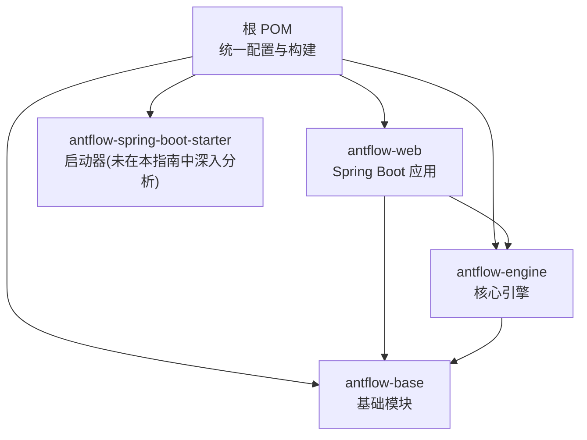
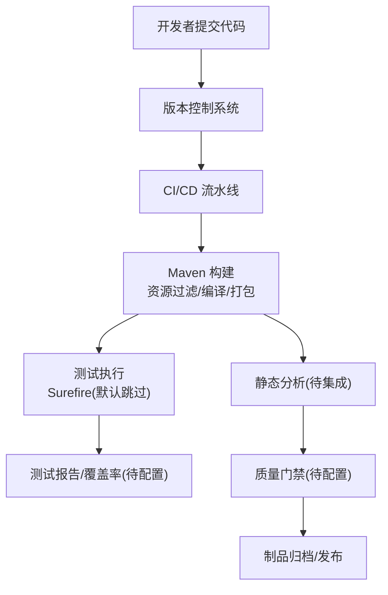
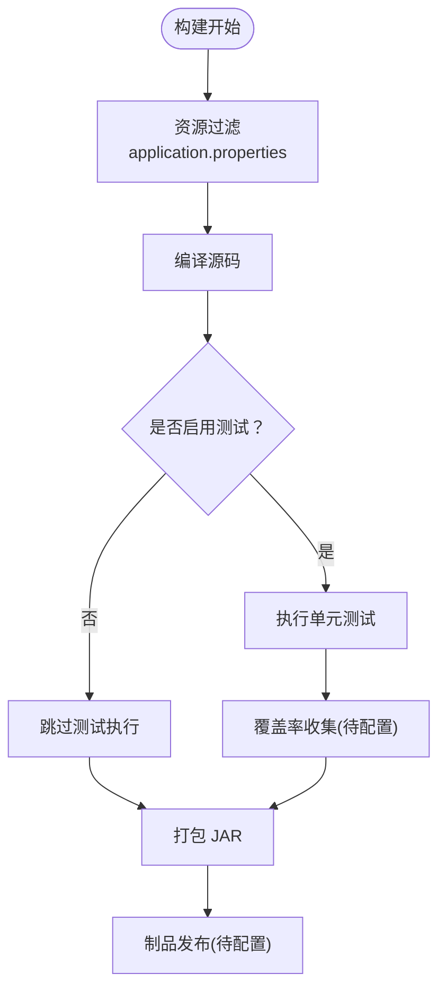
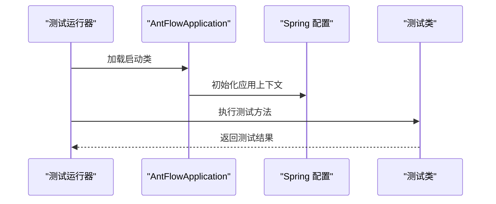
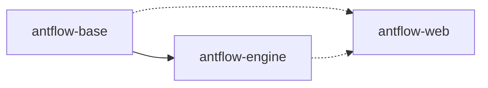

# 代码质量保证

<cite>
**本文引用的文件**
- [根 POM 文件](file://pom.xml)
- [antflow-base 模块 POM](file://antflow-base/pom.xml)
- [antflow-engine 模块 POM](file://antflow-engine/pom.xml)
- [antflow-web 模块 POM](file://antflow-web/pom.xml)
- [AntFlow 应用入口类](file://antflow-web/src/main/java/org/openoa/AntFlowApplication.java)
- [AntFlow 应用测试类](file://antflow-web/src/test/java/org/openoa/AntFlowApplicationTests.java)
- [报告卡片测试类](file://antflow-web/src/test/java/org/openoa/ReportCard.java)
- [Vue 项目配置](file://antflow-vue/vite.config.js)
- [Vue 包管理配置](file://antflow-vue/package.json)
- [Claude 工程评审计划](file://.claude/commands/plan-eng-review.md)
</cite>

## 目录
1. [简介](#简介)
2. [项目结构](#项目结构)
3. [核心组件](#核心组件)
4. [架构总览](#架构总览)
5. [详细组件分析](#详细组件分析)
6. [依赖关系分析](#依赖关系分析)
7. [性能考虑](#性能考虑)
8. [故障排查指南](#故障排查指南)
9. [结论](#结论)
10. [附录](#附录)

## 简介
本指南面向 AntFlow 代码库，提供一套完整的代码质量保证体系，覆盖静态代码分析、代码覆盖率测试、代码规范检查、持续集成质量门禁以及代码审查最佳实践。当前仓库以 Maven 多模块组织，包含基础引擎、Web 展示层及前端 Vue 应用。测试框架为 JUnit/Spring Boot 测试，但当前配置默认跳过测试执行；前端使用 Vite 进行构建与开发。

## 项目结构
AntFlow 采用分层模块化架构：
- 根 POM：统一管理版本、插件、资源过滤与 profiles
- antflow-base：基础逻辑模块，提供通用依赖与打包配置
- antflow-engine：核心引擎模块，依赖基础模块并引入 MyBatis Plus、HTTP 客户端等
- antflow-web：Spring Boot Web 展示模块，聚合基础与引擎模块
- antflow-vue：前端 Vue 应用，使用 Vite 构建

图表来源
- [根 POM 文件:1-236](file://pom.xml#L1-L236)
- [antflow-base 模块 POM:1-250](file://antflow-base/pom.xml#L1-L250)
- [antflow-engine 模块 POM:1-324](file://antflow-engine/pom.xml#L1-L324)
- [antflow-web 模块 POM:1-66](file://antflow-web/pom.xml#L1-L66)

章节来源
- [根 POM 文件:1-236](file://pom.xml#L1-L236)
- [antflow-base 模块 POM:1-250](file://antflow-base/pom.xml#L1-L250)
- [antflow-engine 模块 POM:1-324](file://antflow-engine/pom.xml#L1-L324)
- [antflow-web 模块 POM:1-66](file://antflow-web/pom.xml#L1-L66)

## 核心组件
- 测试执行器：Maven Surefire 插件，默认配置为跳过测试，需按需调整
- 打包与发布：JAR 打包、源码附件、Javadoc 文档与 GPG 签名插件
- 资源过滤：基于 profiles 的 application.properties 动态注入
- 前端构建：Vite 配置与包管理

章节来源
- [根 POM 文件:222-231](file://pom.xml#L222-L231)
- [antflow-base 模块 POM:155-247](file://antflow-base/pom.xml#L155-L247)
- [antflow-engine 模块 POM:229-321](file://antflow-engine/pom.xml#L229-L321)
- [Vue 项目配置](file://antflow-vue/vite.config.js)

## 架构总览
下图展示了从源码到产物的关键路径，以及质量相关插件的介入点：

图表来源
- [根 POM 文件:222-231](file://pom.xml#L222-L231)
- [antflow-base 模块 POM:155-247](file://antflow-base/pom.xml#L155-L247)
- [antflow-engine 模块 POM:229-321](file://antflow-engine/pom.xml#L229-L321)

## 详细组件分析

### Maven 测试与构建配置
- 当前配置通过 Surefire 插件默认跳过测试，如需启用测试与覆盖率，请调整插件配置
- 资源过滤根据激活的 profiles 注入不同环境配置
- 各模块均配置了 JAR 打包、源码附件与 GPG 签名插件，便于制品发布

图表来源
- [根 POM 文件:213-231](file://pom.xml#L213-L231)
- [antflow-base 模块 POM:155-247](file://antflow-base/pom.xml#L155-L247)
- [antflow-engine 模块 POM:229-321](file://antflow-engine/pom.xml#L229-L321)

章节来源
- [根 POM 文件:213-231](file://pom.xml#L213-L231)
- [antflow-web 模块 POM:49-65](file://antflow-web/pom.xml#L49-L65)

### Spring Boot 应用入口与测试
- 应用入口类位于 antflow-web 模块，作为 Spring Boot 启动类
- 存在基础测试类与报告卡片测试类，建议完善测试覆盖与断言

图表来源
- [AntFlow 应用入口类](file://antflow-web/src/main/java/org/openoa/AntFlowApplication.java)
- [AntFlow 应用测试类](file://antflow-web/src/test/java/org/openoa/AntFlowApplicationTests.java)
- [报告卡片测试类](file://antflow-web/src/test/java/org/openoa/ReportCard.java)

章节来源
- [AntFlow 应用入口类](file://antflow-web/src/main/java/org/openoa/AntFlowApplication.java)
- [AntFlow 应用测试类](file://antflow-web/src/test/java/org/openoa/AntFlowApplicationTests.java)
- [报告卡片测试类](file://antflow-web/src/test/java/org/openoa/ReportCard.java)

### 前端构建与质量检查
- 使用 Vite 进行开发与生产构建，建议在 CI 中集成 ESLint、Prettier、TypeScript 类型检查与 Vitest/Jest 测试
- package.json 提供脚本入口，可在 CI 中调用进行质量检查与构建

章节来源
- [Vue 项目配置](file://antflow-vue/vite.config.js)
- [Vue 包管理配置](file://antflow-vue/package.json)

## 依赖关系分析
模块间依赖清晰，Web 展示层聚合基础与引擎模块，引擎模块依赖基础模块与第三方库。

图表来源
- [antflow-web 模块 POM:20-47](file://antflow-web/pom.xml#L20-L47)
- [antflow-engine 模块 POM:18-33](file://antflow-engine/pom.xml#L18-L33)

章节来源
- [antflow-web 模块 POM:20-47](file://antflow-web/pom.xml#L20-L47)
- [antflow-engine 模块 POM:18-33](file://antflow-engine/pom.xml#L18-L33)

## 性能考虑
- 构建性能：合理配置资源过滤与编译参数，避免不必要的资源处理
- 测试性能：在本地开发时可选择性执行测试，CI 中再开启完整测试与覆盖率
- 前端性能：利用 Vite 的快速冷启动与热更新能力，结合 Tree Shaking 与按需加载优化

## 故障排查指南
- 测试未执行：确认 Surefire 插件配置，移除或调整跳过测试的开关
- 资源注入异常：检查 profiles 激活状态与 application.properties 文件存在性
- 前端构建失败：检查 Vite 配置与依赖安装，确保 Node.js 版本兼容
- 代码质量门禁失败：在 CI 中添加质量阈值检查与报告生成步骤

章节来源
- [根 POM 文件:222-231](file://pom.xml#L222-L231)
- [Claude 工程评审计划:512-538](file://.claude/commands/plan-eng-review.md#L512-L538)

## 结论
当前代码库具备良好的模块化基础，但在质量保证方面仍需补齐：启用测试与覆盖率、集成静态分析工具、建立前端质量检查流程、配置 CI 质量门禁。建议按本指南逐步落地，形成可持续的质量保障体系。

## 附录

### 静态代码分析工具集成建议
- SonarQube
  - 在 CI 中添加 SonarScanner 步骤，配置项目令牌与分支信息
  - 在根 POM 中定义 sonar.host.url、sonar.login 等属性
  - 通过覆盖率报告与测试结果提升质量评估准确性
- SpotBugs
  - 在各模块 POM 中添加插件配置，指定分析目标与排除规则
  - 将 SpotBugs 报告输出到 CI 可读取的格式
- Checkmarx
  - 在 CI 中集成 Checkmarx CLI 或扫描器，配置扫描策略与阈值
  - 将扫描结果与质量门禁联动

章节来源
- [根 POM 文件:1-236](file://pom.xml#L1-L236)
- [antflow-base 模块 POM:155-247](file://antflow-base/pom.xml#L155-L247)
- [antflow-engine 模块 POM:229-321](file://antflow-engine/pom.xml#L229-L321)

### 代码覆盖率测试实施策略
- JaCoCo 集成
  - 在根 POM 或模块 POM 中添加 JaCoCo 插件，配置执行目标与报告格式
  - 在 CI 中执行测试并生成覆盖率报告，上传至制品库或质量平台
- 统计与报告
  - 收集 Line、Branch、Class、Method 等维度指标
  - 生成 HTML/XML 报告，并在质量门禁中设置阈值

章节来源
- [根 POM 文件:222-231](file://pom.xml#L222-L231)
- [antflow-base 模块 POM:155-247](file://antflow-base/pom.xml#L155-L247)
- [antflow-engine 模块 POM:229-321](file://antflow-engine/pom.xml#L229-L321)

### 代码规范检查自动化流程
- PMD
  - 在 POM 中配置 PMD 插件，定义规则集与忽略规则
  - 在 CI 中执行 pmd:check 并将违规输出到质量门禁
- FindBugs/SpotBugs
  - 集成 SpotBugs 插件，配置排除列表与报告格式
- ESLint（前端）
  - 在 Vue 项目中配置 ESLint 规则，集成到 CI 的 lint 步骤
  - 与 Prettier 协同，确保代码风格一致

章节来源
- [根 POM 文件:1-236](file://pom.xml#L1-L236)
- [Vue 包管理配置](file://antflow-vue/package.json)

### 持续集成中的质量门禁
- 质量阈值
  - 设定覆盖率阈值（如 Line/Class/Branch）、技术债务、重复率等指标
- 构建失败处理
  - 当任一阈值不达标时，标记构建失败并输出详细报告
- 质量报告发布
  - 将报告上传至制品库或质量平台，供评审与追溯

章节来源
- [Claude 工程评审计划:512-538](file://.claude/commands/plan-eng-review.md#L512-L538)

### 代码审查最佳实践
- Pull Request 审查流程
  - 强制要求最小测试覆盖率与无阻断性问题
  - 使用质量门禁阻止不符合标准的合并请求
- 代码质量标准
  - 明确命名规范、复杂度限制、注释要求与模块边界
- 团队协作
  - 建立定期回顾机制，持续优化质量策略与工具链

章节来源
- [Claude 工程评审计划:501-510](file://.claude/commands/plan-eng-review.md#L501-L510)