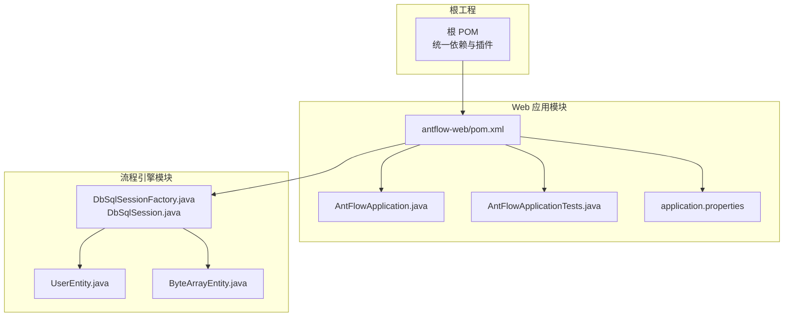
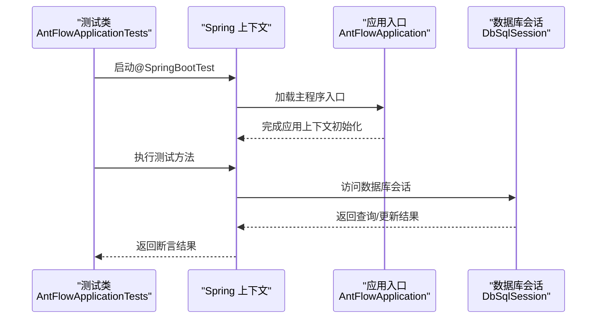
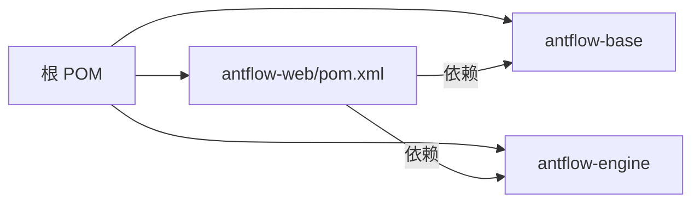

# 单元测试

<cite>
**本文引用的文件**
- [pom.xml](file://pom.xml)
- [antflow-web/pom.xml](file://antflow-web/pom.xml)
- [antflow-web/src/test/java/org/openoa/AntFlowApplicationTests.java](file://antflow-web/src/test/java/org/openoa/AntFlowApplicationTests.java)
- [antflow-web/src/test/java/org/openoa/ReportCard.java](file://antflow-web/src/test/java/org/openoa/ReportCard.java)
- [antflow-web/src/main/resources/application.properties](file://antflow-web/src/main/resources/application.properties)
- [antflow-web/src/main/java/org/openoa/AntFlowApplication.java](file://antflow-web/src/main/java/org/openoa/AntFlowApplication.java)
- [antflow-base/src/main/java/org/activiti/engine/impl/db/DbSqlSessionFactory.java](file://antflow-base/src/main/java/org/activiti/engine/impl/db/DbSqlSessionFactory.java)
- [antflow-base/src/main/java/org/activiti/engine/impl/db/DbSqlSession.java](file://antflow-base/src/main/java/org/activiti/engine/impl/db/DbSqlSession.java)
- [antflow-base/src/main/java/org/activiti/engine/impl/persistence/entity/UserEntity.java](file://antflow-base/src/main/java/org/activiti/engine/impl/persistence/entity/UserEntity.java)
- [antflow-base/src/main/java/org/activiti/engine/impl/persistence/entity/ByteArrayEntity.java](file://antflow-base/src/main/java/org/activiti/engine/impl/persistence/entity/ByteArrayEntity.java)
</cite>

## 目录
1. [简介](#简介)
2. [项目结构](#项目结构)
3. [核心组件](#核心组件)
4. [架构总览](#架构总览)
5. [详细组件分析](#详细组件分析)
6. [依赖分析](#依赖分析)
7. [性能考虑](#性能考虑)
8. [故障排查指南](#故障排查指南)
9. [结论](#结论)
10. [附录](#附录)

## 简介
本指南面向在 AntFlow 工作流系统中编写高质量单元测试的开发者，覆盖 JUnit 测试框架的配置与使用、测试类组织结构、测试方法编写规范、业务逻辑测试策略（Service 层、DAO 层、工具类）、Mock 对象与测试替身的使用、测试数据准备（含内存数据库与测试数据库）、断言与异常测试、参数化测试，以及提升测试覆盖率与测试效率的最佳实践。

## 项目结构
AntFlow 采用多模块 Maven 结构，其中 antflow-web 模块包含应用入口与基础测试骨架；antflow-base 与 antflow-engine 提供流程引擎与持久化能力；根 pom 统一管理依赖与插件。测试相关的关键位置如下：
- 测试入口与上下文：antflow-web/src/test/java 下的测试类
- 应用启动类与配置：antflow-web/src/main/java 与 application.properties
- 持久化与数据库会话：antflow-base 中的 Activiti 数据库会话与实体

**图表来源**
- [pom.xml:1-236](file://pom.xml#L1-L236)
- [antflow-web/pom.xml:1-66](file://antflow-web/pom.xml#L1-L66)
- [antflow-web/src/main/java/org/openoa/AntFlowApplication.java:1-17](file://antflow-web/src/main/java/org/openoa/AntFlowApplication.java#L1-L17)
- [antflow-web/src/test/java/org/openoa/AntFlowApplicationTests.java:1-51](file://antflow-web/src/test/java/org/openoa/AntFlowApplicationTests.java#L1-L51)
- [antflow-web/src/main/resources/application.properties:1-36](file://antflow-web/src/main/resources/application.properties#L1-L36)
- [antflow-base/src/main/java/org/activiti/engine/impl/db/DbSqlSessionFactory.java:232-272](file://antflow-base/src/main/java/org/activiti/engine/impl/db/DbSqlSessionFactory.java#L232-L272)
- [antflow-base/src/main/java/org/activiti/engine/impl/db/DbSqlSession.java:1455-1497](file://antflow-base/src/main/java/org/activiti/engine/impl/db/DbSqlSession.java#L1455-L1497)
- [antflow-base/src/main/java/org/activiti/engine/impl/persistence/entity/UserEntity.java:36-87](file://antflow-base/src/main/java/org/activiti/engine/impl/persistence/entity/UserEntity.java#L36-L87)
- [antflow-base/src/main/java/org/activiti/engine/impl/persistence/entity/ByteArrayEntity.java:38-97](file://antflow-base/src/main/java/org/activiti/engine/impl/persistence/entity/ByteArrayEntity.java#L38-L97)

**章节来源**
- [pom.xml:1-236](file://pom.xml#L1-L236)
- [antflow-web/pom.xml:1-66](file://antflow-web/pom.xml#L1-L66)
- [antflow-web/src/main/java/org/openoa/AntFlowApplication.java:1-17](file://antflow-web/src/main/java/org/openoa/AntFlowApplication.java#L1-L17)
- [antflow-web/src/test/java/org/openoa/AntFlowApplicationTests.java:1-51](file://antflow-web/src/test/java/org/openoa/AntFlowApplicationTests.java#L1-L51)
- [antflow-web/src/main/resources/application.properties:1-36](file://antflow-web/src/main/resources/application.properties#L1-L36)

## 核心组件
- 测试运行器与注解
  - 使用 JUnit 5 的 @SpringBootTest 启动 Spring 上下文，便于集成测试与依赖注入验证
  - 使用 @Test 编写测试方法，如上下文加载测试与业务演示测试
- 测试类组织
  - 建议按功能域分包（如 service、dao、util），每个被测类对应一个 Test 类
  - 测试类命名以被测类名加 Test 或 Tests 后缀
- 断言与异常测试
  - 使用 JUnit 5 的断言 API 进行结果验证
  - 使用异常测试 API 验证受检异常与运行时异常
- 参数化测试
  - 使用 JUnit 5 的参数化能力，结合 CSV、ValueSource 等提供多组输入
- Mock 与测试替身
  - 使用 Mockito 创建桩对象与模拟依赖，隔离外部系统影响
  - 在 Service 层通过 @MockBean 注入模拟对象，在 DAO 层可直接使用内存数据库或测试替身
- 测试数据准备
  - 使用内存数据库（如 H2）或嵌入式数据库进行快速回放
  - 使用 @Sql 或初始化脚本准备测试数据
- 覆盖率与效率
  - 优先单元测试，再集成测试；通过 Mock 与内存数据库减少 IO 与外部依赖
  - 使用参数化测试批量覆盖边界条件

**章节来源**
- [antflow-web/src/test/java/org/openoa/AntFlowApplicationTests.java:1-51](file://antflow-web/src/test/java/org/openoa/AntFlowApplicationTests.java#L1-L51)

## 架构总览
下图展示了测试执行路径与关键组件交互，体现从测试类到 Spring 上下文、再到持久化层的调用关系。

**图表来源**
- [antflow-web/src/test/java/org/openoa/AntFlowApplicationTests.java:1-51](file://antflow-web/src/test/java/org/openoa/AntFlowApplicationTests.java#L1-L51)
- [antflow-web/src/main/java/org/openoa/AntFlowApplication.java:1-17](file://antflow-web/src/main/java/org/openoa/AntFlowApplication.java#L1-L17)
- [antflow-base/src/main/java/org/activiti/engine/impl/db/DbSqlSession.java:1455-1497](file://antflow-base/src/main/java/org/activiti/engine/impl/db/DbSqlSession.java#L1455-L1497)

## 详细组件分析

### 测试类组织与编写规范
- 组织结构
  - 按功能域分包：service、dao、util
  - 每个被测类对应一个测试类，命名清晰可读
- 方法命名
  - 使用动词短语描述行为，如 testCreateUserSuccess、testUpdateUserFailure
  - 异常场景以 test...Throws 或 test...Failure 命名
- 断言策略
  - 使用精确断言：断言返回值、断言状态、断言副作用
  - 对集合与复杂对象使用结构化断言或 JSON 比较
- 异常断言
  - 明确捕获并断言异常类型与消息
- 参数化测试
  - 使用 @ParameterizedTest 与 @CsvSource/@ValueSource 提供多组输入
  - 覆盖边界值、空值、非法值等

**章节来源**
- [antflow-web/src/test/java/org/openoa/AntFlowApplicationTests.java:1-51](file://antflow-web/src/test/java/org/openoa/AntFlowApplicationTests.java#L1-L51)

### Service 层测试策略
- 目标
  - 验证业务规则、事务边界、异常传播
- 方法
  - 使用 @MockBean 注入依赖，隔离外部服务
  - 通过参数化测试覆盖多种业务分支
  - 使用 @Commit/@Rollback 控制事务性测试的提交与回滚
- 示例路径
  - [AntFlowApplicationTests.java:1-51](file://antflow-web/src/test/java/org/openoa/AntFlowApplicationTests.java#L1-L51)

**章节来源**
- [antflow-web/src/test/java/org/openoa/AntFlowApplicationTests.java:1-51](file://antflow-web/src/test/java/org/openoa/AntFlowApplicationTests.java#L1-L51)

### DAO 层测试策略
- 目标
  - 验证 SQL 正确性、参数绑定、结果映射
- 方法
  - 使用内存数据库（如 H2）或测试专用数据库
  - 使用 @Sql 注入初始化脚本，准备测试数据
  - 通过 @Transactional 在测试后回滚，避免污染数据
- 关键实现参考
  - 数据库会话工厂与会话类提供了底层数据库访问能力，测试中可直接依赖其行为进行断言

**章节来源**
- [antflow-base/src/main/java/org/activiti/engine/impl/db/DbSqlSessionFactory.java:232-272](file://antflow-base/src/main/java/org/activiti/engine/impl/db/DbSqlSessionFactory.java#L232-L272)
- [antflow-base/src/main/java/org/activiti/engine/impl/db/DbSqlSession.java:1455-1497](file://antflow-base/src/main/java/org/activiti/engine/impl/db/DbSqlSession.java#L1455-L1497)

### 工具类测试策略
- 目标
  - 验证算法正确性、边界条件、异常处理
- 方法
  - 使用纯函数风格的工具类，必要时通过构造器或静态方法注入依赖
  - 参数化测试覆盖典型与极端输入
  - 对日期时间、格式化、编码等敏感逻辑进行专项断言

**章节来源**
- [antflow-web/src/test/java/org/openoa/ReportCard.java:1-88](file://antflow-web/src/test/java/org/openoa/ReportCard.java#L1-L88)

### Mock 对象与测试替身
- Mockito 应用
  - 使用 @Mock 创建桩对象，@InjectMocks 注入到被测类
  - 使用 when/then 配置行为，verify 断言调用次数与顺序
- 依赖注入与替身
  - 使用 @MockBean 替换 Spring 上下文中的真实 Bean
  - 对第三方服务（HTTP、邮件、消息队列）使用替身或本地模拟
- 实体与会话的测试
  - 可通过 Mock UserEntity 与 ByteArrayEntity 的行为，验证业务对实体的处理逻辑

**章节来源**
- [antflow-base/src/main/java/org/activiti/engine/impl/persistence/entity/UserEntity.java:36-87](file://antflow-base/src/main/java/org/activiti/engine/impl/persistence/entity/UserEntity.java#L36-L87)
- [antflow-base/src/main/java/org/activiti/engine/impl/persistence/entity/ByteArrayEntity.java:38-97](file://antflow-base/src/main/java/org/activiti/engine/impl/persistence/entity/ByteArrayEntity.java#L38-L97)

### 测试数据准备最佳实践
- 内存数据库
  - 使用 H2/SQLite 等嵌入式数据库，快速初始化与销毁
  - 在测试前执行初始化脚本，测试后回滚或清空
- 测试数据库
  - 使用专用测试库或容器化数据库实例，保证隔离性
- 配置与环境
  - 通过 application.properties 设置激活配置文件，区分 dev/uat/pro
  - 在测试中可通过 @ActiveProfiles 或测试属性覆盖默认配置

**章节来源**
- [antflow-web/src/main/resources/application.properties:1-36](file://antflow-web/src/main/resources/application.properties#L1-L36)

### 断言、异常测试与参数化测试
- 断言
  - 使用 JUnit 5 的 Assertions API，对返回值、集合大小、异常类型进行断言
- 异常测试
  - 使用 assertThrows/expectThrows 验证异常抛出
- 参数化
  - 使用 @ParameterizedTest 与 @CsvSource/@ValueSource 提供多组输入，覆盖边界与错误场景

**章节来源**
- [antflow-web/src/test/java/org/openoa/AntFlowApplicationTests.java:1-51](file://antflow-web/src/test/java/org/openoa/AntFlowApplicationTests.java#L1-L51)

## 依赖分析
- 测试框架与 Spring Boot
  - 根 POM 引入 spring-boot-starter-test，提供 JUnit 5、Mockito、AssertJ 等测试依赖
  - antflow-web 模块继承父 POM，复用统一的测试配置
- 数据库与持久化
  - antflow-base 提供 Activiti 的数据库会话与实体，测试中可直接依赖其行为
- 插件与构建
  - maven-surefire-plugin 默认跳过测试，可在 CI/CD 中显式启用

**图表来源**
- [pom.xml:1-236](file://pom.xml#L1-L236)
- [antflow-web/pom.xml:1-66](file://antflow-web/pom.xml#L1-L66)

**章节来源**
- [pom.xml:1-236](file://pom.xml#L1-L236)
- [antflow-web/pom.xml:1-66](file://antflow-web/pom.xml#L1-L66)

## 性能考虑
- 减少外部依赖
  - 使用 Mock 与内存数据库替代真实数据库与网络服务
- 并行与隔离
  - 将无共享状态的测试并行执行，避免共享资源竞争
- 快速失败
  - 在 setUp 中准备最小化数据集，缩短测试执行时间
- 覆盖关键路径
  - 优先覆盖高频路径与边界条件，平衡覆盖率与执行时间

## 故障排查指南
- 测试无法启动或上下文加载失败
  - 检查 @SpringBootTest 是否指向正确的应用入口类
  - 确认 application.properties 的配置文件激活是否正确
- 数据库相关测试失败
  - 检查数据库方言与驱动配置，确认内存数据库初始化脚本可用
  - 确保测试事务在结束后回滚，避免数据污染
- Mock 不生效
  - 确认 @MockBean 注入的 Bean 名称与类型一致
  - 检查被测类是否通过构造器或 setter 注入依赖
- 参数化测试未执行
  - 确认 @ParameterizedTest 注解与提供器（如 @CsvSource）正确配置

**章节来源**
- [antflow-web/src/main/java/org/openoa/AntFlowApplication.java:1-17](file://antflow-web/src/main/java/org/openoa/AntFlowApplication.java#L1-L17)
- [antflow-web/src/main/resources/application.properties:1-36](file://antflow-web/src/main/resources/application.properties#L1-L36)

## 结论
通过合理的测试组织、Mock 与内存数据库策略、参数化与异常测试，以及对覆盖率与性能的关注，可以在 AntFlow 项目中建立稳定高效的测试体系。建议从 Service 与 DAO 层开始，逐步完善工具类与集成测试，持续提升质量与交付效率。

## 附录
- 测试类示例路径
  - [AntFlowApplicationTests.java:1-51](file://antflow-web/src/test/java/org/openoa/AntFlowApplicationTests.java#L1-L51)
  - [ReportCard.java:1-88](file://antflow-web/src/test/java/org/openoa/ReportCard.java#L1-L88)
- 配置参考
  - [application.properties:1-36](file://antflow-web/src/main/resources/application.properties#L1-L36)
- 持久化实现参考
  - [DbSqlSessionFactory.java:232-272](file://antflow-base/src/main/java/org/activiti/engine/impl/db/DbSqlSessionFactory.java#L232-L272)
  - [DbSqlSession.java:1455-1497](file://antflow-base/src/main/java/org/activiti/engine/impl/db/DbSqlSession.java#L1455-L1497)
  - [UserEntity.java:36-87](file://antflow-base/src/main/java/org/activiti/engine/impl/persistence/entity/UserEntity.java#L36-L87)
  - [ByteArrayEntity.java:38-97](file://antflow-base/src/main/java/org/activiti/engine/impl/persistence/entity/ByteArrayEntity.java#L38-L97)