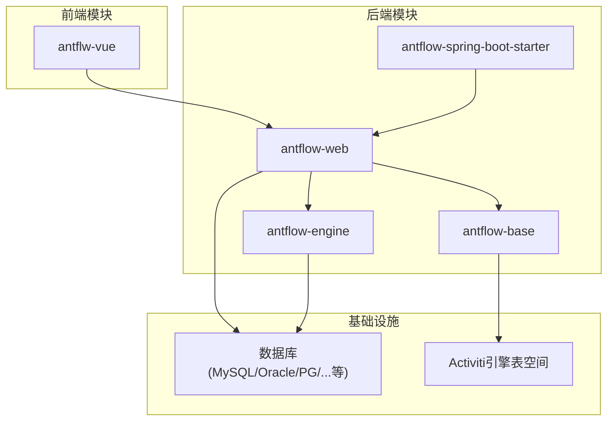
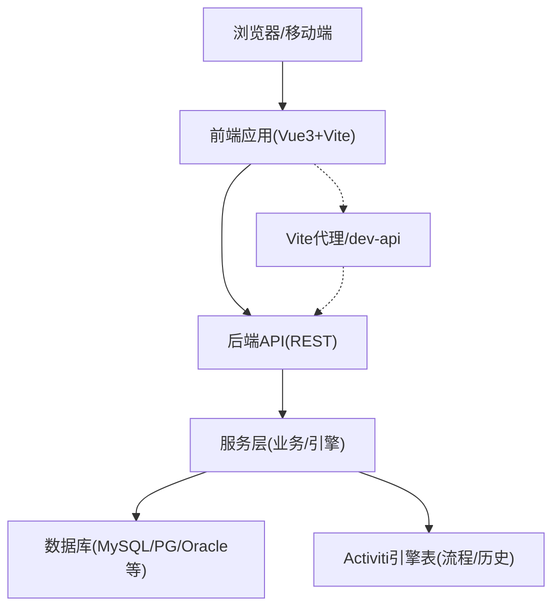
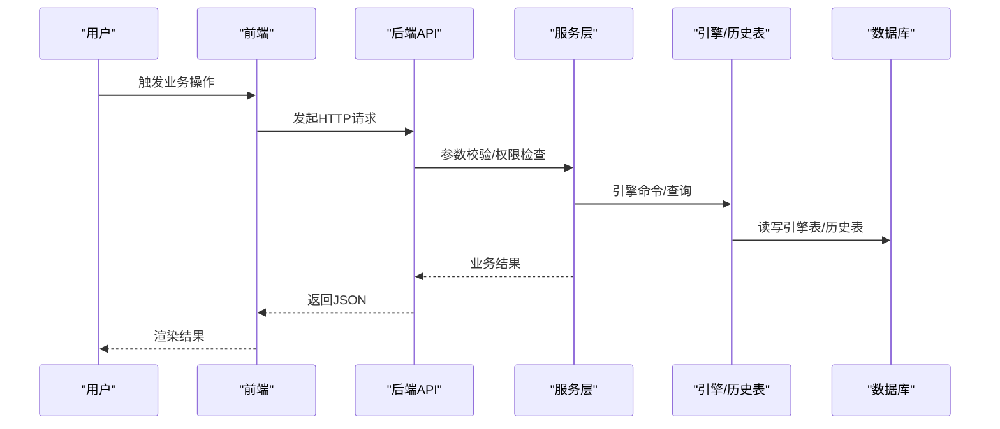
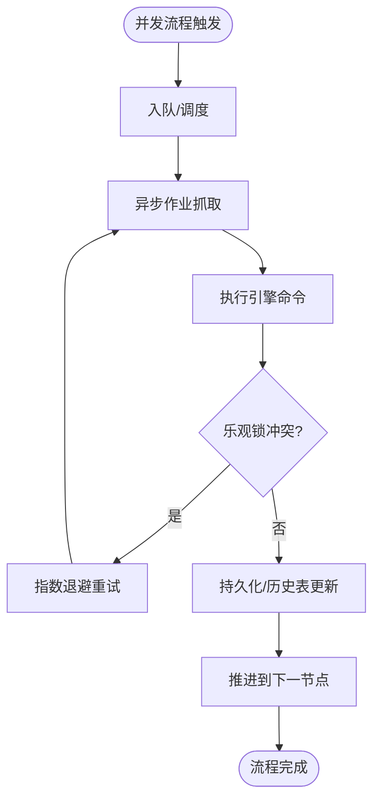
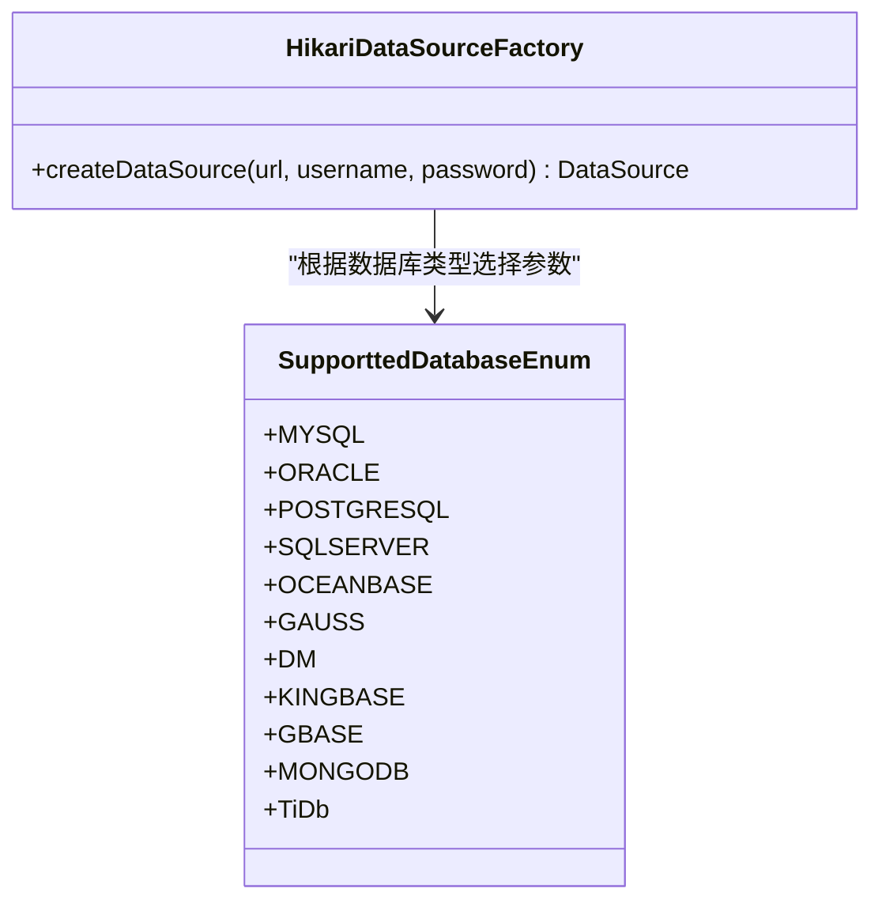
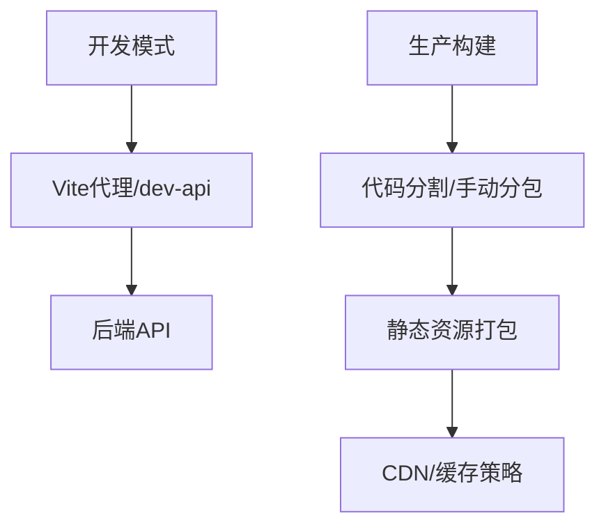
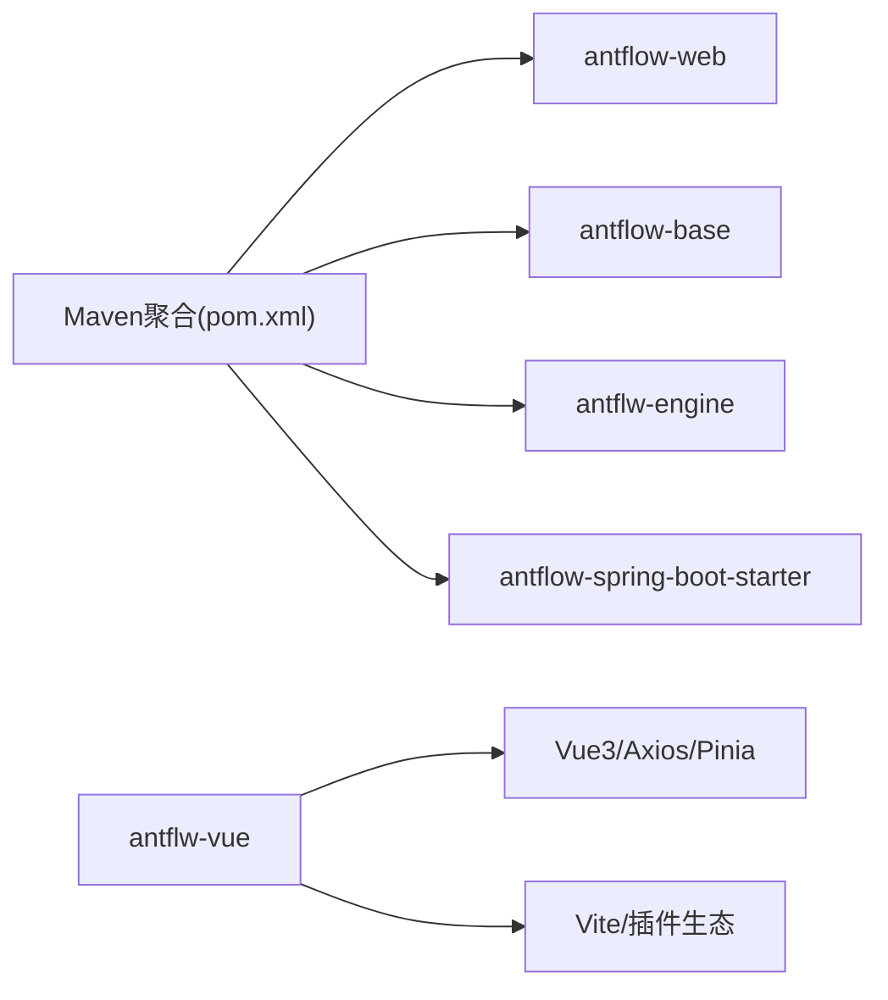

# 性能测试

<cite>
**本文引用的文件**   
- [README.zh_CN.md](file://README.zh_CN.md)
- [pom.xml](file://pom.xml)
- [act_init_db.sql](file://script/act_init_db.sql)
- [20.开发者指南.md](file://doc/系统介绍篇/20.开发者指南.md)
- [package.json](file://antflw-vue/package.json)
- [vite.config.js](file://antflw-vue/vite.config.js)
- [index.html](file://antflw-vue/index.html)
- [AntFlowApplicationTests.java](file://antflw-web/src/test/java/org/openoa/AntFlowApplicationTests.java)
- [HikariDataSourceFactory.java](file://antflw-engine/src/main/java/org/openoa/engine/conf/engineconfig/HikariDataSourceFactory.java)
- [SupporttedDatabaseEnum.java](file://antflw-base/src/main/java/org/openoa/base/constant/enums/SupporttedDatabaseEnum.java)
- [AcquireAsyncJobsDueRunnable.java](file://antflw-base/src/main/java/org/activiti/engine/impl/asyncexecutor/AcquireAsyncJobsDueRunnable.java)
- [RetryInterceptor.java](file://antflw-base/src/main/java/org/activiti/engine/impl/interceptor/RetryInterceptor.java)
- [BpmProcessNodeOvertimeBizService.java](file://antflw-engine/src/main/java/org/openoa/engine/bpmnconf/service/interf/biz/BpmProcessNodeOvertimeBizService.java)
</cite>

## 目录
1. [引言](#引言)
2. [项目结构](#项目结构)
3. [核心组件](#核心组件)
4. [架构总览](#架构总览)
5. [详细组件分析](#详细组件分析)
6. [依赖分析](#依赖分析)
7. [性能考量](#性能考量)
8. [故障排查指南](#故障排查指南)
9. [结论](#结论)
10. [附录](#附录)

## 引言
本指南面向在 AntFlow 工作流平台上的性能测试与调优，系统性阐述从规划到实施的全流程方法论，覆盖负载测试、压力测试、稳定性测试的设计要点；涵盖后端 REST API、前端页面与组件渲染、数据库连接池与异步任务队列等关键路径的性能测试策略；并提供性能指标采集与瓶颈定位、优化建议与最佳实践，帮助在真实业务场景中稳定交付高性能系统。

## 项目结构
AntFlow 采用多模块 Maven 结构，后端以 Spring Boot 2.7.17 为基础，前端基于 Vue 3 + Vite，工作流内核基于 Activiti 引擎定制。整体结构如下：

图表来源
- [pom.xml:1-11](file://pom.xml#L1-L11)
- [README.zh_CN.md:62-69](file://README.zh_CN.md#L62-L69)

章节来源
- [pom.xml:1-11](file://pom.xml#L1-L11)
- [README.zh_CN.md:62-69](file://README.zh_CN.md#L62-L69)

## 核心组件
- 后端 REST API 层：提供 BPMN 配置、流程操作、任务管理、表单管理、外部集成等接口，详见开发者指南的 API 分层与数据层映射。
- 工作流引擎与历史表：基于 Activiti 的引擎表与历史表，支撑流程实例、任务、变量、附件、事件日志等运行期数据。
- 数据访问层：MyBatis Plus 与 Druid/Hikari 连接池，支持多数据源与动态数据源配置。
- 前端工程：Vue 3 + Vite，包含路由、状态管理、UI 组件、打包与代理配置。
- 测试基座：Spring Boot 测试与基础单元测试骨架。

章节来源
- [20.开发者指南.md:376-422](file://doc/系统介绍篇/20.开发者指南.md#L376-L422)
- [act_init_db.sql:1-200](file://script/act_init_db.sql#L1-L200)
- [HikariDataSourceFactory.java:1-26](file://antflw-engine/src/main/java/org/openoa/engine/conf/engineconfig/HikariDataSourceFactory.java#L1-L26)
- [package.json:1-54](file://antflw-vue/package.json#L1-L54)

## 架构总览
后端 REST API 通过服务层调用引擎与业务服务，持久化至数据库；前端通过 Vite 开发服务器与后端 API 交互，生产环境进行静态资源打包与 CDN 化。

图表来源
- [20.开发者指南.md:380-422](file://doc/系统介绍篇/20.开发者指南.md#L380-L422)
- [vite.config.js:64-81](file://antflw-vue/vite.config.js#L64-L81)

## 详细组件分析

### 后端 REST API 性能测试
- 接口范围：BPMN 配置、流程操作、任务管理、表单管理、外部集成等。
- 测试目标：吞吐量、平均/95/99 响应时间、错误率、并发用户数、资源占用。
- 关键路径：鉴权、参数校验、业务编排、引擎交互、持久化写入。
- 并发模型：阶梯式并发、恒定并发、混合场景（登录/查询/提交/导出）。
- 数据准备：构造真实业务数据集，含流程模板、任务、变量、附件等。
- 监控指标：QPS、P95/P99 响应时间、CPU/内存/GC、数据库连接池使用率、线程池排队长度。

图表来源
- [20.开发者指南.md:380-422](file://doc/系统介绍篇/20.开发者指南.md#L380-L422)

章节来源
- [20.开发者指南.md:376-422](file://doc/系统介绍篇/20.开发者指南.md#L376-L422)
- [AntFlowApplicationTests.java:1-51](file://antflw-web/src/test/java/org/openoa/AntFlowApplicationTests.java#L1-L51)

### 工作流并发执行与任务处理性能测试
- 并发场景：多流程同时发起、并行/会签节点、多实例任务、动态跳转、回退/撤销。
- 关注点：引擎异步作业抓取与执行、乐观锁冲突、历史表写入放大、变量与附件读写。
- 异步任务：异步作业抓取线程、队列容量、等待策略、重试机制。
- 超时与告警：节点超时检测、定时扫描与告警。

图表来源
- [AcquireAsyncJobsDueRunnable.java:1-90](file://antflw-base/src/main/java/org/activiti/engine/impl/asyncexecutor/AcquireAsyncJobsDueRunnable.java#L1-L90)
- [RetryInterceptor.java:34-92](file://antflw-base/src/main/java/org/activiti/engine/impl/interceptor/RetryInterceptor.java#L34-L92)
- [BpmProcessNodeOvertimeBizService.java:1-12](file://antflw-engine/src/main/java/org/openoa/engine/bpmnconf/service/interf/biz/BpmProcessNodeOvertimeBizService.java#L1-L12)

章节来源
- [AcquireAsyncJobsDueRunnable.java:1-90](file://antflw-base/src/main/java/org/activiti/engine/impl/asyncexecutor/AcquireAsyncJobsDueRunnable.java#L1-L90)
- [RetryInterceptor.java:34-92](file://antflw-base/src/main/java/org/activiti/engine/impl/interceptor/RetryInterceptor.java#L34-L92)
- [BpmProcessNodeOvertimeBizService.java:1-12](file://antflw-engine/src/main/java/org/openoa/engine/bpmnconf/service/interf/biz/BpmProcessNodeOvertimeBizService.java#L1-L12)

### 数据库连接池与多数据源测试
- 连接池：Hikari 默认工厂，最大池大小、最小空闲、连接生命周期等参数直接影响吞吐与延迟。
- 多数据源：动态数据源配置可按租户/业务域隔离，需关注连接池隔离与切换成本。
- 数据库类型：支持 MySQL、Oracle、PostgreSQL、SQLServer、OceanBase、openGauss、达梦、金仓、南大通用、MongoDB、TiDB 等，需分别验证性能特征。
- 表空间：引擎表与业务表分离，历史表写入密集，需评估索引与分区策略。

图表来源
- [HikariDataSourceFactory.java:1-26](file://antflw-engine/src/main/java/org/openoa/engine/conf/engineconfig/HikariDataSourceFactory.java#L1-L26)
- [SupporttedDatabaseEnum.java:1-39](file://antflw-base/src/main/java/org/openoa/base/constant/enums/SupporttedDatabaseEnum.java#L1-L39)

章节来源
- [HikariDataSourceFactory.java:1-26](file://antflw-engine/src/main/java/org/openoa/engine/conf/engineconfig/HikariDataSourceFactory.java#L1-L26)
- [SupporttedDatabaseEnum.java:1-39](file://antflw-base/src/main/java/org/openoa/base/constant/enums/SupporttedDatabaseEnum.java#L1-L39)

### 前端性能测试
- 页面加载：首屏时间、资源体积、分包策略、懒加载、CDN 与缓存。
- 组件渲染：复杂表格/图表渲染、虚拟滚动、防抖/节流、组件卸载清理。
- 网络请求：接口合并、缓存策略、长列表分页、并发请求限流。
- 开发体验：Vite 代理、热更新、SourceMap 控制、构建产物分析。

图表来源
- [vite.config.js:64-81](file://antflw-vue/vite.config.js#L64-L81)
- [vite.config.js:32-62](file://antflw-vue/vite.config.js#L32-L62)
- [package.json:1-54](file://antflw-vue/package.json#L1-L54)

章节来源
- [vite.config.js:64-81](file://antflw-vue/vite.config.js#L64-L81)
- [vite.config.js:32-62](file://antflw-vue/vite.config.js#L32-L62)
- [package.json:1-54](file://antflw-vue/package.json#L1-L54)
- [index.html:203-215](file://antflw-vue/index.html#L203-L215)

## 依赖分析
- 后端依赖：Spring Boot、MyBatis Plus、Druid/Hikari、HTTP 客户端、Jackson/Fastjson2、Servlet API、JDBC 驱动等。
- 前端依赖：Vue 3、Element Plus、Axios、Pinia、路由、构建工具链等。
- 数据库驱动：MySQL Connector/J、PostgreSQL Driver、SQLServer Driver 等，需与数据库类型匹配。

图表来源
- [pom.xml:1-11](file://pom.xml#L1-L11)
- [package.json:1-54](file://antflw-vue/package.json#L1-L54)

章节来源
- [pom.xml:1-11](file://pom.xml#L1-L11)
- [package.json:1-54](file://antflw-vue/package.json#L1-L54)

## 性能考量
- 后端
  - 批量操作与缓存：对大数据集使用批量写入与热点数据缓存。
  - 事务边界：避免长事务与跨库事务，减少锁竞争。
  - 异步与队列：合理配置异步作业抓取与重试，避免队列积压。
  - 数据库：根据业务热点建立索引，历史表按时间分区，控制变量与附件大小。
- 前端
  - 代码分割与懒加载：拆分第三方库与业务模块，降低首屏体积。
  - 图表与表格：虚拟化、分页、增量渲染。
  - 请求优化：合并请求、缓存策略、并发限制。
- 数据库
  - 连接池参数：最大活跃、最小空闲、空闲回收、连接超时。
  - 多数据源：隔离与切换成本，避免频繁切换。
  - 支持的数据库：针对不同数据库的特性（如 Oracle/PG 的序列/函数差异）进行针对性优化。

章节来源
- [20.开发者指南.md:426-442](file://doc/系统介绍篇/20.开发者指南.md#L426-L442)
- [HikariDataSourceFactory.java:1-26](file://antflw-engine/src/main/java/org/openoa/engine/conf/engineconfig/HikariDataSourceFactory.java#L1-L26)
- [SupporttedDatabaseEnum.java:1-39](file://antflw-base/src/main/java/org/openoa/base/constant/enums/SupporttedDatabaseEnum.java#L1-L39)

## 故障排查指南
- 引擎异步作业抓取异常
  - 现象：队列积压、执行延迟、集群环境下乐观锁异常。
  - 排查：检查抓取等待时间、队列满等待时间、重试次数与退避因子。
- 乐观锁冲突
  - 现象：更新失败、重试日志增多。
  - 排查：调整重试策略、减少并发写入热点、优化业务流程减少冲突。
- 节点超时与告警
  - 现象：节点超时触发、流程停滞。
  - 排查：检查超时阈值、任务扫描频率、后台线程健康度。
- 前端白屏/长时间加载
  - 现象：首屏时间过长、资源加载失败。
  - 排查：检查代理配置、构建产物、CDN 缓存、分包策略。

章节来源
- [AcquireAsyncJobsDueRunnable.java:1-90](file://antflw-base/src/main/java/org/activiti/engine/impl/asyncexecutor/AcquireAsyncJobsDueRunnable.java#L1-L90)
- [RetryInterceptor.java:34-92](file://antflw-base/src/main/java/org/activiti/engine/impl/interceptor/RetryInterceptor.java#L34-L92)
- [BpmProcessNodeOvertimeBizService.java:1-12](file://antflw-engine/src/main/java/org/openoa/engine/bpmnconf/service/interf/biz/BpmProcessNodeOvertimeBizService.java#L1-L12)
- [vite.config.js:64-81](file://antflw-vue/vite.config.js#L64-L81)

## 结论
性能测试应贯穿开发全生命周期，围绕后端 API、工作流引擎、数据库与前端三大路径建立系统化方案。通过合理的并发模型、数据准备、指标采集与瓶颈定位，结合连接池与多数据源优化、前端资源治理与网络请求优化，可显著提升系统在高并发与大数据量场景下的稳定性与用户体验。

## 附录
- 测试工具与场景建议
  - 后端：JMeter/LoadRunner/Gatling，构造登录/查询/提交/导出等典型场景，阶梯式并发压测。
  - 前端：Lighthouse/Web Vitals/Chrome DevTools，测量首次内容绘制、累积布局偏移、网络瀑布图。
  - 数据库：sysbench/tpcc，验证连接池与热点表性能。
- 指标清单
  - 后端：QPS、P95/P99 响应时间、错误率、线程池队列长度、数据库连接池活跃数、GC 时间。
  - 前端：FCP/LCP/INP/CLS、首屏资源体积、缓存命中率、网络重传率。
  - 引擎：异步作业抓取速率、重试次数、历史表写入延迟。