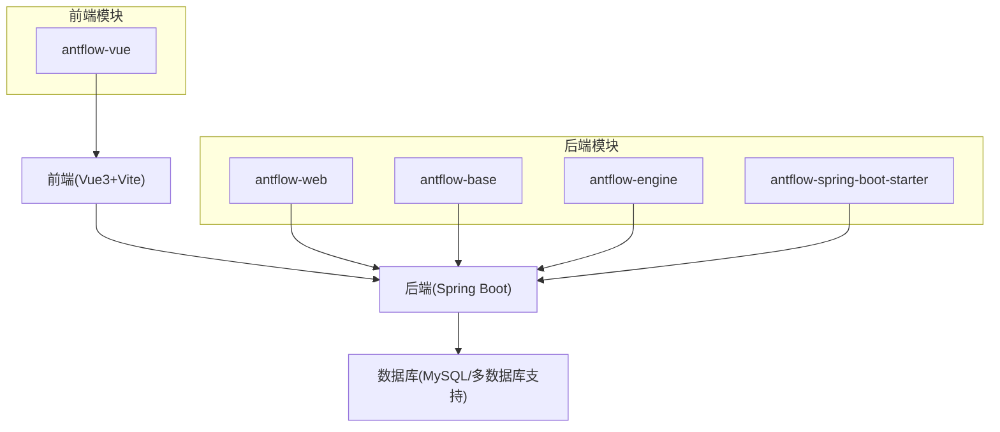
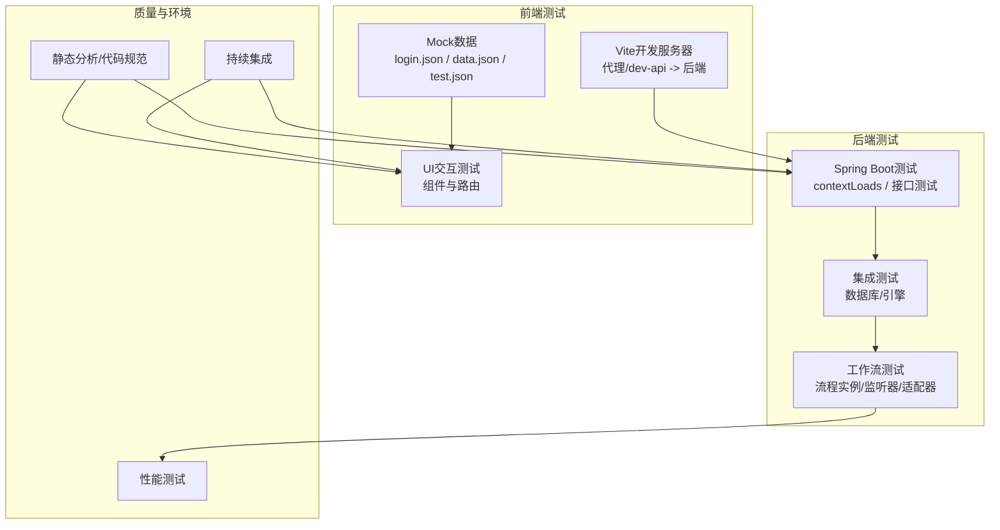
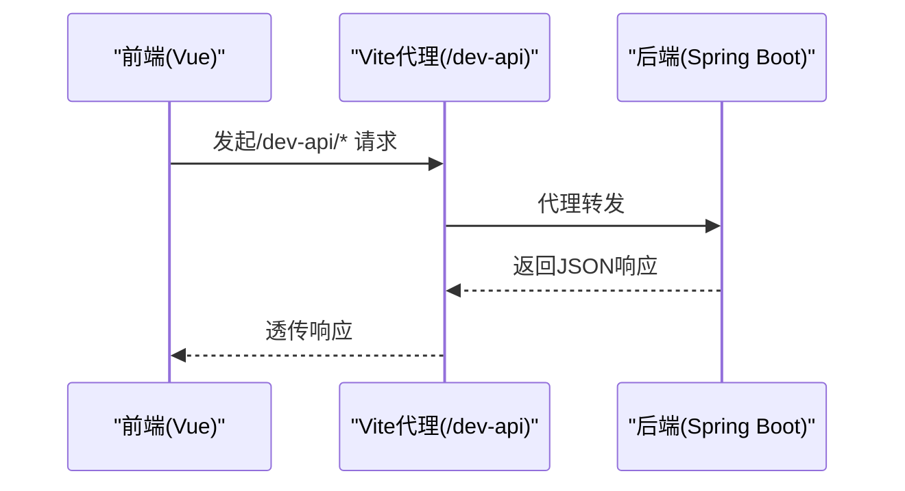
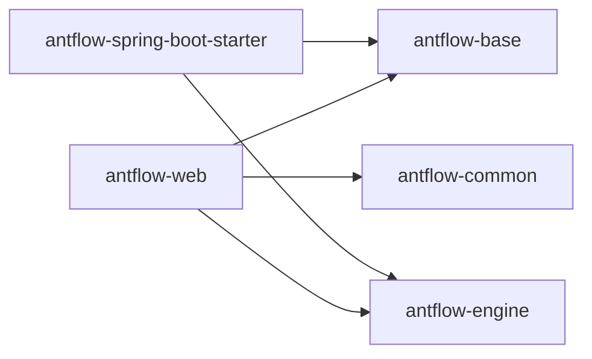

# 测试与质量保证

<cite>
**本文引用的文件**
- [antflow-web/src/test/java/org/openoa/AntFlowApplicationTests.java](file://antflow-web/src/test/java/org/openoa/AntFlowApplicationTests.java)
- [antflow-web/src/test/java/org/openoa/ReportCard.java](file://antflow-web/src/test/java/org/openoa/ReportCard.java)
- [antflow-web/pom.xml](file://antflow-web/pom.xml)
- [antflow-base/pom.xml](file://antflow-base/pom.xml)
- [pom.xml](file://pom.xml)
- [antflow-vue/package.json](file://antflow-vue/package.json)
- [antflow-vue/vite.config.js](file://antflow-vue/vite.config.js)
- [antflow-vue/public/mock/test.json](file://antflow-vue/public/mock/test.json)
- [antflow-vue/public/mock/data.json](file://antflow-vue/public/mock/data.json)
- [antflow-vue/public/mock/login.json](file://antflow-vue/public/mock/login.json)
- [antflow-vue/public/docs/前端手册.md](file://antflow-vue/public/docs/前端手册.md)
- [antflow-vue/public/docs/前端运行.md](file://antflow-vue/public/docs/前端运行.md)
- [antflow-vue/public/docs/前端部署.md](file://antflow-vue/public/docs/前端部署.md)
- [README.zh_CN.md](file://README.zh_CN.md)
</cite>

## 目录
1. [引言](#引言)
2. [项目结构](#项目结构)
3. [核心组件](#核心组件)
4. [架构总览](#架构总览)
5. [详细组件分析](#详细组件分析)
6. [依赖分析](#依赖分析)
7. [性能考虑](#性能考虑)
8. [故障排查指南](#故障排查指南)
9. [结论](#结论)
10. [附录](#附录)

## 引言
本指南面向AntFlow工作流系统，围绕测试与质量保证提供一套可操作的实践方案。内容涵盖单元测试配置、业务逻辑测试策略、API接口测试自动化、集成测试与端到端测试设计、工作流测试验证流程、代码质量检查与静态分析、性能测试执行方案、测试数据管理与测试环境搭建、持续集成配置建议，以及测试最佳实践与质量保证流程。

## 项目结构
AntFlow采用前后端分离架构，后端基于Spring Boot与Activiti引擎，前端基于Vue3与Vite。测试与质量保证涉及后端Spring Boot测试、前端Vite开发与构建、Mock数据与接口代理、以及多模块Maven工程的统一测试策略。

图表来源
- [antflow-web/pom.xml:20-48](file://antflow-web/pom.xml#L20-L48)
- [antflow-base/pom.xml:144-154](file://antflow-base/pom.xml#L144-L154)
- [pom.xml:222-231](file://pom.xml#L222-L231)
- [antflow-vue/vite.config.js:1-100](file://antflow-vue/vite.config.js#L1-L100)

章节来源
- [antflow-web/pom.xml:1-66](file://antflow-web/pom.xml#L1-L66)
- [antflow-base/pom.xml:144-154](file://antflow-base/pom.xml#L144-L154)
- [pom.xml:222-231](file://pom.xml#L222-L231)
- [antflow-vue/vite.config.js:1-100](file://antflow-vue/vite.config.js#L1-L100)

## 核心组件
- 后端测试基座：Spring Boot测试注解与上下文加载，覆盖基础业务场景与接口测试。
- 前端测试与Mock：Vite开发服务器代理后端接口，前端Mock数据驱动UI交互测试。
- 模块化Maven工程：统一的Surefire测试跳过配置，便于CI/CD中按需启用测试。
- 工作流引擎与业务适配：基于Activiti的流程引擎，配合业务适配器与监听器实现流程控制与验证。

章节来源
- [antflow-web/src/test/java/org/openoa/AntFlowApplicationTests.java:1-51](file://antflow-web/src/test/java/org/openoa/AntFlowApplicationTests.java#L1-L51)
- [antflow-vue/vite.config.js:64-81](file://antflow-vue/vite.config.js#L64-L81)
- [antflow-vue/public/mock/test.json](file://antflow-vue/public/mock/test.json)
- [antflow-base/pom.xml:158-165](file://antflow-base/pom.xml#L158-L165)
- [pom.xml:224-231](file://pom.xml#L224-L231)

## 架构总览
测试与质量保证贯穿前端、后端与数据库三层，形成“单元测试-接口测试-集成测试-端到端测试”的金字塔式质量体系。

图表来源
- [antflow-vue/vite.config.js:64-81](file://antflow-vue/vite.config.js#L64-L81)
- [antflow-vue/public/mock/login.json](file://antflow-vue/public/mock/login.json)
- [antflow-vue/public/mock/data.json](file://antflow-vue/public/mock/data.json)
- [antflow-vue/public/mock/test.json](file://antflow-vue/public/mock/test.json)
- [antflow-web/src/test/java/org/openoa/AntFlowApplicationTests.java:6-17](file://antflow-web/src/test/java/org/openoa/AntFlowApplicationTests.java#L6-L17)
- [antflow-base/pom.xml:158-165](file://antflow-base/pom.xml#L158-L165)

## 详细组件分析

### 单元测试配置与实现
- 后端Spring Boot测试：使用@SpringBootTest注解加载应用上下文，结合JUnit 5进行基础断言与接口测试骨架。
- 前端测试：Vite开发服务器通过代理将/dev-api请求转发至后端，便于前端联调与接口测试。
- Mock数据：前端public/mock目录提供登录、业务数据与测试数据，支撑UI与接口测试。

图表来源
- [antflow-vue/vite.config.js:68-80](file://antflow-vue/vite.config.js#L68-L80)
- [antflow-vue/public/mock/login.json](file://antflow-vue/public/mock/login.json)
- [antflow-web/src/test/java/org/openoa/AntFlowApplicationTests.java:6-17](file://antflow-web/src/test/java/org/openoa/AntFlowApplicationTests.java#L6-L17)

章节来源
- [antflow-web/src/test/java/org/openoa/AntFlowApplicationTests.java:1-51](file://antflow-web/src/test/java/org/openoa/AntFlowApplicationTests.java#L1-L51)
- [antflow-vue/vite.config.js:64-81](file://antflow-vue/vite.config.js#L64-L81)
- [antflow-vue/public/mock/test.json](file://antflow-vue/public/mock/test.json)

### 业务逻辑测试策略
- 分层测试：后端Service/Controller层分别进行单元测试与集成测试；前端组件与路由进行单元测试与快照测试。
- Mock策略：前端使用Mock数据模拟后端接口；后端通过测试数据库与内存数据库(如H2)进行隔离测试。
- 边界与异常：覆盖空输入、非法参数、权限不足、并发冲突等边界与异常场景。

章节来源
- [antflow-vue/public/mock/data.json](file://antflow-vue/public/mock/data.json)
- [antflow-vue/public/mock/login.json](file://antflow-vue/public/mock/login.json)

### API接口测试自动化
- 自动化框架：建议使用REST客户端或测试框架(如RestAssured、Postman/Newman)对后端接口进行批量验证。
- 数据驱动：结合Mock数据与数据库快照，实现参数化测试与回归测试。
- 断言策略：状态码、响应体结构、字段类型、业务规则一致性等。

章节来源
- [antflow-vue/vite.config.js:68-80](file://antflow-vue/vite.config.js#L68-L80)
- [antflow-vue/public/mock/test.json](file://antflow-vue/public/mock/test.json)

### 集成测试设计思路
- 环境隔离：使用独立测试数据库或容器化数据库，避免与开发/生产数据冲突。
- 流程引擎集成：通过Activiti API启动流程实例、提交任务、查询历史，验证流程控制与业务适配器。
- 监听器与适配器：验证流程监听器、按钮操作处理器、表单适配器在集成场景下的行为。

章节来源
- [antflow-base/pom.xml:158-165](file://antflow-base/pom.xml#L158-L165)
- [pom.xml:224-231](file://pom.xml#L224-L231)

### 端到端测试实施方法
- UI自动化：使用前端自动化测试框架(如Cypress/Vitest)对关键业务流程进行端到端验证。
- 数据准备：通过脚本或Mock初始化测试数据，确保测试可重复性。
- 截图与日志：记录关键步骤截图与日志，便于问题定位与回归。

章节来源
- [antflow-vue/package.json:1-54](file://antflow-vue/package.json#L1-L54)
- [antflow-vue/public/docs/前端手册.md](file://antflow-vue/public/docs/前端手册.md)
- [antflow-vue/public/docs/前端运行.md](file://antflow-vue/public/docs/前端运行.md)
- [antflow-vue/public/docs/前端部署.md](file://antflow-vue/public/docs/前端部署.md)

### 工作流测试验证流程
- 流程实例生命周期：验证流程启动、节点执行、任务完成、流程结束的完整链路。
- 动态控制：验证动态跳过、退回、委托、转办、变更处理人等动态控制逻辑。
- 版本与迁移：验证流程版本管理与迁移过程中的数据一致性与行为正确性。

章节来源
- [antflow-base/pom.xml:158-165](file://antflow-base/pom.xml#L158-L165)

### 代码质量检查与静态分析
- 后端静态分析：建议引入SpotBugs/FindBugs、PMD、Checkstyle或SonarQube，结合Maven插件在CI中执行。
- 前端静态分析：使用ESLint、Stylelint、Vite内置类型检查，结合pre-commit钩子强制执行。
- 规范与约束：统一命名、复杂度阈值、注释与文档覆盖率指标。

章节来源
- [antflow-web/pom.xml:49-66](file://antflow-web/pom.xml#L49-L66)
- [antflow-base/pom.xml:155-250](file://antflow-base/pom.xml#L155-L250)
- [pom.xml:220-236](file://pom.xml#L220-L236)

### 性能测试执行方案
- 接口性能：使用JMeter/Gatling对关键接口进行并发与吞吐测试，关注P95/P99延迟。
- 前端性能：使用Lighthouse/SpeedCurve评估首屏加载、交互延迟与资源体积。
- 工作流性能：模拟多实例并发执行，监控数据库锁、引擎作业队列与内存占用。

章节来源
- [antflow-vue/package.json:8-13](file://antflow-vue/package.json#L8-L13)
- [antflow-vue/vite.config.js:32-62](file://antflow-vue/vite.config.js#L32-L62)

### 测试数据管理
- 前端Mock：集中管理在public/mock目录，按模块划分，便于维护与替换。
- 后端测试数据：使用SQL脚本或测试框架的种子数据机制，确保测试前置数据一致。
- 数据隔离：测试数据库与开发/生产数据库分离，避免交叉污染。

章节来源
- [antflow-vue/public/mock/test.json](file://antflow-vue/public/mock/test.json)
- [antflow-vue/public/mock/data.json](file://antflow-vue/public/mock/data.json)
- [antflow-vue/public/mock/login.json](file://antflow-vue/public/mock/login.json)

### 测试环境搭建
- 后端：参考项目文档配置数据库与应用属性，确保测试数据库可访问。
- 前端：安装依赖后通过Vite开发服务器启动，配置代理指向后端。
- 多数据库支持：根据文档选择目标数据库，执行初始化脚本。

章节来源
- [README.zh_CN.md:112-119](file://README.zh_CN.md#L112-L119)
- [antflow-vue/package.json:8-13](file://antflow-vue/package.json#L8-L13)
- [antflow-vue/vite.config.js:64-81](file://antflow-vue/vite.config.js#L64-L81)

### 持续集成配置
- Maven测试跳过：当前配置默认跳过测试，可在CI中按需开启测试执行。
- 前端构建：通过Vite脚本进行生产构建与预览，便于CI中进行前端质量检查。
- 建议：在CI流水线中增加测试报告生成、覆盖率统计与质量门禁。

章节来源
- [antflow-base/pom.xml:158-165](file://antflow-base/pom.xml#L158-L165)
- [pom.xml:224-231](file://pom.xml#L224-L231)
- [antflow-vue/package.json:8-13](file://antflow-vue/package.json#L8-L13)

## 依赖分析
后端模块间依赖清晰，antflow-web依赖antflow-base与antflow-engine，便于在测试中复用引擎能力与业务适配器。

图表来源
- [antflow-web/pom.xml:20-48](file://antflow-web/pom.xml#L20-L48)
- [antflow-spring-boot-starter/pom.xml](file://antflow-spring-boot-starter/pom.xml)

章节来源
- [antflow-web/pom.xml:1-66](file://antflow-web/pom.xml#L1-L66)

## 性能考虑
- 前端资源体积：通过Vite分包策略与按需打包减少首屏体积，结合Source Map在生产关闭以提升性能。
- 后端并发：合理配置线程池与数据库连接池，避免测试并发导致的资源争用。
- 工作流并发：通过异步执行器与作业队列控制流程实例并发度，避免数据库锁竞争。

章节来源
- [antflow-vue/vite.config.js:32-62](file://antflow-vue/vite.config.js#L32-L62)
- [antflow-base/pom.xml:158-165](file://antflow-base/pom.xml#L158-L165)

## 故障排查指南
- 测试未执行：检查Maven Surefire插件配置，确认是否处于跳过测试状态。
- 前端代理失败：核对Vite代理配置与后端接口路径，确保/dev-api前缀正确。
- Mock数据不生效：检查Mock文件路径与命名，确保与前端请求一致。
- 数据库连接问题：核对测试数据库连接信息与初始化脚本执行情况。

章节来源
- [antflow-base/pom.xml:158-165](file://antflow-base/pom.xml#L158-L165)
- [pom.xml:224-231](file://pom.xml#L224-L231)
- [antflow-vue/vite.config.js:68-80](file://antflow-vue/vite.config.js#L68-L80)
- [antflow-vue/public/mock/test.json](file://antflow-vue/public/mock/test.json)

## 结论
本指南为AntFlow项目提供了从单元测试到端到端测试的完整质量保证方案。建议在现有基础上补充自动化测试框架、静态分析工具与性能测试，并在CI中启用测试执行与质量门禁，以持续提升代码质量与交付稳定性。

## 附录
- 测试最佳实践清单
  - 单元测试：覆盖核心算法与边界条件，保持测试独立与可重复。
  - 接口测试：参数化与数据驱动，关注错误码与异常路径。
  - 集成测试：隔离数据库与外部依赖，使用事务回滚或容器化数据库。
  - 端到端测试：以用户故事为主线，覆盖关键业务流程。
  - 工作流测试：验证流程控制、动态变更与版本迁移。
  - 质量门禁：覆盖率、复杂度、重复率与缺陷密度阈值。
  - 持续集成：自动化构建、测试、打包与发布。