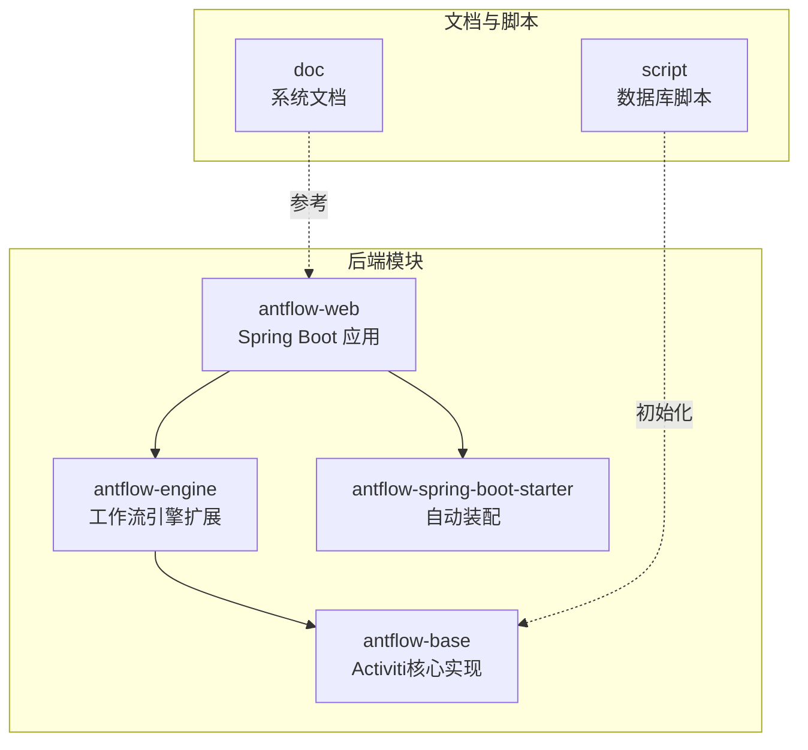
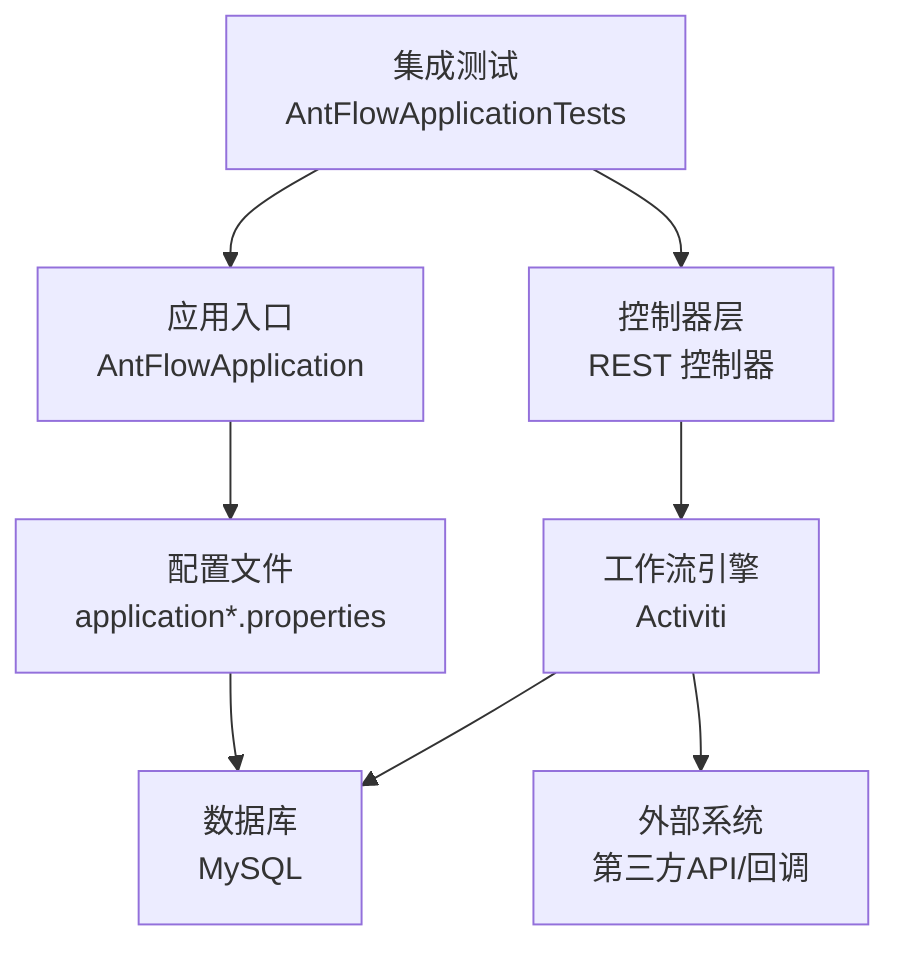
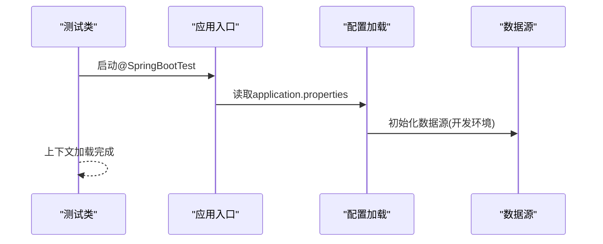
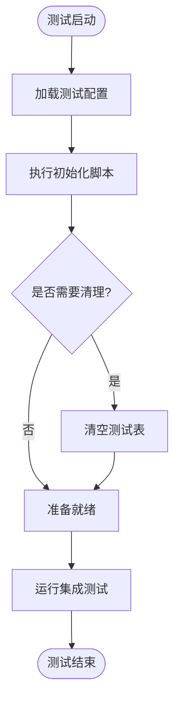
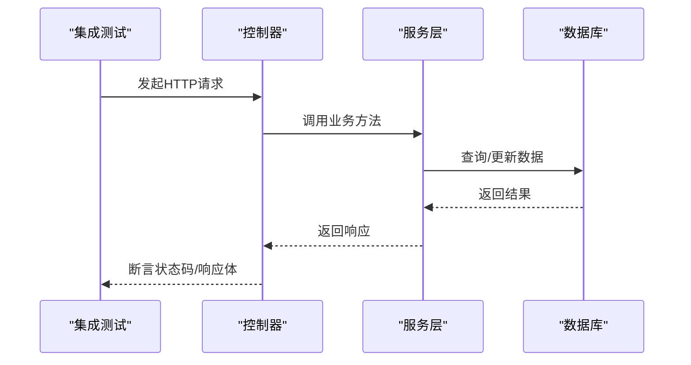
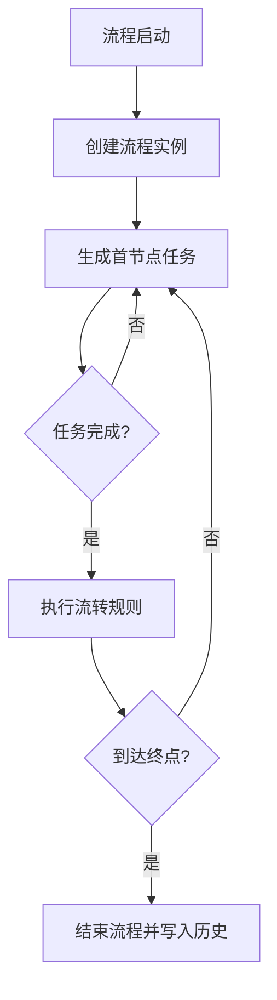
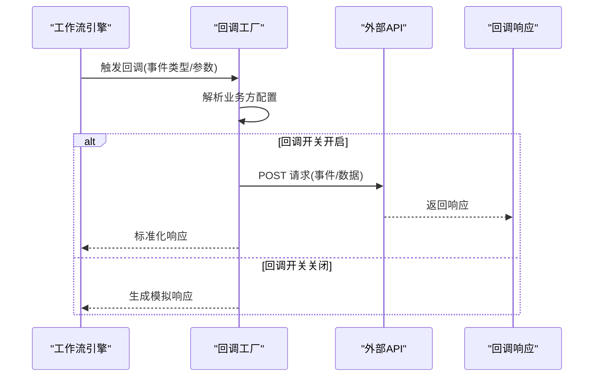
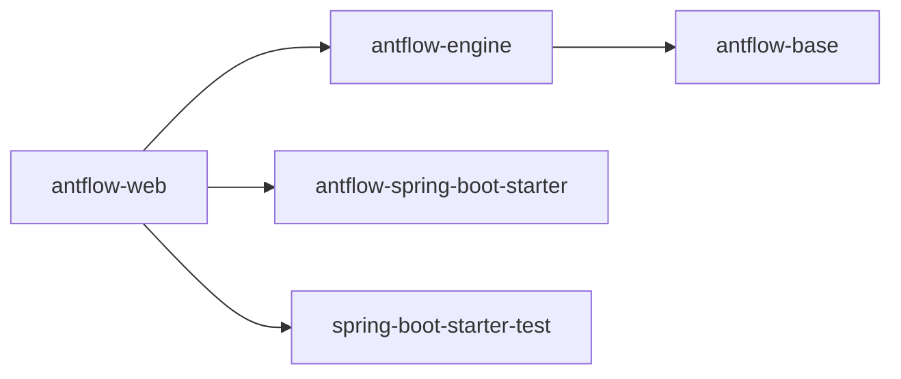

# 集成测试

<cite>
**本文引用的文件**
- [AntFlowApplicationTests.java](file://antflow-web/src/test/java/org/openoa/AntFlowApplicationTests.java)
- [AntFlowApplication.java](file://antflow-web/src/main/java/org/antflow/AntFlowApplication.java)
- [application.properties](file://antflow-web/src/main/resources/application.properties)
- [application-dev.properties](file://antflow-web/src/main/resources/application-dev.properties)
- [pom.xml](file://pom.xml)
- [HttpClientUtil.java](file://antflow-engine/src/main/java/org/openoa/engine/utils/HttpClientUtil.java)
- [ThirdPartyCallbackFactory.java](file://antflow-engine/src/main/java/org/openoa/engine/factory/ThirdPartyCallbackFactory.java)
- [21.开发环境搭建.md](file://doc/系统介绍篇/21.开发环境搭建.md)
- [18.外部工作流应用管理.md](file://doc/系统介绍篇/18.外部工作流应用管理.md)
- [ProcessEngineConfigurationImpl.java](file://antflow-base/src/main/java/org/activiti/engine/impl/cfg/ProcessEngineConfigurationImpl.java)
- [DbSqlSession.java](file://antflow-base/src/main/java/org/activiti/engine/impl/db/DbSqlSession.java)
- [act_init_db.sql](file://script/act_init_db.sql)
- [bpm_init_db.sql](file://script/bpm_init_db.sql)
- [bpm_init_db_data.sql](file://script/bpm_init_db_data.sql)
</cite>

## 目录
1. [简介](#简介)
2. [项目结构](#项目结构)
3. [核心组件](#核心组件)
4. [架构总览](#架构总览)
5. [详细组件分析](#详细组件分析)
6. [依赖分析](#依赖分析)
7. [性能考虑](#性能考虑)
8. [故障排查指南](#故障排查指南)
9. [结论](#结论)
10. [附录](#附录)

## 简介
本指南面向希望在AntFlow项目中构建可靠集成测试的工程师，系统讲解Spring Boot测试配置、测试配置文件、测试数据库初始化、REST API集成测试、工作流集成测试、外部系统集成测试、测试环境搭建、测试数据准备与验证机制，并给出如何构建可维护的集成测试套件的最佳实践。

## 项目结构
AntFlow采用多模块Maven工程，核心模块包括：
- antflow-web：Spring Boot Web应用入口与业务控制器层
- antflow-engine：基于Activiti的工作流引擎扩展与适配器
- antflow-base：Activiti核心实现与数据库脚本
- antflow-spring-boot-starter：Spring Boot自动装配与集成
- doc：系统文档与集成测试相关说明
- script：数据库初始化脚本

图表来源
- [pom.xml:6-11](file://pom.xml#L6-L11)
- [21.开发环境搭建.md:37-49](file://doc/系统介绍篇/21.开发环境搭建.md#L37-L49)

章节来源
- [pom.xml:6-11](file://pom.xml#L6-L11)
- [21.开发环境搭建.md:33-58](file://doc/系统介绍篇/21.开发环境搭建.md#L33-L58)

## 核心组件
- Spring Boot测试入口与上下文加载：通过@SpringBootTest注解加载完整应用上下文，适用于端到端集成测试。
- 测试配置文件：application.properties与application-dev.properties，分别定义通用配置与开发环境数据库连接等。
- 数据库初始化：通过脚本初始化Activiti与业务流程相关表结构及基础数据。
- 外部系统集成：HttpClientUtil与ThirdPartyCallbackFactory负责对外API调用与回调处理，是集成测试的关键路径。

章节来源
- [AntFlowApplicationTests.java:6-17](file://antflow-web/src/test/java/org/openoa/AntFlowApplicationTests.java#L6-L17)
- [application.properties:1-36](file://antflow-web/src/main/resources/application.properties#L1-L36)
- [application-dev.properties:1-44](file://antflow-web/src/main/resources/application-dev.properties#L1-L44)
- [HttpClientUtil.java:68-100](file://antflow-engine/src/main/java/org/openoa/engine/utils/HttpClientUtil.java#L68-L100)
- [ThirdPartyCallbackFactory.java:89-139](file://antflow-engine/src/main/java/org/openoa/engine/factory/ThirdPartyCallbackFactory.java#L89-L139)

## 架构总览
下图展示了集成测试涉及的主要组件与交互关系，包括应用启动、配置加载、数据库初始化、控制器层、工作流引擎以及外部系统回调。

图表来源
- [AntFlowApplicationTests.java:6-17](file://antflow-web/src/test/java/org/openoa/AntFlowApplicationTests.java#L6-L17)
- [AntFlowApplication.java:1-17](file://antflow-web/src/main/java/org/antflow/AntFlowApplication.java#L1-L17)
- [application.properties:1-36](file://antflow-web/src/main/resources/application.properties#L1-L36)
- [application-dev.properties:1-44](file://antflow-web/src/main/resources/application-dev.properties#L1-L44)
- [ProcessEngineConfigurationImpl.java:622-872](file://antflow-base/src/main/java/org/activiti/engine/impl/cfg/ProcessEngineConfigurationImpl.java#L622-L872)
- [DbSqlSession.java:971-1017](file://antflow-base/src/main/java/org/activiti/engine/impl/db/DbSqlSession.java#L971-L1017)

## 详细组件分析

### Spring Boot测试配置与@SpringBootTest使用
- 测试类位于antflow-web模块，使用@SpringBootTest加载完整应用上下文，适合端到端集成测试。
- 建议在测试类上添加@TestPropertySource或@ActiveProfiles以切换测试专用配置。
- 对于仅需Web层测试的场景，可结合@WebMvcTest进行控制器层隔离测试。

图表来源
- [AntFlowApplicationTests.java:6-17](file://antflow-web/src/test/java/org/openoa/AntFlowApplicationTests.java#L6-L17)
- [application.properties:1-36](file://antflow-web/src/main/resources/application.properties#L1-L36)
- [application-dev.properties:1-44](file://antflow-web/src/main/resources/application-dev.properties#L1-L44)

章节来源
- [AntFlowApplicationTests.java:6-17](file://antflow-web/src/test/java/org/openoa/AntFlowApplicationTests.java#L6-L17)
- [AntFlowApplication.java:1-17](file://antflow-web/src/main/java/org/antflow/AntFlowApplication.java#L1-L17)

### 测试配置文件设置
- application.properties：定义激活的profile、Activiti参数、JSON时间格式、邮件通知与Spring Mail配置等。
- application-dev.properties：定义开发环境数据库URL、用户名、密码、Druid/Hikari连接池参数、MyBatis配置、日志级别等。
- 建议在测试中通过@ActiveProfiles("dev")或测试属性覆盖，确保测试数据库与生产隔离。

章节来源
- [application.properties:1-36](file://antflow-web/src/main/resources/application.properties#L1-L36)
- [application-dev.properties:1-44](file://antflow-web/src/main/resources/application-dev.properties#L1-L44)

### 测试数据库初始化
- 使用脚本初始化数据库：act_init_db.sql、bpm_init_db.sql、bpm_init_db_data.sql。
- Activiti数据库模式更新策略：spring.activiti.database-schema-update=none，避免测试期间自动建表破坏受控状态。
- 建议在测试前执行初始化脚本，或通过测试框架在@BeforeEach/@BeforeEach中执行SQL清理与初始化。

图表来源
- [act_init_db.sql](file://script/act_init_db.sql)
- [bpm_init_db.sql](file://script/bpm_init_db.sql)
- [bpm_init_db_data.sql](file://script/bpm_init_db_data.sql)
- [application-dev.properties:34-35](file://antflow-web/src/main/resources/application-dev.properties#L34-L35)

章节来源
- [application-dev.properties:34-35](file://antflow-web/src/main/resources/application-dev.properties#L34-L35)

### REST API集成测试（控制器层）
- 使用@SpringBootTest加载完整上下文，结合MockMvc或直接发起HTTP请求验证控制器行为。
- 对于控制器层隔离测试，可使用@WebMvcTest限定测试范围，减少外部依赖。
- 建议对关键控制器接口编写端到端测试，覆盖正常路径、异常路径与边界条件。

图表来源
- [AntFlowApplicationTests.java:6-17](file://antflow-web/src/test/java/org/openoa/AntFlowApplicationTests.java#L6-L17)

章节来源
- [AntFlowApplicationTests.java:6-17](file://antflow-web/src/test/java/org/openoa/AntFlowApplicationTests.java#L6-L17)

### 工作流集成测试（流程启动/流转/完成）
- 流程启动测试：验证流程定义加载、流程实例创建、初始任务生成。
- 任务流转测试：验证用户任务完成、网关条件判断、子流程/并行分支。
- 流程完成测试：验证历史数据、流程结束事件、下游系统回调。
- 建议使用真实数据库与Activiti引擎配置，确保事务与历史表一致性。

图表来源
- [ProcessEngineConfigurationImpl.java:622-872](file://antflow-base/src/main/java/org/activiti/engine/impl/cfg/ProcessEngineConfigurationImpl.java#L622-L872)
- [DbSqlSession.java:971-1017](file://antflow-base/src/main/java/org/activiti/engine/impl/db/DbSqlSession.java#L971-L1017)

章节来源
- [ProcessEngineConfigurationImpl.java:622-872](file://antflow-base/src/main/java/org/activiti/engine/impl/cfg/ProcessEngineConfigurationImpl.java#L622-L872)
- [DbSqlSession.java:971-1017](file://antflow-base/src/main/java/org/activiti/engine/impl/db/DbSqlSession.java#L971-L1017)

### 外部系统集成测试（第三方API/回调/数据同步）
- 第三方API调用：通过HttpClientUtil封装HTTP客户端，支持JSON/XML请求与响应。
- 回调接口测试：ThirdPartyCallbackFactory根据配置开关决定是否实际回调外部系统，支持构造测试响应。
- 数据同步测试：验证流程状态变化触发的数据同步与回调事件。

图表来源
- [HttpClientUtil.java:68-100](file://antflow-engine/src/main/java/org/openoa/engine/utils/HttpClientUtil.java#L68-L100)
- [ThirdPartyCallbackFactory.java:89-139](file://antflow-engine/src/main/java/org/openoa/engine/factory/ThirdPartyCallbackFactory.java#L89-L139)

章节来源
- [HttpClientUtil.java:68-100](file://antflow-engine/src/main/java/org/openoa/engine/utils/HttpClientUtil.java#L68-L100)
- [ThirdPartyCallbackFactory.java:89-139](file://antflow-engine/src/main/java/org/openoa/engine/factory/ThirdPartyCallbackFactory.java#L89-L139)

### 测试环境搭建与数据准备
- 开发环境要求：JDK 8-21、Maven 3.6+、MySQL 5.7+、Node.js 16.20.0+、Git。
- 数据库初始化：执行脚本创建流程引擎与业务表，准备测试数据。
- 配置隔离：使用测试专用profile与数据源，避免污染生产数据。

章节来源
- [21.开发环境搭建.md:18-29](file://doc/系统介绍篇/21.开发环境搭建.md#L18-L29)
- [21.开发环境搭建.md:62-69](file://doc/系统介绍篇/21.开发环境搭建.md#L62-L69)

### 测试结果验证机制
- 响应断言：状态码、响应体结构、字段值。
- 数据一致性：数据库快照对比、历史表校验。
- 回调验证：外部系统回调日志与响应比对。
- 性能指标：请求耗时、并发吞吐、数据库锁等待。

## 依赖分析
- 模块间依赖：antflow-web依赖antflow-engine与antflow-spring-boot-starter；antflow-engine依赖antflow-base。
- 测试依赖：spring-boot-starter-test提供JUnit、Mockito、AssertJ等测试能力。
- 数据库依赖：MySQL Connector、Druid/Hikari连接池、MyBatis/MyBatis-Plus。

图表来源
- [pom.xml:6-11](file://pom.xml#L6-L11)
- [pom.xml:50-53](file://pom.xml#L50-L53)

章节来源
- [pom.xml:50-53](file://pom.xml#L50-L53)

## 性能考虑
- 测试数据库连接池：合理配置最大连接数、空闲超时、连接生命周期，避免测试阻塞。
- 并发测试：使用线程池并发触发流程实例，观察数据库锁与事务回滚表现。
- 日志级别：测试阶段适度降低日志级别，减少I/O开销。
- Mock外部依赖：对外部API使用Mock或本地桩服务，提升测试稳定性与速度。

## 故障排查指南
- 配置未生效：检查@ActiveProfiles与测试属性覆盖顺序，确认application-dev.properties被正确加载。
- 数据库连接失败：核对MySQL地址、端口、账号密码与网络连通性。
- Activiti表缺失：确认spring.activiti.database-schema-update=none下的脚本执行顺序与权限。
- 回调不生效：检查outside.callback.switch配置与业务方标识解析逻辑。
- 测试超时：排查数据库慢查询、连接池耗尽、外部API延迟。

章节来源
- [application-dev.properties:1-44](file://antflow-web/src/main/resources/application-dev.properties#L1-L44)
- [ThirdPartyCallbackFactory.java:94-98](file://antflow-engine/src/main/java/org/openoa/engine/factory/ThirdPartyCallbackFactory.java#L94-L98)

## 结论
通过@SpringBootTest加载完整上下文、结合测试配置文件与数据库脚本初始化，配合控制器层与工作流引擎的端到端验证，以及对外部系统回调的可控测试，可以构建稳定可靠的集成测试套件。建议在持续集成流水线中分层执行单元测试、集成测试与端到端测试，确保模块协同工作的质量与稳定性。

## 附录
- 外部系统集成测试参考流程与界面说明可参考文档中的“外部工作流应用管理”章节。
- 开发环境搭建与模块结构说明可参考“开发环境搭建”文档。

章节来源
- [18.外部工作流应用管理.md:152-192](file://doc/系统介绍篇/18.外部工作流应用管理.md#L152-L192)
- [21.开发环境搭建.md:33-58](file://doc/系统介绍篇/21.开发环境搭建.md#L33-L58)