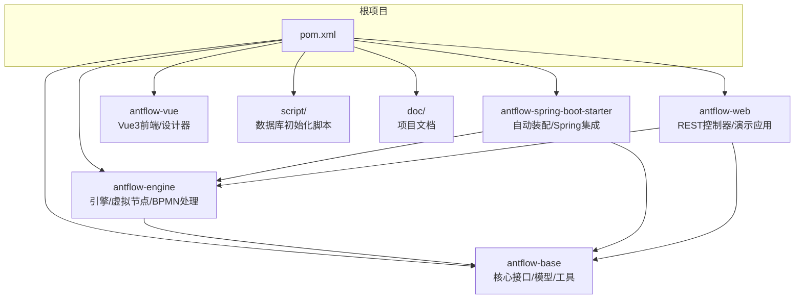
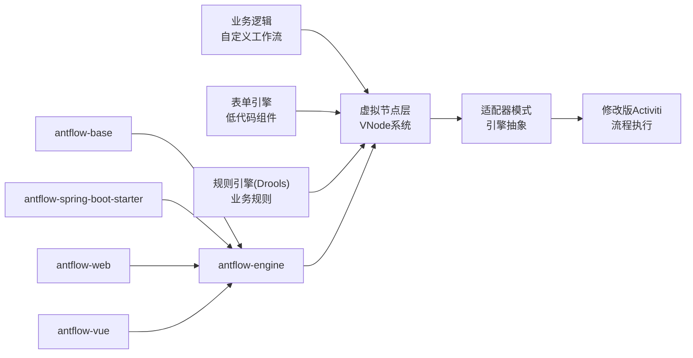
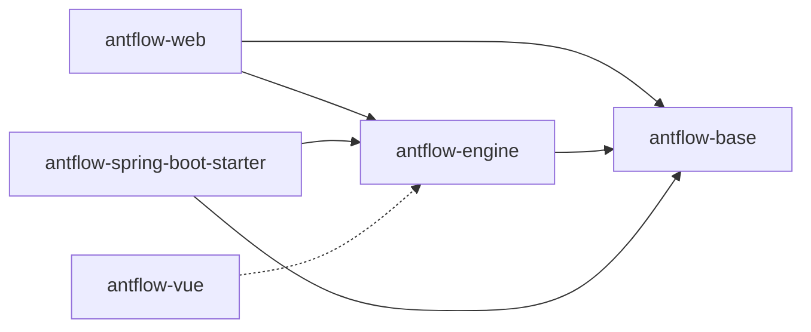

# 社区与贡献

<cite>
**本文引用的文件**   
- [README.zh_CN.md](file://README.zh_CN.md)
- [readme.md](file://readme.md)
- [LICENSE](file://LICENSE)
- [antflow-vue\LICENSE](file://antflow-vue\LICENSE)
- [CLAUDE.md](file://CLAUDE.md)
- [doc\系统介绍篇\20.开发者指南.md](file://doc\系统介绍篇\20.开发者指南.md)
- [doc\系统介绍篇\21.开发环境搭建.md](file://doc\系统介绍篇\21.开发环境搭建.md)
- [doc\系统集成与扩展开发篇\AntFlow快速集成到企业现有系统二之源码集成篇.md](file://doc\系统集成与扩展开发篇\AntFlow快速集成到企业现有系统二之源码集成篇.md)
</cite>

## 目录
1. [引言](#引言)
2. [项目结构](#项目结构)
3. [核心组件](#核心组件)
4. [架构总览](#架构总览)
5. [详细组件分析](#详细组件分析)
6. [依赖分析](#依赖分析)
7. [性能考量](#性能考量)
8. [故障排查指南](#故障排查指南)
9. [结论](#结论)
10. [附录](#附录)

## 引言
本指南面向所有希望参与 AntFlow 社区与贡献的伙伴，覆盖开源协议条款、使用许可范围与商业合规、贡献流程规范、问题反馈与功能建议渠道、文档与测试贡献方式、代码审查流程、社区活动与技术交流平台、开源精神与认可机制，以及社区发展规划。目标是帮助不同背景的参与者快速理解并高效参与项目。

## 项目结构
AntFlow 采用多模块 Maven 结构，后端基于 Spring Boot 与 Activiti，前端基于 Vue 3。核心模块包括基础层、引擎层、自动装配模块、演示应用与前端界面；同时提供数据库初始化脚本与丰富文档。

**图表来源**
- [CLAUDE.md:42-54](file://CLAUDE.md#L42-L54)
- [CLAUDE.md:134-159](file://CLAUDE.md#L134-L159)

**章节来源**
- [CLAUDE.md:42-54](file://CLAUDE.md#L42-L54)
- [CLAUDE.md:134-159](file://CLAUDE.md#L134-L159)

## 核心组件
- 基础层（antflow-base）：提供通用接口、常量、DTO、实体、异常、工具与基础服务接口，支撑上层模块。
- 引擎层（antflow-engine）：基于修改版 Activiti 的核心引擎，实现虚拟节点（VNode）系统、适配器模式、流程控制与低代码流程支持。
- 自动装配模块（antflow-spring-boot-starter）：提供 Spring Boot 自动配置，简化集成。
- 演示应用（antflow-web）：提供 REST API 控制器与示例业务，便于快速验证与二次开发。
- 前端（antflow-vue）：Vue 3 管理界面与流程设计器，覆盖流程设计、任务管理、表单与外部接入等场景。
- 文档与脚本：提供数据库初始化脚本与多篇系统文档，涵盖架构、集成、扩展与开发者指南。

**章节来源**
- [CLAUDE.md:58-110](file://CLAUDE.md#L58-L110)
- [CLAUDE.md:134-159](file://CLAUDE.md#L134-L159)

## 架构总览
AntFlow 的核心创新在于“虚拟节点（VNode）系统”，将业务逻辑与引擎执行 API 解耦，通过适配器模式屏蔽引擎差异，降低使用门槛并提升扩展性。模块间依赖清晰，引擎层依赖基础层，自动装配模块同时依赖基础与引擎层，演示应用与前端分别依赖引擎与基础层。

**图表来源**
- [CLAUDE.md:218-237](file://CLAUDE.md#L218-L237)
- [CLAUDE.md:134-159](file://CLAUDE.md#L134-L159)

## 详细组件分析

### 开源协议与许可合规
- 后端核心模块（antflow-base、antflow-engine、antflow-spring-boot-starter、antflow-web）遵循 Apache License 2.0，允许商用、再分发与修改，但需保留版权与许可证声明，并在修改文件中显著标注变更。
- 前端模块（antflow-vue）遵循 MIT 许可证，允许自由使用、复制、修改、合并、出版、分发、再许可与销售，需保留版权与许可声明。
- 商业使用合规要点：
  - 分发或再许可时必须包含原始版权与许可证文本。
  - 修改文件需标注变更。
  - 若引入第三方组件，需遵守其各自许可证要求。
  - 禁止二次开源（除获得作者授权外），企业/个人使用需登记（仅用于开源案例推广，不收费）。

**章节来源**
- [LICENSE:1-202](file://LICENSE#L1-L202)
- [antflow-vue\LICENSE:1-20](file://antflow-vue\LICENSE#L1-L20)
- [README.zh_CN.md:25-31](file://README.zh_CN.md#L25-L31)

### 贡献流程规范
- 问题反馈与功能建议
  - 通过 Issues 提交：在 Gitee/ GitHub 上创建 Issue，描述问题或建议，提供复现步骤与期望结果。
  - 技术交流：加入官方 QQ 群（972107977）进行讨论与协作。
- 代码贡献
  - Fork 仓库并创建功能分支，遵循项目模块结构与命名约定。
  - 提交前确保通过本地构建与测试，遵循代码风格与注释规范。
  - 提交 Pull Request 并关联相关 Issue，等待维护者评审与合并。
- 文档贡献
  - 在 doc/ 目录下新增或修订文档，保持与系统架构、API 与最佳实践一致。
  - 文档应包含使用场景、配置说明与示例链接。
- 测试用例
  - 后端服务逻辑建议补充单元测试；流程执行建议补充集成测试。
  - 使用真实数据规模进行测试，关注性能与稳定性。

**章节来源**
- [README.zh_CN.md:48-49](file://README.zh_CN.md#L48-L49)
- [doc\系统介绍篇\20.开发者指南.md:438-442](file://doc\系统介绍篇\20.开发者指南.md#L438-L442)

### 代码审查标准流程
- 代码质量
  - 模块边界清晰，避免循环依赖；遵循单一职责与高内聚低耦合原则。
  - 严格遵循 Apache 2.0/ MIT 许可证要求，确保第三方组件合规。
- 审查重点
  - 业务逻辑正确性与安全性（授权、输入验证、敏感数据处理）。
  - 性能与可扩展性（大数据量场景的批处理、缓存与事务边界）。
  - 可测试性（服务层可测试、流程可模拟）。
- 合规与文档
  - 修改文件需保留版权声明与许可证声明。
  - 新增或变更功能需配套文档与测试。

**章节来源**
- [doc\系统介绍篇\20.开发者指南.md:424-442](file://doc\系统介绍篇\20.开发者指南.md#L424-L442)

### 社区活动与技术交流
- 平台渠道
  - Issues：问题反馈与功能建议
  - QQ 群：技术交流与协作
  - 学习资源：操作手册、快速上手、集成指南与 Wiki 页面
- 社区文化
  - 鼓励“零门槛”使用与“零引擎知识”开发，强调开源共享与可持续发展。
  - 支持与尊重其他开源作者，不强制推广或破坏生态。

**章节来源**
- [README.zh_CN.md:48-49](file://README.zh_CN.md#L48-L49)
- [README.zh_CN.md:123-134](file://README.zh_CN.md#L123-L134)

### 开源精神与认可机制
- 开源承诺：AntFlow 保持开源免费，集成服务仅面向需要快速落地的用户，尊重并支持开源作者的商业模式。
- 贡献认可：通过 Issues 登记使用案例、文档贡献与代码贡献等方式进行社区认可；捐赠与支持亦受感谢与公开致谢。

**章节来源**
- [README.zh_CN.md:177-183](file://README.zh_CN.md#L177-L183)
- [README.zh_CN.md:192-207](file://README.zh_CN.md#L192-L207)

### 社区发展规划
- 技术演进：持续优化虚拟节点与适配器模式，扩展低代码与规则引擎能力，完善多数据库与信创生态兼容。
- 生态建设：推进与现有系统（如若依）的集成与开箱即用能力，提供更丰富的扩展点与 Starter。
- 社区运营：完善文档体系、开发者指南与最佳实践，扩大技术交流与贡献参与度。

**章节来源**
- [README.zh_CN.md:136-142](file://README.zh_CN.md#L136-L142)
- [doc\系统集成与扩展开发篇\AntFlow快速集成到企业现有系统二之源码集成篇.md:64-75](file://doc\系统集成与扩展开发篇\AntFlow快速集成到企业现有系统二之源码集成篇.md#L64-L75)

## 依赖分析
模块间依赖关系如下，体现清晰的分层与低耦合：

**图表来源**
- [CLAUDE.md:163-178](file://CLAUDE.md#L163-L178)
- [CLAUDE.md:134-159](file://CLAUDE.md#L134-L159)

**章节来源**
- [CLAUDE.md:163-178](file://CLAUDE.md#L163-L178)
- [CLAUDE.md:134-159](file://CLAUDE.md#L134-L159)

## 性能考量
- 大数据场景：对高频访问数据实现缓存，谨慎设计事务边界，必要时采用批量操作。
- 安全与稳定：对工作流操作进行授权控制，严格验证与清理输入数据，使用安全的邮件通知配置。
- 测试策略：服务层单元测试与流程执行集成测试相结合，使用接近生产规模的数据进行压力测试。

**章节来源**
- [doc\系统介绍篇\20.开发者指南.md:424-442](file://doc\系统介绍篇\20.开发者指南.md#L424-L442)

## 故障排查指南
- 常见问题定位
  - 数据库连接错误：检查数据库凭据与网络连通性。
  - 流程部署失败：验证 BPMN 配置与语法。
  - 任务分配异常：检查分配者解析与用户系统集成。
  - 工作流卡顿：使用流程验证工具定位问题。
- 日志与诊断
  - 启用 DEBUG 日志级别以获取详细信息，便于定位问题根因。

**章节来源**
- [doc\系统介绍篇\20.开发者指南.md:444-462](file://doc\系统介绍篇\20.开发者指南.md#L444-L462)

## 结论
AntFlow 以模块化架构与虚拟节点系统为核心，提供“零门槛”工作流开发体验。社区通过明确的协议条款、清晰的贡献流程与完善的文档体系，鼓励各类参与者共同推动技术演进与生态繁荣。建议贡献者在遵守许可与安全合规的前提下，积极参与问题反馈、功能建议、文档与测试贡献，共同守护开源精神与项目健康发展。

## 附录
- 快速开始与学习资源
  - 前端运行与构建命令、后端启动与数据库初始化步骤详见项目说明与开发者指南。
- 集成与扩展
  - 通过 Starter 快速集成，或源码复制方式将核心模块引入现有系统；遵循数据库初始化脚本与配置要求。

**章节来源**
- [README.zh_CN.md:88-134](file://README.zh_CN.md#L88-L134)
- [doc\系统介绍篇\21.开发环境搭建.md:1-256](file://doc\系统介绍篇\21.开发环境搭建.md#L1-L256)
- [doc\系统集成与扩展开发篇\AntFlow快速集成到企业现有系统二之源码集成篇.md:1-75](file://doc\系统集成与扩展开发篇\AntFlow快速集成到企业现有系统二之源码集成篇.md#L1-L75)