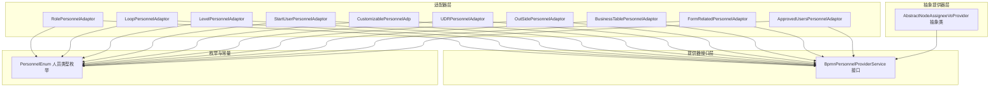
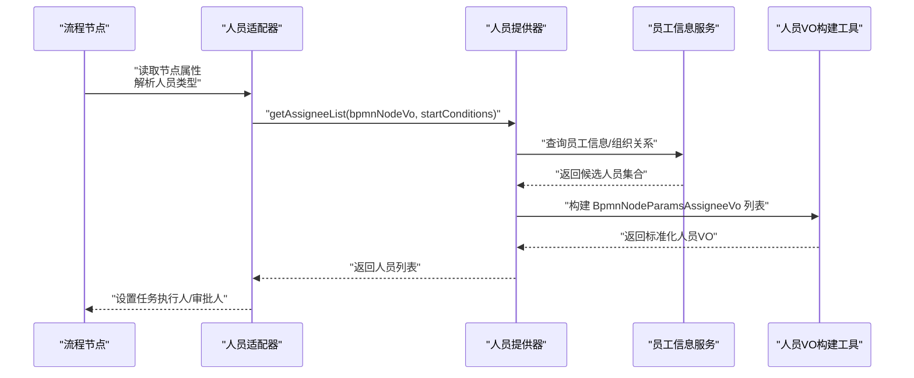
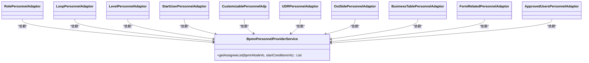
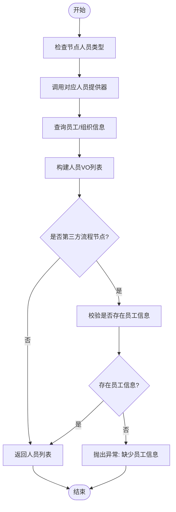
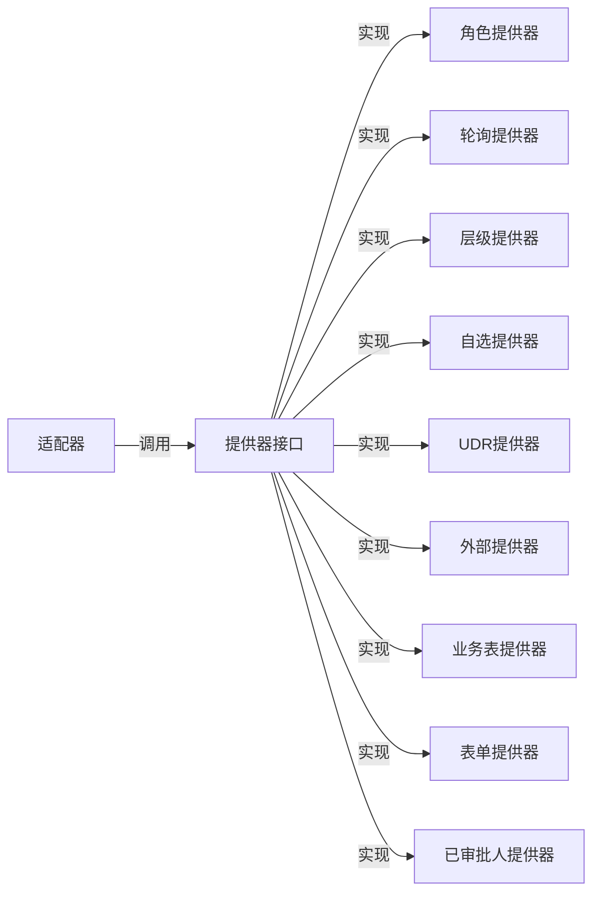

# 人员适配器

<cite>
**本文引用的文件**
- [AbstractBusinessConfigurationAdaptor.java](file://antflow-engine/src/main/java/org/openoa/engine/bpmnconf/adp/personneladp/AbstractBusinessConfigurationAdaptor.java)
- [ApprovedUsersPersonnelAdaptor.java](file://antflow-engine/src/main/java/org/openoa/engine/bpmnconf/adp/personneladp/ApprovedUsersPersonnelAdaptor.java)
- [RolePersonnelAdaptor.java](file://antflow-engine/src/main/java/org/openoa/engine/bpmnconf/adp/personneladp/RolePersonnelAdaptor.java)
- [LoopPersonnelAdaptor.java](file://antflow-engine/src/main/java/org/openoa/engine/bpmnconf/adp/personneladp/LoopPersonnelAdaptor.java)
- [LevelPersonnelAdaptor.java](file://antflow-engine/src/main/java/org/openoa/engine/bpmnconf/adp/personneladp/LevelPersonnelAdaptor.java)
- [StartUserPersonnelAdaptor.java](file://antflow-engine/src/main/java/org/openoa/engine/bpmnconf/adp/personneladp/StartUserPersonnelAdaptor.java)
- [CustomizablePersonnelAdp.java](file://antflow-engine/src/main/java/org/openoa/engine/bpmnconf/adp/personneladp/CustomizablePersonnelAdp.java)
- [UDRPersonnelAdaptor.java](file://antflow-engine/src/main/java/org/openoa/engine/bpmnconf/adp/personneladp/UDRPersonnelAdaptor.java)
- [OutSidePersonnelAdaptor.java](file://antflow-engine/src/main/java/org/openoa/engine/bpmnconf/adp/personneladp/OutSidePersonnelAdaptor.java)
- [BusinessTablePersonnelAdaptor.java](file://antflow-engine/src/main/java/org/openoa/engine/bpmnconf/adp/personneladp/BusinessTablePersonnelAdaptor.java)
- [FormRelatedPersonnelAdaptor.java](file://antflow-engine/src/main/java/org/openoa/engine/bpmnconf/adp/personneladp/FormRelatedPersonnelAdaptor.java)
- [BpmnPersonnelProviderService.java](file://antflow-base/src/main/java/org/openoa/base/interf/BpmnPersonnelProviderService.java)
- [PersonnelEnum.java](file://antflow-base/src/main/java/org/openoa/base/constant/enums/PersonnelEnum.java)
- [AbstractNodeAssigneeVoProvider.java](file://antflow-engine/src/main/java/org/openoa/engine/bpmnconf/service/biz/personnelinfoprovider/AbstractNodeAssigneeVoProvider.java)
</cite>

## 目录
1. [简介](#简介)
2. [项目结构](#项目结构)
3. [核心组件](#核心组件)
4. [架构总览](#架构总览)
5. [详细组件分析](#详细组件分析)
6. [依赖关系分析](#依赖关系分析)
7. [性能考虑](#性能考虑)
8. [故障排查指南](#故障排查指南)
9. [结论](#结论)
10. [附录](#附录)

## 简介
本技术文档围绕“人员适配器”展开，系统性阐述其在虚拟节点系统中的职责与实现机制，重点说明如何动态确定任务执行人与审批人。文档覆盖人员提供器接口设计、人员规则配置、人员计算算法，并给出多种适配场景（直接指派、角色适配、部门适配、动态轮询等）的实现思路与示例路径。最后提供自定义人员适配器的开发指南，包括适配器实现、规则配置与调试方法。

## 项目结构
人员适配器位于工程的流程配置与引擎服务层，采用按功能域分层的组织方式：
- 适配器层：位于 personneladp 包，面向不同人员类型提供适配器实现
- 提供器接口层：位于 base 模块，定义统一的人员查询契约
- 抽象提供器层：位于 engine 模块的 personnelinfoprovider 包，封装通用构建逻辑
- 枚举与常量：位于 base 模块，统一标识各类人员类型

图表来源
- [RolePersonnelAdaptor.java:15-25](file://antflow-engine/src/main/java/org/openoa/engine/bpmnconf/adp/personneladp/RolePersonnelAdaptor.java#L15-L25)
- [LoopPersonnelAdaptor.java:15-26](file://antflow-engine/src/main/java/org/openoa/engine/bpmnconf/adp/personneladp/LoopPersonnelAdaptor.java#L15-L26)
- [LevelPersonnelAdaptor.java:15-24](file://antflow-engine/src/main/java/org/openoa/engine/bpmnconf/adp/personneladp/LevelPersonnelAdaptor.java#L15-L24)
- [StartUserPersonnelAdaptor.java:15-24](file://antflow-engine/src/main/java/org/openoa/engine/bpmnconf/adp/personneladp/StartUserPersonnelAdaptor.java#L15-L24)
- [CustomizablePersonnelAdp.java:18-27](file://antflow-engine/src/main/java/org/openoa/engine/bpmnconf/adp/personneladp/CustomizablePersonnelAdp.java#L18-L27)
- [UDRPersonnelAdaptor.java:10-19](file://antflow-engine/src/main/java/org/openoa/engine/bpmnconf/adp/personneladp/UDRPersonnelAdaptor.java#L10-L19)
- [OutSidePersonnelAdaptor.java:15-24](file://antflow-engine/src/main/java/org/openoa/engine/bpmnconf/adp/personneladp/OutSidePersonnelAdaptor.java#L15-L24)
- [BusinessTablePersonnelAdaptor.java:15-24](file://antflow-engine/src/main/java/org/openoa/engine/bpmnconf/adp/personneladp/BusinessTablePersonnelAdaptor.java#L15-L24)
- [FormRelatedPersonnelAdaptor.java:10-19](file://antflow-engine/src/main/java/org/openoa/engine/bpmnconf/adp/personneladp/FormRelatedPersonnelAdaptor.java#L10-L19)
- [BpmnPersonnelProviderService.java:18-25](file://antflow-base/src/main/java/org/openoa/base/interf/BpmnPersonnelProviderService.java#L18-L25)
- [PersonnelEnum.java:16-31](file://antflow-base/src/main/java/org/openoa/base/constant/enums/PersonnelEnum.java#L16-L31)
- [AbstractNodeAssigneeVoProvider.java:20-36](file://antflow-engine/src/main/java/org/openoa/engine/bpmnconf/service/biz/personnelinfoprovider/AbstractNodeAssigneeVoProvider.java#L20-L36)

章节来源
- [RolePersonnelAdaptor.java:1-26](file://antflow-engine/src/main/java/org/openoa/engine/bpmnconf/adp/personneladp/RolePersonnelAdaptor.java#L1-L26)
- [LoopPersonnelAdaptor.java:1-27](file://antflow-engine/src/main/java/org/openoa/engine/bpmnconf/adp/personneladp/LoopPersonnelAdaptor.java#L1-L27)
- [LevelPersonnelAdaptor.java:1-25](file://antflow-engine/src/main/java/org/openoa/engine/bpmnconf/adp/personneladp/LevelPersonnelAdaptor.java#L1-L25)
- [StartUserPersonnelAdaptor.java:1-25](file://antflow-engine/src/main/java/org/openoa/engine/bpmnconf/adp/personneladp/StartUserPersonnelAdaptor.java#L1-L25)
- [CustomizablePersonnelAdp.java:1-28](file://antflow-engine/src/main/java/org/openoa/engine/bpmnconf/adp/personneladp/CustomizablePersonnelAdp.java#L1-L28)
- [UDRPersonnelAdaptor.java:1-20](file://antflow-engine/src/main/java/org/openoa/engine/bpmnconf/adp/personneladp/UDRPersonnelAdaptor.java#L1-L20)
- [OutSidePersonnelAdaptor.java:1-25](file://antflow-engine/src/main/java/org/openoa/engine/bpmnconf/adp/personneladp/OutSidePersonnelAdaptor.java#L1-L25)
- [BusinessTablePersonnelAdaptor.java:1-25](file://antflow-engine/src/main/java/org/openoa/engine/bpmnconf/adp/personneladp/BusinessTablePersonnelAdaptor.java#L1-L25)
- [FormRelatedPersonnelAdaptor.java:1-20](file://antflow-engine/src/main/java/org/openoa/engine/bpmnconf/adp/personneladp/FormRelatedPersonnelAdaptor.java#L1-L20)
- [BpmnPersonnelProviderService.java:1-26](file://antflow-base/src/main/java/org/openoa/base/interf/BpmnPersonnelProviderService.java#L1-L26)
- [PersonnelEnum.java:1-54](file://antflow-base/src/main/java/org/openoa/base/constant/enums/PersonnelEnum.java#L1-L54)
- [AbstractNodeAssigneeVoProvider.java:1-37](file://antflow-engine/src/main/java/org/openoa/engine/bpmnconf/service/biz/personnelinfoprovider/AbstractNodeAssigneeVoProvider.java#L1-L37)

## 核心组件
- 人员提供器接口：定义统一的人员查询契约，返回任务执行人或审批人列表
- 人员类型枚举：统一标识各类人员类型，便于适配器与节点属性映射
- 抽象提供器：封装通用的人员 VO 构建逻辑，支持内外部流程差异处理
- 适配器集合：针对不同人员类型的具体适配器实现，负责调用对应的提供器

章节来源
- [BpmnPersonnelProviderService.java:18-25](file://antflow-base/src/main/java/org/openoa/base/interf/BpmnPersonnelProviderService.java#L18-L25)
- [PersonnelEnum.java:16-31](file://antflow-base/src/main/java/org/openoa/base/constant/enums/PersonnelEnum.java#L16-L31)
- [AbstractNodeAssigneeVoProvider.java:20-36](file://antflow-engine/src/main/java/org/openoa/engine/bpmnconf/service/biz/personnelinfoprovider/AbstractNodeAssigneeVoProvider.java#L20-L36)

## 架构总览
人员适配器通过“适配器 + 提供器”的分层设计，将节点属性与具体人员计算逻辑解耦。适配器根据节点配置选择对应的提供器，提供器从员工信息服务与业务数据中计算出最终的人员列表。

图表来源
- [BpmnPersonnelProviderService.java:18-25](file://antflow-base/src/main/java/org/openoa/base/interf/BpmnPersonnelProviderService.java#L18-L25)
- [AbstractNodeAssigneeVoProvider.java:20-36](file://antflow-engine/src/main/java/org/openoa/engine/bpmnconf/service/biz/personnelinfoprovider/AbstractNodeAssigneeVoProvider.java#L20-L36)

## 详细组件分析

### 适配器类族与职责
- 角色适配器：基于角色标识获取审批人
- 动态轮询适配器：按轮询策略动态分配审批人
- 层级适配器：按指定层级向上或向下寻找审批人
- 发起人自适配器：以流程发起人为当前节点审批人
- 自选适配器：允许发起人在流程中自选审批人
- 用户自定义规则适配器：通过自定义规则计算审批人
- 外部接入适配器：从外部系统传入的人员集合
- 关联业务表适配器：从业务表字段映射审批人
- 表单上下文适配器：从表单相关字段或上下文推导审批人
- 已审批人适配器：以历史审批人作为当前节点审批人

图表来源
- [RolePersonnelAdaptor.java:15-25](file://antflow-engine/src/main/java/org/openoa/engine/bpmnconf/adp/personneladp/RolePersonnelAdaptor.java#L15-L25)
- [LoopPersonnelAdaptor.java:15-26](file://antflow-engine/src/main/java/org/openoa/engine/bpmnconf/adp/personneladp/LoopPersonnelAdaptor.java#L15-L26)
- [LevelPersonnelAdaptor.java:15-24](file://antflow-engine/src/main/java/org/openoa/engine/bpmnconf/adp/personneladp/LevelPersonnelAdaptor.java#L15-L24)
- [StartUserPersonnelAdaptor.java:15-24](file://antflow-engine/src/main/java/org/openoa/engine/bpmnconf/adp/personneladp/StartUserPersonnelAdaptor.java#L15-L24)
- [CustomizablePersonnelAdp.java:18-27](file://antflow-engine/src/main/java/org/openoa/engine/bpmnconf/adp/personneladp/CustomizablePersonnelAdp.java#L18-L27)
- [UDRPersonnelAdaptor.java:10-19](file://antflow-engine/src/main/java/org/openoa/engine/bpmnconf/adp/personneladp/UDRPersonnelAdaptor.java#L10-L19)
- [OutSidePersonnelAdaptor.java:15-24](file://antflow-engine/src/main/java/org/openoa/engine/bpmnconf/adp/personneladp/OutSidePersonnelAdaptor.java#L15-L24)
- [BusinessTablePersonnelAdaptor.java:15-24](file://antflow-engine/src/main/java/org/openoa/engine/bpmnconf/adp/personneladp/BusinessTablePersonnelAdaptor.java#L15-L24)
- [FormRelatedPersonnelAdaptor.java:10-19](file://antflow-engine/src/main/java/org/openoa/engine/bpmnconf/adp/personneladp/FormRelatedPersonnelAdaptor.java#L10-L19)
- [ApprovedUsersPersonnelAdaptor.java:9-18](file://antflow-engine/src/main/java/org/openoa/engine/bpmnconf/adp/personneladp/ApprovedUsersPersonnelAdaptor.java#L9-L18)
- [BpmnPersonnelProviderService.java:18-25](file://antflow-base/src/main/java/org/openoa/base/interf/BpmnPersonnelProviderService.java#L18-L25)

章节来源
- [RolePersonnelAdaptor.java:1-26](file://antflow-engine/src/main/java/org/openoa/engine/bpmnconf/adp/personneladp/RolePersonnelAdaptor.java#L1-L26)
- [LoopPersonnelAdaptor.java:1-27](file://antflow-engine/src/main/java/org/openoa/engine/bpmnconf/adp/personneladp/LoopPersonnelAdaptor.java#L1-L27)
- [LevelPersonnelAdaptor.java:1-25](file://antflow-engine/src/main/java/org/openoa/engine/bpmnconf/adp/personneladp/LevelPersonnelAdaptor.java#L1-L25)
- [StartUserPersonnelAdaptor.java:1-25](file://antflow-engine/src/main/java/org/openoa/engine/bpmnconf/adp/personneladp/StartUserPersonnelAdaptor.java#L1-L25)
- [CustomizablePersonnelAdp.java:1-28](file://antflow-engine/src/main/java/org/openoa/engine/bpmnconf/adp/personneladp/CustomizablePersonnelAdp.java#L1-L28)
- [UDRPersonnelAdaptor.java:1-20](file://antflow-engine/src/main/java/org/openoa/engine/bpmnconf/adp/personneladp/UDRPersonnelAdaptor.java#L1-L20)
- [OutSidePersonnelAdaptor.java:1-25](file://antflow-engine/src/main/java/org/openoa/engine/bpmnconf/adp/personneladp/OutSidePersonnelAdaptor.java#L1-L25)
- [BusinessTablePersonnelAdaptor.java:1-25](file://antflow-engine/src/main/java/org/openoa/engine/bpmnconf/adp/personneladp/BusinessTablePersonnelAdaptor.java#L1-L25)
- [FormRelatedPersonnelAdaptor.java:1-20](file://antflow-engine/src/main/java/org/openoa/engine/bpmnconf/adp/personneladp/FormRelatedPersonnelAdaptor.java#L1-L20)
- [ApprovedUsersPersonnelAdaptor.java:1-19](file://antflow-engine/src/main/java/org/openoa/engine/bpmnconf/adp/personneladp/ApprovedUsersPersonnelAdaptor.java#L1-L19)

### 人员提供器接口设计
- 统一契约：提供器接口定义了标准的人员查询方法，确保不同适配器可复用
- 返回规范：统一返回任务参数人员 VO 列表，便于后续流程引擎消费
- 扩展点：接口为未来新增人员类型提供清晰扩展边界

章节来源
- [BpmnPersonnelProviderService.java:18-25](file://antflow-base/src/main/java/org/openoa/base/interf/BpmnPersonnelProviderService.java#L18-L25)

### 人员规则配置
- 类型映射：通过人员类型枚举与节点属性枚举建立映射关系，保证配置一致性
- 配置入口：各适配器在 setSupportBusinessObjects 中声明支持的人员类型
- 外部流程：抽象提供器对第三方流程节点进行特殊处理，避免空员工信息异常

章节来源
- [PersonnelEnum.java:16-31](file://antflow-base/src/main/java/org/openoa/base/constant/enums/PersonnelEnum.java#L16-L31)
- [RolePersonnelAdaptor.java:21-24](file://antflow-engine/src/main/java/org/openoa/engine/bpmnconf/adp/personneladp/RolePersonnelAdaptor.java#L21-L24)
- [LoopPersonnelAdaptor.java:21-25](file://antflow-engine/src/main/java/org/openoa/engine/bpmnconf/adp/personneladp/LoopPersonnelAdaptor.java#L21-L25)
- [LevelPersonnelAdaptor.java:21-24](file://antflow-engine/src/main/java/org/openoa/engine/bpmnconf/adp/personneladp/LevelPersonnelAdaptor.java#L21-L24)
- [StartUserPersonnelAdaptor.java:21-24](file://antflow-engine/src/main/java/org/openoa/engine/bpmnconf/adp/personneladp/StartUserPersonnelAdaptor.java#L21-L24)
- [CustomizablePersonnelAdp.java:24-27](file://antflow-engine/src/main/java/org/openoa/engine/bpmnconf/adp/personneladp/CustomizablePersonnelAdp.java#L24-L27)
- [UDRPersonnelAdaptor.java:16-19](file://antflow-engine/src/main/java/org/openoa/engine/bpmnconf/adp/personneladp/UDRPersonnelAdaptor.java#L16-L19)
- [OutSidePersonnelAdaptor.java:21-24](file://antflow-engine/src/main/java/org/openoa/engine/bpmnconf/adp/personneladp/OutSidePersonnelAdaptor.java#L21-L24)
- [BusinessTablePersonnelAdaptor.java:21-24](file://antflow-engine/src/main/java/org/openoa/engine/bpmnconf/adp/personneladp/BusinessTablePersonnelAdaptor.java#L21-L24)
- [FormRelatedPersonnelAdaptor.java:16-19](file://antflow-engine/src/main/java/org/openoa/engine/bpmnconf/adp/personneladp/FormRelatedPersonnelAdaptor.java#L16-L19)
- [ApprovedUsersPersonnelAdaptor.java:14-17](file://antflow-engine/src/main/java/org/openoa/engine/bpmnconf/adp/personneladp/ApprovedUsersPersonnelAdaptor.java#L14-L17)
- [AbstractNodeAssigneeVoProvider.java:24-33](file://antflow-engine/src/main/java/org/openoa/engine/bpmnconf/service/biz/personnelinfoprovider/AbstractNodeAssigneeVoProvider.java#L24-L33)

### 人员计算算法
- 通用构建：抽象提供器封装了从候选人员集合到人员 VO 的构建过程，支持内外部流程差异
- 异常保护：当第三方流程节点缺少员工信息时抛出明确异常，避免脏数据进入流程
- 参数校验：业务配置适配器在计算前对启动条件进行校验，防止空条件导致的异常

图表来源
- [AbstractNodeAssigneeVoProvider.java:24-33](file://antflow-engine/src/main/java/org/openoa/engine/bpmnconf/service/biz/personnelinfoprovider/AbstractNodeAssigneeVoProvider.java#L24-L33)
- [AbstractBusinessConfigurationAdaptor.java:20-25](file://antflow-engine/src/main/java/org/openoa/engine/bpmnconf/adp/personneladp/AbstractBusinessConfigurationAdaptor.java#L20-L25)

章节来源
- [AbstractNodeAssigneeVoProvider.java:20-36](file://antflow-engine/src/main/java/org/openoa/engine/bpmnconf/service/biz/personnelinfoprovider/AbstractNodeAssigneeVoProvider.java#L20-L36)
- [AbstractBusinessConfigurationAdaptor.java:11-26](file://antflow-engine/src/main/java/org/openoa/engine/bpmnconf/adp/personneladp/AbstractBusinessConfigurationAdaptor.java#L11-L26)

### 典型适配场景与实现示例

- 直接指派
  - 适用：指定某个人员作为审批人
  - 实现：使用“指定人员”类型的适配器与提供器组合
  - 示例路径：[UserPointedPersonnelAdp.java](file://antflow-engine/src/main/java/org/openoa/engine/bpmnconf/adp/personneladp/UserPointedPersonnelAdp.java)

- 角色适配
  - 适用：根据角色标识获取审批人
  - 实现：角色适配器 + 角色提供器
  - 示例路径：[RolePersonnelAdaptor.java:15-25](file://antflow-engine/src/main/java/org/openoa/engine/bpmnconf/adp/personneladp/RolePersonnelAdaptor.java#L15-L25)

- 部门适配
  - 适用：根据部门或部门负责人获取审批人
  - 实现：部门负责人适配器 + 对应提供器
  - 示例路径：[DeppartmentLeaderPersonnelAdaptor.java](file://antflow-engine/src/main/java/org/openoa/engine/bpmnconf/adp/personneladp/DeppartmentLeaderPersonnelAdaptor.java)

- 动态轮询
  - 适用：按轮询策略在一组候选人中动态分配审批人
  - 实现：动态轮询适配器 + 轮询提供器
  - 示例路径：[LoopPersonnelAdaptor.java:15-26](file://antflow-engine/src/main/java/org/openoa/engine/bpmnconf/adp/personneladp/LoopPersonnelAdaptor.java#L15-L26)

- 层级适配
  - 适用：按指定层级向上或向下寻找审批人
  - 实现：层级适配器 + 层级提供器
  - 示例路径：[LevelPersonnelAdaptor.java:15-24](file://antflow-engine/src/main/java/org/openoa/engine/bpmnconf/adp/personneladp/LevelPersonnelAdaptor.java#L15-L24)

- 发起人自选
  - 适用：允许发起人在流程中自选审批人
  - 实现：自选适配器 + 自选提供器
  - 示例路径：[CustomizablePersonnelAdp.java:18-27](file://antflow-engine/src/main/java/org/openoa/engine/bpmnconf/adp/personneladp/CustomizablePersonnelAdp.java#L18-L27)

- 用户自定义规则
  - 适用：通过自定义规则计算审批人
  - 实现：UDR 适配器 + UDR 提供器
  - 示例路径：[UDRPersonnelAdaptor.java:10-19](file://antflow-engine/src/main/java/org/openoa/engine/bpmnconf/adp/personneladp/UDRPersonnelAdaptor.java#L10-L19)

- 外部接入
  - 适用：从外部系统传入的人员集合
  - 实现：外部接入适配器 + 外部提供器
  - 示例路径：[OutSidePersonnelAdaptor.java:15-24](file://antflow-engine/src/main/java/org/openoa/engine/bpmnconf/adp/personneladp/OutSidePersonnelAdaptor.java#L15-L24)

- 关联业务表
  - 适用：从业务表字段映射审批人
  - 实现：关联业务表适配器 + 业务表提供器
  - 示例路径：[BusinessTablePersonnelAdaptor.java:15-24](file://antflow-engine/src/main/java/org/openoa/engine/bpmnconf/adp/personneladp/BusinessTablePersonnelAdaptor.java#L15-L24)

- 表单上下文
  - 适用：从表单相关字段或上下文推导审批人
  - 实现：表单上下文适配器 + 表单相关提供器
  - 示例路径：[FormRelatedPersonnelAdaptor.java:10-19](file://antflow-engine/src/main/java/org/openoa/engine/bpmnconf/adp/personneladp/FormRelatedPersonnelAdaptor.java#L10-L19)

- 已审批人
  - 适用：以历史审批人作为当前节点审批人
  - 实现：已审批人适配器 + 审批人提供器
  - 示例路径：[ApprovedUsersPersonnelAdaptor.java:9-18](file://antflow-engine/src/main/java/org/openoa/engine/bpmnconf/adp/personneladp/ApprovedUsersPersonnelAdaptor.java#L9-L18)

章节来源
- [UserPointedPersonnelAdp.java](file://antflow-engine/src/main/java/org/openoa/engine/bpmnconf/adp/personneladp/UserPointedPersonnelAdp.java)
- [RolePersonnelAdaptor.java:15-25](file://antflow-engine/src/main/java/org/openoa/engine/bpmnconf/adp/personneladp/RolePersonnelAdaptor.java#L15-L25)
- [DeppartmentLeaderPersonnelAdaptor.java](file://antflow-engine/src/main/java/org/openoa/engine/bpmnconf/adp/personneladp/DeppartmentLeaderPersonnelAdaptor.java)
- [LoopPersonnelAdaptor.java:15-26](file://antflow-engine/src/main/java/org/openoa/engine/bpmnconf/adp/personneladp/LoopPersonnelAdaptor.java#L15-L26)
- [LevelPersonnelAdaptor.java:15-24](file://antflow-engine/src/main/java/org/openoa/engine/bpmnconf/adp/personneladp/LevelPersonnelAdaptor.java#L15-L24)
- [CustomizablePersonnelAdp.java:18-27](file://antflow-engine/src/main/java/org/openoa/engine/bpmnconf/adp/personneladp/CustomizablePersonnelAdp.java#L18-L27)
- [UDRPersonnelAdaptor.java:10-19](file://antflow-engine/src/main/java/org/openoa/engine/bpmnconf/adp/personneladp/UDRPersonnelAdaptor.java#L10-L19)
- [OutSidePersonnelAdaptor.java:15-24](file://antflow-engine/src/main/java/org/openoa/engine/bpmnconf/adp/personneladp/OutSidePersonnelAdaptor.java#L15-L24)
- [BusinessTablePersonnelAdaptor.java:15-24](file://antflow-engine/src/main/java/org/openoa/engine/bpmnconf/adp/personneladp/BusinessTablePersonnelAdaptor.java#L15-L24)
- [FormRelatedPersonnelAdaptor.java:10-19](file://antflow-engine/src/main/java/org/openoa/engine/bpmnconf/adp/personneladp/FormRelatedPersonnelAdaptor.java#L10-L19)
- [ApprovedUsersPersonnelAdaptor.java:9-18](file://antflow-engine/src/main/java/org/openoa/engine/bpmnconf/adp/personneladp/ApprovedUsersPersonnelAdaptor.java#L9-L18)

### 自定义人员适配器开发指南
- 步骤
  - 定义提供器：实现 BpmnPersonnelProviderService 接口，完成人员查询与组装
  - 定义适配器：继承适配器基类（若存在），在构造函数注入提供器与员工信息服务
  - 注册支持类型：在 setSupportBusinessObjects 中声明支持的人员类型
  - 配置与测试：在流程节点配置对应属性，运行流程验证结果
- 调试建议
  - 使用日志记录输入参数与候选人员集合
  - 在抽象提供器层捕获并记录异常，定位问题来源
  - 对第三方流程节点增加空值校验，避免脏数据进入流程

章节来源
- [BpmnPersonnelProviderService.java:18-25](file://antflow-base/src/main/java/org/openoa/base/interf/BpmnPersonnelProviderService.java#L18-L25)
- [AbstractNodeAssigneeVoProvider.java:20-36](file://antflow-engine/src/main/java/org/openoa/engine/bpmnconf/service/biz/personnelinfoprovider/AbstractNodeAssigneeVoProvider.java#L20-L36)

## 依赖关系分析
- 低耦合：适配器仅依赖提供器接口，不关心具体实现细节
- 可替换：通过 Spring Bean 名称与限定符注入不同提供器实现
- 可扩展：新增人员类型只需新增适配器与提供器，无需修改既有代码

图表来源
- [BpmnPersonnelProviderService.java:18-25](file://antflow-base/src/main/java/org/openoa/base/interf/BpmnPersonnelProviderService.java#L18-L25)
- [RolePersonnelAdaptor.java:15-25](file://antflow-engine/src/main/java/org/openoa/engine/bpmnconf/adp/personneladp/RolePersonnelAdaptor.java#L15-L25)
- [LoopPersonnelAdaptor.java:15-26](file://antflow-engine/src/main/java/org/openoa/engine/bpmnconf/adp/personneladp/LoopPersonnelAdaptor.java#L15-L26)
- [LevelPersonnelAdaptor.java:15-24](file://antflow-engine/src/main/java/org/openoa/engine/bpmnconf/adp/personneladp/LevelPersonnelAdaptor.java#L15-L24)
- [CustomizablePersonnelAdp.java:18-27](file://antflow-engine/src/main/java/org/openoa/engine/bpmnconf/adp/personneladp/CustomizablePersonnelAdp.java#L18-L27)
- [UDRPersonnelAdaptor.java:10-19](file://antflow-engine/src/main/java/org/openoa/engine/bpmnconf/adp/personneladp/UDRPersonnelAdaptor.java#L10-L19)
- [OutSidePersonnelAdaptor.java:15-24](file://antflow-engine/src/main/java/org/openoa/engine/bpmnconf/adp/personneladp/OutSidePersonnelAdaptor.java#L15-L24)
- [BusinessTablePersonnelAdaptor.java:15-24](file://antflow-engine/src/main/java/org/openoa/engine/bpmnconf/adp/personneladp/BusinessTablePersonnelAdaptor.java#L15-L24)
- [FormRelatedPersonnelAdaptor.java:10-19](file://antflow-engine/src/main/java/org/openoa/engine/bpmnconf/adp/personneladp/FormRelatedPersonnelAdaptor.java#L10-L19)
- [ApprovedUsersPersonnelAdaptor.java:9-18](file://antflow-engine/src/main/java/org/openoa/engine/bpmnconf/adp/personneladp/ApprovedUsersPersonnelAdaptor.java#L9-L18)

## 性能考虑
- 查询优化：提供器应尽量减少跨服务调用次数，合并批量查询
- 结果缓存：对稳定不变的人员集合进行短期缓存，降低重复计算成本
- 分页与限流：在大规模组织架构下，注意分页与并发限制，避免阻塞
- 异步化：对于耗时较长的计算，可考虑异步化处理并回调通知

## 故障排查指南
- 常见异常
  - 第三方流程节点缺少员工信息：触发明确异常，需检查节点配置
  - 启动条件为空：业务配置适配器会抛出异常，需完善流程启动条件
- 排查步骤
  - 核对人员类型与节点属性是否匹配
  - 检查提供器实现是否正确返回候选人员集合
  - 查看抽象提供器构建 VO 过程是否出现空值
- 调试要点
  - 在提供器与适配器关键节点添加日志
  - 对异常情况进行单元测试覆盖

章节来源
- [AbstractNodeAssigneeVoProvider.java:24-33](file://antflow-engine/src/main/java/org/openoa/engine/bpmnconf/service/biz/personnelinfoprovider/AbstractNodeAssigneeVoProvider.java#L24-L33)
- [AbstractBusinessConfigurationAdaptor.java:20-25](file://antflow-engine/src/main/java/org/openoa/engine/bpmnconf/adp/personneladp/AbstractBusinessConfigurationAdaptor.java#L20-L25)

## 结论
人员适配器通过“适配器 + 提供器”的分层设计，实现了对多种人员类型的统一抽象与灵活扩展。借助人员类型枚举与抽象提供器，系统在保证一致性的同时，为复杂业务提供了强大的可配置能力。遵循本文提供的开发与调试指南，可快速实现新的人员适配场景并稳定集成到流程引擎中。

## 附录
- 术语
  - 人员类型：用于标识节点应采用的人员计算策略
  - 提供器：负责从员工信息服务与业务数据中查询并组装人员集合
  - 适配器：面向节点属性的适配层，负责选择与调度提供器
- 参考路径
  - 人员类型枚举：[PersonnelEnum.java:16-31](file://antflow-base/src/main/java/org/openoa/base/constant/enums/PersonnelEnum.java#L16-L31)
  - 提供器接口：[BpmnPersonnelProviderService.java:18-25](file://antflow-base/src/main/java/org/openoa/base/interf/BpmnPersonnelProviderService.java#L18-L25)
  - 抽象提供器：[AbstractNodeAssigneeVoProvider.java:20-36](file://antflow-engine/src/main/java/org/openoa/engine/bpmnconf/service/biz/personnelinfoprovider/AbstractNodeAssigneeVoProvider.java#L20-L36)