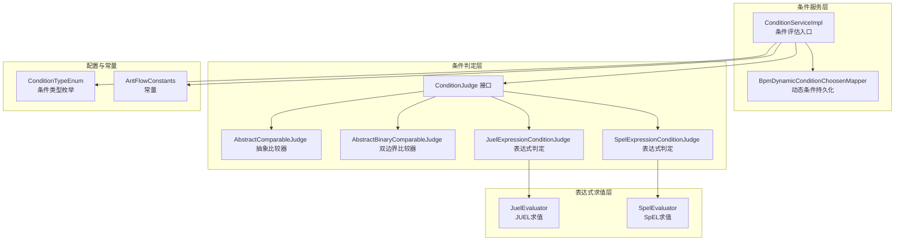
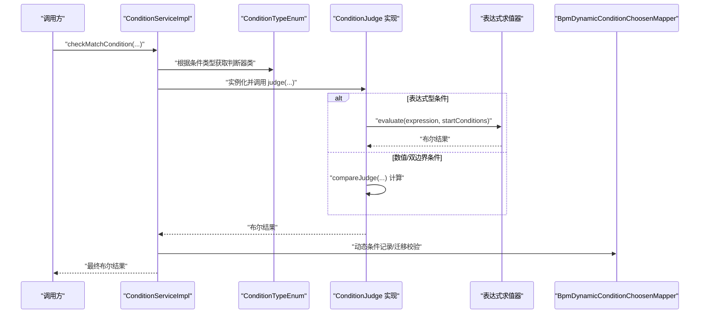
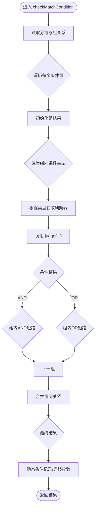
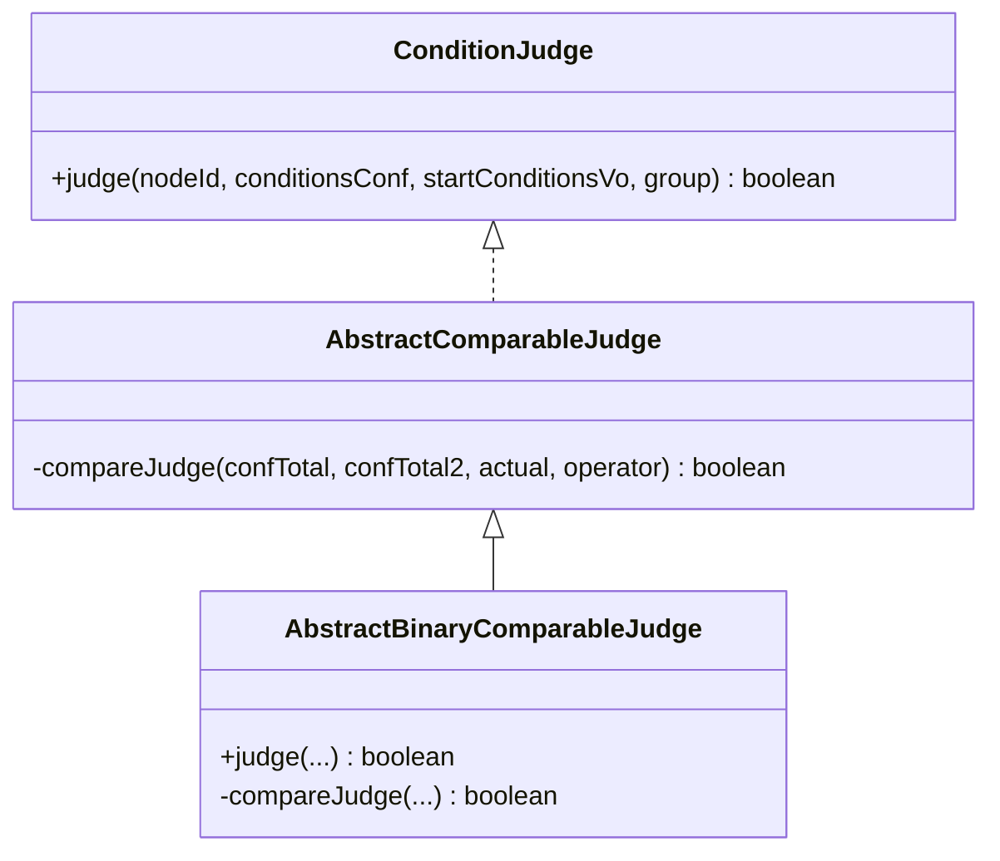
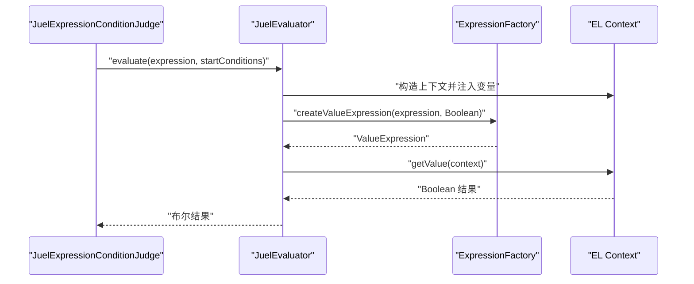
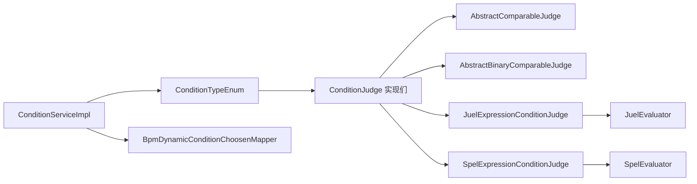

# 条件评估机制

<cite>
**本文引用的文件**
- [ConditionServiceImpl.java](file://antflow-engine/src/main/java/org/openoa/engine/bpmnconf/adp/conditionfilter/ConditionServiceImpl.java)
- [ConditionJudge.java](file://antflow-engine/src/main/java/org/openoa/engine/bpmnconf/adp/conditionfilter/ConditionJudge.java)
- [AbstractComparableJudge.java](file://antflow-engine/src/main/java/org/openoa/engine/bpmnconf/adp/conditionfilter/conditionjudge/AbstractComparableJudge.java)
- [AbstractBinaryComparableJudge.java](file://antflow-engine/src/main/java/org/openoa/engine/bpmnconf/adp/conditionfilter/conditionjudge/AbstractBinaryComparableJudge.java)
- [JuelExpressionConditionJudge.java](file://antflow-engine/src/main/java/org/openoa/engine/bpmnconf/adp/conditionfilter/conditionjudge/JuelExpressionConditionConditionJudge.java)
- [SpelExpressionConditionJudge.java](file://antflow-engine/src/main/java/org/openoa/engine/bpmnconf/adp/conditionfilter/conditionjudge/SpelExpressionConditionJudge.java)
- [JuelEvaluator.java](file://antflow-engine/src/main/java/org/openoa/engine/utils/JuelEvaluator.java)
- [ConditionTypeEnum.java](file://antflow-engine/src/main/java/org/openoa/engine/bpmnconf/constant/enus/ConditionTypeEnum.java)
- [AntFlowConstants.java](file://antflow-engine/src/main/java/org/openoa/engine/bpmnconf/constant/AntFlowConstants.java)
- [BpmDynamicConditionChoosenMapper.java](file://antflow-engine/src/main/java/org/openoa/engine/bpmnconf/mapper/BpmDynamicConditionChoosenMapper.java)
- [UelExpressionCondition.java](file://antflow-base/src/main/java/org/activiti/engine/impl/el/UelExpressionCondition.java)
- [ScriptCondition.java](file://antflow-base/src/main/java/org/activiti/engine/impl/scripting/ScriptCondition.java)
- [Parser.java](file://antflow-base/src/main/java/org/activiti/engine/impl/juel/Parser.java)
- [Builder.java](file://antflow-base/src/main/java/org/activiti/engine/impl/juel/Builder.java)
</cite>

## 目录
1. [简介](#简介)
2. [项目结构](#项目结构)
3. [核心组件](#核心组件)
4. [架构总览](#架构总览)
5. [详细组件分析](#详细组件分析)
6. [依赖分析](#依赖分析)
7. [性能考虑](#性能考虑)
8. [故障排查指南](#故障排查指南)
9. [结论](#结论)
10. [附录：条件表达式编写指南与示例](#附录条件表达式编写指南与示例)

## 简介
本文件系统性阐述虚拟节点中的条件评估机制，覆盖表达式解析、条件判断、结果计算、过滤器实现、评估算法与性能优化策略。文档同时提供条件表达式编写指南与常见/高级用法示例，帮助开发者在低代码与传统代码流程中高效构建可维护的条件分支。

## 项目结构
条件评估体系由“条件服务”“条件接口与抽象基类”“具体条件判断器”“表达式求值器”“条件类型枚举”“动态条件持久化”等模块组成，贯穿流程启动条件与网关动态分流场景。

图示来源
- [ConditionServiceImpl.java:35-135](file://antflow-engine/src/main/java/org/openoa/engine/bpmnconf/adp/conditionfilter/ConditionServiceImpl.java#L35-L135)
- [ConditionJudge.java:10-14](file://antflow-engine/src/main/java/org/openoa/engine/bpmnconf/adp/conditionfilter/ConditionJudge.java#L10-L14)
- [AbstractComparableJudge.java:14-82](file://antflow-engine/src/main/java/org/openoa/engine/bpmnconf/adp/conditionfilter/conditionjudge/AbstractComparableJudge.java#L14-L82)
- [AbstractBinaryComparableJudge.java:16-65](file://antflow-engine/src/main/java/org/openoa/engine/bpmnconf/adp/conditionfilter/conditionjudge/AbstractBinaryComparableJudge.java#L16-L65)
- [JuelExpressionConditionJudge.java:9-16](file://antflow-engine/src/main/java/org/openoa/engine/bpmnconf/adp/conditionfilter/conditionjudge/JuelExpressionConditionJudge.java#L9-L16)
- [SpelExpressionConditionJudge.java:9-16](file://antflow-engine/src/main/java/org/openoa/engine/bpmnconf/adp/conditionfilter/conditionjudge/SpelExpressionConditionJudge.java#L9-L16)
- [JuelEvaluator.java:12-31](file://antflow-engine/src/main/java/org/openoa/engine/utils/JuelEvaluator.java#L12-L31)
- [ConditionTypeEnum.java:20-67](file://antflow-engine/src/main/java/org/openoa/engine/bpmnconf/constant/enus/ConditionTypeEnum.java#L20-L67)
- [AntFlowConstants.java:84-91](file://antflow-engine/src/main/java/org/openoa/engine/bpmnconf/constant/AntFlowConstants.java#L84-L91)
- [BpmDynamicConditionChoosenMapper.java:1-9](file://antflow-engine/src/main/java/org/openoa/engine/bpmnconf/mapper/BpmDynamicConditionChoosenMapper.java#L1-L9)

章节来源
- [ConditionServiceImpl.java:35-135](file://antflow-engine/src/main/java/org/openoa/engine/bpmnconf/adp/conditionfilter/ConditionServiceImpl.java#L35-L135)
- [ConditionTypeEnum.java:20-67](file://antflow-engine/src/main/java/org/openoa/engine/bpmnconf/constant/enus/ConditionTypeEnum.java#L20-L67)

## 核心组件
- 条件服务入口：负责按组聚合条件、处理组间与组内逻辑关系、调用具体条件判断器、记录动态条件并进行迁移预校验。
- 条件接口与抽象基类：统一判定契约，提供数值比较与双边界比较的通用逻辑。
- 表达式条件判断器：封装 JUEL/SpEL 表达式求值，面向表达式型条件。
- 表达式求值器：构造上下文、注入变量、执行表达式并返回布尔结果。
- 条件类型枚举：集中管理条件类型、字段映射、对齐对象与判断器类，支持低代码/传统代码/三方模板等。
- 动态条件持久化：记录动态网关选择路径，参与迁移预校验以检测条件变更。

章节来源
- [ConditionServiceImpl.java:35-135](file://antflow-engine/src/main/java/org/openoa/engine/bpmnconf/adp/conditionfilter/ConditionServiceImpl.java#L35-L135)
- [ConditionJudge.java:10-14](file://antflow-engine/src/main/java/org/openoa/engine/bpmnconf/adp/conditionfilter/ConditionJudge.java#L10-L14)
- [AbstractComparableJudge.java:14-82](file://antflow-engine/src/main/java/org/openoa/engine/bpmnconf/adp/conditionfilter/conditionjudge/AbstractComparableJudge.java#L14-L82)
- [AbstractBinaryComparableJudge.java:16-65](file://antflow-engine/src/main/java/org/openoa/engine/bpmnconf/adp/conditionfilter/conditionjudge/AbstractBinaryComparableJudge.java#L16-L65)
- [JuelExpressionConditionJudge.java:9-16](file://antflow-engine/src/main/java/org/openoa/engine/bpmnconf/adp/conditionfilter/conditionjudge/JuelExpressionConditionJudge.java#L9-L16)
- [SpelExpressionConditionJudge.java:9-16](file://antflow-engine/src/main/java/org/openoa/engine/bpmnconf/adp/conditionfilter/conditionjudge/SpelExpressionConditionJudge.java#L9-L16)
- [JuelEvaluator.java:12-31](file://antflow-engine/src/main/java/org/openoa/engine/utils/JuelEvaluator.java#L12-L31)
- [ConditionTypeEnum.java:20-67](file://antflow-engine/src/main/java/org/openoa/engine/bpmnconf/constant/enus/ConditionTypeEnum.java#L20-L67)
- [BpmDynamicConditionChoosenMapper.java:1-9](file://antflow-engine/src/main/java/org/openoa/engine/bpmnconf/mapper/BpmDynamicConditionChoosenMapper.java#L1-L9)

## 架构总览
条件评估从“条件服务”开始，依据“条件类型枚举”选择对应的“条件判断器”，通过“表达式求值器”或“数值比较器”完成评估，并在动态网关场景下持久化选择结果，参与迁移校验。

图示来源
- [ConditionServiceImpl.java:35-135](file://antflow-engine/src/main/java/org/openoa/engine/bpmnconf/adp/conditionfilter/ConditionServiceImpl.java#L35-L135)
- [ConditionTypeEnum.java:123-137](file://antflow-engine/src/main/java/org/openoa/engine/bpmnconf/constant/enus/ConditionTypeEnum.java#L123-L137)
- [JuelExpressionConditionJudge.java:9-16](file://antflow-engine/src/main/java/org/openoa/engine/bpmnconf/adp/conditionfilter/conditionjudge/JuelExpressionConditionJudge.java#L9-L16)
- [SpelExpressionConditionJudge.java:9-16](file://antflow-engine/src/main/java/org/openoa/engine/bpmnconf/adp/conditionfilter/conditionjudge/SpelExpressionConditionJudge.java#L9-L16)
- [JuelEvaluator.java:12-31](file://antflow-engine/src/main/java/org/openoa/engine/utils/JuelEvaluator.java#L12-L31)
- [BpmDynamicConditionChoosenMapper.java:1-9](file://antflow-engine/src/main/java/org/openoa/engine/bpmnconf/mapper/BpmDynamicConditionChoosenMapper.java#L1-L9)

## 详细组件分析

### 条件服务：ConditionServiceImpl
- 组织与评估逻辑
  - 将条件按“组号”分组，逐组评估组内条件（AND/OR），再按组间关系（AND/OR）汇总。
  - 使用“短路”策略：组内AND遇False即停；组内OR遇True即停；组间AND遇False立即返回；组间OR遇True立即返回。
- 动态条件记录与迁移校验
  - 在非预演且结果为真时，记录“动态条件选择”。
  - 迁移预演时，若当前节点与历史记录不一致，删除旧记录并抛出异常提示条件已变更。
- 异常处理
  - 对业务异常与实例化异常分别处理，保证错误信息明确。

图示来源
- [ConditionServiceImpl.java:35-135](file://antflow-engine/src/main/java/org/openoa/engine/bpmnconf/adp/conditionfilter/ConditionServiceImpl.java#L35-L135)

章节来源
- [ConditionServiceImpl.java:35-135](file://antflow-engine/src/main/java/org/openoa/engine/bpmnconf/adp/conditionfilter/ConditionServiceImpl.java#L35-L135)

### 条件接口与抽象比较器
- ConditionJudge 接口
  - 统一判定入口：judge(nodeId, conditionsConf, startConditionsVo, group) -> boolean。
- AbstractComparableJudge
  - 提供数值比较核心逻辑：支持大于/大于等于/小于/小于等于/等于，以及默认异常处理。
- AbstractBinaryComparableJudge
  - 支持形如“a < x < b”的双边界比较，内部将配置值拆分为两个边界并进行区间判断。

图示来源
- [ConditionJudge.java:10-14](file://antflow-engine/src/main/java/org/openoa/engine/bpmnconf/adp/conditionfilter/ConditionJudge.java#L10-L14)
- [AbstractComparableJudge.java:14-82](file://antflow-engine/src/main/java/org/openoa/engine/bpmnconf/adp/conditionfilter/conditionjudge/AbstractComparableJudge.java#L14-L82)
- [AbstractBinaryComparableJudge.java:16-65](file://antflow-engine/src/main/java/org/openoa/engine/bpmnconf/adp/conditionfilter/conditionjudge/AbstractBinaryComparableJudge.java#L16-L65)

章节来源
- [ConditionJudge.java:10-14](file://antflow-engine/src/main/java/org/openoa/engine/bpmnconf/adp/conditionfilter/ConditionJudge.java#L10-L14)
- [AbstractComparableJudge.java:14-82](file://antflow-engine/src/main/java/org/openoa/engine/bpmnconf/adp/conditionfilter/conditionjudge/AbstractComparableJudge.java#L14-L82)
- [AbstractBinaryComparableJudge.java:16-65](file://antflow-engine/src/main/java/org/openoa/engine/bpmnconf/adp/conditionfilter/conditionjudge/AbstractBinaryComparableJudge.java#L16-L65)

### 表达式条件判断器与求值器
- JuelExpressionConditionJudge
  - 从条件配置读取表达式，委托 JuelEvaluator 执行。
- SpelExpressionConditionJudge
  - 同上，但使用 SpEL 求值器。
- JuelEvaluator
  - 低代码流程：将 lfConditions 注入 EL 上下文。
  - 传统流程：将 BusinessDataVo 注入名为“it”的上下文变量。
  - 使用 ExpressionFactory 创建 ValueExpression 并执行，返回布尔结果。
- SpelEvaluator（未在当前上下文中展开，行为与 JUEL 类似）

图示来源
- [JuelExpressionConditionJudge.java:9-16](file://antflow-engine/src/main/java/org/openoa/engine/bpmnconf/adp/conditionfilter/conditionjudge/JuelExpressionConditionJudge.java#L9-L16)
- [JuelEvaluator.java:12-31](file://antflow-engine/src/main/java/org/openoa/engine/utils/JuelEvaluator.java#L12-L31)
- [AntFlowConstants.java:84-91](file://antflow-engine/src/main/java/org/openoa/engine/bpmnconf/constant/AntFlowConstants.java#L84-L91)

章节来源
- [JuelExpressionConditionJudge.java:9-16](file://antflow-engine/src/main/java/org/openoa/engine/bpmnconf/adp/conditionfilter/conditionjudge/JuelExpressionConditionJudge.java#L9-L16)
- [SpelExpressionConditionJudge.java:9-16](file://antflow-engine/src/main/java/org/openoa/engine/bpmnconf/adp/conditionfilter/conditionjudge/SpelExpressionConditionJudge.java#L9-L16)
- [JuelEvaluator.java:12-31](file://antflow-engine/src/main/java/org/openoa/engine/utils/JuelEvaluator.java#L12-L31)
- [AntFlowConstants.java:84-91](file://antflow-engine/src/main/java/org/openoa/engine/bpmnconf/constant/AntFlowConstants.java#L84-L91)

### 条件类型枚举：ConditionTypeEnum
- 职责
  - 定义所有可用条件类型（数值、集合、日期、表达式、低代码条件等）。
  - 映射字段名、字段类型、对齐对象类、对齐字段名、以及对应的 ConditionJudge 实现类。
- 关键点
  - 低代码流程条件使用统一容器字段名与 lfConditions 键。
  - 数值型双边界比较需将配置字段设为字符串并以逗号分隔两个边界。
  - 表达式型条件（JUEL/SpEL）通过 EXPRESSION_FIELD_NAME 字段承载表达式文本。

章节来源
- [ConditionTypeEnum.java:20-67](file://antflow-engine/src/main/java/org/openoa/engine/bpmnconf/constant/enus/ConditionTypeEnum.java#L20-L67)
- [ConditionTypeEnum.java:123-137](file://antflow-engine/src/main/java/org/openoa/engine/bpmnconf/constant/enus/ConditionTypeEnum.java#L123-L137)
- [ConditionTypeEnum.java:145-156](file://antflow-engine/src/main/java/org/openoa/engine/bpmnconf/constant/enus/ConditionTypeEnum.java#L145-L156)

### 动态条件持久化与迁移校验
- 记录策略
  - 非预演且评估为真时，写入“动态条件选择”记录，包含流程编号、节点ID、来源节点。
- 迁移预校验
  - 若当前节点状态与历史记录不一致，则删除旧记录并抛出异常，提示条件已变更。

章节来源
- [ConditionServiceImpl.java:106-124](file://antflow-engine/src/main/java/org/openoa/engine/bpmnconf/adp/conditionfilter/ConditionServiceImpl.java#L106-L124)
- [ConditionServiceImpl.java:127-133](file://antflow-engine/src/main/java/org/openoa/engine/bpmnconf/adp/conditionfilter/ConditionServiceImpl.java#L127-L133)
- [BpmDynamicConditionChoosenMapper.java:1-9](file://antflow-engine/src/main/java/org/openoa/engine/bpmnconf/mapper/BpmDynamicConditionChoosenMapper.java#L1-L9)

### 传统引擎表达式条件（兼容）
- UelExpressionCondition：基于 Activiti 的 UEL 表达式条件，运行时解析并断言返回布尔。
- ScriptCondition：基于脚本引擎（如 JSR 223）的脚本条件，同样断言返回布尔。

章节来源
- [UelExpressionCondition.java:33-62](file://antflow-base/src/main/java/org/activiti/engine/impl/el/UelExpressionCondition.java#L33-L62)
- [ScriptCondition.java:39-60](file://antflow-base/src/main/java/org/activiti/engine/impl/scripting/ScriptCondition.java#L39-L60)

## 依赖分析
- 条件服务依赖条件类型枚举以选择具体判断器；判断器依赖抽象比较器或表达式求值器；表达式求值器依赖 EL/SpEL 引擎与上下文；动态条件持久化依赖 MyBatis Mapper。
- 条件类型枚举承担“配置—实现”的映射职责，降低耦合度。

图示来源
- [ConditionServiceImpl.java:35-135](file://antflow-engine/src/main/java/org/openoa/engine/bpmnconf/adp/conditionfilter/ConditionServiceImpl.java#L35-L135)
- [ConditionTypeEnum.java:123-137](file://antflow-engine/src/main/java/org/openoa/engine/bpmnconf/constant/enus/ConditionTypeEnum.java#L123-L137)
- [JuelExpressionConditionJudge.java:9-16](file://antflow-engine/src/main/java/org/openoa/engine/bpmnconf/adp/conditionfilter/conditionjudge/JuelExpressionConditionJudge.java#L9-L16)
- [SpelExpressionConditionJudge.java:9-16](file://antflow-engine/src/main/java/org/openoa/engine/bpmnconf/adp/conditionfilter/conditionjudge/SpelExpressionConditionJudge.java#L9-L16)
- [JuelEvaluator.java:12-31](file://antflow-engine/src/main/java/org/openoa/engine/utils/JuelEvaluator.java#L12-L31)
- [BpmDynamicConditionChoosenMapper.java:1-9](file://antflow-engine/src/main/java/org/openoa/engine/bpmnconf/mapper/BpmDynamicConditionChoosenMapper.java#L1-L9)

## 性能考虑
- 评估短路
  - 组内AND/OR短路、组间AND/OR短路，显著减少不必要的判断。
- 变量访问优化
  - 表达式求值器仅注入必要变量（低代码流程注入 lfConditions，传统流程注入 BusinessDataVo），避免上下文膨胀。
- 数值比较
  - 使用 BigDecimal 进行数值比较，避免浮点误差；双边界比较提前拆分配置值，减少重复解析。
- 动态条件记录
  - 仅在非预演且结果为真时记录，降低写入开销；迁移校验通过查询与删除最小化冲突处理成本。

## 故障排查指南
- 表达式返回非布尔
  - UEL/脚本条件在返回 null 或非布尔时会抛出异常，检查表达式返回值与上下文变量。
- 表达式上下文缺失
  - 低代码流程需确保 lfConditions 正确注入；传统流程需确认 BusinessDataVo 已注入名为“it”的变量。
- 条件类型不匹配
  - 数值型双边界比较需将配置字段设为字符串并以逗号分隔；否则比较逻辑异常。
- 迁移预演异常
  - 当动态条件记录与当前评估结果不一致时触发异常，需重新设计流程或调整条件。

章节来源
- [UelExpressionCondition.java:52-61](file://antflow-base/src/main/java/org/activiti/engine/impl/el/UelExpressionCondition.java#L52-L61)
- [ScriptCondition.java:48-59](file://antflow-base/src/main/java/org/activiti/engine/impl/scripting/ScriptCondition.java#L48-L59)
- [JuelEvaluator.java:12-31](file://antflow-engine/src/main/java/org/openoa/engine/utils/JuelEvaluator.java#L12-L31)
- [ConditionServiceImpl.java:106-124](file://antflow-engine/src/main/java/org/openoa/engine/bpmnconf/adp/conditionfilter/ConditionServiceImpl.java#L106-L124)

## 结论
该条件评估机制通过“类型枚举+接口抽象+表达式求值+短路策略+动态记录”的组合，实现了灵活、可扩展、可维护的虚拟节点条件评估能力。开发者可基于抽象比较器与表达式求值器快速扩展新的条件类型与判断逻辑，同时借助短路与上下文优化保障性能。

## 附录：条件表达式编写指南与示例

- 语法支持与变量绑定
  - 低代码流程：通过 lfConditions 注入键值对，表达式中直接引用键名。
  - 传统流程：通过名为“it”的上下文变量访问 BusinessDataVo 中的属性。
- 函数与运算
  - 支持标准布尔运算（与/或/非）、比较运算（>, >=, <, <=, ==）。
  - 支持集合/字符串/日期/时间等类型的比较与格式化。
- 常用表达式示例（以路径代替具体代码）
  - 低代码字符串条件：参考 [JuelExpressionConditionJudge.java:9-16](file://antflow-engine/src/main/java/org/openoa/engine/bpmnconf/adp/conditionfilter/conditionjudge/JuelExpressionConditionConditionJudge.java#L9-L16)
  - 低代码数字条件：参考 [LFNumberFormatJudge.java](file://antflow-engine/src/main/java/org/openoa/engine/bpmnconf/adp/conditionfilter/conditionjudge/LFNumberFormatJudge.java)
  - 低代码日期/日期时间条件：参考 [LFDateConditionJudge.java](file://antflow-engine/src/main/java/org/openoa/engine/bpmnconf/adp/conditionfilter/conditionjudge/LFDateConditionJudge.java)、[LFDateTimeConditionJudge.java](file://antflow-engine/src/main/java/org/openoa/engine/bpmnconf/adp/conditionfilter/conditionjudge/LFDateTimeConditionJudge.java)
  - 低代码集合条件：参考 [LFCollectionConditionJudge.java](file://antflow-engine/src/main/java/org/openoa/engine/bpmnconf/adp/conditionfilter/conditionjudge/LFCollectionConditionJudge.java)
  - JUEL 表达式条件：参考 [JuelExpressionConditionJudge.java:9-16](file://antflow-engine/src/main/java/org/openoa/engine/bpmnconf/adp/conditionfilter/conditionjudge/JuelExpressionConditionJudge.java#L9-L16)
  - SpEL 表达式条件：参考 [SpelExpressionConditionJudge.java:9-16](file://antflow-engine/src/main/java/org/openoa/engine/bpmnconf/adp/conditionfilter/conditionjudge/SpelExpressionConditionJudge.java#L9-L16)
- 复杂条件组合与嵌套
  - 使用括号组织优先级，结合 AND/OR 实现多层嵌套。
  - 双边界比较：将配置字段设为“min,max”字符串，使用 AbstractBinaryComparableJudge 实现区间判断。
- 动态条件
  - 在动态网关场景下，评估为真的分支会被记录；迁移预演时若分支变化将触发异常，提示重新设计流程。

章节来源
- [JuelEvaluator.java:12-31](file://antflow-engine/src/main/java/org/openoa/engine/utils/JuelEvaluator.java#L12-L31)
- [AntFlowConstants.java:84-91](file://antflow-engine/src/main/java/org/openoa/engine/bpmnconf/constant/AntFlowConstants.java#L84-L91)
- [AbstractBinaryComparableJudge.java:16-65](file://antflow-engine/src/main/java/org/openoa/engine/bpmnconf/adp/conditionfilter/conditionjudge/AbstractBinaryComparableJudge.java#L16-L65)
- [ConditionServiceImpl.java:106-124](file://antflow-engine/src/main/java/org/openoa/engine/bpmnconf/adp/conditionfilter/ConditionServiceImpl.java#L106-L124)