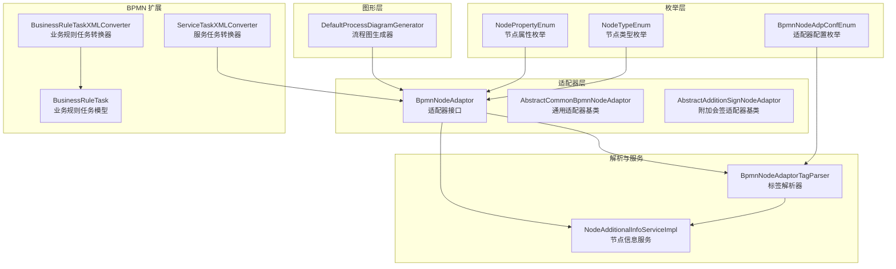
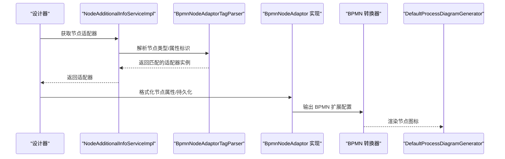
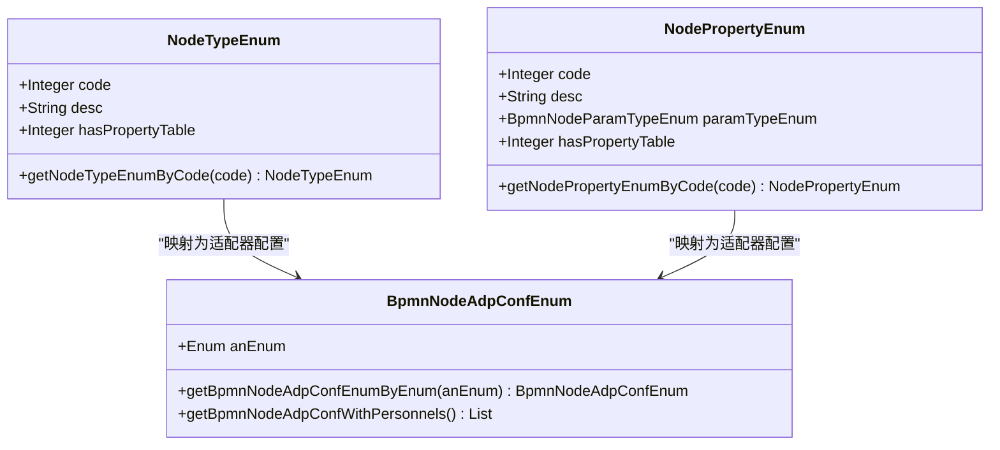
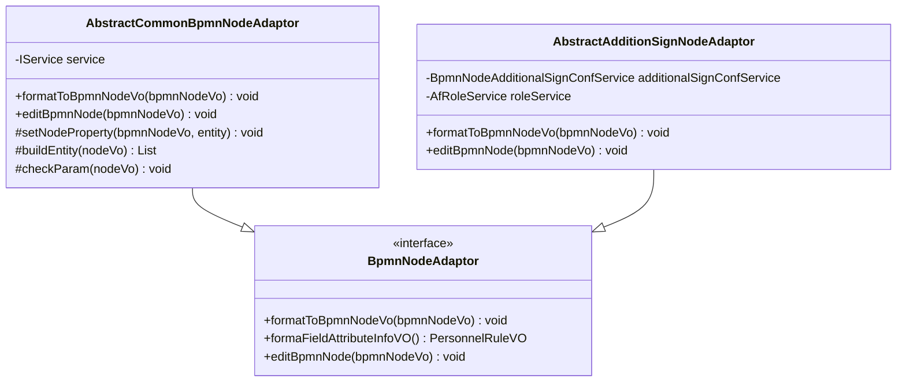
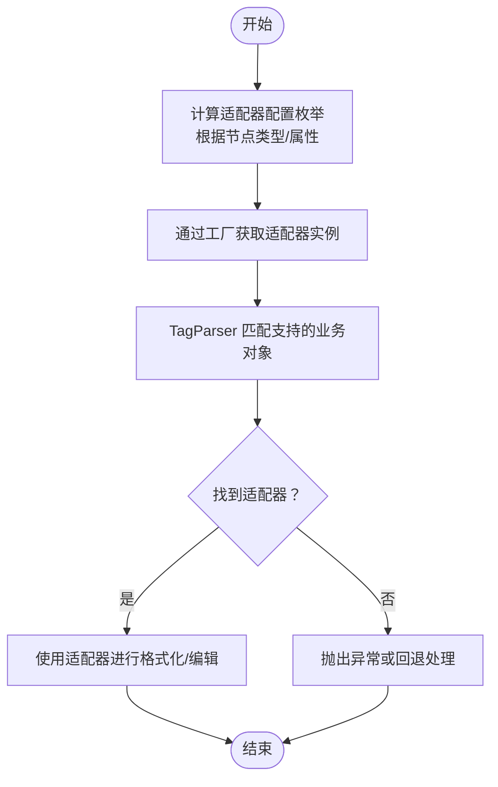
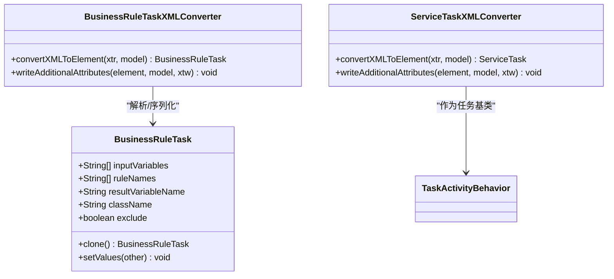
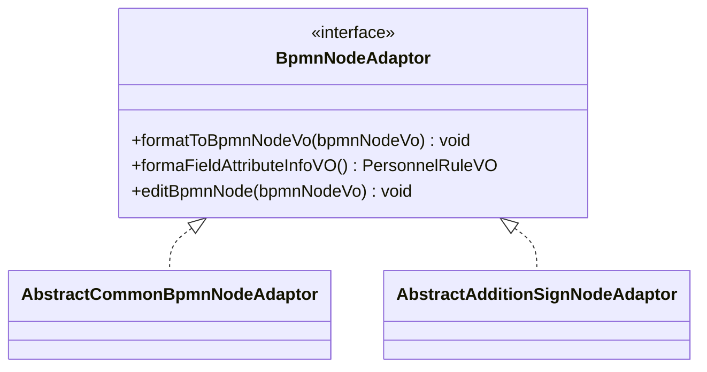
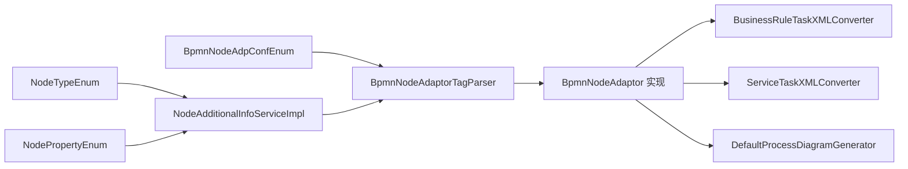

# 节点类型与管理

<cite>
**本文引用的文件**
- [NodeTypeEnum.java](file://antflow-base/src/main/java/org/openoa/base/constant/enums/NodeTypeEnum.java)
- [NodePropertyEnum.java](file://antflow-base/src/main/java/org/openoa/base/constant/enums/NodePropertyEnum.java)
- [BpmnNodeAdaptor.java](file://antflow-engine/src/main/java/org/openoa/engine/bpmnconf/adp/bpmnnodeadp/BpmnNodeAdaptor.java)
- [AbstractCommonBpmnNodeAdaptor.java](file://antflow-engine/src/main/java/org/openoa/engine/bpmnconf/adp/bpmnnodeadp/AbstractCommonBpmnNodeAdaptor.java)
- [AbstractAdditionSignNodeAdaptor.java](file://antflow-engine/src/main/java/org/openoa/engine/bpmnconf/adp/bpmnnodeadp/AbstractAdditionSignNodeAdaptor.java)
- [BpmnNodeAdaptorTagParser.java](file://antflow-engine/src/main/java/org/openoa/engine/bpmnconf/service/tagparser/BpmnNodeAdaptorTagParser.java)
- [NodeAdditionalInfoServiceImpl.java](file://antflow-engine/src/main/java/org/openoa/engine/bpmnconf/common/NodeAdditionalInfoServiceImpl.java)
- [BpmnNodeAdpConfEnum.java](file://antflow-engine/src/main/java/org/openoa/engine/bpmnconf/constant/enus/BpmnNodeAdpConfEnum.java)
- [BusinessRuleTaskXMLConverter.java](file://antflow-base/src/main/java/org/activiti/bpmn/converter/BusinessRuleTaskXMLConverter.java)
- [BusinessRuleTask.java](file://antflow-base/src/main/java/org/activiti/bpmn/model/BusinessRuleTask.java)
- [ServiceTaskXMLConverter.java](file://antflow-base/src/main/java/org/activiti/bpmn/converter/ServiceTaskXMLConverter.java)
- [TaskActivityBehavior.java](file://antflow-base/src/main/java/org/activiti/engine/impl/bpmn/behavior/TaskActivityBehavior.java)
- [DefaultProcessDiagramGenerator.java](file://antflow-base/src/main/java/org/activiti/image/impl/DefaultProcessDiagramGenerator.java)
- [3.核心概念和术语.md](file://doc/系统介绍篇/3.核心概念和术语.md)
- [23.系统扩展.md](file://doc/系统介绍篇/23.系统扩展.md)
</cite>

## 目录
1. [简介](#简介)
2. [项目结构](#项目结构)
3. [核心组件](#核心组件)
4. [架构总览](#架构总览)
5. [详细组件分析](#详细组件分析)
6. [依赖分析](#依赖分析)
7. [性能考虑](#性能考虑)
8. [故障排查指南](#故障排查指南)
9. [结论](#结论)
10. [附录](#附录)

## 简介
本文件面向“节点类型与管理”的技术文档目标，系统性阐述 AntFlow 工作流引擎中的虚拟节点类型体系与管理机制。内容覆盖：
- 虚拟节点类型：用户任务、服务任务、脚本任务、业务规则任务等的特性与用途
- 节点注册与适配：基于适配器接口的节点类型注册与解析机制
- 节点配置管理：节点属性定义、持久化与前后端转换
- 继承关系与接口规范：抽象适配器类、通用适配器基类、附加会签适配器
- 开发指南与最佳实践：节点类型扩展、配置模板与实现步骤

## 项目结构
围绕节点类型与管理的关键目录与文件如下：
- 枚举定义：节点类型与节点属性枚举
- 适配器接口与抽象实现：BpmnNodeAdaptor 及其抽象基类
- 适配器解析与选择：TagParser 与服务层选择逻辑
- BPMN 扩展转换器：业务规则任务、服务任务等
- 图形绘制：流程图生成器对各类任务节点的渲染

图表来源
- [NodeTypeEnum.java:1-62](file://antflow-base/src/main/java/org/openoa/base/constant/enums/NodeTypeEnum.java#L1-L62)
- [NodePropertyEnum.java:1-101](file://antflow-base/src/main/java/org/openoa/base/constant/enums/NodePropertyEnum.java#L1-L101)
- [BpmnNodeAdaptor.java:1-30](file://antflow-engine/src/main/java/org/openoa/engine/bpmnconf/adp/bpmnnodeadp/BpmnNodeAdaptor.java#L1-L30)
- [AbstractCommonBpmnNodeAdaptor.java:1-47](file://antflow-engine/src/main/java/org/openoa/engine/bpmnconf/adp/bpmnnodeadp/AbstractCommonBpmnNodeAdaptor.java#L1-L47)
- [AbstractAdditionSignNodeAdaptor.java:1-101](file://antflow-engine/src/main/java/org/openoa/engine/bpmnconf/adp/bpmnnodeadp/AbstractAdditionSignNodeAdaptor.java#L1-L101)
- [BpmnNodeAdaptorTagParser.java:1-30](file://antflow-engine/src/main/java/org/openoa/engine/bpmnconf/service/tagparser/BpmnNodeAdaptorTagParser.java#L1-L30)
- [NodeAdditionalInfoServiceImpl.java:38-81](file://antflow-engine/src/main/java/org/openoa/engine/bpmnconf/common/NodeAdditionalInfoServiceImpl.java#L38-L81)
- [BusinessRuleTaskXMLConverter.java:36-57](file://antflow-base/src/main/java/org/activiti/bpmn/converter/BusinessRuleTaskXMLConverter.java#L36-L57)
- [ServiceTaskXMLConverter.java:33-78](file://antflow-base/src/main/java/org/activiti/bpmn/converter/ServiceTaskXMLConverter.java#L33-L78)
- [DefaultProcessDiagramGenerator.java:185-243](file://antflow-base/src/main/java/org/activiti/image/impl/DefaultProcessDiagramGenerator.java#L185-L243)

章节来源
- [3.核心概念和术语.md:1-53](file://doc/系统介绍篇/3.核心概念和术语.md#L1-L53)

## 核心组件
- 节点类型枚举：定义流程图中节点的类型维度，如“条件节点”“审批人节点”“抄送节点”等，部分类型带有属性表标志位，决定是否需要额外属性配置。
- 节点属性枚举：定义节点的属性维度，如“层层审批”“指定角色”“指定人员”“直属领导”等，同样具备属性表标志位。
- 适配器接口与抽象实现：BpmnNodeAdaptor 定义了格式化与编辑节点的能力；AbstractCommonBpmnNodeAdaptor 提供通用的实体查询、构建与保存能力；AbstractAdditionSignNodeAdaptor 提供附加会签配置的读写能力。
- 适配器解析与选择：BpmnNodeAdaptorTagParser 通过 Spring 容器扫描所有 BpmnNodeAdaptor 实现，按支持的业务对象标识匹配；NodeAdditionalInfoServiceImpl 提供根据节点类型/属性选择适配器的服务入口。
- BPMN 扩展转换器：BusinessRuleTaskXMLConverter 与 ServiceTaskXMLConverter 分别负责业务规则任务与服务任务的 XML 解析与序列化。
- 图形层：DefaultProcessDiagramGenerator 对各类任务节点进行可视化绘制。

章节来源
- [NodeTypeEnum.java:1-62](file://antflow-base/src/main/java/org/openoa/base/constant/enums/NodeTypeEnum.java#L1-L62)
- [NodePropertyEnum.java:1-101](file://antflow-base/src/main/java/org/openoa/base/constant/enums/NodePropertyEnum.java#L1-L101)
- [BpmnNodeAdaptor.java:1-30](file://antflow-engine/src/main/java/org/openoa/engine/bpmnconf/adp/bpmnnodeadp/BpmnNodeAdaptor.java#L1-L30)
- [AbstractCommonBpmnNodeAdaptor.java:1-47](file://antflow-engine/src/main/java/org/openoa/engine/bpmnconf/adp/bpmnnodeadp/AbstractCommonBpmnNodeAdaptor.java#L1-L47)
- [AbstractAdditionSignNodeAdaptor.java:1-101](file://antflow-engine/src/main/java/org/openoa/engine/bpmnconf/adp/bpmnnodeadp/AbstractAdditionSignNodeAdaptor.java#L1-L101)
- [BpmnNodeAdaptorTagParser.java:1-30](file://antflow-engine/src/main/java/org/openoa/engine/bpmnconf/service/tagparser/BpmnNodeAdaptorTagParser.java#L1-L30)
- [NodeAdditionalInfoServiceImpl.java:38-81](file://antflow-engine/src/main/java/org/openoa/engine/bpmnconf/common/NodeAdditionalInfoServiceImpl.java#L38-L81)
- [BusinessRuleTaskXMLConverter.java:36-57](file://antflow-base/src/main/java/org/activiti/bpmn/converter/BusinessRuleTaskXMLConverter.java#L36-L57)
- [ServiceTaskXMLConverter.java:33-78](file://antflow-base/src/main/java/org/activiti/bpmn/converter/ServiceTaskXMLConverter.java#L33-L78)
- [DefaultProcessDiagramGenerator.java:185-243](file://antflow-base/src/main/java/org/activiti/image/impl/DefaultProcessDiagramGenerator.java#L185-L243)

## 架构总览
AntFlow 的节点类型管理采用“虚拟节点 + 适配器”的分层架构：
- 虚拟节点抽象层：由 BpmnNodeVo 与相关 VO 表示节点及其属性
- 适配器层：针对不同节点类型/属性提供格式化与持久化能力
- BPMN 配置系统：将虚拟节点映射为具体 BPMN 元素（含扩展属性），并驱动引擎执行
- 图形层：将 BPMN 元素渲染为流程图

图表来源
- [NodeAdditionalInfoServiceImpl.java:54-81](file://antflow-engine/src/main/java/org/openoa/engine/bpmnconf/common/NodeAdditionalInfoServiceImpl.java#L54-L81)
- [BpmnNodeAdaptorTagParser.java:16-30](file://antflow-engine/src/main/java/org/openoa/engine/bpmnconf/service/tagparser/BpmnNodeAdaptorTagParser.java#L16-L30)
- [BpmnNodeAdaptor.java:12-30](file://antflow-engine/src/main/java/org/openoa/engine/bpmnconf/adp/bpmnnodeadp/BpmnNodeAdaptor.java#L12-L30)
- [DefaultProcessDiagramGenerator.java:185-243](file://antflow-base/src/main/java/org/activiti/image/impl/DefaultProcessDiagramGenerator.java#L185-L243)

章节来源
- [3.核心概念和术语.md:1-53](file://doc/系统介绍篇/3.核心概念和术语.md#L1-L53)

## 详细组件分析

### 节点类型与属性枚举
- 节点类型枚举（NodeTypeEnum）：定义流程节点的类型维度，如“条件节点”“审批人节点”“抄送节点”等，部分类型带有属性表标志位，用于判断是否需要额外属性配置。
- 节点属性枚举（NodePropertyEnum）：定义节点的属性维度，如“层层审批”“指定角色”“指定人员”“直属领导”等，同样具备属性表标志位，用于区分是否需要持久化属性表。

图表来源
- [NodeTypeEnum.java:9-62](file://antflow-base/src/main/java/org/openoa/base/constant/enums/NodeTypeEnum.java#L9-L62)
- [NodePropertyEnum.java:16-101](file://antflow-base/src/main/java/org/openoa/base/constant/enums/NodePropertyEnum.java#L16-L101)
- [BpmnNodeAdpConfEnum.java:13-66](file://antflow-engine/src/main/java/org/openoa/engine/bpmnconf/constant/enus/BpmnNodeAdpConfEnum.java#L13-L66)

章节来源
- [NodeTypeEnum.java:1-62](file://antflow-base/src/main/java/org/openoa/base/constant/enums/NodeTypeEnum.java#L1-L62)
- [NodePropertyEnum.java:1-101](file://antflow-base/src/main/java/org/openoa/base/constant/enums/NodePropertyEnum.java#L1-L101)
- [BpmnNodeAdpConfEnum.java:1-66](file://antflow-engine/src/main/java/org/openoa/engine/bpmnconf/constant/enus/BpmnNodeAdpConfEnum.java#L1-L66)

### 适配器接口与抽象实现
- BpmnNodeAdaptor：定义两个核心方法：formatToBpmnNodeVo（格式化节点为前端可用模型）与 editBpmnNode（编辑并持久化节点配置）。该接口作为所有节点类型适配器的契约。
- AbstractCommonBpmnNodeAdaptor：提供通用的实体查询、构建与保存能力，简化需要持久化属性表的节点适配器实现。
- AbstractAdditionSignNodeAdaptor：专门处理“附加会签”场景，负责读取/写入附加会签配置，并在需要时将角色转换为用户列表。

图表来源
- [BpmnNodeAdaptor.java:12-30](file://antflow-engine/src/main/java/org/openoa/engine/bpmnconf/adp/bpmnnodeadp/BpmnNodeAdaptor.java#L12-L30)
- [AbstractCommonBpmnNodeAdaptor.java:15-47](file://antflow-engine/src/main/java/org/openoa/engine/bpmnconf/adp/bpmnnodeadp/AbstractCommonBpmnNodeAdaptor.java#L15-L47)
- [AbstractAdditionSignNodeAdaptor.java:18-101](file://antflow-engine/src/main/java/org/openoa/engine/bpmnconf/adp/bpmnnodeadp/AbstractAdditionSignNodeAdaptor.java#L18-L101)

章节来源
- [BpmnNodeAdaptor.java:1-30](file://antflow-engine/src/main/java/org/openoa/engine/bpmnconf/adp/bpmnnodeadp/BpmnNodeAdaptor.java#L1-L30)
- [AbstractCommonBpmnNodeAdaptor.java:1-47](file://antflow-engine/src/main/java/org/openoa/engine/bpmnconf/adp/bpmnnodeadp/AbstractCommonBpmnNodeAdaptor.java#L1-L47)
- [AbstractAdditionSignNodeAdaptor.java:1-101](file://antflow-engine/src/main/java/org/openoa/engine/bpmnconf/adp/bpmnnodeadp/AbstractAdditionSignNodeAdaptor.java#L1-L101)

### 适配器解析与选择
- BpmnNodeAdaptorTagParser：扫描 Spring 容器中所有 BpmnNodeAdaptor 实例，依据 isSupportBusinessObject(data) 匹配目标适配器。
- NodeAdditionalInfoServiceImpl：根据节点类型/属性计算出适配器配置枚举，再通过工厂获取具体适配器实例。

图表来源
- [NodeAdditionalInfoServiceImpl.java:54-81](file://antflow-engine/src/main/java/org/openoa/engine/bpmnconf/common/NodeAdditionalInfoServiceImpl.java#L54-L81)
- [BpmnNodeAdaptorTagParser.java:16-30](file://antflow-engine/src/main/java/org/openoa/engine/bpmnconf/service/tagparser/BpmnNodeAdaptorTagParser.java#L16-L30)

章节来源
- [NodeAdditionalInfoServiceImpl.java:38-81](file://antflow-engine/src/main/java/org/openoa/engine/bpmnconf/common/NodeAdditionalInfoServiceImpl.java#L38-L81)
- [BpmnNodeAdaptorTagParser.java:1-30](file://antflow-engine/src/main/java/org/openoa/engine/bpmnconf/service/tagparser/BpmnNodeAdaptorTagParser.java#L1-L30)

### 节点类型与 BPMN 扩展
- 业务规则任务（BusinessRuleTask）：通过 BusinessRuleTaskXMLConverter 解析输入变量、规则名、结果变量、类名等扩展属性；BusinessRuleTask 模型承载这些属性。
- 服务任务（ServiceTask）：通过 ServiceTaskXMLConverter 解析实现类型（类、表达式、委托表达式、Web服务）、结果变量、类型、扩展 ID、跳过表达式等。
- 任务行为基类：TaskActivityBehavior 作为所有任务类型的父类行为，确保统一的执行语义。

图表来源
- [BusinessRuleTaskXMLConverter.java:36-57](file://antflow-base/src/main/java/org/activiti/bpmn/converter/BusinessRuleTaskXMLConverter.java#L36-L57)
- [BusinessRuleTask.java:39-74](file://antflow-base/src/main/java/org/activiti/bpmn/model/BusinessRuleTask.java#L39-L74)
- [ServiceTaskXMLConverter.java:33-78](file://antflow-base/src/main/java/org/activiti/bpmn/converter/ServiceTaskXMLConverter.java#L33-L78)
- [TaskActivityBehavior.java:1-26](file://antflow-base/src/main/java/org/activiti/engine/impl/bpmn/behavior/TaskActivityBehavior.java#L1-L26)

章节来源
- [BusinessRuleTaskXMLConverter.java:36-57](file://antflow-base/src/main/java/org/activiti/bpmn/converter/BusinessRuleTaskXMLConverter.java#L36-L57)
- [BusinessRuleTask.java:1-74](file://antflow-base/src/main/java/org/activiti/bpmn/model/BusinessRuleTask.java#L1-L74)
- [ServiceTaskXMLConverter.java:33-78](file://antflow-base/src/main/java/org/activiti/bpmn/converter/ServiceTaskXMLConverter.java#L33-L78)
- [TaskActivityBehavior.java:1-26](file://antflow-base/src/main/java/org/activiti/engine/impl/bpmn/behavior/TaskActivityBehavior.java#L1-L26)

### 节点类型继承关系与接口规范
- 接口规范：BpmnNodeAdaptor 规定了节点格式化与编辑的统一入口；AbstractCommonBpmnNodeAdaptor 与 AbstractAdditionSignNodeAdaptor 提供可复用的实现骨架。
- 继承关系：通用适配器与附加会签适配器均实现 BpmnNodeAdaptor，便于在服务层统一调度。

图表来源
- [BpmnNodeAdaptor.java:12-30](file://antflow-engine/src/main/java/org/openoa/engine/bpmnconf/adp/bpmnnodeadp/BpmnNodeAdaptor.java#L12-L30)
- [AbstractCommonBpmnNodeAdaptor.java:15-47](file://antflow-engine/src/main/java/org/openoa/engine/bpmnconf/adp/bpmnnodeadp/AbstractCommonBpmnNodeAdaptor.java#L15-L47)
- [AbstractAdditionSignNodeAdaptor.java:18-101](file://antflow-engine/src/main/java/org/openoa/engine/bpmnconf/adp/bpmnnodeadp/AbstractAdditionSignNodeAdaptor.java#L18-L101)

章节来源
- [BpmnNodeAdaptor.java:1-30](file://antflow-engine/src/main/java/org/openoa/engine/bpmnconf/adp/bpmnnodeadp/BpmnNodeAdaptor.java#L1-L30)
- [AbstractCommonBpmnNodeAdaptor.java:1-47](file://antflow-engine/src/main/java/org/openoa/engine/bpmnconf/adp/bpmnnodeadp/AbstractCommonBpmnNodeAdaptor.java#L1-L47)
- [AbstractAdditionSignNodeAdaptor.java:1-101](file://antflow-engine/src/main/java/org/openoa/engine/bpmnconf/adp/bpmnnodeadp/AbstractAdditionSignNodeAdaptor.java#L1-L101)

### 节点类型开发指南与最佳实践
- 节点类型扩展步骤
  - 定义节点类型/属性枚举：在 NodeTypeEnum 或 NodePropertyEnum 中添加新枚举项，并设置 hasPropertyTable 标志位。
  - 编写适配器实现：实现 BpmnNodeAdaptor 接口，或继承 AbstractCommonBpmnNodeAdaptor/AbstractAdditionSignNodeAdaptor 以复用通用逻辑。
  - 注册适配器：确保适配器被 Spring 管理，实现 isSupportBusinessObject 方法以匹配业务对象标识。
  - 配置转换器（如需）：若节点类型涉及 BPMN 扩展属性，编写对应的 XMLConverter 以解析/序列化扩展属性。
  - 前端展示：在流程图生成器中为新节点类型提供图标绘制逻辑。
- 最佳实践
  - 保持格式化与编辑的对称性：formatToBpmnNodeVo 与 editBpmnNode 应成对出现，保证数据一致性。
  - 合理拆分职责：通用属性表逻辑放入 AbstractCommonBpmnNodeAdaptor，特殊场景（如附加会签）放入专用适配器。
  - 明确扩展属性边界：仅在 hasPropertyTable 为 1 时持久化属性表，避免冗余存储。
  - 单元测试与集成测试：为适配器实现关键路径编写测试，覆盖格式化、持久化、解析等流程。

章节来源
- [23.系统扩展.md:410-466](file://doc/系统介绍篇/23.系统扩展.md#L410-L466)

## 依赖分析
- 节点类型与属性枚举为适配器选择提供基础；适配器解析器通过 Spring 容器发现适配器实现；服务层根据节点类型/属性计算适配器配置并调用适配器；BPMN 转换器负责将虚拟节点映射为具体 BPMN 元素；图形层负责渲染。

图表来源
- [NodeTypeEnum.java:1-62](file://antflow-base/src/main/java/org/openoa/base/constant/enums/NodeTypeEnum.java#L1-L62)
- [NodePropertyEnum.java:1-101](file://antflow-base/src/main/java/org/openoa/base/constant/enums/NodePropertyEnum.java#L1-L101)
- [BpmnNodeAdaptorTagParser.java:1-30](file://antflow-engine/src/main/java/org/openoa/engine/bpmnconf/service/tagparser/BpmnNodeAdaptorTagParser.java#L1-L30)
- [NodeAdditionalInfoServiceImpl.java:38-81](file://antflow-engine/src/main/java/org/openoa/engine/bpmnconf/common/NodeAdditionalInfoServiceImpl.java#L38-L81)
- [BusinessRuleTaskXMLConverter.java:36-57](file://antflow-base/src/main/java/org/activiti/bpmn/converter/BusinessRuleTaskXMLConverter.java#L36-L57)
- [ServiceTaskXMLConverter.java:33-78](file://antflow-base/src/main/java/org/activiti/bpmn/converter/ServiceTaskXMLConverter.java#L33-L78)
- [DefaultProcessDiagramGenerator.java:185-243](file://antflow-base/src/main/java/org/activiti/image/impl/DefaultProcessDiagramGenerator.java#L185-L243)

章节来源
- [NodeAdditionalInfoServiceImpl.java:38-81](file://antflow-engine/src/main/java/org/openoa/engine/bpmnconf/common/NodeAdditionalInfoServiceImpl.java#L38-L81)
- [BpmnNodeAdaptorTagParser.java:1-30](file://antflow-engine/src/main/java/org/openoa/engine/bpmnconf/service/tagparser/BpmnNodeAdaptorTagParser.java#L1-L30)

## 性能考虑
- 适配器解析：通过 Spring 容器一次性扫描并缓存适配器实例，减少运行时查找开销。
- 批量持久化：AbstractCommonBpmnNodeAdaptor 在 editBpmnNode 中使用批量保存，降低数据库往返次数。
- 图形渲染：流程图生成器按节点类型分支绘制，避免重复计算，提升渲染效率。
- 配置缓存：节点类型/属性枚举与适配器配置枚举应尽量常驻内存，减少重复计算。

## 故障排查指南
- 无法找到适配器
  - 现象：解析器返回空，导致节点配置无法生效。
  - 排查：确认适配器已标注为 Spring 组件，isSupportBusinessObject 返回正确标识；检查服务层计算逻辑是否正确。
- 属性表未持久化
  - 现象：编辑节点后属性丢失。
  - 排查：确认 hasPropertyTable 标志位与适配器实现一致；检查 AbstractCommonBpmnNodeAdaptor 的 buildEntity/checkParam 是否正确。
- BPMN 扩展属性不生效
  - 现象：业务规则任务/服务任务的扩展属性未被引擎识别。
  - 排查：确认对应 XMLConverter 已正确解析扩展属性；检查 BPMN 定义与转换器输出是否一致。
- 图标渲染异常
  - 现象：流程图中节点图标显示异常。
  - 排查：确认 DefaultProcessDiagramGenerator 中存在对应节点类型的绘制逻辑。

章节来源
- [BpmnNodeAdaptorTagParser.java:16-30](file://antflow-engine/src/main/java/org/openoa/engine/bpmnconf/service/tagparser/BpmnNodeAdaptorTagParser.java#L16-L30)
- [AbstractCommonBpmnNodeAdaptor.java:27-47](file://antflow-engine/src/main/java/org/openoa/engine/bpmnconf/adp/bpmnnodeadp/AbstractCommonBpmnNodeAdaptor.java#L27-L47)
- [BusinessRuleTaskXMLConverter.java:36-57](file://antflow-base/src/main/java/org/activiti/bpmn/converter/BusinessRuleTaskXMLConverter.java#L36-L57)
- [ServiceTaskXMLConverter.java:33-78](file://antflow-base/src/main/java/org/activiti/bpmn/converter/ServiceTaskXMLConverter.java#L33-L78)
- [DefaultProcessDiagramGenerator.java:185-243](file://antflow-base/src/main/java/org/activiti/image/impl/DefaultProcessDiagramGenerator.java#L185-L243)

## 结论
AntFlow 的节点类型与管理通过“虚拟节点 + 适配器 + BPMN 扩展”的分层设计，实现了节点类型与引擎的解耦、可扩展与可维护。借助枚举体系、抽象适配器与解析器机制，开发者可以快速扩展新的节点类型，并通过统一的接口完成格式化、持久化与图形渲染。建议在扩展新节点类型时遵循本文提供的开发指南与最佳实践，确保系统的一致性与稳定性。

## 附录
- 节点类型与属性枚举参考路径
  - [NodeTypeEnum.java:1-62](file://antflow-base/src/main/java/org/openoa/base/constant/enums/NodeTypeEnum.java#L1-L62)
  - [NodePropertyEnum.java:1-101](file://antflow-base/src/main/java/org/openoa/base/constant/enums/NodePropertyEnum.java#L1-L101)
- 适配器接口与实现参考路径
  - [BpmnNodeAdaptor.java:1-30](file://antflow-engine/src/main/java/org/openoa/engine/bpmnconf/adp/bpmnnodeadp/BpmnNodeAdaptor.java#L1-L30)
  - [AbstractCommonBpmnNodeAdaptor.java:1-47](file://antflow-engine/src/main/java/org/openoa/engine/bpmnconf/adp/bpmnnodeadp/AbstractCommonBpmnNodeAdaptor.java#L1-L47)
  - [AbstractAdditionSignNodeAdaptor.java:1-101](file://antflow-engine/src/main/java/org/openoa/engine/bpmnconf/adp/bpmnnodeadp/AbstractAdditionSignNodeAdaptor.java#L1-L101)
- 适配器解析与服务参考路径
  - [BpmnNodeAdaptorTagParser.java:1-30](file://antflow-engine/src/main/java/org/openoa/engine/bpmnconf/service/tagparser/BpmnNodeAdaptorTagParser.java#L1-L30)
  - [NodeAdditionalInfoServiceImpl.java:38-81](file://antflow-engine/src/main/java/org/openoa/engine/bpmnconf/common/NodeAdditionalInfoServiceImpl.java#L38-L81)
- BPMN 扩展与图形渲染参考路径
  - [BusinessRuleTaskXMLConverter.java:36-57](file://antflow-base/src/main/java/org/activiti/bpmn/converter/BusinessRuleTaskXMLConverter.java#L36-L57)
  - [ServiceTaskXMLConverter.java:33-78](file://antflow-base/src/main/java/org/activiti/bpmn/converter/ServiceTaskXMLConverter.java#L33-L78)
  - [DefaultProcessDiagramGenerator.java:185-243](file://antflow-base/src/main/java/org/activiti/image/impl/DefaultProcessDiagramGenerator.java#L185-L243)
- 系统扩展与开发指南参考路径
  - [23.系统扩展.md:410-466](file://doc/系统介绍篇/23.系统扩展.md#L410-L466)