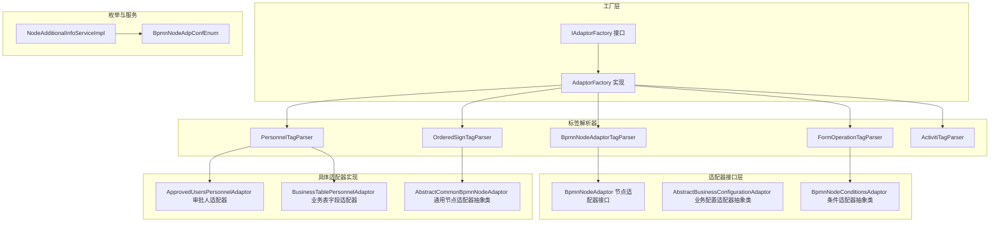
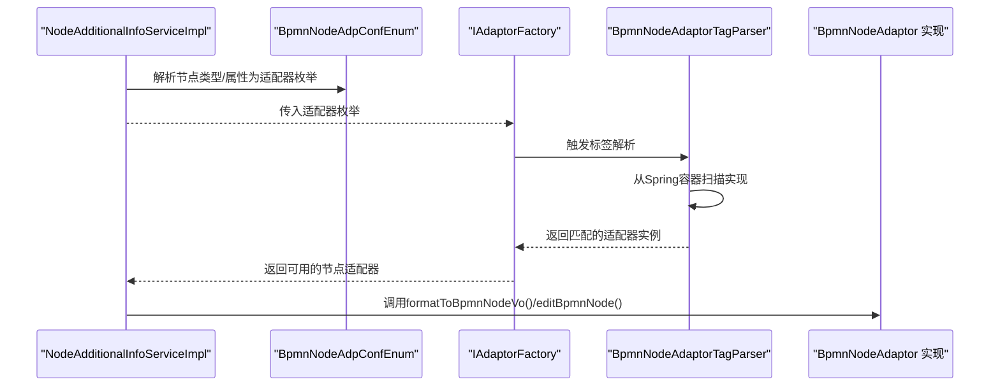
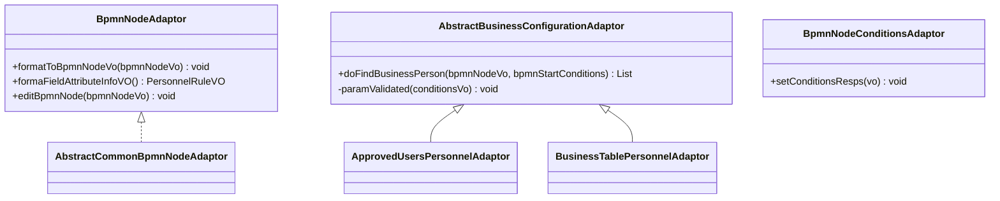
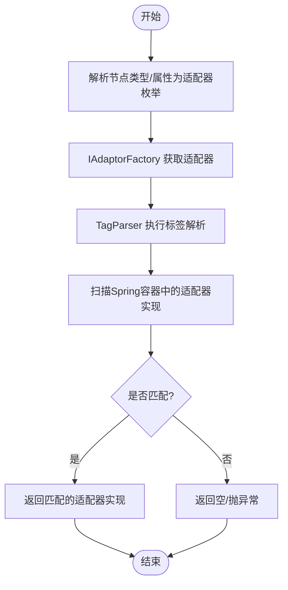
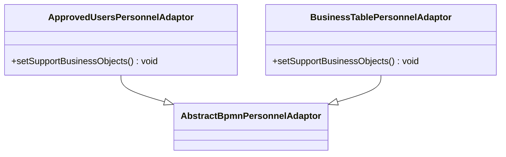
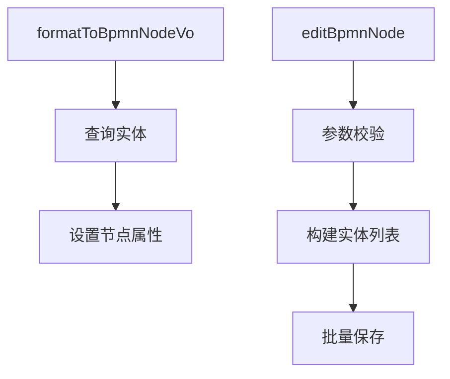
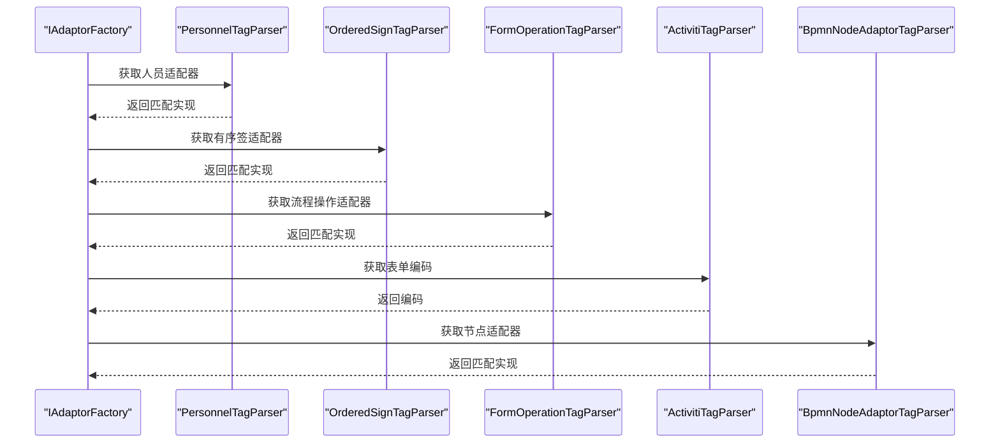
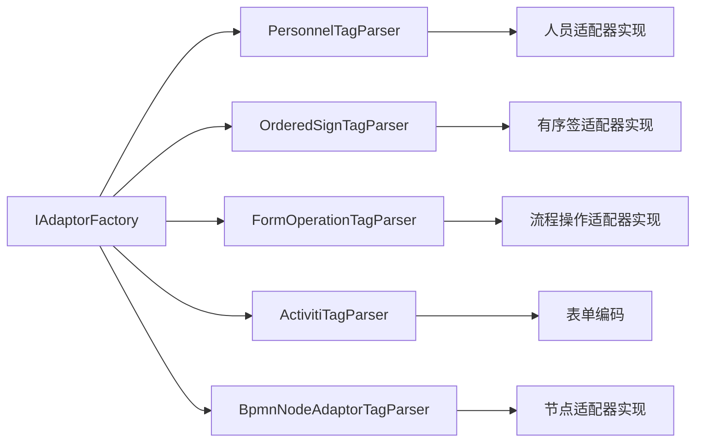

# 节点适配器实现

<cite>
**本文引用的文件**
- [AdaptorFactory.java](file://antflow-engine/src/main/java/org/openoa/engine/factory/AdaptorFactory.java)
- [IAdaptorFactory.java](file://antflow-engine/src/main/java/org/openoa/engine/factory/IAdaptorFactory.java)
- [BpmnNodeAdaptor.java](file://antflow-engine/src/main/java/org/openoa/engine/bpmnconf/adp/bpmnnodeadp/BpmnNodeAdaptor.java)
- [AbstractCommonBpmnNodeAdaptor.java](file://antflow-engine/src/main/java/org/openoa/engine/bpmnconf/adp/bpmnnodeadp/AbstractCommonBpmnNodeAdaptor.java)
- [AbstractBusinessConfigurationAdaptor.java](file://antflow-engine/src/main/java/org/openoa/engine/bpmnconf/adp/personneladp/AbstractBusinessConfigurationAdaptor.java)
- [ApprovedUsersPersonnelAdaptor.java](file://antflow-engine/src/main/java/org/openoa/engine/bpmnconf/adp/personneladp/ApprovedUsersPersonnelAdaptor.java)
- [BusinessTablePersonnelAdaptor.java](file://antflow-engine/src/main/java/org/openoa/engine/bpmnconf/adp/personneladp/BusinessTablePersonnelAdaptor.java)
- [BpmnNodeConditionsAdaptor.java](file://antflow-engine/src/main/java/org/openoa/engine/bpmnconf/adp/conditionfilter/nodetypeconditions/BpmnNodeConditionsAdaptor.java)
- [BpmnNodeAdaptorTagParser.java](file://antflow-engine/src/main/java/org/openoa/engine/bpmnconf/service/tagparser/BpmnNodeAdaptorTagParser.java)
- [PersonnelTagParser.java](file://antflow-engine/src/main/java/org/openoa/engine/bpmnconf/service/tagparser/PersonnelTagParser.java)
- [ActivitiTagParser.java](file://antflow-engine/src/main/java/org/openoa/engine/bpmnconf/service/tagparser/ActivitiTagParser.java)
- [OrderedSignTagParser.java](file://antflow-engine/src/main/java/org/openoa/engine/bpmnconf/service/tagparser/OrderedSignTagParser.java)
- [FormOperationTagParser.java](file://antflow-engine/src/main/java/org/openoa/engine/bpmnconf/service/tagparser/FormOperationTagParser.java)
- [BpmnNodeAdpConfEnum.java](file://antflow-engine/src/main/java/org/openoa/engine/bpmnconf/constant/enus/BpmnNodeAdpConfEnum.java)
- [NodeAdditionalInfoServiceImpl.java](file://antflow-engine/src/main/java/org/openoa/engine/bpmnconf/common/NodeAdditionalInfoServiceImpl.java)
</cite>

## 目录
1. [简介](#简介)
2. [项目结构](#项目结构)
3. [核心组件](#核心组件)
4. [架构总览](#架构总览)
5. [详细组件分析](#详细组件分析)
6. [依赖分析](#依赖分析)
7. [性能考虑](#性能考虑)
8. [故障排查指南](#故障排查指南)
9. [结论](#结论)
10. [附录：自定义节点适配器开发指南](#附录自定义节点适配器开发指南)

## 简介
本文件面向“节点适配器”的设计与实现，系统化阐述如何通过适配器模式实现流程节点逻辑的可插拔性与扩展性。文档覆盖适配器接口定义、注册与解析机制、生命周期管理，以及用户任务、服务任务、条件判断等节点类型的适配器实现要点，并提供自定义适配器的开发步骤、接口实现与测试建议。

## 项目结构
围绕节点适配器的关键模块分布如下：
- 工厂层：统一暴露适配器获取入口，负责按标签解析选择具体实现
- 适配器接口层：定义节点、人员、流程操作、业务配置等适配器契约
- 具体适配器实现：覆盖用户任务、业务表字段、条件过滤等场景
- 标签解析器：基于枚举或业务数据，从Spring容器中筛选匹配的适配器实现
- 枚举与服务：节点类型/属性枚举、节点附加信息解析服务

图表来源
- [IAdaptorFactory.java:28-52](file://antflow-engine/src/main/java/org/openoa/engine/factory/IAdaptorFactory.java#L28-L52)
- [AdaptorFactory.java:14-33](file://antflow-engine/src/main/java/org/openoa/engine/factory/AdaptorFactory.java#L14-L33)
- [BpmnNodeAdaptor.java:12-30](file://antflow-engine/src/main/java/org/openoa/engine/bpmnconf/adp/bpmnnodeadp/BpmnNodeAdaptor.java#L12-L30)
- [AbstractBusinessConfigurationAdaptor.java:11-26](file://antflow-engine/src/main/java/org/openoa/engine/bpmnconf/adp/personneladp/AbstractBusinessConfigurationAdaptor.java#L11-L26)
- [BpmnNodeConditionsAdaptor.java:10-19](file://antflow-engine/src/main/java/org/openoa/engine/bpmnconf/adp/conditionfilter/nodetypeconditions/BpmnNodeConditionsAdaptor.java#L10-L19)
- [ApprovedUsersPersonnelAdaptor.java:9-18](file://antflow-engine/src/main/java/org/openoa/engine/bpmnconf/adp/personneladp/ApprovedUsersPersonnelAdaptor.java#L9-L18)
- [BusinessTablePersonnelAdaptor.java:16-25](file://antflow-engine/src/main/java/org/openoa/engine/bpmnconf/adp/personneladp/BusinessTablePersonnelAdaptor.java#L16-L25)
- [AbstractCommonBpmnNodeAdaptor.java:15-47](file://antflow-engine/src/main/java/org/openoa/engine/bpmnconf/adp/bpmnnodeadp/AbstractCommonBpmnNodeAdaptor.java#L15-L47)
- [BpmnNodeAdaptorTagParser.java:16-29](file://antflow-engine/src/main/java/org/openoa/engine/bpmnconf/service/tagparser/BpmnNodeAdaptorTagParser.java#L16-L29)
- [PersonnelTagParser.java:19-33](file://antflow-engine/src/main/java/org/openoa/engine/bpmnconf/service/tagparser/PersonnelTagParser.java#L19-L33)
- [OrderedSignTagParser.java:11-25](file://antflow-engine/src/main/java/org/openoa/engine/bpmnconf/service/tagparser/OrderedSignTagParser.java#L11-L25)
- [FormOperationTagParser.java:17-53](file://antflow-engine/src/main/java/org/openoa/engine/bpmnconf/service/tagparser/FormOperationTagParser.java#L17-L53)
- [ActivitiTagParser.java:7-15](file://antflow-engine/src/main/java/org/openoa/engine/bpmnconf/service/tagparser/ActivitiTagParser.java#L7-L15)
- [BpmnNodeAdpConfEnum.java:13-25](file://antflow-engine/src/main/java/org/openoa/engine/bpmnconf/constant/enus/BpmnNodeAdpConfEnum.java#L13-L25)
- [NodeAdditionalInfoServiceImpl.java:66-81](file://antflow-engine/src/main/java/org/openoa/engine/bpmnconf/common/NodeAdditionalInfoServiceImpl.java#L66-L81)

章节来源
- [IAdaptorFactory.java:28-52](file://antflow-engine/src/main/java/org/openoa/engine/factory/IAdaptorFactory.java#L28-L52)
- [AdaptorFactory.java:14-33](file://antflow-engine/src/main/java/org/openoa/engine/factory/AdaptorFactory.java#L14-L33)

## 核心组件
- 适配器接口族
  - 节点适配器：统一节点格式化、编辑能力，面向不同节点类型
  - 人员适配器：面向不同“找人”策略（审批人、业务表字段、部门领导等）
  - 流程操作适配器：面向不同流程操作类型（发起、退回、加签等）
  - 业务配置适配器：面向业务表字段与起始条件的人员查找
  - 条件适配器：面向节点条件响应参数设置
- 工厂与标签解析
  - IAdaptorFactory 提供统一入口，标注@SpfService/@AutoParse驱动解析
  - 各TagParser根据枚举或业务数据从Spring容器中筛选匹配实现
- 枚举与服务
  - BpmnNodeAdpConfEnum 统一节点属性/类型枚举映射
  - NodeAdditionalInfoServiceImpl 将节点类型/属性转换为适配器枚举

章节来源
- [BpmnNodeAdaptor.java:12-30](file://antflow-engine/src/main/java/org/openoa/engine/bpmnconf/adp/bpmnnodeadp/BpmnNodeAdaptor.java#L12-L30)
- [AbstractBusinessConfigurationAdaptor.java:11-26](file://antflow-engine/src/main/java/org/openoa/engine/bpmnconf/adp/personneladp/AbstractBusinessConfigurationAdaptor.java#L11-L26)
- [BpmnNodeConditionsAdaptor.java:10-19](file://antflow-engine/src/main/java/org/openoa/engine/bpmnconf/adp/conditionfilter/nodetypeconditions/BpmnNodeConditionsAdaptor.java#L10-L19)
- [IAdaptorFactory.java:28-52](file://antflow-engine/src/main/java/org/openoa/engine/factory/IAdaptorFactory.java#L28-L52)
- [BpmnNodeAdpConfEnum.java:13-25](file://antflow-engine/src/main/java/org/openoa/engine/bpmnconf/constant/enus/BpmnNodeAdpConfEnum.java#L13-L25)
- [NodeAdditionalInfoServiceImpl.java:66-81](file://antflow-engine/src/main/java/org/openoa/engine/bpmnconf/common/NodeAdditionalInfoServiceImpl.java#L66-L81)

## 架构总览
下图展示从“节点附加信息解析服务”到“标签解析器”，再到“具体适配器实现”的调用链路，体现适配器的可插拔性与工厂统一入口。

图表来源
- [NodeAdditionalInfoServiceImpl.java:66-81](file://antflow-engine/src/main/java/org/openoa/engine/bpmnconf/common/NodeAdditionalInfoServiceImpl.java#L66-L81)
- [BpmnNodeAdpConfEnum.java:13-25](file://antflow-engine/src/main/java/org/openoa/engine/bpmnconf/constant/enus/BpmnNodeAdpConfEnum.java#L13-L25)
- [IAdaptorFactory.java:41-42](file://antflow-engine/src/main/java/org/openoa/engine/factory/IAdaptorFactory.java#L41-L42)
- [BpmnNodeAdaptorTagParser.java:16-29](file://antflow-engine/src/main/java/org/openoa/engine/bpmnconf/service/tagparser/BpmnNodeAdaptorTagParser.java#L16-L29)
- [BpmnNodeAdaptor.java:12-30](file://antflow-engine/src/main/java/org/openoa/engine/bpmnconf/adp/bpmnnodeadp/BpmnNodeAdaptor.java#L12-L30)

## 详细组件分析

### 适配器接口定义与职责
- 节点适配器接口
  - 负责节点格式化、字段属性信息格式化、节点编辑
  - 作为所有节点类型适配器的统一契约
- 人员配置适配器抽象类
  - 定义业务表字段与起始条件的人员查找规范
  - 提供参数校验保护
- 条件适配器抽象类
  - 定义节点条件响应参数设置规范

图表来源
- [BpmnNodeAdaptor.java:12-30](file://antflow-engine/src/main/java/org/openoa/engine/bpmnconf/adp/bpmnnodeadp/BpmnNodeAdaptor.java#L12-L30)
- [AbstractBusinessConfigurationAdaptor.java:11-26](file://antflow-engine/src/main/java/org/openoa/engine/bpmnconf/adp/personneladp/AbstractBusinessConfigurationAdaptor.java#L11-L26)
- [BpmnNodeConditionsAdaptor.java:10-19](file://antflow-engine/src/main/java/org/openoa/engine/bpmnconf/adp/conditionfilter/nodetypeconditions/BpmnNodeConditionsAdaptor.java#L10-L19)
- [AbstractCommonBpmnNodeAdaptor.java:15-47](file://antflow-engine/src/main/java/org/openoa/engine/bpmnconf/adp/bpmnnodeadp/AbstractCommonBpmnNodeAdaptor.java#L15-L47)
- [ApprovedUsersPersonnelAdaptor.java:9-18](file://antflow-engine/src/main/java/org/openoa/engine/bpmnconf/adp/personneladp/ApprovedUsersPersonnelAdaptor.java#L9-L18)
- [BusinessTablePersonnelAdaptor.java:16-25](file://antflow-engine/src/main/java/org/openoa/engine/bpmnconf/adp/personneladp/BusinessTablePersonnelAdaptor.java#L16-L25)

章节来源
- [BpmnNodeAdaptor.java:12-30](file://antflow-engine/src/main/java/org/openoa/engine/bpmnconf/adp/bpmnnodeadp/BpmnNodeAdaptor.java#L12-L30)
- [AbstractBusinessConfigurationAdaptor.java:11-26](file://antflow-engine/src/main/java/org/openoa/engine/bpmnconf/adp/personneladp/AbstractBusinessConfigurationAdaptor.java#L11-L26)
- [BpmnNodeConditionsAdaptor.java:10-19](file://antflow-engine/src/main/java/org/openoa/engine/bpmnconf/adp/conditionfilter/nodetypeconditions/BpmnNodeConditionsAdaptor.java#L10-L19)

### 适配器注册机制与生命周期
- 注册方式
  - 通过Spring容器自动扫描@Component等注解的实现类
  - 适配器实现需声明支持的业务对象（如PersonnelEnum、OrderNodeTypeEnum等）
- 生命周期
  - 由Spring容器管理，工厂通过@SpfService/@AutoParse触发解析
  - 解析器在运行期从容器中筛选匹配实现，避免硬编码耦合
- 解析流程
  - IAdaptorFactory 提供统一入口
  - TagParser 根据枚举或业务数据从容器中遍历实现，返回首个匹配者

图表来源
- [IAdaptorFactory.java:28-52](file://antflow-engine/src/main/java/org/openoa/engine/factory/IAdaptorFactory.java#L28-L52)
- [PersonnelTagParser.java:19-33](file://antflow-engine/src/main/java/org/openoa/engine/bpmnconf/service/tagparser/PersonnelTagParser.java#L19-L33)
- [OrderedSignTagParser.java:11-25](file://antflow-engine/src/main/java/org/openoa/engine/bpmnconf/service/tagparser/OrderedSignTagParser.java#L11-L25)
- [FormOperationTagParser.java:17-53](file://antflow-engine/src/main/java/org/openoa/engine/bpmnconf/service/tagparser/FormOperationTagParser.java#L17-L53)
- [BpmnNodeAdaptorTagParser.java:16-29](file://antflow-engine/src/main/java/org/openoa/engine/bpmnconf/service/tagparser/BpmnNodeAdaptorTagParser.java#L16-L29)

章节来源
- [PersonnelTagParser.java:19-33](file://antflow-engine/src/main/java/org/openoa/engine/bpmnconf/service/tagparser/PersonnelTagParser.java#L19-L33)
- [OrderedSignTagParser.java:11-25](file://antflow-engine/src/main/java/org/openoa/engine/bpmnconf/service/tagparser/OrderedSignTagParser.java#L11-L25)
- [FormOperationTagParser.java:17-53](file://antflow-engine/src/main/java/org/openoa/engine/bpmnconf/service/tagparser/FormOperationTagParser.java#L17-L53)
- [BpmnNodeAdaptorTagParser.java:16-29](file://antflow-engine/src/main/java/org/openoa/engine/bpmnconf/service/tagparser/BpmnNodeAdaptorTagParser.java#L16-L29)

### 典型节点适配器实现示例

#### 用户任务适配器
- 审批人适配器
  - 支持“审批人”类型的人员查找策略
  - 通过构造注入员工信息服务与人员提供服务
- 业务表字段适配器
  - 支持“业务表字段”类型的人员查找策略
  - 通过构造注入员工信息服务与人员提供服务

图表来源
- [ApprovedUsersPersonnelAdaptor.java:9-18](file://antflow-engine/src/main/java/org/openoa/engine/bpmnconf/adp/personneladp/ApprovedUsersPersonnelAdaptor.java#L9-L18)
- [BusinessTablePersonnelAdaptor.java:16-25](file://antflow-engine/src/main/java/org/openoa/engine/bpmnconf/adp/personneladp/BusinessTablePersonnelAdaptor.java#L16-L25)

章节来源
- [ApprovedUsersPersonnelAdaptor.java:9-18](file://antflow-engine/src/main/java/org/openoa/engine/bpmnconf/adp/personneladp/ApprovedUsersPersonnelAdaptor.java#L9-L18)
- [BusinessTablePersonnelAdaptor.java:16-25](file://antflow-engine/src/main/java/org/openoa/engine/bpmnconf/adp/personneladp/BusinessTablePersonnelAdaptor.java#L16-L25)

#### 服务任务适配器
- 通用节点适配器抽象类
  - 在格式化阶段查询持久化实体并回填节点属性
  - 在编辑阶段校验参数、构建实体并批量保存
  - 通过IService<T>实现与数据库交互

图表来源
- [AbstractCommonBpmnNodeAdaptor.java:15-47](file://antflow-engine/src/main/java/org/openoa/engine/bpmnconf/adp/bpmnnodeadp/AbstractCommonBpmnNodeAdaptor.java#L15-L47)

章节来源
- [AbstractCommonBpmnNodeAdaptor.java:15-47](file://antflow-engine/src/main/java/org/openoa/engine/bpmnconf/adp/bpmnnodeadp/AbstractCommonBpmnNodeAdaptor.java#L15-L47)

#### 条件适配器
- 节点条件适配器抽象类
  - 定义条件响应参数设置的统一入口
  - 子类按节点类型实现具体条件处理逻辑

章节来源
- [BpmnNodeConditionsAdaptor.java:10-19](file://antflow-engine/src/main/java/org/openoa/engine/bpmnconf/adp/conditionfilter/nodetypeconditions/BpmnNodeConditionsAdaptor.java#L10-L19)

### 工厂与标签解析器
- IAdaptorFactory
  - 统一暴露各类适配器获取方法
  - 使用@SpfService/@AutoParse标注，结合TagParser完成解析
- TagParser系列
  - PersonnelTagParser：按PersonnelEnum选择人员适配器
  - OrderedSignTagParser：按OrderNodeTypeEnum选择有序签适配器
  - FormOperationTagParser：按业务数据与操作类型选择流程操作适配器
  - ActivitiTagParser：按是否低代码流程选择表单编码
  - BpmnNodeAdaptorTagParser：按BpmnNodeAdpConfEnum选择节点适配器

图表来源
- [IAdaptorFactory.java:28-52](file://antflow-engine/src/main/java/org/openoa/engine/factory/IAdaptorFactory.java#L28-L52)
- [PersonnelTagParser.java:19-33](file://antflow-engine/src/main/java/org/openoa/engine/bpmnconf/service/tagparser/PersonnelTagParser.java#L19-L33)
- [OrderedSignTagParser.java:11-25](file://antflow-engine/src/main/java/org/openoa/engine/bpmnconf/service/tagparser/OrderedSignTagParser.java#L11-L25)
- [FormOperationTagParser.java:17-53](file://antflow-engine/src/main/java/org/openoa/engine/bpmnconf/service/tagparser/FormOperationTagParser.java#L17-L53)
- [ActivitiTagParser.java:7-15](file://antflow-engine/src/main/java/org/openoa/engine/bpmnconf/service/tagparser/ActivitiTagParser.java#L7-L15)
- [BpmnNodeAdaptorTagParser.java:16-29](file://antflow-engine/src/main/java/org/openoa/engine/bpmnconf/service/tagparser/BpmnNodeAdaptorTagParser.java#L16-L29)

章节来源
- [IAdaptorFactory.java:28-52](file://antflow-engine/src/main/java/org/openoa/engine/factory/IAdaptorFactory.java#L28-L52)
- [PersonnelTagParser.java:19-33](file://antflow-engine/src/main/java/org/openoa/engine/bpmnconf/service/tagparser/PersonnelTagParser.java#L19-L33)
- [OrderedSignTagParser.java:11-25](file://antflow-engine/src/main/java/org/openoa/engine/bpmnconf/service/tagparser/OrderedSignTagParser.java#L11-L25)
- [FormOperationTagParser.java:17-53](file://antflow-engine/src/main/java/org/openoa/engine/bpmnconf/service/tagparser/FormOperationTagParser.java#L17-L53)
- [ActivitiTagParser.java:7-15](file://antflow-engine/src/main/java/org/openoa/engine/bpmnconf/service/tagparser/ActivitiTagParser.java#L7-L15)
- [BpmnNodeAdaptorTagParser.java:16-29](file://antflow-engine/src/main/java/org/openoa/engine/bpmnconf/service/tagparser/BpmnNodeAdaptorTagParser.java#L16-L29)

## 依赖分析
- 低耦合高内聚
  - 适配器通过接口隔离具体实现，工厂仅依赖接口与TagParser
  - TagParser依赖Spring容器扫描，避免硬编码映射
- 关键依赖关系
  - IAdaptorFactory 依赖各TagParser
  - TagParser 依赖 SpringBeanUtils 与具体适配器实现
  - 业务配置适配器依赖基础异常与VO模型

图表来源
- [IAdaptorFactory.java:28-52](file://antflow-engine/src/main/java/org/openoa/engine/factory/IAdaptorFactory.java#L28-L52)
- [PersonnelTagParser.java:19-33](file://antflow-engine/src/main/java/org/openoa/engine/bpmnconf/service/tagparser/PersonnelTagParser.java#L19-L33)
- [OrderedSignTagParser.java:11-25](file://antflow-engine/src/main/java/org/openoa/engine/bpmnconf/service/tagparser/OrderedSignTagParser.java#L11-L25)
- [FormOperationTagParser.java:17-53](file://antflow-engine/src/main/java/org/openoa/engine/bpmnconf/service/tagparser/FormOperationTagParser.java#L17-L53)
- [ActivitiTagParser.java:7-15](file://antflow-engine/src/main/java/org/openoa/engine/bpmnconf/service/tagparser/ActivitiTagParser.java#L7-L15)
- [BpmnNodeAdaptorTagParser.java:16-29](file://antflow-engine/src/main/java/org/openoa/engine/bpmnconf/service/tagparser/BpmnNodeAdaptorTagParser.java#L16-L29)

章节来源
- [IAdaptorFactory.java:28-52](file://antflow-engine/src/main/java/org/openoa/engine/factory/IAdaptorFactory.java#L28-L52)

## 性能考虑
- 解析性能
  - TagParser在运行期遍历容器实现，建议控制适配器数量与命名规范，减少扫描成本
- 扩展性
  - 通过抽象类封装通用逻辑（如通用节点适配器），降低重复实现
- 缓存策略
  - 可在工厂层对解析结果进行缓存，避免重复扫描（需注意实现变更后的失效）

## 故障排查指南
- 常见问题
  - 无法解析到适配器：检查实现类是否被Spring扫描（如@Component）、是否正确声明支持的业务对象
  - 参数为空：各TagParser与抽象适配器均提供参数校验，确保传入数据完整
  - 类型不匹配：确认BpmnNodeAdpConfEnum与实际节点类型一致
- 排查步骤
  - 在TagParser中打印候选实现列表，定位匹配失败原因
  - 在工厂方法处断点，确认@SpfService/@AutoParse是否生效
  - 检查NodeAdditionalInfoServiceImpl的枚举转换逻辑

章节来源
- [PersonnelTagParser.java:19-33](file://antflow-engine/src/main/java/org/openoa/engine/bpmnconf/service/tagparser/PersonnelTagParser.java#L19-L33)
- [FormOperationTagParser.java:17-53](file://antflow-engine/src/main/java/org/openoa/engine/bpmnconf/service/tagparser/FormOperationTagParser.java#L17-L53)
- [AbstractBusinessConfigurationAdaptor.java:11-26](file://antflow-engine/src/main/java/org/openoa/engine/bpmnconf/adp/personneladp/AbstractBusinessConfigurationAdaptor.java#L11-L26)
- [NodeAdditionalInfoServiceImpl.java:66-81](file://antflow-engine/src/main/java/org/openoa/engine/bpmnconf/common/NodeAdditionalInfoServiceImpl.java#L66-L81)

## 结论
通过适配器模式与工厂+标签解析器的组合，系统实现了节点逻辑的高可插拔性与强扩展性。接口契约清晰、解析机制灵活、生命周期由Spring托管，既保证了易用性，也为二次开发提供了稳定基座。

## 附录：自定义节点适配器开发指南
- 开发步骤
  1) 设计适配器接口与抽象类
     - 若为节点类型，实现BpmnNodeAdaptor或继承AbstractCommonBpmnNodeAdaptor
     - 若为人员类型，继承AbstractBusinessConfigurationAdaptor或AbstractBpmnPersonnelAdaptor
  2) 实现业务逻辑
     - 在formatToBpmnNodeVo中完成节点属性填充
     - 在editBpmnNode中完成参数校验与持久化
     - 在抽象类中实现查询/构建/校验等通用流程
  3) 声明支持的业务对象
     - 在实现类中声明支持的枚举值（如PersonnelEnum、OrderNodeTypeEnum等）
  4) 注册与测试
     - 使用@Component等注解让Spring扫描
     - 编写单元测试，覆盖解析路径与业务逻辑分支
- 接口实现要点
  - 遵循接口契约，避免直接依赖具体实现
  - 对外暴露的方法应具备幂等性与可测试性
- 测试方法
  - 单元测试：Mock SpringBeanUtils，验证TagParser解析逻辑
  - 集成测试：启动Spring上下文，验证工厂方法与解析器协作

章节来源
- [BpmnNodeAdaptor.java:12-30](file://antflow-engine/src/main/java/org/openoa/engine/bpmnconf/adp/bpmnnodeadp/BpmnNodeAdaptor.java#L12-L30)
- [AbstractCommonBpmnNodeAdaptor.java:15-47](file://antflow-engine/src/main/java/org/openoa/engine/bpmnconf/adp/bpmnnodeadp/AbstractCommonBpmnNodeAdaptor.java#L15-L47)
- [AbstractBusinessConfigurationAdaptor.java:11-26](file://antflow-engine/src/main/java/org/openoa/engine/bpmnconf/adp/personneladp/AbstractBusinessConfigurationAdaptor.java#L11-L26)
- [PersonnelTagParser.java:19-33](file://antflow-engine/src/main/java/org/openoa/engine/bpmnconf/service/tagparser/PersonnelTagParser.java#L19-L33)
- [BpmnNodeAdaptorTagParser.java:16-29](file://antflow-engine/src/main/java/org/openoa/engine/bpmnconf/service/tagparser/BpmnNodeAdaptorTagParser.java#L16-L29)