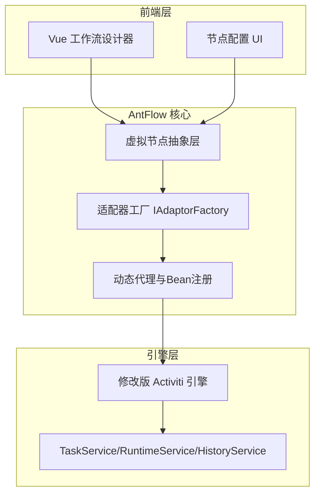
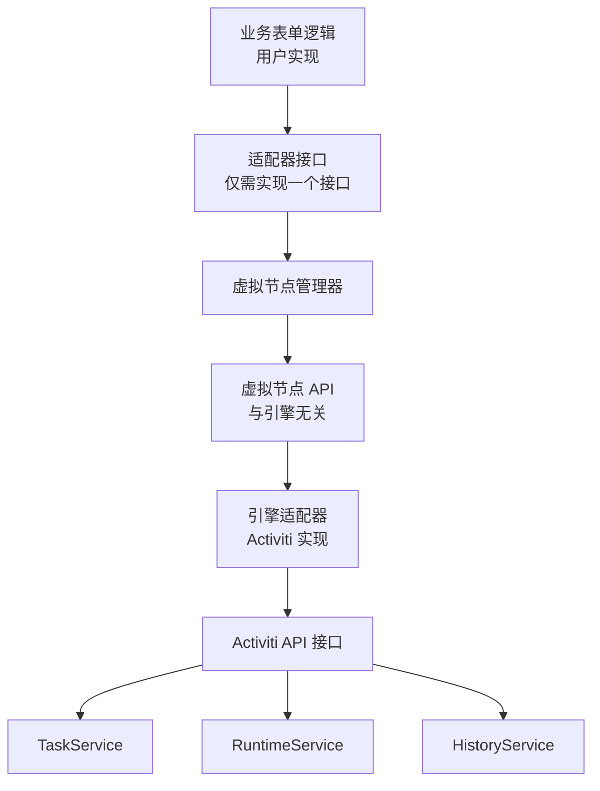
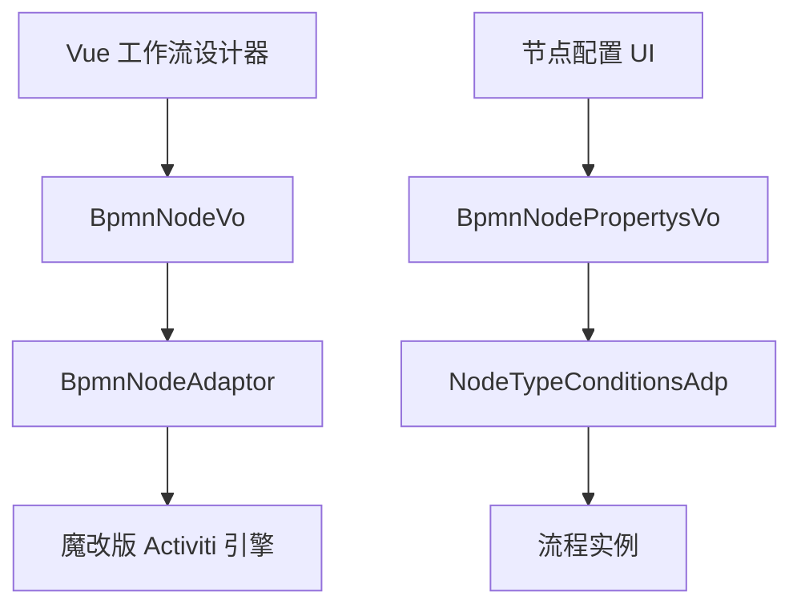
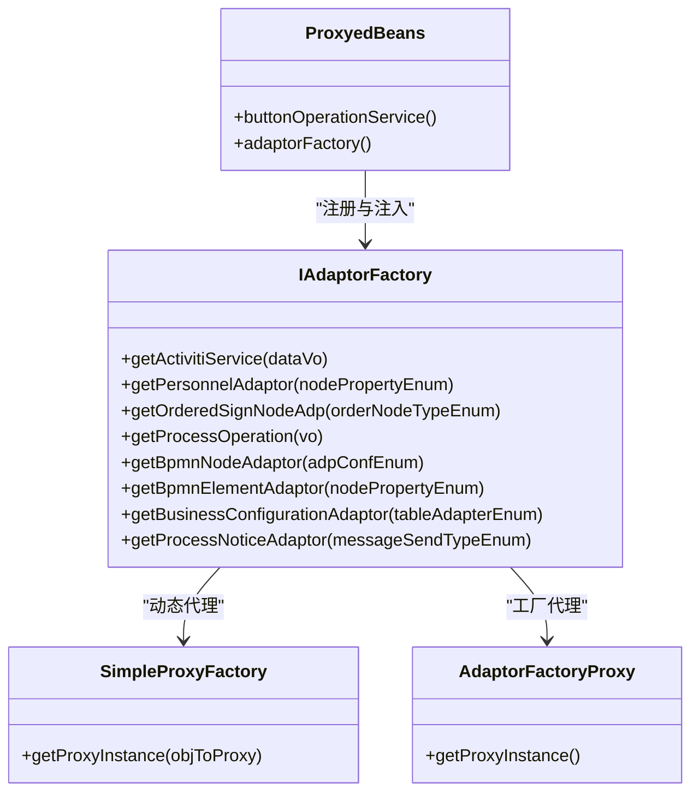
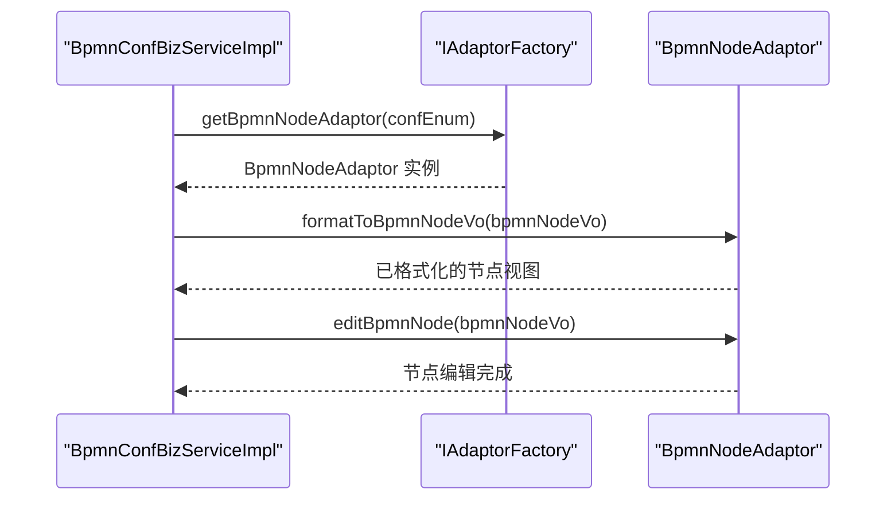
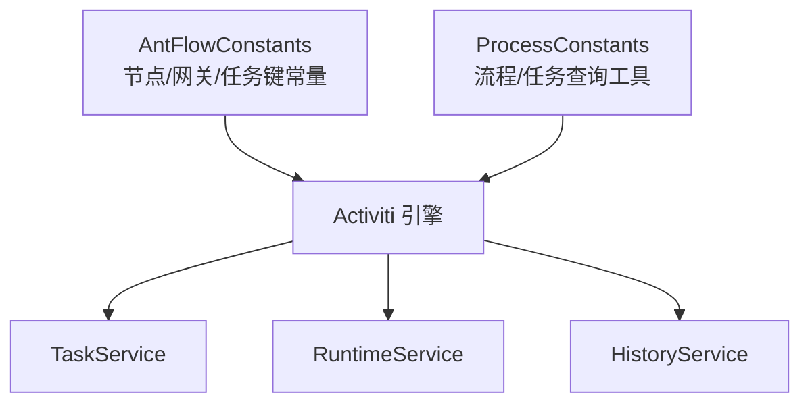
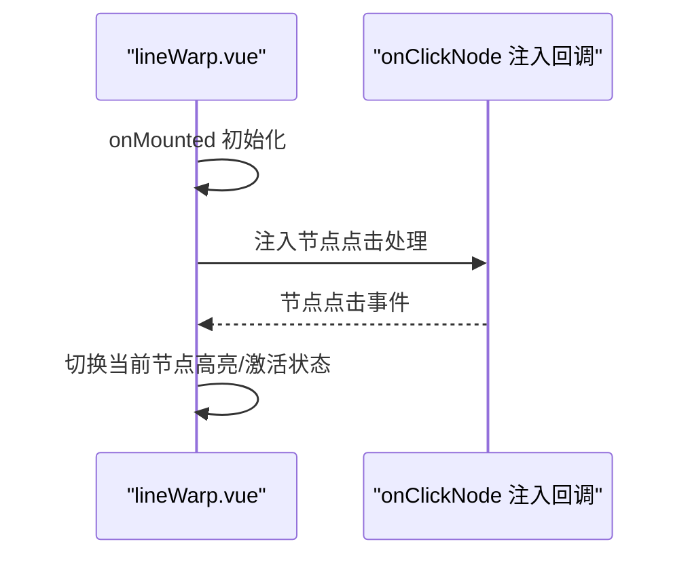
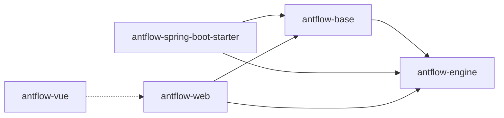

# 虚拟节点架构设计

<cite>
**本文引用的文件**
- [AntFlow_系统架构.md](file://doc/系统介绍篇/2.AntFlow_系统架构.md)
- [核心概念和术语.md](file://doc/系统介绍篇/3.核心概念和术语.md)
- [开发者指南.md](file://doc/系统介绍篇/20.开发者指南.md)
- [AntFlowConstants.java](file://antflow-engine/src/main/java/org/activiti/engine/bpmnconf/constant/AntFlowConstants.java)
- [ProcessConstants.java](file://antflow-engine/src/main/java/org/activiti/engine/bpmnconf/common/ProcessConstants.java)
- [IAdaptorFactory.java](file://antflow-engine/src/main/java/org/openoa/engine/factory/IAdaptorFactory.java)
- [SimpleProxyFactory.java](file://antflow-engine/src/main/java/org/openoa/engine/factory/SimpleProxyFactory.java)
- [AdaptorFactoryProxy.java](file://antflow-engine/src/main/java/org/openoa/engine/factory/AdaptorFactoryProxy.java)
- [ProxyedBeans.java](file://antflow-engine/src/main/java/org/openoa/engine/common/ProxyedBeans.java)
- [BpmnNodeAdaptor.java](file://antflow-engine/src/main/java/org/openoa/engine/bpmnconf/adp/bpmnnodeadp/BpmnNodeAdaptor.java)
- [AbstractBusinessConfigurationAdaptor.java](file://antflow-engine/src/main/java/org/openoa/engine/bpmnconf/adp/personneladp/AbstractBusinessConfigurationAdaptor.java)
- [BpmnConfBizServiceImpl.java](file://antflow-engine/src/main/java/org/openoa/engine/bpmnconf/service/biz/BpmnConfBizServiceImpl.java)
- [SpringProcessEngineConfiguration.java](file://antflow-base/src/main/java/org/activiti/spring/SpringProcessEngineConfiguration.java)
- [BpmnModel.java](file://antflow-base/src/main/java/org/activiti/bpmn/model/BpmnModel.java)
- [ProcessDiagramLayoutFactory.java](file://antflow-base/src/main/java/org/activiti/engine/impl/bpmn/diagram/ProcessDiagramLayoutFactory.java)
- [ProcessEngines.java](file://antflow-base/src/main/java/org/activiti/engine/ProcessEngines.java)
- [lineWarp.vue](file://antflow-vue/src/components/Workflow/Preview/lineWarp.vue)
- [vite.config.js](file://antflow-vue/vite.config.js)
</cite>

## 目录
1. [引言](#引言)
2. [项目结构](#项目结构)
3. [核心组件](#核心组件)
4. [架构总览](#架构总览)
5. [详细组件分析](#详细组件分析)
6. [依赖分析](#依赖分析)
7. [性能考虑](#性能考虑)
8. [故障排查指南](#故障排查指南)
9. [结论](#结论)
10. [附录](#附录)

## 引言
本文件面向“虚拟节点架构设计”主题，系统化阐述 AntFlow 在流程引擎之上构建的 VNode（虚拟节点）体系：如何以“业务逻辑与引擎实现完全分离”的方式，实现流程节点的抽象、扩展与跨引擎迁移。文档从架构理念、层次划分、设计原则出发，结合实际代码文件定位，给出架构图、类图与序列图，帮助读者理解 VNode 如何通过适配器工厂、动态代理与统一抽象接口，将流程节点能力从具体引擎 API 中抽离，从而获得更高的可扩展性、灵活性与可维护性。

## 项目结构
AntFlow 采用多模块分层组织，围绕“基础能力（antflow-base）—引擎扩展（antflow-engine）—前端设计器（antflow-vue）—启动器（antflow-spring-boot-starter）—示例应用（antflow-web）”的结构展开。其中，VNode 架构主要位于引擎模块的 bpmnconf 子系统，配合工厂与适配器层，向上支撑前端设计器与业务配置，向下对接 Activiti 引擎。

图表来源
- [AntFlow_系统架构.md:168-208](file://doc/系统介绍篇/2.AntFlow_系统架构.md#L168-L208)
- [开发者指南.md:24-87](file://doc/系统介绍篇/20.开发者指南.md#L24-L87)

章节来源
- [AntFlow_系统架构.md:168-208](file://doc/系统介绍篇/2.AntFlow_系统架构.md#L168-L208)
- [开发者指南.md:24-87](file://doc/系统介绍篇/20.开发者指南.md#L24-L87)

## 核心组件
- 虚拟节点抽象层：以 BpmnNodeVo、BpmnNodePropertysVo 等为核心载体，承载节点配置与业务语义，屏蔽引擎差异。
- 适配器工厂 IAdaptorFactory：集中暴露各类适配器的获取入口，包含表单操作、流程操作、人员规则、节点适配等。
- 动态代理与Bean注册：通过 SimpleProxyFactory 与 AdaptorFactoryProxy 动态生成代理类，结合 ProxyedBeans 注册，降低耦合与增强扩展性。
- 引擎适配器：如 BpmnNodeAdaptor、AbstractBusinessConfigurationAdaptor 等，负责将抽象节点映射到具体引擎能力。
- 引擎实现：基于修改版 Activiti，提供 TaskService/RuntimeService/HistoryService 等核心服务。

章节来源
- [IAdaptorFactory.java:28-52](file://antflow-engine/src/main/java/org/openoa/engine/factory/IAdaptorFactory.java#L28-L52)
- [SimpleProxyFactory.java:19-96](file://antflow-engine/src/main/java/org/openoa/engine/factory/SimpleProxyFactory.java#L19-L96)
- [AdaptorFactoryProxy.java:14-71](file://antflow-engine/src/main/java/org/openoa/engine/factory/AdaptorFactoryProxy.java#L14-L71)
- [ProxyedBeans.java:19-42](file://antflow-engine/src/main/java/org/openoa/engine/common/ProxyedBeans.java#L19-L42)
- [BpmnNodeAdaptor.java:12-30](file://antflow-engine/src/main/java/org/openoa/engine/bpmnconf/adp/bpmnnodeadp/BpmnNodeAdaptor.java#L12-L30)
- [AbstractBusinessConfigurationAdaptor.java:11-26](file://antflow-engine/src/main/java/org/openoa/engine/bpmnconf/adp/personneladp/AbstractBusinessConfigurationAdaptor.java#L11-L26)

## 架构总览
VNode 架构的核心目标是“将业务逻辑与引擎实现分离”。通过统一的虚拟节点抽象与适配器工厂，业务侧仅需实现少量接口，即可完成节点行为的扩展；引擎侧通过适配器将抽象映射到具体引擎 API，从而实现跨引擎迁移与灵活替换。

图表来源
- [AntFlow_系统架构.md:168-208](file://doc/系统介绍篇/2.AntFlow_系统架构.md#L168-L208)

章节来源
- [AntFlow_系统架构.md:168-208](file://doc/系统介绍篇/2.AntFlow_系统架构.md#L168-L208)

## 详细组件分析

### 组件一：虚拟节点抽象与配置
- 抽象载体：BpmnNodeVo、BpmnNodePropertysVo 等，承载节点元信息、属性与标签，作为前后端交互与引擎适配的基础。
- 配置系统：通过 BPMN 配置系统对流程定义、节点属性与路由逻辑进行结构化管理，分离流程流与业务规则的关注点。
- 前端渲染：Vue 设计器与节点配置 UI 将用户输入转换为抽象节点配置，再由适配器层映射到引擎。

图表来源
- [核心概念和术语.md:1-53](file://doc/系统介绍篇/3.核心概念和术语.md#L1-L53)

章节来源
- [核心概念和术语.md:1-53](file://doc/系统介绍篇/3.核心概念和术语.md#L1-L53)

### 组件二：适配器工厂与动态代理
- IAdaptorFactory：统一暴露各类适配器的获取方法，涵盖表单操作、流程操作、人员规则、节点适配与业务配置等。
- SimpleProxyFactory：基于 Javassist 动态生成接口代理，避免硬编码实现，提升扩展性。
- AdaptorFactoryProxy：针对特定工厂接口生成代理对象，确保在运行期按需加载与复用。
- ProxyedBeans：在 Spring 上下文中注册代理 Bean，保证适配器工厂的注入与调用一致性。

图表来源
- [IAdaptorFactory.java:28-52](file://antflow-engine/src/main/java/org/openoa/engine/factory/IAdaptorFactory.java#L28-L52)
- [SimpleProxyFactory.java:19-96](file://antflow-engine/src/main/java/org/openoa/engine/factory/SimpleProxyFactory.java#L19-L96)
- [AdaptorFactoryProxy.java:14-71](file://antflow-engine/src/main/java/org/openoa/engine/factory/AdaptorFactoryProxy.java#L14-L71)
- [ProxyedBeans.java:19-42](file://antflow-engine/src/main/java/org/openoa/engine/common/ProxyedBeans.java#L19-L42)

章节来源
- [IAdaptorFactory.java:28-52](file://antflow-engine/src/main/java/org/openoa/engine/factory/IAdaptorFactory.java#L28-L52)
- [SimpleProxyFactory.java:19-96](file://antflow-engine/src/main/java/org/openoa/engine/factory/SimpleProxyFactory.java#L19-L96)
- [AdaptorFactoryProxy.java:14-71](file://antflow-engine/src/main/java/org/openoa/engine/factory/AdaptorFactoryProxy.java#L14-L71)
- [ProxyedBeans.java:19-42](file://antflow-engine/src/main/java/org/openoa/engine/common/ProxyedBeans.java#L19-L42)

### 组件三：引擎适配器与节点格式化
- BpmnNodeAdaptor：负责将抽象节点格式化为引擎可用的节点视图，并支持编辑节点信息。
- AbstractBusinessConfigurationAdaptor：面向业务表与字段的找人规则，提供统一的人员查询接口。
- 业务服务：BpmnConfBizServiceImpl 在节点配置阶段调用适配器，完成节点格式化与属性设置。

图表来源
- [BpmnConfBizServiceImpl.java:1648-1684](file://antflow-engine/src/main/java/org/openoa/engine/bpmnconf/service/biz/BpmnConfBizServiceImpl.java#L1648-L1684)
- [IAdaptorFactory.java:41-46](file://antflow-engine/src/main/java/org/openoa/engine/factory/IAdaptorFactory.java#L41-L46)
- [BpmnNodeAdaptor.java:12-30](file://antflow-engine/src/main/java/org/openoa/engine/bpmnconf/adp/bpmnnodeadp/BpmnNodeAdaptor.java#L12-L30)

章节来源
- [BpmnConfBizServiceImpl.java:1648-1684](file://antflow-engine/src/main/java/org/openoa/engine/bpmnconf/service/biz/BpmnConfBizServiceImpl.java#L1648-L1684)
- [BpmnNodeAdaptor.java:12-30](file://antflow-engine/src/main/java/org/openoa/engine/bpmnconf/adp/bpmnnodeadp/BpmnNodeAdaptor.java#L12-L30)
- [AbstractBusinessConfigurationAdaptor.java:11-26](file://antflow-engine/src/main/java/org/openoa/engine/bpmnconf/adp/personneladp/AbstractBusinessConfigurationAdaptor.java#L11-L26)

### 组件四：引擎实现与常量约定
- 引擎实现：基于修改版 Activiti，提供 TaskService/RuntimeService/HistoryService 等核心服务。
- 常量约定：AntFlowConstants 定义了节点类型、网关类型、任务键、结束事件等关键标识，保障跨模块的一致性。
- 流程常量工具：ProcessConstants 提供流程实例查询、任务查询、历史任务回溯等通用能力，支撑运行期节点流转判断。

图表来源
- [AntFlowConstants.java:1-92](file://antflow-engine/src/main/java/org/activiti/engine/bpmnconf/constant/AntFlowConstants.java#L1-L92)
- [ProcessConstants.java:32-158](file://antflow-engine/src/main/java/org/activiti/engine/bpmnconf/common/ProcessConstants.java#L32-L158)
- [SpringProcessEngineConfiguration.java:184-201](file://antflow-base/src/main/java/org/activiti/spring/SpringProcessEngineConfiguration.java#L184-L201)

章节来源
- [AntFlowConstants.java:1-92](file://antflow-engine/src/main/java/org/activiti/engine/bpmnconf/constant/AntFlowConstants.java#L1-L92)
- [ProcessConstants.java:32-158](file://antflow-engine/src/main/java/org/activiti/engine/bpmnconf/common/ProcessConstants.java#L32-L158)
- [SpringProcessEngineConfiguration.java:184-201](file://antflow-base/src/main/java/org/activiti/spring/SpringProcessEngineConfiguration.java#L184-L201)

### 组件五：前端节点渲染与交互
- 前端预览：lineWarp.vue 通过注入的 onClickNode 回调处理节点点击，高亮当前节点并切换激活状态。
- 构建优化：vite.config.js 对 vForm 库进行独立打包与手动分包，提升前端构建效率与缓存命中率。

图表来源
- [lineWarp.vue:56-86](file://antflow-vue/src/components/Workflow/Preview/lineWarp.vue#L56-L86)
- [vite.config.js:29-70](file://antflow-vue/vite.config.js#L29-L70)

章节来源
- [lineWarp.vue:56-86](file://antflow-vue/src/components/Workflow/Preview/lineWarp.vue#L56-L86)
- [vite.config.js:29-70](file://antflow-vue/vite.config.js#L29-L70)

## 依赖分析
- 模块依赖：父工程聚合基础模块、引擎模块、启动器、Web 接口与前端模块；引擎模块依赖基础模块，启动器依赖基础与引擎模块。
- 组件耦合：VNode 抽象层通过 IAdaptorFactory 与引擎实现解耦；动态代理与 Bean 注册进一步弱化直接依赖。
- 外部依赖：前端通过 Vite 进行构建与代理，后端基于 Activiti 引擎与 Spring Boot 自动装配。

图表来源
- [开发者指南.md:24-87](file://doc/系统介绍篇/20.开发者指南.md#L24-L87)

章节来源
- [开发者指南.md:24-87](file://doc/系统介绍篇/20.开发者指南.md#L24-L87)

## 性能考虑
- 动态代理与缓存：SimpleProxyFactory 与 AdaptorFactoryProxy 通过已生成实例缓存，减少重复字节码生成与类加载开销。
- 构建优化：前端通过手动分包策略与 vForm 独立打包，降低包体大小与首屏加载时间。
- 引擎查询：ProcessConstants 中的任务与流程查询应结合索引与分页策略，避免全表扫描导致的性能问题。

## 故障排查指南
- 适配器未生效：检查 IAdaptorFactory 的实现是否正确注册为 Spring Bean，以及 ProxyedBeans 是否成功注入代理实例。
- 节点格式化异常：确认 BpmnConfBizServiceImpl 在调用 BpmnNodeAdaptor 的 formatToBpmnNodeVo 与 editBpmnNode 时传入的参数是否完整。
- 引擎服务不可用：核对 SpringProcessEngineConfiguration 的初始化流程与 ProcessEngines 的注册状态。
- 前端节点高亮失效：检查 lineWarp.vue 中的注入回调与 DOM 元素选择器是否匹配当前节点 key。

章节来源
- [ProxyedBeans.java:19-42](file://antflow-engine/src/main/java/org/openoa/engine/common/ProxyedBeans.java#L19-L42)
- [BpmnConfBizServiceImpl.java:1648-1684](file://antflow-engine/src/main/java/org/openoa/engine/bpmnconf/service/biz/BpmnConfBizServiceImpl.java#L1648-L1684)
- [SpringProcessEngineConfiguration.java:184-201](file://antflow-base/src/main/java/org/activiti/spring/SpringProcessEngineConfiguration.java#L184-L201)
- [lineWarp.vue:56-86](file://antflow-vue/src/components/Workflow/Preview/lineWarp.vue#L56-L86)

## 结论
VNode 架构通过“抽象—适配—代理—引擎”的分层设计，实现了业务逻辑与引擎实现的彻底解耦。借助 IAdaptorFactory 的统一入口、SimpleProxyFactory 的动态代理能力与 ProxyedBeans 的 Bean 注册机制，AntFlow 在保持高度可扩展的同时，提供了良好的灵活性与可维护性。该架构不仅降低了对特定引擎的绑定风险，也为未来引入其他流程引擎提供了清晰的迁移路径。

## 附录
- 关键常量与工具类：AntFlowConstants、ProcessConstants 为跨模块提供统一标识与通用能力。
- 引擎模型与布局：BpmnModel、ProcessDiagramLayoutFactory、ProcessEngines 等为流程定义与可视化提供基础支撑。

章节来源
- [AntFlowConstants.java:1-92](file://antflow-engine/src/main/java/org/activiti/engine/bpmnconf/constant/AntFlowConstants.java#L1-L92)
- [ProcessConstants.java:32-158](file://antflow-engine/src/main/java/org/activiti/engine/bpmnconf/common/ProcessConstants.java#L32-L158)
- [BpmnModel.java:57-93](file://antflow-base/src/main/java/org/activiti/bpmn/model/BpmnModel.java#L57-L93)
- [ProcessDiagramLayoutFactory.java:332-354](file://antflow-base/src/main/java/org/activiti/engine/impl/bpmn/diagram/ProcessDiagramLayoutFactory.java#L332-L354)
- [ProcessEngines.java:137-277](file://antflow-base/src/main/java/org/activiti/engine/ProcessEngines.java#L137-L277)