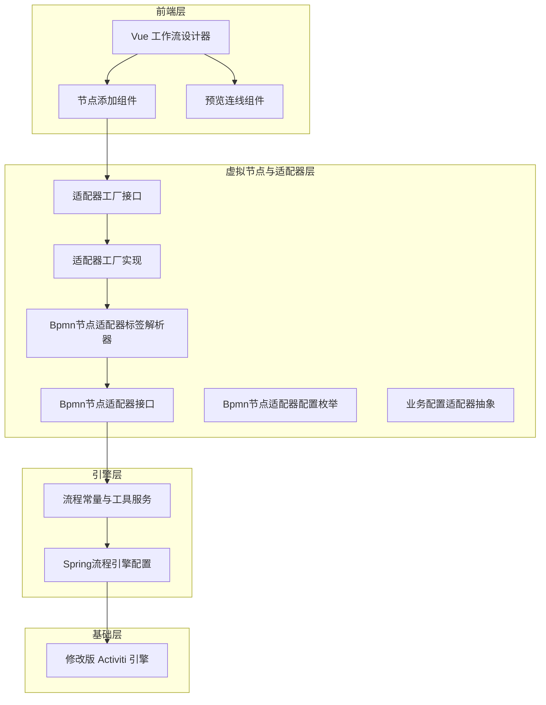
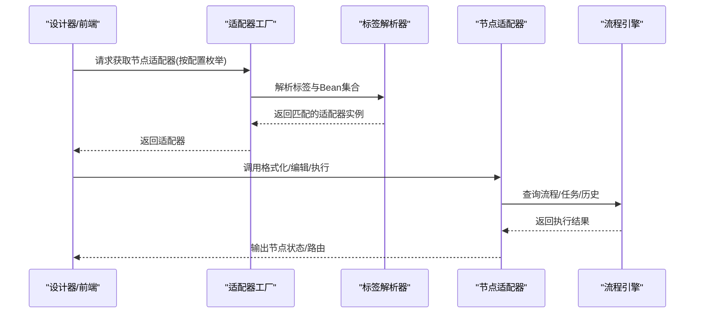
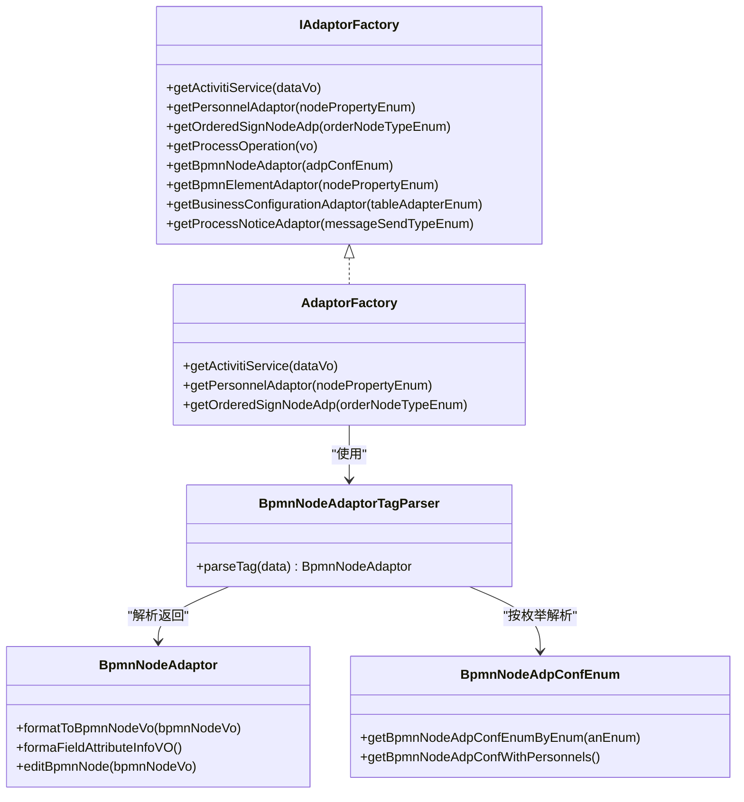
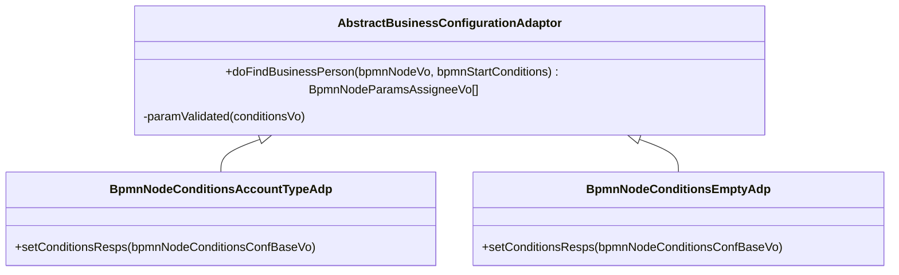
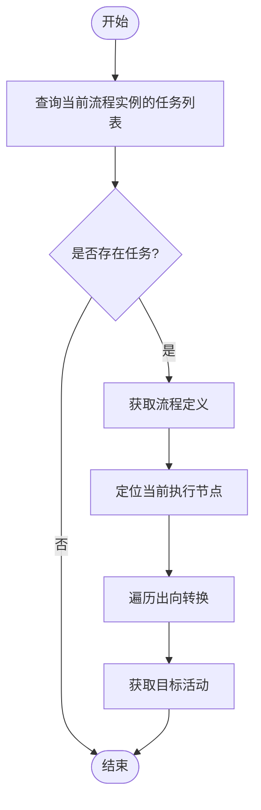
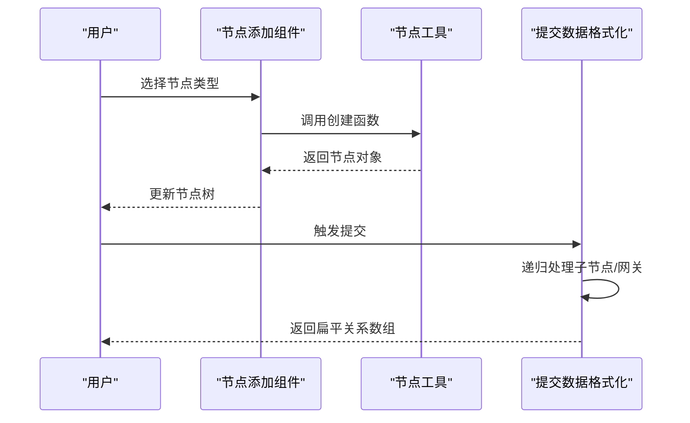
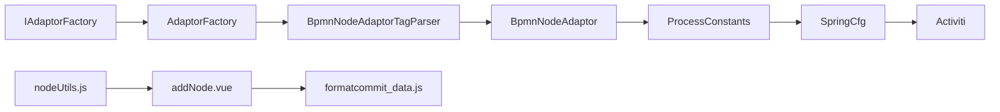

# 虚拟节点系统

<cite>
**本文引用的文件**
- [开发者指南.md](file://doc/系统介绍篇/20.开发者指南.md)
- [核心概念与术语.md](file://doc/系统介绍篇/3.核心概念和术语.md)
- [BpmnNodeAdaptor.java](file://antflow-engine/src/main/java/org/openoa/engine/bpmnconf/adp/bpmnnodeadp/BpmnNodeAdaptor.java)
- [IAdaptorFactory.java](file://antflow-engine/src/main/java/org/openoa/engine/factory/IAdaptorFactory.java)
- [AdaptorFactory.java](file://antflow-engine/src/main/java/org/openoa/engine/factory/AdaptorFactory.java)
- [BpmnNodeAdaptorTagParser.java](file://antflow-engine/src/main/java/org/openoa/engine/bpmnconf/service/tagparser/BpmnNodeAdaptorTagParser.java)
- [BpmnNodeAdpConfEnum.java](file://antflow-engine/src/main/java/org/openoa/engine/bpmnconf/constant/enus/BpmnNodeAdpConfEnum.java)
- [AbstractBusinessConfigurationAdaptor.java](file://antflow-engine/src/main/java/org/openoa/engine/bpmnconf/adp/personneladp/AbstractBusinessConfigurationAdaptor.java)
- [BpmnNodeConditionsAccountTypeAdp.java](file://antflow-engine/src/main/java/org/openoa/engine/bpmnconf/adp/conditionfilter/nodetypeconditions/BpmnNodeConditionsAccountTypeAdp.java)
- [BpmnNodeConditionsEmptyAdp.java](file://antflow-engine/src/main/java/org/openoa/engine/bpmnconf/adp/conditionfilter/nodetypeconditions/BpmnNodeConditionsEmptyAdp.java)
- [ProcessConstants.java](file://antflow-engine/src/main/java/org/openoa/engine/bpmnconf/common/ProcessConstants.java)
- [nodeUtils.js](file://antflow-vue/src/utils/antflow/nodeUtils.js)
- [addNode.vue](file://antflow-vue/src/components/Workflow/addNode.vue)
- [lineWarp.vue](file://antflow-vue/src/components/Workflow/Preview/lineWarp.vue)
- [formatcommit_data.js](file://antflow-vue/src/utils/antflow/formatcommit_data.js)
- [SpringProcessEngineConfiguration.java](file://antflow-base/src/main/java/org/activiti/spring/SpringProcessEngineConfiguration.java)
</cite>

## 目录
1. [简介](#简介)
2. [项目结构](#项目结构)
3. [核心组件](#核心组件)
4. [架构总览](#架构总览)
5. [详细组件分析](#详细组件分析)
6. [依赖分析](#依赖分析)
7. [性能考虑](#性能考虑)
8. [故障排查指南](#故障排查指南)
9. [结论](#结论)
10. [附录](#附录)

## 简介
本技术文档围绕虚拟节点系统（VNode）展开，系统性阐述其架构设计原理与实现方式，重点说明如何通过“流程逻辑与引擎实现完全分离”的思想，构建可扩展、可维护、可迁移的工作流节点体系。文档涵盖节点类型分类、节点适配器实现机制、条件评估器开发方法、生命周期管理、运行时动态节点定义以及节点间通信机制，并提供可直接参考的代码片段路径，帮助读者快速开发自定义节点类型。同时，对比传统流程引擎节点，阐明虚拟节点的优势与适用场景。

## 项目结构
AntFlow 采用多模块分层架构：基础模块提供核心接口与引擎能力；引擎模块承载虚拟节点与适配器体系；前端模块提供可视化设计器与运行时交互；启动器模块负责自动装配与集成；Web 模块提供 REST 接口与演示应用。虚拟节点系统位于引擎模块的 BPMN 配置子系统内，通过适配器模式将业务逻辑与具体流程引擎实现解耦。

**图示来源**
- [开发者指南.md:24-87](file://doc/系统介绍篇/20.开发者指南.md#L24-L87)
- [IAdaptorFactory.java:28-52](file://antflow-engine/src/main/java/org/openoa/engine/factory/IAdaptorFactory.java#L28-L52)
- [AdaptorFactory.java:14-33](file://antflow-engine/src/main/java/org/openoa/engine/factory/AdaptorFactory.java#L14-L33)
- [BpmnNodeAdaptorTagParser.java:16-29](file://antflow-engine/src/main/java/org/openoa/engine/bpmnconf/service/tagparser/BpmnNodeAdaptorTagParser.java#L16-L29)
- [BpmnNodeAdaptor.java:12-29](file://antflow-engine/src/main/java/org/openoa/engine/bpmnconf/adp/bpmnnodeadp/BpmnNodeAdaptor.java#L12-L29)
- [ProcessConstants.java:39-157](file://antflow-engine/src/main/java/org/openoa/engine/bpmnconf/common/ProcessConstants.java#L39-L157)
- [SpringProcessEngineConfiguration.java:184-201](file://antflow-base/src/main/java/org/activiti/spring/SpringProcessEngineConfiguration.java#L184-L201)

**章节来源**
- [开发者指南.md:24-87](file://doc/系统介绍篇/20.开发者指南.md#L24-L87)
- [核心概念与术语.md:1-53](file://doc/系统介绍篇/3.核心概念和术语.md#L1-L53)

## 核心组件
- 节点适配器接口：统一抽象节点行为，定义格式化、编辑等标准流程。
- 适配器工厂与标签解析器：按配置枚举动态解析并返回具体适配器实现。
- 业务配置适配器：封装业务表与字段映射的人选查找逻辑。
- 条件评估适配器：为节点提供条件列表与动态筛选能力。
- 流程常量与工具服务：提供流程实例查询、任务查询、历史任务查询等通用能力。
- 前端节点工具与组件：提供节点类型创建、网关节点配置、提交数据格式化等前端支撑。

**章节来源**
- [BpmnNodeAdaptor.java:12-29](file://antflow-engine/src/main/java/org/openoa/engine/bpmnconf/adp/bpmnnodeadp/BpmnNodeAdaptor.java#L12-L29)
- [IAdaptorFactory.java:28-52](file://antflow-engine/src/main/java/org/openoa/engine/factory/IAdaptorFactory.java#L28-L52)
- [AdaptorFactory.java:14-33](file://antflow-engine/src/main/java/org/openoa/engine/factory/AdaptorFactory.java#L14-L33)
- [BpmnNodeAdaptorTagParser.java:16-29](file://antflow-engine/src/main/java/org/openoa/engine/bpmnconf/service/tagparser/BpmnNodeAdaptorTagParser.java#L16-L29)
- [AbstractBusinessConfigurationAdaptor.java:11-26](file://antflow-engine/src/main/java/org/openoa/engine/bpmnconf/adp/personneladp/AbstractBusinessConfigurationAdaptor.java#L11-L26)
- [BpmnNodeConditionsAccountTypeAdp.java:18-39](file://antflow-engine/src/main/java/org/openoa/engine/bpmnconf/adp/conditionfilter/nodetypeconditions/BpmnNodeConditionsAccountTypeAdp.java#L18-L39)
- [ProcessConstants.java:39-157](file://antflow-engine/src/main/java/org/openoa/engine/bpmnconf/common/ProcessConstants.java#L39-L157)
- [nodeUtils.js:37-230](file://antflow-vue/src/utils/antflow/nodeUtils.js#L37-L230)
- [addNode.vue:92-103](file://antflow-vue/src/components/Workflow/addNode.vue#L92-L103)

## 架构总览
虚拟节点系统的核心在于“抽象—适配—执行”三层分离：
- 抽象层：以 BpmnNodeAdaptor、BpmnNodeAdpConfEnum 等定义节点语义与配置边界。
- 适配层：通过 IAdaptorFactory 与 BpmnNodeAdaptorTagParser 实现按需解析与装配。
- 执行层：由 ProcessConstants 提供流程与任务查询能力，最终落地到修改版 Activiti 引擎。

**图示来源**
- [IAdaptorFactory.java:28-52](file://antflow-engine/src/main/java/org/openoa/engine/factory/IAdaptorFactory.java#L28-L52)
- [BpmnNodeAdaptorTagParser.java:16-29](file://antflow-engine/src/main/java/org/openoa/engine/bpmnconf/service/tagparser/BpmnNodeAdaptorTagParser.java#L16-L29)
- [BpmnNodeAdaptor.java:12-29](file://antflow-engine/src/main/java/org/openoa/engine/bpmnconf/adp/bpmnnodeadp/BpmnNodeAdaptor.java#L12-L29)
- [ProcessConstants.java:49-83](file://antflow-engine/src/main/java/org/openoa/engine/bpmnconf/common/ProcessConstants.java#L49-L83)

## 详细组件分析

### 组件一：节点适配器接口与工厂体系
- BpmnNodeAdaptor 定义了节点格式化、字段属性信息格式化、节点编辑等标准方法，确保不同节点类型的统一调用入口。
- IAdaptorFactory 与 AdaptorFactory 提供按配置枚举解析适配器的能力，结合 BpmnNodeAdaptorTagParser 实现自动装配与按需加载。
- BpmnNodeAdpConfEnum 将节点属性与节点类型进行枚举化管理，便于工厂按配置选择合适的适配器。

**图示来源**
- [BpmnNodeAdaptor.java:12-29](file://antflow-engine/src/main/java/org/openoa/engine/bpmnconf/adp/bpmnnodeadp/BpmnNodeAdaptor.java#L12-L29)
- [IAdaptorFactory.java:28-52](file://antflow-engine/src/main/java/org/openoa/engine/factory/IAdaptorFactory.java#L28-L52)
- [AdaptorFactory.java:14-33](file://antflow-engine/src/main/java/org/openoa/engine/factory/AdaptorFactory.java#L14-L33)
- [BpmnNodeAdaptorTagParser.java:16-29](file://antflow-engine/src/main/java/org/openoa/engine/bpmnconf/service/tagparser/BpmnNodeAdaptorTagParser.java#L16-L29)
- [BpmnNodeAdpConfEnum.java:13-65](file://antflow-engine/src/main/java/org/openoa/engine/bpmnconf/constant/enus/BpmnNodeAdpConfEnum.java#L13-L65)

**章节来源**
- [BpmnNodeAdaptor.java:12-29](file://antflow-engine/src/main/java/org/openoa/engine/bpmnconf/adp/bpmnnodeadp/BpmnNodeAdaptor.java#L12-L29)
- [IAdaptorFactory.java:28-52](file://antflow-engine/src/main/java/org/openoa/engine/factory/IAdaptorFactory.java#L28-L52)
- [AdaptorFactory.java:14-33](file://antflow-engine/src/main/java/org/openoa/engine/factory/AdaptorFactory.java#L14-L33)
- [BpmnNodeAdaptorTagParser.java:16-29](file://antflow-engine/src/main/java/org/openoa/engine/bpmnconf/service/tagparser/BpmnNodeAdaptorTagParser.java#L16-L29)
- [BpmnNodeAdpConfEnum.java:13-65](file://antflow-engine/src/main/java/org/openoa/engine/bpmnconf/constant/enus/BpmnNodeAdpConfEnum.java#L13-L65)

### 组件二：业务配置与条件评估适配器
- AbstractBusinessConfigurationAdaptor 抽象出“业务表字段找人”的统一入口，要求实现 doFindBusinessPerson 方法，并内置参数校验。
- BpmnNodeConditionsAccountTypeAdp 与 BpmnNodeConditionsEmptyAdp 展示了条件评估适配器的开发范式：通过 setConditionsResps 为节点注入条件列表或占位响应，便于前端渲染与运行时判断。

**图示来源**
- [AbstractBusinessConfigurationAdaptor.java:11-26](file://antflow-engine/src/main/java/org/openoa/engine/bpmnconf/adp/personneladp/AbstractBusinessConfigurationAdaptor.java#L11-L26)
- [BpmnNodeConditionsAccountTypeAdp.java:18-39](file://antflow-engine/src/main/java/org/openoa/engine/bpmnconf/adp/conditionfilter/nodetypeconditions/BpmnNodeConditionsAccountTypeAdp.java#L18-L39)
- [BpmnNodeConditionsEmptyAdp.java:18-22](file://antflow-engine/src/main/java/org/openoa/engine/bpmnconf/adp/conditionfilter/nodetypeconditions/BpmnNodeConditionsEmptyAdp.java#L18-L22)

**章节来源**
- [AbstractBusinessConfigurationAdaptor.java:11-26](file://antflow-engine/src/main/java/org/openoa/engine/bpmnconf/adp/personneladp/AbstractBusinessConfigurationAdaptor.java#L11-L26)
- [BpmnNodeConditionsAccountTypeAdp.java:18-39](file://antflow-engine/src/main/java/org/openoa/engine/bpmnconf/adp/conditionfilter/nodetypeconditions/BpmnNodeConditionsAccountTypeAdp.java#L18-L39)
- [BpmnNodeConditionsEmptyAdp.java:18-22](file://antflow-engine/src/main/java/org/openoa/engine/bpmnconf/adp/conditionfilter/nodetypeconditions/BpmnNodeConditionsEmptyAdp.java#L18-L22)

### 组件三：流程常量与工具服务
- ProcessConstants 提供获取下一节点活动、根据业务编号查询任务、按任务键查询任务列表、查询上一审批任务等能力，是运行时节点流转与状态查询的关键支撑。

**图示来源**
- [ProcessConstants.java:49-83](file://antflow-engine/src/main/java/org/openoa/engine/bpmnconf/common/ProcessConstants.java#L49-L83)

**章节来源**
- [ProcessConstants.java:39-157](file://antflow-engine/src/main/java/org/openoa/engine/bpmnconf/common/ProcessConstants.java#L39-L157)

### 组件四：前端节点工具与运行时数据
- nodeUtils.js 提供节点类型创建、网关节点初始化、并行节点配置等工具函数，支撑设计器侧节点结构生成。
- addNode.vue 提供节点类型选择与创建回调，联动 nodeUtils.js 完成节点树构建。
- lineWarp.vue 在预览阶段高亮当前节点，辅助用户定位与交互。
- formatcommit_data.js 负责将树形节点结构转换为提交所需的扁平关系数组，并处理网关节点的 nodeTo 数据。

**图示来源**
- [addNode.vue:92-103](file://antflow-vue/src/components/Workflow/addNode.vue#L92-L103)
- [nodeUtils.js:37-230](file://antflow-vue/src/utils/antflow/nodeUtils.js#L37-L230)
- [lineWarp.vue:56-75](file://antflow-vue/src/components/Workflow/Preview/lineWarp.vue#L56-L75)
- [formatcommit_data.js:37-78](file://antflow-vue/src/utils/antflow/formatcommit_data.js#L37-L78)

**章节来源**
- [nodeUtils.js:37-230](file://antflow-vue/src/utils/antflow/nodeUtils.js#L37-L230)
- [addNode.vue:92-103](file://antflow-vue/src/components/Workflow/addNode.vue#L92-L103)
- [lineWarp.vue:56-75](file://antflow-vue/src/components/Workflow/Preview/lineWarp.vue#L56-L75)
- [formatcommit_data.js:37-78](file://antflow-vue/src/utils/antflow/formatcommit_data.js#L37-L78)

## 依赖分析
- 适配器工厂与标签解析器：IAdaptorFactory 与 AdaptorFactory 通过注解与标签解析器实现自动装配，避免硬编码依赖，提升扩展性。
- 节点类型与属性枚举：BpmnNodeAdpConfEnum 将节点属性与类型枚举化，使工厂按配置精准选择适配器。
- 前后端协作：前端通过 nodeUtils.js 与 addNode.vue 生成节点树，formatcommit_data.js 将树结构转换为后端可接受的关系数组，保证前后端数据契约一致。

**图示来源**
- [IAdaptorFactory.java:28-52](file://antflow-engine/src/main/java/org/openoa/engine/factory/IAdaptorFactory.java#L28-L52)
- [AdaptorFactory.java:14-33](file://antflow-engine/src/main/java/org/openoa/engine/factory/AdaptorFactory.java#L14-L33)
- [BpmnNodeAdaptorTagParser.java:16-29](file://antflow-engine/src/main/java/org/openoa/engine/bpmnconf/service/tagparser/BpmnNodeAdaptorTagParser.java#L16-L29)
- [BpmnNodeAdaptor.java:12-29](file://antflow-engine/src/main/java/org/openoa/engine/bpmnconf/adp/bpmnnodeadp/BpmnNodeAdaptor.java#L12-L29)
- [ProcessConstants.java:39-157](file://antflow-engine/src/main/java/org/openoa/engine/bpmnconf/common/ProcessConstants.java#L39-L157)
- [SpringProcessEngineConfiguration.java:184-201](file://antflow-base/src/main/java/org/activiti/spring/SpringProcessEngineConfiguration.java#L184-L201)
- [nodeUtils.js:37-230](file://antflow-vue/src/utils/antflow/nodeUtils.js#L37-L230)
- [addNode.vue:92-103](file://antflow-vue/src/components/Workflow/addNode.vue#L92-L103)
- [formatcommit_data.js:37-78](file://antflow-vue/src/utils/antflow/formatcommit_data.js#L37-L78)

**章节来源**
- [IAdaptorFactory.java:28-52](file://antflow-engine/src/main/java/org/openoa/engine/factory/IAdaptorFactory.java#L28-L52)
- [AdaptorFactory.java:14-33](file://antflow-engine/src/main/java/org/openoa/engine/factory/AdaptorFactory.java#L14-L33)
- [BpmnNodeAdaptorTagParser.java:16-29](file://antflow-engine/src/main/java/org/openoa/engine/bpmnconf/service/tagparser/BpmnNodeAdaptorTagParser.java#L16-L29)
- [BpmnNodeAdaptor.java:12-29](file://antflow-engine/src/main/java/org/openoa/engine/bpmnconf/adp/bpmnnodeadp/BpmnNodeAdaptor.java#L12-L29)
- [ProcessConstants.java:39-157](file://antflow-engine/src/main/java/org/openoa/engine/bpmnconf/common/ProcessConstants.java#L39-L157)
- [SpringProcessEngineConfiguration.java:184-201](file://antflow-base/src/main/java/org/activiti/spring/SpringProcessEngineConfiguration.java#L184-L201)
- [nodeUtils.js:37-230](file://antflow-vue/src/utils/antflow/nodeUtils.js#L37-L230)
- [addNode.vue:92-103](file://antflow-vue/src/components/Workflow/addNode.vue#L92-L103)
- [formatcommit_data.js:37-78](file://antflow-vue/src/utils/antflow/formatcommit_data.js#L37-L78)

## 性能考虑
- 适配器按需解析：通过标签解析器与工厂组合，避免一次性加载所有适配器，降低启动与内存开销。
- 运行时查询优化：ProcessConstants 对流程与任务查询进行封装，建议在高频查询场景下结合缓存策略与分页查询，减少引擎压力。
- 前端数据转换：formatcommit_data.js 在提交前进行树到数组的转换，建议在大规模节点场景下进行批量处理与去重，避免重复计算。

## 故障排查指南
- 适配器未找到：检查 BpmnNodeAdaptorTagParser 是否正确扫描到实现类，确认 BpmnNodeAdaptor 的 isSupportBusinessObject 返回值与配置枚举一致。
- 条件评估异常：核对 AbstractBusinessConfigurationAdaptor 的参数校验逻辑与业务条件对象是否为空，确保 setConditionsResps 正确填充条件列表。
- 任务查询失败：确认 ProcessConstants 的任务查询方法传入的流程实例 ID 与任务键是否有效，检查历史任务查询逻辑中的过滤条件。
- 前端节点渲染异常：检查 nodeUtils.js 的节点创建函数与 addNode.vue 的类型映射，确保网关节点的 isDynamicCondition、isParallel 字段设置正确。

**章节来源**
- [BpmnNodeAdaptorTagParser.java:16-29](file://antflow-engine/src/main/java/org/openoa/engine/bpmnconf/service/tagparser/BpmnNodeAdaptorTagParser.java#L16-L29)
- [AbstractBusinessConfigurationAdaptor.java:11-26](file://antflow-engine/src/main/java/org/openoa/engine/bpmnconf/adp/personneladp/AbstractBusinessConfigurationAdaptor.java#L11-L26)
- [ProcessConstants.java:111-123](file://antflow-engine/src/main/java/org/openoa/engine/bpmnconf/common/ProcessConstants.java#L111-L123)
- [nodeUtils.js:92-139](file://antflow-vue/src/utils/antflow/nodeUtils.js#L92-L139)
- [addNode.vue:92-103](file://antflow-vue/src/components/Workflow/addNode.vue#L92-L103)

## 结论
虚拟节点系统通过“抽象—适配—执行”的分层设计，实现了流程逻辑与引擎实现的完全分离，显著提升了系统的可扩展性与可维护性。借助适配器工厂与标签解析器，系统能够灵活地按配置选择节点适配器；通过业务配置与条件评估适配器，将复杂的人选与条件逻辑从业务代码中抽离；配合前端工具链，形成从前端设计到后端执行的完整闭环。相较传统流程引擎节点，虚拟节点更易迁移、更易扩展、更易维护，适用于需要频繁变更节点类型与规则的企业级工作流平台。

## 附录
- 开发自定义节点类型的步骤建议
  - 定义节点属性与类型枚举：在 BpmnNodeAdpConfEnum 中注册新的节点属性或类型。
  - 实现节点适配器：实现 BpmnNodeAdaptor 接口，覆盖格式化与编辑方法。
  - 注册条件评估适配器：继承 AbstractBusinessConfigurationAdaptor 或相关抽象类，实现 doFindBusinessPerson 或 setConditionsResps。
  - 前端节点创建：在 nodeUtils.js 中增加节点创建函数，在 addNode.vue 中映射类型。
  - 提交流程数据：使用 formatcommit_data.js 将节点树转换为提交数组，确保网关节点的 nodeTo 正确设置。
  - 运行时查询：在 ProcessConstants 中补充必要的查询方法，保障节点流转与状态查询。

**章节来源**
- [BpmnNodeAdpConfEnum.java:13-65](file://antflow-engine/src/main/java/org/openoa/engine/bpmnconf/constant/enus/BpmnNodeAdpConfEnum.java#L13-L65)
- [BpmnNodeAdaptor.java:12-29](file://antflow-engine/src/main/java/org/openoa/engine/bpmnconf/adp/bpmnnodeadp/BpmnNodeAdaptor.java#L12-L29)
- [AbstractBusinessConfigurationAdaptor.java:11-26](file://antflow-engine/src/main/java/org/openoa/engine/bpmnconf/adp/personneladp/AbstractBusinessConfigurationAdaptor.java#L11-L26)
- [nodeUtils.js:37-230](file://antflow-vue/src/utils/antflow/nodeUtils.js#L37-L230)
- [addNode.vue:92-103](file://antflow-vue/src/components/Workflow/addNode.vue#L92-L103)
- [formatcommit_data.js:37-78](file://antflow-vue/src/utils/antflow/formatcommit_data.js#L37-L78)
- [ProcessConstants.java:39-157](file://antflow-engine/src/main/java/org/openoa/engine/bpmnconf/common/ProcessConstants.java#L39-L157)