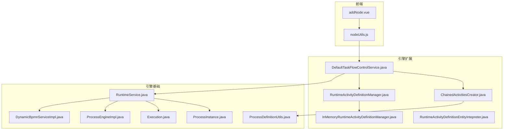
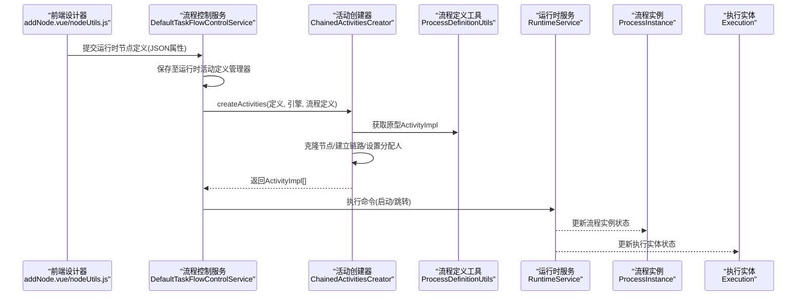
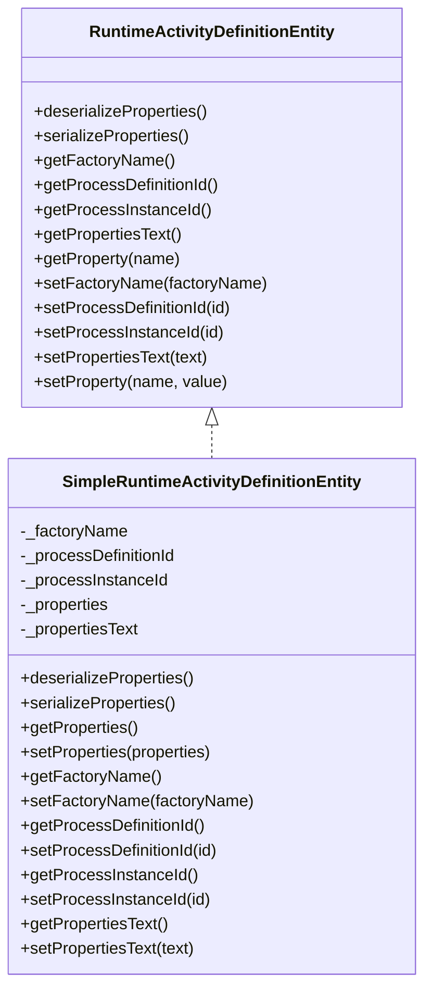
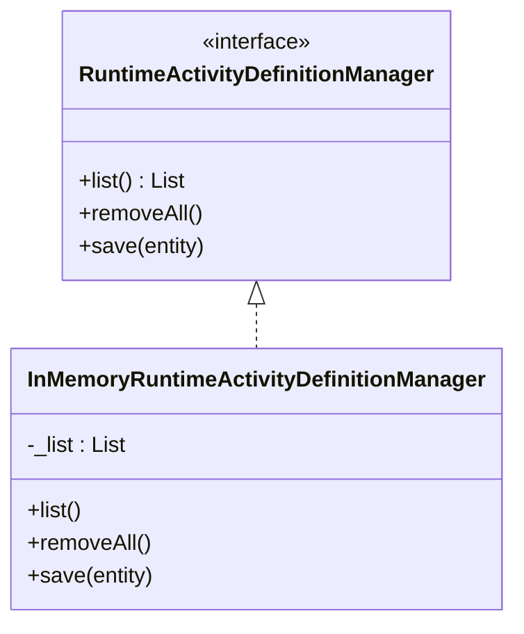
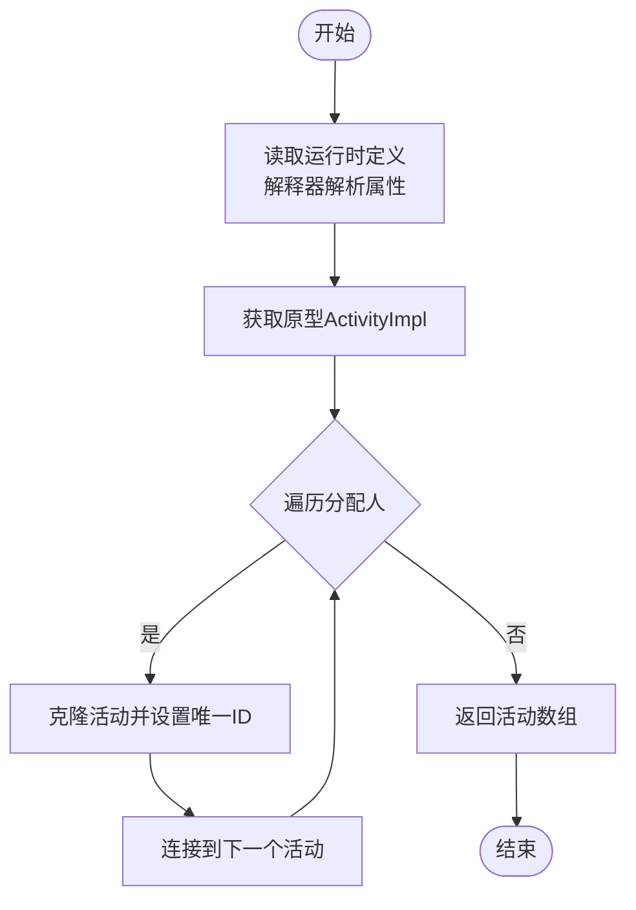
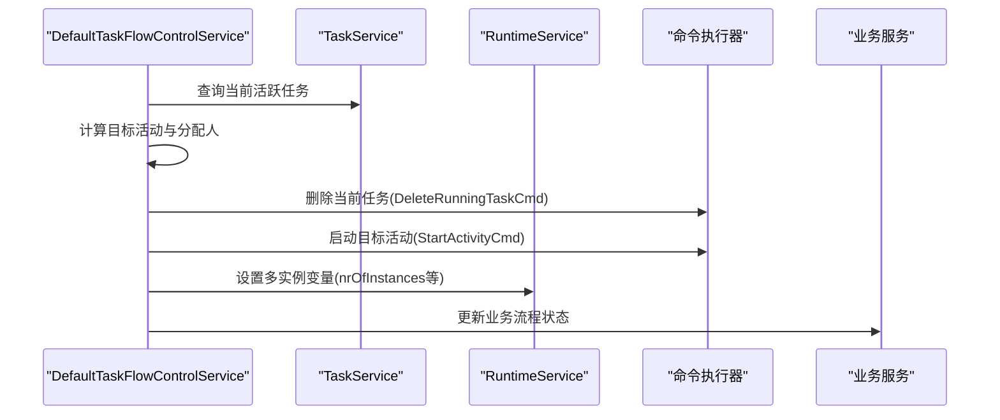
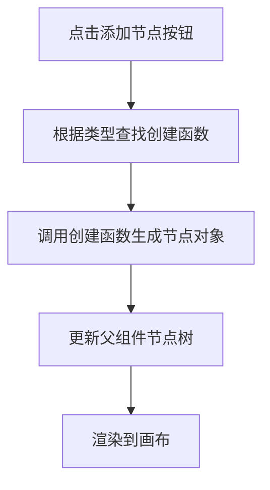
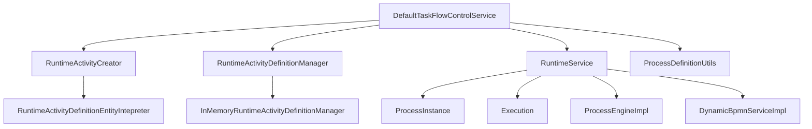

# 运行时节点定义

<cite>
**本文引用的文件**
- [RuntimeActivityDefinitionManager.java](file://antflow-engine/src/main/java/org/openoa/engine/bpmnconf/service/flowcontrol/RuntimeActivityDefinitionManager.java)
- [RuntimeActivityCreator.java](file://antflow-engine/src/main/java/org/openoa/engine/bpmnconf/service/flowcontrol/RuntimeActivityCreator.java)
- [InMemoryRuntimeActivityDefinitionManager.java](file://antflow-engine/src/main/java/org/openoa/engine/bpmnconf/service/flowcontrol/ext/InMemoryRuntimeActivityDefinitionManager.java)
- [ChainedActivitiesCreator.java](file://antflow-engine/src/main/java/org/openoa/engine/bpmnconf/service/flowcontrol/ChainedActivitiesCreator.java)
- [DefaultTaskFlowControlService.java](file://antflow-engine/src/main/java/org/openoa/engine/bpmnconf/service/flowcontrol/DefaultTaskFlowControlService.java)
- [RuntimeActivityDefinitionEntity.java](file://antflow-base/src/main/java/org/openoa/base/entity/RuntimeActivityDefinitionEntity.java)
- [SimpleRuntimeActivityDefinitionEntity.java](file://antflow-base/src/main/java/org/openoa/base/entity/SimpleRuntimeActivityDefinitionEntity.java)
- [RuntimeActivityDefinitionEntityIntepreter.java](file://antflow-base/src/main/java/org/openoa/base/service/RuntimeActivityDefinitionEntityIntepreter.java)
- [RuntimeService.java](file://antflow-base/src/main/java/org/activiti/engine/RuntimeService.java)
- [ProcessDefinitionUtils.java](file://antflow-base/src/main/java/org/openoa/base/util/ProcessDefinitionUtils.java)
- [ProcessEngineImpl.java](file://antflow-base/src/main/java/org/activiti/engine/impl/ProcessEngineImpl.java)
- [DynamicBpmnServiceImpl.java](file://antflow-base/src/main/java/org/activiti/engine/impl/DynamicBpmnServiceImpl.java)
- [ProcessInstance.java](file://antflow-base/src/main/java/org/activiti/engine/runtime/ProcessInstance.java)
- [Execution.java](file://antflow-base/src/main/java/org/activiti/engine/runtime/Execution.java)
- [addNode.vue](file://antflow-vue/src/components/Workflow/addNode.vue)
- [nodeUtils.js](file://antflow-vue/src/utils/antflow/nodeUtils.js)
</cite>

## 目录
1. [简介](#简介)
2. [项目结构](#项目结构)
3. [核心组件](#核心组件)
4. [架构总览](#架构总览)
5. [详细组件分析](#详细组件分析)
6. [依赖分析](#依赖分析)
7. [性能考虑](#性能考虑)
8. [故障排查指南](#故障排查指南)
9. [结论](#结论)
10. [附录](#附录)

## 简介
本技术文档围绕“运行时节点定义”展开，系统性阐述虚拟节点系统中运行时动态节点定义的实现机制。重点覆盖以下方面：
- 在流程执行过程中如何动态创建和配置节点
- 节点定义的加载机制、动态生成算法、节点实例化过程
- 运行时节点与静态节点的区别
- 节点缓存策略与内存管理机制
- 最佳实践与性能优化建议，并给出可直接定位到源码路径的实现示例与配置方法

## 项目结构
本项目采用多模块分层组织，与运行时节点定义相关的关键模块如下：
- antflow-base：Activiti引擎基础能力与实体定义，包含运行时服务、流程实例、执行实体、动态BPMN服务等
- antflow-engine：业务流程引擎扩展，包含运行时节点定义接口、动态节点创建器、默认流程控制服务等
- antflow-vue：前端流程设计器与节点工具，负责节点类型选择与动态网关/条件网关的可视化配置

**图示来源**
- [DefaultTaskFlowControlService.java:1-200](file://antflow-engine/src/main/java/org/openoa/engine/bpmnconf/service/flowcontrol/DefaultTaskFlowControlService.java#L1-L200)
- [ChainedActivitiesCreator.java:1-60](file://antflow-engine/src/main/java/org/openoa/engine/bpmnconf/service/flowcontrol/ChainedActivitiesCreator.java#L1-L60)
- [RuntimeActivityDefinitionManager.java:1-24](file://antflow-engine/src/main/java/org/openoa/engine/bpmnconf/service/flowcontrol/RuntimeActivityDefinitionManager.java#L1-L24)
- [InMemoryRuntimeActivityDefinitionManager.java:1-34](file://antflow-engine/src/main/java/org/openoa/engine/bpmnconf/service/flowcontrol/ext/InMemoryRuntimeActivityDefinitionManager.java#L1-L34)
- [RuntimeActivityDefinitionEntityIntepreter.java:1-61](file://antflow-base/src/main/java/org/openoa/base/service/RuntimeActivityDefinitionEntityIntepreter.java#L1-L61)
- [RuntimeService.java:1-200](file://antflow-base/src/main/java/org/activiti/engine/RuntimeService.java#L1-L200)
- [ProcessInstance.java:1-47](file://antflow-base/src/main/java/org/activiti/engine/runtime/ProcessInstance.java#L1-L47)
- [Execution.java:1-47](file://antflow-base/src/main/java/org/activiti/engine/runtime/Execution.java#L1-L47)
- [ProcessDefinitionUtils.java](file://antflow-base/src/main/java/org/openoa/base/util/ProcessDefinitionUtils.java)
- [ProcessEngineImpl.java:61-80](file://antflow-base/src/main/java/org/activiti/engine/impl/ProcessEngineImpl.java#L61-L80)
- [DynamicBpmnServiceImpl.java:33-64](file://antflow-base/src/main/java/org/activiti/engine/impl/DynamicBpmnServiceImpl.java#L33-L64)
- [addNode.vue:92-145](file://antflow-vue/src/components/Workflow/addNode.vue#L92-L145)
- [nodeUtils.js:92-139](file://antflow-vue/src/utils/antflow/nodeUtils.js#L92-L139)

**章节来源**
- [DefaultTaskFlowControlService.java:1-200](file://antflow-engine/src/main/java/org/openoa/engine/bpmnconf/service/flowcontrol/DefaultTaskFlowControlService.java#L1-L200)
- [RuntimeService.java:1-200](file://antflow-base/src/main/java/org/activiti/engine/RuntimeService.java#L1-L200)

## 核心组件
- 运行时活动定义接口与实体
  - 接口定义了运行时活动定义的属性访问、序列化/反序列化、工厂名与关联ID设置等能力
  - 实体提供简单实现，基于JSON文本存储属性，并通过Jackson完成序列化/反序列化
- 运行时活动定义管理器
  - 定义运行时活动定义的增删查接口；提供内存实现用于演示与测试
- 运行时活动创建器
  - 定义动态创建ActivityImpl数组的统一入口；具体实现负责克隆原型节点、建立链式连接、设置分配人等
- 默认流程控制服务
  - 封装流程跳转、前进一步/后退一步、变量设置等运行时控制逻辑；协调运行时活动创建器与引擎命令执行

**章节来源**
- [RuntimeActivityDefinitionEntity.java:1-65](file://antflow-base/src/main/java/org/openoa/base/entity/RuntimeActivityDefinitionEntity.java#L1-L65)
- [SimpleRuntimeActivityDefinitionEntity.java:1-60](file://antflow-base/src/main/java/org/openoa/base/entity/SimpleRuntimeActivityDefinitionEntity.java#L1-L60)
- [RuntimeActivityDefinitionManager.java:1-24](file://antflow-engine/src/main/java/org/openoa/engine/bpmnconf/service/flowcontrol/RuntimeActivityDefinitionManager.java#L1-L24)
- [InMemoryRuntimeActivityDefinitionManager.java:1-34](file://antflow-engine/src/main/java/org/openoa/engine/bpmnconf/service/flowcontrol/ext/InMemoryRuntimeActivityDefinitionManager.java#L1-L34)
- [RuntimeActivityCreator.java:1-12](file://antflow-engine/src/main/java/org/openoa/engine/bpmnconf/service/flowcontrol/RuntimeActivityCreator.java#L1-L12)
- [ChainedActivitiesCreator.java:1-60](file://antflow-engine/src/main/java/org/openoa/engine/bpmnconf/service/flowcontrol/ChainedActivitiesCreator.java#L1-L60)
- [DefaultTaskFlowControlService.java:1-200](file://antflow-engine/src/main/java/org/openoa/engine/bpmnconf/service/flowcontrol/DefaultTaskFlowControlService.java#L1-L200)

## 架构总览
运行时节点定义的总体流程：
- 前端通过节点工具生成运行时节点定义（JSON属性），提交给后端
- 后端将定义保存到运行时活动定义管理器（内存或持久化）
- 流程控制服务在需要时读取定义，调用活动创建器动态克隆原型节点、建立链路、设置变量
- 引擎命令执行器执行节点启动/跳转等操作，驱动流程实例前进

**图示来源**
- [addNode.vue:92-145](file://antflow-vue/src/components/Workflow/addNode.vue#L92-L145)
- [nodeUtils.js:92-139](file://antflow-vue/src/utils/antflow/nodeUtils.js#L92-L139)
- [DefaultTaskFlowControlService.java:1-200](file://antflow-engine/src/main/java/org/openoa/engine/bpmnconf/service/flowcontrol/DefaultTaskFlowControlService.java#L1-L200)
- [ChainedActivitiesCreator.java:1-60](file://antflow-engine/src/main/java/org/openoa/engine/bpmnconf/service/flowcontrol/ChainedActivitiesCreator.java#L1-L60)
- [ProcessDefinitionUtils.java](file://antflow-base/src/main/java/org/openoa/base/util/ProcessDefinitionUtils.java)
- [RuntimeService.java:1-200](file://antflow-base/src/main/java/org/activiti/engine/RuntimeService.java#L1-L200)
- [ProcessInstance.java:1-47](file://antflow-base/src/main/java/org/activiti/engine/runtime/ProcessInstance.java#L1-L47)
- [Execution.java:1-47](file://antflow-base/src/main/java/org/activiti/engine/runtime/Execution.java#L1-L47)

## 详细组件分析

### 组件一：运行时活动定义接口与实体
- 接口职责
  - 统一访问运行时活动定义的工厂名、流程定义ID、流程实例ID、属性文本与属性映射
  - 提供序列化/反序列化能力，便于以JSON形式存储复杂属性
- 实体实现
  - 使用Jackson将属性Map与JSON文本互转
  - 提供setProperty/getProperty等便捷方法，配合解释器使用

**图示来源**
- [RuntimeActivityDefinitionEntity.java:1-65](file://antflow-base/src/main/java/org/openoa/base/entity/RuntimeActivityDefinitionEntity.java#L1-L65)
- [SimpleRuntimeActivityDefinitionEntity.java:1-60](file://antflow-base/src/main/java/org/openoa/base/entity/SimpleRuntimeActivityDefinitionEntity.java#L1-L60)

**章节来源**
- [RuntimeActivityDefinitionEntity.java:1-65](file://antflow-base/src/main/java/org/openoa/base/entity/RuntimeActivityDefinitionEntity.java#L1-L65)
- [SimpleRuntimeActivityDefinitionEntity.java:1-60](file://antflow-base/src/main/java/org/openoa/base/entity/SimpleRuntimeActivityDefinitionEntity.java#L1-L60)

### 组件二：运行时活动定义管理器
- 接口职责
  - list/removeAll/save：提供运行时活动定义的查询、清空与新增能力
- 内存实现
  - 基于线程安全的列表存储，适合演示与小规模场景

**图示来源**
- [RuntimeActivityDefinitionManager.java:1-24](file://antflow-engine/src/main/java/org/openoa/engine/bpmnconf/service/flowcontrol/RuntimeActivityDefinitionManager.java#L1-L24)
- [InMemoryRuntimeActivityDefinitionManager.java:1-34](file://antflow-engine/src/main/java/org/openoa/engine/bpmnconf/service/flowcontrol/ext/InMemoryRuntimeActivityDefinitionManager.java#L1-L34)

**章节来源**
- [RuntimeActivityDefinitionManager.java:1-24](file://antflow-engine/src/main/java/org/openoa/engine/bpmnconf/service/flowcontrol/RuntimeActivityDefinitionManager.java#L1-L24)
- [InMemoryRuntimeActivityDefinitionManager.java:1-34](file://antflow-engine/src/main/java/org/openoa/engine/bpmnconf/service/flowcontrol/ext/InMemoryRuntimeActivityDefinitionManager.java#L1-L34)

### 组件三：运行时活动创建器（以链式活动为例）
- 职责
  - 依据运行时活动定义，动态克隆原型活动、建立链式连接、设置唯一活动ID与分配人
- 关键步骤
  - 解释器读取定义中的原型活动ID、下一个活动ID、分配人列表、克隆活动ID列表
  - 从流程定义中获取原型ActivityImpl，逐个克隆并设置唯一ID
  - 将克隆后的活动按顺序连接到下一个活动

**图示来源**
- [ChainedActivitiesCreator.java:1-60](file://antflow-engine/src/main/java/org/openoa/engine/bpmnconf/service/flowcontrol/ChainedActivitiesCreator.java#L1-L60)
- [RuntimeActivityDefinitionEntityIntepreter.java:1-61](file://antflow-base/src/main/java/org/openoa/base/service/RuntimeActivityDefinitionEntityIntepreter.java#L1-L61)
- [ProcessDefinitionUtils.java](file://antflow-base/src/main/java/org/openoa/base/util/ProcessDefinitionUtils.java)

**章节来源**
- [ChainedActivitiesCreator.java:1-60](file://antflow-engine/src/main/java/org/openoa/engine/bpmnconf/service/flowcontrol/ChainedActivitiesCreator.java#L1-L60)
- [RuntimeActivityDefinitionEntityIntepreter.java:1-61](file://antflow-base/src/main/java/org/openoa/base/service/RuntimeActivityDefinitionEntityIntepreter.java#L1-L61)

### 组件四：默认流程控制服务
- 职责
  - 封装流程跳转、前进一步/后退一步、变量设置等运行时控制
  - 通过命令执行器与引擎交互，驱动流程实例状态变更
- 关键流程
  - 获取当前任务集合
  - 计算目标活动ID与分配人列表
  - 执行删除当前任务、启动新活动、设置多实例变量等命令

**图示来源**
- [DefaultTaskFlowControlService.java:1-200](file://antflow-engine/src/main/java/org/openoa/engine/bpmnconf/service/flowcontrol/DefaultTaskFlowControlService.java#L1-L200)
- [RuntimeService.java:1-200](file://antflow-base/src/main/java/org/activiti/engine/RuntimeService.java#L1-L200)

**章节来源**
- [DefaultTaskFlowControlService.java:1-200](file://antflow-engine/src/main/java/org/openoa/engine/bpmnconf/service/flowcontrol/DefaultTaskFlowControlService.java#L1-L200)
- [RuntimeService.java:1-200](file://antflow-base/src/main/java/org/activiti/engine/RuntimeService.java#L1-L200)

### 组件五：前端节点定义与动态网关
- 前端节点工具
  - 提供多种节点类型创建函数，包括普通网关、动态条件网关、条件并行网关等
  - 通过映射表根据类型选择对应创建函数，生成节点对象并回传给父组件
- 动态网关配置
  - 通过属性标记isDynamicCondition/isParallel区分动态条件与条件并行网关
  - 为每个网关预置若干条件分支，便于后续运行时动态扩展

**图示来源**
- [addNode.vue:92-145](file://antflow-vue/src/components/Workflow/addNode.vue#L92-L145)
- [nodeUtils.js:92-139](file://antflow-vue/src/utils/antflow/nodeUtils.js#L92-L139)

**章节来源**
- [addNode.vue:92-145](file://antflow-vue/src/components/Workflow/addNode.vue#L92-L145)
- [nodeUtils.js:92-139](file://antflow-vue/src/utils/antflow/nodeUtils.js#L92-L139)

## 依赖分析
- 组件耦合
  - DefaultTaskFlowControlService 依赖 RuntimeActivityCreator、RuntimeActivityDefinitionManager、RuntimeService、ProcessDefinitionUtils
  - ChainedActivitiesCreator 依赖 RuntimeActivityDefinitionEntityIntepreter、ProcessDefinitionUtils
  - RuntimeActivityDefinitionManager 与其实现之间为接口与实现的松耦合
- 外部依赖
  - 引擎基础服务：RuntimeService、ProcessInstance、Execution、ProcessEngineImpl、DynamicBpmnServiceImpl
  - 前端：addNode.vue 与 nodeUtils.js 作为运行时节点定义的输入来源

**图示来源**
- [DefaultTaskFlowControlService.java:1-200](file://antflow-engine/src/main/java/org/openoa/engine/bpmnconf/service/flowcontrol/DefaultTaskFlowControlService.java#L1-L200)
- [RuntimeActivityCreator.java:1-12](file://antflow-engine/src/main/java/org/openoa/engine/bpmnconf/service/flowcontrol/RuntimeActivityCreator.java#L1-L12)
- [RuntimeActivityDefinitionManager.java:1-24](file://antflow-engine/src/main/java/org/openoa/engine/bpmnconf/service/flowcontrol/RuntimeActivityDefinitionManager.java#L1-L24)
- [InMemoryRuntimeActivityDefinitionManager.java:1-34](file://antflow-engine/src/main/java/org/openoa/engine/bpmnconf/service/flowcontrol/ext/InMemoryRuntimeActivityDefinitionManager.java#L1-L34)
- [RuntimeActivityDefinitionEntityIntepreter.java:1-61](file://antflow-base/src/main/java/org/openoa/base/service/RuntimeActivityDefinitionEntityIntepreter.java#L1-L61)
- [RuntimeService.java:1-200](file://antflow-base/src/main/java/org/activiti/engine/RuntimeService.java#L1-L200)
- [ProcessInstance.java:1-47](file://antflow-base/src/main/java/org/activiti/engine/runtime/ProcessInstance.java#L1-L47)
- [Execution.java:1-47](file://antflow-base/src/main/java/org/activiti/engine/runtime/Execution.java#L1-L47)
- [ProcessEngineImpl.java:61-80](file://antflow-base/src/main/java/org/activiti/engine/impl/ProcessEngineImpl.java#L61-L80)
- [DynamicBpmnServiceImpl.java:33-64](file://antflow-base/src/main/java/org/activiti/engine/impl/DynamicBpmnServiceImpl.java#L33-L64)

**章节来源**
- [DefaultTaskFlowControlService.java:1-200](file://antflow-engine/src/main/java/org/openoa/engine/bpmnconf/service/flowcontrol/DefaultTaskFlowControlService.java#L1-L200)
- [RuntimeActivityCreator.java:1-12](file://antflow-engine/src/main/java/org/openoa/engine/bpmnconf/service/flowcontrol/RuntimeActivityCreator.java#L1-L12)
- [RuntimeActivityDefinitionManager.java:1-24](file://antflow-engine/src/main/java/org/openoa/engine/bpmnconf/service/flowcontrol/RuntimeActivityDefinitionManager.java#L1-L24)
- [InMemoryRuntimeActivityDefinitionManager.java:1-34](file://antflow-engine/src/main/java/org/openoa/engine/bpmnconf/service/flowcontrol/ext/InMemoryRuntimeActivityDefinitionManager.java#L1-L34)
- [RuntimeActivityDefinitionEntityIntepreter.java:1-61](file://antflow-base/src/main/java/org/openoa/base/service/RuntimeActivityDefinitionEntityIntepreter.java#L1-L61)
- [RuntimeService.java:1-200](file://antflow-base/src/main/java/org/activiti/engine/RuntimeService.java#L1-L200)
- [ProcessInstance.java:1-47](file://antflow-base/src/main/java/org/activiti/engine/runtime/ProcessInstance.java#L1-L47)
- [Execution.java:1-47](file://antflow-base/src/main/java/org/activiti/engine/runtime/Execution.java#L1-L47)
- [ProcessEngineImpl.java:61-80](file://antflow-base/src/main/java/org/activiti/engine/impl/ProcessEngineImpl.java#L61-L80)
- [DynamicBpmnServiceImpl.java:33-64](file://antflow-base/src/main/java/org/activiti/engine/impl/DynamicBpmnServiceImpl.java#L33-L64)

## 性能考虑
- 节点克隆与链式连接
  - 在大规模并发场景下，避免重复克隆相同原型节点；可通过缓存原型ActivityImpl与唯一ID生成策略降低开销
- 属性序列化/反序列化
  - JSON文本与Map互转应尽量批量处理，减少频繁IO；对热点属性可采用更高效的数据结构
- 命令执行与事务
  - 将多个命令合并为一次事务提交，减少引擎上下文切换次数
- 缓存策略
  - 对流程定义与活动定义进行短期缓存，结合版本号或时间戳失效策略
- 内存管理
  - 清理不再使用的运行时活动定义；在流程结束后及时释放相关引用，防止内存泄漏

[本节为通用性能指导，不直接分析具体文件]

## 故障排查指南
- 运行时节点未生效
  - 检查运行时活动定义是否正确保存至管理器；确认解释器读取的属性键是否存在
  - 核对原型活动ID与下一个活动ID是否存在于流程定义中
- 节点链路断裂
  - 确认链式连接函数已将克隆活动连接到下一个活动；检查唯一ID生成是否冲突
- 流程跳转异常
  - 查看命令执行日志，确认删除当前任务与启动新活动的顺序；核对多实例变量设置是否正确
- 动态BPMN变更
  - 如需在运行时修改元素属性，使用动态BPMN服务接口进行变更并持久化

**章节来源**
- [RuntimeActivityDefinitionEntityIntepreter.java:1-61](file://antflow-base/src/main/java/org/openoa/base/service/RuntimeActivityDefinitionEntityIntepreter.java#L1-L61)
- [ChainedActivitiesCreator.java:1-60](file://antflow-engine/src/main/java/org/openoa/engine/bpmnconf/service/flowcontrol/ChainedActivitiesCreator.java#L1-L60)
- [DefaultTaskFlowControlService.java:1-200](file://antflow-engine/src/main/java/org/openoa/engine/bpmnconf/service/flowcontrol/DefaultTaskFlowControlService.java#L1-L200)
- [DynamicBpmnServiceImpl.java:33-64](file://antflow-base/src/main/java/org/activiti/engine/impl/DynamicBpmnServiceImpl.java#L33-L64)

## 结论
运行时节点定义通过“定义—解释—克隆—连接—执行”的闭环机制，在流程执行过程中实现了灵活的动态节点创建与配置。结合内存/持久化管理器、解释器与活动创建器，系统既能满足演示场景，也能支撑生产环境的扩展需求。建议在实际落地时关注缓存与事务优化、属性序列化性能以及生命周期清理，确保系统稳定与高性能。

[本节为总结性内容，不直接分析具体文件]

## 附录
- 实现示例与配置方法（以路径代替代码片段）
  - 定义运行时活动：参考运行时活动定义接口与实体的属性设置与序列化方法
    - [RuntimeActivityDefinitionEntity.java:1-65](file://antflow-base/src/main/java/org/openoa/base/entity/RuntimeActivityDefinitionEntity.java#L1-L65)
    - [SimpleRuntimeActivityDefinitionEntity.java:1-60](file://antflow-base/src/main/java/org/openoa/base/entity/SimpleRuntimeActivityDefinitionEntity.java#L1-L60)
  - 保存运行时活动定义：调用管理器的save方法
    - [RuntimeActivityDefinitionManager.java:1-24](file://antflow-engine/src/main/java/org/openoa/engine/bpmnconf/service/flowcontrol/RuntimeActivityDefinitionManager.java#L1-L24)
    - [InMemoryRuntimeActivityDefinitionManager.java:1-34](file://antflow-engine/src/main/java/org/openoa/engine/bpmnconf/service/flowcontrol/ext/InMemoryRuntimeActivityDefinitionManager.java#L1-L34)
  - 动态创建活动：实现RuntimeActivityCreator接口并在createActivities中完成克隆与连接
    - [RuntimeActivityCreator.java:1-12](file://antflow-engine/src/main/java/org/openoa/engine/bpmnconf/service/flowcontrol/RuntimeActivityCreator.java#L1-L12)
    - [ChainedActivitiesCreator.java:1-60](file://antflow-engine/src/main/java/org/openoa/engine/bpmnconf/service/flowcontrol/ChainedActivitiesCreator.java#L1-L60)
  - 流程控制与命令执行：在流程控制服务中封装跳转、变量设置等逻辑
    - [DefaultTaskFlowControlService.java:1-200](file://antflow-engine/src/main/java/org/openoa/engine/bpmnconf/service/flowcontrol/DefaultTaskFlowControlService.java#L1-L200)
    - [RuntimeService.java:1-200](file://antflow-base/src/main/java/org/activiti/engine/RuntimeService.java#L1-L200)
  - 前端节点定义：通过节点工具生成动态网关/条件网关等节点对象
    - [addNode.vue:92-145](file://antflow-vue/src/components/Workflow/addNode.vue#L92-L145)
    - [nodeUtils.js:92-139](file://antflow-vue/src/utils/antflow/nodeUtils.js#L92-L139)

[本节为附录性内容，仅提供路径指引]