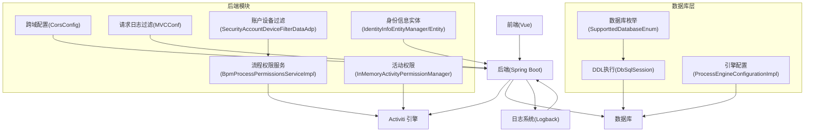
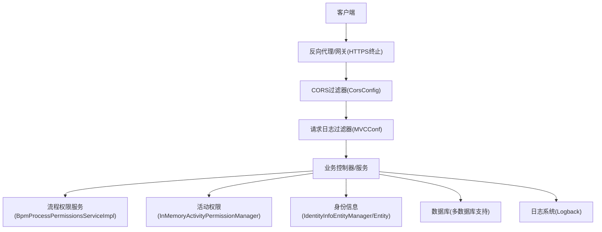
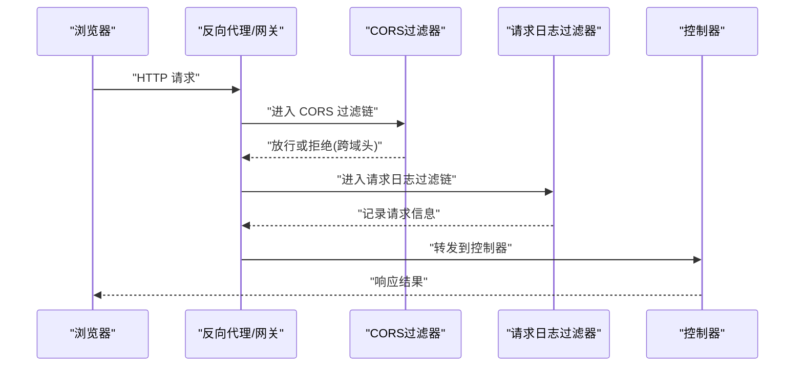
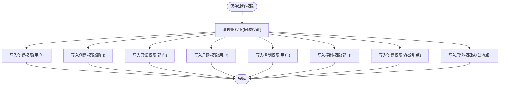
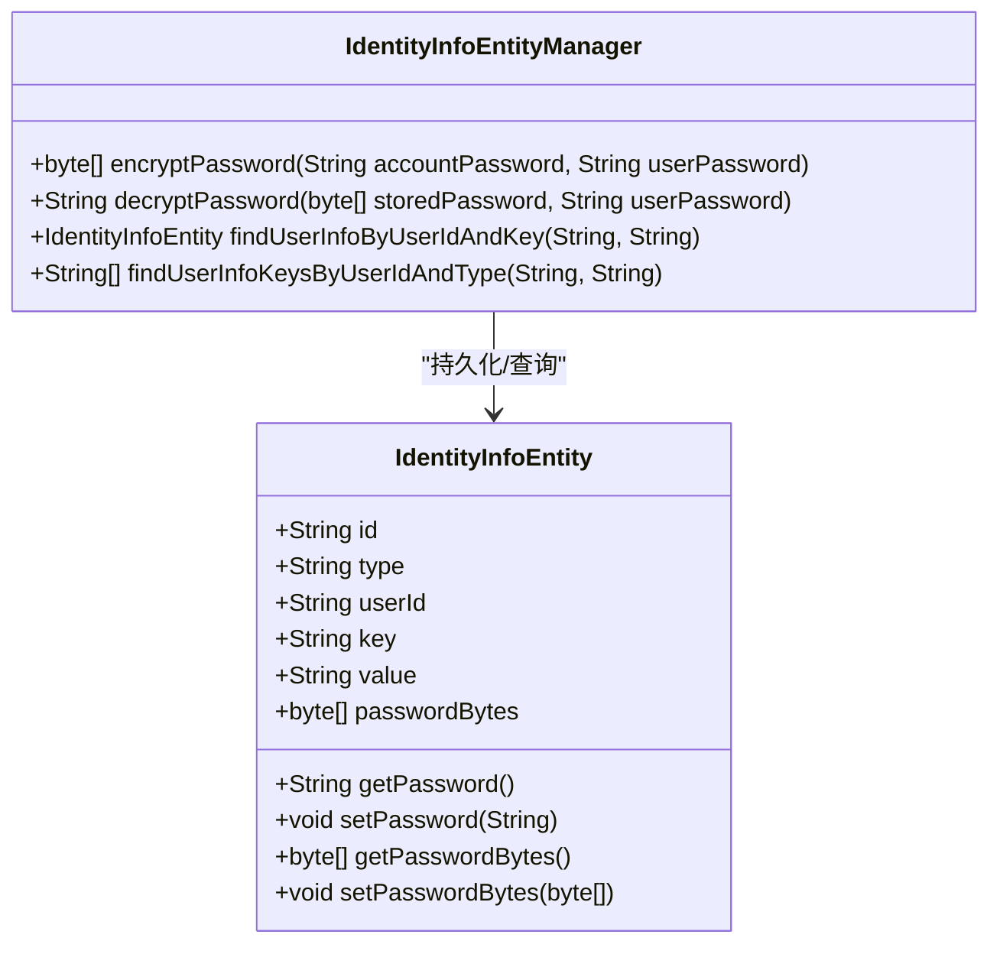
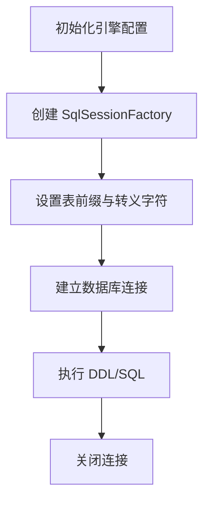
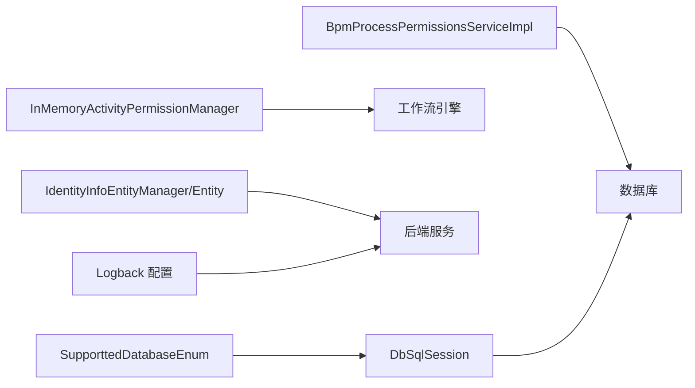

# 安全配置

<cite>
**本文引用的文件**
- [CorsConfig.java](file://antflow-engine/src/main/java/org/openoa/engine/conf/mvc/CorsConfig.java)
- [MVCConf.java](file://antflow-engine/src/main/java/org/openoa/engine/conf/mvc/MVCConf.java)
- [BpmProcessPermissionsServiceImpl.java](file://antflow-engine/src/main/java/org/openoa/engine/bpmnconf/service/impl/BpmProcessPermissionsServiceImpl.java)
- [InMemoryActivityPermissionManager.java](file://antflow-engine/src/main/java/org/openoa/engine/bpmnconf/service/flowcontrol/ext/InMemoryActivityPermissionManager.java)
- [SecurityAccountDeviceFilterDataAdp.java](file://antflow-base/src/main/java/org/openoa/base/adp/SecurityAccountDeviceFilterDataAdp.java)
- [SupporttedDatabaseEnum.java](file://antflow-base/src/main/java/org/openoa/base/constant/enums/SupporttedDatabaseEnum.java)
- [DbSqlSession.java](file://antflow-base/src/main/java/org/activiti/engine/impl/db/DbSqlSession.java)
- [ProcessEngineConfigurationImpl.java](file://antflow-base/src/main/java/org/activiti/engine/impl/cfg/ProcessEngineConfigurationImpl.java)
- [IdentityInfoEntityManager.java](file://antflow-base/src/main/java/org/activiti/engine/impl/persistence/entity/IdentityInfoEntityManager.java)
- [IdentityInfoEntity.java](file://antflow-base/src/main/java/org/activiti/engine/impl/persistence/entity/IdentityInfoEntity.java)
- [logback-spring.xml](file://antflow-web/src/main/resources/logback-spring.xml)
- [application.properties](file://antflow-web/src/main/resources/application.properties)
- [application-dev.properties](file://antflow-web/src/main/resources/application-dev.properties)
- [5.模块系统和自动装配.md](file://doc/系统介绍篇/5.模块系统和自动装配.md)
</cite>

## 目录
1. [简介](#简介)
2. [项目结构](#项目结构)
3. [核心组件](#核心组件)
4. [架构总览](#架构总览)
5. [详细组件分析](#详细组件分析)
6. [依赖关系分析](#依赖关系分析)
7. [性能考虑](#性能考虑)
8. [故障排查指南](#故障排查指南)
9. [结论](#结论)
10. [附录](#附录)

## 简介
本指南面向企业级部署场景，围绕数据库安全、应用安全、工作流引擎安全、HTTPS/SSL、日志与审计、备份与漏洞扫描、应急响应等维度，结合代码库中的现有实现，给出可落地的安全配置建议与最佳实践。内容以“可执行、可验证”为原则，避免空泛描述，并在涉及具体实现处标注来源文件。

## 项目结构
本项目采用多模块结构，后端基于 Spring Boot 与 Activiti 工作流引擎，前端为 Vue 应用。安全相关的关键位置包括：
- 后端安全配置：跨域、请求日志过滤器、工作流权限控制、身份与密码存储实体
- 数据库层：多数据库支持枚举、DDL 执行与连接配置
- 日志与审计：统一的日志配置文件
- 环境配置：多环境属性文件

图表来源
- [CorsConfig.java:1-49](file://antflow-engine/src/main/java/org/openoa/engine/conf/mvc/CorsConfig.java#L1-L49)
- [MVCConf.java:1-25](file://antflow-engine/src/main/java/org/openoa/engine/conf/mvc/MVCConf.java#L1-L25)
- [BpmProcessPermissionsServiceImpl.java:1-173](file://antflow-engine/src/main/java/org/openoa/engine/bpmnconf/service/impl/BpmProcessPermissionsServiceImpl.java#L1-L173)
- [InMemoryActivityPermissionManager.java:1-49](file://antflow-engine/src/main/java/org/openoa/engine/bpmnconf/service/flowcontrol/ext/InMemoryActivityPermissionManager.java#L1-L49)
- [SecurityAccountDeviceFilterDataAdp.java:1-35](file://antflow-base/src/main/java/org/openoa/base/adp/SecurityAccountDeviceFilterDataAdp.java#L1-L35)
- [SupporttedDatabaseEnum.java:1-39](file://antflow-base/src/main/java/org/openoa/base/constant/enums/SupporttedDatabaseEnum.java#L1-L39)
- [DbSqlSession.java:1238-1328](file://antflow-base/src/main/java/org/activiti/engine/impl/db/DbSqlSession.java#L1238-L1328)
- [ProcessEngineConfigurationImpl.java:858-872](file://antflow-base/src/main/java/org/activiti/engine/impl/cfg/ProcessEngineConfigurationImpl.java#L858-L872)
- [IdentityInfoEntityManager.java:102-132](file://antflow-base/src/main/java/org/activiti/engine/impl/persistence/entity/IdentityInfoEntityManager.java#L102-L132)
- [IdentityInfoEntity.java:39-142](file://antflow-base/src/main/java/org/activiti/engine/impl/persistence/entity/IdentityInfoEntity.java#L39-L142)

章节来源
- [CorsConfig.java:1-49](file://antflow-engine/src/main/java/org/openoa/engine/conf/mvc/CorsConfig.java#L1-L49)
- [MVCConf.java:1-25](file://antflow-engine/src/main/java/org/openoa/engine/conf/mvc/MVCConf.java#L1-L25)
- [BpmProcessPermissionsServiceImpl.java:1-173](file://antflow-engine/src/main/java/org/openoa/engine/bpmnconf/service/impl/BpmProcessPermissionsServiceImpl.java#L1-L173)
- [InMemoryActivityPermissionManager.java:1-49](file://antflow-engine/src/main/java/org/openoa/engine/bpmnconf/service/flowcontrol/ext/InMemoryActivityPermissionManager.java#L1-L49)
- [SecurityAccountDeviceFilterDataAdp.java:1-35](file://antflow-base/src/main/java/org/openoa/base/adp/SecurityAccountDeviceFilterDataAdp.java#L1-L35)
- [SupporttedDatabaseEnum.java:1-39](file://antflow-base/src/main/java/org/openoa/base/constant/enums/SupporttedDatabaseEnum.java#L1-L39)
- [DbSqlSession.java:1238-1328](file://antflow-base/src/main/java/org/activiti/engine/impl/db/DbSqlSession.java#L1238-L1328)
- [ProcessEngineConfigurationImpl.java:858-872](file://antflow-base/src/main/java/org/activiti/engine/impl/cfg/ProcessEngineConfigurationImpl.java#L858-L872)
- [IdentityInfoEntityManager.java:102-132](file://antflow-base/src/main/java/org/activiti/engine/impl/persistence/entity/IdentityInfoEntityManager.java#L102-L132)
- [IdentityInfoEntity.java:39-142](file://antflow-base/src/main/java/org/activiti/engine/impl/persistence/entity/IdentityInfoEntity.java#L39-L142)

## 核心组件
- 跨域与请求日志：通过 CorsConfig 提供全局跨域过滤器；通过 MVCConf 注册 CommonsRequestLoggingFilter 实现请求日志记录。
- 工作流权限控制：BpmProcessPermissionsServiceImpl 支持按用户、部门、办公地点等维度配置流程的创建、查看与控制权限；InMemoryActivityPermissionManager 提供活动级权限缓存与加载能力。
- 身份与密码存储：IdentityInfoEntityManager/Entity 提供用户信息与密码字节存储接口，当前实现中存在明文处理痕迹，需加强加密策略。
- 数据库层：SupporttedDatabaseEnum 统一多数据库类型；DbSqlSession/ProcessEngineConfigurationImpl 负责 DDL 执行与连接配置，影响连接安全性与兼容性。

章节来源
- [CorsConfig.java:33-47](file://antflow-engine/src/main/java/org/openoa/engine/conf/mvc/CorsConfig.java#L33-L47)
- [MVCConf.java:14-23](file://antflow-engine/src/main/java/org/openoa/engine/conf/mvc/MVCConf.java#L14-L23)
- [BpmProcessPermissionsServiceImpl.java:28-132](file://antflow-engine/src/main/java/org/openoa/engine/bpmnconf/service/impl/BpmProcessPermissionsServiceImpl.java#L28-L132)
- [InMemoryActivityPermissionManager.java:14-47](file://antflow-engine/src/main/java/org/openoa/engine/bpmnconf/service/flowcontrol/ext/InMemoryActivityPermissionManager.java#L14-L47)
- [IdentityInfoEntityManager.java:108-116](file://antflow-base/src/main/java/org/activiti/engine/impl/persistence/entity/IdentityInfoEntityManager.java#L108-L116)
- [IdentityInfoEntity.java:103-117](file://antflow-base/src/main/java/org/activiti/engine/impl/persistence/entity/IdentityInfoEntity.java#L103-L117)
- [SupporttedDatabaseEnum.java:6-21](file://antflow-base/src/main/java/org/openoa/base/constant/enums/SupporttedDatabaseEnum.java#L6-L21)
- [DbSqlSession.java:1241-1328](file://antflow-base/src/main/java/org/activiti/engine/impl/db/DbSqlSession.java#L1241-L1328)
- [ProcessEngineConfigurationImpl.java:858-872](file://antflow-base/src/main/java/org/activiti/engine/impl/cfg/ProcessEngineConfigurationImpl.java#L858-L872)

## 架构总览
下图展示安全相关组件在系统中的交互关系与职责边界：

图表来源
- [CorsConfig.java:33-47](file://antflow-engine/src/main/java/org/openoa/engine/conf/mvc/CorsConfig.java#L33-L47)
- [MVCConf.java:14-23](file://antflow-engine/src/main/java/org/openoa/engine/conf/mvc/MVCConf.java#L14-L23)
- [BpmProcessPermissionsServiceImpl.java:28-132](file://antflow-engine/src/main/java/org/openoa/engine/bpmnconf/service/impl/BpmProcessPermissionsServiceImpl.java#L28-L132)
- [InMemoryActivityPermissionManager.java:14-47](file://antflow-engine/src/main/java/org/openoa/engine/bpmnconf/service/flowcontrol/ext/InMemoryActivityPermissionManager.java#L14-L47)
- [IdentityInfoEntityManager.java:108-116](file://antflow-base/src/main/java/org/activiti/engine/impl/persistence/entity/IdentityInfoEntityManager.java#L108-L116)
- [IdentityInfoEntity.java:103-117](file://antflow-base/src/main/java/org/activiti/engine/impl/persistence/entity/IdentityInfoEntity.java#L103-L117)
- [SupporttedDatabaseEnum.java:6-21](file://antflow-base/src/main/java/org/openoa/base/constant/enums/SupporttedDatabaseEnum.java#L6-L21)
- [logback-spring.xml](file://antflow-web/src/main/resources/logback-spring.xml)

## 详细组件分析

### 组件A：跨域与请求日志（CORS与请求审计）
- 跨域配置：CorsConfig 提供全局 CorsFilter，允许通配符来源、头与方法，并启用凭据与最大缓存时间，便于前后端联调与跨域资源共享。
- 请求日志：MVCConf 注册 CommonsRequestLoggingFilter，对所有路径进行请求日志登记，便于审计与问题定位。

图表来源
- [CorsConfig.java:33-47](file://antflow-engine/src/main/java/org/openoa/engine/conf/mvc/CorsConfig.java#L33-L47)
- [MVCConf.java:14-23](file://antflow-engine/src/main/java/org/openoa/engine/conf/mvc/MVCConf.java#L14-L23)

章节来源
- [CorsConfig.java:1-49](file://antflow-engine/src/main/java/org/openoa/engine/conf/mvc/CorsConfig.java#L1-L49)
- [MVCConf.java:1-25](file://antflow-engine/src/main/java/org/openoa/engine/conf/mvc/MVCConf.java#L1-L25)

### 组件B：工作流引擎权限控制
- 流程级权限：BpmProcessPermissionsServiceImpl 支持按用户、部门、办公地点配置创建、查看与控制权限，覆盖多粒度的访问控制需求。
- 活动级权限：InMemoryActivityPermissionManager 将活动定义键与受控用户/组映射缓存于内存，提供快速加载与批量移除能力。
- 账户设备过滤：SecurityAccountDeviceFilterDataAdp 提供账户相关字段的过滤列映射，可用于敏感数据脱敏或访问控制。

图表来源
- [BpmProcessPermissionsServiceImpl.java:28-132](file://antflow-engine/src/main/java/org/openoa/engine/bpmnconf/service/impl/BpmProcessPermissionsServiceImpl.java#L28-L132)

章节来源
- [BpmProcessPermissionsServiceImpl.java:1-173](file://antflow-engine/src/main/java/org/openoa/engine/bpmnconf/service/impl/BpmProcessPermissionsServiceImpl.java#L1-L173)
- [InMemoryActivityPermissionManager.java:1-49](file://antflow-engine/src/main/java/org/openoa/engine/bpmnconf/service/flowcontrol/ext/InMemoryActivityPermissionManager.java#L1-L49)
- [SecurityAccountDeviceFilterDataAdp.java:1-35](file://antflow-base/src/main/java/org/openoa/base/adp/SecurityAccountDeviceFilterDataAdp.java#L1-L35)

### 组件C：身份与密码存储
- 密码存储：IdentityInfoEntity/IdentityInfoEntityManager 提供密码字节与字符串存储接口，当前实现中存在明文处理痕迹，应立即引入强哈希与随机盐策略。
- 用户信息：支持用户键值对详情存储，可用于扩展登录设备、IP 白名单等安全字段。

图表来源
- [IdentityInfoEntity.java:39-142](file://antflow-base/src/main/java/org/activiti/engine/impl/persistence/entity/IdentityInfoEntity.java#L39-L142)
- [IdentityInfoEntityManager.java:108-132](file://antflow-base/src/main/java/org/activiti/engine/impl/persistence/entity/IdentityInfoEntityManager.java#L108-L132)

章节来源
- [IdentityInfoEntity.java:39-142](file://antflow-base/src/main/java/org/activiti/engine/impl/persistence/entity/IdentityInfoEntity.java#L39-L142)
- [IdentityInfoEntityManager.java:102-132](file://antflow-base/src/main/java/org/activiti/engine/impl/persistence/entity/IdentityInfoEntityManager.java#L102-L132)

### 组件D：数据库安全与连接配置
- 多数据库支持：SupporttedDatabaseEnum 统一多种数据库类型，便于在不同数据库间迁移与兼容。
- DDL 与连接：DbSqlSession 在执行 DDL 时根据数据库类型做差异化处理；ProcessEngineConfigurationImpl 初始化 SqlSessionFactory 并注入表前缀与转义字符，影响查询与安全配置。

图表来源
- [ProcessEngineConfigurationImpl.java:858-872](file://antflow-base/src/main/java/org/activiti/engine/impl/cfg/ProcessEngineConfigurationImpl.java#L858-L872)
- [DbSqlSession.java:1241-1328](file://antflow-base/src/main/java/org/activiti/engine/impl/db/DbSqlSession.java#L1241-L1328)
- [SupporttedDatabaseEnum.java:6-21](file://antflow-base/src/main/java/org/openoa/base/constant/enums/SupporttedDatabaseEnum.java#L6-L21)

章节来源
- [SupporttedDatabaseEnum.java:1-39](file://antflow-base/src/main/java/org/openoa/base/constant/enums/SupporttedDatabaseEnum.java#L1-L39)
- [DbSqlSession.java:1238-1328](file://antflow-base/src/main/java/org/activiti/engine/impl/db/DbSqlSession.java#L1238-L1328)
- [ProcessEngineConfigurationImpl.java:835-872](file://antflow-base/src/main/java/org/activiti/engine/impl/cfg/ProcessEngineConfigurationImpl.java#L835-L872)

## 依赖关系分析
- 组件耦合：权限服务依赖于数据库与安全工具类；活动权限管理器作为扩展点被流程引擎使用；身份信息实体与管理器共同构成认证基础。
- 外部依赖：日志系统由 Logback 提供；数据库驱动与连接池由 Spring Boot 自动装配；多数据库类型由枚举与 DDL 执行逻辑支撑。

图表来源
- [BpmProcessPermissionsServiceImpl.java:1-173](file://antflow-engine/src/main/java/org/openoa/engine/bpmnconf/service/impl/BpmProcessPermissionsServiceImpl.java#L1-L173)
- [InMemoryActivityPermissionManager.java:1-49](file://antflow-engine/src/main/java/org/openoa/engine/bpmnconf/service/flowcontrol/ext/InMemoryActivityPermissionManager.java#L1-L49)
- [IdentityInfoEntityManager.java:102-132](file://antflow-base/src/main/java/org/activiti/engine/impl/persistence/entity/IdentityInfoEntityManager.java#L102-L132)
- [IdentityInfoEntity.java:39-142](file://antflow-base/src/main/java/org/activiti/engine/impl/persistence/entity/IdentityInfoEntity.java#L39-L142)
- [SupporttedDatabaseEnum.java:1-39](file://antflow-base/src/main/java/org/openoa/base/constant/enums/SupporttedDatabaseEnum.java#L1-L39)
- [DbSqlSession.java:1238-1328](file://antflow-base/src/main/java/org/activiti/engine/impl/db/DbSqlSession.java#L1238-L1328)
- [logback-spring.xml](file://antflow-web/src/main/resources/logback-spring.xml)

章节来源
- [BpmProcessPermissionsServiceImpl.java:1-173](file://antflow-engine/src/main/java/org/openoa/engine/bpmnconf/service/impl/BpmProcessPermissionsServiceImpl.java#L1-L173)
- [InMemoryActivityPermissionManager.java:1-49](file://antflow-engine/src/main/java/org/openoa/engine/bpmnconf/service/flowcontrol/ext/InMemoryActivityPermissionManager.java#L1-L49)
- [IdentityInfoEntityManager.java:102-132](file://antflow-base/src/main/java/org/activiti/engine/impl/persistence/entity/IdentityInfoEntityManager.java#L102-L132)
- [IdentityInfoEntity.java:39-142](file://antflow-base/src/main/java/org/activiti/engine/impl/persistence/entity/IdentityInfoEntity.java#L39-L142)
- [SupporttedDatabaseEnum.java:1-39](file://antflow-base/src/main/java/org/openoa/base/constant/enums/SupporttedDatabaseEnum.java#L1-L39)
- [DbSqlSession.java:1238-1328](file://antflow-base/src/main/java/org/activiti/engine/impl/db/DbSqlSession.java#L1238-L1328)
- [logback-spring.xml](file://antflow-web/src/main/resources/logback-spring.xml)

## 性能考虑
- 跨域与日志：通配符跨域与全路径日志会带来额外网络与磁盘开销，建议在生产环境收紧来源与头列表，并限制日志级别与字段长度。
- 权限缓存：活动级权限使用内存缓存，注意在大规模并发场景下的内存占用与失效策略。
- 数据库连接：合理设置连接池大小、超时与健康检查，避免长事务与阻塞。

## 故障排查指南
- 跨域问题：确认 CORS 过滤器是否生效，检查允许的来源、头与方法是否与前端一致。
- 请求日志缺失：检查 CommonsRequestLoggingFilter 的注册顺序与日志级别，确保未被其他过滤器拦截。
- 权限异常：核对流程权限表的数据完整性与去重逻辑，关注创建/查看/控制三类权限的边界条件。
- 身份认证失败：检查密码存储与哈希策略，确认是否存在明文或弱加密风险。
- 数据库连接错误：核对引擎配置中的表前缀、转义字符与连接参数，确认 DDL 执行是否成功。

章节来源
- [CorsConfig.java:33-47](file://antflow-engine/src/main/java/org/openoa/engine/conf/mvc/CorsConfig.java#L33-L47)
- [MVCConf.java:14-23](file://antflow-engine/src/main/java/org/openoa/engine/conf/mvc/MVCConf.java#L14-L23)
- [BpmProcessPermissionsServiceImpl.java:28-132](file://antflow-engine/src/main/java/org/openoa/engine/bpmnconf/service/impl/BpmProcessPermissionsServiceImpl.java#L28-L132)
- [IdentityInfoEntityManager.java:108-116](file://antflow-base/src/main/java/org/activiti/engine/impl/persistence/entity/IdentityInfoEntityManager.java#L108-L116)
- [ProcessEngineConfigurationImpl.java:858-872](file://antflow-base/src/main/java/org/activiti/engine/impl/cfg/ProcessEngineConfigurationImpl.java#L858-L872)

## 结论
本指南基于现有代码实现了从跨域、请求日志、工作流权限、身份与密码存储到数据库连接与日志系统的安全配置要点梳理。建议在生产环境中进一步强化密码加密、收紧跨域策略、完善审计与告警机制，并结合多环境配置文件与日志策略形成闭环的安全运营体系。

## 附录

### HTTPS 与 SSL 配置建议
- 反向代理/网关：在边缘层统一终止 TLS，开启强密码套件与协议版本控制，启用 HSTS 与 OCSP Stapling。
- 证书管理：使用自动化证书签发与续期流程，定期轮换私钥与证书，严格控制密钥存储与访问权限。
- 端口与防火墙：仅开放必要端口，限制内网访问范围，对外暴露仅保留 HTTPS 443 与必要的运维端口。

### 审计与日志安全
- 日志级别：生产环境使用 INFO 或更高级别，避免输出敏感信息；对请求日志进行脱敏处理。
- 日志落盘：集中采集与远端存储，设置保留周期与轮转策略，防止日志被篡改。
- 审计事件：记录登录、权限变更、敏感操作等关键事件，确保不可否认性与可追溯性。

章节来源
- [logback-spring.xml](file://antflow-web/src/main/resources/logback-spring.xml)

### 数据库安全策略
- 连接加密：启用数据库 TLS 连接，限制明文传输。
- 访问控制：最小权限原则，分离只读与写入账号，定期轮换口令。
- 审计日志：开启数据库审计功能，记录 DDL/DML 操作与登录行为。
- 备份安全：对备份进行加密存储与异地容灾，定期验证恢复流程。

章节来源
- [SupporttedDatabaseEnum.java:1-39](file://antflow-base/src/main/java/org/openoa/base/constant/enums/SupporttedDatabaseEnum.java#L1-L39)
- [DbSqlSession.java:1238-1328](file://antflow-base/src/main/java/org/activiti/engine/impl/db/DbSqlSession.java#L1238-L1328)
- [ProcessEngineConfigurationImpl.java:858-872](file://antflow-base/src/main/java/org/activiti/engine/impl/cfg/ProcessEngineConfigurationImpl.java#L858-L872)

### 安全漏洞扫描与渗透测试
- 扫描范围：前端静态资源、后端接口、数据库与中间件。
- 工具建议：使用自动化扫描工具与人工渗透测试相结合，重点关注认证、授权、输入验证与敏感数据泄露。
- 修复与验证：按严重等级优先修复，回归测试验证修复效果。

### 应急响应预案
- 分级响应：根据事件影响范围与严重程度分级处置，明确响应流程与责任人。
- 证据保全：保留日志、快照与取证材料，配合合规检查。
- 恢复演练：定期演练恢复流程，确保业务连续性。