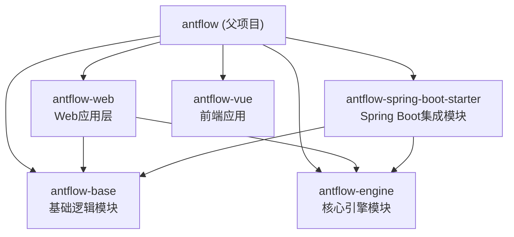
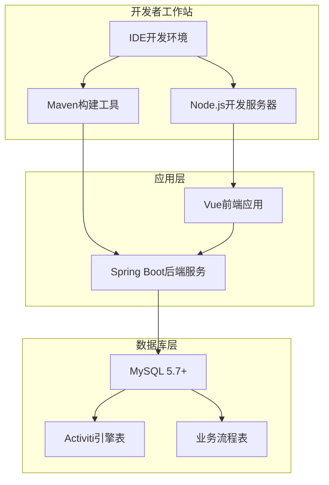
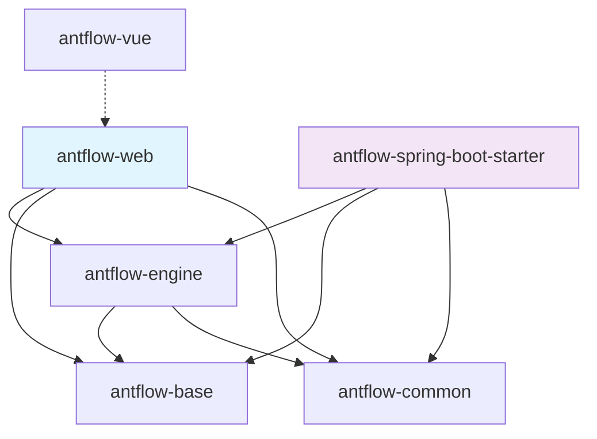

# 开发环境搭建

<cite>
**本文档引用的文件**
- [README.zh_CN.md](file://README.zh_CN.md)
- [doc/系统介绍篇/21.开发环境搭建.md](file://doc/系统介绍篇/21.开发环境搭建.md)
- [pom.xml](file://pom.xml)
- [antflow-web/pom.xml](file://antflow-web/pom.xml)
- [antflow-engine/pom.xml](file://antflow-engine/pom.xml)
- [antflow-base/pom.xml](file://antflow-base/pom.xml)
- [antflow-spring-boot-starter/pom.xml](file://antflow-spring-boot-starter/pom.xml)
- [antflow-web/src/main/resources/application.properties](file://antflow-web/src/main/resources/application.properties)
- [antflow-web/src/main/resources/application-dev.properties](file://antflow-web/src/main/resources/application-dev.properties)
- [antflow-vue/package.json](file://antflow-vue/package.json)
- [antflow-vue/vite.config.js](file://antflow-vue/vite.config.js)
- [script/act_init_db.sql](file://script/act_init_db.sql)
- [script/bpm_init_db.sql](file://script/bpm_init_db.sql)
- [script/bpm_init_db_data.sql](file://script/bpm_init_db_data.sql)
- [mvnw.cmd](file://mvnw.cmd)
</cite>

## 目录
1. [简介](#简介)
2. [项目结构](#项目结构)
3. [核心组件](#核心组件)
4. [架构概览](#架构概览)
5. [详细组件分析](#详细组件分析)
6. [依赖分析](#依赖分析)
7. [性能考虑](#性能考虑)
8. [故障排除指南](#故障排除指南)
9. [结论](#结论)
10. [附录](#附录)

## 简介

本文档提供了AntFlow工作流系统的完整开发环境搭建指南。AntFlow是一个基于Activiti的、企业级低代码工作流引擎平台，支持独立部署或作为模块嵌入现有系统中。

根据项目文档，系统的核心技术栈包括：
- Java 8-21（master分支为Java 8版本）
- Spring Boot 2.7.17
- Vue 3.5.15
- MyBatis Plus 3.5.1
- MySQL 5.7+

## 项目结构

AntFlow采用多模块Maven项目结构，包含以下核心模块：



**章节来源**
- [pom.xml:6-11](file://pom.xml#L6-L11)
- [README.zh_CN.md:44-54](file://README.zh_CN.md#L44-L54)

## 核心组件

### 后端技术栈要求

根据项目配置，后端开发环境需要以下组件：

| 组件 | 版本要求 | 用途 |
|------|----------|------|
| JDK | 8-21 | Java运行时环境 |
| Maven | 3.6+ | 项目构建和依赖管理 |
| MySQL | 5.7+ | 数据持久化存储 |
| Node.js | 16.20.0+ | 前端开发和构建 |

### 前端技术栈要求

前端使用Vue 3.5.15配合Vite进行开发，需要Node.js 16.20.0及以上版本。

**章节来源**
- [README.zh_CN.md:64-68](file://README.zh_CN.md#L64-L68)
- [antflow-vue/package.json:18-39](file://antflow-vue/package.json#L18-L39)

## 架构概览

开发环境的整体架构如下：



**图表来源**
- [README.zh_CN.md:64-68](file://README.zh_CN.md#L64-L68)
- [pom.xml:23-28](file://pom.xml#L23-L28)

## 详细组件分析

### 数据库环境准备

#### MySQL数据库配置

系统使用MySQL 5.7+作为主要数据存储，需要创建名为`antflow`的数据库并初始化相关表结构。

#### 数据库初始化脚本

项目提供了完整的数据库初始化脚本：

1. **Activiti引擎表初始化** (`script/act_init_db.sql`)
   - 初始化Activiti引擎所需的系统表
   - 包含流程定义、执行、任务等相关表

2. **业务流程表初始化** (`script/bpm_init_db.sql`)
   - 初始化业务流程配置表
   - 包含流程配置、节点配置、审批记录等业务表

3. **演示数据初始化** (`script/bpm_init_db_data.sql`)
   - 提供演示用的用户、角色、部门等基础数据
   - 用于快速验证系统功能

**章节来源**
- [script/act_init_db.sql:1-50](file://script/act_init_db.sql#L1-L50)
- [script/bpm_init_db.sql:1-50](file://script/bpm_init_db.sql#L1-L50)
- [script/bpm_init_db_data.sql:1-30](file://script/bpm_init_db_data.sql#L1-L30)

### 后端环境配置

#### Maven构建配置

项目使用Maven进行构建管理，核心配置包括：

1. **Java版本配置**
   - 父项目使用Java 1.8
   - 各模块保持兼容性

2. **Spring Boot版本**
   - 使用Spring Boot 2.7.17作为基础框架

3. **数据库连接配置**
   - 使用MySQL Connector/J 8.0.27
   - Druid连接池配置

#### 应用配置文件

系统使用Spring Profile机制管理不同环境的配置：

1. **全局配置** (`application.properties`)
   - 激活开发环境配置文件
   - 配置Activiti引擎参数
   - 设置邮件通知配置

2. **开发环境配置** (`application-dev.properties`)
   - 数据库连接信息
   - Druid连接池参数
   - MyBatis配置

**章节来源**
- [pom.xml:23-28](file://pom.xml#L23-L28)
- [antflow-web/src/main/resources/application.properties:1-36](file://antflow-web/src/main/resources/application.properties#L1-L36)
- [antflow-web/src/main/resources/application-dev.properties:1-44](file://antflow-web/src/main/resources/application-dev.properties#L1-L44)

### 前端环境配置

#### Node.js环境要求

前端开发需要Node.js 16.20.0及以上版本，项目使用Vite作为构建工具。

#### Vite配置分析

前端使用Vite进行开发和构建，关键配置包括：

1. **开发服务器配置**
   - 默认监听80端口
   - 支持代理配置
   - 热重载功能

2. **构建配置**
   - 生产环境优化
   - 代码分割策略
   - 资源压缩

3. **代理配置**
   - 开发环境API代理
   - 后端接口转发

**章节来源**
- [antflow-vue/vite.config.js:64-81](file://antflow-vue/vite.config.js#L64-L81)
- [antflow-vue/package.json:8-13](file://antflow-vue/package.json#L8-L13)

## 依赖分析

### 模块间依赖关系



**图表来源**
- [antflow-web/pom.xml:20-47](file://antflow-web/pom.xml#L20-L47)
- [antflow-engine/pom.xml:17-36](file://antflow-engine/pom.xml#L17-L36)
- [antflow-spring-boot-starter/pom.xml:44-67](file://antflow-spring-boot-starter/pom.xml#L44-L67)

### Maven依赖管理

项目使用Maven的dependencyManagement统一管理依赖版本，确保各模块间的依赖一致性。

**章节来源**
- [antflow-engine/pom.xml:184-194](file://antflow-engine/pom.xml#L184-L194)
- [antflow-base/pom.xml:144-154](file://antflow-base/pom.xml#L144-L154)

## 性能考虑

### 数据库性能优化

1. **连接池配置**
   - Druid连接池参数调优
   - 最大连接数和超时时间设置

2. **查询优化**
   - MyBatis映射器配置
   - 索引优化建议

### 前端性能优化

1. **构建优化**
   - 代码分割策略
   - 资源压缩和缓存

2. **开发体验**
   - 热重载功能
   - 错误边界处理

## 故障排除指南

### 常见问题及解决方案

#### 端口冲突问题

**问题症状**：应用启动时提示端口已被占用

**解决方案**：
1. 检查系统端口占用情况
2. 修改应用配置文件中的端口号
3. 关闭占用端口的其他程序

#### 数据库连接失败

**问题症状**：应用启动时报数据库连接错误

**解决方案**：
1. 验证MySQL服务状态
2. 检查数据库连接字符串配置
3. 确认用户名和密码正确性
4. 验证数据库网络连通性

#### 依赖下载超时

**问题症状**：Maven或npm安装依赖时超时

**解决方案**：
1. 使用国内镜像源
2. 配置代理设置
3. 检查网络连接稳定性
4. 清理本地缓存重新尝试

#### Java版本不兼容

**问题症状**：编译或运行时出现Java版本相关错误

**解决方案**：
1. 检查系统中安装的Java版本
2. 配置JAVA_HOME环境变量
3. 确保使用的Java版本在8-21范围内

**章节来源**
- [doc/系统介绍篇/21.开发环境搭建.md:243-256](file://doc/系统介绍篇/21.开发环境搭建.md#L243-L256)

## 结论

通过遵循本指南，开发者可以快速搭建AntFlow的完整开发环境。关键要点包括：

1. **环境准备**：确保满足Java、Node.js、MySQL等环境要求
2. **数据库初始化**：按照顺序执行数据库初始化脚本
3. **配置调整**：根据实际环境修改数据库连接配置
4. **依赖安装**：使用正确的版本要求安装依赖
5. **问题排查**：建立系统的问题排查流程

建议开发者在开始开发前，先验证数据库连接和基本的环境配置，确保后续开发工作的顺利进行。

## 附录

### 快速开始步骤

1. **克隆项目**
   ```bash
   git clone https://gitee.com/tylerzhou/Antflow.git
   cd Antflow
   ```

2. **数据库准备**
   - 创建MySQL数据库`antflow`
   - 执行数据库初始化脚本

3. **后端启动**
   ```bash
   mvn clean install
   cd antflow-web
   mvn spring-boot:run
   ```

4. **前端启动**
   ```bash
   cd antflow-vue
   npm install
   npm run dev
   ```

### 验证环境

启动完成后，可以通过以下方式验证环境配置：

1. **后端验证**：访问`http://localhost:7001`确认服务启动
2. **前端验证**：访问`http://localhost:80`确认前端页面加载
3. **数据库验证**：检查数据库连接状态和表结构完整性