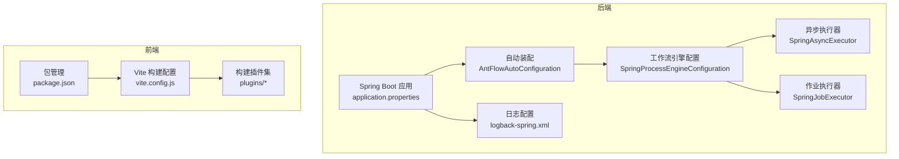
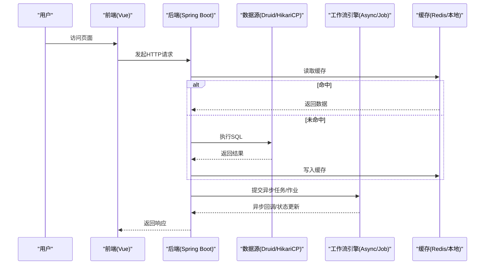
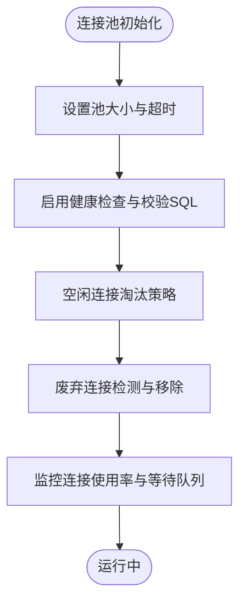
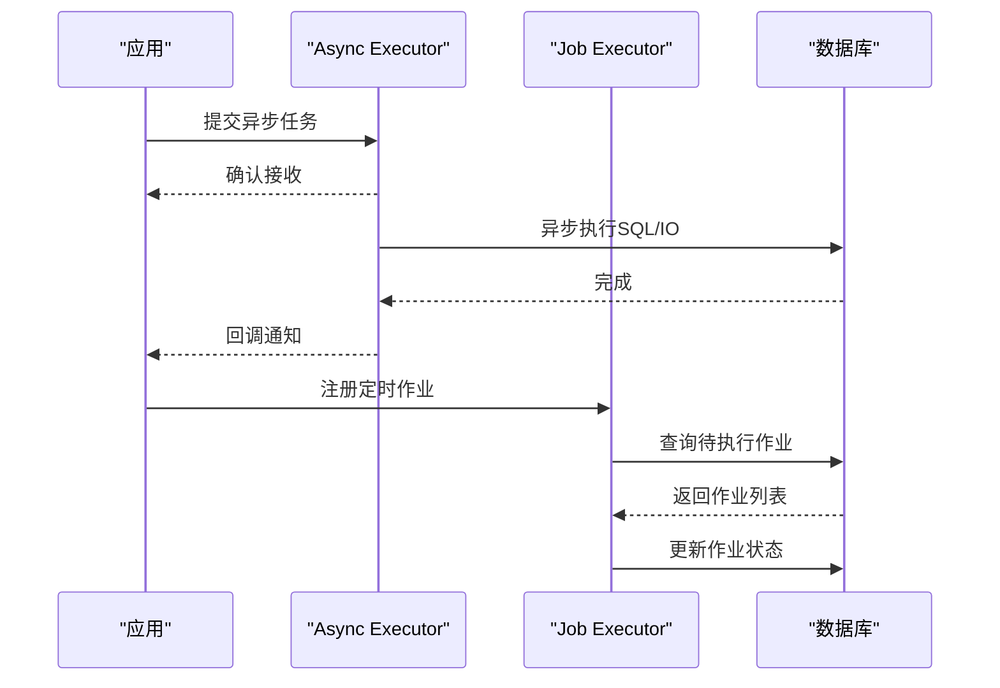
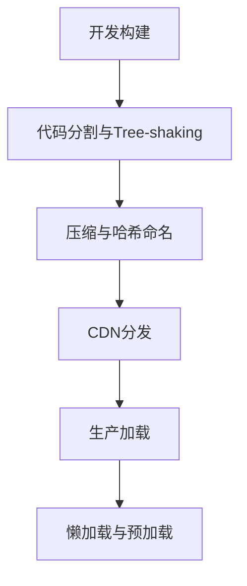
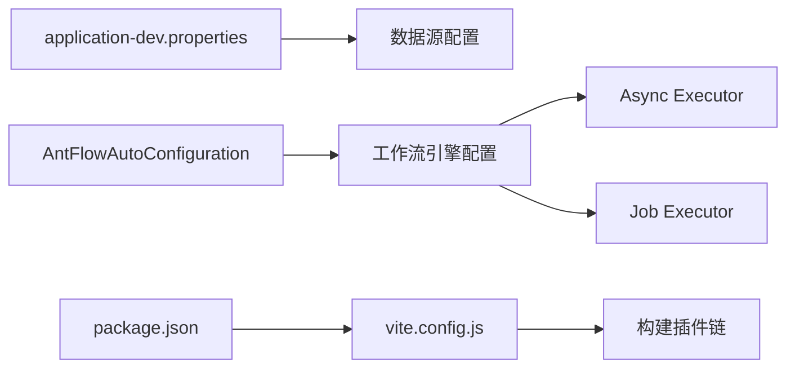

# 性能优化配置

<cite>
**本文引用的文件**
- [application.properties](file://antflow-web/src/main/resources/application.properties)
- [application-dev.properties](file://antflow-web/src/main/resources/application-dev.properties)
- [AntFlowAutoConfiguration.java](file://antflow-spring-boot-starter/src/main/java/org/openoa/starter/config/AntFlowAutoConfiguration.java)
- [SpringProcessEngineConfiguration.java](file://antflow-base/src/main/java/org/activiti/spring/SpringProcessEngineConfiguration.java)
- [SpringAsyncExecutor.java](file://antflow-base/src/main/java/org/activiti/spring/SpringAsyncExecutor.java)
- [SpringJobExecutor.java](file://antflow-base/src/main/java/org/activiti/spring/SpringJobExecutor.java)
- [vite.config.js](file://antflow-vue/vite.config.js)
- [package.json](file://antflow-vue/package.json)
- [compression.js](file://antflow-vue/vite/plugins/compression.js)
- [svg-icon.js](file://antflow-vue/vite/plugins/svg-icon.js)
- [index.js](file://antflow-vue/vite/plugins/index.js)
- [setup-extend.js](file://antflow-vue/vite/plugins/setup-extend.js)
- [auto-import.js](file://antflow-vue/vite/plugins/auto-import.js)
- [logback-spring.xml](file://antflow-web/src/main/resources/logback-spring.xml)
</cite>

## 目录
1. [简介](#简介)
2. [项目结构](#项目结构)
3. [核心组件](#核心组件)
4. [架构总览](#架构总览)
5. [详细组件分析](#详细组件分析)
6. [依赖关系分析](#依赖关系分析)
7. [性能考虑](#性能考虑)
8. [故障排查指南](#故障排查指南)
9. [结论](#结论)
10. [附录](#附录)

## 简介
本指南面向AntFlow工作流引擎在生产环境中的性能优化，覆盖数据库连接池（Druid/HikariCP）、缓存策略（Redis/本地缓存）、线程池调优、工作流引擎异步执行器与作业执行器优化、内存与GC调优、前端静态资源压缩与CDN配置、性能监控指标、压测方案与瓶颈识别方法，并提供不同业务规模下的配置建议与最佳实践。

## 项目结构
AntFlow采用前后端分离架构：后端基于Spring Boot + MyBatis-Plus + Activiti工作流引擎；前端基于Vue3 + Vite构建。性能优化涉及后端配置文件、Spring启动自动装配、工作流引擎配置、以及前端构建插件等关键位置。

**图表来源**
- [application.properties:1-36](file://antflow-web/src/main/resources/application.properties#L1-L36)
- [AntFlowAutoConfiguration.java](file://antflow-spring-boot-starter/src/main/java/org/openoa/starter/config/AntFlowAutoConfiguration.java)
- [SpringProcessEngineConfiguration.java](file://antflow-base/src/main/java/org/activiti/spring/SpringProcessEngineConfiguration.java)
- [SpringAsyncExecutor.java](file://antflow-base/src/main/java/org/activiti/spring/SpringAsyncExecutor.java)
- [SpringJobExecutor.java](file://antflow-base/src/main/java/org/activiti/spring/SpringJobExecutor.java)
- [logback-spring.xml](file://antflow-web/src/main/resources/logback-spring.xml)
- [vite.config.js](file://antflow-vue/vite.config.js)
- [package.json](file://antflow-vue/package.json)

**章节来源**
- [application.properties:1-36](file://antflow-web/src/main/resources/application.properties#L1-L36)
- [application-dev.properties:1-44](file://antflow-web/src/main/resources/application-dev.properties#L1-L44)
- [AntFlowAutoConfiguration.java](file://antflow-spring-boot-starter/src/main/java/org/openoa/starter/config/AntFlowAutoConfiguration.java)
- [SpringProcessEngineConfiguration.java](file://antflow-base/src/main/java/org/activiti/spring/SpringProcessEngineConfiguration.java)
- [SpringAsyncExecutor.java](file://antflow-base/src/main/java/org/activiti/spring/SpringAsyncExecutor.java)
- [SpringJobExecutor.java](file://antflow-base/src/main/java/org/activiti/spring/SpringJobExecutor.java)
- [vite.config.js](file://antflow-vue/vite.config.js)
- [package.json](file://antflow-vue/package.json)

## 核心组件
- 数据库连接池：通过Druid/HikariCP配置实现连接复用、空闲连接清理、超时控制与健康检查。
- 缓存策略：可结合Redis与本地缓存（如Caffeine）实现热点数据加速与降压。
- 工作流引擎：Async Executor与Job Executor负责异步任务与定时作业调度。
- 前端构建：Vite插件链路实现静态资源压缩、SVG图标处理、自动导入等优化。
- 日志与监控：统一日志配置与采样，结合APM工具进行性能观测。

**章节来源**
- [application-dev.properties:7-24](file://antflow-web/src/main/resources/application-dev.properties#L7-L24)
- [application.properties:1-36](file://antflow-web/src/main/resources/application.properties#L1-L36)
- [SpringAsyncExecutor.java](file://antflow-base/src/main/java/org/activiti/spring/SpringAsyncExecutor.java)
- [SpringJobExecutor.java](file://antflow-base/src/main/java/org/activiti/spring/SpringJobExecutor.java)
- [vite.config.js](file://antflow-vue/vite.config.js)

## 架构总览
下图展示从请求到数据库访问、工作流异步执行与前端构建的关键路径，以及性能优化点的分布。

**图表来源**
- [application-dev.properties:7-24](file://antflow-web/src/main/resources/application-dev.properties#L7-L24)
- [SpringAsyncExecutor.java](file://antflow-base/src/main/java/org/activiti/spring/SpringAsyncExecutor.java)
- [SpringJobExecutor.java](file://antflow-base/src/main/java/org/activiti/spring/SpringJobExecutor.java)
- [vite.config.js](file://antflow-vue/vite.config.js)

## 详细组件分析

### 数据库连接池优化（Druid/HikariCP）
- Druid配置要点
  - 最小空闲连接数、初始连接数、最大活跃连接数
  - 连接超时时间、移除废弃连接的阈值与超时时间
  - 连接有效性检测（校验SQL、检测间隔、空闲淘汰时间）
  - 借还连接时的检测开关
- HikariCP配置要点
  - 最大生命周期、连接池大小与超时
- 生产建议
  - 根据QPS与数据库承载能力设置最大连接数
  - 启用空闲连接淘汰与连接有效性检测
  - 使用只读事务或批量提交降低锁竞争
  - 对慢查询进行拦截与告警

**图表来源**
- [application-dev.properties:7-24](file://antflow-web/src/main/resources/application-dev.properties#L7-L24)

**章节来源**
- [application-dev.properties:7-24](file://antflow-web/src/main/resources/application-dev.properties#L7-L24)

### 缓存策略配置（Redis与本地缓存）
- Redis缓存
  - 热点数据缓存、过期策略、键空间通知
  - 读写一致性与缓存穿透防护
- 本地缓存（Caffeine）
  - 本地热点数据驻留、容量与回收策略
- 生产建议
  - 分层缓存：本地缓存优先，Redis兜底
  - 合理设置TTL与批量刷新
  - 使用布隆过滤器减少冷门Key的穿透

**章节来源**
- [application.properties:1-36](file://antflow-web/src/main/resources/application.properties#L1-L36)

### 线程池调优参数
- 核心线程数：根据CPU核数与IO密集度设定
- 最大线程数：避免过度上下文切换
- 队列长度：有界队列防止OOM
- 拒绝策略：记录日志并报警
- 空闲存活时间：平衡资源占用与启动开销
- 生产建议
  - 为不同业务场景划分线程池
  - 结合限流与熔断保护下游

**章节来源**
- [SpringProcessEngineConfiguration.java](file://antflow-base/src/main/java/org/activiti/spring/SpringProcessEngineConfiguration.java)

### 工作流引擎性能调优
- Async Executor配置
  - 并发度、队列容量、拒绝策略
  - 与线程池参数协同，避免阻塞
- Job Executor优化
  - 作业扫描周期、批处理大小
  - 与数据库连接池配合，避免长事务
- 生产建议
  - 将耗时任务下沉至异步执行器
  - 对异常作业进行重试与隔离

**图表来源**
- [SpringAsyncExecutor.java](file://antflow-base/src/main/java/org/activiti/spring/SpringAsyncExecutor.java)
- [SpringJobExecutor.java](file://antflow-base/src/main/java/org/activiti/spring/SpringJobExecutor.java)

**章节来源**
- [SpringAsyncExecutor.java](file://antflow-base/src/main/java/org/activiti/spring/SpringAsyncExecutor.java)
- [SpringJobExecutor.java](file://antflow-base/src/main/java/org/activiti/spring/SpringJobExecutor.java)

### 内存使用优化与垃圾回收调优
- JVM参数建议
  - 堆大小与新生代比例
  - GC算法选择（G1/Parallel）与停顿目标
  - 大对象与元空间配置
- 应用侧优化
  - 减少对象分配与逃逸
  - 及时释放大对象引用
  - 使用对象池与字节缓冲区
- 监控与诊断
  - GC日志采集与可视化
  - 堆外内存与DirectMemory监控

**章节来源**
- [logback-spring.xml](file://antflow-web/src/main/resources/logback-spring.xml)

### 前端性能优化（静态资源压缩、CDN、懒加载）
- 静态资源压缩
  - 启用gzip/br压缩与按需加载
- CDN配置
  - 第三方库与静态资源CDN化
- 懒加载策略
  - 组件与路由懒加载、图片延迟加载
- 构建优化
  - Tree-shaking、代码分割、预加载与预取
  - SVG图标按需引入与缓存

**图表来源**
- [vite.config.js](file://antflow-vue/vite.config.js)
- [package.json](file://antflow-vue/package.json)
- [compression.js](file://antflow-vue/vite/plugins/compression.js)
- [svg-icon.js](file://antflow-vue/vite/plugins/svg-icon.js)
- [index.js](file://antflow-vue/vite/plugins/index.js)
- [setup-extend.js](file://antflow-vue/vite/plugins/setup-extend.js)
- [auto-import.js](file://antflow-vue/vite/plugins/auto-import.js)

**章节来源**
- [vite.config.js](file://antflow-vue/vite.config.js)
- [package.json](file://antflow-vue/package.json)
- [compression.js](file://antflow-vue/vite/plugins/compression.js)
- [svg-icon.js](file://antflow-vue/vite/plugins/svg-icon.js)
- [index.js](file://antflow-vue/vite/plugins/index.js)
- [setup-extend.js](file://antflow-vue/vite/plugins/setup-extend.js)
- [auto-import.js](file://antflow-vue/vite/plugins/auto-import.js)

## 依赖关系分析
后端通过自动装配注入工作流引擎配置，连接池参数在开发环境配置文件中集中管理；前端通过Vite插件链路完成构建优化。

**图表来源**
- [application-dev.properties:1-44](file://antflow-web/src/main/resources/application-dev.properties#L1-L44)
- [AntFlowAutoConfiguration.java](file://antflow-spring-boot-starter/src/main/java/org/openoa/starter/config/AntFlowAutoConfiguration.java)
- [SpringProcessEngineConfiguration.java](file://antflow-base/src/main/java/org/activiti/spring/SpringProcessEngineConfiguration.java)
- [vite.config.js](file://antflow-vue/vite.config.js)
- [package.json](file://antflow-vue/package.json)

**章节来源**
- [application-dev.properties:1-44](file://antflow-web/src/main/resources/application-dev.properties#L1-L44)
- [AntFlowAutoConfiguration.java](file://antflow-spring-boot-starter/src/main/java/org/openoa/starter/config/AntFlowAutoConfiguration.java)
- [SpringProcessEngineConfiguration.java](file://antflow-base/src/main/java/org/activiti/spring/SpringProcessEngineConfiguration.java)
- [vite.config.js](file://antflow-vue/vite.config.js)
- [package.json](file://antflow-vue/package.json)

## 性能考虑
- 数据库层面
  - 连接池参数与SQL优化双管齐下
  - 读写分离与分库分表策略
- 缓存层面
  - 多级缓存与失效策略
  - 缓存热点与雪崩防护
- 工作流层面
  - 异步化与批量化处理
  - 作业重试与死信队列
- 前端层面
  - 资源体积与加载顺序优化
  - 预渲染与SSR（可选）

[本节为通用指导，不直接分析具体文件]

## 故障排查指南
- 连接池问题
  - 观察连接等待队列与超时次数
  - 检查无效连接与泄漏
- 工作流异常
  - 异步任务堆积与失败重试
  - 作业扫描频率与数据库压力
- 前端性能
  - 资源体积与加载时间
  - 首屏渲染与交互延迟
- 日志与监控
  - 关键路径埋点与采样
  - APM工具接入与告警

**章节来源**
- [application-dev.properties:7-24](file://antflow-web/src/main/resources/application-dev.properties#L7-L24)
- [SpringAsyncExecutor.java](file://antflow-base/src/main/java/org/activiti/spring/SpringAsyncExecutor.java)
- [SpringJobExecutor.java](file://antflow-base/src/main/java/org/activiti/spring/SpringJobExecutor.java)
- [logback-spring.xml](file://antflow-web/src/main/resources/logback-spring.xml)

## 结论
通过在连接池、缓存、线程池、工作流引擎、前端构建与监控等方面进行系统性优化，可显著提升AntFlow在不同业务规模下的稳定性与吞吐能力。建议以渐进方式落地各项优化措施，并结合压测与监控持续迭代。

[本节为总结性内容，不直接分析具体文件]

## 附录

### 不同规模业务场景的配置建议
- 小型场景（单实例，低并发）
  - 连接池：较小最大连接数与超时
  - 缓存：本地缓存为主，Redis可选
  - 线程池：默认配置即可
  - 前端：基础压缩与CDN
- 中型场景（多实例，中等并发）
  - 连接池：适度增大最大连接数，启用健康检查
  - 缓存：Redis + 本地缓存双层
  - 线程池：区分业务线程池
  - 前端：代码分割与懒加载
- 大型场景（高并发，分布式）
  - 连接池：读写分离 + 分库分表
  - 缓存：多级缓存 + 失效策略
  - 线程池：精细化分区与限流
  - 前端：CDN全量 + 预渲染

[本节为通用指导，不直接分析具体文件]

### 性能监控指标与压测方案
- 监控指标
  - 后端：TPS、P99延迟、错误率、连接池使用率、GC时间
  - 前端：首屏时间、交互延迟、资源体积
- 压测方案
  - 基准测试：逐步加压定位拐点
  - 场景化压测：模拟真实业务路径
  - 瓶颈识别：数据库、缓存、线程池、网络

[本节为通用指导，不直接分析具体文件]