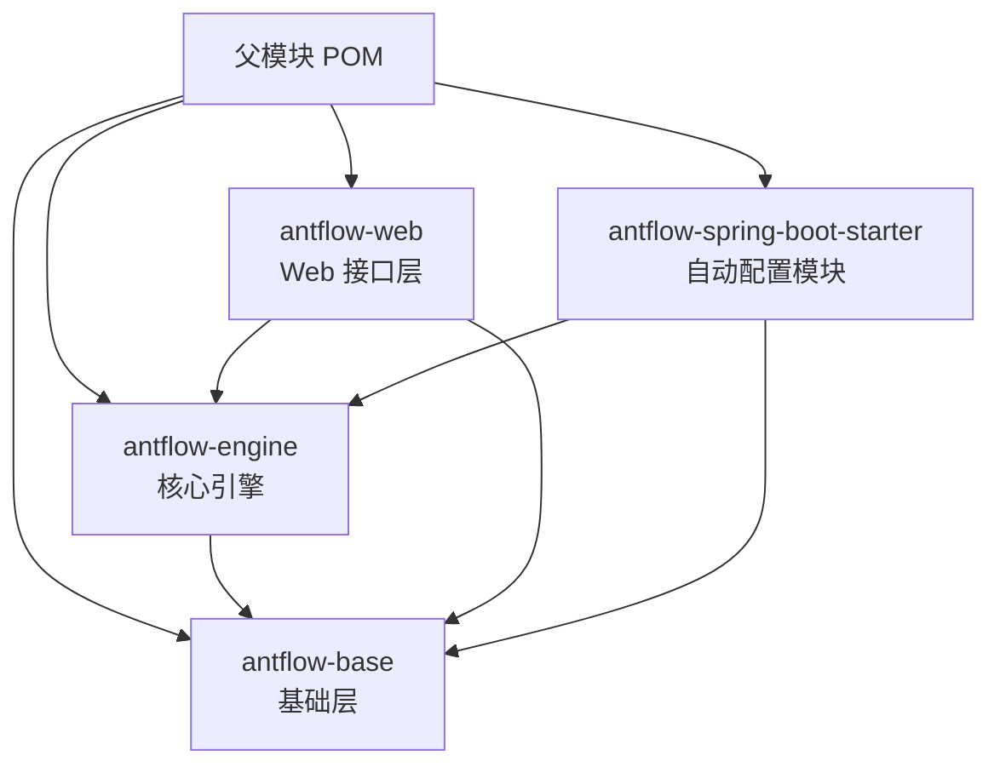
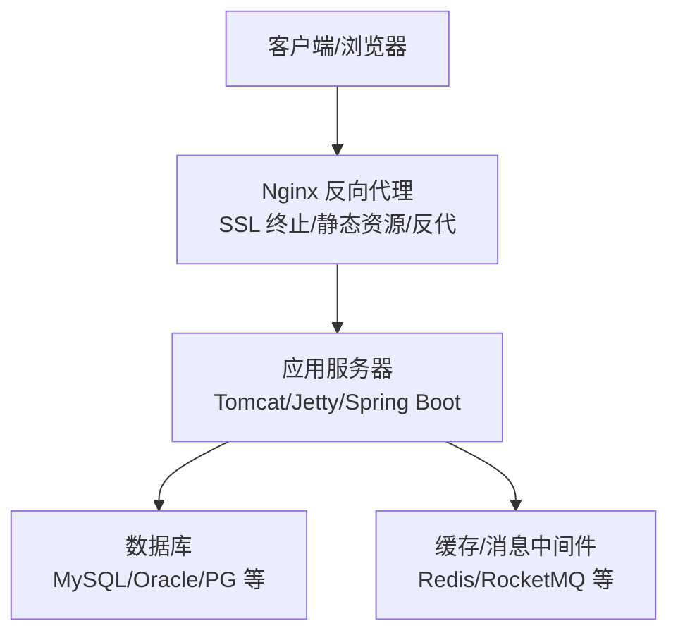
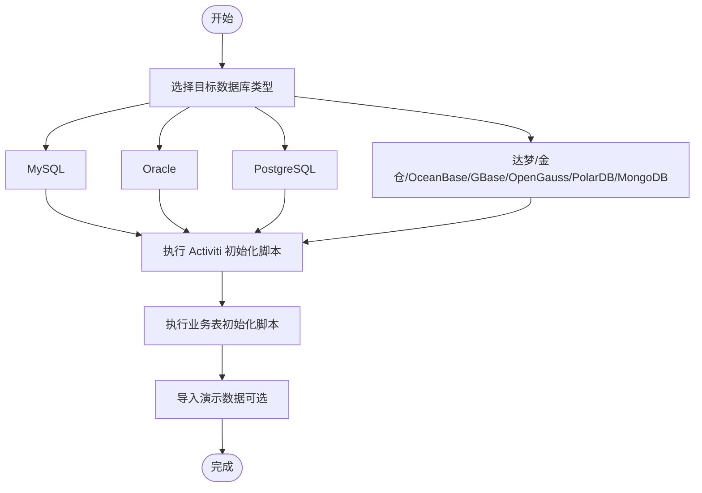
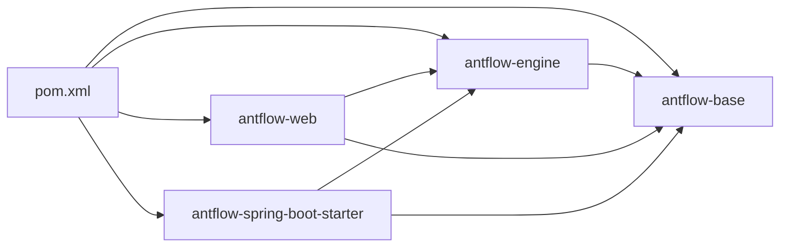

# 生产环境部署

<cite>
**本文引用的文件**
- [pom.xml](file://pom.xml)
- [application.properties](file://antflow-web/src/main/resources/application.properties)
- [application-dev.properties](file://antflow-web/src/main/resources/application-dev.properties)
- [act_init_db.sql](file://script/act_init_db.sql)
- [bpm_init_db.sql](file://script/bpm_init_db.sql)
- [bpm_init_db_data.sql](file://script/bpm_init_db_data.sql)
- [2.AntFlow_系统架构.md](file://doc/系统介绍篇/2.AntFlow_系统架构.md)
- [1.antflow oracle支持.md](file://doc/多数据库支持/1.antflow oracle支持.md)
- [2.antflow postgresql支持.md](file://doc/多数据库支持/2.antflow postgresql支持.md)
- [4.antflow 达梦dm8 oracle支持.md](file://doc/多数据库支持/4.antflow 达梦dm8 oracle支持.md)
- [6.antflow 达梦postgresql模式支持.md](file://doc/多数据库支持/6.antflow 达梦postgresql模式支持.md)
- [7.antflow 达梦sql server模式支持.md](file://doc/多数据库支持/7.antflow 达梦sql server模式支持.md)
- [8.antflow 电科金仓（原人大金仓）kingbase oracle模式支持.md](file://doc/多数据库支持/8.antflow 电科金仓（原人大金仓）kingbase oracle模式支持.md)
- [10.antflow 电金金仓（原人大金仓）pg模式支持.md](file://doc/多数据库支持/10.antflow 电金金仓（原人大金仓）pg模式支持.md)
- [11.antflow 南大通用gbase支持.md](file://doc/多数据库支持/11.antflow 南大通用gbase支持.md)
- [12.antflow oceanbase oracle模式支持.md](file://doc/多数据库支持/12.antflow oceanbase oracle模式支持.md)
- [13.antflow 高斯数据库opengauss支持.md](file://doc/多数据库支持/13.antflow 高斯数据库opengauss支持.md)
- [14.antflow支持ploardb pg版.md](file://doc/多数据库支持/14.antflow支持ploardb pg版.md)
- [15.antflow 支持polardb mysql版.md](file://doc/多数据库支持/15.antflow 支持polardb mysql版.md)
- [16.antflow mongodb支持.md](file://doc/多数据库支持/16.antflow mongodb支持.md)
</cite>

## 目录
1. [简介](#简介)
2. [项目结构](#项目结构)
3. [核心组件](#核心组件)
4. [架构总览](#架构总览)
5. [详细组件分析](#详细组件分析)
6. [依赖分析](#依赖分析)
7. [性能考虑](#性能考虑)
8. [故障排查指南](#故障排查指南)
9. [结论](#结论)
10. [附录](#附录)

## 简介
本指南面向生产环境部署，覆盖服务器与操作系统要求、硬件配置建议、数据库部署（MySQL、Oracle、PostgreSQL 等多数据库支持）、应用服务器与反向代理（Nginx）、容器化与 Kubernetes 集群部署、SSL 证书与负载均衡、高可用架构设计、部署检查清单、性能基准测试与容量规划建议。内容基于仓库中的模块结构、配置文件与数据库脚本进行整理与提炼，确保部署过程可执行、可观测、可维护。

## 项目结构
AntFlow 采用多模块 Maven 架构，核心模块包括基础层、核心引擎、Web 接口层与 Spring Boot Starter 自动配置模块。系统运行依赖 Spring Boot 2.7.17、Activiti 5.23（改造版）、MyBatis-Plus、MySQL 8.0.27，并通过 Druid/Hikari 连接池管理数据库连接。

**图表来源**
- [2.AntFlow_系统架构.md](file://doc/系统介绍篇/2.AntFlow_系统架构.md)
- [pom.xml](file://pom.xml)

**章节来源**
- [2.AntFlow_系统架构.md](file://doc/系统介绍篇/2.AntFlow_系统架构.md)
- [pom.xml](file://pom.xml)

## 核心组件
- 数据库层：使用 MySQL 8.0.27 作为默认数据库；同时提供多数据库支持文档，覆盖 Oracle、PostgreSQL、达梦、金仓、OceanBase、GBase、OpenGauss、PolarDB 等。
- 连接池：默认使用 Druid，可选 Hikari；在开发配置中展示了 Druid 的完整参数示例。
- 工作流引擎：基于 Activiti 5.23（改造版），通过 MyBatis-Plus 访问自定义业务表与 Activiti 运行表。
- Web 层：Spring Boot Web 提供 REST 接口，配合前端 Vue.js 3 交互。
- 自动配置：通过 Spring Boot Starter 与 application.properties 中的属性完成无侵入式配置。

**章节来源**
- [application.properties](file://antflow-web/src/main/resources/application.properties)
- [application-dev.properties](file://antflow-web/src/main/resources/application-dev.properties)
- [2.AntFlow_系统架构.md](file://doc/系统介绍篇/2.AntFlow_系统架构.md)

## 架构总览
生产部署建议采用“反向代理 + 应用服务器 + 数据库 + 缓存/消息中间件”的分层架构。Nginx 作为入口，负责 SSL 终止、静态资源与反向代理；应用服务器（如 Tomcat/Jetty）承载 Spring Boot 应用；数据库按业务与读写分离策略部署；缓存与消息中间件用于异步通知与热点数据加速。

[本图为概念性架构示意，无需图表来源]

## 详细组件分析

### 数据库部署与多数据库支持
- 默认数据库：MySQL 8.0.27，已提供初始化脚本，包含 Activiti 运行表与业务表。
- 多数据库支持：官方提供 Oracle、PostgreSQL、达梦、金仓、OceanBase、GBase、OpenGauss、PolarDB、MongoDB 等支持文档，覆盖驱动、方言、连接方式与注意事项。
- 初始化步骤：先执行 Activiti 运行表脚本，再执行业务表脚本，最后导入演示数据。

**图表来源**
- [act_init_db.sql](file://script/act_init_db.sql)
- [bpm_init_db.sql](file://script/bpm_init_db.sql)
- [bpm_init_db_data.sql](file://script/bpm_init_db_data.sql)

**章节来源**
- [act_init_db.sql](file://script/act_init_db.sql)
- [bpm_init_db.sql](file://script/bpm_init_db.sql)
- [bpm_init_db_data.sql](file://script/bpm_init_db_data.sql)
- [1.antflow oracle支持.md](file://doc/多数据库支持/1.antflow oracle支持.md)
- [2.antflow postgresql支持.md](file://doc/多数据库支持/2.antflow postgresql支持.md)
- [4.antflow 达梦dm8 oracle支持.md](file://doc/多数据库支持/4.antflow 达梦dm8 oracle支持.md)
- [6.antflow 达梦postgresql模式支持.md](file://doc/多数据库支持/6.antflow 达梦postgresql模式支持.md)
- [7.antflow 达梦sql server模式支持.md](file://doc/多数据库支持/7.antflow 达梦sql server模式支持.md)
- [8.antflow 电科金仓（原人大金仓）kingbase oracle模式支持.md](file://doc/多数据库支持/8.antflow 电科金仓（原人大金仓）kingbase oracle模式支持.md)
- [10.antflow 电金金仓（原人大金仓）pg模式支持.md](file://doc/多数据库支持/10.antflow 电金金仓（原人大金仓）pg模式支持.md)
- [11.antflow 南大通用gbase支持.md](file://doc/多数据库支持/11.antflow 南大通用gbase支持.md)
- [12.antflow oceanbase oracle模式支持.md](file://doc/多数据库支持/12.antflow oceanbase oracle模式支持.md)
- [13.antflow 高斯数据库opengauss支持.md](file://doc/多数据库支持/13.antflow 高斯数据库opengauss支持.md)
- [14.antflow支持ploardb pg版.md](file://doc/多数据库支持/14.antflow支持ploardb pg版.md)
- [15.antflow 支持polardb mysql版.md](file://doc/多数据库支持/15.antflow 支持polardb mysql版.md)
- [16.antflow mongodb支持.md](file://doc/多数据库支持/16.antflow mongodb支持.md)

### 应用服务器部署（Tomcat/Jetty）
- Spring Boot 应用可通过打包为 WAR 并部署至 Tomcat 或 Jetty，或直接以嵌入式服务器运行。
- 生产建议使用 Tomcat/Jetty 作为稳定的应用容器，结合 Nginx 反向代理与健康检查。
- 连接池配置：优先使用 Druid（开发配置已给出完整参数），或 Hikari；根据并发与事务特性调整最大连接数、空闲超时、连接生命周期等。

**章节来源**
- [application-dev.properties](file://antflow-web/src/main/resources/application-dev.properties)

### 反向代理配置（Nginx）
- SSL 终止：建议在 Nginx 上启用 TLS 1.2+/1.3，配置强密码套件与 OCSP Stapling。
- 静态资源：将前端构建产物指向 Nginx 静态目录，提升访问性能。
- 反向代理：将 /api 前缀转发至后端应用服务器，设置合理的超时与缓冲区大小。
- 健康检查：后端提供健康端点，Nginx 使用 upstream + health check 实现故障摘除。

[本节为通用实践说明，无需章节来源]

### Docker 容器化部署
- 构建镜像：基于 OpenJDK 8/11 基础镜像，复制 Spring Boot 可执行 jar 或 WAR 至容器。
- 环境变量：通过环境变量注入数据库连接、日志级别、激活的 Spring Profile。
- 健康检查：暴露健康端点，容器编排工具定期探测。
- 持久化：挂载日志目录与临时文件目录，避免容器重启丢失。
- 网络：容器网络与宿主机网络隔离，通过端口映射对外提供服务。

[本节为通用实践说明，无需章节来源]

### Kubernetes 集群部署
- Deployment：副本数≥2，滚动升级策略，带 readiness/liveness 探针。
- Service：ClusterIP 暴露内部服务，Ingress 对外暴露。
- ConfigMap/Secret：敏感配置放入 Secret，非敏感配置放入 ConfigMap。
- HPA：根据 CPU/内存或自定义指标自动扩缩容。
- 存储：使用 PVC 挂载日志与临时目录，或使用本地存储。
- Ingress：启用 TLS，配置证书管理与重写规则。

[本节为通用实践说明，无需章节来源]

### SSL 证书与负载均衡
- 证书：推荐 ACME 自动签发（Let’s Encrypt）或企业 CA 签发，统一管理到期时间。
- 负载均衡：Nginx/Tengine/HAProxy/LVS 等，支持会话保持与健康检查。
- 端口策略：80 自动跳转 443，443 终止 TLS，后端服务监听内网端口。

[本节为通用实践说明，无需章节来源]

### 高可用架构设计
- 应用层：多副本部署，共享数据库或读写分离，状态通过缓存/消息中间件同步。
- 数据层：主从复制/分区/分片，关键表建立复合索引，定期备份与恢复演练。
- 网络层：跨机房部署，内网高带宽，外网多出口，DNS/SLB 多活。
- 监控告警：Prometheus/Grafana + 日志聚合 + 链路追踪，建立 SLO/SLA。

[本节为通用实践说明，无需章节来源]

## 依赖分析
- 模块依赖：父 POM 管理四大模块，引擎与 Web 依赖基础层；Starter 依赖引擎与基础层，便于外部系统快速集成。
- 运行时依赖：Spring Boot 2.7.17、Activiti 5.23（改造版）、MyBatis-Plus、MySQL 驱动、Druid/Hikari。
- 配置依赖：application.properties 与 Spring Profile 控制环境切换与功能开关。

**图表来源**
- [pom.xml](file://pom.xml)

**章节来源**
- [pom.xml](file://pom.xml)

## 性能考虑
- 连接池调优：根据 QPS 与并发事务数设置最大连接、空闲连接、连接生命周期与校验查询。
- SQL 优化：对关键表建立复合索引，避免全表扫描；慢查询日志与执行计划分析。
- 缓存策略：热点数据放入 Redis，合理设置过期时间与淘汰策略；消息异步化处理通知。
- JVM 参数：根据容器内存限制设置堆大小、GC 策略与线程栈大小。
- 压力测试：使用 JMeter/Locust 进行并发与场景测试，观察响应时间、吞吐量与错误率。

[本节为通用实践说明，无需章节来源]

## 故障排查指南
- 数据库连接失败：核对 JDBC URL、用户名、密码与驱动；确认防火墙与网络连通性。
- Activiti 表缺失：确认已执行初始化脚本；检查 spring.activiti.database-schema-update 设置。
- 启动异常：查看启动日志与 Spring Profile 是否正确；检查 application.properties 中的配置项。
- 连接池问题：关注 Druid/Hikari 的监控指标（活跃连接、等待时间、超时次数）。
- 前后端联调：确认 Nginx 反代路径与 CORS 配置；检查后端健康端点与鉴权逻辑。

**章节来源**
- [application.properties](file://antflow-web/src/main/resources/application.properties)
- [application-dev.properties](file://antflow-web/src/main/resources/application-dev.properties)
- [act_init_db.sql](file://script/act_init_db.sql)

## 结论
本指南基于仓库中的模块结构、配置与数据库脚本，给出了生产环境部署的完整路径：从服务器与数据库准备，到应用与反向代理部署，再到容器化与 Kubernetes 集群、SSL 与负载均衡、高可用设计与运维保障。建议在上线前完成性能基准测试与容量规划，并制定完善的回滚与应急响应预案。

## 附录

### 部署检查清单
- 服务器与操作系统：满足最低硬件要求，安装 JDK、Nginx、数据库与容器运行时。
- 数据库：完成初始化脚本执行，验证表结构与索引；配置只读副本与备份策略。
- 应用：打包构建产物，配置连接池与日志级别，验证健康端点。
- 反向代理：配置 SSL 证书、静态资源与反代规则，启用健康检查。
- 容器/K8s：编写镜像与编排文件，配置 ConfigMap/Secret、HPA 与 Ingress。
- 监控与告警：Prometheus/Grafana、日志聚合、链路追踪与值班机制。
- 回滚与演练：制定回滚策略与演练计划，准备应急响应流程。

[本节为通用实践说明，无需章节来源]

### 性能基准测试与容量规划
- 基准测试：模拟峰值并发与典型业务场景，测量响应时间、吞吐量与资源占用。
- 容量规划：根据增长趋势与 SLA 目标，计算 CPU/内存/存储/网络与数据库连接数需求。
- 优化迭代：持续监控与优化，包括连接池、SQL、缓存与 GC 调优。

[本节为通用实践说明，无需章节来源]