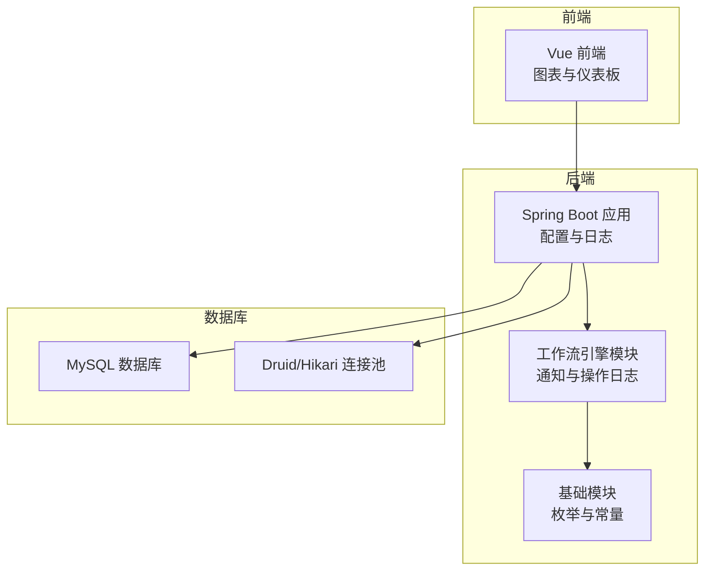
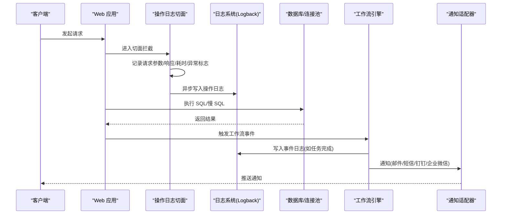
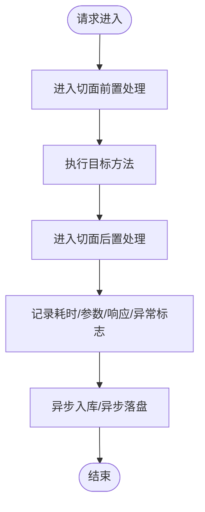
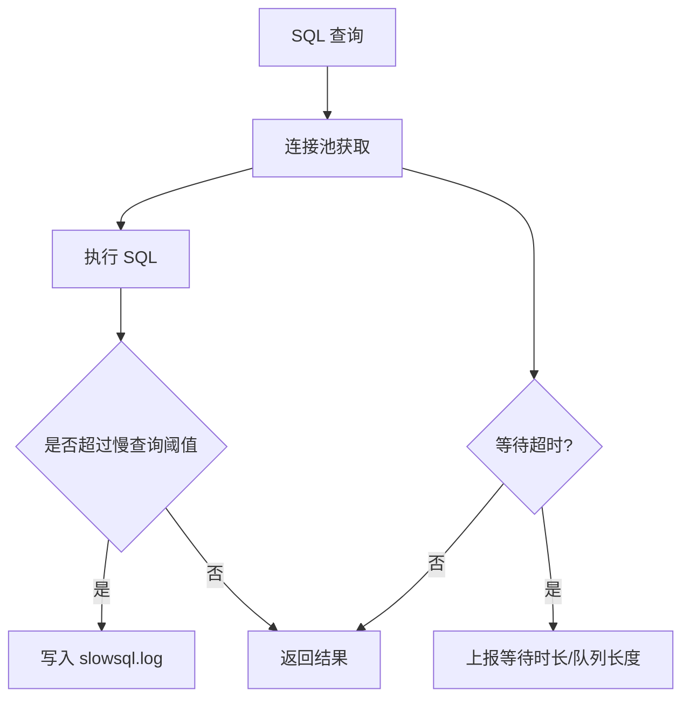
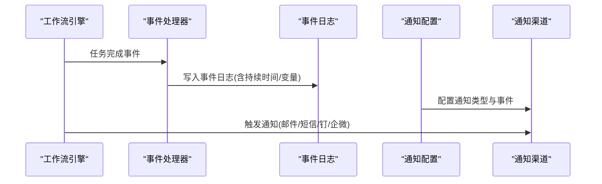
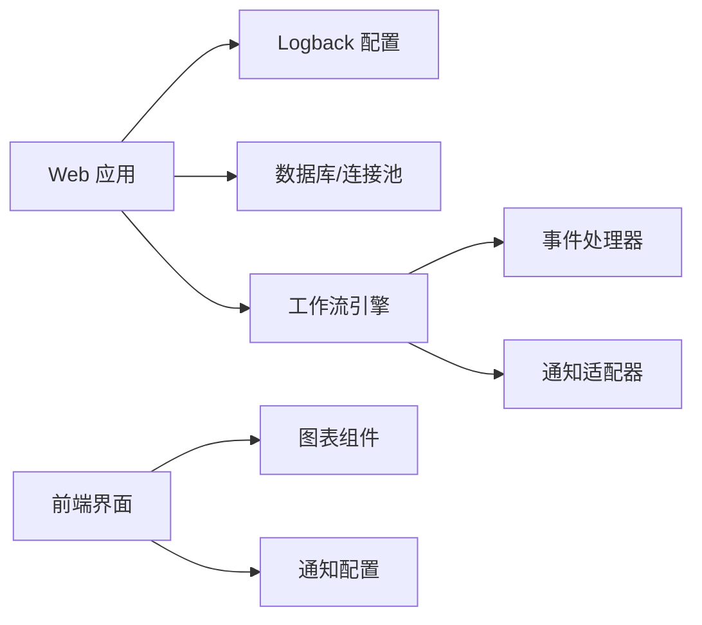

# 监控告警配置

<cite>
**本文引用的文件**
- [application.properties](file://antflow-web/src/main/resources/application.properties)
- [application-dev.properties](file://antflow-web/src/main/resources/application-dev.properties)
- [logback-spring.xml](file://antflow-web/src/main/resources/logback-spring.xml)
- [HttpLogAspect.java](file://antflow-engine/src/main/java/org/openoa/engine/conf/aspect/HttpLogAspect.java)
- [ProcessNoticeEnum.java](file://antflow-base/src/main/java/org/openoa/base/constant/enums/ProcessNoticeEnum.java)
- [SMSSendAdaptor.java](file://antflow-engine/src/main/java/org/openoa/engine/bpmnconf/adp/processnotice/SMSSendAdaptor.java)
- [TaskCompletedEventHandler.java](file://antflow-base/src/main/java/org/activiti/engine/impl/event/logger/handler/TaskCompletedEventHandler.java)
- [HistoricTaskInstance.java](file://antflow-base/src/main/java/org/activiti/engine/history/HistoricTaskInstance.java)
- [SupporttedDatabaseEnum.java](file://antflow-base/src/main/java/org/openoa/base/constant/enums/SupporttedDatabaseEnum.java)
- [DbSqlSessionFactory.java](file://antflow-base/src/main/java/org/activiti/engine/impl/db/DbSqlSessionFactory.java)
- [ProcessEngineConfigurationImpl.java](file://antflow-base/src/main/java/org/activiti/engine/impl/cfg/ProcessEngineConfigurationImpl.java)
- [index.vue](file://antflow-vue/src/views/index.vue)
- [eZheXianTu/index.vue](file://antflow-vue/src/components/ECharts/eZheXianTu/index.vue)
- [noticeConfig/index.vue](file://antflow-vue/src/components/Workflow/drawer/noticeConfig/index.vue)
</cite>

## 目录
1. [简介](#简介)
2. [项目结构](#项目结构)
3. [核心组件](#核心组件)
4. [架构总览](#架构总览)
5. [详细组件分析](#详细组件分析)
6. [依赖关系分析](#依赖关系分析)
7. [性能考量](#性能考量)
8. [故障排查指南](#故障排查指南)
9. [结论](#结论)
10. [附录](#附录)

## 简介
本指南面向运维团队，提供一套可落地的监控告警配置方案，覆盖应用性能监控（APM）、数据库性能监控（慢查询、连接池、锁等待）、工作流执行监控（流程实例、任务执行、节点统计）、系统健康检查、日志监控、错误率监控，并给出告警规则建议、通知渠道配置（邮件、短信、钉钉、企业微信）、告警升级策略、监控数据可视化与仪表板设计、历史数据分析等实践要点，帮助团队及时发现并处理系统问题。

## 项目结构
本项目采用多模块分层架构：后端由引擎与基础模块组成，前端基于 Vue 构建，数据库通过 Druid/Hikari 连接池管理，日志通过 Logback 输出到不同文件，工作流引擎基于 Activiti，具备完善的事件日志与历史数据能力。

**图表来源**
- [application-dev.properties:1-44](file://antflow-web/src/main/resources/application-dev.properties#L1-L44)
- [logback-spring.xml:1-94](file://antflow-web/src/main/resources/logback-spring.xml#L1-L94)
- [HttpLogAspect.java:1-129](file://antflow-engine/src/main/java/org/openoa/engine/conf/aspect/HttpLogAspect.java#L1-L129)

**章节来源**
- [application-dev.properties:1-44](file://antflow-web/src/main/resources/application-dev.properties#L1-L44)
- [logback-spring.xml:1-94](file://antflow-web/src/main/resources/logback-spring.xml#L1-L94)

## 核心组件
- 日志与审计：通过 Logback 将业务日志、SQL、慢 SQL 分类输出；通过操作日志切面记录请求参数、响应结果、耗时与异常标志。
- 通知渠道：定义邮件、短信、钉钉、企业微信等通知类型枚举，短信适配器预留实现接口。
- 工作流事件：任务完成事件处理器生成事件日志，包含持续时间等关键指标。
- 数据库支持：枚举支持多种数据库类型，引擎配置中包含数据库类型映射与方言特定 SQL。

**章节来源**
- [logback-spring.xml:1-94](file://antflow-web/src/main/resources/logback-spring.xml#L1-L94)
- [HttpLogAspect.java:1-129](file://antflow-engine/src/main/java/org/openoa/engine/conf/aspect/HttpLogAspect.java#L1-L129)
- [ProcessNoticeEnum.java:1-41](file://antflow-base/src/main/java/org/openoa/base/constant/enums/ProcessNoticeEnum.java#L1-L41)
- [SMSSendAdaptor.java:1-29](file://antflow-engine/src/main/java/org/openoa/engine/bpmnconf/adp/processnotice/SMSSendAdaptor.java#L1-L29)
- [TaskCompletedEventHandler.java:1-41](file://antflow-base/src/main/java/org/activiti/engine/impl/event/logger/handler/TaskCompletedEventHandler.java#L1-L41)
- [SupporttedDatabaseEnum.java:1-39](file://antflow-base/src/main/java/org/openoa/base/constant/enums/SupporttedDatabaseEnum.java#L1-L39)
- [ProcessEngineConfigurationImpl.java:762-793](file://antflow-base/src/main/java/org/activiti/engine/impl/cfg/ProcessEngineConfigurationImpl.java#L762-L793)

## 架构总览
下图展示从请求进入、日志采集、工作流事件记录到通知与可视化呈现的整体链路。

**图表来源**
- [HttpLogAspect.java:40-85](file://antflow-engine/src/main/java/org/openoa/engine/conf/aspect/HttpLogAspect.java#L40-L85)
- [logback-spring.xml:28-85](file://antflow-web/src/main/resources/logback-spring.xml#L28-L85)
- [TaskCompletedEventHandler.java:14-39](file://antflow-base/src/main/java/org/activiti/engine/impl/event/logger/handler/TaskCompletedEventHandler.java#L14-L39)
- [ProcessNoticeEnum.java:5-15](file://antflow-base/src/main/java/org/openoa/base/constant/enums/ProcessNoticeEnum.java#L5-L15)
- [SMSSendAdaptor.java:16-29](file://antflow-engine/src/main/java/org/openoa/engine/bpmnconf/adp/processnotice/SMSSendAdaptor.java#L16-L29)

## 详细组件分析

### 应用性能监控（APM）
- 请求耗时与异常：通过操作日志切面在方法前后记录耗时与异常标志，便于后续统计错误率与 P95/P99 延迟。
- 日志分类：业务日志、SQL、慢 SQL 分离输出，便于定位慢调用与异常。
- 可视化：前端提供 ECharts 组件，可用于构建延迟、错误率、吞吐量等图表。

**图表来源**
- [HttpLogAspect.java:40-85](file://antflow-engine/src/main/java/org/openoa/engine/conf/aspect/HttpLogAspect.java#L40-L85)

**章节来源**
- [HttpLogAspect.java:1-129](file://antflow-engine/src/main/java/org/openoa/engine/conf/aspect/HttpLogAspect.java#L1-L129)
- [logback-spring.xml:28-85](file://antflow-web/src/main/resources/logback-spring.xml#L28-L85)
- [eZheXianTu/index.vue:1-17](file://antflow-vue/src/components/ECharts/eZheXianTu/index.vue#L1-L17)

### 数据库性能监控
- 连接池配置：Druid/Hikari 参数包括最小空闲、初始大小、最大活跃、最大等待、移除超时、心跳检测等，可据此建立连接池使用率、排队等待、空闲连接等指标。
- 慢查询监控：通过 Logback 的慢 SQL 文件输出，结合数据库慢查询日志与 SQL 审计，建立慢查询阈值与趋势分析。
- 锁等待监控：可通过数据库锁等待、事务阻塞、行锁等待等指标进行观测，必要时结合数据库性能视图与 APM 的数据库调用链。
- 数据库类型支持：引擎配置包含多种数据库类型映射，便于在不同数据库上统一监控口径。

**图表来源**
- [application-dev.properties:7-21](file://antflow-web/src/main/resources/application-dev.properties#L7-L21)
- [logback-spring.xml:62-77](file://antflow-web/src/main/resources/logback-spring.xml#L62-L77)
- [DbSqlSessionFactory.java:60-204](file://antflow-base/src/main/java/org/activiti/engine/impl/db/DbSqlSessionFactory.java#L60-L204)
- [ProcessEngineConfigurationImpl.java:772-793](file://antflow-base/src/main/java/org/activiti/engine/impl/cfg/ProcessEngineConfigurationImpl.java#L772-L793)

**章节来源**
- [application-dev.properties:1-44](file://antflow-web/src/main/resources/application-dev.properties#L1-L44)
- [logback-spring.xml:1-94](file://antflow-web/src/main/resources/logback-spring.xml#L1-L94)
- [SupporttedDatabaseEnum.java:1-39](file://antflow-base/src/main/java/org/openoa/base/constant/enums/SupporttedDatabaseEnum.java#L1-L39)
- [DbSqlSessionFactory.java:1-207](file://antflow-base/src/main/java/org/activiti/engine/impl/db/DbSqlSessionFactory.java#L1-L207)
- [ProcessEngineConfigurationImpl.java:762-793](file://antflow-base/src/main/java/org/activiti/engine/impl/cfg/ProcessEngineConfigurationImpl.java#L762-L793)

### 工作流执行监控
- 任务完成事件：任务完成事件处理器记录任务持续时间、变量等信息，可用于统计任务平均时长、超时率、节点吞吐。
- 历史任务实例：提供任务持续时间、工作时长、认领时间等字段，便于计算节点效率与瓶颈。
- 通知配置：前端通知配置组件支持勾选通知类型与事件类型，后端通过通知枚举与适配器实现邮件、短信、钉钉、企业微信等渠道。

**图表来源**
- [TaskCompletedEventHandler.java:14-39](file://antflow-base/src/main/java/org/activiti/engine/impl/event/logger/handler/TaskCompletedEventHandler.java#L14-L39)
- [HistoricTaskInstance.java:38-54](file://antflow-base/src/main/java/org/activiti/engine/history/HistoricTaskInstance.java#L38-L54)
- [noticeConfig/index.vue:1-27](file://antflow-vue/src/components/Workflow/drawer/noticeConfig/index.vue#L1-L27)
- [ProcessNoticeEnum.java:5-15](file://antflow-base/src/main/java/org/openoa/base/constant/enums/ProcessNoticeEnum.java#L5-L15)

**章节来源**
- [TaskCompletedEventHandler.java:1-41](file://antflow-base/src/main/java/org/activiti/engine/impl/event/logger/handler/TaskCompletedEventHandler.java#L1-L41)
- [HistoricTaskInstance.java:1-54](file://antflow-base/src/main/java/org/activiti/engine/history/HistoricTaskInstance.java#L1-L54)
- [noticeConfig/index.vue:1-27](file://antflow-vue/src/components/Workflow/drawer/noticeConfig/index.vue#L1-L27)
- [ProcessNoticeEnum.java:1-41](file://antflow-base/src/main/java/org/openoa/base/constant/enums/ProcessNoticeEnum.java#L1-L41)

### 系统健康检查
- 健康探针：建议在网关或反向代理层配置健康检查路径，定期探测应用存活与数据库连通性。
- 关键指标：CPU、内存、线程池、连接池、GC、数据库连接可用性、慢查询数量、错误率等。
- 告警阈值：根据容量规划与SLA设定阈值，避免误报与漏报。

[本节为通用指导，无需具体文件引用]

### 日志监控配置
- 日志级别与输出：业务日志、SQL、慢 SQL 分别输出到不同文件，便于按主题检索与告警。
- 日志轮转：按日期压缩归档，保留周期建议结合存储成本与取证需求。
- 结构化日志：建议统一字段（请求ID、用户、方法、耗时、异常），便于下游分析。

**章节来源**
- [logback-spring.xml:1-94](file://antflow-web/src/main/resources/logback-spring.xml#L1-L94)

### 错误率监控
- 错误分类：区分业务异常与系统异常，分别统计错误率与错误分布。
- 指标口径：错误次数/总请求数、错误趋势、Top 失败接口、错误堆栈聚合。
- 告警触发：错误率超过阈值或环比增长显著时触发告警。

**章节来源**
- [HttpLogAspect.java:47-50](file://antflow-engine/src/main/java/org/openoa/engine/conf/aspect/HttpLogAspect.java#L47-L50)

### 告警规则配置
- 应用层
  - 响应时间：P95/P99 超过阈值
  - 错误率：错误占比超过阈值
  - 线程池：拒绝次数、队列长度
- 数据库层
  - 连接池：活跃连接占比、等待时间、超时次数
  - 慢查询：慢查询数量、慢查询占比
  - 锁等待：锁等待次数、阻塞事务数
- 工作流层
  - 任务超时：超时任务占比
  - 节点吞吐：节点处理速率下降
  - 通知失败：通知发送失败次数

[本节为通用指导，无需具体文件引用]

### 通知渠道设置
- 邮件：后端已内置邮件配置项，前端通知配置支持邮件类型。
- 短信：短信适配器预留实现，需接入第三方短信SDK。
- 钉钉/企业微信：通知类型枚举包含对应类型，前端支持勾选。

**章节来源**
- [application.properties:23-36](file://antflow-web/src/main/resources/application.properties#L23-L36)
- [ProcessNoticeEnum.java:5-15](file://antflow-base/src/main/java/org/openoa/base/constant/enums/ProcessNoticeEnum.java#L5-L15)
- [SMSSendAdaptor.java:16-29](file://antflow-engine/src/main/java/org/openoa/engine/bpmnconf/adp/processnotice/SMSSendAdaptor.java#L16-L29)

### 告警升级策略
- 一级告警：首次触发，发送至值班群组与负责人。
- 二级告警：未在时限内恢复，升级至更高级别负责人。
- 三级告警：长时间未恢复或影响范围扩大，启动应急流程与升级会议。

[本节为通用指导，无需具体文件引用]

### 监控数据可视化与仪表板
- 图表组件：前端提供折线图组件，可用于展示趋势。
- 仪表板：首页包含快捷入口与图表容器，可扩展为综合看板。
- 数据来源：日志、事件日志、数据库指标、工作流历史数据。

**章节来源**
- [index.vue:183-192](file://antflow-vue/src/views/index.vue#L183-L192)
- [eZheXianTu/index.vue:1-17](file://antflow-vue/src/components/ECharts/eZheXianTu/index.vue#L1-L17)

### 历史数据分析
- 事件日志：任务完成事件包含持续时间等字段，可用于历史趋势分析与容量评估。
- 操作日志：记录请求与响应摘要，支持回溯与审计。
- 慢查询：结合慢 SQL 日志与数据库慢查询日志，识别热点与优化点。

**章节来源**
- [TaskCompletedEventHandler.java:23-24](file://antflow-base/src/main/java/org/activiti/engine/impl/event/logger/handler/TaskCompletedEventHandler.java#L23-L24)
- [logback-spring.xml:62-77](file://antflow-web/src/main/resources/logback-spring.xml#L62-L77)

## 依赖关系分析
- Web 应用依赖日志配置与数据库连接池。
- 工作流引擎依赖事件日志与通知适配器。
- 前端依赖图表组件与通知配置界面。

**图表来源**
- [logback-spring.xml:1-94](file://antflow-web/src/main/resources/logback-spring.xml#L1-L94)
- [application-dev.properties:1-44](file://antflow-web/src/main/resources/application-dev.properties#L1-L44)
- [TaskCompletedEventHandler.java:14-39](file://antflow-base/src/main/java/org/activiti/engine/impl/event/logger/handler/TaskCompletedEventHandler.java#L14-L39)
- [ProcessNoticeEnum.java:5-15](file://antflow-base/src/main/java/org/openoa/base/constant/enums/ProcessNoticeEnum.java#L5-L15)
- [eZheXianTu/index.vue:1-17](file://antflow-vue/src/components/ECharts/eZheXianTu/index.vue#L1-L17)
- [noticeConfig/index.vue:1-27](file://antflow-vue/src/components/Workflow/drawer/noticeConfig/index.vue#L1-L27)

**章节来源**
- [application-dev.properties:1-44](file://antflow-web/src/main/resources/application-dev.properties#L1-L44)
- [logback-spring.xml:1-94](file://antflow-web/src/main/resources/logback-spring.xml#L1-L94)

## 性能考量
- 连接池参数：根据峰值并发与平均响应时间调整最大活跃、最小空闲、等待超时等参数，避免连接泄漏与排队风暴。
- 日志落盘：SQL 与慢 SQL 分离输出，避免 IO 竞争；合理设置滚动策略与保留周期。
- 工作流事件：事件日志写入频率较高，建议异步落库并限流，避免对主业务造成抖动。

[本节为通用指导，无需具体文件引用]

## 故障排查指南
- 请求异常：通过操作日志切面记录的异常标志与响应摘要定位问题。
- 慢查询：结合慢 SQL 日志与数据库慢查询日志，定位热点 SQL 并优化。
- 通知失败：检查通知类型配置与适配器实现，确认邮件/短信服务可用性。
- 数据库连接：关注连接池指标，排查连接泄漏与超时。

**章节来源**
- [HttpLogAspect.java:118-127](file://antflow-engine/src/main/java/org/openoa/engine/conf/aspect/HttpLogAspect.java#L118-L127)
- [logback-spring.xml:62-77](file://antflow-web/src/main/resources/logback-spring.xml#L62-L77)
- [SMSSendAdaptor.java:16-29](file://antflow-engine/src/main/java/org/openoa/engine/bpmnconf/adp/processnotice/SMSSendAdaptor.java#L16-L29)

## 结论
通过将日志、事件、数据库与工作流指标整合，结合可视化与通知体系，可形成闭环的监控告警方案。建议以“可观测性”为核心，持续完善指标体系与告警策略，提升问题发现与处置效率。

[本节为总结性内容，无需具体文件引用]

## 附录
- 配置文件位置与用途
  - [application.properties](file://antflow-web/src/main/resources/application.properties)：通用配置与邮件通知参数
  - [application-dev.properties](file://antflow-web/src/main/resources/application-dev.properties)：开发环境数据库与连接池配置
  - [logback-spring.xml](file://antflow-web/src/main/resources/logback-spring.xml)：日志输出与分类配置
- 前端组件
  - [index.vue](file://antflow-vue/src/views/index.vue)：首页与图表容器
  - [eZheXianTu/index.vue](file://antflow-vue/src/components/ECharts/eZheXianTu/index.vue)：折线图组件
  - [noticeConfig/index.vue](file://antflow-vue/src/components/Workflow/drawer/noticeConfig/index.vue)：通知配置界面

**章节来源**
- [application.properties:1-36](file://antflow-web/src/main/resources/application.properties#L1-L36)
- [application-dev.properties:1-44](file://antflow-web/src/main/resources/application-dev.properties#L1-L44)
- [logback-spring.xml:1-94](file://antflow-web/src/main/resources/logback-spring.xml#L1-L94)
- [index.vue:183-192](file://antflow-vue/src/views/index.vue#L183-L192)
- [eZheXianTu/index.vue:1-17](file://antflow-vue/src/components/ECharts/eZheXianTu/index.vue#L1-L17)
- [noticeConfig/index.vue:1-27](file://antflow-vue/src/components/Workflow/drawer/noticeConfig/index.vue#L1-L27)