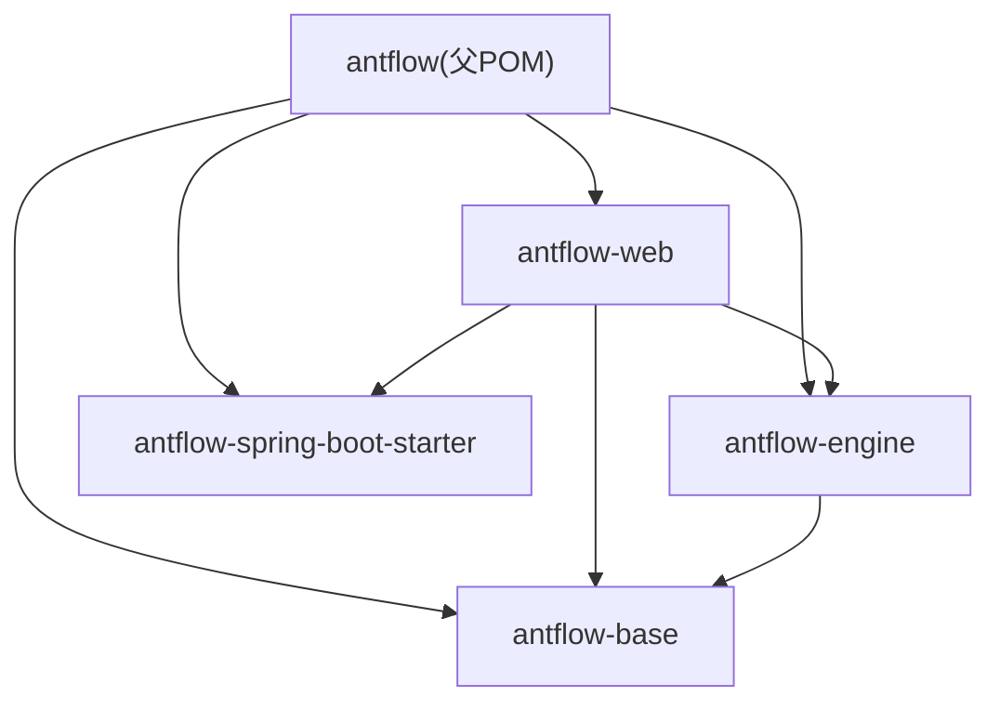
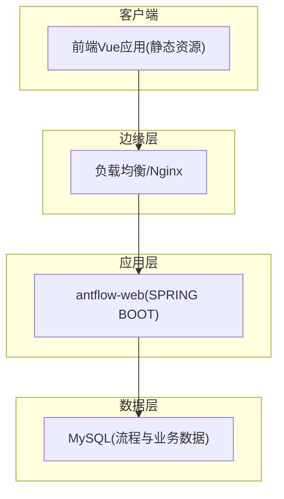
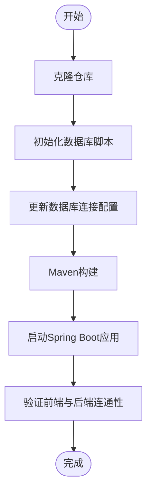
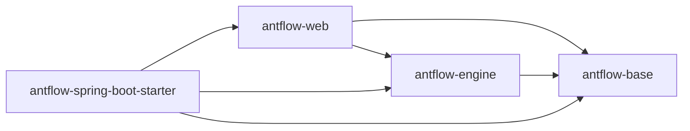

# 部署与配置

<cite>
**本文引用的文件**
- [pom.xml](file://pom.xml)
- [antflow-web/pom.xml](file://antflow-web/pom.xml)
- [antflow-web/src/main/resources/application.properties](file://antflow-web/src/main/resources/application.properties)
- [antflow-web/src/main/resources/application-dev.properties](file://antflow-web/src/main/resources/application-dev.properties)
- [antflow-web/src/main/resources/logback-spring.xml](file://antflow-web/src/main/resources/logback-spring.xml)
- [antflow-spring-boot-starter/src/main/java/org/openoa/starter/config/AntFlowAutoConfiguration.java](file://antflow-spring-boot-starter/src/main/java/org/openoa/starter/config/AntFlowAutoConfiguration.java)
- [antflow-spring-boot-starter/src/main/resources/META-INF/spring.factories](file://antflow-spring-boot-starter/src/main/resources/META-INF/spring.factories)
- [doc/系统介绍篇/21.开发环境搭建.md](file://doc/系统介绍篇/21.开发环境搭建.md)
- [doc/系统介绍篇/22.流程核心关键表说明.md](file://doc/系统介绍篇/22.流程核心关键表说明.md)
- [doc/高级篇/antflow多租户系统介绍与使用.md](file://doc/高级篇/antflow多租户系统介绍与使用.md)
- [script/act_init_db.sql](file://script/act_init_db.sql)
- [script/bpm_init_db.sql](file://script/bpm_init_db.sql)
- [script/bpm_init_db_data.sql](file://script/bpm_init_db_data.sql)
</cite>

## 目录
1. [简介](#简介)
2. [项目结构](#项目结构)
3. [核心组件](#核心组件)
4. [架构总览](#架构总览)
5. [详细组件分析](#详细组件分析)
6. [依赖分析](#依赖分析)
7. [性能考虑](#性能考虑)
8. [故障排查指南](#故障排查指南)
9. [结论](#结论)
10. [附录](#附录)

## 简介
本指南面向运维与开发团队，提供从开发环境搭建到生产部署、性能优化、多数据库与多租户支持、安全配置、容器化与负载均衡、监控告警、部署检查清单、故障排查与升级迁移的全流程说明。内容基于仓库中的Maven工程结构、Spring Boot配置、日志与自动装配机制、数据库初始化脚本及官方文档。

## 项目结构
AntFlow采用多模块Maven聚合工程，核心模块包括：
- antflow-base：基础能力与工具
- antflow-engine：基于Activiti的流程引擎实现
- antflow-spring-boot-starter：Spring Boot自动装配与组件扫描
- antflow-web：Spring Boot Web应用入口
- antflow-vue：前端Vue应用（部署时需构建产物）

**图示来源**
- [pom.xml:6-11](file://pom.xml#L6-L11)
- [antflow-web/pom.xml:20-47](file://antflow-web/pom.xml#L20-L47)

**章节来源**
- [pom.xml:6-11](file://pom.xml#L6-L11)
- [doc/系统介绍篇/21.开发环境搭建.md:33-58](file://doc/系统介绍篇/21.开发环境搭建.md#L33-L58)

## 核心组件
- 应用入口与打包：antflow-web通过Spring Boot Maven插件指定主类，打包为可执行JAR。
- 配置体系：application.properties作为全局入口，结合Maven profiles激活不同环境配置；application-dev.properties提供开发环境数据库与连接池参数。
- 日志系统：logback-spring.xml集中配置控制台与滚动文件输出，分别记录业务日志、SQL与慢查询日志。
- 自动装配：spring.factories声明AntFlowAutoConfiguration，自动扫描mapper与组件，简化集成。

**章节来源**
- [antflow-web/pom.xml:50-64](file://antflow-web/pom.xml#L50-L64)
- [antflow-web/src/main/resources/application.properties:1-36](file://antflow-web/src/main/resources/application.properties#L1-L36)
- [antflow-web/src/main/resources/application-dev.properties:1-44](file://antflow-web/src/main/resources/application-dev.properties#L1-L44)
- [antflow-web/src/main/resources/logback-spring.xml:1-94](file://antflow-web/src/main/resources/logback-spring.xml#L1-L94)
- [antflow-spring-boot-starter/src/main/resources/META-INF/spring.factories:1-2](file://antflow-spring-boot-starter/src/main/resources/META-INF/spring.factories#L1-L2)
- [antflow-spring-boot-starter/src/main/java/org/openoa/starter/config/AntFlowAutoConfiguration.java:1-19](file://antflow-spring-boot-starter/src/main/java/org/openoa/starter/config/AntFlowAutoConfiguration.java#L1-L19)

## 架构总览
下图展示开发与生产环境的典型部署拓扑：前端通过Nginx反向代理至后端服务，后端连接MySQL数据库；日志落盘并可接入集中式日志系统；可选引入消息队列或外部系统进行集成。

[本图为概念性架构示意，不直接对应具体源文件，故无“图示来源”]

## 详细组件分析

### 开发环境搭建
- 先决条件：JDK 8/21、Maven、MySQL 5.7+、Node.js、Git
- 后端步骤：克隆仓库、初始化数据库（执行脚本）、更新数据库连接、构建并启动
- 前端步骤：进入antflow-vue目录，安装依赖并启动开发服务器；生产构建产出静态资源供Nginx使用
- 验证：访问前端与后端端口，确认无错误日志

**章节来源**
- [doc/系统介绍篇/21.开发环境搭建.md:18-100](file://doc/系统介绍篇/21.开发环境搭建.md#L18-L100)
- [script/act_init_db.sql](file://script/act_init_db.sql)
- [script/bpm_init_db.sql](file://script/bpm_init_db.sql)
- [script/bpm_init_db_data.sql](file://script/bpm_init_db_data.sql)

### 生产环境部署最佳实践
- 服务编排：使用Docker容器化后端应用，挂载日志目录与配置文件；前端静态资源由Nginx提供
- 配置管理：通过环境变量覆盖application-dev.properties中的敏感配置；使用Kubernetes ConfigMap/Secret管理
- 数据库：生产建议使用高可用MySQL集群或云数据库；启用只读副本分担查询压力
- 反向代理：Nginx统一入口，开启gzip压缩、缓存静态资源、配置超时与限流
- 安全加固：关闭调试接口、限制内网访问、启用HTTPS、配置WAF与DDoS防护

[本节为通用实践说明，不直接分析具体源文件，故无“章节来源”]

### 性能优化配置方案
- 连接池与数据库
  - Druid/HikariCP参数调优：最大连接数、空闲超时、连接生命周期、心跳检测
  - SQL日志与慢查询：开启SQL与慢查询日志，定期归档与清理
- 应用层
  - 合理设置线程池大小与队列长度；避免长事务；缓存热点数据
  - 启用GZIP压缩与静态资源缓存
- 监控与追踪
  - 结合日志与APM系统，定位慢请求与异常堆栈

**章节来源**
- [antflow-web/src/main/resources/application-dev.properties:7-24](file://antflow-web/src/main/resources/application-dev.properties#L7-L24)
- [antflow-web/src/main/resources/logback-spring.xml:45-77](file://antflow-web/src/main/resources/logback-spring.xml#L45-L77)

### 多数据库支持配置方法
- 支持范围：官方文档涵盖Oracle、PostgreSQL、SQLServer、达梦、金仓、南大通用、PolarDB、MongoDB等多种数据库
- 配置要点：在application-dev.properties中切换数据源URL与驱动；确保对应驱动依赖存在；按目标数据库调整方言与连接参数
- 初始化：使用提供的SQL脚本初始化数据库架构与演示数据

**章节来源**
- [doc/系统介绍篇/22.流程核心关键表说明.md:152-200](file://doc/系统介绍篇/22.流程核心关键表说明.md#L152-L200)
- [antflow-web/src/main/resources/application-dev.properties:3-6](file://antflow-web/src/main/resources/application-dev.properties#L3-L6)

### 多租户部署实现方式
- 两种模式
  - 多数据源多租户：每个租户独立数据库，物理隔离，适合SaaS与大型客户
  - 单库多租户：共享数据库，通过tenantId区分租户，适合中小体量场景
- 非严格模式：可在单库多租户下实现跨租户流程审批，满足集团多子公司场景

**章节来源**
- [doc/高级篇/antflow多租户系统介绍与使用.md:1-4](file://doc/高级篇/antflow多租户系统介绍与使用.md#L1-L4)
- [antflow-web/src/main/resources/application-dev.properties:37-44](file://antflow-web/src/main/resources/application-dev.properties#L37-L44)

### 安全配置要点
- 邮件通知：配置SMTP主机、账号与密码；建议使用专用应用密码
- SaaS模式：full-sass-mode用于租户完全独立部署场景
- 其他：生产环境建议启用HTTPS、限制内网访问、关闭调试端点、定期轮换密钥

**章节来源**
- [antflow-web/src/main/resources/application.properties:23-36](file://antflow-web/src/main/resources/application.properties#L23-L36)
- [antflow-web/src/main/resources/application.properties:12-14](file://antflow-web/src/main/resources/application.properties#L12-L14)

### 容器化部署方案
- 后端镜像：基于JRE镜像，复制可执行JAR与配置文件；暴露HTTP端口；挂载日志卷
- 前端镜像：Nginx镜像，复制构建产物；配置静态资源与反向代理
- 编排：使用Docker Compose或Kubernetes部署；使用ConfigMap管理配置，Secret管理密钥

[本节为通用实践说明，不直接分析具体源文件，故无“章节来源”]

### 负载均衡配置
- Nginx：反向代理至多个后端实例；配置健康检查、超时与重试策略
- 会话：若使用粘性会话，需配合后端会话共享或无状态设计
- 网络：确保数据库与应用在同一VPC或子网，降低延迟

[本节为通用实践说明，不直接分析具体源文件，故无“章节来源”]

### 监控告警设置
- 日志：按天滚动与压缩，保留合理周期；接入集中式日志平台
- 指标：CPU、内存、连接池使用率、慢查询数量、错误率
- 告警：阈值触发与自动化恢复预案；结合值班流程

**章节来源**
- [antflow-web/src/main/resources/logback-spring.xml:28-77](file://antflow-web/src/main/resources/logback-spring.xml#L28-L77)

## 依赖分析
- 模块依赖：antflow-web依赖antflow-base与antflow-engine；antflow-engine依赖antflow-base；starter提供自动装配
- Maven Profile：通过profiles激活不同环境配置，过滤application-${activatedProperties}.properties
- 自动装配：spring.factories加载AntFlowAutoConfiguration，完成组件扫描与Mapper注册

**图示来源**
- [antflow-web/pom.xml:20-47](file://antflow-web/pom.xml#L20-L47)
- [pom.xml:6-11](file://pom.xml#L6-L11)

**章节来源**
- [pom.xml:142-172](file://pom.xml#L142-L172)
- [antflow-spring-boot-starter/src/main/resources/META-INF/spring.factories:1-2](file://antflow-spring-boot-starter/src/main/resources/META-INF/spring.factories#L1-L2)

## 性能考虑
- 数据库层面：合理索引、分区、只读分离；连接池参数与SQL日志调优
- 应用层面：线程池、缓存、异步化；静态资源与GZIP
- 运维层面：容量规划、压测、灰度发布

[本节为通用指导，不直接分析具体源文件，故无“章节来源”]

## 故障排查指南
- 启动失败
  - 检查端口占用与数据库连通性
  - 查看控制台与日志文件，定位异常堆栈
- 数据库问题
  - 确认初始化脚本执行顺序与结果
  - 校验驱动与方言配置
- 日志定位
  - 关注SQL与慢查询日志，定位瓶颈
- 常见问题
  - 循环依赖：根据文档提示设置允许循环依赖
  - 前端无法访问：确认Nginx代理与静态资源路径

**章节来源**
- [doc/系统介绍篇/21.开发环境搭建.md:243-256](file://doc/系统介绍篇/21.开发环境搭建.md#L243-L256)
- [antflow-web/src/main/resources/application-dev.properties:34-35](file://antflow-web/src/main/resources/application-dev.properties#L34-L35)
- [antflow-web/src/main/resources/logback-spring.xml:79-85](file://antflow-web/src/main/resources/logback-spring.xml#L79-L85)

## 结论
通过本指南，运维与开发团队可基于Maven多模块工程与Spring Boot自动装配机制，完成从开发到生产的全链路部署与维护。建议在生产环境中结合容器化、负载均衡、集中监控与完善的变更流程，确保系统稳定与可演进。

## 附录

### 部署检查清单
- 环境准备：JDK、Maven、MySQL、Node.js、Git
- 数据库：创建库、执行初始化脚本、核对表结构
- 配置：更新数据库连接、邮件配置、日志路径
- 构建：Maven构建后端与前端，生成可执行JAR与静态资源
- 部署：容器化部署、挂载日志与配置、Nginx反代
- 验证：健康检查、接口测试、日志观察

**章节来源**
- [doc/系统介绍篇/21.开发环境搭建.md:18-100](file://doc/系统介绍篇/21.开发环境搭建.md#L18-L100)
- [script/act_init_db.sql](file://script/act_init_db.sql)
- [script/bpm_init_db.sql](file://script/bpm_init_db.sql)
- [script/bpm_init_db_data.sql](file://script/bpm_init_db_data.sql)

### 升级与迁移方案
- 版本升级：评估依赖兼容性，逐步升级Spring Boot与第三方库
- 数据迁移：备份数据库，执行迁移脚本，灰度验证后再全量切换
- 配置迁移：将application-dev.properties中的敏感配置迁移到环境变量或密钥管理

**章节来源**
- [pom.xml:23-29](file://pom.xml#L23-L29)
- [antflow-web/src/main/resources/application-dev.properties:1-44](file://antflow-web/src/main/resources/application-dev.properties#L1-L44)