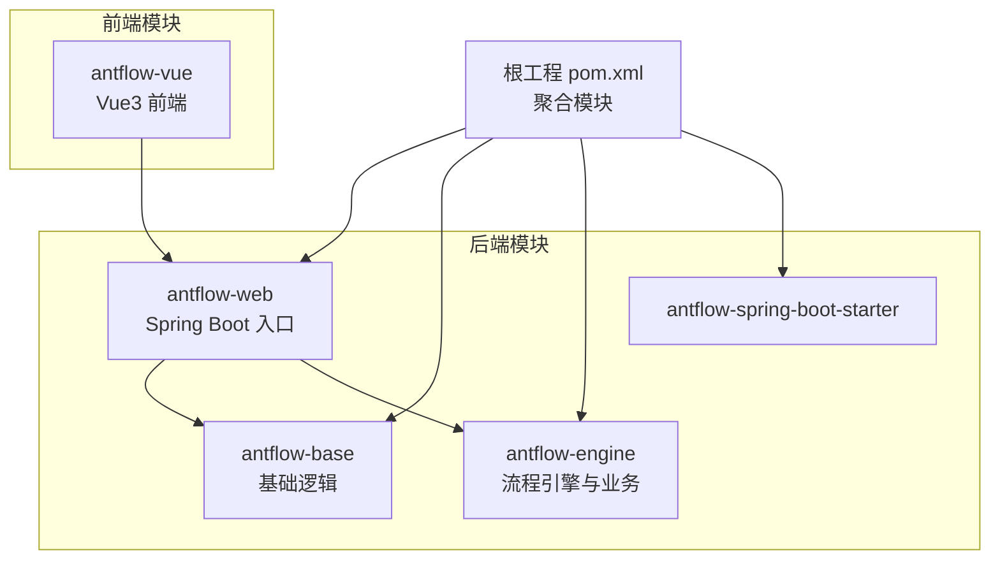
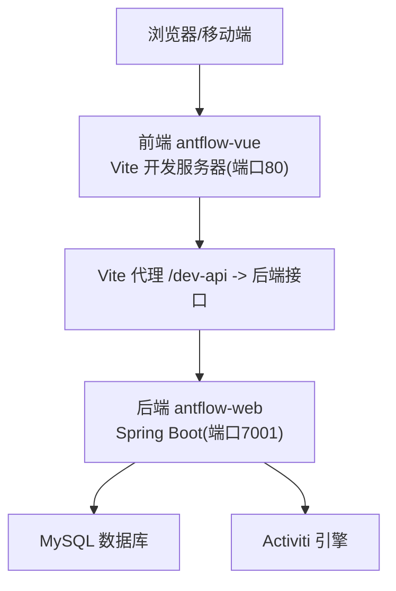
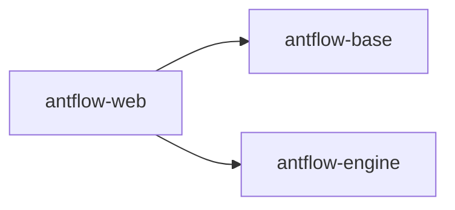

# 快速开始

<cite>
**本文引用的文件**
- [README.zh_CN.md](file://README.zh_CN.md)
- [readme.md](file://readme.md)
- [pom.xml（根工程）](file://pom.xml)
- [pom.xml（antflow-web）](file://antflow-web/pom.xml)
- [pom.xml（antflow-engine）](file://antflow-engine/pom.xml)
- [pom.xml（antflow-base）](file://antflow-base/pom.xml)
- [application-dev.properties（antflow-web）](file://antflow-web/src/main/resources/application-dev.properties)
- [AntFlowApplication.java（antflow-web）](file://antflow-web/src/main/java/org/openoa/AntFlowApplication.java)
- [vite.config.js（antflow-vue）](file://antflow-vue/vite.config.js)
- [package.json（antflow-vue）](file://antflow-vue/package.json)
- [act_init_db.sql](file://script/act_init_db.sql)
- [bpm_init_db.sql](file://script/bpm_init_db.sql)
- [bpm_init_db_data.sql](file://script/bpm_init_db_data.sql)
</cite>

## 目录
1. [简介](#简介)
2. [项目结构](#项目结构)
3. [核心组件](#核心组件)
4. [架构总览](#架构总览)
5. [详细组件分析](#详细组件分析)
6. [依赖分析](#依赖分析)
7. [性能考虑](#性能考虑)
8. [故障排除指南](#故障排除指南)
9. [结论](#结论)
10. [附录](#附录)

## 简介
本指南面向首次接触 AntFlow 的用户，目标是在本地快速完成环境准备、数据库初始化、前后端安装与启动，并验证第一个工作流实例的端到端运行。文档覆盖以下要点：
- 环境准备：Java 版本要求、Node.js 版本要求、数据库准备与初始化
- 前后端分别的安装与启动流程：命令行步骤、关键配置修改
- 数据库初始化：act_init_db.sql 与 bpm_init_db.sql 的作用与执行顺序
- 常见问题与故障排除
- 端到端启动验证步骤
- 不同操作系统下的注意事项与差异

## 项目结构
AntFlow 采用多模块 Maven 工程组织，包含后端 Web 入口、基础引擎与核心逻辑、Spring Boot Starter 等模块；前端为独立的 Vue3 项目，通过代理访问后端接口。

图表来源
- [pom.xml（根工程）:6-10](file://pom.xml#L6-L10)
- [pom.xml（antflow-web）:10-48](file://antflow-web/pom.xml#L10-L48)
- [pom.xml（antflow-engine）:7-17](file://antflow-engine/pom.xml#L7-L17)
- [pom.xml（antflow-base）:8-17](file://antflow-base/pom.xml#L8-L17)

章节来源
- [pom.xml（根工程）:6-10](file://pom.xml#L6-L10)
- [pom.xml（antflow-web）:10-48](file://antflow-web/pom.xml#L10-L48)
- [pom.xml（antflow-engine）:7-17](file://antflow-engine/pom.xml#L7-L17)
- [pom.xml（antflow-base）:8-17](file://antflow-base/pom.xml#L8-L17)

## 核心组件
- 后端（Spring Boot）
  - 主入口类：org.openoa.AntFlowApplication
  - 默认端口：7001
  - 数据源：MySQL 5.7+，Druid/Hikari 连接池配置
  - Activiti：禁用自动建表（spring.activiti.database-schema-update=none）
- 前端（Vue3）
  - 默认开发端口：80
  - 通过 /dev-api 代理到后端接口（默认 http://localhost:8080）
  - 依赖：Vue 3.5.16、Element Plus、Axios、Pinia、路由等

章节来源
- [AntFlowApplication.java（antflow-web）:9-13](file://antflow-web/src/main/java/org/openoa/AntFlowApplication.java#L9-L13)
- [application-dev.properties（antflow-web）:1-44](file://antflow-web/src/main/resources/application-dev.properties#L1-L44)
- [vite.config.js（antflow-vue）:64-81](file://antflow-vue/vite.config.js#L64-L81)
- [package.json（antflow-vue）:18-40](file://antflow-vue/package.json#L18-L40)

## 架构总览
AntFlow 前后端分离部署，前端通过 Vite 代理访问后端接口；后端基于 Spring Boot 与 Activiti 引擎，使用 MySQL 存储流程与业务数据。

图表来源
- [vite.config.js（antflow-vue）:68-80](file://antflow-vue/vite.config.js#L68-L80)
- [application-dev.properties（antflow-web）:1-6](file://antflow-web/src/main/resources/application-dev.properties#L1-L6)

章节来源
- [vite.config.js（antflow-vue）:64-81](file://antflow-vue/vite.config.js#L64-L81)
- [application-dev.properties（antflow-web）:1-6](file://antflow-web/src/main/resources/application-dev.properties#L1-L6)

## 详细组件分析

### 环境准备
- Java 版本
  - 主分支为 Java 8；如使用更高版本，请切换到 java17_support 分支
- Node.js 版本
  - 前端开发要求 Node.js V16.20.0 及以上
- 数据库
  - MySQL 5.7+
  - 后端禁用自动建表，需手动执行初始化 SQL

章节来源
- [README.zh_CN.md:64-68](file://README.zh_CN.md#L64-L68)
- [README.zh_CN.md:92-110](file://README.zh_CN.md#L92-L110)
- [application-dev.properties（antflow-web）:34-35](file://antflow-web/src/main/resources/application-dev.properties#L34-L35)

### 数据库初始化
- 初始化顺序
  1) 执行 act_init_db.sql（创建 Activiti 核心表与属性表）
  2) 执行 bpm_init_db.sql（创建 AntFlow 流程与业务配置表）
  3) 可选：执行 bpm_init_db_data.sql（插入演示数据，便于 POC 验证）
- 作用说明
  - act_init_db.sql：创建 Activiti 引擎所需的基础表（如部署、流程定义、运行时执行、历史实例、身份信息等），并初始化引擎属性
  - bpm_init_db.sql：创建 AntFlow 自定义流程配置表（如流程配置、节点配置、变量、通知模板、任务配置等）
  - bpm_init_db_data.sql：插入演示用户、角色、部门与审批人规则字典数据，便于快速验证流程

章节来源
- [act_init_db.sql:1-470](file://script/act_init_db.sql#L1-L470)
- [bpm_init_db.sql:1-2020](file://script/bpm_init_db.sql#L1-L2020)
- [bpm_init_db_data.sql:1-104](file://script/bpm_init_db_data.sql#L1-L104)

### 后端安装与启动
- 步骤
  1) 下载项目并进入 antflow-web 模块
  2) 修改 application-dev.properties 中的数据库连接信息（URL、用户名、密码）
  3) 在数据库中新建 antflow 数据库
  4) 执行数据库初始化脚本（顺序：act_init_db.sql → bpm_init_db.sql → bpm_init_db_data.sql）
  5) 在 antflow-web 模块根目录执行 Maven 启动命令
- 关键配置
  - server.port=7001
  - spring.datasource.*：数据库连接、连接池参数
  - spring.activiti.database-schema-update=none：禁用自动建表
- 启动入口
  - org.openoa.AntFlowApplication.main()

章节来源
- [application-dev.properties（antflow-web）:1-44](file://antflow-web/src/main/resources/application-dev.properties#L1-L44)
- [AntFlowApplication.java（antflow-web）:9-13](file://antflow-web/src/main/java/org/openoa/AntFlowApplication.java#L9-L13)
- [README.zh_CN.md:112-119](file://README.zh_CN.md#L112-L119)

### 前端安装与启动
- 步骤
  1) 进入 antflow-vue 目录
  2) 安装依赖（建议使用国内镜像源）
  3) 启动开发服务器
  4) 如需构建测试/生产环境，使用相应 npm run 命令
- 关键配置
  - 默认开发端口：80
  - 代理配置：/dev-api 代理到后端接口（默认 http://localhost:8080）
  - 依赖：Vue 3.5.16、Element Plus、Axios、Pinia、路由等

章节来源
- [README.zh_CN.md:90-110](file://README.zh_CN.md#L90-L110)
- [vite.config.js（antflow-vue）:64-81](file://antflow-vue/vite.config.js#L64-L81)
- [package.json（antflow-vue）:18-40](file://antflow-vue/package.json#L18-L40)

### 端到端启动验证
- 启动顺序
  1) 启动后端（antflow-web）
  2) 启动前端（antflow-vue）
- 预期结果
  - 前端访问 http://localhost（默认开发端口 80）
  - 通过 /dev-api 代理访问后端接口（默认后端端口 7001）
  - 登录系统后，可在“流程设计”中创建或导入流程，并发起“开始流程”进行验证

章节来源
- [vite.config.js（antflow-vue）:68-80](file://antflow-vue/vite.config.js#L68-L80)
- [application-dev.properties（antflow-web）:1-6](file://antflow-web/src/main/resources/application-dev.properties#L1-L6)

## 依赖分析
后端模块间依赖关系如下：

图表来源
- [pom.xml（antflow-web）:20-41](file://antflow-web/pom.xml#L20-L41)

章节来源
- [pom.xml（antflow-web）:20-41](file://antflow-web/pom.xml#L20-L41)

## 性能考虑
- 连接池与日志
  - Druid/Hikari 连接池参数已在配置中给出，可根据并发与资源情况调整
  - MyBatis 日志输出级别可按需开启，便于调试但会影响性能
- 数据库
  - 建议在生产环境启用合适的索引与分区策略，关注慢查询日志
- 前端
  - 生产构建时关闭 sourcemap，减少体积与加载时间

章节来源
- [application-dev.properties（antflow-web）:7-24](file://antflow-web/src/main/resources/application-dev.properties#L7-L24)
- [application-dev.properties（antflow-web）:27-32](file://antflow-web/src/main/resources/application-dev.properties#L27-L32)

## 故障排除指南
- 启动后端报数据库连接错误
  - 检查 application-dev.properties 中的 spring.datasource.url、username、password 是否正确
  - 确认 antflow 数据库已创建且网络可达
- 启动后端报 Activiti 表缺失
  - 确保已按顺序执行 act_init_db.sql 与 bpm_init_db.sql
  - 确认 spring.activiti.database-schema-update=none 已生效
- 前端无法访问后端接口
  - 检查 vite.config.js 中的 /dev-api 代理配置与后端端口
  - 确认后端已启动并监听 7001 端口
- 前端登录后页面空白或接口 404
  - 检查代理目标地址与后端接口路径是否匹配
  - 确认后端未启用额外的安全拦截导致跨域问题

章节来源
- [application-dev.properties（antflow-web）:1-44](file://antflow-web/src/main/resources/application-dev.properties#L1-L44)
- [vite.config.js（antflow-vue）:68-80](file://antflow-vue/vite.config.js#L68-L80)

## 结论
按照本指南完成环境准备、数据库初始化与前后端启动后，您即可在本地运行 AntFlow 并验证第一个工作流实例。如需进一步扩展，可参考项目文档与示例，逐步接入企业现有用户体系与业务系统。

## 附录

### 不同操作系统下的注意事项
- Windows
  - 使用 CMD 或 PowerShell 执行 Maven 与 npm 命令
  - 注意路径分隔符与大小写敏感性
- macOS/Linux
  - 使用终端执行命令，注意权限与防火墙设置
  - 建议使用本地 MySQL 实例或 Docker 容器

### 常用命令清单
- 后端启动
  - 在 antflow-web 目录执行 Maven 启动命令
- 前端启动
  - 在 antflow-vue 目录执行安装与启动命令
- 构建
  - 前端：npm run build:prod 或 npm run build:stage

章节来源
- [README.zh_CN.md:90-110](file://README.zh_CN.md#L90-L110)
- [README.zh_CN.md:112-119](file://README.zh_CN.md#L112-L119)