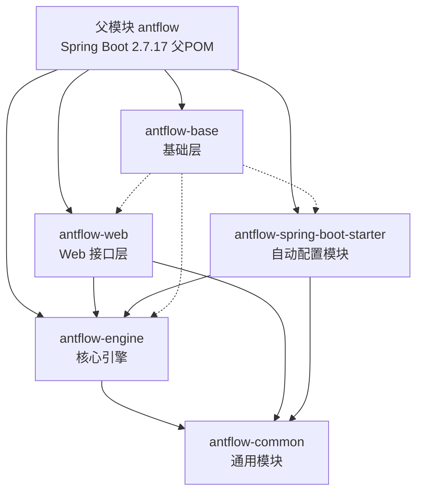
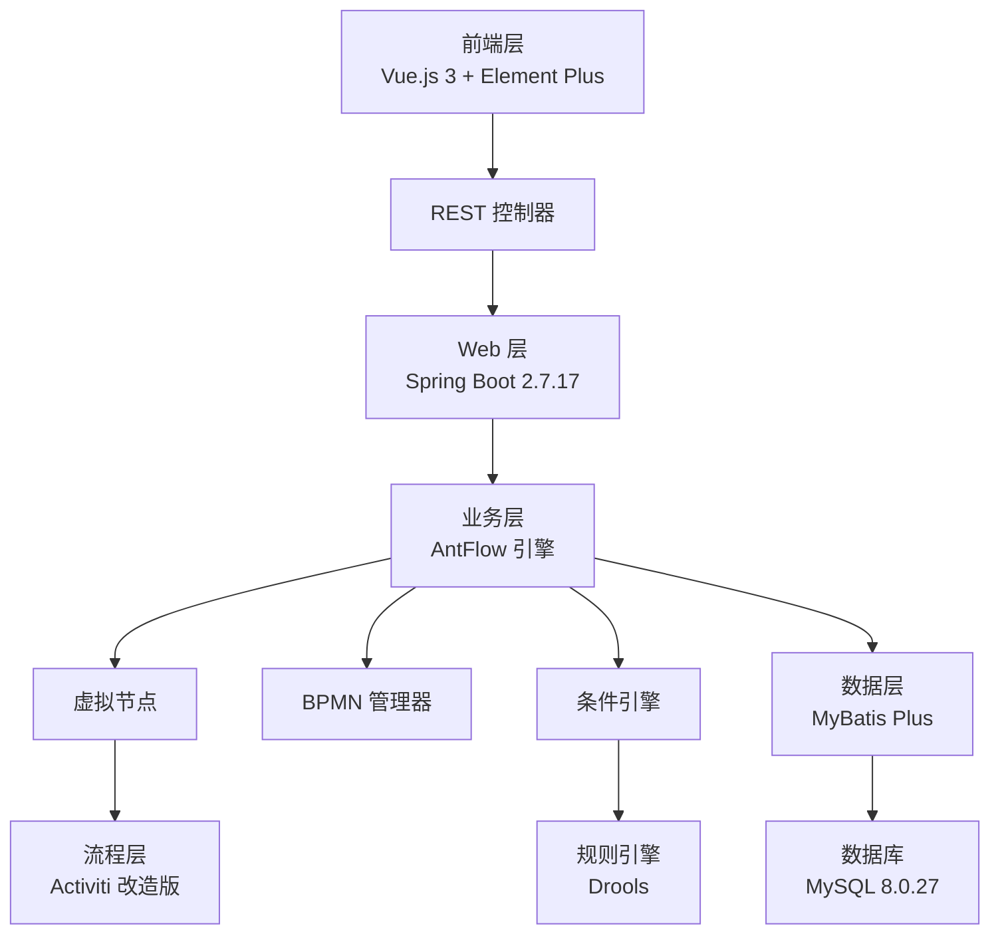
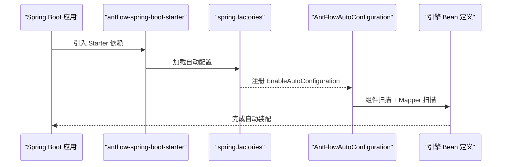
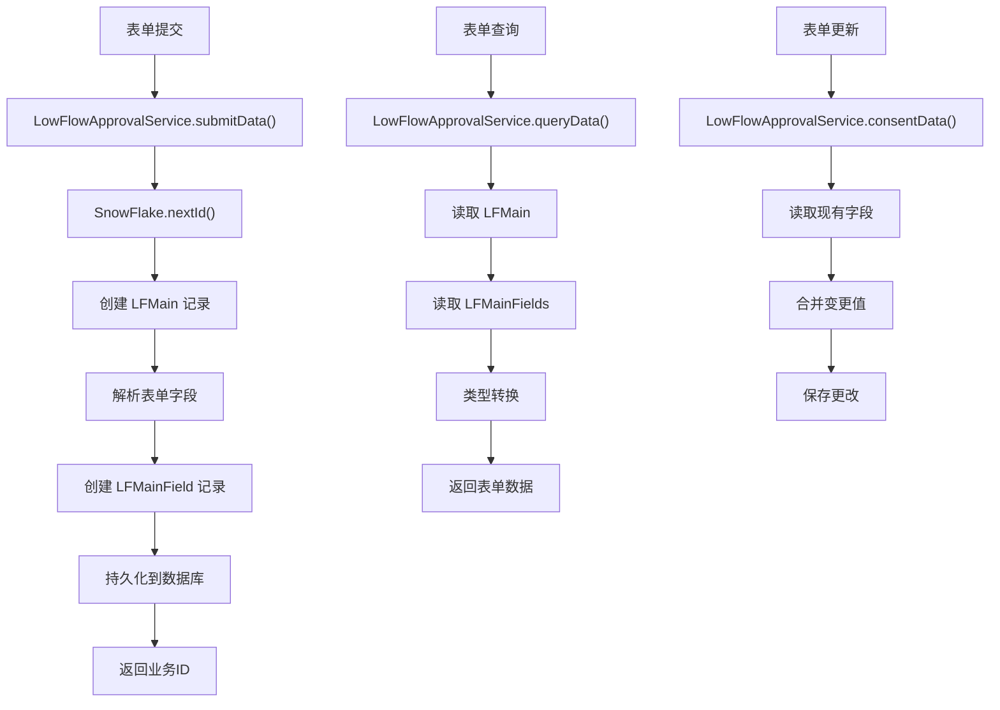
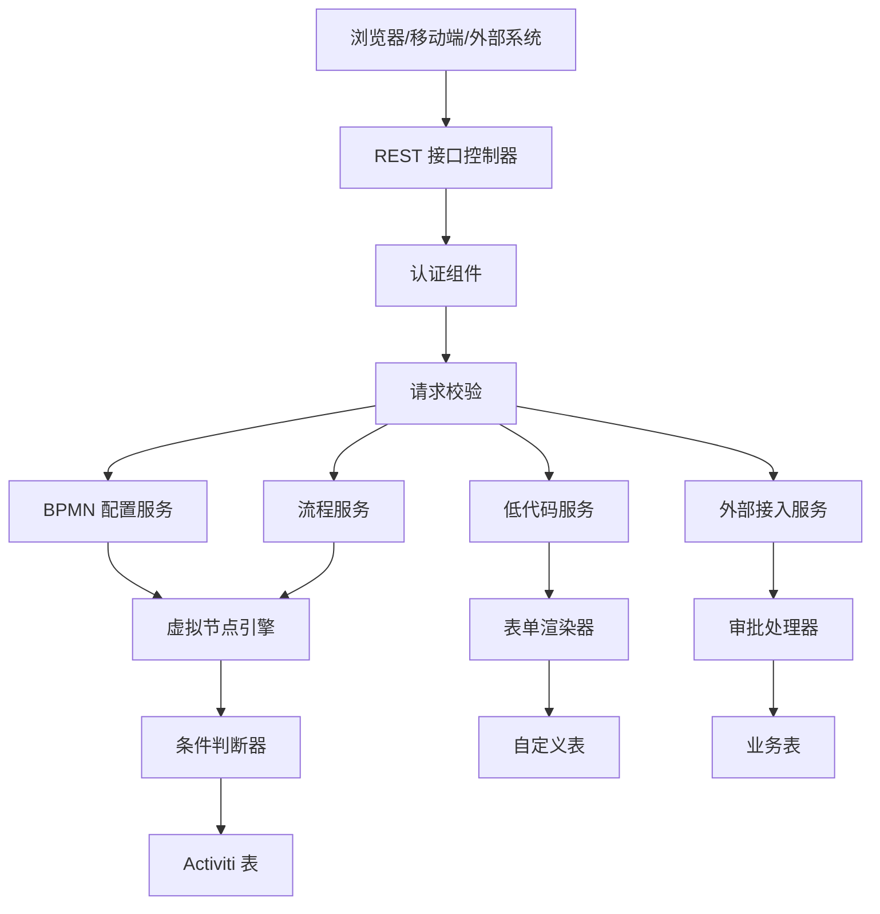
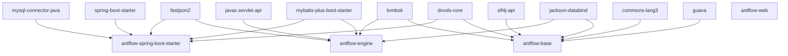

# 技术栈与架构

<cite>
**本文引用的文件**
- [pom.xml](file://pom.xml)
- [antflow-base/pom.xml](file://antflow-base/pom.xml)
- [antflow-engine/pom.xml](file://antflow-engine/pom.xml)
- [antflow-web/pom.xml](file://antflow-web/pom.xml)
- [antflow-spring-boot-starter/pom.xml](file://antflow-spring-boot-starter/pom.xml)
- [AntFlowApplication.java](file://antflow-web/src/main/java/org/openoa/AntFlowApplication.java)
- [AntFlowAutoConfiguration.java](file://antflow-spring-boot-starter/src/main/java/org/openoa/starter/config/AntFlowAutoConfiguration.java)
- [package.json](file://antflow-vue/package.json)
- [1.AntFlow介绍.md](file://doc/系统介绍篇/1.AntFlow介绍.md)
- [2.AntFlow_系统架构.md](file://doc/系统介绍篇/2.AntFlow_系统架构.md)
- [4.后端系统.md](file://doc/系统介绍篇/4.后端系统.md)
- [5.模块系统和自动装配.md](file://doc/系统介绍篇/5.模块系统和自动装配.md)
</cite>

## 目录
1. [简介](#简介)
2. [项目结构](#项目结构)
3. [核心组件](#核心组件)
4. [架构总览](#架构总览)
5. [详细组件分析](#详细组件分析)
6. [依赖分析](#依赖分析)
7. [性能考虑](#性能考虑)
8. [故障排查指南](#故障排查指南)
9. [结论](#结论)
10. [附录](#附录)

## 简介
AntFlow 是一个企业级低代码工作流引擎平台，构建于改进版 Activiti 引擎之上，提供图形化流程设计、低代码表单与灵活的任务流控制。系统采用前后端分离、模块化与自动装配设计，支持独立部署与嵌入式集成。

## 项目结构
AntFlow 采用多模块 Maven 架构，四大模块职责清晰：
- antflow-base：基础工具与公共抽象
- antflow-engine：核心引擎与业务逻辑
- antflow-web：Web 接口与应用主模块
- antflow-spring-boot-starter：自动配置与依赖聚合
- antflow-common：通用模块（被 engine/web/starter 依赖）

图表来源
- [pom.xml:6-11](file://pom.xml#L6-L11)
- [antflow-engine/pom.xml:22-33](file://antflow-engine/pom.xml#L22-L33)
- [antflow-web/pom.xml:20-41](file://antflow-web/pom.xml#L20-L41)
- [antflow-spring-boot-starter/pom.xml:35-58](file://antflow-spring-boot-starter/pom.xml#L35-L58)

章节来源
- [pom.xml:6-11](file://pom.xml#L6-L11)
- [4.后端系统.md:7-86](file://doc/系统介绍篇/4.后端系统.md#L7-L86)
- [5.模块系统和自动装配.md:6-51](file://doc/系统介绍篇/5.模块系统和自动装配.md#L6-L51)

## 核心组件
- 后端框架：Spring Boot 2.7.17
- 工作流引擎：改进版 Activiti 5.x
- ORM 框架：MyBatis Plus 3.5.1
- 数据库：MySQL 8.0.27（项目中声明）
- 前端框架：Vue.js 3 + Element Plus + Pinia + Vue Router + Axios
- 构建工具：Maven（多环境 Profile）

章节来源
- [1.AntFlow介绍.md:237-247](file://doc/系统介绍篇/1.AntFlow介绍.md#L237-L247)
- [2.AntFlow_系统架构.md:124-132](file://doc/系统介绍篇/2.AntFlow_系统架构.md#L124-L132)
- [4.后端系统.md:155-170](file://doc/系统介绍篇/4.后端系统.md#L155-L170)
- [package.json:18-40](file://antflow-vue/package.json#L18-L40)

## 架构总览
AntFlow 采用分层架构：前端层（Vue）、Web 层（Spring Boot）、业务层（AntFlow 引擎）、流程层（Activiti/Drools）、数据层（MyBatis Plus + MySQL）。系统通过 Spring Boot Starter 自动装配，实现零配置快速集成。

图表来源
- [2.AntFlow_系统架构.md:63-122](file://doc/系统介绍篇/2.AntFlow_系统架构.md#L63-L122)
- [4.后端系统.md:155-170](file://doc/系统介绍篇/4.后端系统.md#L155-L170)

章节来源
- [2.AntFlow_系统架构.md:1-122](file://doc/系统介绍篇/2.AntFlow_系统架构.md#L1-L122)
- [4.后端系统.md:153-170](file://doc/系统介绍篇/4.后端系统.md#L153-L170)

## 详细组件分析

### 技术栈与选型说明
- Java 与 Spring 生态
  - 采用 Spring Boot 2.7.17，提供自动配置、Starter 与生产就绪特性，降低集成成本。
  - 使用 MyBatis Plus 3.5.1，提升 CRUD 与分页效率，减少 XML 映射工作量。
- 工作流引擎
  - 基于改进版 Activiti 5.x，提供 BPMN 2.0 支持与灵活的节点类型；通过虚拟节点抽象屏蔽引擎差异，增强可扩展性。
- 前端生态
  - Vue.js 3 + Element Plus + Pinia + Vue Router + Axios，构建现代化、可维护的前端界面。
- 数据库与连接池
  - MySQL 8.0.27 + Druid 1.1.17，兼顾性能与稳定性。
- JSON 与工具库
  - FastJSON2 2.0.53、Guava 31.0.1-jre、Apache Commons Lang3 等，提升序列化、集合与字符串处理效率。
- 规则引擎
  - Drools 6.5.0.Final，用于条件判断与业务规则表达。

章节来源
- [1.AntFlow介绍.md:237-247](file://doc/系统介绍篇/1.AntFlow介绍.md#L237-L247)
- [2.AntFlow_系统架构.md:124-132](file://doc/系统介绍篇/2.AntFlow_系统架构.md#L124-L132)
- [4.后端系统.md:155-170](file://doc/系统介绍篇/4.后端系统.md#L155-L170)
- [package.json:18-40](file://antflow-vue/package.json#L18-L40)

### AntFlow 与 Activiti 的关系与差异化
- 关系
  - AntFlow 在 Activiti 5.x 基础上进行“魔改”，保留 BPMN 能力的同时，引入虚拟节点与条件引擎，降低对特定引擎的耦合。
- 差异化改进
  - 虚拟节点（VNode）模型：将流程逻辑与引擎实现解耦，便于替换或扩展引擎。
  - 低代码与 DIY 双模式：低代码流程通过可视化配置，DIY 模式通过实现接口快速扩展。
  - 用户系统解绑：不依赖 Activiti 内置用户体系，可无缝对接企业自有用户/角色系统。
  - 运行时动态节点：支持运行时动态定义节点，提升流程灵活性。
  - 丰富的节点类型与控制：串行/并行/会签/或签/退回/跳过/动态指派等。
  - 基于 JSON 的可视化：流程预览与审批路径采用 JSON 表示，便于自定义渲染。

章节来源
- [1.AntFlow介绍.md:65-76](file://doc/系统介绍篇/1.AntFlow介绍.md#L65-L76)
- [2.AntFlow_系统架构.md:168-208](file://doc/系统介绍篇/2.AntFlow_系统架构.md#L168-L208)

### 自动配置与启动器
- 自动装配机制
  - 通过 `spring.factories` 注册 `AntFlowAutoConfiguration`，实现组件扫描与 MyBatis Mapper 扫描。
  - 组件扫描包：`org.openoa`；Mapper 扫描包：`org.openoa.base.mapper`、`org.openoa.common.mapper`、`org.openoa.engine.bpmnconf.mapper`。
- 启动器模块
  - 聚合所有依赖，提供 Starter 以便快速集成；统一版本管理与依赖传递。

图表来源
- [5.模块系统和自动装配.md:134-157](file://doc/系统介绍篇/5.模块系统和自动装配.md#L134-L157)
- [AntFlowAutoConfiguration.java:8-16](file://antflow-spring-boot-starter/src/main/java/org/openoa/starter/config/AntFlowAutoConfiguration.java#L8-L16)

章节来源
- [5.模块系统和自动装配.md:128-172](file://doc/系统介绍篇/5.模块系统和自动装配.md#L128-L172)
- [AntFlowAutoConfiguration.java:1-19](file://antflow-spring-boot-starter/src/main/java/org/openoa/starter/config/AntFlowAutoConfiguration.java#L1-L19)

### 数据库与持久化
- 数据库
  - MySQL 8.0.27，配合 Druid 连接池与 MyBatis Plus ORM。
- 配置要点
  - 下划线转驼峰、类型别名包、Mapper XML 位置等 MyBatis 配置。
  - 支持多租户数据源（可选）。
- 表单数据处理
  - 低代码表单通过 `LowFlowApprovalService` 进行提交、查询与更新，使用 SnowFlake 生成分布式唯一 ID。

图表来源
- [4.后端系统.md:447-491](file://doc/系统介绍篇/4.后端系统.md#L447-L491)

章节来源
- [4.后端系统.md:374-446](file://doc/系统介绍篇/4.后端系统.md#L374-L446)
- [4.后端系统.md:447-491](file://doc/系统介绍篇/4.后端系统.md#L447-L491)

### 前后端分离与运行时架构
- 前端
  - Vue.js 3 + Element Plus，使用 Axios 发起 REST 请求，路由与状态管理（Pinia/Vue Router）支撑交互。
- 运行时
  - REST 接口控制器对外提供能力；认证与请求校验位于接口层；BPMN 配置服务、流程服务、低代码服务、外部接入服务分别处理不同场景；虚拟节点引擎与条件判断器驱动流程执行；业务表与配置表分别承载业务数据与流程配置。

图表来源
- [2.AntFlow_系统架构.md:210-276](file://doc/系统介绍篇/2.AntFlow_系统架构.md#L210-L276)

章节来源
- [2.AntFlow_系统架构.md:210-276](file://doc/系统介绍篇/2.AntFlow_系统架构.md#L210-L276)
- [package.json:18-40](file://antflow-vue/package.json#L18-L40)

## 依赖分析
- Maven 依赖矩阵
  - antflow-base：最小依赖，提供公共工具与接口。
  - antflow-engine：依赖 base 与 common，整合 MyBatis Plus、Spring AutoConfigure、AspectJ 等。
  - antflow-web：依赖 base、common、engine，提供 Web 启动与 REST 控制器。
  - antflow-spring-boot-starter：聚合所有模块与第三方依赖，统一版本管理。
- 核心依赖版本
  - Spring Boot 2.7.17、MyBatis Plus 3.5.1、MySQL Connector 8.0.27、Drools 6.5.0.Final、FastJSON2 2.0.53、Guava 31.0.1-jre、JGroups 4.2.30.Final 等。

图表来源
- [4.后端系统.md:171-237](file://doc/系统介绍篇/4.后端系统.md#L171-L237)

章节来源
- [4.后端系统.md:171-237](file://doc/系统介绍篇/4.后端系统.md#L171-L237)

## 性能考虑
- 连接池与数据库
  - 使用 Druid 连接池，合理配置初始大小、最大活跃数与等待超时，降低连接争用。
- ORM 与 SQL
  - MyBatis Plus 提升 CRUD 效率，建议结合分页插件与批量操作，避免 N+1 查询。
- 前端性能
  - Vue 3 组件按需加载与懒加载路由，Element Plus 图标与富文本组件按需引入，减少首屏体积。
- 规则引擎
  - Drools 规则复杂度应受控，建议拆分规则集并缓存热点规则。
- 并发与一致性
  - Spring Transaction 管理事务边界，避免长事务；分布式 ID（SnowFlake）保证全局唯一性。

## 故障排查指南
- 启动失败
  - 检查是否正确引入 antflow-spring-boot-starter；确认 spring.factories 是否加载到 AntFlowAutoConfiguration。
- 数据库连接问题
  - 校验 application-{env}.properties 中 MySQL URL、用户名、密码与驱动；确认 Druid 连接池参数。
- Mapper 扫描失败
  - 确认 @MapperScan 包路径是否包含目标 Mapper；确保启动类或自动配置类在正确包路径下。
- 前端接口异常
  - 检查跨域配置与后端 REST 控制器路径；确认 Axios 请求头与鉴权信息。
- 规则引擎不生效
  - 校验规则文件路径与规则集命名；确认 Drools KieContainer 初始化成功。

章节来源
- [5.模块系统和自动装配.md:128-172](file://doc/系统介绍篇/5.模块系统和自动装配.md#L128-L172)
- [4.后端系统.md:374-446](file://doc/系统介绍篇/4.后端系统.md#L374-L446)

## 结论
AntFlow 通过模块化设计与 Spring Boot 自动装配，实现了低门槛、强扩展性的企业级工作流平台。其在 Activiti 基础上的“魔改”增强了虚拟节点与低代码能力，结合 MyBatis Plus 与 MySQL，形成稳定高效的后端技术栈；前端采用 Vue 3 生态，提供良好的用户体验。整体架构强调解耦与可演进，适合独立部署与嵌入式集成。

## 附录

### 学习路径与最佳实践
- 后端学习路径
  - Spring Boot 2.7.x 基础 → MyBatis Plus 3.5.1 实战 → Activiti BPMN 2.0 → 虚拟节点与条件引擎 → 多租户与数据源配置 → Starter 自动装配与依赖管理
- 前端学习路径
  - Vue.js 3 基础 → Composition API 与生命周期 → Pinia 状态管理 → Vue Router 路由与权限 → Axios 与 REST 接口 → Element Plus 组件库
- 最佳实践
  - 使用 Starter 快速集成，避免重复配置；合理划分模块边界，保持低耦合；利用 SnowFlake 生成全局唯一 ID；通过 Profile 管理多环境配置；对规则与 SQL 进行单元测试与压测。

章节来源
- [1.AntFlow介绍.md:248-255](file://doc/系统介绍篇/1.AntFlow介绍.md#L248-L255)
- [package.json:18-40](file://antflow-vue/package.json#L18-L40)
- [4.后端系统.md:239-249](file://doc/系统介绍篇/4.后端系统.md#L239-L249)