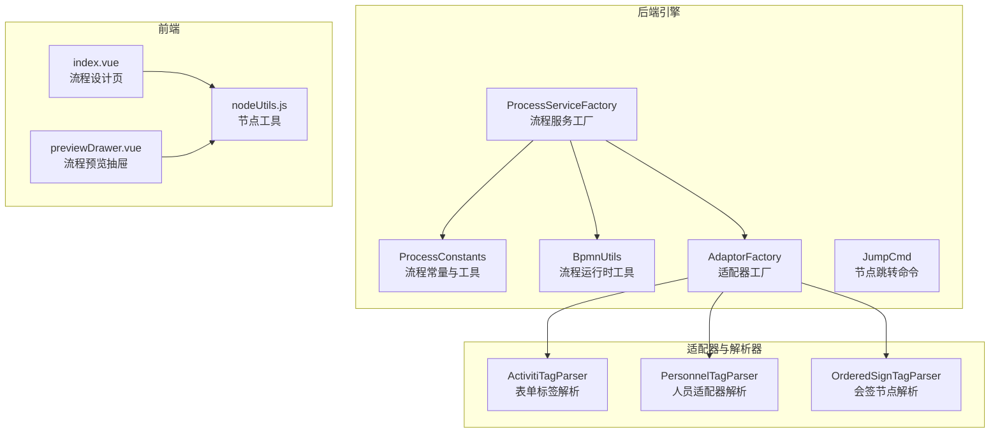
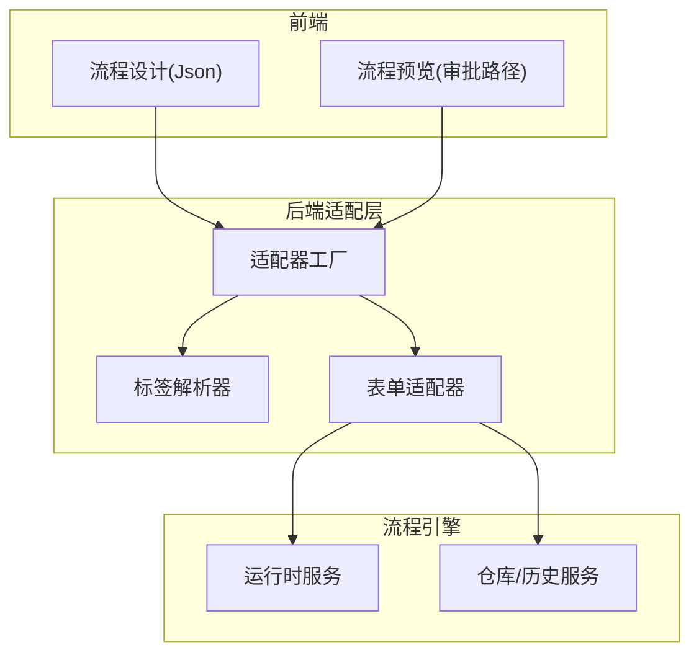
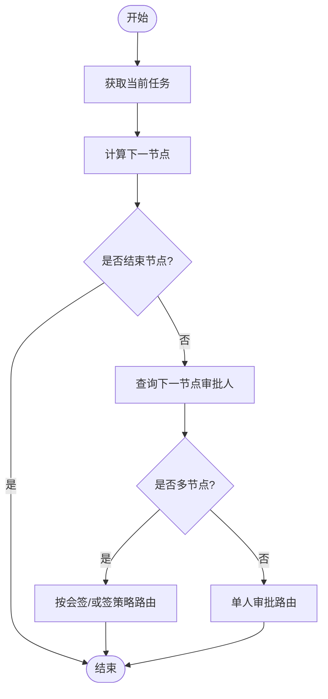
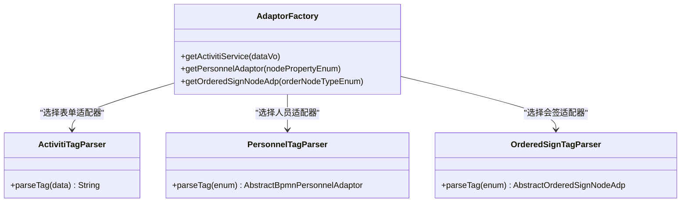
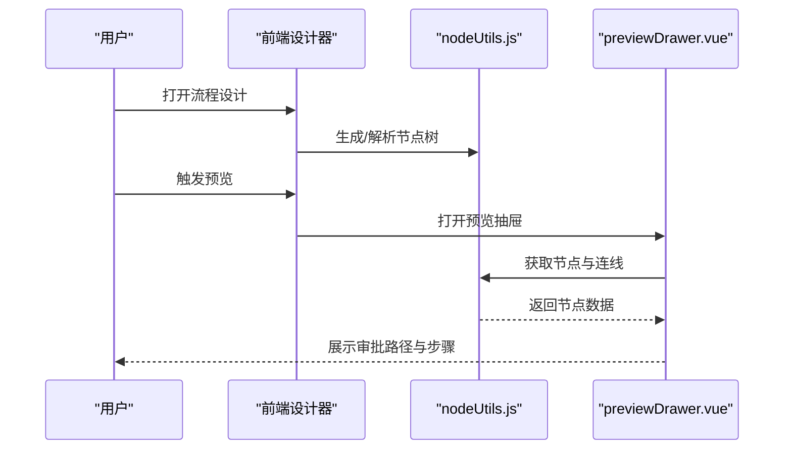
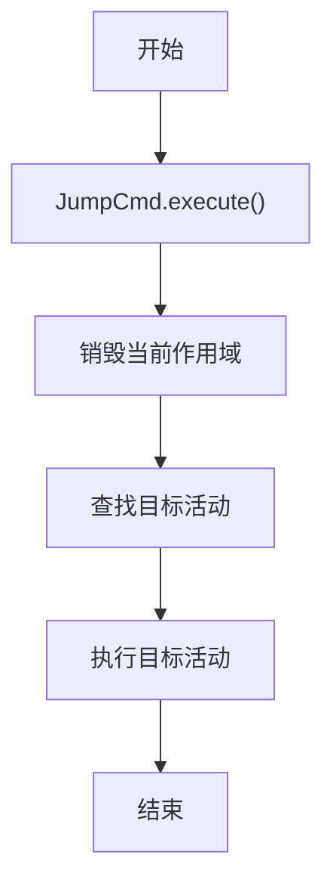
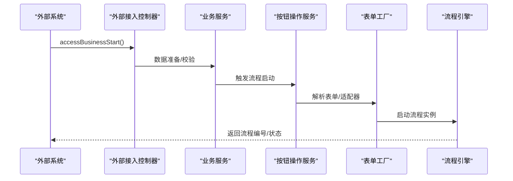
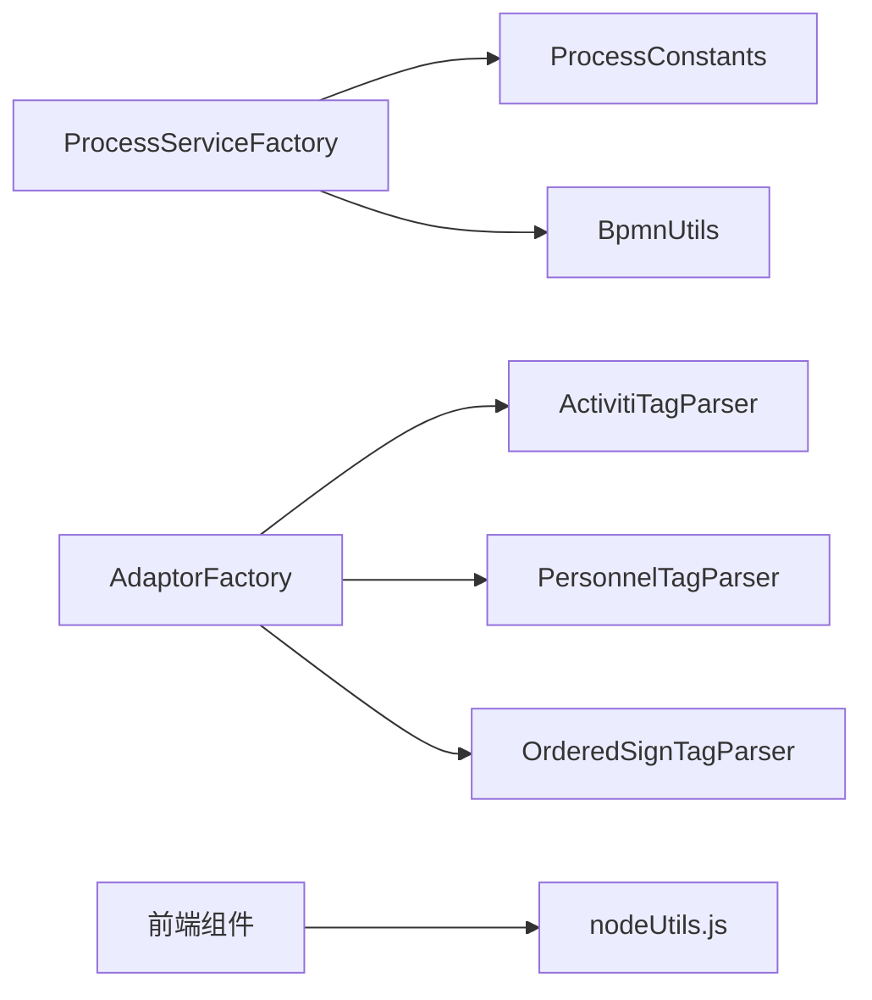

# 核心特性

<cite>
**本文档引用的文件**
- [ProcessConstants.java](file://antflow-engine/src/main/java/org/openoa/engine/bpmnconf/common/ProcessConstants.java)
- [AntFlowConstants.java](file://antflow-engine/src/main/java/org/openoa/engine/bpmnconf/constant/AntFlowConstants.java)
- [AdaptorFactory.java](file://antflow-engine/src/main/java/org/openoa/engine/factory/AdaptorFactory.java)
- [FormAdapter.java](file://antflow-engine/src/main/java/org/openoa/engine/bpmnconf/adp/FormAdapter.java)
- [BpmnUtils.java](file://antflow-engine/src/main/java/org/openoa/engine/utils/BpmnUtils.java)
- [ActivitiTagParser.java](file://antflow-engine/src/main/java/org/openoa/engine/bpmnconf/service/tagparser/ActivitiTagParser.java)
- [PersonnelTagParser.java](file://antflow-engine/src/main/java/org/openoa/engine/bpmnconf/service/tagparser/PersonnelTagParser.java)
- [OrderedSignTagParser.java](file://antflow-engine/src/main/java/org/openoa/engine/bpmnconf/service/tagparser/OrderedSignTagParser.java)
- [JumpCmd.java](file://antflow-engine/src/main/java/org/openoa/engine/bpmnconf/cmd/JumpCmd.java)
- [ProcessServiceFactory.java](file://antflow-engine/src/main/java/org/openoa/engine/bpmnconf/common/ProcessServiceFactory.java)
- [10.外部系统集成.md](file://doc/系统介绍篇/10.外部系统集成.md)
- [14.流程设计器和流程节点配置.md](file://doc/系统介绍篇/14.流程设计器和流程节点配置.md)
- [13.前端系统.md](file://doc/系统介绍篇/13.前端系统.md)
- [nodeUtils.js](file://antflow-vue/src/utils/antflow/nodeUtils.js)
- [index.vue](file://antflow-vue/src/components/Workflow/Process/index.vue)
- [previewDrawer.vue](file://antflow-vue/src/views/workflow/flowPreview/previewDrawer.vue)
</cite>

## 目录
1. [简介](#简介)
2. [项目结构](#项目结构)
3. [核心组件](#核心组件)
4. [架构总览](#架构总览)
5. [详细组件分析](#详细组件分析)
6. [依赖关系分析](#依赖关系分析)
7. [性能考量](#性能考量)
8. [故障排查指南](#故障排查指南)
9. [结论](#结论)
10. [附录](#附录)

## 简介
本文件面向希望理解 AntFlow 核心特性的用户，重点阐述以下能力与优势：
- 虚拟节点（VNode）模式的首创性与技术优势，以及如何实现流程引擎 API 无关性与业务逻辑解耦
- 超简单开发模式：通过适配器模式将“流程引擎流转业务”和“用户表单处理业务”彻底分离
- 运行时节点定义能力：在“中国式办公场景”下灵活控制流程走向
- Json 数据驱动的流程预览与审批路径设计
- 对比传统流程引擎的限制与 AntFlow 的突破性改进
- 具体使用场景与实际效果，帮助用户建立清晰的认知与价值判断

## 项目结构
AntFlow 由“后端引擎模块 + 前端设计器与预览模块 + 文档与示例”组成。后端以 Activiti 引擎为基础，通过工厂与适配器扩展流程引擎能力；前端提供可视化流程设计、预览与审批路径查看。

图示来源
- [ProcessServiceFactory.java:1-67](file://antflow-engine/src/main/java/org/openoa/engine/bpmnconf/common/ProcessServiceFactory.java#L1-L67)
- [ProcessConstants.java:1-158](file://antflow-engine/src/main/java/org/openoa/engine/bpmnconf/common/ProcessConstants.java#L1-L158)
- [BpmnUtils.java:1-235](file://antflow-engine/src/main/java/org/openoa/engine/utils/BpmnUtils.java#L1-L235)
- [AdaptorFactory.java:1-34](file://antflow-engine/src/main/java/org/openoa/engine/factory/AdaptorFactory.java#L1-L34)
- [ActivitiTagParser.java:1-16](file://antflow-engine/src/main/java/org/openoa/engine/bpmnconf/service/tagparser/ActivitiTagParser.java#L1-L16)
- [PersonnelTagParser.java:1-34](file://antflow-engine/src/main/java/org/openoa/engine/bpmnconf/service/tagparser/PersonnelTagParser.java#L1-L34)
- [OrderedSignTagParser.java:1-26](file://antflow-engine/src/main/java/org/openoa/engine/bpmnconf/service/tagparser/OrderedSignTagParser.java#L1-L26)
- [nodeUtils.js:1-42](file://antflow-vue/src/utils/antflow/nodeUtils.js#L1-L42)
- [index.vue:32-68](file://antflow-vue/src/components/Workflow/Process/index.vue#L32-L68)
- [previewDrawer.vue](file://antflow-vue/src/views/workflow/flowPreview/previewDrawer.vue)

章节来源
- [ProcessServiceFactory.java:1-67](file://antflow-engine/src/main/java/org/openoa/engine/bpmnconf/common/ProcessServiceFactory.java#L1-L67)
- [ProcessConstants.java:1-158](file://antflow-engine/src/main/java/org/openoa/engine/bpmnconf/common/ProcessConstants.java#L1-L158)
- [BpmnUtils.java:1-235](file://antflow-engine/src/main/java/org/openoa/engine/utils/BpmnUtils.java#L1-L235)
- [AdaptorFactory.java:1-34](file://antflow-engine/src/main/java/org/openoa/engine/factory/AdaptorFactory.java#L1-L34)
- [ActivitiTagParser.java:1-16](file://antflow-engine/src/main/java/org/openoa/engine/bpmnconf/service/tagparser/ActivitiTagParser.java#L1-L16)
- [PersonnelTagParser.java:1-34](file://antflow-engine/src/main/java/org/openoa/engine/bpmnconf/service/tagparser/PersonnelTagParser.java#L1-L34)
- [OrderedSignTagParser.java:1-26](file://antflow-engine/src/main/java/org/openoa/engine/bpmnconf/service/tagparser/OrderedSignTagParser.java#L1-L26)
- [nodeUtils.js:1-42](file://antflow-vue/src/utils/antflow/nodeUtils.js#L1-L42)
- [index.vue:32-68](file://antflow-vue/src/components/Workflow/Process/index.vue#L32-L68)
- [previewDrawer.vue](file://antflow-vue/src/views/workflow/flowPreview/previewDrawer.vue)

## 核心组件
- 流程服务工厂与常量：统一注入 Activiti 服务与流程常量，支撑运行时查询与控制
- 适配器工厂与解析器：通过标签解析选择具体适配器，实现“流程引擎无关”的业务扩展
- 运行时工具：提供“下一节点”“审批人”“多节点判断”等运行时能力
- 节点跳转命令：支持运行时跳转与流程控制
- 前端节点工具与预览：提供 Json 驱动的流程设计、预览与审批路径查看

章节来源
- [ProcessServiceFactory.java:1-67](file://antflow-engine/src/main/java/org/openoa/engine/bpmnconf/common/ProcessServiceFactory.java#L1-L67)
- [AntFlowConstants.java:1-92](file://antflow-engine/src/main/java/org/openoa/engine/bpmnconf/constant/AntFlowConstants.java#L1-L92)
- [AdaptorFactory.java:1-34](file://antflow-engine/src/main/java/org/openoa/engine/factory/AdaptorFactory.java#L1-L34)
- [BpmnUtils.java:1-235](file://antflow-engine/src/main/java/org/openoa/engine/utils/BpmnUtils.java#L1-L235)
- [JumpCmd.java:1-35](file://antflow-engine/src/main/java/org/openoa/engine/bpmnconf/cmd/JumpCmd.java#L1-L35)

## 架构总览
AntFlow 在“流程引擎之上”构建了“业务适配层”，通过工厂与解析器将“流程引擎 API 无关化”，并将“表单处理业务”与“流程流转业务”解耦。前端以 Json 驱动的方式完成流程设计与预览，形成“所见即所得”的中国式办公体验。

图示来源
- [AdaptorFactory.java:1-34](file://antflow-engine/src/main/java/org/openoa/engine/factory/AdaptorFactory.java#L1-L34)
- [ActivitiTagParser.java:1-16](file://antflow-engine/src/main/java/org/openoa/engine/bpmnconf/service/tagparser/ActivitiTagParser.java#L1-L16)
- [PersonnelTagParser.java:1-34](file://antflow-engine/src/main/java/org/openoa/engine/bpmnconf/service/tagparser/PersonnelTagParser.java#L1-L34)
- [OrderedSignTagParser.java:1-26](file://antflow-engine/src/main/java/org/openoa/engine/bpmnconf/service/tagparser/OrderedSignTagParser.java#L1-L26)
- [ProcessServiceFactory.java:1-67](file://antflow-engine/src/main/java/org/openoa/engine/bpmnconf/common/ProcessServiceFactory.java#L1-L67)

## 详细组件分析

### 虚拟节点（VNode）模式与运行时节点定义
- 设计思想：前端以“节点树”描述流程，节点属性通过 Json 表达；后端通过工具类与运行时服务解析并执行
- 运行时能力：根据当前任务定位下一节点、计算下一节点审批人、识别多节点（会签/或签/顺序会签）
- 中国式场景：支持“加批”“部门领导”“HRBP/HRLeader”等常见角色与审批方式

图示来源
- [BpmnUtils.java:72-180](file://antflow-engine/src/main/java/org/openoa/engine/utils/BpmnUtils.java#L72-L180)
- [ProcessConstants.java:44-83](file://antflow-engine/src/main/java/org/openoa/engine/bpmnconf/common/ProcessConstants.java#L44-L83)

章节来源
- [BpmnUtils.java:1-235](file://antflow-engine/src/main/java/org/openoa/engine/utils/BpmnUtils.java#L1-L235)
- [ProcessConstants.java:1-158](file://antflow-engine/src/main/java/org/openoa/engine/bpmnconf/common/ProcessConstants.java#L1-L158)
- [AntFlowConstants.java:1-92](file://antflow-engine/src/main/java/org/openoa/engine/bpmnconf/constant/AntFlowConstants.java#L1-L92)
- [nodeUtils.js:1-42](file://antflow-vue/src/utils/antflow/nodeUtils.js#L1-L42)

### 适配器模式：流程引擎 API 无关性与业务解耦
- 适配器工厂：集中管理不同类型的适配器（表单、人员、会签节点），通过注解与标签解析选择具体实现
- 表单适配器：将“业务数据”与“流程引擎 API”解耦，业务侧只需关注数据契约
- 人员与会签解析：根据节点类型与业务枚举动态选择适配器，避免硬编码

图示来源
- [AdaptorFactory.java:1-34](file://antflow-engine/src/main/java/org/openoa/engine/factory/AdaptorFactory.java#L1-L34)
- [ActivitiTagParser.java:1-16](file://antflow-engine/src/main/java/org/openoa/engine/bpmnconf/service/tagparser/ActivitiTagParser.java#L1-L16)
- [PersonnelTagParser.java:1-34](file://antflow-engine/src/main/java/org/openoa/engine/bpmnconf/service/tagparser/PersonnelTagParser.java#L1-L34)
- [OrderedSignTagParser.java:1-26](file://antflow-engine/src/main/java/org/openoa/engine/bpmnconf/service/tagparser/OrderedSignTagParser.java#L1-L26)

章节来源
- [AdaptorFactory.java:1-34](file://antflow-engine/src/main/java/org/openoa/engine/factory/AdaptorFactory.java#L1-L34)
- [ActivitiTagParser.java:1-16](file://antflow-engine/src/main/java/org/openoa/engine/bpmnconf/service/tagparser/ActivitiTagParser.java#L1-L16)
- [PersonnelTagParser.java:1-34](file://antflow-engine/src/main/java/org/openoa/engine/bpmnconf/service/tagparser/PersonnelTagParser.java#L1-L34)
- [OrderedSignTagParser.java:1-26](file://antflow-engine/src/main/java/org/openoa/engine/bpmnconf/service/tagparser/OrderedSignTagParser.java#L1-L26)
- [FormAdapter.java:1-81](file://antflow-engine/src/main/java/org/openoa/engine/bpmnconf/adp/FormAdapter.java#L1-L81)

### Json 数据驱动的流程预览与审批路径设计
- 前端流程设计：以 Json 结构表达节点、连线、属性，支持“至少一个审批节点”“并行聚合器”“条件并行”等校验
- 预览抽屉：提供“基础信息/流程步骤/审批记录/流程预览”标签页，按需加载，提升交互效率
- 审批路径：基于运行时工具计算下一节点与审批人，直观展示审批走向

图示来源
- [index.vue:32-68](file://antflow-vue/src/components/Workflow/Process/index.vue#L32-L68)
- [nodeUtils.js:1-42](file://antflow-vue/src/utils/antflow/nodeUtils.js#L1-L42)
- [previewDrawer.vue](file://antflow-vue/src/views/workflow/flowPreview/previewDrawer.vue)

章节来源
- [14.流程设计器和流程节点配置.md:313-351](file://doc/系统介绍篇/14.流程设计器和流程节点配置.md#L313-L351)
- [13.前端系统.md:184-233](file://doc/系统介绍篇/13.前端系统.md#L184-L233)
- [index.vue:32-68](file://antflow-vue/src/components/Workflow/Process/index.vue#L32-L68)
- [nodeUtils.js:1-42](file://antflow-vue/src/utils/antflow/nodeUtils.js#L1-L42)
- [previewDrawer.vue](file://antflow-vue/src/views/workflow/flowPreview/previewDrawer.vue)

### 运行时节点跳转与流程控制
- 节点跳转命令：通过销毁当前作用域并执行目标活动，实现“跳转至任意节点”的运行时控制
- 适用场景：撤销、回退、重新路由等复杂流程控制需求

图示来源
- [JumpCmd.java:1-35](file://antflow-engine/src/main/java/org/openoa/engine/bpmnconf/cmd/JumpCmd.java#L1-L35)

章节来源
- [JumpCmd.java:1-35](file://antflow-engine/src/main/java/org/openoa/engine/bpmnconf/cmd/JumpCmd.java#L1-L35)

### 外部系统集成与 API 无关性
- 外部流程生命周期：通过标准化 API 启动与管理流程，内部通过按钮操作与表单工厂解耦引擎细节
- 数据契约：统一的业务数据对象承载外部系统与内部引擎的数据映射

图示来源
- [10.外部系统集成.md:100-248](file://doc/系统介绍篇/10.外部系统集成.md#L100-L248)

章节来源
- [10.外部系统集成.md:100-248](file://doc/系统介绍篇/10.外部系统集成.md#L100-L248)

## 依赖关系分析
- 组件内聚与解耦：流程服务工厂统一注入引擎服务；适配器工厂与解析器负责“业务到引擎”的映射
- 外部依赖：前端依赖 Vue 与 Element Plus；后端依赖 Activiti 引擎与 Spring 上下文
- 可能的循环依赖：适配器解析器通过 Spring Bean 查找，避免直接强耦合

图示来源
- [ProcessServiceFactory.java:1-67](file://antflow-engine/src/main/java/org/openoa/engine/bpmnconf/common/ProcessServiceFactory.java#L1-L67)
- [ProcessConstants.java:1-158](file://antflow-engine/src/main/java/org/openoa/engine/bpmnconf/common/ProcessConstants.java#L1-L158)
- [BpmnUtils.java:1-235](file://antflow-engine/src/main/java/org/openoa/engine/utils/BpmnUtils.java#L1-L235)
- [AdaptorFactory.java:1-34](file://antflow-engine/src/main/java/org/openoa/engine/factory/AdaptorFactory.java#L1-L34)
- [ActivitiTagParser.java:1-16](file://antflow-engine/src/main/java/org/openoa/engine/bpmnconf/service/tagparser/ActivitiTagParser.java#L1-L16)
- [PersonnelTagParser.java:1-34](file://antflow-engine/src/main/java/org/openoa/engine/bpmnconf/service/tagparser/PersonnelTagParser.java#L1-L34)
- [OrderedSignTagParser.java:1-26](file://antflow-engine/src/main/java/org/openoa/engine/bpmnconf/service/tagparser/OrderedSignTagParser.java#L1-L26)
- [nodeUtils.js:1-42](file://antflow-vue/src/utils/antflow/nodeUtils.js#L1-L42)

## 性能考量
- 运行时查询优化：通过缓存与懒加载减少对引擎的频繁查询
- 前端渲染优化：按需加载预览标签页，避免一次性渲染大量节点
- 适配器解析：利用 Spring Bean 容器按需解析，避免重复初始化

## 故障排查指南
- 无法获取下一节点：检查当前任务是否存在、流程定义是否正确、节点连线是否完整
- 审批人为空：确认变量配置（单人/多人/报名）是否正确设置，节点 ID 是否匹配
- 多节点策略异常：核对会签/或签/顺序会签配置，确保人数与策略一致
- 外部接入失败：检查凭证与表单代码、业务数据对象字段映射、按钮操作服务链路

章节来源
- [BpmnUtils.java:133-180](file://antflow-engine/src/main/java/org/openoa/engine/utils/BpmnUtils.java#L133-L180)
- [ProcessConstants.java:137-156](file://antflow-engine/src/main/java/org/openoa/engine/bpmnconf/common/ProcessConstants.java#L137-L156)
- [10.外部系统集成.md:100-248](file://doc/系统介绍篇/10.外部系统集成.md#L100-L248)

## 结论
AntFlow 通过“虚拟节点（VNode）模式 + 适配器工厂 + Json 驱动”的组合，实现了：
- 流程引擎 API 无关性与业务逻辑解耦
- 超简单开发模式：流程与表单处理彻底分离
- 中国式办公场景下的灵活运行时控制与审批路径可视化
- 对比传统引擎，AntFlow 更易用、可扩展、可维护，适合快速落地与持续演进

## 附录
- 使用场景建议
  - 快速搭建审批流：使用 Json 设计器与预览，一键生成流程
  - 外部系统对接：通过标准化 API 与业务数据对象，快速集成
  - 复杂路由控制：结合运行时跳转与多节点策略，满足多样化办公需求
- 实际效果
  - 设计师与开发者协作更高效
  - 审批路径一目了然，降低沟通成本
  - 支持多数据库与多租户，满足企业级扩展